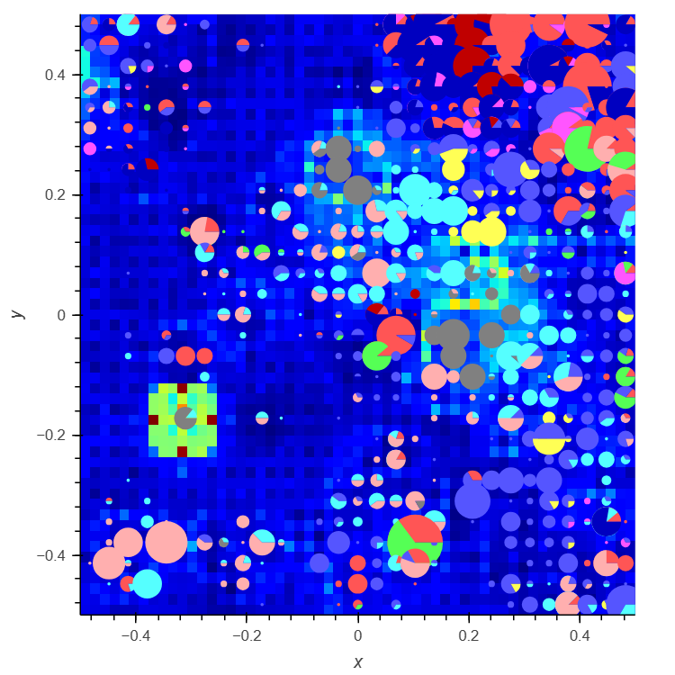

Authors

Vinzent Beer - 12410094
Stefan Hamm - 12346011

# Dataset
##  Select a data set from the OpenML Machine Learning Repository 

(http://www.openml.org) with the
following requirements:<br>
a. minimum 1000 instances,<br>
b. minimum 20 attributes,<br>
c. minimum 4 class labels (for visualizing class distributions on the map).<br>
Alternatively, you can also<br>


## Register the dataset you picked with your group number in the TUWEL Wiki.<br>
 You must make sure<br>
that your dataset is unique, i.e. no two groups may take the same data set! (first come, first serve -<br>
do it early to get a data set that you also find interesting to work.)<br>

## Create a machine-actionable description of the dataset following Croissant / Schema.org<br>
descriptions for datasets (c.f. Croissant: https://neurips.cc/virtual/2024/poster/97627,<br>
https://docs.mlcommons.org/croissant/docs/croissant-spec.html; schema.org:<br>
https://schema.org/Dataset, c.f. the JSON example provided at https://schema.org/Dataset#eg-0478)<br>


-> SEE corissantt_ctg.json <br>

## Analyze and describe the characteristics of the dataset (size, attribute types as discussed in class,<br>
value ranges, sparsity, min/max values, outliers, missing values, correlations, ...), and describe this<br>
in the report. Also, describe any hypotheses you might have concerning the distribution of the data,<br>
number of clusters and their relationship, majority/minority classes.<br>

## Analyzing the dataset

The dataset we chose is related to the paper SisPorto 2.0: a program for automated analysis of cardiotocograms  (https://pubmed.ncbi.nlm.nih.gov/11132590/), which proposes a system to analyze cardiotocograms. 

A cardiotocogram (CTG) is the graphical representation produced during cardiotocography monitoring. 

Ayres de Campos et al. (2000) SisPorto 2.0 A Program for Automated Analysis of Cardiotocograms. J Matern Fetal Med 5:311-318

### Dataset description from the source
2126 fetal cardiotocograms (CTGs) were automatically processed and the respective diagnostic features measured. The CTGs were also classified by three expert obstetricians and a consensus classification label assigned to each of them. Classification was both with respect to a morphologic pattern (A, B, C. ...) and to a fetal state (N, S, P). Therefore the dataset can be used either for 10-class or 3-class experiments.


We will be using the morphologic patterns as the target classes to end up with a 10-class experiment.

### Cardiotography
Cardiotocography, also known as electronic fetal monitoring (EFM), is a medical technique used to monitor both the fetal heart rate and uterine contractions during pregnancy and labor.


### Feature descriptions:
Attribute Information:

- LB - FHR baseline (beats per minute)
- AC - # of accelerations per second
- FM - # of fetal movements per second
- UC - # of uterine contractions per second
- DL - # of light decelerations per second
- DS - # of severe decelerations per second
- DP - # of prolongued decelerations per second
- ASTV - percentage of time with abnormal short term variability
- MSTV - mean value of short term variability
- ALTV - percentage of time with abnormal long term variability
- MLTV - mean value of long term variability
- Width - width of FHR histogram
- Min - minimum of FHR histogram
- Max - Maximum of FHR histogram
- Nmax - # of histogram peaks
- Nzeros - # of histogram zeros
- Mode - histogram mode
- Mean - histogram mean
- Median - histogram median
- Variance - histogram variance
- Tendency - histogram tendency
- CLASS - FHR pattern class code (1 to 10)
- NSP - fetal state class code (N=normal; S=suspect; P=pathologic)

### Arff inaccuracies
The feature descriptions in the arff file don't exactly match, since the features are unnamed and there are more of them than described. Guesstimately, the class also got one-hot encoded


```python

```

# Preprocessing: 

Get the data into the form needed for training SOMs. Describe your preprocessing<br>
steps (e.g. transcoding, scaling), why you did it and how you did it. Specifically, if your dataset turns<br>
out to be extremely large (very high-dimensional and huge number of vectors so that it does not fit<br>
into memory for training SOMs) you may choose to apply subsampling for the training data.<br>

## Preprocessing and implementation: 
We spent a lot of time getting very bad results and we were, after lots of thinking, able to narrow them down to two factors:
The dataset provided 11 extra columns, 10 of those for one hot-encoding the class even though it was already present as a categorical value anyways.
When preprocessing, we first decided to go for min-max scaling the values between 0 and 1.
After many debugging steps, we found out that we were getting wonky results because of the scaling . We switched to doing z-score scaling after discovering that this could be a factor, and this fixed our problems and made the results somewhat usable. 


```python
## TODO LOADING AND PREPROCESSING THE DATA
from scipy.io import arff
import pandas as pd

data, meta = arff.loadarff('./cardiotography.arff')

df = pd.DataFrame(data)
```


```python

class_distribution = df['Class'].value_counts()
class_distribution_percentage = df['Class'].value_counts(normalize=True) * 100

# Combine both counts and percentages into one DataFrame
class_distribution_df = pd.DataFrame({
    'Count': class_distribution,
    'Percentage': class_distribution_percentage
})

print(class_distribution_df)

#print(meta)

#df.info()

#meta.names
```

           Count  Percentage
    b'2'     579   27.234243
    b'1'     384   18.062088
    b'6'     332   15.616181
    b'7'     252   11.853246
    b'10'    197    9.266228
    b'8'     107    5.032926
    b'4'      81    3.809972
    b'5'      72    3.386642
    b'9'      69    3.245532
    b'3'      53    2.492944


Class distribution shows quite some imbalance witth only 4 classes having more than 70 % of the data.


```python
feature_names = [attr[0] for attr in meta.names()]  # Correctly extract attribute names
#print("\nFeature Names From Metadata:\n", feature_names)
```


```python
df.describe()
```


<div>
<style scoped>
    .dataframe tbody tr th:only-of-type {
        vertical-align: middle;
    }

    .dataframe tbody tr th {
        vertical-align: top;
    }

    .dataframe thead th {
        text-align: right;
    }
</style>
<table border="1" class="dataframe">
  <thead>
    <tr style="text-align: right;">
      <th></th>
      <th>V1</th>
      <th>V2</th>
      <th>V3</th>
      <th>V4</th>
      <th>V5</th>
      <th>V6</th>
      <th>V7</th>
      <th>V8</th>
      <th>V9</th>
      <th>V10</th>
      <th>...</th>
      <th>V26</th>
      <th>V27</th>
      <th>V28</th>
      <th>V29</th>
      <th>V30</th>
      <th>V31</th>
      <th>V32</th>
      <th>V33</th>
      <th>V34</th>
      <th>V35</th>
    </tr>
  </thead>
  <tbody>
    <tr>
      <th>count</th>
      <td>2126.000000</td>
      <td>2126.000000</td>
      <td>2126.000000</td>
      <td>2126.000000</td>
      <td>2126.000000</td>
      <td>2126.000000</td>
      <td>2126.000000</td>
      <td>2126.000000</td>
      <td>2126.000000</td>
      <td>2126.000000</td>
      <td>...</td>
      <td>2126.000000</td>
      <td>2126.000000</td>
      <td>2126.000000</td>
      <td>2126.000000</td>
      <td>2126.000000</td>
      <td>2126.000000</td>
      <td>2126.000000</td>
      <td>2126.000000</td>
      <td>2126.000000</td>
      <td>2126.000000</td>
    </tr>
    <tr>
      <th>mean</th>
      <td>25.122766</td>
      <td>878.439793</td>
      <td>1702.877234</td>
      <td>133.303857</td>
      <td>133.303857</td>
      <td>2.722484</td>
      <td>7.241298</td>
      <td>3.659925</td>
      <td>46.990122</td>
      <td>1.332785</td>
      <td>...</td>
      <td>0.180621</td>
      <td>0.272342</td>
      <td>0.024929</td>
      <td>0.038100</td>
      <td>0.033866</td>
      <td>0.156162</td>
      <td>0.118532</td>
      <td>0.050329</td>
      <td>0.032455</td>
      <td>0.092662</td>
    </tr>
    <tr>
      <th>std</th>
      <td>15.241753</td>
      <td>894.084748</td>
      <td>930.919143</td>
      <td>9.840844</td>
      <td>9.840844</td>
      <td>3.560850</td>
      <td>37.125309</td>
      <td>2.847094</td>
      <td>17.192814</td>
      <td>0.883241</td>
      <td>...</td>
      <td>0.384794</td>
      <td>0.445270</td>
      <td>0.155947</td>
      <td>0.191482</td>
      <td>0.180928</td>
      <td>0.363094</td>
      <td>0.323314</td>
      <td>0.218675</td>
      <td>0.177248</td>
      <td>0.290027</td>
    </tr>
    <tr>
      <th>min</th>
      <td>1.000000</td>
      <td>0.000000</td>
      <td>287.000000</td>
      <td>106.000000</td>
      <td>106.000000</td>
      <td>0.000000</td>
      <td>0.000000</td>
      <td>0.000000</td>
      <td>12.000000</td>
      <td>0.200000</td>
      <td>...</td>
      <td>0.000000</td>
      <td>0.000000</td>
      <td>0.000000</td>
      <td>0.000000</td>
      <td>0.000000</td>
      <td>0.000000</td>
      <td>0.000000</td>
      <td>0.000000</td>
      <td>0.000000</td>
      <td>0.000000</td>
    </tr>
    <tr>
      <th>25%</th>
      <td>10.000000</td>
      <td>55.000000</td>
      <td>1009.000000</td>
      <td>126.000000</td>
      <td>126.000000</td>
      <td>0.000000</td>
      <td>0.000000</td>
      <td>1.000000</td>
      <td>32.000000</td>
      <td>0.700000</td>
      <td>...</td>
      <td>0.000000</td>
      <td>0.000000</td>
      <td>0.000000</td>
      <td>0.000000</td>
      <td>0.000000</td>
      <td>0.000000</td>
      <td>0.000000</td>
      <td>0.000000</td>
      <td>0.000000</td>
      <td>0.000000</td>
    </tr>
    <tr>
      <th>50%</th>
      <td>29.000000</td>
      <td>538.000000</td>
      <td>1241.000000</td>
      <td>133.000000</td>
      <td>133.000000</td>
      <td>1.000000</td>
      <td>0.000000</td>
      <td>3.000000</td>
      <td>49.000000</td>
      <td>1.200000</td>
      <td>...</td>
      <td>0.000000</td>
      <td>0.000000</td>
      <td>0.000000</td>
      <td>0.000000</td>
      <td>0.000000</td>
      <td>0.000000</td>
      <td>0.000000</td>
      <td>0.000000</td>
      <td>0.000000</td>
      <td>0.000000</td>
    </tr>
    <tr>
      <th>75%</th>
      <td>39.000000</td>
      <td>1521.000000</td>
      <td>2434.750000</td>
      <td>140.000000</td>
      <td>140.000000</td>
      <td>4.000000</td>
      <td>2.000000</td>
      <td>5.000000</td>
      <td>61.000000</td>
      <td>1.700000</td>
      <td>...</td>
      <td>0.000000</td>
      <td>1.000000</td>
      <td>0.000000</td>
      <td>0.000000</td>
      <td>0.000000</td>
      <td>0.000000</td>
      <td>0.000000</td>
      <td>0.000000</td>
      <td>0.000000</td>
      <td>0.000000</td>
    </tr>
    <tr>
      <th>max</th>
      <td>48.000000</td>
      <td>3296.000000</td>
      <td>3599.000000</td>
      <td>160.000000</td>
      <td>160.000000</td>
      <td>26.000000</td>
      <td>564.000000</td>
      <td>23.000000</td>
      <td>87.000000</td>
      <td>7.000000</td>
      <td>...</td>
      <td>1.000000</td>
      <td>1.000000</td>
      <td>1.000000</td>
      <td>1.000000</td>
      <td>1.000000</td>
      <td>1.000000</td>
      <td>1.000000</td>
      <td>1.000000</td>
      <td>1.000000</td>
      <td>1.000000</td>
    </tr>
  </tbody>
</table>
<p>8 rows × 35 columns</p>
</div>


```python
feature_names = [
    "LB", "AC", "FM", "UC", "DL", "DS", "DP", "ASTV", "MSTV", "ALTV",
    "MLTV", "Width", "Min", "Max", "Nmax", "Nzeros", "Mode", "Mean",
    "Median", "Variance", "Tendency", "V22", "V23", "V24",
    "V25", "V26", "V27", "V28", "V29", "V30", "V31", "V32", "V33", "V34", "V35", "CLASS",
]
df.columns = feature_names
```

Remove missing values and duplicates as a standadrd preprocessing step. Also drop the one-hot encoded columns of the target class.


```python
#standard preprocessing for the DataFrame 
def preprocess_data(df):
    # Drop rows with missing values
    df = df.dropna()
    # Drop duplicate rows
    df = df.drop_duplicates()
    # Drop columns with constant values
    df = df.loc[:, (df != df.iloc[0]).any()]
    #drop the columns that appear to just be one hot encoding for the class anyways and for the 3 class problem
    df.drop(columns=["V25","V26", "V27", "V28", "V29", "V30", "V31", "V32", "V33", "V34", "V35"], inplace=True)
    return df   
```

Checkout if some features are correlated.


```python
df = preprocess_data(df)
#df.info()
import matplotlib.pyplot as plt
import seaborn as sns
def get_corr_matrix(df):
    plt.figure(figsize=(10, 8))
    sns.heatmap(df.corr(),)
    plt.title("Correlation Matrix")
    plt.show()

get_corr_matrix(df)
#print(df["Class"].value_counts())
```


    

    


# C) SOM Training and Analysis

## 1) Train a reasonably sized „regular“ SOM


```python
from minisom import MiniSom
from sklearn.datasets import load_iris
import numpy as np
from pysomvis import PySOMVis
import pandas as pd
from scipy.io import arff
def calculate_som_size(data_size, fraction=0.1):
    """Calculate SOM dimensions based on the dataset size."""
    # Calculate the total number of units based on the data size and fraction
    total_units = int(data_size * fraction)
    # Use the square root to determine SOM dimensions (assumes a square grid)
    som_dim = int(np.sqrt(total_units))
    return som_dim, som_dim

def train_som(dataloader, **params):
    """
    Train a Self-Organizing Map (SOM) with specified parameters.

    Parameters:
    - dataloader (function): A function that returns the dataset. The dataset should have 
      'data' (features) and 'target' (labels) attributes.
    - size_fraction (float): Fraction of the dataset used to calculate the SOM size (default is 0.1).
    - sigma (float): The neighborhood radius used for the SOM (default is 1.0). Controls how far 
      neighboring neurons will be affected by the learning process.
    - learning_rate (float): The learning rate for the SOM (default is 0.5). It determines how 
      much the weights of the SOM are adjusted during training.
    - num_iterations (int): The number of iterations to train the SOM (default is 1000).
    - random_seed (int, optional): The random seed for initializing the SOM. If None, a random seed is used.
      Providing a fixed value ensures reproducibility.
    - neighborhood_function (str): The type of neighborhood function used for training ('gaussian' is default).
      This determines the shape of the neighborhood that is affected during training.

    Returns:
    - som (MiniSom): The trained SOM object.
    - X (array): The input features used for training.
    - y (array): The target labels corresponding to the input features.
    - class_names (array): The class names of the target labels.
    """
    
    # Load dataset using the provided dataloader function
    data = dataloader()
    X = data.data  # Extract the data (already normalized by the dataloader)
    y = data.target
    class_names = data.target_names

    # Calculate SOM size based on the number of data points and specified fraction
    som_x, som_y = calculate_som_size(len(X), fraction=params.get('size_fraction', 0.1))

    # Get the dimensionality of the input data (number of features per data point)
    input_len = X.shape[1]

    # Initialize SOM with the calculated dimensions and other specified parameters
    som = MiniSom(som_x, som_y, input_len, 
                  sigma=params.get('sigma', 1.0),  # Neighborhood radius
                  learning_rate=params.get('learning_rate', 0.5),  # Learning rate
                  neighborhood_function=params.get('neighborhood_function', 'gaussian'),  # Neighborhood function
                  random_seed=params.get('random_seed', None))  # Random seed for initialization

    # Train the SOM using the normalized data and specified number of iterations
    som.train(X, params.get('num_iterations', 1000))

    # Return trained SOM and the input data
    return som, X, y, class_names

def iris_dataloader():
    """Load and normalize Iris dataset."""
    data = load_iris()
    # Normalize data to range [0, 1]
    data.data = (data.data - data.data.min(axis=0)) / (data.data.max(axis=0) - data.data.min(axis=0))
    return data

def cardiotography_dataloader():
    """Load and normalize Cardiotography dataset."""
    data, meta = arff.loadarff('datasets/cardiotography/cardiotography.arff')
    df = pd.DataFrame(data)


    df = preprocess_data(df)
    #split df into data and target
    data = df.iloc[:, :-1].values
    target = df.iloc[:, -1].values
    target = target.astype(int)
    target = target - 1
    
    
    # Normalize data to range [0, 1]
    #df = (df - df.min(axis=0)) / (df.max(axis=0) - df.min(axis=0))
    #normalize only the data columns min max scaling
    #data = (data - data.min(axis=0)) / (data.max(axis=0) - data.min(axis=0))
    #scale using z score scaling
    data = (data - data.mean(axis=0)) / (data.std(axis=0) + 1e-8)

  
    if np.isnan(data).any():
        raise ValueError("NaN values detected in the dataset after normalization.")
    
    class Data():
        def __init__(self, data, target):
            self.data = data
            self.target = target
            self.target_names = np.array(df.columns)
    
    # data are columns from 0 except the last one
    # target is the last column
    return Data(data, target)


def calculate_som_metadata(som, X, y, class_names, compact_output = True):
  
    metadata = {}

    # 1. Quantization Error
    metadata['quantization_error'] = som.quantization_error(X)

    # 2. Topographic Error
    metadata['topographic_error'] = som.topographic_error(X)

    # 3. Best Matching Units (BMUs)
    metadata['bmus'] = [som.winner(x) for x in X]
    metadata['bmu_indices'] = [np.ravel_multi_index(bmu, som.get_weights().shape[:2]) for bmu in metadata['bmus']]

    # 4. Neuron Weights
    metadata['neuron_weights'] = som.get_weights()

    # 5. Node Counts (Hit Map)
    metadata['node_counts'] = np.zeros(som.get_weights().shape[:2], dtype=int)
    for bmu in metadata['bmus']:
        metadata['node_counts'][bmu] += 1
 

    if compact_output:
        print("--- SOM Metadata ---")
        print(f"Quantization Error: {metadata['quantization_error']:.4f}")
        print(f"Topographic Error:  {metadata['topographic_error']:.4f}")

        return None
    else:
        return metadata

    
    
```


<style>.bk-root, .bk-root .bk:before, .bk-root .bk:after {
  font-family: var(--jp-ui-font-size1);
  font-size: var(--jp-ui-font-size1);
  color: var(--jp-ui-font-color1);
}
</style>


<div class="logo-block">
<img src='data:image/png;base64,iVBORw0KGgoAAAANSUhEUgAAAEAAAABACAYAAACqaXHeAAAABHNCSVQICAgIfAhkiAAAAAlwSFlz
AAAB+wAAAfsBxc2miwAAABl0RVh0U29mdHdhcmUAd3d3Lmlua3NjYXBlLm9yZ5vuPBoAAA6zSURB
VHic7ZtpeFRVmsf/5966taWqUlUJ2UioBBJiIBAwCZtog9IOgjqACsogKtqirT2ttt069nQ/zDzt
tI4+CrJIREFaFgWhBXpUNhHZQoKBkIUASchWla1S+3ar7r1nPkDaCAnZKoQP/D7mnPOe9/xy76n3
nFSAW9ziFoPFNED2LLK5wcyBDObkb8ZkxuaoSYlI6ZcOKq1eWFdedqNzGHQBk9RMEwFAASkk0Xw3
ETacDNi2vtvc7L0ROdw0AjoSotQVkKSvHQz/wRO1lScGModBFbDMaNRN1A4tUBCS3lk7BWhQkgpD
lG4852/+7DWr1R3uHAZVQDsbh6ZPN7CyxUrCzJMRouusj0ipRwD2uKm0Zn5d2dFwzX1TCGhnmdGo
G62Nna+isiUqhkzuKrkQaJlPEv5mFl2fvGg2t/VnzkEV8F5ioioOEWkLG86fvbpthynjdhXYZziQ
x1hC9J2NFyi8vCTt91Fh04KGip0AaG9zuCk2wQCVyoNU3Hjezee9bq92duzzTmxsRJoy+jEZZZYo
GTKJ6SJngdJqAfRzpze0+jHreUtPc7gpBLQnIYK6BYp/uGhw9YK688eu7v95ysgshcg9qSLMo3JC
4jqLKQFBgdKDPoQ+Pltb8dUyQLpeDjeVgI6EgLIQFT5tEl3rn2losHVsexbZ3EyT9wE1uGdkIPcy
BGxn8QUq1QrA5nqW5i2tLqvrrM9NK6AdkVIvL9E9bZL/oyfMVd/jqvc8LylzRBKDJSzIExwhQzuL
QYGQj4rHfFTc8mUdu3E7yoLtbTe9gI4EqVgVkug2i5+uXGo919ixbRog+3fTbQ8qJe4ZOYNfMoTI
OoshUNosgO60AisX15aeI2PSIp5KiFLI9ubb1vV3Qb2ltwLakUCDAkWX7/nHKRmmGIl9VgYsUhJm
2NXjKYADtM1ygne9QQDIXlk49FBstMKx66D1v4+XuQr7vqTe0VcBHQlRWiOCbmmSYe2SqtL6q5rJ
zsTb7lKx3FKOYC4DoqyS/B5bvLPxvD9Qtf6saxYLQGJErmDOdOMr/zo96km1nElr8bmPOBwI9COv
HnFPRIwmkSOv9kcAS4heRsidOkpeWBgZM+UBrTFAXNYL5Vf2ii9c1trNzpYdaoVil3WIc+wdk+gQ
noie3ecCcxt9ITcLAPWt/laGEO/9U6PmzZkenTtsSMQ8uYywJVW+grCstAvCIaAdArAsIWkRDDs/
KzLm2YcjY1Lv0UdW73HabE9n6V66cxSzfEmuJssTpKGVp+0vHq73FwL46eOjpMpbRAnNmJFrGJNu
Ukf9Yrz+3rghiumCKNXXWPhLYcjxGsIpoCMsIRoFITkW8AuyM8jC1+/QLx4bozCEJIq38+1rtpR6
V/yzb8eBlRb3fo5l783N0CWolAzJHaVNzkrTzlEp2bQ2q3TC5gn6wpnoQAmwSiGh2GitnTmVMc5O
UyfKWUKCIsU7+fZDKwqdT6DDpvkzAX4/+AMFjk0tDp5GRXLpQ2MUmhgDp5gxQT8+Y7hyPsMi8uxF
71H0oebujHALECjFKaW9Lm68n18wXp2kVzIcABytD5iXFzg+WVXkegpAsOOYziqo0OkK76GyquC3
ltZAzMhhqlSNmmWTE5T6e3IN05ITFLM4GdN0vtZ3ob8Jh1NAKXFbm5PtLU/eqTSlGjkNAJjdgn/N
aedXa0tdi7+t9G0FIF49rtMSEgAs1kDLkTPO7ebm4IUWeyh1bKomXqlgMG6kJmHcSM0clYLJ8XtR
1GTnbV3F6I5wCGikAb402npp1h1s7LQUZZSMIfALFOuL3UUrfnS8+rez7v9qcold5tilgHbO1fjK
9ubb17u9oshxzMiUBKXWqJNxd+fqb0tLVs4lILFnK71H0Ind7uiPgACVcFJlrb0tV6DzxqqTIhUM
CwDf1/rrVhTa33/3pGPxJYdQ2l2cbgVcQSosdx8uqnDtbGjh9SlDVSMNWhlnilfqZk42Th2ZpLpf
xrHec5e815zrr0dfBZSwzkZfqsv+1FS1KUknUwPARVvItfKUY+cn57yP7qv07UE3p8B2uhUwLk09
e0SCOrK+hbdYHYLjRIl71wWzv9jpEoeOHhGRrJAzyEyNiJuUqX0g2sBN5kGK6y2Blp5M3lsB9Qh4
y2Ja6x6+i0ucmKgwMATwhSjdUu49tKrQ/pvN5d53ml2CGwCmJipmKjgmyuaXzNeL2a0AkQ01Th5j
2DktO3Jyk8f9vcOBQHV94OK+fPumJmvQHxJoWkaKWq9Vs+yUsbq0zGT1I4RgeH2b5wef7+c7bl8F
eKgoHVVZa8ZPEORzR6sT1BzDUAD/d9F78e2Tzv99v8D+fLVTqAKAsbGamKey1Mt9Ann4eH3gTXTz
idWtAJ8PQWOk7NzSeQn/OTHDuEikVF1R4z8BQCy+6D1aWRfY0tTGG2OM8rRoPaeIj5ZHzJxszElN
VM8K8JS5WOfv8mzRnQAKoEhmt8gyPM4lU9SmBK1MCQBnW4KONT86v1hZ1PbwSXPw4JWussVjtH9Y
NCoiL9UoH/6PSu8jFrfY2t36erQHXLIEakMi1SydmzB31h3GGXFDFNPaK8Rme9B79Ixrd0WN+1ij
NRQ/doRmuFLBkHSTOm5GruG+pFjFdAmorG4IXH1Qua6ASniclfFtDYt+oUjKipPrCQB7QBQ2lrgP
fFzm+9XWUtcqJ3/5vDLDpJ79XHZk3u8nGZ42qlj1+ydtbxysCezrydp6ugmipNJ7WBPB5tydY0jP
HaVNzs3QzeE4ZpTbI+ZbnSFPbVOw9vsfnVvqWnirPyCNGD08IlqtYkh2hjZ5dErEQzoNm+6ykyOt
Lt5/PQEuSRRKo22VkydK+vvS1XEKlhCJAnsqvcVvH7f/ZU2R67eXbMEGAMiIV5oWZWiWvz5Fv2xG
sjqNJQRvn3Rs2lji/lNP19VjAQDgD7FHhujZB9OGqYxRkZxixgRDVlqS6uEOFaJUVu0rPFzctrnF
JqijImVp8dEKVWyUXDk92zAuMZ6bFwpBU1HrOw6AdhQgUooChb0+ItMbWJitSo5Ws3IAOGEOtL53
0vHZih9sC4vtofZ7Qu6523V/fmGcds1TY3V36pUsBwAbSlxnVh2xLfAD/IAIMDf7XYIkNmXfpp2l
18rkAJAy9HKFaIr/qULkeQQKy9zf1JgDB2uaeFNGijo5QsUyacNUUTOnGO42xSnv4oOwpDi1zYkc
efUc3I5Gk6PhyTuVKaOGyLUAYPGIoY9Pu/atL/L92+4q9wbflRJ2Trpm/jPjdBtfnqB/dIThcl8A
KG7hbRuKnb8qsQsVvVlTrwQAQMUlf3kwJI24Z4JhPMtcfng5GcH49GsrxJpGvvHIaeem2ma+KSjQ
lIwUdYyCY8j4dE1KzijNnIP2llF2wcXNnsoapw9XxsgYAl6k+KzUXbi2yP3KR2ecf6z3BFsBICdW
nvnIaG3eHybqX7vbpEqUMT+9OL4Qpe8VON7dXuFd39v19FoAABRVePbGGuXTszO0P7tu6lghUonE
llRdrhArLvmKdh9u29jcFiRRkfLUxBiFNiqSU9icoZQHo5mYBI1MBgBH6wMNb+U7Pnw337H4gi1Y
ciWs+uks3Z9fztUvfzxTm9Ne8XXkvQLHNytOOZeiD4e0PgkAIAYCYknKUNUDSXEKzdWNpnil7r4p
xqkjTarZMtk/K8TQ6Qve78qqvXurGwIJqcOUKfUWHsm8KGvxSP68YudXq4pcj39X49uOK2X142O0
Tz5/u/7TVybqH0rSya6ZBwD21/gubbrgWdDgEOx9WUhfBaC2ibcEBYm7a7x+ukrBMNcEZggyR0TE
T8zUPjikQ4VosQZbTpS4vqizBKvqmvjsqnpfzaZyx9JPiz1/bfGKdgD45XB1zoIMzYbfTdS/NClB
Gct0USiY3YL/g0LHy/uq/Ef6uo5+n0R/vyhp17Klpge763f8rMu6YU/zrn2nml+2WtH+Z+5IAAFc
2bUTdTDOSNa9+cQY7YLsOIXhevEkCvzph7a8laecz/Un/z4/Ae04XeL3UQb57IwU9ZDr9UuKVajv
nxp1+1UVIo/LjztZkKH59fO3G/JemqCfmaCRqbqbd90ZZ8FfjtkfAyD0J/9+C2h1hDwsSxvGjNDc
b4zk5NfrSwiQblLHzZhg+Jf4aPlUwpDqkQqa9nimbt1/TDH8OitGMaQnj+RJS6B1fbF7SY1TqO5v
/v0WAADl1f7zokgS7s7VT2DZ7pegUjBM7mjtiDZbcN4j0YrHH0rXpCtY0qPX0cVL0rv5jv/ZXend
0u/EESYBAFBU4T4Qa5TflZOhTe7pmKpaP8kCVUVw1+yhXfJWvn1P3hnXi33JsTN6PnP3hHZ8Z3/h
aLHzmkNPuPj7Bc/F/Q38CwjTpSwQXgE4Vmwry9tpfq/ZFgqFMy4AVDtCvi8rvMvOmv0N4YwbVgEA
sPM72/KVnzfspmH7HQGCRLG2yL1+z8XwvPcdCbsAANh+xPzstgMtxeGKt+6MK3/tacfvwhWvIwMi
oKEBtm0H7W+UVfkc/Y1V0BhoPlDr/w1w/eu1vjIgAgDg22OtX6/eYfnEz/focrZTHAFR+PSs56/7
q32nwpjazxgwAQCwcU/T62t3WL7r6/jVRa6/byp1rei+Z98ZUAEAhEPHPc8fKnTU9nbgtnOe8h0l
9hcGIqmODLQAHCy2Xti6v/XNRivf43f4fFvIteu854+VHnR7q9tfBlwAAGz+pnndB9vM26UebAe8
SLHujPOTPVW+rwY+sxskAAC2HrA8t2Vvc7ffP1r9o+vwR2dcr92InIAbKKC1FZ5tB1tf+/G8p8sv
N/9Q5zd/XR34LYCwV5JdccMEAMDBk45DH243r/X4xGvqxFa/GNpS7n6rwOwNWwHVE26oAADYurf1
zx/utOzt+DMKYM0p17YtZZ5VNzqfsB2HewG1WXE8PoZ7gOclbTIvynZf9JV+fqZtfgs/8F/Nu5rB
EIBmJ+8QRMmpU7EzGRsf2FzuePqYRbzh/zE26EwdrT10f6r6o8HOYzCJB9Dpff8tbnGLG8L/A/WE
roTBs2RqAAAAAElFTkSuQmCC'
     style='height:25px; border-radius:12px; display: inline-block; float: left; vertical-align: middle'></img>


  </img>


</div>


Train a SOM with „regular“ size (i.e. number of units as a certain fraction of the number of data<br>
items) and reasonable training parameters (sufficiently large initial neighborhood, learning<br>
rate; provide a justification for the selection of the parameters. NOTE: Learning rates for SOMs<br>
differ from those usually encountered in Deep Neural Networks, c.f. lecture)<br>


```python
# TODO TRAIN SOM WITH REG SIZE

params = {
    'size_fraction': 0.4,
    'sigma': 1.5,
    'learning_rate': 0.3,
    'num_iterations': 5000,
    'random_seed': 42  # Specify a random seed for initialization
}

som, X, y, class_names = train_som(cardiotography_dataloader, **params)
```

Analyse in detail the class distribution, cluster structure, quantization errors, topology
violations.<br> a) Can you identify the border effect and magnification factors.<br> b) How well do class
distribution and cluster structure match?<br> c) Which classes fall into sub-clusters, which classes
are split across clusters, which classes mix in clusters.<br> d) How is the quantization error
distributed on the map, how does this correspond with perceived cluster separation and
quality?


```python
calculate_som_metadata(som, X, y, class_names)
```

    --- SOM Metadata ---
    Quantization Error: 1.7157
    Topographic Error:  0.1608


```python
#TODO above
weights = {
    'arr': som.get_weights(),
    'xdim': som._weights.shape[0],
    'ydim': som._weights.shape[1],
    'vec_dim': som._weights.shape[2]
}

print(som.quantization_error(X))
vis = PySOMVis(weights=som._weights, input_data=X,classes=y,classes_names = [str(t) for t in range(1, 11)])
vis._mainview


```

    1.7157397424283856


<div id='1002'>


  <div class="bk-root" id="b2fd23e7-750c-49c9-a3c3-86db4059c1cc" data-root-id="1002"></div>
</div>
<script type="application/javascript">(function(root) {
  function embed_document(root) {
    var docs_json = {"659b9571-c459-4a14-b02e-2fba572e9af0":{"defs":[{"extends":null,"module":null,"name":"ReactiveHTML1","overrides":[],"properties":[]},{"extends":null,"module":null,"name":"FlexBox1","overrides":[],"properties":[{"default":"flex-start","kind":null,"name":"align_content"},{"default":"flex-start","kind":null,"name":"align_items"},{"default":"row","kind":null,"name":"flex_direction"},{"default":"wrap","kind":null,"name":"flex_wrap"},{"default":"flex-start","kind":null,"name":"justify_content"}]},{"extends":null,"module":null,"name":"GridStack1","overrides":[],"properties":[{"default":"warn","kind":null,"name":"mode"},{"default":null,"kind":null,"name":"ncols"},{"default":null,"kind":null,"name":"nrows"},{"default":true,"kind":null,"name":"allow_resize"},{"default":true,"kind":null,"name":"allow_drag"},{"default":[],"kind":null,"name":"state"}]},{"extends":null,"module":null,"name":"click1","overrides":[],"properties":[{"default":"","kind":null,"name":"terminal_output"},{"default":"","kind":null,"name":"debug_name"},{"default":0,"kind":null,"name":"clears"}]},{"extends":null,"module":null,"name":"TemplateActions1","overrides":[],"properties":[{"default":0,"kind":null,"name":"open_modal"},{"default":0,"kind":null,"name":"close_modal"}]},{"extends":null,"module":null,"name":"MaterialTemplateActions1","overrides":[],"properties":[{"default":0,"kind":null,"name":"open_modal"},{"default":0,"kind":null,"name":"close_modal"}]}],"roots":{"references":[{"attributes":{"angle":{"value":0.0},"fill_alpha":{"value":1.0},"fill_color":{"value":"red"},"hatch_alpha":{"value":1.0},"hatch_color":{"value":"red"},"hatch_scale":{"value":12.0},"hatch_weight":{"value":1.0},"line_alpha":{"value":1.0},"line_cap":{"value":"butt"},"line_color":{"value":"red"},"line_dash":{"value":[]},"line_dash_offset":{"value":0},"line_join":{"value":"bevel"},"line_width":{"value":1},"marker":{"value":"asterisk"},"size":{"value":2},"x":{"field":"x"},"y":{"field":"y"}},"id":"1084","type":"Scatter"},{"attributes":{"margin":[0,0,0,0],"name":"Row01617"},"id":"1218","type":"Row"},{"attributes":{},"id":"1096","type":"UnionRenderers"},{"attributes":{},"id":"1023","type":"LinearScale"},{"attributes":{"color_mapper":{"id":"1053"},"dh":{"field":"dh"},"dw":{"field":"dw"},"image":{"field":"image"},"x":{"field":"x"},"y":{"field":"y"}},"id":"1057","type":"Image"},{"attributes":{},"id":"1028","type":"BasicTicker"},{"attributes":{"client_comm_id":"e1774466b1be4d24ba95dee8261e54aa","comm_id":"d2f0300c59604fd39206e4d38bbc385c","plot_id":"1002"},"id":"1261","type":"panel.models.comm_manager.CommManager"},{"attributes":{},"id":"1049","type":"AllLabels"},{"attributes":{"high":1.3647580468600944,"low":-1.535452942108264,"nan_color":"rgba(0, 0, 0, 0)","palette":["#00007f","#000084","#000088","#00008d","#000091","#000096","#00009a","#00009f","#0000a3","#0000a8","#0000ac","#0000b1","#0000b6","#0000ba","#0000bf","#0000c3","#0000c8","#0000cc","#0000d1","#0000d5","#0000da","#0000de","#0000e3","#0000e8","#0000ec","#0000f1","#0000f5","#0000fa","#0000fe","#0000ff","#0000ff","#0000ff","#0000ff","#0004ff","#0008ff","#000cff","#0010ff","#0014ff","#0018ff","#001cff","#0020ff","#0024ff","#0028ff","#002cff","#0030ff","#0034ff","#0038ff","#003cff","#0040ff","#0044ff","#0048ff","#004cff","#0050ff","#0054ff","#0058ff","#005cff","#0060ff","#0064ff","#0068ff","#006cff","#0070ff","#0074ff","#0078ff","#007cff","#0080ff","#0084ff","#0088ff","#008cff","#0090ff","#0094ff","#0098ff","#009cff","#00a0ff","#00a4ff","#00a8ff","#00acff","#00b0ff","#00b4ff","#00b8ff","#00bcff","#00c0ff","#00c4ff","#00c8ff","#00ccff","#00d0ff","#00d4ff","#00d8ff","#00dcfe","#00e0fa","#00e4f7","#02e8f4","#05ecf1","#08f0ed","#0cf4ea","#0ff8e7","#12fce4","#15ffe1","#18ffdd","#1cffda","#1fffd7","#22ffd4","#25ffd0","#29ffcd","#2cffca","#2fffc7","#32ffc3","#36ffc0","#39ffbd","#3cffba","#3fffb7","#42ffb3","#46ffb0","#49ffad","#4cffaa","#4fffa6","#53ffa3","#56ffa0","#59ff9d","#5cff9a","#5fff96","#63ff93","#66ff90","#69ff8d","#6cff89","#70ff86","#73ff83","#76ff80","#79ff7d","#7cff79","#80ff76","#83ff73","#86ff70","#89ff6c","#8dff69","#90ff66","#93ff63","#96ff5f","#9aff5c","#9dff59","#a0ff56","#a3ff53","#a6ff4f","#aaff4c","#adff49","#b0ff46","#b3ff42","#b7ff3f","#baff3c","#bdff39","#c0ff36","#c3ff32","#c7ff2f","#caff2c","#cdff29","#d0ff25","#d4ff22","#d7ff1f","#daff1c","#ddff18","#e0ff15","#e4ff12","#e7ff0f","#eaff0c","#edff08","#f1fc05","#f4f802","#f7f400","#faf000","#feed00","#ffe900","#ffe500","#ffe200","#ffde00","#ffda00","#ffd700","#ffd300","#ffcf00","#ffcb00","#ffc800","#ffc400","#ffc000","#ffbd00","#ffb900","#ffb500","#ffb100","#ffae00","#ffaa00","#ffa600","#ffa300","#ff9f00","#ff9b00","#ff9800","#ff9400","#ff9000","#ff8c00","#ff8900","#ff8500","#ff8100","#ff7e00","#ff7a00","#ff7600","#ff7300","#ff6f00","#ff6b00","#ff6700","#ff6400","#ff6000","#ff5c00","#ff5900","#ff5500","#ff5100","#ff4d00","#ff4a00","#ff4600","#ff4200","#ff3f00","#ff3b00","#ff3700","#ff3400","#ff3000","#ff2c00","#ff2800","#ff2500","#ff2100","#ff1d00","#ff1a00","#ff1600","#fe1200","#fa0f00","#f50b00","#f10700","#ec0300","#e80000","#e30000","#de0000","#da0000","#d50000","#d10000","#cc0000","#c80000","#c30000","#bf0000","#ba0000","#b60000","#b10000","#ac0000","#a80000","#a30000","#9f0000","#9a0000","#960000","#910000","#8d0000","#880000","#840000","#7f0000"]},"id":"1053","type":"LinearColorMapper"},{"attributes":{"data":{"x0":{"__ndarray__":"","dtype":"float64","order":"little","shape":[0]},"x1":{"__ndarray__":"","dtype":"float64","order":"little","shape":[0]},"y0":{"__ndarray__":"","dtype":"float64","order":"little","shape":[0]},"y1":{"__ndarray__":"","dtype":"float64","order":"little","shape":[0]}},"selected":{"id":"1068"},"selection_policy":{"id":"1094"}},"id":"1067","type":"ColumnDataSource"},{"attributes":{"children":[{"id":"1003"},{"id":"1217"}],"margin":[0,0,0,0],"name":"Column01621"},"id":"1002","type":"Column"},{"attributes":{},"id":"1055","type":"Selection"},{"attributes":{"reload":false},"id":"1304","type":"panel.models.location.Location"},{"attributes":{},"id":"1025","type":"LinearScale"},{"attributes":{"children":[{"id":"1005"}],"margin":[0,0,0,0],"name":"Column01584"},"id":"1004","type":"Column"},{"attributes":{"axis":{"id":"1027"},"coordinates":null,"grid_line_color":null,"group":null,"ticker":null},"id":"1030","type":"Grid"},{"attributes":{"children":[{"id":"1004"},{"id":"1014"}],"margin":[0,0,0,0],"name":"Column01619"},"id":"1003","type":"Column"},{"attributes":{"children":[{"id":"1212"}],"margin":[0,0,0,0],"name":"Row01616"},"id":"1211","type":"Row"},{"attributes":{"children":[{"id":"1006"},{"id":"1007"},{"id":"1008"},{"id":"1009"},{"id":"1010"},{"id":"1011"},{"id":"1012"},{"id":"1013"}],"margin":[5,5,5,5],"min_width":700,"name":"","width":700},"id":"1005","type":"Row"},{"attributes":{"children":[{"id":"1218"}],"margin":[0,0,0,0],"name":"Column01620"},"id":"1217","type":"Column"},{"attributes":{"margin":[5,10,5,10],"name":"","text":"<b></b>"},"id":"1006","type":"Div"},{"attributes":{},"id":"1035","type":"SaveTool"},{"attributes":{"margin":[5,10,5,10],"options":[["0","Component Planes"],["1","Hit Histogram"],["2","U-matrix"],["3","D-Matrix"],["4","P-matrix & U*-matrix"],["5","Smoothed Data Histograms"],["6","Pie Chart"],["7","Neighbourhood Graph"],["8","Chessboard"],["9","Clustering"],["10","Metro Map"],["11","Quantization Error"],["12","SOMStreamVis"],["13","Sky Metaphor"],["14","Topographic error"],["15","Intrinsic distance"],["16","Activity Histogram"],["17","Minimum Spanning Tree"],["18","Cluster Connection"],["19","Mnemonic SOM"]],"value":"0"},"id":"1007","type":"panel.models.widgets.CustomSelect"},{"attributes":{"end":0.5,"reset_end":0.5,"reset_start":-0.5,"start":-0.5,"tags":[[["y","y",null]]]},"id":"1017","type":"Range1d"},{"attributes":{},"id":"1036","type":"PanTool"},{"attributes":{"children":[{"id":"1015"},{"id":"1211"}],"margin":[0,0,0,0],"name":"Row01618"},"id":"1014","type":"Row"},{"attributes":{"bottom_units":"screen","coordinates":null,"fill_alpha":0.5,"fill_color":"lightgrey","group":null,"left_units":"screen","level":"overlay","line_alpha":1.0,"line_color":"black","line_dash":[4,4],"line_width":2,"right_units":"screen","syncable":false,"top_units":"screen"},"id":"1040","type":"BoxAnnotation"},{"attributes":{"coordinates":null,"group":null,"text_color":"black","text_font_size":"12pt"},"id":"1019","type":"Title"},{"attributes":{"data":{"dh":[1.0],"dw":[1.0],"image":[{"__ndarray__":"Bybgo+QNqL+SHciNCj+JP59BX/BFnd2/HqKzXoOe3L+aQ5xtEebUvwbYAB7h4cE/bKMGa/9f0j+5YbzhZdaAv+gS25gIu8M/Sx0O1MU/3j/G/xcE9obUP9Eec/ihNNK/C9wwZFnNrD/DY4JUrfLhP9Tl0gVvN9o/Qf0DCro1wD8wdH7ju6/Sv6TVjq4Vtcu/ujFhYa7gu7+bf9P9gQGpvy5GmshAx7M/oLnACSQPyb/NZ4fyGw7Iv5OYO1B+bri/LhPcK8LSdr+kgFPSuhWHPwPMv7h88Ns/kpc/jTFY6D+QiVPLuFPoP7dbjp0DZtG/V5T496yk779ty+ZdNP3wv+tXdTU4NfC/ir1cw4kRaT8PtxrQX63SP6yxSQ87/Wm/yqSBE/T0w7/Yld3ybgHUv9oUp9PUTsa/iG98e2Ke0z/0ngiYX4XAP+LYJRa7pcY/FqI6ZVRA3z+D0lYpZ4jjPx1nyVQlSOE/vvZaFi0C2z9aO6pRYBfdP0XqqZWcwsE/j79p9ZHu0T+6zbcjVT7Qv0EcsXiNv8O/tw326J0j3r8wWmOAO5vav9yKzVnWQNS/2gBypjvf2b8WH32ndvmbP0bup1bAQ9w/KdrJisJm5T8kkVeGwMbqv46fB4Ip2fK/bPTBe3+B8b+pq/scue/rvyiWapas2NE/nAJ8ZywTrj+u7mCUZNzdv0BJG16gAOO/OflnuKSt2L89zEJ6XUHRP9bbVtm8N9k/BKYovwU8xL/Z9kT1kITRP9ibGNLcDOM/biMgYxuB5D+qTBeMVZfkP8MPPKZcY+o/PhrvMk/k7T+v2XnjbYvhP/uUCYXYCZ+/UxdE+Qjylz+j7mZt1FHdv3ySAPhlDei/n3e8wolk7b+kBA3VgCnxvx40Y44XzPK//5uV/jwE6b8MHH5/wrS4v0h7kKEmSNo/lRt96Ybq2r+BBBFhvnrwvysD6mx9dO+/LbBku6/G0b9y8z/CXBjqPyc6lUi4lso/VAL8zb+C57905nd+n3Pov0xqYpJKAcy/tEuNFdGV5T/scOAwrPHgP2vVAwJ3cNA/SYjClG9Z3D8wBUfFeFrlP6JeYixLfeU/v/cTREmx5T/1g9fL56TpPx2eLJGRxe4/3RMdlij01D/Xila9tkvHvwlMVeDevcu/8O8Cv9625b+hKw7LXbnuv+ossoEmtfC/EjmHBYyV9L8ckizq7jD1v9kLq9/kaPC/Op8fdPQM3b/OZasOezPQv9OI6p/nWam/C1UeA6lZ4L8w259fuDrfvyluWtoqSNY/3J3unJGx4z+srgG9BvF0P18kvzwlguK/Y61N58a36r+MtfsyQdvrv7xmt8+9xGG/A5q9NbxGwj+WgaJd2xjRPxpUxvgnbd8/2Dm0Hy265j+PmOIDjrDoP5fKOMzKce0/8gnUC4617z/WHIacNG7lP6IyHzrRGNK/axCK/xyrwL/Pzv15csG5v62ts56eReW/bfy5156R7r9aFi9e/wLtv3P9bBWF4/K/SBNClBg28r9UmIMOw3/pv5nRcbMoyeK//EFPEXhD378UN1HsaZeAv5Tpi4iivrs/brtj9+/dtz9LB3pbugrYPxkuAjSbCNQ/MKeNcr/IyD/g7mL+OQTHv0IaQR7pTtu/TELIZypx37+6vm/y1Z7av5b1Jvsz2L8/KrWLNDSh0z+F55v/H5DTP+q26DVziek/PuRu42im7D+39ddJWB7zP3P7AktmAvI/GU81lMTJ4z9BAT/fmZHAPyOOr3jk2b+/gmq4h3XTzr/Y4pgcojjsvxTYgmsBsPO/t1GnPotf8L+WJUgliwjtv3zY/rQ34+m/WxhjcDsY2b/HpAWwbn7Uv9YTl3ReRpk/rZ5J6YJayr+Yd4EXsQ7JvwGGozadVd4/nTq2c/em2j8GMw/wZjm/v4SryEVoGrA/vLXOiupByT+m1H2NNid+vwDw1JqeBI8/9Pdf0TxLlr/dIxCXqI/Rv7PeNP12PZa/CT2JGzrUtT9YzUsO8NrlPz5LD7Iaq+4/HUk2gajg8T/adndJJmHwP6s7kG9RdeQ/n7xYowMywD9VtHuJuJTOv2FMlzMBI+2/OKbTiE0z9b+Lj0A6pHj2vxrUJO2I5O+/JlVGHW7o0r/0XBiRhj/Av7nIIblBINW/8H12NvHIiL9C34Bqe+/YP6Si2DtqIMu/VqAqtzqesD+q6NEkHLPAv4VwvRvciNU/QTWP/wWvcb8HOzFzlhfXv0EiUu6sJim/xIfpZYIOr78JxSA50M+2PwhaBZE9ysI/bqRjRTHArb8IAgKpqBnFP4/oZVImCMQ/kuv3/XMqtT9jUL8snybmP8+hiGjOZus/2oHzMwMm5T8g1qyj6kHaP1aYZFIculo/o7NRr8MksL+GIcmv4zvjv2cyQh6I0u2/tydn9G2F7r9XZRO1zQXcv9VlNF7JAsE/TFKQjFFo0j8YGWccKxbbv60RWTETX82/3oqdleZ56T8epCPHMlzKv/lkvxcuEMS/0AKQvFqDxj9A6mZ2R4LPv48hlbxvI6W/pj080Bcn4b8L7ZU+Bfa+v34ZKktsS9i/D6g/ZOrX1b+FI+xEWjnXvwUs5L3BUti/+QodNxeNsr+JKbnEM1W6P5JvhtpdVNS/YslgBIvOnj9kM3DR8HrdP1edN4T7mMU/ih8WTV6ZvT9KpPIpcwHBvyBHSGvHqcE/YweDFitmkL8jrI2f8LvUP1Ledyqh4Ns/KyUYF/4b1T/ukFCO6ZzTP6/+2qDOp7C/bnXI0Hoy2L/clUU739XXP/9Z68dC4fE/Gp5vN1zhpL/UoaQyqtetP/8jaVPtL9C//MC146RH0D+eTUo4P1/Xvws9UdrhieO/0mwV8Z+v1b/puuSkUirRv1cRj5U08dq/3d0L5yiv37+VDu1AhDPUv4aTcAqOrNS/q/wBEuVwxL+a3bl+JSDmv0hSfYJ5xeu/ZLsEPz1H4r9wqRTCjgzbv+VXaH2AFd2/4LWBQqj04r9T7fB2HKW3v4Kp1XUxE94/TQGgdiGX6j/5udEcniHxPy3NFG5Xe+U/4cfnOFUBtD+IXOlJtlrDP4bRCvUsx+g/aoGY1/B28j9iJPcxvYHwP0EGvqpIlbU/5fVycOnfw7/1bnu8un7UvwsWTdzERsy/7h3nZnWc37+jdqGRPBnjv4bE9XpUVdy/MmHVR8Oh1b87c/IDEBPCv7ILvIwWwcS/yQpbcnKu1L9rhupPgAqUv61j/WrZx9G/FrFL38iQ7b+9SrR6lP/1v3x7g7YVw/S/QZ+r7b5G8L9BQyxSHl/vv9xgYixusO+/+25/Bqk16b/yjZbzO33Pv8YXv8YQdtY/DPYJVLJs4j92phyH2dbrP54q+vPJk9k/maf2xulw4D/6j8mtSeTtP6tr86dkP/I/T5SwRBxK6z86VBNVbTnFP63ZLoRaCKM/Ehzxl44ElD+1Ll2hT1XDvybbJsAZPuy//UW7ATB48r+9I4M1XBXwv6hxWXkzOda/OM4KUuUxt78qUKsJZkfCP/iOrARrzdK/cNpwG3De1r+ogfytDlLmvwdKvot/u/S/dh2bDFzc97860E2nCLL3v2IZtsRMs/a/6qdwUW5R8r+CMkkHjsHvv9kmHWrbg+y/INrOqVeY4r89vFyp5DHAv/5YHk0hArK/biX+7/jhu78jnmSy8DTgP7O0zGzX9+s/JntES3Od6z9NgunRcD3yP471i6wKLfI/OeEuxybhvr8NAV131DW1v03Xo/kzBsQ/I4AXULWA4r+y8ZvFiDXzv3PEOYn5NPa/t8mrRuZ59b9YD56Cg1Xmvztg+O26FtU/aW68JUuDrj8eJj65qoPFP/Mm/5elAtq/7w4zVq1K5r8uPy4Z2jj2v/wihbo6E/i/tWt1xZcG+L+tonZv1W/3v2hTzOSUbfS/XC8fGEYv7r+lOw4jLR7tv7uopIozIuK/kZ1rzDJDv795FcJipPHjv64M9WsuNu2/RlXh4TEDyj/qj4/rNRLvP50Bawln1e8/dWwbp/WB8j8s6ngBFKHzP86S6q5T4sA/g211FXDowr8gR31igQjPP+1QmS7jrNO/IDN//vG57r/tBCrjuCfyv21lUwkOguq/7pNmHveNzD/PVlnZw3jlP7+ZaPeZvOI/HcGhpgc7uT9qDwW1gcLXvy3ad/ev2OK/x2CRYR5o878dhqzXKHH2v9NXqHFCFfS/0LdgWVUM97+3/YMyuST0v2Wf47WjI+y/yN3w+x/l7r+rKbjA7b3avwLlayBcIuA/34UkyKiMZD9XhSlFLC/SvxDF1ne3DeU/K1GzZypx8j/I3XKtPLPyPz+NcX4Sp/M/PGQ1p2/e8z9/qSXD5nzDv67Gays6AtY/sg9i54dX0b8xfFBwqQ6ZP3h0DaNI5o4/ydUVCWk5tL8ogg6PyYWhP6LkcZuS+OQ/vqXva9JX6z88EwYB+bvmP3IG6jnJztM/y9wPUJaruL9yvomAxIPRv/RV2QNPH+O/fktkk+gU6b8XLreeRTjiv5CRlDvYxfK/1a0spC/S8b9Z8a+0Zyzuvx8sThl8Eu+/lG6pN/7N4r8S2JJoC0irP0BjGX1p4Nw/W6LKYbsm3D9Q0ZjL+EPjPwAsDYm9auc/pz0JGOqa8j/LU94XDJL0P/zVsFqlKfQ/85LxFwVI0j9ow1OZOt69vya676ypRsy/bw8ezvAszT8ObWHRBsvEP+KcSJVmiLq/ylAawMbP1j+mdo+CzVrYP5Usu3uSO7w/vVj+/ItB1D9IhUILpyzVP6V2mrr2Gsk/7JY/oKilpD+HRj6K9ByWvyMaKROQveC/8/A4G65G579eBoL4u07vv7ygq92yUPO/k6MuYlHc879Xtlf2k5D0v8wHB8HIevO/Ej0fRv3x77+4OeoIzUzQv1ytY5Tl382/XWECV7ssvj9d/pKeoO3cP3VYPG/6HvI/6kwWsu8n8j/DVC/m8S70P1HmO5sOdtA/eX8snA7h0r8U72UHLDDGv+q2eHGGidO//WXG7vXQ0b8j2AUodWTCv1oet2+1FbC/6FQ3gRBdkD8k3xfCcSjGv+7ZfLWe86W/DucUeudb4T+GW5CxKlblP1uOrt4I59Q/8MEElYufzj9EGnCFKIrWv+m+B8ESbe2/p1Z4qaKi6r89KqMLCVbov41+kTOAqPO/IJkxtlUN9b8vD65oH9X0vwT3JcEv3vG/yZD9+qe65L/utqmwpdjwv1XiWTUBtM2/pY0BGobF0D/uAu1xvr/tPxz1ULWMOPM/l3ijiAzW9T/1BwPiqazDP0G4CJ2BLM4/u6Ot/JZe1L/nGokABDnLPxqJ87QBx9m/6+gsKJv1578fjHcxHv3uvxLK/FoNz+W/4FJNylS4378anKfl7vffv628FBXVG2c/eO9Z95fH2z/FOrC/Cx3VP8oj55RVj9I/4Awhdhyd1D/hDT6U+1vIvzlbrnbjL7g/qbLxyqfeuz8yhvOmz4jev4K2XYVbYe+/xioTYV4P6b/wB8+8HmqgvyVAXgf1rsa/XmyaNKb/2L8QhA9Ajne/vxQwmEEix5a/cfShdBwExz9CrHUhRT7oP7VBUeu4gPM/lrgyCce1oT/aSdVB+ULMP4u3neJUX8e/tvU5al7dpz+9Bhq9Phi+v5y15sSnUe2/IwyB+Ezs7b/Ay5izQ3Htv5jQl4nIxeG/OWp79G4cs79unkC+QJ/TPxfNHgnyMtA/cEEfnXHZwz/MAuH9/4erP2W1KY922us/viV30Ydy8T+ESRrgd/rxPzU3BhOCLeY/6YT0hWR03j97JzX7eXzRvz56UdwpJdO/+cCzT4ga8j8DIkYKikbjP+bBiO/XG+G/yFpqN57f2r+vH9wKDQHlvxDG5Wq3Tuu/i8zB13CvmL+BwGi1u7btP0KBZYbkIdY/n7C4i2ff3D+LRMZslofPPw5cEYr0Sbm/giNbben10L9cXcY6AujZvw2qUfiEN+e/u6o83JHJ5L+xoxfaDrbEvyfyUEmSct4/CIFiFsbY5z+tfBzZJYLKP3Ef8XmZdrO/bDRrZM3e0T+FHz+4hsPqPzFjuhwBfvM/faFOo5Qj8T9LcmV8YozlP9Gk1XdMieY/jXyLGuNf3j+1sLXpoj+2v8iZ3Y0zzOw/hdI99qPI4D8nkn42umDkv7Y7X0M0dt2/H6UHbJK55r/Fvdra2MTuv2hre7/Zxc2/s+TOCGQu4z/pTMezuSHjPzuXpQ3Cwdc/EqWnnQyN5D/WxkiOoxffP589y/bcVMg/Tsnq6a5F0b8xrer0L4HSv1ybFBWberq/V+/ArgjixD8pJ3+BUgjRP9XPyW10GNU/UWaQhEUp27+0A5jbA6rgv8lVNYIToOC/uchFUTul3D8x0UU7AxLwP0Ne1TEx3uc/LM3LIdbe4D+4hHK75RfnP3E+ppXvwOs/GqQSmr5K2D/r5HZf55rkP6S4qMAf0tk/xH+q/3ulcT+cRHPizDyNP7Kf6vJU+dq/+3Clw79t6b/UXsVNjt1OP+MdFqBp5uQ/hfs2d2XC7D9WkIRaqy/mP6tJrNSPjuk/WciJJGUa5T/ewePmdKGJP8WBKOkHFt+/PAa4ZZxk4b8ts/xH8QnEP2OAHRNjx8U/T3OF6y6Qwj+oX7VGfFrDP/QHErQPWd6/E9l5gbLF8b+EFuSo20nzvw9GMjj+K+C/cuQkUCik5D8fOhPZHD7bP4+VT2GQcuM/7ykS++5D7j+pVgxFb6/zP5DZB/jqtu0/HPob2xsq5T+Yg5VMhSvaP8kclf6+spo/yI2l2HvrvD+OArS6O6DQP9yEJ5YgFrw/jFF+y5Ik4T+/6IGjsknpP2rIEqjfze4/P5Um4LOx4j/j91f19F3bP4NqfI0B2MK/qyccOy6p8r8dkxFY6j/yv3x+NXK4sNq/0EL4ZWStUD+jjXGMRcrMvyCrehZmKbs/9h0IYriar7+q+4NIIYfXvwg8jMWCI/O/W6i1J3Pm8r+DnCP9aLXNv/o58DK2wvA/SYSeFkoV7z+KaXFCtr/vPygm7rgDt/E/Cd766N9Y9D9h63987yPzP5aL4zFCpPA/CT4iaSBo7D+zl4EwmVG6P0BFANeja96/3un/yz3rxb9XsnI8szzAP5fzlS7FwN0/JmHQ5CHY6T9U90SdHe/jP73YIxiQaNA/55DeuXhZyL/1Yo8u4r/yvzHRkdEKc/i/C5RmF1WO9b/OEJ86xEffvw/HAk2NhXK/I6L6y3lbwz/CMFghjXrTP5iD5LUscL6/BlkUuLDP4L/iL80Llurkv49ok31zbty/fu6LuSQAvT/MqfhUyeHtP4nXGOUOVvM/HROGIjUJ9D9AHqAAM8P1PyZ5GzlOlvQ/x+ZsXFeJ8D/l3jEYx9jwP39STxm5n+c/QZMdqmGy3b9V18C7Vkfzv7/+YIQ+r/C/GTfoqmto57++Z5jkvcvaP6OfNlnl9PA/kr83YfIJtj84+MN0ot3Iv0Yx72NPfPC/IVyl8cbR978aHSK/vmv4v2qofML+aPK/oPzg6KyRrr98m2ITbMa3P7rjaGI7+Mo/j7NpzayCwT+C29n+15LUv5fbXYj//bu/vZROnWS90L+I/+WYepLJv6Qxj27ug96/+8pddMPGsD+K57jBBKnvP8YpJy8uxfI/TFi4v3f08D/16Cl6Z3TpP1sCsl3o+6I/+uM1C2w1wb910L4Zq9ntv3t/tI+xi/O/MjdFBywN9b//dj6/WRzzv+aotoFkqOi//y2uoS7i6D9iZCZCLqTzP7QMxVodBt6/7l0XamEj57/F0ZJKLa31v4uue6fHWPi/g4BzIzYN+L+wja1qAsz0v3QEBeQGQuC/iROBrpVUsr/MMnDIkfTLv0Zy3kpyp80/he/SC19ntT9CD5BXluWlP2wwM/noVNS/LIr9KfbI4794aSvmqTHwv1rVnuh0EO6/AS1WyUNLzD+QlmAJpvzlP+WaGSaVFt4/S/fYvN6P1T8FlXWvHmHSv0KNaLdYMfW/L429+sJ397+oddsfwdn1v6L7sGD0jvS/+2vGjHFf8L+zEqlKprfhv3u/biEVRMg/zlNeSePC8T9r4TNf0tLkvx6Er3iHVOO/ESrl0yxw9b9+bq4aN5H4v3/aF4rBqPe/aCbmSoL69L/cSbsMQvDmv129c46s2Ne/twA4yfmw17/rqDnL5xrdvyN6a299DKY/xXx2Mj0Ogj+oceXTNgfPv5sN6rmc9+C/tdIfIAGy67/rw47covbiv4dtwPN7ltU/FAY1ulA74T965JZzN2vfPyR9dZQheuI/RotTWTpx0j8JbiirT93vv1rOW40V3PW/gfUL2ZLd878ptXiUN5LzvzGk+EsjP+G/AuUd91qsnD+YfoHaj+HHP7lL3qkbyu4/zySf1Rs26b9CTmIRcf3cPxZ+WQcCPdO/LrSqTAoa9L/H7uJvfLTxv7Kalfa1Mue/l17vdfSe1L+O1Zn2EXrgv9vFKBwd5uq/NAS3Vle94L96YSskipbZv4J0U30JAtW/c3mDk6jtuD97dUtKMV/Yv1s6CRKjvOK/QEy6dj/HvD9KgOoO7THjPycBW52TfeU/nPQsu3G43T8R6nykEOXbP0VYVNLBsNo/3lw3MpwF3L80UViO0vP0v4bpaVoVB/O/Cw+xSU0C5b/qQwnU5aThP43FnnvEoOM/gWvXw2713j9Z12z2ibziP9IcoffnZ+O/SaQ2taK03D8AYrCNTNflPzM5OTZIr8u/4fdk+sp4wL/65zObH7+gP9w7BuIBcK4/0Uya2Vx22b/3cGpYd8jYv8SxyTim7Nm/S56BpV5PyT8C0kmmwl3SP0GBKgcuVcW/HmWam2C417/pYMIJCzy2Px2jZH44hss/XqhY/ZD75D8Uxg5L7gHiP7NSRxm33do/gGmUxUYA4D/MvMByh7rjP/hTiCGrAZq/DZLFmMDX8r8IsnpePLzzv9IkQHj+JeW/orXB2tTq5D+Ej3zsPuTuP60lk9xZb+o//GfYR8VQ1z8=","dtype":"float64","order":"little","shape":[29,29]}],"x":[-0.5],"y":[-0.5]},"selected":{"id":"1055"},"selection_policy":{"id":"1092"}},"id":"1054","type":"ColumnDataSource"},{"attributes":{},"id":"1032","type":"BasicTicker"},{"attributes":{"margin":[5,10,5,10],"options":[["PiYG","PiYG"],["PRGn","PRGn"],["BrBG","BrBG"],["PuOr","PuOr"],["RdGy","RdGy"],["RdBu","RdBu"],["RdYlBu","RdYlBu"],["RdYlGn","RdYlGn"],["Spectral","Spectral"],["coolwarm","coolwarm"],["bwr","bwr"],["seismic","seismic"],["gist_gray","gist_gray"],["bone","bone"],["pink","pink"],["spring","spring"],["summer","summer"],["autumn","autumn"],["winter","winter"],["cool","cool"],["Wistia","Wistia"],["hot","hot"],["afmhot","afmhot"],["gist_heat","gist_heat"],["copper","copper"],["Greys","Greys"],["Purples","Purples"],["Blues","Blues"],["Greens","Greens"],["Oranges","Oranges"],["Reds","Reds"],["YlOrBr","YlOrBr"],["YlOrRd","YlOrRd"],["OrRd","OrRd"],["PuRd","PuRd"],["RdPu","RdPu"],["BuPu","BuPu"],["GnBu","GnBu"],["PuBu","PuBu"],["YlGnBu","YlGnBu"],["PuBuGn","PuBuGn"],["BuGn","BuGn"],["YlGn","YlGn"],["viridis","viridis"],["plasma","plasma"],["inferno","inferno"],["magma","magma"],["cividis","cividis"],["twilight","twilight"],["twilight_shifted","twilight_shifted"],["hsv","hsv"],["Pastel1","Pastel1"],["Paired","Paired"],["Accent","Accent"],["Dark2","Dark2"],["Set1","Set1"],["Set2","Set2"],["Set3","Set3"],["tab10","tab10"],["tab20","tab20"],["tab20b","tab20b"],["tab20c","tab20c"],["flag","flag"],["prism","prism"],["ocean","ocean"],["gist_earth","gist_earth"],["terrain","terrain"],["gist_stern","gist_stern"],["gnuplot","gnuplot"],["gnuplot2","gnuplot2"],["CMRmap","CMRmap"],["cubehelix","cubehelix"],["brg","brg"],["gist_rainbow","gist_rainbow"],["rainbow","rainbow"],["jet","jet"],["turbo","turbo"],["nipy_spectral","nipy_spectral"],["gist_ncar","gist_ncar"],["glasbey_dark","glasbey_dark"]],"value":"jet"},"id":"1008","type":"panel.models.widgets.CustomSelect"},{"attributes":{"axis_label":"y","coordinates":null,"formatter":{"id":"1051"},"group":null,"major_label_policy":{"id":"1052"},"ticker":{"id":"1032"}},"id":"1031","type":"LinearAxis"},{"attributes":{"icon":null,"label":"\u21b7","margin":[5,10,5,10],"subscribed_events":["button_click"]},"id":"1010","type":"Button"},{"attributes":{"overlay":{"id":"1040"}},"id":"1038","type":"BoxZoomTool"},{"attributes":{"icon":null,"label":"\u21b6","margin":[5,10,5,10],"subscribed_events":["button_click"]},"id":"1009","type":"Button"},{"attributes":{"axis_label":"x","coordinates":null,"formatter":{"id":"1048"},"group":null,"major_label_policy":{"id":"1049"},"ticker":{"id":"1028"}},"id":"1027","type":"LinearAxis"},{"attributes":{"axis":{"id":"1031"},"coordinates":null,"dimension":1,"grid_line_color":null,"group":null,"ticker":null},"id":"1034","type":"Grid"},{"attributes":{"icon":null,"label":"\u2194","margin":[5,10,5,10],"subscribed_events":["button_click"]},"id":"1011","type":"Button"},{"attributes":{},"id":"1037","type":"WheelZoomTool"},{"attributes":{"icon":null,"label":"\u2195","margin":[5,10,5,10],"subscribed_events":["button_click"]},"id":"1012","type":"Button"},{"attributes":{},"id":"1039","type":"ResetTool"},{"attributes":{"labels":["interpolation"],"margin":[5,10,5,10]},"id":"1013","type":"CheckboxGroup"},{"attributes":{},"id":"1048","type":"BasicTickFormatter"},{"attributes":{"children":[{"id":"1018"}],"margin":[0,0,0,0],"name":"Column01615"},"id":"1015","type":"Column"},{"attributes":{"below":[{"id":"1027"}],"center":[{"id":"1030"},{"id":"1034"}],"height":500,"left":[{"id":"1031"}],"margin":[5,5,5,5],"min_border_bottom":10,"min_border_left":10,"min_border_right":10,"min_border_top":10,"renderers":[{"id":"1063"},{"id":"1073"},{"id":"1082"}],"sizing_mode":"fixed","title":{"id":"1019"},"toolbar":{"id":"1041"},"width":500,"x_range":{"id":"1016"},"x_scale":{"id":"1023"},"y_range":{"id":"1017"},"y_scale":{"id":"1025"}},"id":"1018","subtype":"Figure","type":"Plot"},{"attributes":{"color_mapper":{"id":"1053"},"dh":{"field":"dh"},"dw":{"field":"dw"},"global_alpha":{"value":1.0},"image":{"field":"image"},"x":{"field":"x"},"y":{"field":"y"}},"id":"1065","type":"Image"},{"attributes":{"coordinates":null,"data_source":{"id":"1067"},"glyph":{"id":"1070"},"group":null,"hover_glyph":null,"muted_glyph":{"id":"1072"},"nonselection_glyph":{"id":"1071"},"selection_glyph":{"id":"1075"},"view":{"id":"1074"}},"id":"1073","type":"GlyphRenderer"},{"attributes":{"line_alpha":{"field":"alpha"},"line_cap":{"value":"butt"},"line_color":{"value":"red"},"line_dash":{"value":[]},"line_dash_offset":{"value":0},"line_join":{"value":"bevel"},"line_width":{"value":2},"x0":{"field":"x0"},"x1":{"field":"x1"},"y0":{"field":"y0"},"y1":{"field":"y1"}},"id":"1075","type":"Segment"},{"attributes":{"line_alpha":{"field":"alpha"},"line_color":{"value":"red"},"line_width":{"value":2},"x0":{"field":"x0"},"x1":{"field":"x1"},"y0":{"field":"y0"},"y1":{"field":"y1"}},"id":"1072","type":"Segment"},{"attributes":{},"id":"1051","type":"BasicTickFormatter"},{"attributes":{"end":0.5,"reset_end":0.5,"reset_start":-0.5,"start":-0.5,"tags":[[["x","x",null]]]},"id":"1016","type":"Range1d"},{"attributes":{"source":{"id":"1054"}},"id":"1064","type":"CDSView"},{"attributes":{},"id":"1068","type":"Selection"},{"attributes":{"line_alpha":{"field":"alpha"},"line_color":{"value":"red"},"line_width":{"value":2},"x0":{"field":"x0"},"x1":{"field":"x1"},"y0":{"field":"y0"},"y1":{"field":"y1"}},"id":"1070","type":"Segment"},{"attributes":{},"id":"1092","type":"UnionRenderers"},{"attributes":{"line_alpha":{"field":"alpha"},"line_color":{"value":"red"},"line_width":{"value":2},"x0":{"field":"x0"},"x1":{"field":"x1"},"y0":{"field":"y0"},"y1":{"field":"y1"}},"id":"1071","type":"Segment"},{"attributes":{},"id":"1052","type":"AllLabels"},{"attributes":{"color_mapper":{"id":"1053"},"dh":{"field":"dh"},"dw":{"field":"dw"},"global_alpha":{"value":0.1},"image":{"field":"image"},"x":{"field":"x"},"y":{"field":"y"}},"id":"1059","type":"Image"},{"attributes":{"source":{"id":"1067"}},"id":"1074","type":"CDSView"},{"attributes":{"coordinates":null,"data_source":{"id":"1076"},"glyph":{"id":"1079"},"group":null,"hover_glyph":null,"muted_glyph":{"id":"1081"},"nonselection_glyph":{"id":"1080"},"selection_glyph":{"id":"1084"},"view":{"id":"1083"}},"id":"1082","type":"GlyphRenderer"},{"attributes":{"fill_color":{"value":"red"},"hatch_color":{"value":"red"},"line_color":{"value":"red"},"marker":{"value":"asterisk"},"size":{"value":2},"x":{"field":"x"},"y":{"field":"y"}},"id":"1079","type":"Scatter"},{"attributes":{"coordinates":null,"data_source":{"id":"1054"},"glyph":{"id":"1057"},"group":null,"hover_glyph":null,"muted_glyph":{"id":"1061"},"nonselection_glyph":{"id":"1059"},"selection_glyph":{"id":"1065"},"view":{"id":"1064"}},"id":"1063","type":"GlyphRenderer"},{"attributes":{"children":[{"id":"1214"},{"id":"1215"}],"margin":[5,5,5,5],"min_width":300,"name":"Component Planes","width":300},"id":"1213","type":"Column"},{"attributes":{"tools":[{"id":"1035"},{"id":"1036"},{"id":"1037"},{"id":"1038"},{"id":"1039"}]},"id":"1041","type":"Toolbar"},{"attributes":{},"id":"1094","type":"UnionRenderers"},{"attributes":{"children":[{"id":"1213"},{"id":"1216"}],"margin":[0,0,0,0],"name":""},"id":"1212","type":"Column"},{"attributes":{},"id":"1077","type":"Selection"},{"attributes":{"margin":[5,10,5,10],"name":"","text":"<b>Component Planes</b>"},"id":"1214","type":"Div"},{"attributes":{"data":{"x":{"__ndarray__":"","dtype":"float64","order":"little","shape":[0]},"y":{"__ndarray__":"","dtype":"float64","order":"little","shape":[0]}},"selected":{"id":"1077"},"selection_policy":{"id":"1096"}},"id":"1076","type":"ColumnDataSource"},{"attributes":{"fill_alpha":{"value":0.1},"fill_color":{"value":"red"},"hatch_alpha":{"value":0.1},"hatch_color":{"value":"red"},"line_alpha":{"value":0.1},"line_color":{"value":"red"},"marker":{"value":"asterisk"},"size":{"value":2},"x":{"field":"x"},"y":{"field":"y"}},"id":"1080","type":"Scatter"},{"attributes":{"end":23,"margin":[5,10,5,10],"start":0,"title":"Component","value":0},"id":"1215","type":"Slider"},{"attributes":{"margin":[5,5,5,5],"name":"Str01638","text":"&lt;pre&gt;Slicing weight vector according its components.&lt;/pre&gt;"},"id":"1216","type":"panel.models.markup.HTML"},{"attributes":{"source":{"id":"1076"}},"id":"1083","type":"CDSView"},{"attributes":{"color_mapper":{"id":"1053"},"dh":{"field":"dh"},"dw":{"field":"dw"},"global_alpha":{"value":0.2},"image":{"field":"image"},"x":{"field":"x"},"y":{"field":"y"}},"id":"1061","type":"Image"},{"attributes":{"fill_alpha":{"value":0.2},"fill_color":{"value":"red"},"hatch_alpha":{"value":0.2},"hatch_color":{"value":"red"},"line_alpha":{"value":0.2},"line_color":{"value":"red"},"marker":{"value":"asterisk"},"size":{"value":2},"x":{"field":"x"},"y":{"field":"y"}},"id":"1081","type":"Scatter"}],"root_ids":["1002","1261","1304"]},"title":"Bokeh Application","version":"2.4.1"}};
    var render_items = [{"docid":"659b9571-c459-4a14-b02e-2fba572e9af0","root_ids":["1002"],"roots":{"1002":"b2fd23e7-750c-49c9-a3c3-86db4059c1cc"}}];
    root.Bokeh.embed.embed_items_notebook(docs_json, render_items);
  }
  if (root.Bokeh !== undefined && root.Bokeh.Panel !== undefined) {
    embed_document(root);
  } else {
    var attempts = 0;
    var timer = setInterval(function(root) {
      if (root.Bokeh !== undefined && root.Bokeh.Panel !== undefined) {
        clearInterval(timer);
        embed_document(root);
      } else if (document.readyState == "complete") {
        attempts++;
        if (attempts > 200) {
          clearInterval(timer);
          console.log("Bokeh: ERROR: Unable to run BokehJS code because BokehJS library is missing");
        }
      }
    }, 25, root)
  }
})(window);</script>


Figure 1: SDH (70) to answer question a - c


Figure 2: Quantization error of the SOM (d)


**Describe and compare the structures found**(providing detailed info on visualizations and
parameters)

a) Can you identify the border effect and magnification factors
Yes from the SDH with a high smoothing factor some clusters form on the borders. Also with Pie charts overlayed we can see some well defined clusters. Magnification wise we can see the densest place on the top right with also more space devoted to them. See Figure 1.

b) How well do class distribution and cluster structure match?
The class distribution highly imbalanced where more than 71% of the full data is from only 4 classes. From the SDH we can at least see 2-3 clusters.
Looking at thhe pie chart we can see that for the four majority classes (2,1,6,7) some cluster emerge. See Figure 1.

c) Which classes fall into sub-clusters, which classes are split across clusters, which classes mix in clusters.
Looking at the d matrix with the pie chart overlay we can see that many classes mix across cluusteers. E.g. in the top right classes 1,10,9 all mix together. But for some classes like 7 and 8 some disticnt clusters can be observed. Class 8 is even split acorss two clusters. See Figure 1.

d) How is the quantization error distributed on the map, how does this correspond with perceived cluster separation and quality?
The quantization error is relatively evenly distributed on the whole map and fairly high (1.7). This means its not well fit to input data. See Figure 2.


```python
#TODO show structres
```

#TODO comparision text

## 2) Analyze different initializations of the SOM

Train one further „regular-sized“ SOM using the same training parameters as above, but using
a different random seed for initializing the SOM.


```python
params["random_seed"] = 43

# Train the SOM using the updated parameters (same dataset, different seed)
som2, X, y, class_names = train_som(cardiotography_dataloader, **params)

```

**Show and describe** <br> a) how the cluster structures and class distributions shift on the two
SOMs,<br> b) the effect on topology violations, cluster relationships, etc.<br> c) Which clusters show
a stable relationship, which ones change their relative position?<br> d) Which data instances are
stably mapped with similar data instances, which change a lot? Are they part of the same
clusters?


```python
# Visualize the first SOM (som)
vis1 = PySOMVis(weights=som._weights, input_data=X,classes=y,classes_names = [str(t) for t in range(1, 11)])
calculate_som_metadata(som, X, y, class_names)
vis1._mainview

```

    --- SOM Metadata ---
    Quantization Error: 1.7157
    Topographic Error:  0.1608


<div id='1347'>


  <div class="bk-root" id="22ff39e9-144a-4b56-9b35-690235d0933e" data-root-id="1347"></div>
</div>
<script type="application/javascript">(function(root) {
  function embed_document(root) {
    var docs_json = {"90adc892-3afe-4709-81cd-15445180894c":{"defs":[{"extends":null,"module":null,"name":"ReactiveHTML1","overrides":[],"properties":[]},{"extends":null,"module":null,"name":"FlexBox1","overrides":[],"properties":[{"default":"flex-start","kind":null,"name":"align_content"},{"default":"flex-start","kind":null,"name":"align_items"},{"default":"row","kind":null,"name":"flex_direction"},{"default":"wrap","kind":null,"name":"flex_wrap"},{"default":"flex-start","kind":null,"name":"justify_content"}]},{"extends":null,"module":null,"name":"GridStack1","overrides":[],"properties":[{"default":"warn","kind":null,"name":"mode"},{"default":null,"kind":null,"name":"ncols"},{"default":null,"kind":null,"name":"nrows"},{"default":true,"kind":null,"name":"allow_resize"},{"default":true,"kind":null,"name":"allow_drag"},{"default":[],"kind":null,"name":"state"}]},{"extends":null,"module":null,"name":"click1","overrides":[],"properties":[{"default":"","kind":null,"name":"terminal_output"},{"default":"","kind":null,"name":"debug_name"},{"default":0,"kind":null,"name":"clears"}]},{"extends":null,"module":null,"name":"TemplateActions1","overrides":[],"properties":[{"default":0,"kind":null,"name":"open_modal"},{"default":0,"kind":null,"name":"close_modal"}]},{"extends":null,"module":null,"name":"MaterialTemplateActions1","overrides":[],"properties":[{"default":0,"kind":null,"name":"open_modal"},{"default":0,"kind":null,"name":"close_modal"}]}],"roots":{"references":[{"attributes":{"color_mapper":{"id":"1398"},"dh":{"field":"dh"},"dw":{"field":"dw"},"global_alpha":{"value":1.0},"image":{"field":"image"},"x":{"field":"x"},"y":{"field":"y"}},"id":"1410","type":"Image"},{"attributes":{"children":[{"id":"1348"},{"id":"1562"}],"margin":[0,0,0,0],"name":"Column02333"},"id":"1347","type":"Column"},{"attributes":{"line_alpha":{"field":"alpha"},"line_cap":{"value":"butt"},"line_color":{"value":"red"},"line_dash":{"value":[]},"line_dash_offset":{"value":0},"line_join":{"value":"bevel"},"line_width":{"value":2},"x0":{"field":"x0"},"x1":{"field":"x1"},"y0":{"field":"y0"},"y1":{"field":"y1"}},"id":"1420","type":"Segment"},{"attributes":{"children":[{"id":"1563"}],"margin":[0,0,0,0],"name":"Column02332"},"id":"1562","type":"Column"},{"attributes":{"children":[{"id":"1349"},{"id":"1359"}],"margin":[0,0,0,0],"name":"Column02331"},"id":"1348","type":"Column"},{"attributes":{"data":{"x":{"__ndarray__":"","dtype":"float64","order":"little","shape":[0]},"y":{"__ndarray__":"","dtype":"float64","order":"little","shape":[0]}},"selected":{"id":"1422"},"selection_policy":{"id":"1441"}},"id":"1421","type":"ColumnDataSource"},{"attributes":{"children":[{"id":"1350"}],"margin":[0,0,0,0],"name":"Column02296"},"id":"1349","type":"Column"},{"attributes":{"source":{"id":"1412"}},"id":"1419","type":"CDSView"},{"attributes":{"children":[{"id":"1557"}],"margin":[0,0,0,0],"name":"Row02328"},"id":"1556","type":"Row"},{"attributes":{},"id":"1370","type":"LinearScale"},{"attributes":{"children":[{"id":"1351"},{"id":"1352"},{"id":"1353"},{"id":"1354"},{"id":"1355"},{"id":"1356"},{"id":"1357"},{"id":"1358"}],"margin":[5,5,5,5],"min_width":700,"name":"","width":700},"id":"1350","type":"Row"},{"attributes":{"margin":[5,10,5,10],"name":"","text":"<b></b>"},"id":"1351","type":"Div"},{"attributes":{"axis_label":"x","coordinates":null,"formatter":{"id":"1393"},"group":null,"major_label_policy":{"id":"1394"},"ticker":{"id":"1373"}},"id":"1372","type":"LinearAxis"},{"attributes":{"line_alpha":{"field":"alpha"},"line_color":{"value":"red"},"line_width":{"value":2},"x0":{"field":"x0"},"x1":{"field":"x1"},"y0":{"field":"y0"},"y1":{"field":"y1"}},"id":"1416","type":"Segment"},{"attributes":{"below":[{"id":"1372"}],"center":[{"id":"1375"},{"id":"1379"}],"height":500,"left":[{"id":"1376"}],"margin":[5,5,5,5],"min_border_bottom":10,"min_border_left":10,"min_border_right":10,"min_border_top":10,"renderers":[{"id":"1408"},{"id":"1418"},{"id":"1427"}],"sizing_mode":"fixed","title":{"id":"1364"},"toolbar":{"id":"1386"},"width":500,"x_range":{"id":"1361"},"x_scale":{"id":"1368"},"y_range":{"id":"1362"},"y_scale":{"id":"1370"}},"id":"1363","subtype":"Figure","type":"Plot"},{"attributes":{"line_alpha":{"field":"alpha"},"line_color":{"value":"red"},"line_width":{"value":2},"x0":{"field":"x0"},"x1":{"field":"x1"},"y0":{"field":"y0"},"y1":{"field":"y1"}},"id":"1415","type":"Segment"},{"attributes":{"margin":[5,10,5,10],"options":[["0","Component Planes"],["1","Hit Histogram"],["2","U-matrix"],["3","D-Matrix"],["4","P-matrix & U*-matrix"],["5","Smoothed Data Histograms"],["6","Pie Chart"],["7","Neighbourhood Graph"],["8","Chessboard"],["9","Clustering"],["10","Metro Map"],["11","Quantization Error"],["12","SOMStreamVis"],["13","Sky Metaphor"],["14","Topographic error"],["15","Intrinsic distance"],["16","Activity Histogram"],["17","Minimum Spanning Tree"],["18","Cluster Connection"],["19","Mnemonic SOM"]],"value":"0"},"id":"1352","type":"panel.models.widgets.CustomSelect"},{"attributes":{},"id":"1382","type":"WheelZoomTool"},{"attributes":{"axis":{"id":"1376"},"coordinates":null,"dimension":1,"grid_line_color":null,"group":null,"ticker":null},"id":"1379","type":"Grid"},{"attributes":{"children":[{"id":"1360"},{"id":"1556"}],"margin":[0,0,0,0],"name":"Row02330"},"id":"1359","type":"Row"},{"attributes":{"coordinates":null,"data_source":{"id":"1412"},"glyph":{"id":"1415"},"group":null,"hover_glyph":null,"muted_glyph":{"id":"1417"},"nonselection_glyph":{"id":"1416"},"selection_glyph":{"id":"1420"},"view":{"id":"1419"}},"id":"1418","type":"GlyphRenderer"},{"attributes":{"children":[{"id":"1559"},{"id":"1560"}],"margin":[5,5,5,5],"min_width":300,"name":"Component Planes","width":300},"id":"1558","type":"Column"},{"attributes":{"line_alpha":{"field":"alpha"},"line_color":{"value":"red"},"line_width":{"value":2},"x0":{"field":"x0"},"x1":{"field":"x1"},"y0":{"field":"y0"},"y1":{"field":"y1"}},"id":"1417","type":"Segment"},{"attributes":{},"id":"1381","type":"PanTool"},{"attributes":{"coordinates":null,"group":null,"text_color":"black","text_font_size":"12pt"},"id":"1364","type":"Title"},{"attributes":{},"id":"1437","type":"UnionRenderers"},{"attributes":{"coordinates":null,"data_source":{"id":"1421"},"glyph":{"id":"1424"},"group":null,"hover_glyph":null,"muted_glyph":{"id":"1426"},"nonselection_glyph":{"id":"1425"},"selection_glyph":{"id":"1429"},"view":{"id":"1428"}},"id":"1427","type":"GlyphRenderer"},{"attributes":{"axis":{"id":"1372"},"coordinates":null,"grid_line_color":null,"group":null,"ticker":null},"id":"1375","type":"Grid"},{"attributes":{},"id":"1373","type":"BasicTicker"},{"attributes":{"margin":[5,10,5,10],"options":[["PiYG","PiYG"],["PRGn","PRGn"],["BrBG","BrBG"],["PuOr","PuOr"],["RdGy","RdGy"],["RdBu","RdBu"],["RdYlBu","RdYlBu"],["RdYlGn","RdYlGn"],["Spectral","Spectral"],["coolwarm","coolwarm"],["bwr","bwr"],["seismic","seismic"],["gist_gray","gist_gray"],["bone","bone"],["pink","pink"],["spring","spring"],["summer","summer"],["autumn","autumn"],["winter","winter"],["cool","cool"],["Wistia","Wistia"],["hot","hot"],["afmhot","afmhot"],["gist_heat","gist_heat"],["copper","copper"],["Greys","Greys"],["Purples","Purples"],["Blues","Blues"],["Greens","Greens"],["Oranges","Oranges"],["Reds","Reds"],["YlOrBr","YlOrBr"],["YlOrRd","YlOrRd"],["OrRd","OrRd"],["PuRd","PuRd"],["RdPu","RdPu"],["BuPu","BuPu"],["GnBu","GnBu"],["PuBu","PuBu"],["YlGnBu","YlGnBu"],["PuBuGn","PuBuGn"],["BuGn","BuGn"],["YlGn","YlGn"],["viridis","viridis"],["plasma","plasma"],["inferno","inferno"],["magma","magma"],["cividis","cividis"],["twilight","twilight"],["twilight_shifted","twilight_shifted"],["hsv","hsv"],["Pastel1","Pastel1"],["Paired","Paired"],["Accent","Accent"],["Dark2","Dark2"],["Set1","Set1"],["Set2","Set2"],["Set3","Set3"],["tab10","tab10"],["tab20","tab20"],["tab20b","tab20b"],["tab20c","tab20c"],["flag","flag"],["prism","prism"],["ocean","ocean"],["gist_earth","gist_earth"],["terrain","terrain"],["gist_stern","gist_stern"],["gnuplot","gnuplot"],["gnuplot2","gnuplot2"],["CMRmap","CMRmap"],["cubehelix","cubehelix"],["brg","brg"],["gist_rainbow","gist_rainbow"],["rainbow","rainbow"],["jet","jet"],["turbo","turbo"],["nipy_spectral","nipy_spectral"],["gist_ncar","gist_ncar"],["glasbey_dark","glasbey_dark"]],"value":"jet"},"id":"1353","type":"panel.models.widgets.CustomSelect"},{"attributes":{"fill_color":{"value":"red"},"hatch_color":{"value":"red"},"line_color":{"value":"red"},"marker":{"value":"asterisk"},"size":{"value":2},"x":{"field":"x"},"y":{"field":"y"}},"id":"1424","type":"Scatter"},{"attributes":{},"id":"1377","type":"BasicTicker"},{"attributes":{},"id":"1368","type":"LinearScale"},{"attributes":{"icon":null,"label":"\u21b7","margin":[5,10,5,10],"subscribed_events":["button_click"]},"id":"1355","type":"Button"},{"attributes":{"icon":null,"label":"\u21b6","margin":[5,10,5,10],"subscribed_events":["button_click"]},"id":"1354","type":"Button"},{"attributes":{},"id":"1394","type":"AllLabels"},{"attributes":{"children":[{"id":"1558"},{"id":"1561"}],"margin":[0,0,0,0],"name":""},"id":"1557","type":"Column"},{"attributes":{"icon":null,"label":"\u2194","margin":[5,10,5,10],"subscribed_events":["button_click"]},"id":"1356","type":"Button"},{"attributes":{"axis_label":"y","coordinates":null,"formatter":{"id":"1396"},"group":null,"major_label_policy":{"id":"1397"},"ticker":{"id":"1377"}},"id":"1376","type":"LinearAxis"},{"attributes":{},"id":"1380","type":"SaveTool"},{"attributes":{"margin":[5,10,5,10],"name":"","text":"<b>Component Planes</b>"},"id":"1559","type":"Div"},{"attributes":{"icon":null,"label":"\u2195","margin":[5,10,5,10],"subscribed_events":["button_click"]},"id":"1357","type":"Button"},{"attributes":{"overlay":{"id":"1385"}},"id":"1383","type":"BoxZoomTool"},{"attributes":{"labels":["interpolation"],"margin":[5,10,5,10]},"id":"1358","type":"CheckboxGroup"},{"attributes":{},"id":"1384","type":"ResetTool"},{"attributes":{"end":23,"margin":[5,10,5,10],"start":0,"title":"Component","value":0},"id":"1560","type":"Slider"},{"attributes":{"margin":[5,5,5,5],"name":"Str02350","text":"&lt;pre&gt;Slicing weight vector according its components.&lt;/pre&gt;"},"id":"1561","type":"panel.models.markup.HTML"},{"attributes":{},"id":"1439","type":"UnionRenderers"},{"attributes":{},"id":"1422","type":"Selection"},{"attributes":{"bottom_units":"screen","coordinates":null,"fill_alpha":0.5,"fill_color":"lightgrey","group":null,"left_units":"screen","level":"overlay","line_alpha":1.0,"line_color":"black","line_dash":[4,4],"line_width":2,"right_units":"screen","syncable":false,"top_units":"screen"},"id":"1385","type":"BoxAnnotation"},{"attributes":{"fill_alpha":{"value":0.1},"fill_color":{"value":"red"},"hatch_alpha":{"value":0.1},"hatch_color":{"value":"red"},"line_alpha":{"value":0.1},"line_color":{"value":"red"},"marker":{"value":"asterisk"},"size":{"value":2},"x":{"field":"x"},"y":{"field":"y"}},"id":"1425","type":"Scatter"},{"attributes":{},"id":"1393","type":"BasicTickFormatter"},{"attributes":{"children":[{"id":"1363"}],"margin":[0,0,0,0],"name":"Column02327"},"id":"1360","type":"Column"},{"attributes":{"coordinates":null,"data_source":{"id":"1399"},"glyph":{"id":"1402"},"group":null,"hover_glyph":null,"muted_glyph":{"id":"1406"},"nonselection_glyph":{"id":"1404"},"selection_glyph":{"id":"1410"},"view":{"id":"1409"}},"id":"1408","type":"GlyphRenderer"},{"attributes":{"source":{"id":"1421"}},"id":"1428","type":"CDSView"},{"attributes":{"margin":[0,0,0,0],"name":"Row02329"},"id":"1563","type":"Row"},{"attributes":{"fill_alpha":{"value":0.2},"fill_color":{"value":"red"},"hatch_alpha":{"value":0.2},"hatch_color":{"value":"red"},"line_alpha":{"value":0.2},"line_color":{"value":"red"},"marker":{"value":"asterisk"},"size":{"value":2},"x":{"field":"x"},"y":{"field":"y"}},"id":"1426","type":"Scatter"},{"attributes":{"angle":{"value":0.0},"fill_alpha":{"value":1.0},"fill_color":{"value":"red"},"hatch_alpha":{"value":1.0},"hatch_color":{"value":"red"},"hatch_scale":{"value":12.0},"hatch_weight":{"value":1.0},"line_alpha":{"value":1.0},"line_cap":{"value":"butt"},"line_color":{"value":"red"},"line_dash":{"value":[]},"line_dash_offset":{"value":0},"line_join":{"value":"bevel"},"line_width":{"value":1},"marker":{"value":"asterisk"},"size":{"value":2},"x":{"field":"x"},"y":{"field":"y"}},"id":"1429","type":"Scatter"},{"attributes":{},"id":"1441","type":"UnionRenderers"},{"attributes":{"color_mapper":{"id":"1398"},"dh":{"field":"dh"},"dw":{"field":"dw"},"image":{"field":"image"},"x":{"field":"x"},"y":{"field":"y"}},"id":"1402","type":"Image"},{"attributes":{},"id":"1396","type":"BasicTickFormatter"},{"attributes":{"end":0.5,"reset_end":0.5,"reset_start":-0.5,"start":-0.5,"tags":[[["x","x",null]]]},"id":"1361","type":"Range1d"},{"attributes":{"high":1.3647580468600944,"low":-1.535452942108264,"nan_color":"rgba(0, 0, 0, 0)","palette":["#00007f","#000084","#000088","#00008d","#000091","#000096","#00009a","#00009f","#0000a3","#0000a8","#0000ac","#0000b1","#0000b6","#0000ba","#0000bf","#0000c3","#0000c8","#0000cc","#0000d1","#0000d5","#0000da","#0000de","#0000e3","#0000e8","#0000ec","#0000f1","#0000f5","#0000fa","#0000fe","#0000ff","#0000ff","#0000ff","#0000ff","#0004ff","#0008ff","#000cff","#0010ff","#0014ff","#0018ff","#001cff","#0020ff","#0024ff","#0028ff","#002cff","#0030ff","#0034ff","#0038ff","#003cff","#0040ff","#0044ff","#0048ff","#004cff","#0050ff","#0054ff","#0058ff","#005cff","#0060ff","#0064ff","#0068ff","#006cff","#0070ff","#0074ff","#0078ff","#007cff","#0080ff","#0084ff","#0088ff","#008cff","#0090ff","#0094ff","#0098ff","#009cff","#00a0ff","#00a4ff","#00a8ff","#00acff","#00b0ff","#00b4ff","#00b8ff","#00bcff","#00c0ff","#00c4ff","#00c8ff","#00ccff","#00d0ff","#00d4ff","#00d8ff","#00dcfe","#00e0fa","#00e4f7","#02e8f4","#05ecf1","#08f0ed","#0cf4ea","#0ff8e7","#12fce4","#15ffe1","#18ffdd","#1cffda","#1fffd7","#22ffd4","#25ffd0","#29ffcd","#2cffca","#2fffc7","#32ffc3","#36ffc0","#39ffbd","#3cffba","#3fffb7","#42ffb3","#46ffb0","#49ffad","#4cffaa","#4fffa6","#53ffa3","#56ffa0","#59ff9d","#5cff9a","#5fff96","#63ff93","#66ff90","#69ff8d","#6cff89","#70ff86","#73ff83","#76ff80","#79ff7d","#7cff79","#80ff76","#83ff73","#86ff70","#89ff6c","#8dff69","#90ff66","#93ff63","#96ff5f","#9aff5c","#9dff59","#a0ff56","#a3ff53","#a6ff4f","#aaff4c","#adff49","#b0ff46","#b3ff42","#b7ff3f","#baff3c","#bdff39","#c0ff36","#c3ff32","#c7ff2f","#caff2c","#cdff29","#d0ff25","#d4ff22","#d7ff1f","#daff1c","#ddff18","#e0ff15","#e4ff12","#e7ff0f","#eaff0c","#edff08","#f1fc05","#f4f802","#f7f400","#faf000","#feed00","#ffe900","#ffe500","#ffe200","#ffde00","#ffda00","#ffd700","#ffd300","#ffcf00","#ffcb00","#ffc800","#ffc400","#ffc000","#ffbd00","#ffb900","#ffb500","#ffb100","#ffae00","#ffaa00","#ffa600","#ffa300","#ff9f00","#ff9b00","#ff9800","#ff9400","#ff9000","#ff8c00","#ff8900","#ff8500","#ff8100","#ff7e00","#ff7a00","#ff7600","#ff7300","#ff6f00","#ff6b00","#ff6700","#ff6400","#ff6000","#ff5c00","#ff5900","#ff5500","#ff5100","#ff4d00","#ff4a00","#ff4600","#ff4200","#ff3f00","#ff3b00","#ff3700","#ff3400","#ff3000","#ff2c00","#ff2800","#ff2500","#ff2100","#ff1d00","#ff1a00","#ff1600","#fe1200","#fa0f00","#f50b00","#f10700","#ec0300","#e80000","#e30000","#de0000","#da0000","#d50000","#d10000","#cc0000","#c80000","#c30000","#bf0000","#ba0000","#b60000","#b10000","#ac0000","#a80000","#a30000","#9f0000","#9a0000","#960000","#910000","#8d0000","#880000","#840000","#7f0000"]},"id":"1398","type":"LinearColorMapper"},{"attributes":{"end":0.5,"reset_end":0.5,"reset_start":-0.5,"start":-0.5,"tags":[[["y","y",null]]]},"id":"1362","type":"Range1d"},{"attributes":{},"id":"1397","type":"AllLabels"},{"attributes":{},"id":"1400","type":"Selection"},{"attributes":{"color_mapper":{"id":"1398"},"dh":{"field":"dh"},"dw":{"field":"dw"},"global_alpha":{"value":0.1},"image":{"field":"image"},"x":{"field":"x"},"y":{"field":"y"}},"id":"1404","type":"Image"},{"attributes":{"data":{"x0":{"__ndarray__":"","dtype":"float64","order":"little","shape":[0]},"x1":{"__ndarray__":"","dtype":"float64","order":"little","shape":[0]},"y0":{"__ndarray__":"","dtype":"float64","order":"little","shape":[0]},"y1":{"__ndarray__":"","dtype":"float64","order":"little","shape":[0]}},"selected":{"id":"1413"},"selection_policy":{"id":"1439"}},"id":"1412","type":"ColumnDataSource"},{"attributes":{"source":{"id":"1399"}},"id":"1409","type":"CDSView"},{"attributes":{},"id":"1413","type":"Selection"},{"attributes":{"tools":[{"id":"1380"},{"id":"1381"},{"id":"1382"},{"id":"1383"},{"id":"1384"}]},"id":"1386","type":"Toolbar"},{"attributes":{"client_comm_id":"99ac367edea041948de3ad35221444d0","comm_id":"21cdddd3248740d9a4ab1008d2557962","plot_id":"1347"},"id":"1606","type":"panel.models.comm_manager.CommManager"},{"attributes":{"color_mapper":{"id":"1398"},"dh":{"field":"dh"},"dw":{"field":"dw"},"global_alpha":{"value":0.2},"image":{"field":"image"},"x":{"field":"x"},"y":{"field":"y"}},"id":"1406","type":"Image"},{"attributes":{"data":{"dh":[1.0],"dw":[1.0],"image":[{"__ndarray__":"Bybgo+QNqL+SHciNCj+JP59BX/BFnd2/HqKzXoOe3L+aQ5xtEebUvwbYAB7h4cE/bKMGa/9f0j+5YbzhZdaAv+gS25gIu8M/Sx0O1MU/3j/G/xcE9obUP9Eec/ihNNK/C9wwZFnNrD/DY4JUrfLhP9Tl0gVvN9o/Qf0DCro1wD8wdH7ju6/Sv6TVjq4Vtcu/ujFhYa7gu7+bf9P9gQGpvy5GmshAx7M/oLnACSQPyb/NZ4fyGw7Iv5OYO1B+bri/LhPcK8LSdr+kgFPSuhWHPwPMv7h88Ns/kpc/jTFY6D+QiVPLuFPoP7dbjp0DZtG/V5T496yk779ty+ZdNP3wv+tXdTU4NfC/ir1cw4kRaT8PtxrQX63SP6yxSQ87/Wm/yqSBE/T0w7/Yld3ybgHUv9oUp9PUTsa/iG98e2Ke0z/0ngiYX4XAP+LYJRa7pcY/FqI6ZVRA3z+D0lYpZ4jjPx1nyVQlSOE/vvZaFi0C2z9aO6pRYBfdP0XqqZWcwsE/j79p9ZHu0T+6zbcjVT7Qv0EcsXiNv8O/tw326J0j3r8wWmOAO5vav9yKzVnWQNS/2gBypjvf2b8WH32ndvmbP0bup1bAQ9w/KdrJisJm5T8kkVeGwMbqv46fB4Ip2fK/bPTBe3+B8b+pq/scue/rvyiWapas2NE/nAJ8ZywTrj+u7mCUZNzdv0BJG16gAOO/OflnuKSt2L89zEJ6XUHRP9bbVtm8N9k/BKYovwU8xL/Z9kT1kITRP9ibGNLcDOM/biMgYxuB5D+qTBeMVZfkP8MPPKZcY+o/PhrvMk/k7T+v2XnjbYvhP/uUCYXYCZ+/UxdE+Qjylz+j7mZt1FHdv3ySAPhlDei/n3e8wolk7b+kBA3VgCnxvx40Y44XzPK//5uV/jwE6b8MHH5/wrS4v0h7kKEmSNo/lRt96Ybq2r+BBBFhvnrwvysD6mx9dO+/LbBku6/G0b9y8z/CXBjqPyc6lUi4lso/VAL8zb+C57905nd+n3Pov0xqYpJKAcy/tEuNFdGV5T/scOAwrPHgP2vVAwJ3cNA/SYjClG9Z3D8wBUfFeFrlP6JeYixLfeU/v/cTREmx5T/1g9fL56TpPx2eLJGRxe4/3RMdlij01D/Xila9tkvHvwlMVeDevcu/8O8Cv9625b+hKw7LXbnuv+ossoEmtfC/EjmHBYyV9L8ckizq7jD1v9kLq9/kaPC/Op8fdPQM3b/OZasOezPQv9OI6p/nWam/C1UeA6lZ4L8w259fuDrfvyluWtoqSNY/3J3unJGx4z+srgG9BvF0P18kvzwlguK/Y61N58a36r+MtfsyQdvrv7xmt8+9xGG/A5q9NbxGwj+WgaJd2xjRPxpUxvgnbd8/2Dm0Hy265j+PmOIDjrDoP5fKOMzKce0/8gnUC4617z/WHIacNG7lP6IyHzrRGNK/axCK/xyrwL/Pzv15csG5v62ts56eReW/bfy5156R7r9aFi9e/wLtv3P9bBWF4/K/SBNClBg28r9UmIMOw3/pv5nRcbMoyeK//EFPEXhD378UN1HsaZeAv5Tpi4iivrs/brtj9+/dtz9LB3pbugrYPxkuAjSbCNQ/MKeNcr/IyD/g7mL+OQTHv0IaQR7pTtu/TELIZypx37+6vm/y1Z7av5b1Jvsz2L8/KrWLNDSh0z+F55v/H5DTP+q26DVziek/PuRu42im7D+39ddJWB7zP3P7AktmAvI/GU81lMTJ4z9BAT/fmZHAPyOOr3jk2b+/gmq4h3XTzr/Y4pgcojjsvxTYgmsBsPO/t1GnPotf8L+WJUgliwjtv3zY/rQ34+m/WxhjcDsY2b/HpAWwbn7Uv9YTl3ReRpk/rZ5J6YJayr+Yd4EXsQ7JvwGGozadVd4/nTq2c/em2j8GMw/wZjm/v4SryEVoGrA/vLXOiupByT+m1H2NNid+vwDw1JqeBI8/9Pdf0TxLlr/dIxCXqI/Rv7PeNP12PZa/CT2JGzrUtT9YzUsO8NrlPz5LD7Iaq+4/HUk2gajg8T/adndJJmHwP6s7kG9RdeQ/n7xYowMywD9VtHuJuJTOv2FMlzMBI+2/OKbTiE0z9b+Lj0A6pHj2vxrUJO2I5O+/JlVGHW7o0r/0XBiRhj/Av7nIIblBINW/8H12NvHIiL9C34Bqe+/YP6Si2DtqIMu/VqAqtzqesD+q6NEkHLPAv4VwvRvciNU/QTWP/wWvcb8HOzFzlhfXv0EiUu6sJim/xIfpZYIOr78JxSA50M+2PwhaBZE9ysI/bqRjRTHArb8IAgKpqBnFP4/oZVImCMQ/kuv3/XMqtT9jUL8snybmP8+hiGjOZus/2oHzMwMm5T8g1qyj6kHaP1aYZFIculo/o7NRr8MksL+GIcmv4zvjv2cyQh6I0u2/tydn9G2F7r9XZRO1zQXcv9VlNF7JAsE/TFKQjFFo0j8YGWccKxbbv60RWTETX82/3oqdleZ56T8epCPHMlzKv/lkvxcuEMS/0AKQvFqDxj9A6mZ2R4LPv48hlbxvI6W/pj080Bcn4b8L7ZU+Bfa+v34ZKktsS9i/D6g/ZOrX1b+FI+xEWjnXvwUs5L3BUti/+QodNxeNsr+JKbnEM1W6P5JvhtpdVNS/YslgBIvOnj9kM3DR8HrdP1edN4T7mMU/ih8WTV6ZvT9KpPIpcwHBvyBHSGvHqcE/YweDFitmkL8jrI2f8LvUP1Ledyqh4Ns/KyUYF/4b1T/ukFCO6ZzTP6/+2qDOp7C/bnXI0Hoy2L/clUU739XXP/9Z68dC4fE/Gp5vN1zhpL/UoaQyqtetP/8jaVPtL9C//MC146RH0D+eTUo4P1/Xvws9UdrhieO/0mwV8Z+v1b/puuSkUirRv1cRj5U08dq/3d0L5yiv37+VDu1AhDPUv4aTcAqOrNS/q/wBEuVwxL+a3bl+JSDmv0hSfYJ5xeu/ZLsEPz1H4r9wqRTCjgzbv+VXaH2AFd2/4LWBQqj04r9T7fB2HKW3v4Kp1XUxE94/TQGgdiGX6j/5udEcniHxPy3NFG5Xe+U/4cfnOFUBtD+IXOlJtlrDP4bRCvUsx+g/aoGY1/B28j9iJPcxvYHwP0EGvqpIlbU/5fVycOnfw7/1bnu8un7UvwsWTdzERsy/7h3nZnWc37+jdqGRPBnjv4bE9XpUVdy/MmHVR8Oh1b87c/IDEBPCv7ILvIwWwcS/yQpbcnKu1L9rhupPgAqUv61j/WrZx9G/FrFL38iQ7b+9SrR6lP/1v3x7g7YVw/S/QZ+r7b5G8L9BQyxSHl/vv9xgYixusO+/+25/Bqk16b/yjZbzO33Pv8YXv8YQdtY/DPYJVLJs4j92phyH2dbrP54q+vPJk9k/maf2xulw4D/6j8mtSeTtP6tr86dkP/I/T5SwRBxK6z86VBNVbTnFP63ZLoRaCKM/Ehzxl44ElD+1Ll2hT1XDvybbJsAZPuy//UW7ATB48r+9I4M1XBXwv6hxWXkzOda/OM4KUuUxt78qUKsJZkfCP/iOrARrzdK/cNpwG3De1r+ogfytDlLmvwdKvot/u/S/dh2bDFzc97860E2nCLL3v2IZtsRMs/a/6qdwUW5R8r+CMkkHjsHvv9kmHWrbg+y/INrOqVeY4r89vFyp5DHAv/5YHk0hArK/biX+7/jhu78jnmSy8DTgP7O0zGzX9+s/JntES3Od6z9NgunRcD3yP471i6wKLfI/OeEuxybhvr8NAV131DW1v03Xo/kzBsQ/I4AXULWA4r+y8ZvFiDXzv3PEOYn5NPa/t8mrRuZ59b9YD56Cg1Xmvztg+O26FtU/aW68JUuDrj8eJj65qoPFP/Mm/5elAtq/7w4zVq1K5r8uPy4Z2jj2v/wihbo6E/i/tWt1xZcG+L+tonZv1W/3v2hTzOSUbfS/XC8fGEYv7r+lOw4jLR7tv7uopIozIuK/kZ1rzDJDv795FcJipPHjv64M9WsuNu2/RlXh4TEDyj/qj4/rNRLvP50Bawln1e8/dWwbp/WB8j8s6ngBFKHzP86S6q5T4sA/g211FXDowr8gR31igQjPP+1QmS7jrNO/IDN//vG57r/tBCrjuCfyv21lUwkOguq/7pNmHveNzD/PVlnZw3jlP7+ZaPeZvOI/HcGhpgc7uT9qDwW1gcLXvy3ad/ev2OK/x2CRYR5o878dhqzXKHH2v9NXqHFCFfS/0LdgWVUM97+3/YMyuST0v2Wf47WjI+y/yN3w+x/l7r+rKbjA7b3avwLlayBcIuA/34UkyKiMZD9XhSlFLC/SvxDF1ne3DeU/K1GzZypx8j/I3XKtPLPyPz+NcX4Sp/M/PGQ1p2/e8z9/qSXD5nzDv67Gays6AtY/sg9i54dX0b8xfFBwqQ6ZP3h0DaNI5o4/ydUVCWk5tL8ogg6PyYWhP6LkcZuS+OQ/vqXva9JX6z88EwYB+bvmP3IG6jnJztM/y9wPUJaruL9yvomAxIPRv/RV2QNPH+O/fktkk+gU6b8XLreeRTjiv5CRlDvYxfK/1a0spC/S8b9Z8a+0Zyzuvx8sThl8Eu+/lG6pN/7N4r8S2JJoC0irP0BjGX1p4Nw/W6LKYbsm3D9Q0ZjL+EPjPwAsDYm9auc/pz0JGOqa8j/LU94XDJL0P/zVsFqlKfQ/85LxFwVI0j9ow1OZOt69vya676ypRsy/bw8ezvAszT8ObWHRBsvEP+KcSJVmiLq/ylAawMbP1j+mdo+CzVrYP5Usu3uSO7w/vVj+/ItB1D9IhUILpyzVP6V2mrr2Gsk/7JY/oKilpD+HRj6K9ByWvyMaKROQveC/8/A4G65G579eBoL4u07vv7ygq92yUPO/k6MuYlHc879Xtlf2k5D0v8wHB8HIevO/Ej0fRv3x77+4OeoIzUzQv1ytY5Tl382/XWECV7ssvj9d/pKeoO3cP3VYPG/6HvI/6kwWsu8n8j/DVC/m8S70P1HmO5sOdtA/eX8snA7h0r8U72UHLDDGv+q2eHGGidO//WXG7vXQ0b8j2AUodWTCv1oet2+1FbC/6FQ3gRBdkD8k3xfCcSjGv+7ZfLWe86W/DucUeudb4T+GW5CxKlblP1uOrt4I59Q/8MEElYufzj9EGnCFKIrWv+m+B8ESbe2/p1Z4qaKi6r89KqMLCVbov41+kTOAqPO/IJkxtlUN9b8vD65oH9X0vwT3JcEv3vG/yZD9+qe65L/utqmwpdjwv1XiWTUBtM2/pY0BGobF0D/uAu1xvr/tPxz1ULWMOPM/l3ijiAzW9T/1BwPiqazDP0G4CJ2BLM4/u6Ot/JZe1L/nGokABDnLPxqJ87QBx9m/6+gsKJv1578fjHcxHv3uvxLK/FoNz+W/4FJNylS4378anKfl7vffv628FBXVG2c/eO9Z95fH2z/FOrC/Cx3VP8oj55RVj9I/4Awhdhyd1D/hDT6U+1vIvzlbrnbjL7g/qbLxyqfeuz8yhvOmz4jev4K2XYVbYe+/xioTYV4P6b/wB8+8HmqgvyVAXgf1rsa/XmyaNKb/2L8QhA9Ajne/vxQwmEEix5a/cfShdBwExz9CrHUhRT7oP7VBUeu4gPM/lrgyCce1oT/aSdVB+ULMP4u3neJUX8e/tvU5al7dpz+9Bhq9Phi+v5y15sSnUe2/IwyB+Ezs7b/Ay5izQ3Htv5jQl4nIxeG/OWp79G4cs79unkC+QJ/TPxfNHgnyMtA/cEEfnXHZwz/MAuH9/4erP2W1KY922us/viV30Ydy8T+ESRrgd/rxPzU3BhOCLeY/6YT0hWR03j97JzX7eXzRvz56UdwpJdO/+cCzT4ga8j8DIkYKikbjP+bBiO/XG+G/yFpqN57f2r+vH9wKDQHlvxDG5Wq3Tuu/i8zB13CvmL+BwGi1u7btP0KBZYbkIdY/n7C4i2ff3D+LRMZslofPPw5cEYr0Sbm/giNbben10L9cXcY6AujZvw2qUfiEN+e/u6o83JHJ5L+xoxfaDrbEvyfyUEmSct4/CIFiFsbY5z+tfBzZJYLKP3Ef8XmZdrO/bDRrZM3e0T+FHz+4hsPqPzFjuhwBfvM/faFOo5Qj8T9LcmV8YozlP9Gk1XdMieY/jXyLGuNf3j+1sLXpoj+2v8iZ3Y0zzOw/hdI99qPI4D8nkn42umDkv7Y7X0M0dt2/H6UHbJK55r/Fvdra2MTuv2hre7/Zxc2/s+TOCGQu4z/pTMezuSHjPzuXpQ3Cwdc/EqWnnQyN5D/WxkiOoxffP589y/bcVMg/Tsnq6a5F0b8xrer0L4HSv1ybFBWberq/V+/ArgjixD8pJ3+BUgjRP9XPyW10GNU/UWaQhEUp27+0A5jbA6rgv8lVNYIToOC/uchFUTul3D8x0UU7AxLwP0Ne1TEx3uc/LM3LIdbe4D+4hHK75RfnP3E+ppXvwOs/GqQSmr5K2D/r5HZf55rkP6S4qMAf0tk/xH+q/3ulcT+cRHPizDyNP7Kf6vJU+dq/+3Clw79t6b/UXsVNjt1OP+MdFqBp5uQ/hfs2d2XC7D9WkIRaqy/mP6tJrNSPjuk/WciJJGUa5T/ewePmdKGJP8WBKOkHFt+/PAa4ZZxk4b8ts/xH8QnEP2OAHRNjx8U/T3OF6y6Qwj+oX7VGfFrDP/QHErQPWd6/E9l5gbLF8b+EFuSo20nzvw9GMjj+K+C/cuQkUCik5D8fOhPZHD7bP4+VT2GQcuM/7ykS++5D7j+pVgxFb6/zP5DZB/jqtu0/HPob2xsq5T+Yg5VMhSvaP8kclf6+spo/yI2l2HvrvD+OArS6O6DQP9yEJ5YgFrw/jFF+y5Ik4T+/6IGjsknpP2rIEqjfze4/P5Um4LOx4j/j91f19F3bP4NqfI0B2MK/qyccOy6p8r8dkxFY6j/yv3x+NXK4sNq/0EL4ZWStUD+jjXGMRcrMvyCrehZmKbs/9h0IYriar7+q+4NIIYfXvwg8jMWCI/O/W6i1J3Pm8r+DnCP9aLXNv/o58DK2wvA/SYSeFkoV7z+KaXFCtr/vPygm7rgDt/E/Cd766N9Y9D9h63987yPzP5aL4zFCpPA/CT4iaSBo7D+zl4EwmVG6P0BFANeja96/3un/yz3rxb9XsnI8szzAP5fzlS7FwN0/JmHQ5CHY6T9U90SdHe/jP73YIxiQaNA/55DeuXhZyL/1Yo8u4r/yvzHRkdEKc/i/C5RmF1WO9b/OEJ86xEffvw/HAk2NhXK/I6L6y3lbwz/CMFghjXrTP5iD5LUscL6/BlkUuLDP4L/iL80Llurkv49ok31zbty/fu6LuSQAvT/MqfhUyeHtP4nXGOUOVvM/HROGIjUJ9D9AHqAAM8P1PyZ5GzlOlvQ/x+ZsXFeJ8D/l3jEYx9jwP39STxm5n+c/QZMdqmGy3b9V18C7Vkfzv7/+YIQ+r/C/GTfoqmto57++Z5jkvcvaP6OfNlnl9PA/kr83YfIJtj84+MN0ot3Iv0Yx72NPfPC/IVyl8cbR978aHSK/vmv4v2qofML+aPK/oPzg6KyRrr98m2ITbMa3P7rjaGI7+Mo/j7NpzayCwT+C29n+15LUv5fbXYj//bu/vZROnWS90L+I/+WYepLJv6Qxj27ug96/+8pddMPGsD+K57jBBKnvP8YpJy8uxfI/TFi4v3f08D/16Cl6Z3TpP1sCsl3o+6I/+uM1C2w1wb910L4Zq9ntv3t/tI+xi/O/MjdFBywN9b//dj6/WRzzv+aotoFkqOi//y2uoS7i6D9iZCZCLqTzP7QMxVodBt6/7l0XamEj57/F0ZJKLa31v4uue6fHWPi/g4BzIzYN+L+wja1qAsz0v3QEBeQGQuC/iROBrpVUsr/MMnDIkfTLv0Zy3kpyp80/he/SC19ntT9CD5BXluWlP2wwM/noVNS/LIr9KfbI4794aSvmqTHwv1rVnuh0EO6/AS1WyUNLzD+QlmAJpvzlP+WaGSaVFt4/S/fYvN6P1T8FlXWvHmHSv0KNaLdYMfW/L429+sJ397+oddsfwdn1v6L7sGD0jvS/+2vGjHFf8L+zEqlKprfhv3u/biEVRMg/zlNeSePC8T9r4TNf0tLkvx6Er3iHVOO/ESrl0yxw9b9+bq4aN5H4v3/aF4rBqPe/aCbmSoL69L/cSbsMQvDmv129c46s2Ne/twA4yfmw17/rqDnL5xrdvyN6a299DKY/xXx2Mj0Ogj+oceXTNgfPv5sN6rmc9+C/tdIfIAGy67/rw47covbiv4dtwPN7ltU/FAY1ulA74T965JZzN2vfPyR9dZQheuI/RotTWTpx0j8JbiirT93vv1rOW40V3PW/gfUL2ZLd878ptXiUN5LzvzGk+EsjP+G/AuUd91qsnD+YfoHaj+HHP7lL3qkbyu4/zySf1Rs26b9CTmIRcf3cPxZ+WQcCPdO/LrSqTAoa9L/H7uJvfLTxv7Kalfa1Mue/l17vdfSe1L+O1Zn2EXrgv9vFKBwd5uq/NAS3Vle94L96YSskipbZv4J0U30JAtW/c3mDk6jtuD97dUtKMV/Yv1s6CRKjvOK/QEy6dj/HvD9KgOoO7THjPycBW52TfeU/nPQsu3G43T8R6nykEOXbP0VYVNLBsNo/3lw3MpwF3L80UViO0vP0v4bpaVoVB/O/Cw+xSU0C5b/qQwnU5aThP43FnnvEoOM/gWvXw2713j9Z12z2ibziP9IcoffnZ+O/SaQ2taK03D8AYrCNTNflPzM5OTZIr8u/4fdk+sp4wL/65zObH7+gP9w7BuIBcK4/0Uya2Vx22b/3cGpYd8jYv8SxyTim7Nm/S56BpV5PyT8C0kmmwl3SP0GBKgcuVcW/HmWam2C417/pYMIJCzy2Px2jZH44hss/XqhY/ZD75D8Uxg5L7gHiP7NSRxm33do/gGmUxUYA4D/MvMByh7rjP/hTiCGrAZq/DZLFmMDX8r8IsnpePLzzv9IkQHj+JeW/orXB2tTq5D+Ej3zsPuTuP60lk9xZb+o//GfYR8VQ1z8=","dtype":"float64","order":"little","shape":[29,29]}],"x":[-0.5],"y":[-0.5]},"selected":{"id":"1400"},"selection_policy":{"id":"1437"}},"id":"1399","type":"ColumnDataSource"}],"root_ids":["1347","1606"]},"title":"Bokeh Application","version":"2.4.1"}};
    var render_items = [{"docid":"90adc892-3afe-4709-81cd-15445180894c","root_ids":["1347"],"roots":{"1347":"22ff39e9-144a-4b56-9b35-690235d0933e"}}];
    root.Bokeh.embed.embed_items_notebook(docs_json, render_items);
  }
  if (root.Bokeh !== undefined && root.Bokeh.Panel !== undefined) {
    embed_document(root);
  } else {
    var attempts = 0;
    var timer = setInterval(function(root) {
      if (root.Bokeh !== undefined && root.Bokeh.Panel !== undefined) {
        clearInterval(timer);
        embed_document(root);
      } else if (document.readyState == "complete") {
        attempts++;
        if (attempts > 200) {
          clearInterval(timer);
          console.log("Bokeh: ERROR: Unable to run BokehJS code because BokehJS library is missing");
        }
      }
    }, 25, root)
  }
})(window);</script>


```python

# Visualize the second SOM (som2) with a different random seed
vis2 = PySOMVis(weights=som2._weights, input_data=X,classes=y,classes_names = [str(t) for t in range(1, 11)])
calculate_som_metadata(som2, X, y, class_names)
vis2._mainview
```

    --- SOM Metadata ---
    Quantization Error: 1.6873
    Topographic Error:  0.1291


<div id='1677'>


  <div class="bk-root" id="c8d63620-2b76-4699-b7bd-13f6dba27c8d" data-root-id="1677"></div>
</div>
<script type="application/javascript">(function(root) {
  function embed_document(root) {
    var docs_json = {"7d6553c5-2d11-474a-9a8f-cff5bdec1bbe":{"defs":[{"extends":null,"module":null,"name":"ReactiveHTML1","overrides":[],"properties":[]},{"extends":null,"module":null,"name":"FlexBox1","overrides":[],"properties":[{"default":"flex-start","kind":null,"name":"align_content"},{"default":"flex-start","kind":null,"name":"align_items"},{"default":"row","kind":null,"name":"flex_direction"},{"default":"wrap","kind":null,"name":"flex_wrap"},{"default":"flex-start","kind":null,"name":"justify_content"}]},{"extends":null,"module":null,"name":"GridStack1","overrides":[],"properties":[{"default":"warn","kind":null,"name":"mode"},{"default":null,"kind":null,"name":"ncols"},{"default":null,"kind":null,"name":"nrows"},{"default":true,"kind":null,"name":"allow_resize"},{"default":true,"kind":null,"name":"allow_drag"},{"default":[],"kind":null,"name":"state"}]},{"extends":null,"module":null,"name":"click1","overrides":[],"properties":[{"default":"","kind":null,"name":"terminal_output"},{"default":"","kind":null,"name":"debug_name"},{"default":0,"kind":null,"name":"clears"}]},{"extends":null,"module":null,"name":"TemplateActions1","overrides":[],"properties":[{"default":0,"kind":null,"name":"open_modal"},{"default":0,"kind":null,"name":"close_modal"}]},{"extends":null,"module":null,"name":"MaterialTemplateActions1","overrides":[],"properties":[{"default":0,"kind":null,"name":"open_modal"},{"default":0,"kind":null,"name":"close_modal"}]}],"roots":{"references":[{"attributes":{},"id":"1727","type":"AllLabels"},{"attributes":{"client_comm_id":"2bf7d1aa55c14ef095f94028166cb086","comm_id":"9d57b09c30394ba3a11b3b4eec9cab2c","plot_id":"1677"},"id":"1936","type":"panel.models.comm_manager.CommManager"},{"attributes":{"high":1.3459090155270244,"low":-1.5543809639452268,"nan_color":"rgba(0, 0, 0, 0)","palette":["#00007f","#000084","#000088","#00008d","#000091","#000096","#00009a","#00009f","#0000a3","#0000a8","#0000ac","#0000b1","#0000b6","#0000ba","#0000bf","#0000c3","#0000c8","#0000cc","#0000d1","#0000d5","#0000da","#0000de","#0000e3","#0000e8","#0000ec","#0000f1","#0000f5","#0000fa","#0000fe","#0000ff","#0000ff","#0000ff","#0000ff","#0004ff","#0008ff","#000cff","#0010ff","#0014ff","#0018ff","#001cff","#0020ff","#0024ff","#0028ff","#002cff","#0030ff","#0034ff","#0038ff","#003cff","#0040ff","#0044ff","#0048ff","#004cff","#0050ff","#0054ff","#0058ff","#005cff","#0060ff","#0064ff","#0068ff","#006cff","#0070ff","#0074ff","#0078ff","#007cff","#0080ff","#0084ff","#0088ff","#008cff","#0090ff","#0094ff","#0098ff","#009cff","#00a0ff","#00a4ff","#00a8ff","#00acff","#00b0ff","#00b4ff","#00b8ff","#00bcff","#00c0ff","#00c4ff","#00c8ff","#00ccff","#00d0ff","#00d4ff","#00d8ff","#00dcfe","#00e0fa","#00e4f7","#02e8f4","#05ecf1","#08f0ed","#0cf4ea","#0ff8e7","#12fce4","#15ffe1","#18ffdd","#1cffda","#1fffd7","#22ffd4","#25ffd0","#29ffcd","#2cffca","#2fffc7","#32ffc3","#36ffc0","#39ffbd","#3cffba","#3fffb7","#42ffb3","#46ffb0","#49ffad","#4cffaa","#4fffa6","#53ffa3","#56ffa0","#59ff9d","#5cff9a","#5fff96","#63ff93","#66ff90","#69ff8d","#6cff89","#70ff86","#73ff83","#76ff80","#79ff7d","#7cff79","#80ff76","#83ff73","#86ff70","#89ff6c","#8dff69","#90ff66","#93ff63","#96ff5f","#9aff5c","#9dff59","#a0ff56","#a3ff53","#a6ff4f","#aaff4c","#adff49","#b0ff46","#b3ff42","#b7ff3f","#baff3c","#bdff39","#c0ff36","#c3ff32","#c7ff2f","#caff2c","#cdff29","#d0ff25","#d4ff22","#d7ff1f","#daff1c","#ddff18","#e0ff15","#e4ff12","#e7ff0f","#eaff0c","#edff08","#f1fc05","#f4f802","#f7f400","#faf000","#feed00","#ffe900","#ffe500","#ffe200","#ffde00","#ffda00","#ffd700","#ffd300","#ffcf00","#ffcb00","#ffc800","#ffc400","#ffc000","#ffbd00","#ffb900","#ffb500","#ffb100","#ffae00","#ffaa00","#ffa600","#ffa300","#ff9f00","#ff9b00","#ff9800","#ff9400","#ff9000","#ff8c00","#ff8900","#ff8500","#ff8100","#ff7e00","#ff7a00","#ff7600","#ff7300","#ff6f00","#ff6b00","#ff6700","#ff6400","#ff6000","#ff5c00","#ff5900","#ff5500","#ff5100","#ff4d00","#ff4a00","#ff4600","#ff4200","#ff3f00","#ff3b00","#ff3700","#ff3400","#ff3000","#ff2c00","#ff2800","#ff2500","#ff2100","#ff1d00","#ff1a00","#ff1600","#fe1200","#fa0f00","#f50b00","#f10700","#ec0300","#e80000","#e30000","#de0000","#da0000","#d50000","#d10000","#cc0000","#c80000","#c30000","#bf0000","#ba0000","#b60000","#b10000","#ac0000","#a80000","#a30000","#9f0000","#9a0000","#960000","#910000","#8d0000","#880000","#840000","#7f0000"]},"id":"1728","type":"LinearColorMapper"},{"attributes":{"coordinates":null,"group":null,"text_color":"black","text_font_size":"12pt"},"id":"1694","type":"Title"},{"attributes":{"color_mapper":{"id":"1728"},"dh":{"field":"dh"},"dw":{"field":"dw"},"global_alpha":{"value":0.1},"image":{"field":"image"},"x":{"field":"x"},"y":{"field":"y"}},"id":"1734","type":"Image"},{"attributes":{"color_mapper":{"id":"1728"},"dh":{"field":"dh"},"dw":{"field":"dw"},"global_alpha":{"value":1.0},"image":{"field":"image"},"x":{"field":"x"},"y":{"field":"y"}},"id":"1740","type":"Image"},{"attributes":{"end":0.5,"reset_end":0.5,"reset_start":-0.5,"start":-0.5,"tags":[[["y","y",null]]]},"id":"1692","type":"Range1d"},{"attributes":{"line_alpha":{"field":"alpha"},"line_color":{"value":"red"},"line_width":{"value":2},"x0":{"field":"x0"},"x1":{"field":"x1"},"y0":{"field":"y0"},"y1":{"field":"y1"}},"id":"1745","type":"Segment"},{"attributes":{"coordinates":null,"data_source":{"id":"1729"},"glyph":{"id":"1732"},"group":null,"hover_glyph":null,"muted_glyph":{"id":"1736"},"nonselection_glyph":{"id":"1734"},"selection_glyph":{"id":"1740"},"view":{"id":"1739"}},"id":"1738","type":"GlyphRenderer"},{"attributes":{"children":[{"id":"1887"}],"margin":[0,0,0,0],"name":"Row03039"},"id":"1886","type":"Row"},{"attributes":{"children":[{"id":"1678"},{"id":"1892"}],"margin":[0,0,0,0],"name":"Column03044"},"id":"1677","type":"Column"},{"attributes":{"source":{"id":"1729"}},"id":"1739","type":"CDSView"},{"attributes":{"children":[{"id":"1893"}],"margin":[0,0,0,0],"name":"Column03043"},"id":"1892","type":"Column"},{"attributes":{"color_mapper":{"id":"1728"},"dh":{"field":"dh"},"dw":{"field":"dw"},"global_alpha":{"value":0.2},"image":{"field":"image"},"x":{"field":"x"},"y":{"field":"y"}},"id":"1736","type":"Image"},{"attributes":{"children":[{"id":"1679"},{"id":"1689"}],"margin":[0,0,0,0],"name":"Column03042"},"id":"1678","type":"Column"},{"attributes":{"coordinates":null,"data_source":{"id":"1751"},"glyph":{"id":"1754"},"group":null,"hover_glyph":null,"muted_glyph":{"id":"1756"},"nonselection_glyph":{"id":"1755"},"selection_glyph":{"id":"1759"},"view":{"id":"1758"}},"id":"1757","type":"GlyphRenderer"},{"attributes":{"children":[{"id":"1680"}],"margin":[0,0,0,0],"name":"Column03007"},"id":"1679","type":"Column"},{"attributes":{"children":[{"id":"1681"},{"id":"1682"},{"id":"1683"},{"id":"1684"},{"id":"1685"},{"id":"1686"},{"id":"1687"},{"id":"1688"}],"margin":[5,5,5,5],"min_width":700,"name":"","width":700},"id":"1680","type":"Row"},{"attributes":{},"id":"1700","type":"LinearScale"},{"attributes":{"source":{"id":"1742"}},"id":"1749","type":"CDSView"},{"attributes":{"margin":[5,10,5,10],"name":"","text":"<b></b>"},"id":"1681","type":"Div"},{"attributes":{"line_alpha":{"field":"alpha"},"line_cap":{"value":"butt"},"line_color":{"value":"red"},"line_dash":{"value":[]},"line_dash_offset":{"value":0},"line_join":{"value":"bevel"},"line_width":{"value":2},"x0":{"field":"x0"},"x1":{"field":"x1"},"y0":{"field":"y0"},"y1":{"field":"y1"}},"id":"1750","type":"Segment"},{"attributes":{"below":[{"id":"1702"}],"center":[{"id":"1705"},{"id":"1709"}],"height":500,"left":[{"id":"1706"}],"margin":[5,5,5,5],"min_border_bottom":10,"min_border_left":10,"min_border_right":10,"min_border_top":10,"renderers":[{"id":"1738"},{"id":"1748"},{"id":"1757"}],"sizing_mode":"fixed","title":{"id":"1694"},"toolbar":{"id":"1716"},"width":500,"x_range":{"id":"1691"},"x_scale":{"id":"1698"},"y_range":{"id":"1692"},"y_scale":{"id":"1700"}},"id":"1693","subtype":"Figure","type":"Plot"},{"attributes":{},"id":"1711","type":"PanTool"},{"attributes":{"margin":[5,10,5,10],"options":[["0","Component Planes"],["1","Hit Histogram"],["2","U-matrix"],["3","D-Matrix"],["4","P-matrix & U*-matrix"],["5","Smoothed Data Histograms"],["6","Pie Chart"],["7","Neighbourhood Graph"],["8","Chessboard"],["9","Clustering"],["10","Metro Map"],["11","Quantization Error"],["12","SOMStreamVis"],["13","Sky Metaphor"],["14","Topographic error"],["15","Intrinsic distance"],["16","Activity Histogram"],["17","Minimum Spanning Tree"],["18","Cluster Connection"],["19","Mnemonic SOM"]],"value":"0"},"id":"1682","type":"panel.models.widgets.CustomSelect"},{"attributes":{"axis_label":"x","coordinates":null,"formatter":{"id":"1723"},"group":null,"major_label_policy":{"id":"1724"},"ticker":{"id":"1703"}},"id":"1702","type":"LinearAxis"},{"attributes":{"line_alpha":{"field":"alpha"},"line_color":{"value":"red"},"line_width":{"value":2},"x0":{"field":"x0"},"x1":{"field":"x1"},"y0":{"field":"y0"},"y1":{"field":"y1"}},"id":"1746","type":"Segment"},{"attributes":{},"id":"1712","type":"WheelZoomTool"},{"attributes":{"children":[{"id":"1690"},{"id":"1886"}],"margin":[0,0,0,0],"name":"Row03041"},"id":"1689","type":"Row"},{"attributes":{"axis":{"id":"1706"},"coordinates":null,"dimension":1,"grid_line_color":null,"group":null,"ticker":null},"id":"1709","type":"Grid"},{"attributes":{},"id":"1767","type":"UnionRenderers"},{"attributes":{},"id":"1743","type":"Selection"},{"attributes":{},"id":"1703","type":"BasicTicker"},{"attributes":{"coordinates":null,"data_source":{"id":"1742"},"glyph":{"id":"1745"},"group":null,"hover_glyph":null,"muted_glyph":{"id":"1747"},"nonselection_glyph":{"id":"1746"},"selection_glyph":{"id":"1750"},"view":{"id":"1749"}},"id":"1748","type":"GlyphRenderer"},{"attributes":{"line_alpha":{"field":"alpha"},"line_color":{"value":"red"},"line_width":{"value":2},"x0":{"field":"x0"},"x1":{"field":"x1"},"y0":{"field":"y0"},"y1":{"field":"y1"}},"id":"1747","type":"Segment"},{"attributes":{"axis":{"id":"1702"},"coordinates":null,"grid_line_color":null,"group":null,"ticker":null},"id":"1705","type":"Grid"},{"attributes":{"margin":[5,10,5,10],"options":[["PiYG","PiYG"],["PRGn","PRGn"],["BrBG","BrBG"],["PuOr","PuOr"],["RdGy","RdGy"],["RdBu","RdBu"],["RdYlBu","RdYlBu"],["RdYlGn","RdYlGn"],["Spectral","Spectral"],["coolwarm","coolwarm"],["bwr","bwr"],["seismic","seismic"],["gist_gray","gist_gray"],["bone","bone"],["pink","pink"],["spring","spring"],["summer","summer"],["autumn","autumn"],["winter","winter"],["cool","cool"],["Wistia","Wistia"],["hot","hot"],["afmhot","afmhot"],["gist_heat","gist_heat"],["copper","copper"],["Greys","Greys"],["Purples","Purples"],["Blues","Blues"],["Greens","Greens"],["Oranges","Oranges"],["Reds","Reds"],["YlOrBr","YlOrBr"],["YlOrRd","YlOrRd"],["OrRd","OrRd"],["PuRd","PuRd"],["RdPu","RdPu"],["BuPu","BuPu"],["GnBu","GnBu"],["PuBu","PuBu"],["YlGnBu","YlGnBu"],["PuBuGn","PuBuGn"],["BuGn","BuGn"],["YlGn","YlGn"],["viridis","viridis"],["plasma","plasma"],["inferno","inferno"],["magma","magma"],["cividis","cividis"],["twilight","twilight"],["twilight_shifted","twilight_shifted"],["hsv","hsv"],["Pastel1","Pastel1"],["Paired","Paired"],["Accent","Accent"],["Dark2","Dark2"],["Set1","Set1"],["Set2","Set2"],["Set3","Set3"],["tab10","tab10"],["tab20","tab20"],["tab20b","tab20b"],["tab20c","tab20c"],["flag","flag"],["prism","prism"],["ocean","ocean"],["gist_earth","gist_earth"],["terrain","terrain"],["gist_stern","gist_stern"],["gnuplot","gnuplot"],["gnuplot2","gnuplot2"],["CMRmap","CMRmap"],["cubehelix","cubehelix"],["brg","brg"],["gist_rainbow","gist_rainbow"],["rainbow","rainbow"],["jet","jet"],["turbo","turbo"],["nipy_spectral","nipy_spectral"],["gist_ncar","gist_ncar"],["glasbey_dark","glasbey_dark"]],"value":"jet"},"id":"1683","type":"panel.models.widgets.CustomSelect"},{"attributes":{"end":0.5,"reset_end":0.5,"reset_start":-0.5,"start":-0.5,"tags":[[["x","x",null]]]},"id":"1691","type":"Range1d"},{"attributes":{"fill_color":{"value":"red"},"hatch_color":{"value":"red"},"line_color":{"value":"red"},"marker":{"value":"asterisk"},"size":{"value":2},"x":{"field":"x"},"y":{"field":"y"}},"id":"1754","type":"Scatter"},{"attributes":{},"id":"1707","type":"BasicTicker"},{"attributes":{},"id":"1698","type":"LinearScale"},{"attributes":{"icon":null,"label":"\u21b7","margin":[5,10,5,10],"subscribed_events":["button_click"]},"id":"1685","type":"Button"},{"attributes":{"icon":null,"label":"\u21b6","margin":[5,10,5,10],"subscribed_events":["button_click"]},"id":"1684","type":"Button"},{"attributes":{},"id":"1724","type":"AllLabels"},{"attributes":{"icon":null,"label":"\u2194","margin":[5,10,5,10],"subscribed_events":["button_click"]},"id":"1686","type":"Button"},{"attributes":{"children":[{"id":"1888"},{"id":"1891"}],"margin":[0,0,0,0],"name":""},"id":"1887","type":"Column"},{"attributes":{"axis_label":"y","coordinates":null,"formatter":{"id":"1726"},"group":null,"major_label_policy":{"id":"1727"},"ticker":{"id":"1707"}},"id":"1706","type":"LinearAxis"},{"attributes":{"icon":null,"label":"\u2195","margin":[5,10,5,10],"subscribed_events":["button_click"]},"id":"1687","type":"Button"},{"attributes":{},"id":"1710","type":"SaveTool"},{"attributes":{"margin":[5,10,5,10],"name":"","text":"<b>Component Planes</b>"},"id":"1889","type":"Div"},{"attributes":{"children":[{"id":"1889"},{"id":"1890"}],"margin":[5,5,5,5],"min_width":300,"name":"Component Planes","width":300},"id":"1888","type":"Column"},{"attributes":{},"id":"1752","type":"Selection"},{"attributes":{"labels":["interpolation"],"margin":[5,10,5,10]},"id":"1688","type":"CheckboxGroup"},{"attributes":{"overlay":{"id":"1715"}},"id":"1713","type":"BoxZoomTool"},{"attributes":{},"id":"1769","type":"UnionRenderers"},{"attributes":{},"id":"1714","type":"ResetTool"},{"attributes":{"fill_alpha":{"value":0.1},"fill_color":{"value":"red"},"hatch_alpha":{"value":0.1},"hatch_color":{"value":"red"},"line_alpha":{"value":0.1},"line_color":{"value":"red"},"marker":{"value":"asterisk"},"size":{"value":2},"x":{"field":"x"},"y":{"field":"y"}},"id":"1755","type":"Scatter"},{"attributes":{"end":23,"margin":[5,10,5,10],"start":0,"title":"Component","value":0},"id":"1890","type":"Slider"},{"attributes":{"bottom_units":"screen","coordinates":null,"fill_alpha":0.5,"fill_color":"lightgrey","group":null,"left_units":"screen","level":"overlay","line_alpha":1.0,"line_color":"black","line_dash":[4,4],"line_width":2,"right_units":"screen","syncable":false,"top_units":"screen"},"id":"1715","type":"BoxAnnotation"},{"attributes":{"children":[{"id":"1693"}],"margin":[0,0,0,0],"name":"Column03038"},"id":"1690","type":"Column"},{"attributes":{"margin":[5,5,5,5],"name":"Str03061","text":"&lt;pre&gt;Slicing weight vector according its components.&lt;/pre&gt;"},"id":"1891","type":"panel.models.markup.HTML"},{"attributes":{"data":{"dh":[1.0],"dw":[1.0],"image":[{"__ndarray__":"9Uz31d1V1b9qLrSBwSiJP3NNlZd2i80/AHvjNBqSwD8GRiTlUZu5v6ZzwGkz9co/V6oeFHmmsr9eBGGavMvTvzqmPRgdrPS//PuZsBWf9r8rlQxFrhbyv2PU2XkpHe2/FtQsbF/K0L9TZWYauR/HP3x1XB6tqfA/vWdpBiqO7D9crEalkXnlP8a5DtUl4+c/MOf8jMyO8D/s5tyi7V7zPzoz0Fa8NPM/+qJwD7zX8T8G7mkC2UHXP2eVHw7gg9+/jiWfuUtv9b/4RU/c7eP2v1/5IKuMpva/GrV+ODPF7b8t6zhvggTov3GxkK/uRdC/U11qPWLI0L/pOhhSMPjRv9v9eeGS6rm/dIu+0WzIpL9Ej/Eik7iAv56KUuoRFMA/kIXlEKk40L+7U+AtTDvxvyuYnuPcD/W/sSK+lAEi8b93xNsQo8Hpv6mKLYaV39u/+9/TUZ1ayL+cf2iF9J/jP88HmjPh5eg/aub948xU5T8XIAnxrz3mP5EnWMKBMek/MIDvSAZ97j8To4LXOhfyP+++BFGr/+Y/Q2xMdc4q2L9iFkoQ19/yv2Zv0wtrovW/+1VmRrEe9r97sna3gYz2v9KthU9P5O+/OHBm0zAU4781/URq/TXZv9yJPFrSz9a/KHRLnBFd0L+/OePeLF7Bv8X28DLg9sY/lY/jWdCIxj9bAotSD+nJvwq6kh0m06e/G1Uw3Chz1L/kcdG40S7qv/Pb4QuW0+i/xjTfmCOD0b8A9o0eU7HVv7Gd8r/+kqM/0SwRIj7j5D8Z+b21F7bnPw5mgjPBYuY/BEkuopag3D9D2r/rGIbbP9FegETOWuQ/x6HlnsOY6D/cyVAd/4q9Pyra909En/K/IHBwxFfG978E/EQk9ub3vz+IIdayV/e/xxtLoPLw9r/Wyl28nIfyv+oMMx+YyOO/NLDWjWfpsL9WKekNBA7HvzVRa2HdCKA/JOdE3Ofqsj9z1aU+pTKCPxvBcLntJtG/y55zzcsEyr+mqh1G0oDMPyJIghkWvdo/85UDh8sovj9vcHs6RkrDvwQAfesEO7A/TGhbCvi60T9/pCvoa2ngP6k67H2a3OU/T1sfxCCj5j+vpJinbNjlP2BIRziay9I/JcqCuUumrL8aVaEMrZzdP04R0/uCHss/I6l9PFs84b96db4VGC31v4knHNRYAvi/gbgHMig/+L+8MKvkduv3v6R73awHWve/Bx2vIpyA8b+3UL9tyMPkv4IHFuPBwuE/1WKsoPFK2z9KYJ9pNM3aP/EnzlpITsU/pIbbfe7V1r95kMJaIw/Pvxbon9H+bb2/aji/TETbxz8PsjuDObbTP4IWDWIG+sA/mo70cWXvkj+kKHNzzbrbP8ta+eX+qOI/ZGoUtSIv3D8o9BRafTbePzAY9V+v+9E/YZRFReIGwj+lDvMuy1yhvyhmc3X/ou2/yjKtB7bF4b+aX0Q5QaXnv/zyvocYbu2/qS+OsfEH879ZNStiVIf3v7xg1NKIqPe/bhOX3W+X9r+6ToqofSvyv4WC1yApauW/IZpCt47K07+2RCp56rrwP1cjyCXuIfA/5Nzq1iLM6T+KIR7g0mHUPw7NMUXkQtO/+dZACHp+4L9aNkhzGk3mv0FnLo2QM+S/AvxfrW670L83z0SqY63Sv1MP/7XJMdm/uggTWvkax78D3lJI3jmSvwy2/khRzM+/+LO61eeKwb8R6aqOGtPiv4DKrpVdd+O/zAz2MKPF2b/TiUDXsZXav4wfIqUAx+a/tDYxBE9B77/rOfMUk+nvv1oXyg22J/C/qYqUZsHR8L8rcmlMSfbxv+O1BtORvOu/5eUQZlhO0L91XOOTiQ6/vxrCZL8l/6g/R1J9A2aI8z+k5SgcBafxP+aF8w9ABu4/mZ4kY5ZR5j9px/SCuNndv7ls+dJVeO+/1EgkaFjM8L/O5+rqTSTrv8wEFuvSPc+/57Cgp3sL0r8vaMJB8sbhv+gyW0gSFuq/2fEaieEn4r9pnSQaMPnavz9oRFg6Ae2/XuBdmCif87/R2xImGdbzv339drlHmfG/lRI6gXL56L+AgTCN5Rjqv3EgHasQLfC/idZyqxYj778jzbkWx6DqvxGuveMXveW/lBJ+AuFj5b9Cmsdy3fbFv0Hw6kt5gsU/gwi/hCnx0j8l4i+h4oTUv9Fhb3j5i/Q/myX8sV6k7z8GxJm+QmztPyE3DdE2bOI/rgtYDo+H7r/HHYKPPT71v/d4YNG+HvW/a5vEpe548L+TGhyqDS+NP2jRlVgfx8W/gHih+enn179KAlVe89jXv00e004gPtC/TSRIPFWc1r/47+QuYizrv2D9L2tYPPS/y+MZ1Vz/9L+tgijCNXT0v45kS8f5zvO/QSpBsIqS8r/tzvrRLkDuv9y6inap3eS/DRJq2Nsxnz+Y6dmvWxq1P+NeZ06VHdO/msT/m2KN0r+/ELdiLzPTv/GqfDzUUco/mfie72vQir9Sh5aOs/fxPxkabkHKbuQ/kly2Bxny3D8Vji6mhhvUv4Ng4DFGmfO/N+O/EODe9L8t1orC3LfyvyMb3IXGYOm/iM4lrRlT17/bOlwzpwrRvzqOzP/dpdG/OIyTMTgDxz9v68epoAqlv6aauEmFSak/Gl/U0ps84r+lq4Vu5Cvwv982rnJFU/S/XlEJd2Dy9L9Tn7iKvd30v8OwLPJoE/S/RwzYkJlY778F4JaX9r6vPxA1A3pBz+g/gb4wKxuF3j831uAIZQK9v14DVs2fr5k/fsHp0KS9xD+GeIwBsk/AP/DjF3AZwtC/xnnlAiUx8z8eomtZWZ/rPxFumGdjX7w/jl7MoUjl67+KYI/6US3zv0Xf4MefUvS/AnSY06EL87/ieTXtShnovy6thI10I+G/VL5DeWmK0b8J/ktn/tK+v0dA1tL3w44/Tz+0ZqOT1L8q1jXLK0O1P/j7wshka4u/NBKeAZhn5L8U69/YTMnvv2wOc/pqmvG/2b4+mgY98L9GoOVsSdbjv6LB7A9afce/IvUK5jmPzD+5A1NnuabXP48heCaoC8c/P6dDjM8Vxr99pph+DiejP5F4DWUenpq/J0OKqkNz0j9dQRAAZoi7P/5of1KNTPQ/dYqeSgTF8j8LosYQa7G3P+eIdZiFlei/FyLUXewI8b/Xjmuhljj0vxbNWSbYTPG/bfW4EN3U278IGc8QmATEv2pc0CCHnZe/ubCS8iotwL8QX2/5hnvdv3KLexrUOue/30EkksYS278O2EFoh12eP3VH5SaC+ta/9OkQJSAu7b8CruHE7bnnv7gtKN2gRL6/WO6kFS/s4D8KIporu0foP7P3wOC6pOI/80IhpH0Vwj8w82SQhr3Bv/IGanhgyeG/BVQ0LJEw3b88eByy36vVv231xfH2rrY/HALazDr2xz+mSftjxrT0P19tFymBjvE/84+CT7dg4D/tX8VjX4zAv6IS7Fsvi92/B5lL068J47/g0tq8RhvPv+4NNzpPVdM/m4J++eaR0z8QBJXXIGS6v5Glwwdg1eu/+j3Aas447b8gXIE/oC3vv7xSvtJ7eeq/VmhX4pjey78tB0VCf6PVv8DLZZQtLNi/BL9VHH5M5L9pRPYwSSXav+NM1jmMRdc/G0PX95nQ7T++hWtzmh7jP+HPPs9J8sQ/9yXMhQ2d0b9nKC67ynHtvyo8iIyW/e2/n8OnylMa2b81SDvVc/K2PwJBFobxf9a/2Rx4kTHC6T9PzdT8XFaZP6Bh0OD3/t2//KK42dJywr8MPh3/ykLgP37J8eR2dN0/KRiMAaRh3D+35nQdiszaPxUPiBomLtY/fb9iUdlHzr+VaGrG3zvuv/Uic+hKGuu/NDGsjd2T6r9HwEPp9FHXv39I8qeMuH6/gkU3Wy5X2b9OZCh3c8TIv3RoaIGZ4Nm/yHI5b7SN57/L55p0Dkjav1GhZ3uR5bw/tgnrREN2lz/6AJ3IzR6yP8Atwcn149S/HdFbLQwt779TLHGNQF3wv1Sow6ntr9u/tCCECZr2uT/w80i2CkfDP0o2lSnGhcI/g5ByBiDb7b9PYR1edvf3v0Qx6U8CMfC/b8u53x8z4D9SnH/cFZjjP79l7lQR3ds/dBq6Q9KI2z+9/OARTfLVP2Fw/tGfULS/pgVdlp9R379vbfPIXfDhv1yVKedu996/wTO3YMSlzj8MoxsXfGDfP3G07GLs2Mk/OWcOG5rL0D/1Ztt2ki65P8Z4r0Dnq9y/s55VwFvy479oZuK71C7PvzSHxXceEMY/W5gn/61mzj953Cvfqw7Dv+OEoCdXb+i/oDHZAamF67/uIl7MkZ/PvxWX3UXsxMW/9LzMpd922L/JEOZ/Khy4vz8q0xWdQvS/NIJG8F56979pWDve3kHkv6X0M6gzXdw/otoMOR393T/dSUWFJUndP0ZfQVoNROQ/xTrXnugq4D+Jp4oxRePnP9X7CIlMH+0/ajnXpBdy4T8t3IQKymHMP/M2v+vhluE/xkNplw/C5j/ztmxVlozqP7vbxWKeCew/LVmbzW045j/kgj2xvXrGP2y2Zf2deNW/ZZvVf+8Mxb/gIMwI8hnUP8YDbCiPf8c/infYpqah1b8G1e33qC7nv+dQd0Onu+i/QFs5vkbb1L+5qpZGD7G6v3IYQNKGsLy/HYMOqBtmrT+AahGZ1Vzxv37313IcifW/7I8LHx41yr+6SlgrkxrkP4pL8EgRiN4/5VPsGf0b2D8EBLtm7PHZP+rzdklLaOE/PhLzrvb07j98adaPvwHyP21B3fMx8PA/MSMYMkMM6T9zprl+8pDlP0x8ogYvj+c/qbTPUxmh6z8RHG+/QBvxP08gVpV3j/I/KKYQyiZm6D/TFHqXJDPDP1U52WY01YW/QTuaQhdB0j9wDcxNZ1jXvxDDHDSx9+m/qC+5xXgq6b/zbV3Kfvbjv9CCdeLOBt2/HFo3cl5Etb/Zz9+qOyKnPw0GBUSj7NK/nP181Gzl8b9HKRdJFXb2v5XoL5xjj9q/RWSb0J0b4T+/GRRWxPXjP7A8iFtTNOA/SWOyrJIA4T/nvEQMeK3iP7oNhxwAq+k/Ddni2iu87D9JbzJa6uDrP0oIPpOnj+g/du9Ur1Ec5D8MaGDr5kDnP6HI5k2houg/GaWavA6n8T9Duojm5Lz0P6yDcfr5ue4/IIXUobLizD8dQSp9nGC9vyWXx1BTkOa/w1Y5oIMz879Snpdq2Zjzvx6mKauQ4+e/fbBWPOEP379+2EVx4ajjv4r1UOjzXtG/9y3X366Ywz82rUtpy7Hav9Ay4z607ei/fmlac5E99L+yWfOq3lDrv/dNeMidyMs/oLquIuyK4j9UsqPB02DuP4mfN/M9BPE/UdCvvahs6T+bj1I5jXnmPylFfePYneY/ILiRC1CD5j9hpoGt7ernP65YL/A2FOo/KgBn0Tzx7D+D9uSq1UTsP/5WvtzRwvA/bpzAbVBF8z+R8MHfBwfxP6kIJhf64tI/O6GyPeO31L/KjAd6LUvsv9jnvt9qwPG/UKLNO2M5779tzjhO9fzTv2UvsqBTP8m/rKwAOpaj3b/Cga8VItzUv1SYdxB4cKi/BfIKhYmq4b+nPk1ZLbXjv5sRcgu3kdy/N3f/O43/1L9dIohpqt7GP8FpN/wwK94/styA1Ykp7z9tazsISfXyP+AYbm1OzOs/OQuwEeW25D9sU/bWsefhP/2jZTWWVOI/Lx34He9S6z+Kq+C45PbwP33GHjASIfE/NOEU8crI8j+APgQlQVPzPzJIUeTXiPU/UBoLf0gO8z+l1bK6ZZDiP4cM3NRIFp8/wCme1cKG1b8rvEeYMencv9QzVqkB56u/73j7U5JWv79VpTap4hDAv0VE0zTmcpw/BxLtPlaqyD8QEHQ4R6u5P1wfnsMoPvG/MhpEK2nm7b9AAinjyEy7v7n7roLkKNU/I0RfXtG/1j9orQBuMqLBPyUUZoFnJuE/j8Z19tWV6D/r+Q449PTkP0AjdBStT+Q/v1MOOdqX4j8M+xs6zkbfP6vLGyvtWu0/M7nYDW3e8z8yyfXqsInzP0lnekWiTPI/w/kiazon7z80pAKy6/DsP0uWyLh53+I/klgHNMOkwr/yDYe8xz/Fv0DXHCmISbE/opjZyFipzL+lZNZBys3Tv4HAx8XrYrS/L+kkmmkQ0j8WJbPHSO3Uv3axlTf5yqO/d+INtw62u79bu9ieOkj0v1uaSCm9rui/R/wT9jBzwj/shTAHOVjjPysRdDhKqOU/+gJCYaqdzT+NSpizhHHQP1gNiDRPwdo/1RdOUT0g0D9BRzVvkCHgP2wsfoRgw+s/T+MJSvzc7D8zlVKlC6HxPymHwZz4XfM/7uBG8pSE8j92bXS3SbjyP2jNHvNOmec/6n0COyNT0T9Ff8Q9l+7ev/pW7QBeqO6/2BtKWf2n4b8lsboD4g3QvzSKJddZMtC/qc+CqJYJ0r85Y9S5p5DTv2LrkyGF8MQ/VYUlEogEqj/p2IDzqx/Tv5JsRG8sBZA/s6zZqbgx9L9fDxYxMerrvxJahY6Gfcu/PtbozC/cub+xsqdBrtLNP2gnLqNX8NI/R/aDLPEHvz/5RRLq8Qe9v3IH6Otu/di/S5p43c07wz/kSQxnEIXWP0dvnRnjDN4/dzBRm4q75T8NWynZcg/tP8HHne/jZvI/CjCty2Dj9D9iLZ9BnXbrPx4rywOx09o/KwU4pyE40b8tzNM3iCXgv5hc8RuL7s4/ZBgxR2/93r9cOcu+Rm3Kvy/DLXoSltI/Acc3oY7LwT/0wWyu/3Whv2l2AV6Ndc+/yfOICQfmxj/5xJ508n2mv6BMsRlx7uO/5mwP1ZVf3L/yCnD4wrfgv2GPgziIAeC/Qt5U8vlq0r8OoDfVBCXRv75p89rGZqc/wBJElFQmoL/cVLKFlyWvvwu1MCC4CYI/f13BuX1x3L8ljVjlE3Xnv1zO2R3z1si/rP6Fs3+V2D8XYNEqj23uP499zybw1/M/9nDbZlY27T98AUPt0HDmP60JGlIUbLU/D81UWwnAzr8IAOKSj2bVv/iecOPTTeC/uez76lyE1L+Vxtf9jDqgPwFNeUg666c/RKwOZUwLpD8dUyJBbUDLPxdVToB/a7Y/AcpwRd/Kwj+dcZUNx0TRPzjSnT/LydQ/Jl0olocYqr9CjcwzD+u3P+y4wvZ/f8a/waCp0M547L/lNYQYaQnuv5j7HdfDgOG/Yj1daOlexr+590crBPPUv40F8tyQq/G/3Xe3FmG987/3G0NXdBvxv48CFrmoI6E/FhP1g6l18D+Zst2HoVrzP06EnBja7+k/PztD85Vf4z8bN5L3k/HQP1awhzilRse/dKndTM9X2b9/FUraZsjsv4YrqBoSZeq/+GVNhjO/4r+dAS/hElnFv/4GVIYHoLK/jNRyRR0h0L/bo57wJjHPP4NzohfvAdC/hIme/hU+yT99a7TEeajTP9C2RcuTs9s/55oflspI6j/jnYu5UAXOP7m0MJUkWuW/Wy229Abj9r8TqoRgyET1v90Uxjhm+ue/tZhGcIoe6r8rVf8mEW71v6BeD++fmva/4tDjM8T59b/WqXvFGVjgv3RDIDys5ec/+j9eDAAC7D9phbqAz4HlP1j5btcxwuI/ZGCAn3pc4D+92EK20UfUP8YA8kbVl+a/+BwSPVWC879PLLbH/9Xyv54di7vKhe6/v85yqpG8t7/wB5sD0ULZP4h1ntX+a8c/eBz22+Ilwj/9rx9V/3LSP9Bpop+r+dG/w9l1GCdq2L/iVZHIwVXJP/ASnmSZjec/TcM9F0p9uD8SYJx3rXrxv7qxIXvihPe/cPDFe5B0979EoHkwSBTwv98ZnsXAg/C//AsHzHHO8r8/DXgbPQT1v6QBkwPp5/G/uzt2dmbG3L+PofJbYojcP+k4c4qqid0/Qkp3I4bd3j9yl5BDTeXgPzT5luish+c/ndGVrr5S6D/7ppAFBw3Gv17k0kgsXPG/NyjlkAlt8b9KufZOcA3ZvyzYDFxWhss/KYqfcREs5j8AxPJUtgLfP4lxJckboqw/BM76OyuQvT/8sYr52/XPv1cSC5zjxs2/BED70YsjtL/bOajKiJLEP5/VnGDWrOa/T4BYO+a697/Z/dRL6bf4vzkR22VCu/e/cC2DHMIO7r+Z4bogCFXVvxOrfrScrYM/9B2KJjWb1b/fJMQFfR2fvz+freO3aHu/iIJ5P+jz0T/odSzWokvRP2BSfQ6mRdM/ePsoteg73D904HVX6xrtP83WeCU3rec/FGvrXlhPZT/1Fw1rQEDiv7lH4GWgNdi/SUWyydFAzT8oKg+muL7YP/JbELPUyt0/+8IZiUke1z8dsYOjGXrHP5ZEGDgl3YI/vqI4PpAT4z/fZWVf5Y/lPzuOrzVqst4/l5WDhJK40D+Re3BsbgHqvwsBLK9cp/e/HLfakr7e+L+dfPFYct/2v47ecDq4qeG/cQFozTyP1T/b5IBowpnhP3MmQerwddg/XcLwdNriyz9ONuSLKLDQPzw0/8Ge0KW/Ky9wJ3catr+2tLuOEja/P+ysOfIfQuQ/kxm4T4EQ8z9KsgMfO6TpPyDLYhN5iM+/69ZuUtrm4r85x2cSHabTv8cmFqUK7r8/jBB1TACpsT+lmT4N4Fa9vwzph7UVf8y/9kv3T2jawj87EusjNJPXvw72UicSZfA/Eu6/VUVb8j9EhiCgYY/wP6Kyz7MjjuY/v420acCE0L+p+WPtyIr3v2u6M47+m/i/qSRvx57O9b+BFr1vetvcv2uaufoNycA/5pd7nmr6sT+E2f80OYO0v6RGj9qOPrI/sCeKPze8ij9SbFnRVCy/P2zq43wIp7c/M3vpzi7Uv7+HvgiYg3bfP2lX9Odna/A/EpRqmD786T/4mCvkDQW+P7Nt/LAr89e/2ZQnwjh+tL/R679TjbatP6XDbVsJjNS/v89sIDb2oD95goOMSLjXvwGhPyEr/IA/iZQ+aJjM0j8=","dtype":"float64","order":"little","shape":[29,29]}],"x":[-0.5],"y":[-0.5]},"selected":{"id":"1730"},"selection_policy":{"id":"1767"}},"id":"1729","type":"ColumnDataSource"},{"attributes":{},"id":"1723","type":"BasicTickFormatter"},{"attributes":{"source":{"id":"1751"}},"id":"1758","type":"CDSView"},{"attributes":{"fill_alpha":{"value":0.2},"fill_color":{"value":"red"},"hatch_alpha":{"value":0.2},"hatch_color":{"value":"red"},"line_alpha":{"value":0.2},"line_color":{"value":"red"},"marker":{"value":"asterisk"},"size":{"value":2},"x":{"field":"x"},"y":{"field":"y"}},"id":"1756","type":"Scatter"},{"attributes":{},"id":"1730","type":"Selection"},{"attributes":{"tools":[{"id":"1710"},{"id":"1711"},{"id":"1712"},{"id":"1713"},{"id":"1714"}]},"id":"1716","type":"Toolbar"},{"attributes":{"angle":{"value":0.0},"fill_alpha":{"value":1.0},"fill_color":{"value":"red"},"hatch_alpha":{"value":1.0},"hatch_color":{"value":"red"},"hatch_scale":{"value":12.0},"hatch_weight":{"value":1.0},"line_alpha":{"value":1.0},"line_cap":{"value":"butt"},"line_color":{"value":"red"},"line_dash":{"value":[]},"line_dash_offset":{"value":0},"line_join":{"value":"bevel"},"line_width":{"value":1},"marker":{"value":"asterisk"},"size":{"value":2},"x":{"field":"x"},"y":{"field":"y"}},"id":"1759","type":"Scatter"},{"attributes":{"margin":[0,0,0,0],"name":"Row03040"},"id":"1893","type":"Row"},{"attributes":{},"id":"1771","type":"UnionRenderers"},{"attributes":{"data":{"x0":{"__ndarray__":"","dtype":"float64","order":"little","shape":[0]},"x1":{"__ndarray__":"","dtype":"float64","order":"little","shape":[0]},"y0":{"__ndarray__":"","dtype":"float64","order":"little","shape":[0]},"y1":{"__ndarray__":"","dtype":"float64","order":"little","shape":[0]}},"selected":{"id":"1743"},"selection_policy":{"id":"1769"}},"id":"1742","type":"ColumnDataSource"},{"attributes":{"data":{"x":{"__ndarray__":"","dtype":"float64","order":"little","shape":[0]},"y":{"__ndarray__":"","dtype":"float64","order":"little","shape":[0]}},"selected":{"id":"1752"},"selection_policy":{"id":"1771"}},"id":"1751","type":"ColumnDataSource"},{"attributes":{},"id":"1726","type":"BasicTickFormatter"},{"attributes":{"color_mapper":{"id":"1728"},"dh":{"field":"dh"},"dw":{"field":"dw"},"image":{"field":"image"},"x":{"field":"x"},"y":{"field":"y"}},"id":"1732","type":"Image"}],"root_ids":["1677","1936"]},"title":"Bokeh Application","version":"2.4.1"}};
    var render_items = [{"docid":"7d6553c5-2d11-474a-9a8f-cff5bdec1bbe","root_ids":["1677"],"roots":{"1677":"c8d63620-2b76-4699-b7bd-13f6dba27c8d"}}];
    root.Bokeh.embed.embed_items_notebook(docs_json, render_items);
  }
  if (root.Bokeh !== undefined && root.Bokeh.Panel !== undefined) {
    embed_document(root);
  } else {
    var attempts = 0;
    var timer = setInterval(function(root) {
      if (root.Bokeh !== undefined && root.Bokeh.Panel !== undefined) {
        clearInterval(timer);
        embed_document(root);
      } else if (document.readyState == "complete") {
        attempts++;
        if (attempts > 200) {
          clearInterval(timer);
          console.log("Bokeh: ERROR: Unable to run BokehJS code because BokehJS library is missing");
        }
      }
    }, 25, root)
  }
})(window);</script>


```python
som2.quantization_error(X)
```


    1.6873370774450434


Umatrix with pie chart overlay question a

seed 1 som Figure 3
 <br>
seed 2 som Figure 4


Neighborhood graph overlayed on u matrix for k=1 to answer question b<br>
seed 1 Figure 5


seed 2 Figure 6


**Describe and compare the structures found** (providing detailed info on visualizations and
parameters)

a) how the cluster structures and class distributions shift on the two SOMs

The depicted cluster boarders inside the U-Matrix are visible across both but are in other places. So in enssence the map fits to the data in similar mannars. The quntanization error for the second map is a bit lower which could indicate a better fit. Again with Umatrix alone its hard to identify true clusters. See Figure 3 and 4.

b) the effect on topology violations, cluster relationships, etc.
The topographic error between between vis1 and vis 2 is 0.4 lower which inidicates a better topology conservation. The Neighborhood graph for both graphs have very long lines which shows significant topology violations in both. See Figure 5 and 6.

c) Which clusters show a stable relationship, which ones change their relative position?
From the both umatrix with pie overlaied visualizations we can se almost all clusters changed their relative position. See Figure 3 and 4.

d)Which data instances are stably mapped with similar data instances, which change a lot? Are they part of the same clusters?
From the same charts. Class 6,4,2 share boarders in both. Mapping of class 7 changed. Classes 10,9,1 also clumped together in both. See Figure 3 and 4.

## 3) Analyze different map sizes

Train 2 additional SOMs varying the size (very small / very large) (provide reasons for choice
of sizes)<br>
Train each map with rather large neighborhood radius and high learning rate (provide reasons
for the definition of „high“!)


```python
# Train a very small SOM (small grid, less resolution)
params_small = {
    'size_fraction': 0.1,  # Very small grid size (5% of the data size)
    'sigma': 3,  # Large neighborhood radius (larger value for more smoothing)
    'learning_rate': 1.5,  # High learning rate (close to 1 for fast convergence)
    'num_iterations': 10000,
    'random_seed': 44  # Different seed for initialization
}
som_small, X, y, class_names = train_som(cardiotography_dataloader, **params_small)

# Train a very large SOM (large grid, higher resolution)
params_large = {
    'size_fraction': 1.5,  # Very large grid size (100% of the data size)
    'sigma':3 ,  # Large neighborhood radius (larger value for more smoothing)
    'learning_rate': 1.5,  # High learning rate (close to 1 for fast convergence)
    'num_iterations': 10000,
    'random_seed': 45  # Different seed for initialization
}
som_large, X, y, class_names = train_som(cardiotography_dataloader, **params_large)


```

Analyse in detail the<br> a) class distribution,<br> b) cluster structure,<br> c) quantization errors,<br> d)
topology violations. Also,<br> e) analyze how clusters shift, change in relative size, and how their
relative position to each other changes or remains the same.<br> f) Check for aspects such as
magnification factors. What is the resulting granularity of clusters visible on the small and large
maps? Are the same clusters visible in the very large map as in the regular map?


```python

# Visualize the very small SOM
vis_small = PySOMVis(weights=som_small._weights, input_data=X,classes=y,classes_names = [str(t) for t in range(1, 11)])
calculate_som_metadata(som_small, X, y, class_names)
vis_small._mainview


```

    --- SOM Metadata ---
    Quantization Error: 3.1385
    Topographic Error:  0.2898


<div id='2007'>


  <div class="bk-root" id="e0361096-2ea8-4116-bdad-cbcf7e677d2b" data-root-id="2007"></div>
</div>
<script type="application/javascript">(function(root) {
  function embed_document(root) {
    var docs_json = {"af8060d1-f870-43ae-8133-7c7f72ba522b":{"defs":[{"extends":null,"module":null,"name":"ReactiveHTML1","overrides":[],"properties":[]},{"extends":null,"module":null,"name":"FlexBox1","overrides":[],"properties":[{"default":"flex-start","kind":null,"name":"align_content"},{"default":"flex-start","kind":null,"name":"align_items"},{"default":"row","kind":null,"name":"flex_direction"},{"default":"wrap","kind":null,"name":"flex_wrap"},{"default":"flex-start","kind":null,"name":"justify_content"}]},{"extends":null,"module":null,"name":"GridStack1","overrides":[],"properties":[{"default":"warn","kind":null,"name":"mode"},{"default":null,"kind":null,"name":"ncols"},{"default":null,"kind":null,"name":"nrows"},{"default":true,"kind":null,"name":"allow_resize"},{"default":true,"kind":null,"name":"allow_drag"},{"default":[],"kind":null,"name":"state"}]},{"extends":null,"module":null,"name":"click1","overrides":[],"properties":[{"default":"","kind":null,"name":"terminal_output"},{"default":"","kind":null,"name":"debug_name"},{"default":0,"kind":null,"name":"clears"}]},{"extends":null,"module":null,"name":"TemplateActions1","overrides":[],"properties":[{"default":0,"kind":null,"name":"open_modal"},{"default":0,"kind":null,"name":"close_modal"}]},{"extends":null,"module":null,"name":"MaterialTemplateActions1","overrides":[],"properties":[{"default":0,"kind":null,"name":"open_modal"},{"default":0,"kind":null,"name":"close_modal"}]}],"roots":{"references":[{"attributes":{"children":[{"id":"2217"}],"margin":[0,0,0,0],"name":"Row03750"},"id":"2216","type":"Row"},{"attributes":{"high":1.3616971110594338,"low":-1.3822786947985501,"nan_color":"rgba(0, 0, 0, 0)","palette":["#00007f","#000084","#000088","#00008d","#000091","#000096","#00009a","#00009f","#0000a3","#0000a8","#0000ac","#0000b1","#0000b6","#0000ba","#0000bf","#0000c3","#0000c8","#0000cc","#0000d1","#0000d5","#0000da","#0000de","#0000e3","#0000e8","#0000ec","#0000f1","#0000f5","#0000fa","#0000fe","#0000ff","#0000ff","#0000ff","#0000ff","#0004ff","#0008ff","#000cff","#0010ff","#0014ff","#0018ff","#001cff","#0020ff","#0024ff","#0028ff","#002cff","#0030ff","#0034ff","#0038ff","#003cff","#0040ff","#0044ff","#0048ff","#004cff","#0050ff","#0054ff","#0058ff","#005cff","#0060ff","#0064ff","#0068ff","#006cff","#0070ff","#0074ff","#0078ff","#007cff","#0080ff","#0084ff","#0088ff","#008cff","#0090ff","#0094ff","#0098ff","#009cff","#00a0ff","#00a4ff","#00a8ff","#00acff","#00b0ff","#00b4ff","#00b8ff","#00bcff","#00c0ff","#00c4ff","#00c8ff","#00ccff","#00d0ff","#00d4ff","#00d8ff","#00dcfe","#00e0fa","#00e4f7","#02e8f4","#05ecf1","#08f0ed","#0cf4ea","#0ff8e7","#12fce4","#15ffe1","#18ffdd","#1cffda","#1fffd7","#22ffd4","#25ffd0","#29ffcd","#2cffca","#2fffc7","#32ffc3","#36ffc0","#39ffbd","#3cffba","#3fffb7","#42ffb3","#46ffb0","#49ffad","#4cffaa","#4fffa6","#53ffa3","#56ffa0","#59ff9d","#5cff9a","#5fff96","#63ff93","#66ff90","#69ff8d","#6cff89","#70ff86","#73ff83","#76ff80","#79ff7d","#7cff79","#80ff76","#83ff73","#86ff70","#89ff6c","#8dff69","#90ff66","#93ff63","#96ff5f","#9aff5c","#9dff59","#a0ff56","#a3ff53","#a6ff4f","#aaff4c","#adff49","#b0ff46","#b3ff42","#b7ff3f","#baff3c","#bdff39","#c0ff36","#c3ff32","#c7ff2f","#caff2c","#cdff29","#d0ff25","#d4ff22","#d7ff1f","#daff1c","#ddff18","#e0ff15","#e4ff12","#e7ff0f","#eaff0c","#edff08","#f1fc05","#f4f802","#f7f400","#faf000","#feed00","#ffe900","#ffe500","#ffe200","#ffde00","#ffda00","#ffd700","#ffd300","#ffcf00","#ffcb00","#ffc800","#ffc400","#ffc000","#ffbd00","#ffb900","#ffb500","#ffb100","#ffae00","#ffaa00","#ffa600","#ffa300","#ff9f00","#ff9b00","#ff9800","#ff9400","#ff9000","#ff8c00","#ff8900","#ff8500","#ff8100","#ff7e00","#ff7a00","#ff7600","#ff7300","#ff6f00","#ff6b00","#ff6700","#ff6400","#ff6000","#ff5c00","#ff5900","#ff5500","#ff5100","#ff4d00","#ff4a00","#ff4600","#ff4200","#ff3f00","#ff3b00","#ff3700","#ff3400","#ff3000","#ff2c00","#ff2800","#ff2500","#ff2100","#ff1d00","#ff1a00","#ff1600","#fe1200","#fa0f00","#f50b00","#f10700","#ec0300","#e80000","#e30000","#de0000","#da0000","#d50000","#d10000","#cc0000","#c80000","#c30000","#bf0000","#ba0000","#b60000","#b10000","#ac0000","#a80000","#a30000","#9f0000","#9a0000","#960000","#910000","#8d0000","#880000","#840000","#7f0000"]},"id":"2058","type":"LinearColorMapper"},{"attributes":{"client_comm_id":"4890b906b8ca4f25b8b88b8a90d3c8b1","comm_id":"7bb510a36b264a1c8b2f6fa1ff658fd4","plot_id":"2007"},"id":"2266","type":"panel.models.comm_manager.CommManager"},{"attributes":{"color_mapper":{"id":"2058"},"dh":{"field":"dh"},"dw":{"field":"dw"},"global_alpha":{"value":0.1},"image":{"field":"image"},"x":{"field":"x"},"y":{"field":"y"}},"id":"2064","type":"Image"},{"attributes":{"line_alpha":{"field":"alpha"},"line_cap":{"value":"butt"},"line_color":{"value":"red"},"line_dash":{"value":[]},"line_dash_offset":{"value":0},"line_join":{"value":"bevel"},"line_width":{"value":2},"x0":{"field":"x0"},"x1":{"field":"x1"},"y0":{"field":"y0"},"y1":{"field":"y1"}},"id":"2080","type":"Segment"},{"attributes":{"color_mapper":{"id":"2058"},"dh":{"field":"dh"},"dw":{"field":"dw"},"global_alpha":{"value":0.2},"image":{"field":"image"},"x":{"field":"x"},"y":{"field":"y"}},"id":"2066","type":"Image"},{"attributes":{"end":0.5,"reset_end":0.5,"reset_start":-0.5,"start":-0.5,"tags":[[["y","y",null]]]},"id":"2022","type":"Range1d"},{"attributes":{"children":[{"id":"2008"},{"id":"2222"}],"margin":[0,0,0,0],"name":"Column03755"},"id":"2007","type":"Column"},{"attributes":{"children":[{"id":"2223"}],"margin":[0,0,0,0],"name":"Column03754"},"id":"2222","type":"Column"},{"attributes":{"coordinates":null,"data_source":{"id":"2059"},"glyph":{"id":"2062"},"group":null,"hover_glyph":null,"muted_glyph":{"id":"2066"},"nonselection_glyph":{"id":"2064"},"selection_glyph":{"id":"2070"},"view":{"id":"2069"}},"id":"2068","type":"GlyphRenderer"},{"attributes":{"children":[{"id":"2009"},{"id":"2019"}],"margin":[0,0,0,0],"name":"Column03753"},"id":"2008","type":"Column"},{"attributes":{"source":{"id":"2059"}},"id":"2069","type":"CDSView"},{"attributes":{"color_mapper":{"id":"2058"},"dh":{"field":"dh"},"dw":{"field":"dw"},"global_alpha":{"value":1.0},"image":{"field":"image"},"x":{"field":"x"},"y":{"field":"y"}},"id":"2070","type":"Image"},{"attributes":{"coordinates":null,"group":null,"text_color":"black","text_font_size":"12pt"},"id":"2024","type":"Title"},{"attributes":{"children":[{"id":"2010"}],"margin":[0,0,0,0],"name":"Column03718"},"id":"2009","type":"Column"},{"attributes":{"coordinates":null,"data_source":{"id":"2072"},"glyph":{"id":"2075"},"group":null,"hover_glyph":null,"muted_glyph":{"id":"2077"},"nonselection_glyph":{"id":"2076"},"selection_glyph":{"id":"2080"},"view":{"id":"2079"}},"id":"2078","type":"GlyphRenderer"},{"attributes":{"children":[{"id":"2011"},{"id":"2012"},{"id":"2013"},{"id":"2014"},{"id":"2015"},{"id":"2016"},{"id":"2017"},{"id":"2018"}],"margin":[5,5,5,5],"min_width":700,"name":"","width":700},"id":"2010","type":"Row"},{"attributes":{},"id":"2028","type":"LinearScale"},{"attributes":{"margin":[5,10,5,10],"name":"","text":"<b></b>"},"id":"2011","type":"Div"},{"attributes":{"data":{"x":{"__ndarray__":"","dtype":"float64","order":"little","shape":[0]},"y":{"__ndarray__":"","dtype":"float64","order":"little","shape":[0]}},"selected":{"id":"2082"},"selection_policy":{"id":"2101"}},"id":"2081","type":"ColumnDataSource"},{"attributes":{"line_alpha":{"field":"alpha"},"line_color":{"value":"red"},"line_width":{"value":2},"x0":{"field":"x0"},"x1":{"field":"x1"},"y0":{"field":"y0"},"y1":{"field":"y1"}},"id":"2077","type":"Segment"},{"attributes":{"margin":[5,10,5,10],"options":[["0","Component Planes"],["1","Hit Histogram"],["2","U-matrix"],["3","D-Matrix"],["4","P-matrix & U*-matrix"],["5","Smoothed Data Histograms"],["6","Pie Chart"],["7","Neighbourhood Graph"],["8","Chessboard"],["9","Clustering"],["10","Metro Map"],["11","Quantization Error"],["12","SOMStreamVis"],["13","Sky Metaphor"],["14","Topographic error"],["15","Intrinsic distance"],["16","Activity Histogram"],["17","Minimum Spanning Tree"],["18","Cluster Connection"],["19","Mnemonic SOM"]],"value":"0"},"id":"2012","type":"panel.models.widgets.CustomSelect"},{"attributes":{"below":[{"id":"2032"}],"center":[{"id":"2035"},{"id":"2039"}],"height":500,"left":[{"id":"2036"}],"margin":[5,5,5,5],"min_border_bottom":10,"min_border_left":10,"min_border_right":10,"min_border_top":10,"renderers":[{"id":"2068"},{"id":"2078"},{"id":"2087"}],"sizing_mode":"fixed","title":{"id":"2024"},"toolbar":{"id":"2046"},"width":500,"x_range":{"id":"2021"},"x_scale":{"id":"2028"},"y_range":{"id":"2022"},"y_scale":{"id":"2030"}},"id":"2023","subtype":"Figure","type":"Plot"},{"attributes":{"line_alpha":{"field":"alpha"},"line_color":{"value":"red"},"line_width":{"value":2},"x0":{"field":"x0"},"x1":{"field":"x1"},"y0":{"field":"y0"},"y1":{"field":"y1"}},"id":"2076","type":"Segment"},{"attributes":{"children":[{"id":"2020"},{"id":"2216"}],"margin":[0,0,0,0],"name":"Row03752"},"id":"2019","type":"Row"},{"attributes":{"axis":{"id":"2032"},"coordinates":null,"grid_line_color":null,"group":null,"ticker":null},"id":"2035","type":"Grid"},{"attributes":{},"id":"2030","type":"LinearScale"},{"attributes":{"line_alpha":{"field":"alpha"},"line_color":{"value":"red"},"line_width":{"value":2},"x0":{"field":"x0"},"x1":{"field":"x1"},"y0":{"field":"y0"},"y1":{"field":"y1"}},"id":"2075","type":"Segment"},{"attributes":{},"id":"2037","type":"BasicTicker"},{"attributes":{"axis_label":"y","coordinates":null,"formatter":{"id":"2056"},"group":null,"major_label_policy":{"id":"2057"},"ticker":{"id":"2037"}},"id":"2036","type":"LinearAxis"},{"attributes":{},"id":"2042","type":"WheelZoomTool"},{"attributes":{"axis_label":"x","coordinates":null,"formatter":{"id":"2053"},"group":null,"major_label_policy":{"id":"2054"},"ticker":{"id":"2033"}},"id":"2032","type":"LinearAxis"},{"attributes":{"source":{"id":"2072"}},"id":"2079","type":"CDSView"},{"attributes":{},"id":"2097","type":"UnionRenderers"},{"attributes":{"margin":[5,10,5,10],"options":[["PiYG","PiYG"],["PRGn","PRGn"],["BrBG","BrBG"],["PuOr","PuOr"],["RdGy","RdGy"],["RdBu","RdBu"],["RdYlBu","RdYlBu"],["RdYlGn","RdYlGn"],["Spectral","Spectral"],["coolwarm","coolwarm"],["bwr","bwr"],["seismic","seismic"],["gist_gray","gist_gray"],["bone","bone"],["pink","pink"],["spring","spring"],["summer","summer"],["autumn","autumn"],["winter","winter"],["cool","cool"],["Wistia","Wistia"],["hot","hot"],["afmhot","afmhot"],["gist_heat","gist_heat"],["copper","copper"],["Greys","Greys"],["Purples","Purples"],["Blues","Blues"],["Greens","Greens"],["Oranges","Oranges"],["Reds","Reds"],["YlOrBr","YlOrBr"],["YlOrRd","YlOrRd"],["OrRd","OrRd"],["PuRd","PuRd"],["RdPu","RdPu"],["BuPu","BuPu"],["GnBu","GnBu"],["PuBu","PuBu"],["YlGnBu","YlGnBu"],["PuBuGn","PuBuGn"],["BuGn","BuGn"],["YlGn","YlGn"],["viridis","viridis"],["plasma","plasma"],["inferno","inferno"],["magma","magma"],["cividis","cividis"],["twilight","twilight"],["twilight_shifted","twilight_shifted"],["hsv","hsv"],["Pastel1","Pastel1"],["Paired","Paired"],["Accent","Accent"],["Dark2","Dark2"],["Set1","Set1"],["Set2","Set2"],["Set3","Set3"],["tab10","tab10"],["tab20","tab20"],["tab20b","tab20b"],["tab20c","tab20c"],["flag","flag"],["prism","prism"],["ocean","ocean"],["gist_earth","gist_earth"],["terrain","terrain"],["gist_stern","gist_stern"],["gnuplot","gnuplot"],["gnuplot2","gnuplot2"],["CMRmap","CMRmap"],["cubehelix","cubehelix"],["brg","brg"],["gist_rainbow","gist_rainbow"],["rainbow","rainbow"],["jet","jet"],["turbo","turbo"],["nipy_spectral","nipy_spectral"],["gist_ncar","gist_ncar"],["glasbey_dark","glasbey_dark"]],"value":"jet"},"id":"2013","type":"panel.models.widgets.CustomSelect"},{"attributes":{"coordinates":null,"data_source":{"id":"2081"},"glyph":{"id":"2084"},"group":null,"hover_glyph":null,"muted_glyph":{"id":"2086"},"nonselection_glyph":{"id":"2085"},"selection_glyph":{"id":"2089"},"view":{"id":"2088"}},"id":"2087","type":"GlyphRenderer"},{"attributes":{},"id":"2041","type":"PanTool"},{"attributes":{"icon":null,"label":"\u21b7","margin":[5,10,5,10],"subscribed_events":["button_click"]},"id":"2015","type":"Button"},{"attributes":{},"id":"2054","type":"AllLabels"},{"attributes":{"icon":null,"label":"\u21b6","margin":[5,10,5,10],"subscribed_events":["button_click"]},"id":"2014","type":"Button"},{"attributes":{"end":0.5,"reset_end":0.5,"reset_start":-0.5,"start":-0.5,"tags":[[["x","x",null]]]},"id":"2021","type":"Range1d"},{"attributes":{"fill_color":{"value":"red"},"hatch_color":{"value":"red"},"line_color":{"value":"red"},"marker":{"value":"asterisk"},"size":{"value":2},"x":{"field":"x"},"y":{"field":"y"}},"id":"2084","type":"Scatter"},{"attributes":{"axis":{"id":"2036"},"coordinates":null,"dimension":1,"grid_line_color":null,"group":null,"ticker":null},"id":"2039","type":"Grid"},{"attributes":{"icon":null,"label":"\u2194","margin":[5,10,5,10],"subscribed_events":["button_click"]},"id":"2016","type":"Button"},{"attributes":{"children":[{"id":"2218"},{"id":"2221"}],"margin":[0,0,0,0],"name":""},"id":"2217","type":"Column"},{"attributes":{"icon":null,"label":"\u2195","margin":[5,10,5,10],"subscribed_events":["button_click"]},"id":"2017","type":"Button"},{"attributes":{},"id":"2033","type":"BasicTicker"},{"attributes":{"children":[{"id":"2219"},{"id":"2220"}],"margin":[5,5,5,5],"min_width":300,"name":"Component Planes","width":300},"id":"2218","type":"Column"},{"attributes":{"labels":["interpolation"],"margin":[5,10,5,10]},"id":"2018","type":"CheckboxGroup"},{"attributes":{"margin":[5,10,5,10],"name":"","text":"<b>Component Planes</b>"},"id":"2219","type":"Div"},{"attributes":{},"id":"2040","type":"SaveTool"},{"attributes":{},"id":"2082","type":"Selection"},{"attributes":{"children":[{"id":"2023"}],"margin":[0,0,0,0],"name":"Column03749"},"id":"2020","type":"Column"},{"attributes":{"overlay":{"id":"2045"}},"id":"2043","type":"BoxZoomTool"},{"attributes":{},"id":"2099","type":"UnionRenderers"},{"attributes":{},"id":"2044","type":"ResetTool"},{"attributes":{"end":23,"margin":[5,10,5,10],"start":0,"title":"Component","value":0},"id":"2220","type":"Slider"},{"attributes":{"margin":[5,5,5,5],"name":"Str03772","text":"&lt;pre&gt;Slicing weight vector according its components.&lt;/pre&gt;"},"id":"2221","type":"panel.models.markup.HTML"},{"attributes":{"fill_alpha":{"value":0.1},"fill_color":{"value":"red"},"hatch_alpha":{"value":0.1},"hatch_color":{"value":"red"},"line_alpha":{"value":0.1},"line_color":{"value":"red"},"marker":{"value":"asterisk"},"size":{"value":2},"x":{"field":"x"},"y":{"field":"y"}},"id":"2085","type":"Scatter"},{"attributes":{"bottom_units":"screen","coordinates":null,"fill_alpha":0.5,"fill_color":"lightgrey","group":null,"left_units":"screen","level":"overlay","line_alpha":1.0,"line_color":"black","line_dash":[4,4],"line_width":2,"right_units":"screen","syncable":false,"top_units":"screen"},"id":"2045","type":"BoxAnnotation"},{"attributes":{},"id":"2053","type":"BasicTickFormatter"},{"attributes":{"source":{"id":"2081"}},"id":"2088","type":"CDSView"},{"attributes":{},"id":"2060","type":"Selection"},{"attributes":{"fill_alpha":{"value":0.2},"fill_color":{"value":"red"},"hatch_alpha":{"value":0.2},"hatch_color":{"value":"red"},"line_alpha":{"value":0.2},"line_color":{"value":"red"},"marker":{"value":"asterisk"},"size":{"value":2},"x":{"field":"x"},"y":{"field":"y"}},"id":"2086","type":"Scatter"},{"attributes":{},"id":"2056","type":"BasicTickFormatter"},{"attributes":{"margin":[0,0,0,0],"name":"Row03751"},"id":"2223","type":"Row"},{"attributes":{"angle":{"value":0.0},"fill_alpha":{"value":1.0},"fill_color":{"value":"red"},"hatch_alpha":{"value":1.0},"hatch_color":{"value":"red"},"hatch_scale":{"value":12.0},"hatch_weight":{"value":1.0},"line_alpha":{"value":1.0},"line_cap":{"value":"butt"},"line_color":{"value":"red"},"line_dash":{"value":[]},"line_dash_offset":{"value":0},"line_join":{"value":"bevel"},"line_width":{"value":1},"marker":{"value":"asterisk"},"size":{"value":2},"x":{"field":"x"},"y":{"field":"y"}},"id":"2089","type":"Scatter"},{"attributes":{},"id":"2073","type":"Selection"},{"attributes":{},"id":"2057","type":"AllLabels"},{"attributes":{"data":{"dh":[1.0],"dw":[1.0],"image":[{"__ndarray__":"mP0pc3aP8r/Itvx6lNbyv4n4sgY2jfC/yo4S4jXmnr8LBbmf8o/jPz0jsTvYbuU/UTPWPnZI6j+jGAZcr8/vP09t42HtHOM/Y0v8CnUuwT9fNQNbM9nhP9cM56VqMeo/s7EaAIBdsL8rWNpC1bjevxsTCH528vK/NY9zaDbp8r9XBvgwYffvv1BFAeb1tqs/AAInnKCw4D9ErPeUMu3hP4qUj3SasOk/IemwJfR68j8jiUqwAeLuP/603+abduY/63SdS0wg7T+hu1gGFdPrP8ZCTa8o1K+/WGFaPvmy3r/BgUl/9mXyvxzQetlRUfG/E+8vYr533r8KrdFTPjnQPy+15yPIB7k/4k41EzQMwD9Dw03OtsbkP9Bv2WG2A/M//9/wTwU09D+hw98CnFXzPxynu3IsjfM/S5o0AUpC8j9DEdS7dXnhP7uGUcYC28I/7PnpnT6y57+KAhpdg0TWv3okDnRUsNU/WzRz8SE4zT/PIR1fYzrMvxsS9esiHsm/XF2y1ABb3T/eVAuolo7yP1s+WjpgSvU/jP1cBtto9T+TFLsxFkT1P2W7PRxyJ/U/jc9Ulsny8j9VXMm7+g7xPzakwncm1bK/vktqdqXF3D/MjwDKgj3kP+i0mG6PZ9o/kQohTfSwtz9nboitAdK+P+3E4OaFN+M/9Znl9zXK8T8U0yzl2fn0Px89lMb3r/U/cs5irga69T9b7fDogsn1P2jBv4rMUPU/pKq8u6uV8z9fmiKVd4jGP3lTUx1NB+g/sSO3heDV5j+W9LXrMZbkP1dbvu9U7OE/coqMCD9d4j/WiuVECgDnP6obzQq9s+0//eeG3hJF8j8hcNcE5yv0P5lfh5APWPU/uS075b8g9T9Opsodj4fyPzrxQUKgFOw/SOiyswrYzj+HKY6UZ63uP2/q3n+G5uc/NXXdlnks5T/0fpl8YjHlP2+n71O/ouY/lLV4X7i76D+6ND7OoCnsP7OkuGc4++w/Xg9b0Qa27T9HlJABeu/zPwc73XvYUvI/Pjt7fVpg4D/5h3SQmZCLP4xGinbsoMW/0P6o6yb76z+t1LEfMqLeP+3NvDI58L8/hjuRs7bixT8e7uhrK4baP3ujubrZJOM/zjVzgeIn4z+vsZjbMoLYP5y31dJhYr4/0P1D3INC4j8kVaFe08TpP2A9f0DqoJc/gbfmDDgU4r/6P/ig0b+Iv33oJwMGOdw/oir/4/H23L+MTScBiabuv9vWj4JO/Oy/OYWhthu75b9biI5xzongv9DyKiA6EOS/IfjPy1Qi7r+bHY9NrZPyvwoGyt75/ey/hs9FCNgkpz/Ficv0rHbLP/D6tEj2AsK/ToSWS5Bp5T82FTtQzOqTv9F/dEv23PC/SMstguPn8r8njQmPPaXyv9sEAWaGZfG/9r6SpP338L/yhy0BMk3yv5Vfv6hrsfO/uxCZwlXV879RK2NULErzv2eSS4PDROq/u1NRpkRhzr+pKdKfZC7YvyosxN6vseI/w0k/e2oD6L958VsdL8Hyv6H+QX8uB/O/yhcFk4nq8r8m9rHRNFryv66jHhG+QPG/GiYv+UnG8r9SakGApeLzv6obJ65qavO/Nuh4n8kr87/AriLUvuXwvyjkD1JqY+2/0OmitKaq8L9SVVEhSILWP8njhBzzGfC/Hl4qYmkA87+3qhkr0Avzv1p5rnnU1fK/PQjwutGw8b9OXvJwneXwv38henRpufO/m7PYzRBu9L/02ir/EJ3zv7dAXZTf7vK/8vOQHV3P8L9RvJ2Lk0zwv359THSQtPG/YZ0K5Huv4T9kgCc4yzfnv9kpU4mbt/K/d/fS5hga879Y6Mi82yjzv2//X7cc/vK/1/9XBTvs87//a7iQ6Xn1v285ykYHYfW/83DCy8V/9L+kqJGuL53xv+W/krDTUuq/npuo6ok66r8W5cmbbL7qv30IjIIe3uY/2ADbmBBWvD++Q5GcMETuv1FCWOaWG/O/2MeswRHE879JtZ2QQe70v3AoQIks1fW/nuDBQ9Ad9r/x3HhSzf71v20FdXNaCPW/okOXqmKY7L+tf7z3EYzjvz0PC5iT9+O/F5W+zQvU0b8=","dtype":"float64","order":"little","shape":[14,14]}],"x":[-0.5],"y":[-0.5]},"selected":{"id":"2060"},"selection_policy":{"id":"2097"}},"id":"2059","type":"ColumnDataSource"},{"attributes":{},"id":"2101","type":"UnionRenderers"},{"attributes":{"color_mapper":{"id":"2058"},"dh":{"field":"dh"},"dw":{"field":"dw"},"image":{"field":"image"},"x":{"field":"x"},"y":{"field":"y"}},"id":"2062","type":"Image"},{"attributes":{"tools":[{"id":"2040"},{"id":"2041"},{"id":"2042"},{"id":"2043"},{"id":"2044"}]},"id":"2046","type":"Toolbar"},{"attributes":{"data":{"x0":{"__ndarray__":"","dtype":"float64","order":"little","shape":[0]},"x1":{"__ndarray__":"","dtype":"float64","order":"little","shape":[0]},"y0":{"__ndarray__":"","dtype":"float64","order":"little","shape":[0]},"y1":{"__ndarray__":"","dtype":"float64","order":"little","shape":[0]}},"selected":{"id":"2073"},"selection_policy":{"id":"2099"}},"id":"2072","type":"ColumnDataSource"}],"root_ids":["2007","2266"]},"title":"Bokeh Application","version":"2.4.1"}};
    var render_items = [{"docid":"af8060d1-f870-43ae-8133-7c7f72ba522b","root_ids":["2007"],"roots":{"2007":"e0361096-2ea8-4116-bdad-cbcf7e677d2b"}}];
    root.Bokeh.embed.embed_items_notebook(docs_json, render_items);
  }
  if (root.Bokeh !== undefined && root.Bokeh.Panel !== undefined) {
    embed_document(root);
  } else {
    var attempts = 0;
    var timer = setInterval(function(root) {
      if (root.Bokeh !== undefined && root.Bokeh.Panel !== undefined) {
        clearInterval(timer);
        embed_document(root);
      } else if (document.readyState == "complete") {
        attempts++;
        if (attempts > 200) {
          clearInterval(timer);
          console.log("Bokeh: ERROR: Unable to run BokehJS code because BokehJS library is missing");
        }
      }
    }, 25, root)
  }
})(window);</script>


```python
# Visualize the very large SOM
vis_large = PySOMVis(weights=som_large._weights, input_data=X,classes=y,classes_names = [str(t) for t in range(1, 11)])
calculate_som_metadata(som_large, X, y, class_names)
vis_large._mainview
```

    --- SOM Metadata ---
    Quantization Error: 1.2321
    Topographic Error:  0.0681


<div id='2337'>


  <div class="bk-root" id="4c87d0d1-465a-4621-a7ee-e09230f58901" data-root-id="2337"></div>
</div>
<script type="application/javascript">(function(root) {
  function embed_document(root) {
    var docs_json = {"5153b3a9-473b-45fa-a180-03f6d5f981f8":{"defs":[{"extends":null,"module":null,"name":"ReactiveHTML1","overrides":[],"properties":[]},{"extends":null,"module":null,"name":"FlexBox1","overrides":[],"properties":[{"default":"flex-start","kind":null,"name":"align_content"},{"default":"flex-start","kind":null,"name":"align_items"},{"default":"row","kind":null,"name":"flex_direction"},{"default":"wrap","kind":null,"name":"flex_wrap"},{"default":"flex-start","kind":null,"name":"justify_content"}]},{"extends":null,"module":null,"name":"GridStack1","overrides":[],"properties":[{"default":"warn","kind":null,"name":"mode"},{"default":null,"kind":null,"name":"ncols"},{"default":null,"kind":null,"name":"nrows"},{"default":true,"kind":null,"name":"allow_resize"},{"default":true,"kind":null,"name":"allow_drag"},{"default":[],"kind":null,"name":"state"}]},{"extends":null,"module":null,"name":"click1","overrides":[],"properties":[{"default":"","kind":null,"name":"terminal_output"},{"default":"","kind":null,"name":"debug_name"},{"default":0,"kind":null,"name":"clears"}]},{"extends":null,"module":null,"name":"TemplateActions1","overrides":[],"properties":[{"default":0,"kind":null,"name":"open_modal"},{"default":0,"kind":null,"name":"close_modal"}]},{"extends":null,"module":null,"name":"MaterialTemplateActions1","overrides":[],"properties":[{"default":0,"kind":null,"name":"open_modal"},{"default":0,"kind":null,"name":"close_modal"}]}],"roots":{"references":[{"attributes":{},"id":"2431","type":"UnionRenderers"},{"attributes":{"tools":[{"id":"2370"},{"id":"2371"},{"id":"2372"},{"id":"2373"},{"id":"2374"}]},"id":"2376","type":"Toolbar"},{"attributes":{},"id":"2383","type":"BasicTickFormatter"},{"attributes":{"bottom_units":"screen","coordinates":null,"fill_alpha":0.5,"fill_color":"lightgrey","group":null,"left_units":"screen","level":"overlay","line_alpha":1.0,"line_color":"black","line_dash":[4,4],"line_width":2,"right_units":"screen","syncable":false,"top_units":"screen"},"id":"2375","type":"BoxAnnotation"},{"attributes":{"color_mapper":{"id":"2388"},"dh":{"field":"dh"},"dw":{"field":"dw"},"global_alpha":{"value":0.2},"image":{"field":"image"},"x":{"field":"x"},"y":{"field":"y"}},"id":"2396","type":"Image"},{"attributes":{},"id":"2384","type":"AllLabels"},{"attributes":{},"id":"2387","type":"AllLabels"},{"attributes":{"data":{"x":{"__ndarray__":"","dtype":"float64","order":"little","shape":[0]},"y":{"__ndarray__":"","dtype":"float64","order":"little","shape":[0]}},"selected":{"id":"2412"},"selection_policy":{"id":"2431"}},"id":"2411","type":"ColumnDataSource"},{"attributes":{},"id":"2386","type":"BasicTickFormatter"},{"attributes":{"children":[{"id":"2547"}],"margin":[0,0,0,0],"name":"Row04461"},"id":"2546","type":"Row"},{"attributes":{"source":{"id":"2402"}},"id":"2409","type":"CDSView"},{"attributes":{"line_alpha":{"field":"alpha"},"line_color":{"value":"red"},"line_width":{"value":2},"x0":{"field":"x0"},"x1":{"field":"x1"},"y0":{"field":"y0"},"y1":{"field":"y1"}},"id":"2405","type":"Segment"},{"attributes":{"color_mapper":{"id":"2388"},"dh":{"field":"dh"},"dw":{"field":"dw"},"image":{"field":"image"},"x":{"field":"x"},"y":{"field":"y"}},"id":"2392","type":"Image"},{"attributes":{},"id":"2371","type":"PanTool"},{"attributes":{},"id":"2390","type":"Selection"},{"attributes":{"below":[{"id":"2362"}],"center":[{"id":"2365"},{"id":"2369"}],"height":500,"left":[{"id":"2366"}],"margin":[5,5,5,5],"min_border_bottom":10,"min_border_left":10,"min_border_right":10,"min_border_top":10,"renderers":[{"id":"2398"},{"id":"2408"},{"id":"2417"}],"sizing_mode":"fixed","title":{"id":"2354"},"toolbar":{"id":"2376"},"width":500,"x_range":{"id":"2351"},"x_scale":{"id":"2358"},"y_range":{"id":"2352"},"y_scale":{"id":"2360"}},"id":"2353","subtype":"Figure","type":"Plot"},{"attributes":{"color_mapper":{"id":"2388"},"dh":{"field":"dh"},"dw":{"field":"dw"},"global_alpha":{"value":0.1},"image":{"field":"image"},"x":{"field":"x"},"y":{"field":"y"}},"id":"2394","type":"Image"},{"attributes":{"high":1.4257869878161564,"low":-1.569742639173307,"nan_color":"rgba(0, 0, 0, 0)","palette":["#00007f","#000084","#000088","#00008d","#000091","#000096","#00009a","#00009f","#0000a3","#0000a8","#0000ac","#0000b1","#0000b6","#0000ba","#0000bf","#0000c3","#0000c8","#0000cc","#0000d1","#0000d5","#0000da","#0000de","#0000e3","#0000e8","#0000ec","#0000f1","#0000f5","#0000fa","#0000fe","#0000ff","#0000ff","#0000ff","#0000ff","#0004ff","#0008ff","#000cff","#0010ff","#0014ff","#0018ff","#001cff","#0020ff","#0024ff","#0028ff","#002cff","#0030ff","#0034ff","#0038ff","#003cff","#0040ff","#0044ff","#0048ff","#004cff","#0050ff","#0054ff","#0058ff","#005cff","#0060ff","#0064ff","#0068ff","#006cff","#0070ff","#0074ff","#0078ff","#007cff","#0080ff","#0084ff","#0088ff","#008cff","#0090ff","#0094ff","#0098ff","#009cff","#00a0ff","#00a4ff","#00a8ff","#00acff","#00b0ff","#00b4ff","#00b8ff","#00bcff","#00c0ff","#00c4ff","#00c8ff","#00ccff","#00d0ff","#00d4ff","#00d8ff","#00dcfe","#00e0fa","#00e4f7","#02e8f4","#05ecf1","#08f0ed","#0cf4ea","#0ff8e7","#12fce4","#15ffe1","#18ffdd","#1cffda","#1fffd7","#22ffd4","#25ffd0","#29ffcd","#2cffca","#2fffc7","#32ffc3","#36ffc0","#39ffbd","#3cffba","#3fffb7","#42ffb3","#46ffb0","#49ffad","#4cffaa","#4fffa6","#53ffa3","#56ffa0","#59ff9d","#5cff9a","#5fff96","#63ff93","#66ff90","#69ff8d","#6cff89","#70ff86","#73ff83","#76ff80","#79ff7d","#7cff79","#80ff76","#83ff73","#86ff70","#89ff6c","#8dff69","#90ff66","#93ff63","#96ff5f","#9aff5c","#9dff59","#a0ff56","#a3ff53","#a6ff4f","#aaff4c","#adff49","#b0ff46","#b3ff42","#b7ff3f","#baff3c","#bdff39","#c0ff36","#c3ff32","#c7ff2f","#caff2c","#cdff29","#d0ff25","#d4ff22","#d7ff1f","#daff1c","#ddff18","#e0ff15","#e4ff12","#e7ff0f","#eaff0c","#edff08","#f1fc05","#f4f802","#f7f400","#faf000","#feed00","#ffe900","#ffe500","#ffe200","#ffde00","#ffda00","#ffd700","#ffd300","#ffcf00","#ffcb00","#ffc800","#ffc400","#ffc000","#ffbd00","#ffb900","#ffb500","#ffb100","#ffae00","#ffaa00","#ffa600","#ffa300","#ff9f00","#ff9b00","#ff9800","#ff9400","#ff9000","#ff8c00","#ff8900","#ff8500","#ff8100","#ff7e00","#ff7a00","#ff7600","#ff7300","#ff6f00","#ff6b00","#ff6700","#ff6400","#ff6000","#ff5c00","#ff5900","#ff5500","#ff5100","#ff4d00","#ff4a00","#ff4600","#ff4200","#ff3f00","#ff3b00","#ff3700","#ff3400","#ff3000","#ff2c00","#ff2800","#ff2500","#ff2100","#ff1d00","#ff1a00","#ff1600","#fe1200","#fa0f00","#f50b00","#f10700","#ec0300","#e80000","#e30000","#de0000","#da0000","#d50000","#d10000","#cc0000","#c80000","#c30000","#bf0000","#ba0000","#b60000","#b10000","#ac0000","#a80000","#a30000","#9f0000","#9a0000","#960000","#910000","#8d0000","#880000","#840000","#7f0000"]},"id":"2388","type":"LinearColorMapper"},{"attributes":{"coordinates":null,"data_source":{"id":"2402"},"glyph":{"id":"2405"},"group":null,"hover_glyph":null,"muted_glyph":{"id":"2407"},"nonselection_glyph":{"id":"2406"},"selection_glyph":{"id":"2410"},"view":{"id":"2409"}},"id":"2408","type":"GlyphRenderer"},{"attributes":{"end":0.5,"reset_end":0.5,"reset_start":-0.5,"start":-0.5,"tags":[[["x","x",null]]]},"id":"2351","type":"Range1d"},{"attributes":{"children":[{"id":"2338"},{"id":"2552"}],"margin":[0,0,0,0],"name":"Column04466"},"id":"2337","type":"Column"},{"attributes":{},"id":"2360","type":"LinearScale"},{"attributes":{"color_mapper":{"id":"2388"},"dh":{"field":"dh"},"dw":{"field":"dw"},"global_alpha":{"value":1.0},"image":{"field":"image"},"x":{"field":"x"},"y":{"field":"y"}},"id":"2400","type":"Image"},{"attributes":{"children":[{"id":"2553"}],"margin":[0,0,0,0],"name":"Column04465"},"id":"2552","type":"Column"},{"attributes":{"line_alpha":{"field":"alpha"},"line_color":{"value":"red"},"line_width":{"value":2},"x0":{"field":"x0"},"x1":{"field":"x1"},"y0":{"field":"y0"},"y1":{"field":"y1"}},"id":"2407","type":"Segment"},{"attributes":{"children":[{"id":"2339"},{"id":"2349"}],"margin":[0,0,0,0],"name":"Column04464"},"id":"2338","type":"Column"},{"attributes":{"data":{"dh":[1.0],"dw":[1.0],"image":[{"__ndarray__":"iu/gSmz+xT9npSgvi/XUP3NHKXE0A+I/auNm3wF85D843ZjR+8HkPw0NdlM3veQ/Kk3N/Rpc5D+nJdYxX6XiP9hjkmlF0Ns//qTlOeq02j8IHKjT7oznPxsaMgO9Puw/TRvzO8T47D/AuPOsnpHsP59JPu5Qx+o/w1udGBQ06D/22SgpJ2DlP67/OzGhKds/A9Uxt3/l0r91LPF2US/iv4goDMcqDG+/irTnB4X94z/LaoXcu//nP6vDIpVVOeU/UciUhst8xT9rdQ2IgejNvx3TRSQ0fcQ/q5Bm+KdB2z+gX87JzIziP+Hw5vYVaOc/Td4PjcTI6D+fVKJnqufoP3n5I7DWKOk/6wuOB8ks7D8NfDhBw0jyP0mTA7ivDvQ/Zn8s4wvz8j+Fz1GVqaPsP9aFIV/Qhuo/m9f0A2DM8D9TfDQn+6btP1/97ot36+c/KL85M5Fclj9h4dOcqDnxv286jAPhU/a/q7/FznQd979pj1vifjH3v6ZfVz5g6/a/hm1lO2LZ9b/ai/1YyP/zvwOBRCjq/fC/j5rkpIOt2r9L3ju120DJP80Kaixdy9w/lyaZSwcv4z9SHPYQa4jkP9SvHrlzkMc/H4o9XszH1T+Auj+q5iPiPwQJd1P1gOQ/zwuSNYzC5D/AT8m8TaDkP/NDvRe1IOM/B376Llge3D/7OROyCCbSP/sZexjvP9Q/QWIeE2j84z9NJpbrI0vqP2+FHjpSZ+0/PvbmYGi47T/AwoNji5HnPwmR8DU+/d8/284+z41K1z/M0pWtt87PPyO4emEdIrC/KVWQg226078ztDNbfwnUP9G6883Iaec/NxvngUXS6D9ODysIiXjoPwt4zNZoRuM/soyQGzGa1T8agCIBLA3hP0pAq93kXeI/67MQwdiY5D9xls6/0E/nP+vtTOC08Oc/JSgOofTJ5z/Vtkn/6SHnP0oNhGGAlug/reDyHiyA7z9EK8EIzLXxPzA7pAqv8Os/qhwKEtjO3T8++/kKXDbhP3DhIkpt/+s/hhdDjOep7T9nAeJgQ+TtP2/+DWwIhdY/LTveUEym6L83FvdDfb7zv1K9b3stN/a/Xm7/FZij9r94WKZEcFv1vz7GJXJsC/G/lr8cyOEn6b9BtJ6Uu1fjv3RVgvHQAMK/d9SHUSLeyT8nktTOPxLXP/jQO56b1N4/DNSJuCPf4T/qt4vcUuXJPwkt1PCm3tU/JElsSPL04T/0+rv8pHvkPy7VgEqPwuQ/5ZmoJCyJ5D+d5gox9yfiP9UC6fQ1ZtY/H7qK1Lhhzz/JhDMwaQ/UP0UGIWEOmuE/fNhEp2pv6j8/KBNlqI7xP6/vuLyHBfM/uhkPEzdI7T+RjSshzczcPwcVeb0fyc8/C+azRuJpxz+hAp4yk3esP9wRLwF0usa/hwHm4lS81j+WshNCKTTnP5xAAYsrw+g/m3dFsHTH6D9q4F/o6zLnP4LMQTiRheM/keQdQx8P5D/2xwiBvDrkP5XcxLxUneQ/vFJPC5tf5D9WhlQwjy/jP1Hh7GEBzOI/Qqo53I6Q4D/KMBXERNDcP5DuVqU+vuA/gmy4y9WQ4z9rSPPP2COxP6AHLdVOeNS/UtUlFZP7vb9oAY7y7yrYP28Z6tmTa+I/kWy55sSY5D/WrUUbdw7UP3U7lKi/xdO/mU6Sjeb86b+W4rTCbqXyv0/KQGR6aPO/YtqbiPWl8L8xn0CZ7MXkvxvdryqGXN2/UHAzpZil2L8Hw96jUPTFvxXq4Udib6Q/Wu7lE4Ghtj/RhWQ48625Pzi7mg33hNI/PHe9zlYY2D8iOLZYuLbeP6R//znUCOM/spw5oimN5D8hBlkgWcTkPx+y/mcfo+Q/suMYgVJC4z88U7x1m1zfP7+xFmdDL+E/cPoVH7kD5z/ZKtS36+zpPztAdkRgZfE/9/gHsCHr9D+xEmpGFz/1P4OO07FkWPI/YpaAsTn35D+YeDPw+NDRPyCxjeZCEro/CKxOmoEeu78OoYWh89jTvwqHhdHwHKc/jGLHkZH34j8CxlyAsdDnP3iF4FxgO+g/Mm0BY5f+5T8y2w+JjBzhPyPtol8yMd4/d87L51Wu3j8jG0cgfNbfP/+j0rryjt0/rV8OchIn2D/qWw6SdyjcPwXn5zwVaOM/QpN/UwKF5D/ruFNgdvXgP6NMn6yn3dY/asCzPOA5z7+bOT4E7KffvyYTAWddutu/WzTz/zPpuL9/metkxfyuP5+ZU8Pomsc/Pi4pS0MGuj/ixIU3Q9zHvzW8rWvatuO/xAirSWMF8b+l1AnY0Tfyv93rCb7WRO6/VjwBn1A24r8xmtJ7SDDbv3LnF6BX1ti/5k8wNWDJ1L9emEl3UnLYv9314COmqOa/lKHo+Ybe779wK0gMruTsv5CwKGjJ3eI/ATrnhOey4z9lqHqfsG3kPxNlVxsUu+Q/SmzzvXTH5D90HIY8XMPkP5vokWZXreQ/6PywlLSP5T895HWQ41TsP0oRRb79Y/E/mHME+SEN8D+uEXAz63vzPxiAveI1k/U/amlb2kci9T/L22Jfw77xP9iKGrVELeg/xCxr6+HG1j8fFrVyTvghPxb//fovbNa/QPbaRgpL3r9Q5GTdmBLVv+FpqfdPK9A/KuHXwoUa5T87L9IpipTnPwRuO+rtLeU/mISGjyzS3j8PGVfYhDXaP0KoCBhP29s/5ZD15kKo4D+p2iUK5XPhP+axJeDsxdw/5/i8smqC5T93SuJ6le3xP8LxAGBdd/M/zTjtibG37z/dbbhXk5zeP0NZnqPLl8a/1UHYhzY83r80mwJqQPngv2WsrrIY6uG/nckTxCTW27/FEaOXlVO4v4T1BieLv7c/U3XGrLUtp7+q3PCTqgvhv2eGlDNXCPK/ks/8Umvp87+S1RLEjU3xv+8fLg1+Rei/O7fzHBC54L9FQuZcwQ3cvxELe/dbXt6/d2s9LnHx6L8UiPMTbfrzv9S/JzO3wPa/ccK/QydW9r+FUdVonubkPwcN+iIy1eQ/U5WfJm3K5D+T8q87yMLkP1gzFWzSw+Q/ypqZRFfH5D88Xaz2JPPkP5AyFAYzNeY/7AgcFaIM6z+wqOrzs63uP/IyAXUdEOo/YxZyN4L17z/sP1JsPVvzP3rWXj+bb/I/itlx/Tvm7T9smTXUQsTmPx0EZjAG4do/x9/hYq3jsz9jbJqdT1XXvwdY4iQZPuC/f6Tm4HQF4L984Tae3FXCvyM+07slM98/2b9eW+LO5j+3hdEhghzmP9n53FDSEuE/Llc8UNVg3T8SeqEhH6XiP0pPJXP64+o/tAmrDc/O7j+78XTXGXrpP/QA4MAb3e4/pMeBHz0X9T+lZXFBJaP1P4BKiIjpTPM/N2WVqPdF4z+aKKCvXlO0P7tfK1LYlce/zH9RifFN17/miEpq4p/kvxZIuQx9aeS/dvvcqD/eub+6yx/+MwrNP8YaLM0KQL4/W9sZapZc1r8LSKzO0OHxv9UqvL+ZN/W/UVgsku0787+gSTiC8gfwv+RhnJ4SWOe/SZjX0z064b9NnZkPRBPnv+wWz0nzr/K/lLzBIOEr9r8rm9fNZpT2vzJ2rpwWW/a/TFjQZ0f46D8VbcIJhDHnP5PaJipTFOU/zDZXI3Mf5D/8dprHuVbkP2ycdTCPoeQ/we3EDMS95D/3PPQ5Q6jkP752vGOmKeQ/0N0q0Heh4T/oE7gW9ODWP3ZwRQMu/9Y/U46lsTVR4T998Dr/nkbmPyyFCna9dOg/IbKYeR7+5j9pYqnqVqfgP6gXIm1t48g/NfgOY7H20r+RAvIXxInfv6PiYp2e2uC/qLqkPM6P3r9Zdl0kDap6P2Jiyk7shd4/8F4Z8xzY5T/lhV5gN7nlP9DbwJkvquY/oh6nEstc7j8wUQR6db/yP5EDZgimlPM/s8kFDYWE8D9zFfZCQfjsP1HaGlGCovM/zb+aqZpA9D9i/8cf4grwPxeIi5h0WuA/xCD16O2U0j9Ty/oso2DLPwpcdtBKhLM/OXn1fTIzx7/wLOXjtqPVv778avAtesU/rUyV5uV24j9IOJgIPAraP6t88IT5Xcy/RZbE/4yx8b/PYe08+Bn2v38OTB0jF/S/mJKG0d++8b8p1fvHN2Trv9F4lI/5MOS/m5ZTMNqN7b/9TK0OwiT1v6lddeXIWva/DP6KvZBR9r9/8dkePjz2vx1NikP16/I/RPVyvT7n7z8q88bqvw/iP/jf2hVJi9c/vJH+tTw+4D8q/xu9E9LjP9UcIyp1fOQ/BVCI+ReV4z/fCKH3rlrgP6P9aE/UcNo/1+pZA9Vzzj/bwXs2tmGhP9/W4xr0iX4/t7vbOxXW0T8UWATHR5zjPyoxQbHJOuc/AycePI7D4j9LdeDaU+TRP2VJFnkRpbm/X/feZ08b17//0MXlqVjevyhUrPlo9uO/H/oqNeUw47+CJvgijN61v+EROJrep+E/9SPBEyK16z8OGcjDfunxP18V9DmgqfQ/XC40gLTW9D8CvcAwFqXzP0nQnb3br+o/3VykFuAM2T9s5WKalSfjP794G6SvpOY/had2voxq4T812INVuhPbP9iJdeZBM9o/R2cTD2e/1z+vEZNS9sXRPxAh5WVh3sM/AK4PkfolvD8RwgmpJEHkP50oM6ODOu4/EqwjmyYp7D+j0a8lg/zPP71AfrECdvC/eCDCWhv99b+JGYuCVvn0v6+lz4vnc/K/3547J7Gs678kllSXSm3pv8uVxzMoBvK/7VscUme69b+X4agfBT72vwoH5I3yLva/a1h8NcUY9r8a9rlFNln1P4Kt0W6lG/E/8kuKNwcluT8/mIpqmYHUvzJco8uh960/b00F4PPn3z+JytpfHVzjP0X7uk+3/+E/BNEfUXqM2z8YZc3jEDHWP6Zhg8jyoMM/bpjsnuTywL/u6On2KJbIv9D/+9qQMr4/vAgIxWM52z9FCmLHaUbhP6n2z7BW7t0/tSvMOb0E1T8MLtsLfc7GP5LQjXi836C/7yq/ycmT07/lYjuTOaPmv57j963q4u2/4uLsarv33L/HP7saf4XcP1jv9uaI4+8/0Y8aZtu49D8a5ux66dj1P+qNjFsUQfU/SAJFJKdd8T9LobZM6o/aP01CxrqD87Q/T17U4LdKzT8zOq3BA3rWP2Bu4ThfTNk/GltcV4g84T/TeGg6IUTlP3uDD6UtkuE/1Rfd/t8n0z+mZfgv1iefP/UDzdlWNbo/MEUJ7ApG6T8oHOKHd0HwPwlauvZ7pO8/VxcRocho1z9u4qCjTubxv+ESpdTOLPa/wmTadhnL9b8KvSsh1DHzv/MXdhmVa+y/dMAsMcwQ8L9LWuv/UzX0vyiY8qEZr/W/+IMHZGH+9b9Gws9gTP/1v0iQWqH3Q/W/S2J7SiRo9T/n4AfQe5vvP2vWjOWDIc+/GEeCSXCk5b+7Y5cxpKjdv4oC0/5eSro/+XsI+RNs0z9ggYzSG07KP/gUALjB44w/krOQviRvp7/oE/lVfpzIv5kXy/Od19W/XNKDvW/00L+R39ur+xq4P4IvdTzkrtE/8PBrJFOA1T9a7RsFAzbZP90uH2H4HNg/9b5egyF80T85VWZAiZipP5J+cvaTRMy/ya/jmgjH4L/ZoX6F9hzmv4Jj5Ms7Ec+/Oed1yRvN3D+bt4v/bUDtPwWl683zlfM/GSwdH5Nu8z+Su1B7sETvP0fEOaTuDdc/UATDG6lVv79HyyKvyL3Av8YUIMfx/60/zfnpR/RIzz9cCaJ3oZXZP+IiWD6eMeY/ai8WzqPB6z+71ge4cSHjPwZvEVbqqdA/be2H+6sYir9cG8iDgnCiP4+ERK7krec/P3c/p6x77z+Xp4lWa5TtP5Lid1bRN7k/6jjxM5T88r+Hken2uTf2v0rHDWBEp/W/nhk6L3kp8b9AguLscNzovwE17q5qB+2/bRczVL108b8L814MZsDyvzywDdQQGvS/dk7QJ8Zc9L9hOqGaMKLxv2RNre2g/PQ/sZiSKoXv6z+z2G2c1Yjav42Cws+2BOy/cKhxQtQ16r+L/SUOA6Pgv5GLNDxEzNy/FBuVi15w4L8LI1D2nH7jv7UxMVXX4OG/p22D/W0k4L/d+lH98Ujev6WqvVn3H9K/syIGLTwlwT/iKWVccT/VPwxfQNi6Tdk/NFCNNm614T+E+ToY0V3kP3hsalhTF9c/Ouf+H8A61L+37boTnK3lv4/02dsw9uC/9Isj0t5C0r8LwgJzl9+uv8+cL2TooLk/UexXv8sZxz9H+0RT4y3cP+ozQY+yudE/5D4hmtju0L8ZEfnB3ffjv7VD1iP3teC/S2fP1GFZ2b84fYawkovPv+Znvhevvak/nofgnGzv2D+7xAXxczPpP1hYo2GK9ew/WZfHxwX/4D8fKQkhaCLQP2GBV2xn788/8GdYiRbP1D9KbPqK9O3iP+i8OQyS8uY/PnB9xUeQ4j86YLV2GfrOvwko6htEk++/OXEszKVs879jr7Qy8FTzv/yia7NV6O2/01yzFQvp6L/0RpQUkwjqvyOI+a/srui/O9SIQiug6b9e1wjuJX3vvyrmguqpWvG/8NpwEtkR7L9T/5xbfrbwPz+jaa2QX9c/mkI89Fux5r9s8tiAR1TxvzSgrHN4zfC/lu8mNk/Y6b9JLYw6JSrnv+ZBbqgPx+e/sj+lHVTd6L/nzqPhNonov1sgwyBB2+S/WF4zTaKF4b8pI3ZP+CrXv49nvb1mDb4/T1/WntrY3j/v+4k9KebjP93X7DOMFew/BpeuEVuu8D9ZdPS06DTjP/caEyFhEd+/FtrQDOXi7r/bWWwZKZTmv7EpauEBQNO/RbuwNkQR07+NPaguzf/mv9iRXM1Uh/C/MvEVeLVl7b/3AyDst6ftv0Djb1gGu/C/afgSIleT67/UoRXh9evhv3QY0VqHHN6/CvitgRjT2L/NYmhcq6mqv4TlU7cL9do/WRl4cADq6T9DCzCa3PrvP1o0Q1cYJOk/iF8gVQEk4z8BF3SG6JbrP5n0zyvgfPA/o9bv5B065j+GZ8qDRn7WP0aJGU+v5sY/MQBNY2Ve07/+ZibdSXTiv9i338GyfeO/Bje4i/Fr2r97hGr/PKnPv3LXjLogV9y/glLXL5El5L+rnkuC+TXkv5xS0lETveS/uX75pXHT57+GtIa3GITpv/Ce9fLCOuG/eczfWzxg4z8AyVXoC65vv4A1E2pPo+W/TNkkJAx68L/WZyFLtsHyv0yu/Np+V/C/+OVe0fS767/zTgs1/EPsv059wveHgO2/dqbGGXLl7b8cDJmbtlzqv1z0CynBquO/JKknhSer0b+f18hXLGvDP7FG5BtuSuA/CzCgU1gB7D+mZ1SDgAXzP5Nq1mhZY/Q/cOZTtIbq7j9Ni6YHkJrAP7EL66BE0t2/js0oS0w63L90+NZAQcvdv3/mrNDjv+u/yWy3vJ0y9L+UN3SxOHH3v12uPNCG1Pa/Vl2FmGmW9b+fEbMTgt70v0c6Iz9ctvG/0vLY+FEp6b8QB1MYBz3kv0uK+DUuSeC/DEjnZwoil7995zae+xfjP0VC2B80Nuo/TcSQZzWB7z/mZ00WXYrxPzMYnXHIefE/hImnjD8N9D92AF57K9X0P1m9cfBxCfA/YgHS4QXx2T/sWCV1vX+iP9cZJ0aLQtW/lwszDo2/2r/elqGG0UjFv+ZJT81jeNI/CCRh3UXX1z/yRwyFYOa9PxOkRLbryN2/VOiwIFgo5r+FVI1jj/Pkv3DN9LHvxOG/3575VPwm1r8m6kYuhvHFP/ON9uCqGuI/ADscYGI/sz9h2qqsK6Lgv2Hxgr8Q1O6/+Ctt3BTt9L8n/JpXNiT1v/PsXy+6G/O/6BFk0Ws88r8pn2sWKtXxv8DiE+POzPC/XIPMXeGG7b9R5uJQHVLjv7NJfnalbXA/fVGewvd/2D8uRvwnUc7mP4tVkyr5IPE/xR48HY4b9D/mk5E4BhD1Pz3QSk0cv/M/kYcD4Xai7T8Mf0iyqcnfP8lOf0HZK4G/oP+apuyD5b9VWr5eU1X0v8bFvj429/a/uV/Yg9oi+L+keJfr92v4vyINlgQszve/5rGJij5y979D6AWP5LX2vzXYc+FT2/S/CJ6VetZT87/73uJxUZbvv4x5ymBBhsq/jbgpiY7C4z8iOO2RK7DnP4OuxjkSOus/FBxJ+PmK8T8cRMser1HzP5wajenSWfQ/0eZRzwZU9D+cZKihtyLxP5RgO1cFKeM/D6IXRCbPqr+8HvgfLh7Xvxmr8zubNde/mNm3997QfL+iJlzCE6XZP4WEcUnlqdM/CHyAHuppy78v9R/nF/Pqv76ISrIWWO+/Srfeji4o6b9+sjPEGWXWvxWuQ5tVLrw/B9mRlOEv4z+nry039XHkP8H9hDU1x9Y/JFYW3fKl0b8bx1AZV+Pwv3uE3Td8Ofa/UHVFQK6Z9r+jgrHLAQv1v5+PpQzkLfO/CTtbN6r48L82VXKmxsbsv6Ybz5uuJOq/BPfVnSNt4r+v+1ossD2/Px/IWwObDeI/uBuZzHwo7D/1o/ZNJs/xP5xPR3gnYPM/XFO00/Eu9D+OXw44g0D0P9SSdYmjMPM/UM000U6k7j8CYfRrpknRPwxsSIIVsue/JZFfxN1f9b+MD7kKvtb2vwNMuYjzDfi/bc9ItmDa+L90ceYRw5v4vw2VU1lsRPi/WxptP1Eq+L+s7t1LjPz3v2FGZAXPzPe/4f19345q9b8h/dPxgILov7pvFSzkLbe/WVY5uG0Awz9fLBxCXVfhP18GF/ARNew/wBFffzji8D8GImWuTkryPymRh3hoK/A/B7cGcuJr6T+Xgz2FgE7hPy1EYw3O8Kk/vK9Bz7nt0b/aDvehQyTXvxwS+XDXhMC/xFhlAmh50j/BVVF8V/DHPwkOE4ssKuK/52nRMyc38b8yvgpZIJ3xv6wwT1DELem/aZVZAvyWtb9my3++knLSP8C2CNCZAd0/prPmIhbM6D9TgAuZbIvmP47N571cC5A/RjRaAYEM8r/6l1BtX6/2v9Sef9eAkPa/KLolRbnR9L+wSz6NVXDyv9AXiiKgp+y/qovNxNOi5b9q9dWENz7kv+xNil/VOeK/C7gFE39awL8Pwh/EGx/TP9F7oVzHLuQ/hoIo943R6j/9FnZo1zHwPyO4wESH1/I/guH3u3KT8z9pmYMcF5PzP9JubVPKjfA/5DCAufsg0j/tzI0pflvpv+mbZ6Lw5fS/wFrA4/Xb9b/oWLzALQT3v8V0DaBTOPi/aGU9S7OD+L+Biwokq1X4v2PDaH4ITvi/l6My8/1L+L89egH+bkD4vwB7FsHlWve/bMaAAeHT87/TAr2RQ9zvvwJ1XQlX/Om/SU98J8Ybn7/J2h9fl/DjP1HrGNPgLOw/JKs2Y0CI7j9WXMKJBlflP6txib/8p90/0RXCv26K2j+deXvjfdTPP/r38jFYMKC/Hj1XuDkN1b+1u4Cg04LUv9uAWBtYXL6/MvkFR4hKur8t/tsaNUHivzWmfu14VO2/ix2BCJwZ678qYjkjO+rXv1cN7vKwVcQ/TJBMhBkm1z/iWpTWewbdPzDN0aOdv/E/IhxgRx4c8z91Ol0sTXXpP9O+WJ+ebOS/qV4atFTQ9L+rA8fwjAv1vxIQIPOQ6PK/CtgwstaO77/thiHknCznv+8ut8Vvo+K/pisPPeLb4b9axj9uHdvhv/1s3vbUddy/nx0EmAaOz78+t5faoDKnv80XsOey3Iw/iwMc2VOj0z8DJPqf01zrP2k7ZvjcfPA/mgq984EQ8D+5Ng2O0PDpP6OR+T4spZi/c8WEKYxJ67/p40YOV+fzv95jmZHz2/S/2JvCXIEl9b+szXj4Swz2v5ZvPy+Mb/e/lDmRCpPA97/4NaXvvRD4v9XHSCA4J/i/7BJw+pPD979UsOfAwDf2v4m9FNiXv/K/YJjKGW60778sr2AbIHDtvz3n+t7VwtC/YEP7Y5EL4z/hkgIHiInoP37krdO1VuQ/qxUdLo4q3D9gKYGn0RTXP0818GLYUNY/3rJHIdG20z9eWBhdH0jFPwjsITSZUMq/mIDQIrId3b+QOEc+yxfiv6ZVMho56eK/vkNcn5VL478MEZf1BnXhvwq5KeDIzsi/Tc3m1JDQwz+ycl1KtxzXP52XBdupjeE/klGUxfgq5j9IjWI54V71PxdYiR2iuvU/cexDGHhz9D84rLY9tELjP87JRjo77NS/E/woljLd57/K3FG76Uvmv/HbKlkG6ty/nOzDeUfK3L9EruRYSfLhvzGJj+AkGeK/vKfoHVeL4r+g/9YiEQriv2iGk1fjkuC/EwuPFmBG3r85GX6nd1Xev0+AtS/i/de/FoepbFZltD/E7OhIQLnTP/J4LXTWYMc/FrWs7G5Wxj/yQujIZJ3av2EMOHN+Gu+/Fg9a7YzA8b8ExUT81hrvv12C5kq2sei/VNkPQDCC67+/Ow4f1+TxvxIWS52Hs/O/8oCcb6k19r9dJFt4kU73v1+5fgUO0fW/lwalmGlH8b8ZZttTfT/kv31p2ShfK9K/20/eJont0r94nxV6HPDBP0BUiXXKFec/oNf9Wa1E4T+466VE6UjYP1PgWIHLZ9Y/Y40IMAN21T/6eK17UxbVP88Sub6OV9U/BDhgrPQl0D99iHSm6BzJv4XHbdERGO6/qTNukvwM87+nnAz07w3uvy/sE8Wj2ua/9EkWyAvo3b8w47vDtIG0P6mRqjtP99Q/dceu0EXv2j8PNWdSp8bgP0sLna2Vc+M/u8R+C2Xq9T/DGa3bdvD1P0jUh4gSyPU/B4LrfoRm9D9jfEaIdlzxP5V97FYUAuI/ZVg1P4RBhD9f4qvzVF6zvwc3mwUS+dK/OPrJSLcZ5L/X5N05LILlvyVGWBiP6eS/sqaIN2DP479bDJtCyoHjv9nd/FyFBuK/Aeji3Vco4r/Y/5RTh4DkvwMvZBs0I+K/xKbnFyCh278tRyRPyjzhv3YnNI1/ntu/IBBhy1jk3L9rp1lPPDLrvzhWddwgKuq/tt2wA1ZJYT9mot0w3e/hP4Hcrtfm8M0/7Vg3K7bi0b9suIeUk/vfv553jg/M1O6/YftczizD9b+wlXt+uuTzv3fBRoLLwuq/Ov4KRFdrzb8Z/T/SPRzHP9o71LEgYdc/IXYasOWw5D/Y7RDp17DkP3IMQoxSV9g/7hatEAvE1D8pkxy/qW/UPyNgswWCBdQ/VWgvTz051j8mcoY7eMPZPwvDPHwWQ9Q/J6kwlc6mur9bB+TbyWHuv9yoXavd0vW/ELCnF5VC9L973iiw6erwv5QH08IUPuS/mplWa0CGuj/NFHtoblPWP3WOmI0iVdc/KYy/hx/w1z/jqqXH2eTZP2XcSLXZ9fU/12ADqO319T8er2movvP1P+J9ydZF5PU/vV3N5Ua89T8JnXIHJ2DzPzsibPVvqt4/gHgDvjBArL9/iAAjjwnVv2ovGXYjNeS/7rSLsVfV579t4cb6Ss3kv+YlWCeKfeG/tVFo9LAj4L9PZFUp+EHfv5M1OY9/4eC/KPSoeLBF5b9JZuSMb+rhvyxJ7LZH69i/nUt5Vzqn4r+4xOb+c0bjv6TxzLqNptO/8dLVglY307+ERQahh7uwv4wNGm1o9ek/1UWbZ9Li8j/rJB38MantP/5cT431LtU/5QT0aDyasT+vvEdlQzHTv5ednX53Nu+/Ui/BCy1w8b+dRY0r2UvgvzGamlCWUME/hURQBYIT3T9FcPQUY1TnP4jqzHKlW+w/m73+mGYA4z8nLVOnPd/WP9IDpJTEcdM/hH/fcQPvyz9q6uEtXf7AP0tP7jkp4tE/EMGolQF02j9fkbZL5h/XP9wa9S4p9MM/duU7sPV/3L8PckHtGiHzvxQfgpUJU/e/AqIBvg3O9r9nKv7RO8Lsvz+SSTTNOIk/gz4clLyd1T9//MJT09DXP7pT7+HGLtY/DUn2Km8+1j9cAZKKFfb1P6bpEnAN9vU/J8B1O6319T+CmoIxQfT1P5fj7OYD7PU/W6ZAimX89D+9y7DMPpnmPyDhPN4F3bi/MSpRoDUb17+NUuOzVYbfv1X2M8cgoeK/eaRPiyFZ4b+NR/blx3jYv87u41RsSsy/kcP/qSs+yL/hOSILj9rNv5ijHihd7ti/JIl5W/zGxL9sahJrhA+fP2Rj6CKIpMy/wkTNkl/X1r+kYKYcF//Bv+MYn48wEKI/V8QtKSUk0T8jy3p12wPqP85vsdMlvfE/BQvQ7ybu6D8qBOR0E/SrPy1ABKRdlZC/sLLZaL/3uD/DKVzpwMfBvxHR8ZH1h9O/MAlzMakOyT+MuNYoPuPgP+jke0Cx0uk/K5XeZo0M8T9+RZ3bfGzwPy+rcm6mX+Q/vJKzLqrJ2D/MOvlpy5bRP/CC3fhrdFW/NOuSckM60L9NL9u+UmzAv68sCPAsa8s/SqFftgsg1T/qhPxWUdDSP5bVdoxSEbc/OG5BbdYL5b9L9sDaG5/1vwODRWMn2/e/NpoOiwfT8b+uIPktLznQv8SPAnV1fNI/NuC1asXk3z/cfbzbu8HYP85s20SNRdY/NhN6n8L19T+C7TBBz/T1P+2axGXs8PU/q/jumtbq9T+hgC89rMr1P30knfhJ1PM/z0GSolnd4j8o8y5Fac2Cv8nySaPgsdK/PgHRWRV23L8EhL0K9hXhv3wMfkC0TeC/S/IYsRzCzL9huF0G7wzJP4F7GysWgdg/WVj7JAGD0z8guN/fhSnEP1fzGTIsk9U/kik4s+662z/0YkdbVxHSPwZr/0+QabI/IHP6u1yygD8CgYT65iyjP/kVhYkFVLM/b32j+rpJ0T/3X/h7TSPZP4Fz0FU70MC/MMUU+ae64b/wvy5HrHLWv0oqTBf+oL0/3ppSHk420D8srl1TltnYP6dXbvWhk+g/8AqiAk4Z7T/LkN67H7XxP3WGRQsfwPM/xy1fPKTg8T8KBlt+jLrpPxZNd6m5gOA/WX2TLUPM0z9EeHUfkQSzv1f2gYYhP9a/vRzl8fft1b/hHXQsEgSev0bqkkeYNNE/IT7F3tJv1D8K69VFKPHSP4O/Z8t6G7S/poL8+ZRW8b8p6CmJdAb3v1R9od0vefG//WFbE+1f2L+t1YKjPKvPP1hUrYzQ1uU/gqFmGvX74D8Iytp319fZP5jj3gQi9PU/d/DAZrvu9T9p7uiZMM31P0B4u39eTfU/jbOkytve8z8F+mFj2/DrP0Qg7DYICtU/xkOVPCv7uT+5i2nSKJfCv855T1xI5d2/0oqPyyia4r/gDwxyufTfv/htS9xk3G+/XSZ/4y6p6z+dxt+tKLXyP6cyCCnW4O8/kxq0JuiJ5j813c3/l8znPyDsxNVMiOk/xOjrwckM5z9Pkwmm/j7cP9PXUyBdnbg/ZANEGIz4ub/eHCJgOGXTv9mDaK/t8d+/2Tm6nJYC5b/UladyO/Tvv2f/31pX6/C/7iKiD43S6L90ktekXY7Cv/GjSDELy8o/r5a6H6hB4z9+7PhoHkrxP61iOZPp4fI/9IW9qlNS9D8i6nTSVwT1P6vUbtII+fM/BbVG/89I8T+vsgNoYW3oP+fp6OIVDtU/JQPsMGX+wb+bRBfigGLYv9k4TLeLdNe/StMBBv1TwL8ro99pNOvNPy69naAzCNQ/od0GO8ZX0z9gxbC8FYi5P0Y12h+Rtuy/YGuZwkLB9r8eIf3bK8fyv2E9RdWoVOC/hK8+C6WpyD9zR5/9RdHkPyXW4IEwXeI/acsu/N5y2j/waXVK1fL1P36hQJR54vU/OZF+oboZ9T9hQ3Si+iHyP7nDcGe+Fus/Mmhrhxl42j/WpzBSqtHIP0HMCMFPzrg/HckHvF44xb9bG1ObeirgvxjS3CaWd+G/aQjbRQR60L+uWvqMSALiP8NiSDduK/Q/4iENKJKg9T8FomGKYRf0P4DE3/igqO4/ylTBEKqA7D93uVSdCJTsP7c3dHrofuo/nI6zAb9+4T9fHtHXgcSpP+U8lDLcg+K/maVxgZRK8L/C2lMYhWTzv2vM4pxs9PS/Bqp+Mbet9r/hlTycZ4r2vwJ+ZvCRPfS/ibsLsMM76b9WvwrYsFnCv+DIfJ3QOt8/5OaEaVvA7z+GqVyJoYfyP6iW/ZVlU/Q/1TPnop129T/hiKlHi371P6mJIcEpr/Q/vpp4Tly/8D+9vYlZLLfgP2SUGoh42Gc/V6PBwWaZ2r/4cNgsxyrdv/TRGiX89cq/5siiTbHVqz/SmBoxQ8+OP3D8NFEBTpG/sIuKlaP91r/yIN7dmlvxv2sL6gwg7fa/buFDQwqp9b+U8yLlasPwv6aD7u+DZN6/97gQGhJY0T8Sej2iTFXbP5nrHH1waNc/1JU8QNvt9T/qsv39zM71P+dTqVUeAPQ/fTMmVOYH7z/INyFvOkzlP27BX47HUdA/CGriO6wPsT+1+GU16g20v1ierVz1R9O/tFvS1ith2b/KvtmvWGXBv7ynZzcKdNs/xMFd6rCy8D/VRbPrWR71P7fY9J/QSPU/02a0hPn28j85XERXfZruP1UjwVrTF+0/1gdH7pM77D+gDbdBMYXoP2b+VGpPkNw/rIw86RCywL+kjGW6kBzwv4ugRlelzfa/TftpRZ6f978ENQD76jv4v+ftkZp6pvi//JrUg4pC+L9uWcabegL3v2yq84/qjfG/XISpN0G5379ugAeVlni2vyLd24SVv90/cgHPVGYG7T9LB7rTZUTzP0zLuCuJl/U/5tsIgsfC9T/lIq6oDUX1P5EwUF79hfE/Dm9D0l7X4z+CZhjNtOLCPyQblr1woeG/SGSp2kW86r/udI8GyWfmv3Qa+kToYOW/Fx64TSPo7L8EAsVzgd/vv7lbc5q2HfO/msaCBX/G9r/MChQ7ko33v8KhK8kyGPe/M3CDQGrf9b+xDyk6A4jvv1sHZmDSPI8/w0/BIBzt1D9+7dE0RsnUP8Lpv4u7vvU/mpWBEDGL9T8PqvmnO6zzPzc7hWGJxOw/HCV77M062j8DZmoSQ2CRP9d6Ule35M+/P6z0OCOh3b/Nh0/1CQjXvx7AIULL9aY/c4C/ju+z5j8BCh2v00LyP2UFlnovFvU/3txaM9PD9T8KiUPKBOz0P05SwXtv4/A/e382f0RD7T+km8JizBTsPyEz+jNaXuc/X8DmbiV+2D9l5XZkEHqsP/clD1odqdy/F7JLOjDZ9L9jtdkxJcv4v1Uq8Q7W/vi/ZC0mdaod+b/GdpUeNAv5vxUXqKN9E/i/bX4qi++6879NM5H1bwflv6v6DmsUoda/yhPfDJGdzL/VInJMdtXJPyaVspCgfeQ/r2de/Qmn7j9kn44fNo7zP78I+wD1XvQ/gBycIRnx8j95elSiy+DrPxtnul0ZBuE/vBWXsEQXwD9NaHJqc0Plv449a/0DQ/G/ya18Ac9v8b/oYnyrYuHxv6/gY75VAPO/+oGFwHYX9L9kAMu+pZD2vx9YB/7bDPi/eP/hdjey978XNKfBFkX3vx8olLkdjva/93NIJxeO8L8oCi/xbPGcP1tWRseTRdM/rRErk0hJ0z/zI13aqG/zP7KmN8e31PM/s/10QRxX8z9PcQrQN97nP6pTbHElnK8/LA5R+KVKvb9dJVdeWw7Wvyf59wCUudm/GsaGyujbvz+61AZppVvrP8QgudzTKfQ/7UoGRMF79T942tzzldT1Pxnq+2vQ5vU/UmpP91Pz9D/FkhXYrITuPyumCExb++o/NLtd4Y9w5z+Ga6h8bN/JPyE8x8BanOK/A46hLqME7b+cKjuSkQ/wv3CJXp9Jiva/O0f9cpiv+L91KQEaXsf4v1HLl5tu+/i/t0HglD1y+L/OblMq/4n0vwnQaXL36OS/rwdRFY7Uwr+AfTBWKpO0v6BXf/DhJL4/8wHoB1ln3T+z6Hq8jO/hP2BR4ZDo2eM/D3KODV2a6D+OfOBVoH7qP9EoTXk3u+c/oLUtqKFE4j/aebJNpoLYP12VQg20JKK/hZCvUO3Q6b9naoLuyLHyv4/ZzEgOtfO/7dGdaiZ3878mxKs4F0vzv3Yqtl3I2vO/JOM3SafJ9b9B5yJdxAD3v31Q4WFh//a/QWqG4zTY9r+5YTYgJZL2v6BKSkev0vG/z36Mt2jvyb9ba/TOfFjNP7WemfPUztE/ipZN846p6j8UFdVZydTtP757D5gAoe8/WzlDuE3r4j9Zl0qSw//NP1FdCbDvi9M/rl/RSeqi0D+Z2VOSEJrgP7Q5/irTdPA/uQiB9+yX9D9RH+ElftP1P8+bOJBv5vU/NKsILd689T/UPoJCzif1Pz1V6L/GhfE/tOom6JHh4z/1rBWcTTvkP3aVTCVQXNs/3ZhIP0gp4L8ajZG7z1ryv7MVdgr1mvO/7o5D+gKn878dIWSaNtv0v8FrVCV34PW/2YrAA7ls9r+CvydKDZ/3v4dY9ufjLPa/p2RMaUEB6b8yoHPD2xOiv3exELWlzcg/5SJYevicyz+hyddg3azgP1UiV5Tk3+c/3qwg7mcY5T9pOpZfiE/iP04mBywh5+I/Z2MB7yqz4z+No0vGG5HhP8gSopOb4dc/82fe7cH4qD/eThYPfaDhv29UcHaWwPK/rcP3CO5E9b/QbM/jX0j1v4Fdy/XYOPS/IliPW9Js879XKwexF63zv3s4eMzRcvS/2gy1moRJ9L9bQlfIcBr0v6gFVzLFofO/S3Ytmvn/879DfR78MXjxvxj6QCKWuuO/ZTQvkaVMnr80waApXaDLP8yCHP6jNOU/3UAJD3Ao5D+torNqjfLcPx6gQe+IbtA/H0L2EvyY2z+dmU6jiq/jP54eANCw/OY/DdysuJh+8D9OTC3Jc4j0P43pEBCOdfU/5B4w+Ove9T9HX3VN68H1P2kmJYi0C/Q/9Xz/i2lh7T/n4HjtcebiP3wnSAOB0tU/UVA4wD/k0T//L2wOFuCjP/onNTz6pOu/EpadximE87/CalwMT3rzv0KWadvbQ/K/CjeaLljV8b/qhi1fSVbyv4MRKzKXOfO//glecPL09L9zEE0zYXzzvzS2ionafeC/MxubsY78sT8aHB6WLOLQP83bQ8XlWdo/4gqjAZZf5z+BfQ4p39rtP9nXv8F+YOk/jPsYGfeW5j8LDzzsXp/jPyYBNG8az+A/yF65JW9u3z8KOTJtsknPPyujwLGSld2/i07FtB4X8r/sfMljcYv1vxJ5ZwLI/PW/Avi8nfnh9b+S0v4FyRb1v835hk0YUfS/2Cud7t7u87+Dk+etPGfzv/Z3/zz00fK/cq5LrD3y8L8W3IQcOVLrvztusz4w6uy/5LnLuzyj779TA7pStM3qvxpvpFUyr9y/7f6AEx+Kwb/xz36ol6bjPxLCI/0pedg/tx/iIVNs0r/Vx9YTsUziv/miuuGoN6+/2kBIb0E73z8O1gPITAfoPxRa/OTbOO8/wMsE/5rg8j8rX9k45sv0P2dFMWfWc/U/G0FrUv/58z81GKGj9JzsP7mxgcWl0+A/oquPRjeY2T8vyH/acqzOP13qpqRcNsK/MC9LUcqW37+rFjwChIPtv2QU0e7ujvK/h5Ge/fqI8r86pdMJeLXxv+aNUF2h3PG/ebMN8hLV8b8GOO6HkVDxv9oXMni3hfK/RFLLV/9T8r9Gabznt2Hqv2FbKKkkbcO/oECOC1Mg0T8rn1DaZIHdP2Xsz6VFA+U//Qo7MrvB6D8NfsEhhhXmPxxSPlZ79OI/Xp/8qIqv1z9ZimGu7EfVPwTStqIhBNg/PUu6UZ9Qwz/nn3Xhw/Liv947uuSYj/O/RM5uLADj9b86kju+6hv2v58d7poWH/a/LseG23Lw9b8QJjuTv671v8CsFUOSK/W/f68v8QBA87+edh+4aObwvz6zyoMLc+u/HMs8Ia/d5b9c6r92D77mv9aVMaTVtuu/cC8Z3eTH7b+avqt+FMvqv7YgEiZ5WeW/jP340v2h4j8OOnWGHNDFP1u4cYP40Oi/ZpdMTKF98b8D5XC1ZNfov6p54H89A7m/79e+cFMi2j8LkypHBQTnP/wwu/l0ZO4/vK6L+hf58z/Jxh+y/kb1P8d526cvZPI/DPp6iWZV5D94DrexFzDaP4aYYqVFgNQ/dHemOe3Dhr8DS5zpM3fkv5HWK/aTO+2/s7nKlaXZ7r8fgGJn7o3wv+V11w94j/G/5GbAOGrW8b9pAYR+xQPxvw2xsbZ5Tu6/AF8JbY/B7L8skN5nk7jxv7JlMiRPfPK/GspWMcBM8L+p1+508hLevyK1sZmDz8o/l9wNJFlv3z+kqB8GX+rkP1jG1bE8duU/8l0659Mz3T+Cg76pb6fKP1MHYZf4gcM/U/Gs6onOxT9xn2jhQWXJP59VKgF8r8C/btUJ79P75r/FieV7TAryvwz/s1pj4/S/MeTuOVXU9b9hGFNv5ib2v2n/OGPVLfa/BJBB9fMl9r9xzCa2Yfn1v21gXfiQzPO/umFhtq1Y6b/9iXQGLbvjv3XDNJLzxeK/8AfSEqWY4b9WvLLEomviv9za1rOa5+i/MumHLkY767+vluPloZfkv9hpXRmjH+I/8V7zXNDOrz/dEdrXRkHuv40VpIbnX/O//TvD2xiH8r9R714TJcbuvyqP9wRepOG/hzMNzjU/tj/9xiR2Iy3kP/EOTkX27PI/4jObB+1S9T9A7QRu6qPzP2kDAAO6NeY/wi6oy+3o1D9CWg2ZIhyivx4PmotjaOe/yNgd1S018r83vJtSe9byv/yrv1vsfPG/YFINxNuK8L9kdsUJ0qXxvwdwejxORvG/xfelcKvV7L/Eho0jbjbiv4YGLl9wb+C/8B0VS2Fo6r/U5xIcJvPvv4XHIJSvbuy/SQTxzJQH4L/XWmaO4tfKPwt+IQeOU+U/+hsBAoEj6j+cRpURq6HnP08J1c8Yitc/nvgZmjWXwT/N9/KPsXG/P4g+uh/S5b0/Xe0KO5ZuZ797vmimGJTiv4xAITrYH+2/8cHtK4pl8L9sOS7vadryv9CDDWgPc/W/6yKXaFkk9r/0qFYsyS32v2uElhUoGfa/ZipnKpnv9b+naHLgxafzvydpoq7RcuG/fGGnp5aVwb+m+1G/hTSyP0WmZMNpx9I/sKiFLtY/sz8vCyMBFpDSv7UlnhUpQtW/N4gqt5fqwb+gFf2mRc7hP3FoWkuPVps/7X/fRo5L77+SzTKuhZTzv/pCoECpvfO/Rs2IxwG6878/WMTAkfbyv0/F9EPak+u/WCMhYKj90L941wFv34bgP2XFk+nPL/A//opdJdE38D/UP50lwvLoP9jw+RX+ssY/pnzbehli6L/i3pr8gSLzvzsNcMgQ/PO/T04tgQD2879DfBlOJz7zv5ond7z4Q/K/aIPHIIHV8r+YvQ7IKDbyv4Fw81aUJu6/MIqYR1+n3r9hvaMlttnDv63GxYJ11cy/Hv9SIcL73L8RNFvMZ5nfvyJR64Iu+c2/xf7EtsXx2z+M83r6NT7qPwd+R7N5x+k/ANcjwr5W5T+hf5ThUePSP47x0wvN+7g/BNAl4HjWtz+i5iexoFiSv8gVrCMe9eC/rQTuiKRh8L9G0PrArSzwv9voRYUQUe6/3AfhWAF+8b9ON9bT8S31v+KzEfWM/vW/BOpcp7Hi9b/3hAEfBxz1v8vnf9xUovS/0W7ADO928b+Yfp6knifWv6toNiG/MeQ/GsFCkCEg8D87g86Gi7DxPx3rZxVTuOg/Mkc9dLyUwD9FVm/OSYHCP5bli4egy9M/83jWyUus4j+X7Bo7qsrGP0uQYgsmWum/Hz42vcYl8r+VwFlp6t3yv+1u8bXGg/O/fptPF+jP87858lYaw9Hyv9Jw1ndSYvC/ZuKJJ+lg6L+XguANf6PZv3peAoZQi8e/TNzRJ1X0wD8CuY6RCAHTv4PqzkG9yvG/ban23CL987/Wbs2DFxD0vwATl25e9PO/x1SAy9hH878E2UXiWMPyv3RE5HSW4fK//c07GgxK8r9ApK1LYU3vvzsTMubHE9+/7RKYsUKkmz9fF+NDIr66P7nHIsBndJy/lxmxV6R5w7+ZgVA0a6u9v/VgoHL5OdM/9B1FSF0T4j8kkN6RwXnfPwn+Qx4BYNc/bgCm2WJBwT9GWo/GDNbHvyMLPEFWCs6/oJTeCWxd4b8kUcYJ077xv556/bT7XvS/v0KlV8As8b/CVRZvpffrv2Qv7DS6peu/YTRM+vhH8b+7pOVmUxrzv8dyYuy5V/K/5SNAWGA88L+vdVfLopTuv3yk4jXIeem/OjL4RXVR3L+UyDMi1VrkP6wSCxw19/I/m3imqK5P9D8kx5UqeQTyP2T8sntSDec/jwGfZ8ns6D+F97F2LbXuPzYowVjwNeM/hY97pbj50D/6KDU8+HDkv99ESIJW/O+/QMRVYd/Y8L+6bMx3NRnyv8hsvSjQ8PK/FWUQ2Reo8r+W3dnnzvPyv5MRMMqYG/O/R8itpDqy8r/jWaq5Gyzyvyys/WAR5u2//pEaQcIa7b8YjJYp3Cjyv4LE87rRdfO/lYY41zWP87+YLE/YmTLzv80A+UZSifK/F+COhECa8r9JoytrGGfyv6BPA+ZdUvG/a2I7PLrt6b+IHdXmJTLDvxIJ7DtMJ+E/6mkk5Rdt5T/txq70m4naPw5d6rXdBYi/7TiFWh1myb+9y1QnbIy1v/2qDETEHrw/90OL+bSAqT+v83A8xxCnv5YnKbdb8Le/QZUIsI95478bj1hSLJnwv6L1UQuWUPO/ogK9DfmB9b/yM1RmJ7H0vy1TWVIOnPG/M/yqe9dz6b9YRdof9Prbv6qkyZX3Btm/VskvpOQn4r+sbhirpuHjv0aejGNaLeS/keZ9ElfD5L+YHvlyCjrkv0ENL08V4OG/C8bqgMfTxj8u0f2ng1/xP1+pPKPcVfQ/k50FruKy8z/45IgfVYvyPwU46yOKJvM/yGaExq2s8z+upywRtbPiP7CH7xLdaMU//5ZRTCiV5781fKJ9PHrvv0K5bqd6A/C/HTmZQGCC8L+p0jHANOvwv5KJTbc+6vC/4OXxEWsb8r8jkiCPbJDzv7beC+kp/fO/Rft4YwIA9L/QkVh+uS7zv0kEC7yv9PC/63X0Y9lK8L/YhDhOMsjwv0cM1Vc34vC/iUWO1yqr8L/BttAp677wvwvaEXkGEvG/mZsCz8Wv77/+Ng4sgPDov7aDn3sjGNi/cCkvqo051T84xo2F4bnsP8nQf7O14O4/Pfc1rW4H5z9lSPa3i22uP5bZD7j5Wti/0v8FamLq379IAFZU4VXYv8IDtrbOn9C/R2n8hAoE0b/FX+sqYYnQv4b7y6iQRuW/fdkktpNg9L9/G1jAyj/1v3+CNAPFWPK/3kjdZIhO7b/mit+M2BDov3Z7N8DZ1Nu/zNFPzeqUtL9iN9HcLAehPxVbgq6vEcC/7RUs7oeq17/kEhVtZvTgv2efp78/1OK/wWyW5SYz47/wCpxEj3viv2DS3M6qU7q/2DeN0NqU7j81h94uSEb0P3iNVzH+lvQ/Rr/ajXOB9D9VMMMUzVz0PyRRfOpNK/Q/YwmeTRG34j81Na58c1HFP70l2QFpEOe/0737Sion77/IpP26HbLvvy8chkdG5++/SGwDrPgB8L8YY57oCxnwv/vhFhBKKfG/L0CblCpI878d6SA1GQH0v0VgzqSdD/S/mKVDcpuU878psLbTNGfxv+Smp9DqLu+/48jMu4x27r/deuBnGWPuv64DGGQsPe6/rK6tsTvs7L/n26UBe2TmvyG/CoT8T9i/sIGDlSFHwL/bRjMtPlu6P4weWyAoXuA/l34yrFsm6z/YpSCV6cXqP4ANPPs/Rt8/8Gwg1h5Zvr+W568kjz3iv1Sqv7eN0uW/qsmGm9kW4788DPsxC9jXv+iWY1YDT9K/QQHDz7PG0r+OQrUArU/gvwk2qpwHBey/XqO+oylj7r85Q4/LErvkv417ry4pa+C/aXXhhmo54L+ruLatzn7cv8LhzoWhz9a/PO15Nh8Iwb/d7bX2w9yzPzDhZ3Adkce/KwWstBk3379CGURolKriv57JiI/Uj+O/n9bBKuBC478xPQD+V5bHv6YvmdW+T+w/54fE3iIv9D8Z79ojxMr0P18Gzq/MxfQ/zLHqoC2q9D/DPI7pSmf0P9Au81GK/uM/LldTknZn0z/9y5QVtXHgvzdEAvZQ/eu/tNuMuH4D7r9PL0Ms6CDvv2kt0R/Mue+/tzmGHT4A8L+JQrsLG/Twv+YtxeiwJfO/6oBkVU/9878Tp0irGBP0v9Cdgfnh2vO/j+Tuha9F8r/tIlwFUsvvv5EbOupebe6/zxRU0gpd7r8hqG+xCgXuv3y46UU36+u/MB3L+ipk4L+L83VK9jWhP7Gxd6u4i80/Eq3kHPx63D+vX24PakrmP8vFjV0nneQ/tQfd2FqK1j9eZHZG4rtovxmFJxCqbtW/IVF3IsTE4r+02eH4Eq/lvz++cpaKcOG/TyRzCTRWyL8UVHSjPwGyvwkncivQ8by/6PW7nDUZwr8P0lUC5j2zv5LHGNj4/86/kJUYxGQ1278femKL0R7hv20FAgmCV+G/NynvBBEX4L8ToqcK4q/cvwe90h6rC9K/bQ34JMGVvj8HrS+4HRK3P7WBgld6m9G/RTPutTba478OG9zwnanpvxK85QRlXOu/WxFQFIql4r/0rDJYAjrePzj5TCZEb/I/NnUv6vDp8z/R7Q2yFX/0P+5OvSxx3fQ/VwyRI/W79D+5fcjMXp7sP33v3AwrZuo/5wSCM7pF2T8EkZjuRGC6v0g0pf+mW96/vxVLrdMw6r+OnlikQR/vvzLRi/Jo3++/7Lx73dOc8L+xzKHY9tXyvw7v0fnO7/O/uoxrrekR9L+Bsw5sMvHzvwqxnf34vPK/PgBCCJBV8L8SrBe4kFPvv67+MCB9Vu+/WF6lVyXG7r/MkPffLvfsv3yNNqehVuO/pWr9KUcatD9MVFwfu+fgP+MmPaYji+8/DujE6prQ8j+P06Htj47rP0HTVMX7gss/nD+9ymnzwb9SzSM6V6vVv9wNfeOor9a/qjMrp3Jz1L/kvp5Zqjq+Px/ma6MR/eM/jPLWUtN53z9CF+A8fEvEP92FBQCtx7c/BOZRLPxFvj/9yi7yFFC9v2+m0OAAJOS/KGI//WTn6r9npQA6mf/mv0Dvntk7MuC/9POOjRGc1r8NDb9jjsTFv+fYh6/WZ7Y/HU2xuPf9sz+IczaTTkPZv0T5aG5TVu+/NF2C65W+87+w8MiOSlP0v51zFH/MUPK/WEGAFfsQ4r9CimdBLJLIP7CrgLy8geY/EB3t2sFg8j8+/EJ2DEX1PwUGAL/hqfU/G9pEbU3u8z+BlUhV0Bj0P0uJFpbVIvM/SzIXVkZC8T+BkekIVSLlP7lTCauT1Ne/ctx/LuLF7b8hWRT3V8Hvvw6SSaSuTvC/U/i1ioB18r+Q3I8MM83zv/I0HOoa5fO/uE4ajWKp87+wPrNL1Xfyv5wf22X7WPC/MkkTsdi+77/vNta+Mbfvv/am5WLxVO+/JA9cFIGV7b8cShU22OrkvzmiDfzs7ME/9pDWDmrH7z9A9Rd9N9b1PyhnVk4cZ/Y/U2v9XQRf8z9mzdcIRSDoP31myGmNq94/xQelTm/N0j/cQg6ezlPbP1pAtS3Ho+g/j5CTTbBA8T+Ul9boApzyP5SdvFZzO+Y/V744pmz6yj/Nua3FI2C2Pw56YgFve4u/Wj0NpZpm378ZGsdyNPvvv5aqzfjMg/G/lyeDmXNu7L+x2w4Nsefcv0JNGOVa7rq/vUm0Jnx4mj8g9Vn3U92sv6E2s3RukcW/BKd1VrNC5L/wahLua+Dyv0XLQ2T7tPW/Nimme2a59b+hOKpzyvr0vxYyggZCHPS/FDkfAcpd87/dhlFa/Prlv2zE2AlX/+Q/ifjV/MMQ9T+mmU8xjoH2P75pLl5SaPQ/HNv5L1JT9D+8D02SgWX0P3DZAHhKf/Q/Yy2pnXF58T/yweb477u2v0gMQxXe2ey/YvcyuSe47786bFz3ASrwvwXrZpcM1PG/AqIgD/cS8784Hog9t97yv+JlDKBGRvK/bxyUoGQ98b9vcBMG5xfwv0pkQTgHzO+/cpYSkEvE77+D1v+roYPvv9gYAnHKtu2/fgnuKwDD57/gluXksNmyvxzRXt4k6fA//HQJySx+9j9ywe10IrT2Pwmjn7WFtvU/C2rbEgrK8z+NK5v0YSbzP3jdie8yjfI/TC7o3yIq8z8gOV26eI70P7P8BZ3pAPU/b+s8DXCs8j+PEwCwwAvnP+eTgKlshNM/crVTHqKvtj8awlbXwEPIv8CUBTqptey/qSjJkCR48r+XJrUndG3yv4WNAOFtT++/rhZASBCg47/0T0ksI5XKv77YQQPmEUy/XXRTK9orxL+QIYlinkbXv22EbwsQrOG/VUZMmMHL7r+2pTNAaxL0v9yEXH3KavS/aOnkT5BA9L925Izp5h/1v6wN6GaW6PW/qT1yo5Q+9L+A1zRJ2Fl8vw0b6YuirvI/YkLAm+V99T+on+eHqyjvP0eguS+xcuw/1QLcqaIf8D8CXDgs8qryP7/04r1zreo/OhkZWos+17/Dd9KlU5Duv0xAinra/e+/11wmcUYO8L9P+WFEzbvwvzeYbSvBIfG/Vp7n+GnM8L+jKgjnkXPwv4FeN2RuLfC/b1DyUzvl779ggdoLM83vv9+sxkm4y++/7jtM+VK577/IcNd+zyDvv7kjRbettO2/DfdFEFS4478wOK03Mg3fP8Rqse5imPQ/jyjeLYPT9T+yd9JsTjr1P6s41RR7F/U/mcr3JvmX9T8RUaLtlrP1P+VB7jDpp/U/lDF2HYAp9T+rPKcV7wT0P1fKjKUXZfA/D5v8N6/t5z+eVFVTewDfPzq12MJTI9M/K59TWQJfsL8lNS4nNuXuv+XEuLx6sfK/PM3rSAlP8r8VRyDPkNnwvxuUDGHxd/C/rL2/InUH679a77aRgMTjvw9nPMdKOuW/vXKkHLP75L+JYsB9FoXgv7UjXe1dnO2/ZN1Z8rrk9L89XrINvCX1v3u9DNrI0fS/0r8xdd6C9b9XC76khv31vxb8KtW3/vS/vZRRrOTq3b+he8cxzYXiP1UvF3kmVOA/+Py2L1clxr+Rd8yMDcjUv4xBqGBl5aS/tWqHteNb2T9w1G+tGvHEvz/kr7UYiu2/I/liJ+Bk8b92hkcvg7rwv+JDeOttZ/C/KSZcGPQ48L+gRI1GJxfwv4cBpxV1AvC/zapqkLTu779JotS9O+HvvwC/8wJL0++/Hys+rcTM7797qxTgTczvvxliqjUYx++/SmEJcsag77+0+lGvPDLvv3TnzTZGPOy/luIGM+bI1L+D7FCCFS/qP5hDeCs6kPM/Wxg+FyoN9D+JeNYGZ6P0P+XHU8bNiPU/Lbs0VrXW9T+7YIaUCcD1P/wyaVpI5vQ/v4q1YSVa8z9O5OJIEqDwP6a1tlgOh+o/bxWjGRYp5T+Qc7hn1XXhP3/BPPnEjtI/7Rrp1wsM4b/EvcjCMdPtv1oTrRBQvO2/dn246Ae48L8UCgqJdC3yv3ZAlRdhIPG/XjfY4rzb779qs0qhe4Dvv8hz2fAKf+u/opAnIXUK47+gxHO7h7Lxvy9PI3KV9PW/lTy+WRwH9r/d/TWQQs/1v/3qVEjpxfW/Nx90/yNl9b/0d6DB3B3zv9bQGTl6M+y/5JaTObH7679c41Nj/qXxv2NBbxvDgOW/FP/NKwx45r9X/za0P9Pkv9T1SjqjHuO/BMqgfyHd77+rtaJBLZ7zvzus2OggAfS/0xtuq2KY879z3gHksHzyv61BKKFmwfC/4KtVFekL8L/vazCROt7vv8HMQv741O+/GZPG/zjS77+ARF948M3vv6VfBxTmye+/TNFxR7TD779HGsXfOLDvv3MyOIDEjO+/nh/QthUr77+DA3f6J5rtv3ALH1NQDea/4f6h0mlhuD93lya/PrDuP53sP29bX/M/T7B2Mskt9D/S/XMswdX0Pw05igCZSvU/pT9wOjOL9T9EgaaGsjj1P8fVReTwkfQ/RjiUP8ep8j/9KtYSonXtPy3WTBIwv+Y/2UuQvgzQ5D/ndYY3pe/hP1R5VeDdktI/9zfs6wVitT9ordfd9xnBv/kUXTVtfuW/B5hjQX5o7r8nIxQ86/fsvyFzrQWZ9Oy/mLtzRJh+6r99DxLe8Hvkvy9J/LKtVuG/a59H/f7w8b8a0SqcE/j1vwNjQhGWJ/a/W+bHazob9r8FD/5cYq71v7cKTbulv/K/rAgOgxmB7b8lR5nN4Rnxv2DA5oQ8XPW/OEf0QbEL9r/sOnfltgHmv5mMyfeekea/gtkfaSX1578nxlZcB3Dvv+hNvE+1pfK/AxTkomDw87/chPok5nr1v74PzcsnC/e/ne2GSHYv9r/5To1CU7nyv1OXAAGwjvC/hrTmZfkB8L8zTKSXaNPvvwYXhn59ze+/Lo/EUPDK77+5eh4BDsTvvzqVTiv8jO+/yfiyo/f67r/R0lRxubDuv9EqhvNCVO2/V7i00zaL6r+rPxG7aUDmv13ghs3rHNe/+LByDpSt1T8hsVfsGMfsP3OL1YTO8fA/1MuFucDA8T/9E3UX8HjzP/ERq9UWg/Q/ppFhJ63e9D/MufwEKez0P5PO5xL0jvI/CmIZApa26z9gT432fVHnP8d4knYLleY/KF4EwOUN5j/xFUt6nMTlP+Fai2mcqeU/p0y8ur0R4z8VWd+cMc7VPxRysQ1DyKw/OqKqLat0s78LwZfEQEbBv/eO2RhEHKk/D3blgmusvj9Hxz6nMizNv/syS3FyQu6/8jSURhMh9b/qJ25TkeL1v783ZgV+6/W/i9McMi5t9L+UmwElPoHvv4Lz/HCH7u+/XfggMvFA9L8UjBt7yPj1vw5SSqklLfa/rk/0fGuc5b8+3FGgvJnmv2cX3hs6C+y/NFv3yNwF8r8LgwjZMIjyv3gz9GxlF/O/EzthmZGy9b87Dt3lTST4v9LsDU1dEPi/NEr5rH9q9b8wgpHH7AjyvxmocnWCc/C/igcCdwD9778AfmVV2tHvv1CwWmrGy++/GDk54vfG778L/ur/cETvv/QzOuSBcOy/KTY9SJHv6r9/mXeJ7nLov4nRSQW1SeW/fWvD3Koz478UsvoHBq3hv3bzmzukHde/a3eedpQQlr/6ksDMWYTZPzHGR8v4u+k/97v1CD8F8T92t9lHDcbyPw+6Y1Qz8vI/B0GpOJuN8j/YGd8eQXPvP2R1OvjtHek/HFW82Jkd5z8uHo0nKeHmP+eJJNcC/+Y/dcM8x2rZ5z9Hsk1KKZLpP9oFfZOvruk/JfpxnlhP6D9EEgIvyRXnP2IP0Fq4j+c/RepAdog06j/wQn5pkWntP2ahNFkci+w/0btAVmcl2j/PD9cAcFjNv0qiejMvyua/ZyCF3Vqv7r89JoV69Kzwv8FI71HYwuq/TxqjIF/S6L8WH+hZ6nfyv2qwPiG9n/W/4rnWZSQS9r/ZaWy3rS32v5IrDny2y+a/d/3Gqvss67/AE/NnUgfyv5Mqb17DuPO/RZvfkLwh879zGsz1f1byvxo6WQxDaPK/QPcyPrfA9b/28VVSZrj3v7JPHa7KePe/LqBs0ZRc9b/RHZBcEmHyvwPo2U6Ee/C/COimJ+Pv77+HOwvlk83vvyy5WYAzs++/Fs7PA5AE7r86c8bgg1PpvzMO3OM8NOe/1E5U76kj5r/Gq+d0i1vhvzIi/G3rEtO/9b3oR/Fk2b9346lHtpLgvzmAvJGEoNG/vsKTuG/k2T+kFe3QMBHsP4IPxTlp5O4/J322gRz+7z/e6gKPl3jtPxbHwGcsRes/yDwEUhEo6T9Aa30aWXDnP43o67FU8uY/GEiG+zTr5j8s8Y+nJxDnPx8NBcrecec/MXffVzfw5z/lo3WtrijoPxsLNvPmT+g/uMTxelzo6T+TT23ZadbuP934BPt3n/E/e0i3h4AL8z+cUa+PmczzP0of095Nc/I/1vfNOtPF7z/EKfn9aD7pP8Mg+gNZedo//4JFfj0ZyT/X3I+0MATKP0pui+t+KtC/Qh2TIvHY8L9TV/G/9IH1v8jJcOXnBPa/pOtwmJkU9r8+GOb9IaDvv9sJqnJ0APO/6PrBEGqq9L8e9eXjCLP0vyFIchdThvO/oLKZf84A7b+TB01tZb7ev/oOpcbTCei/NNOt4eVE9L+lkkR+ufb3v22LfBzqYPi/DWku4Low9r8dwNSpKdnxvyhhlJvSJfC/aQgFaIPP778fPGjka07vvxmAAsLqz+u/MK1hRZEG6L9XYHtVfCjmvyhv2OPBquW/tp6SRsgf5L9/rfAG7iLIv774ao9iKLE/18pg0XBTs78Bsv24NTjEP5NpqihFE+k/S4VfaMre8D98+GgpCCTwP4QyPw8/Zew/WR48aO+c6D+HIKEk/HPnP109IlDYJ+c/0d93EIvz5j8f4eyiPOfmP2aScx9i6eY/FZ1xnH/25j+ot7P6Sf3mP9YynSmtCec/lwEs8D4g5z9ldJtCWH/nP9hdh2n8+eo/ECVHCC+F8T9X987daHjzPyR3msskrfQ/Y7N8EUGq9T+aVDBv57L1P3Mj1bWg1PQ/SF3zhgOL8z/WmhcLFA7xPzsyBfb2H/A/Sp/96Rgx8D91ODMQ6E7jP8NMJSGhM+S/Xxf17CsA9L8apKanfxD1v634yaNZ+/S/uQVc5vae9L+LzW4xoQX1v/Hrfs/qGvW/UwkdtajG9L8vN57rw3rxv3YKJLnnV9i/MwK6gfqgsT8/6WSj7jDBv8t4/8b1ouq/+BVSqNOk9b93W9JqQTH4v7tlImvYNfi/ZXa4ODWU878dxKTCx1Pwv6IQ6L+xdu+/Zjw8sYAG77+4g0U2UXrtv9mOftZBhOq/2peJO56c57/qqjx9CTnnvw4/HNuJQOi/gDQdnUVP379DzHaUu0mzv0eZn4m2rdA/rW20b0uB4T9omsk1TWXqPwYOSIjOSPA/ybTLcWXO7j/U5rrz32TqP0G0K2MDrOc/16p6/KEV5z+pGy0bB/LmP1EKRyNn/OY/NFpCCCYW5z9FS+gung7nP0RNoZK/EOc/Tkdh38cb5z9czlkSzhXnP5QF+UPPK+c/FRDQvSY76D+LpNmT6KjtPzQblVuiofI/jhZNQPQA9D9kOgjBnsj0P2dLZbaNefU/uFI6t14/9T+tYJMA81L0P+54s7bDqvM/5yCkT02i8j/XK47YKArzP6hlvCamTvM/pNams3DL8D87aBJXUAfOP/pXJK564+a/d6QKf7Fi8L8eYwbUDb3xv8UBOhqhJvW/laiRIngn9b+jEtSPHyL1v7nWeBIDoPS/nNUgX25s8L9I6FqodoDTvzE0+eQet8M/DwHcn81nuj/LPgTfLtjSv20nlibCVem/nqqDd1Od878gZd5+qNz2vzsQ+/wW+PK/874XxIKz7b/wtNmdC2Htv5I4wAWwBe+/Pgk0pcNU778t1TNzcrPtvxDkRWlZduu/1v0NC1dt7L9A599/VJLuv/EVHcnr6eW/Ae8Snxu5zb8qZ1csszXXP2hG5QPtOeY/ynTuIeaD6j8vSwOl21LtP1TfoWrmZ+w/0u2nQXBl6T/I8Jyd/WrnP+x7956H5uY/bwXEzNPt5j+ooh0LeZrnP7D/YV51Veg/1EMuhBtw5z8FmQYWhPLnPwByzpKzr+g/WJtLPTkl6D+Naq+muHPnP9VKZsyKbOg/nRysXzrr7j/EEZc6miLzP63F63hcA/Q/vdPxHV2p8z/rLHbJdyzyP+guvY+gifA/crTRxlzM8D+ve+pZnXfxP7AKoBPsufA/uXhaOiH88T/j3QFsN2vzPy/Ugs/bO/M/WFb173Ag7j82EbbIxn+4P4A0yCYl5uW/1W9aEYYP8L/lnoSbeyj1v3OGdcX1J/W/PkfUMpga9b8bPApASGr0v3Cd9HAvQ/G/A55bU82A3r9M9pgSKju4PwL7g3r6lsA/YmndCGXftr96L10edbbRvwbUoIj6juO/MO4F3hnD8L/88wZXHYbuvzyztG0TUOq/aozjtiS07L+iHcOQrE7vv17EuGhhDvC/lqkMJACy779rQAJkGpjvv6eVz1vLr/C/gQ7m5gYL8L+nwmOWYBvjvyW4A4PTCcm/mu1v0uUY2z8VDbeWocjpP+YaLcVxjes/oeEP7N5/6z+9/pc6/mjsPy2P8Vj4O+k/uohmY/lV4z+H+GHKkDjlP+vLEofK0+Y/HBjeUPNl6T8J7AgYetzqP2wxOxODEek/BnBJg6B/6z8jeF1IAXbuP291B+2wb+w/GXUpcdgS6T8RHvUyyJHpP89H7OU8yPA/Q6NDe4qU8z+JaX1qr8HzPyzCm99blvI/erU9dVjU7T88+veFlNrlP4ThxG/kduQ/ovQPLTH64z+OBR9NoDfjP5Q02QG+Quk/7g/zjzC+8T9HEaaMsZvzP7qnqh5GHPI/RLpgDxyV4z95iXabnPzFvy9+juFpFuS/HdNd0lko9b95VswDpiX1v/S9IjdP8fS/oZerwclE87+x98bFhovqv7hhte07fsy/xm7WWhJSxT9U3j6oXrS8P8nrnbIuhcG/4/NPdjP1yb+Bpjs5jsfRvxgXFgr3NuW/0j7NUtqa7L+OS+lwqdrrv48bc2GTdu2/0d9NovWb8L88H8M++bTxv7rwaK+hFfG/9ckoAo5b8L9erjvCWZ7wv1VWR+kks+2/TO7iHi283L+nl/rMr4qZP+lmEQ44e+Q/Z7hrJOVY7T/UEQyP3ELuP0uQTo6Y1+0/kqtvlDuz7j+z5eE0LEXrPzozDl4bc94/SYQQ1zka2z/aiEUexpLjP6HHgotnF+g/zJdE7iOu6j+dKjHs05rrP1q6RaBHPfA/l66/PNqf8j8Ev8GBW+7xP6hKQaf1Cu8/5lddnolf7z/n9HLCu6byPwmVOJEsq/M/IFRwk9Xu8j9655w7fqrxP67EvZcv3e4/8Hiw6kC55z9sNHmOVNHgP6wBZhNsMdk/pW7iuXQD2z/H1k9+1trkP3iPOAw/ze8/WSdC9Vzv8j+Z/zSuBzfyPyrVWem8PPA/lt+tUcuA4T8AMZsM0Ds6v5QQwQUHKPW/gxYA/S4k9b/65LsWQMj0v02O+ikZHPK/4djIxUQN4b+fBJ2wUK6vP9V+FHdXPdE/VpWnJD4kyj8xZRSXsWGuv1DOkkEApsS/S52VU/puxr+CpYwD8p/bvy07K9CxMuq/xPkgDwgY7b/b3BI6kv7uvzU4b0sD6/K/9D2SHH3J9L86WJ9ck3zzv0EFp0A7FPG/LSAUqAAp8L+clE4iflTtv7r1ckzZAeC/q5x/XVn9yD+KNcWLu0roP+4lIkLyv+0/qphYrQQP8D/NwbM92EfwP4Uog0xfO/A/wsTJHnAu7j+S12VqO+LpP89E7/cTU+I/9501bgsl2T8X+l+SmWjhP/3xm0dHMuc/hSxsBnKC7D9RCLfBjLTxP4aZMSsPRPQ/WRRj+cXT9D80N4FidOfzP99daGWbWPM/n9SdT9Kn8z9LmNQXovPyPy+kvrATAPA/n6PMnzK36j/UMz14kB/rP52DKdYheuw/TS5IvPin5T95IhQ055/bPyCr+Snbzt0/PU7wHWCF6D/otfqkgGvxP9B5cGXFFfM/RclMlxc18j8auuFCR0DxP5+My/OpOeg/H2POvvUezj8lH3gSTyj1v+DkqvWtJfW/iQlfUh3L9L87mElxMP3wv+KIwofPOtW/OH3tOj2uxz/Uac3Vml/WP2fypg1FkNw/ZF022e4u1j+V5hRuxoPEP63Vs5zlWLY/RXoDbM2wgL8rd2X9R3rYv3pdS88Zpeq/leYcTQ678L9bqRdf65b0vy1NbR0QVfa/oCKZDrVb9b9wK/v7aCfyvyX4366aPPC/Q89QaXh/7b9qVlZa1jHlv8CD7cBiRC0/zZJvYypr5D+i9ov/3YXsP2teYOqMXe8/wuUa9Uqt8D/e7Enz1cDwP3YrzPXNye0/qp9+RBY56j98Tgz/t3fmPwzOoIAQSdk/m9o10mLP3D9iYDD7vg7lPxD+MJDYoek/NoQTDOSO8D+2Lr4S1kz0P3gjYXXHd/U/aD2feFhy9T96q4H1W+D0PzI/V1ebFfQ/lUDeSNf68T9wjctBGxTpP6AFVPwEgeE/Q7PN/hlb4z9ZvTwqq+HqPxHFnuxiXOk/10uec2I74z+ytqzFfyTjP5kY0Cb/j+s/2MyOETPL8T8sXe+6TPDxP3QiXEwvx+8/ibBqSxLf6D9mEvesmMbTP8ChER4XSMu/HbIlf1so9b8HgAIFMif1v3i9ydqOCvW/Ca51RjQZ878VBIMw3RDfvwqgmg/iOcg/Z69BPA4u3j+EzP+kjHTrP49fUiV8QfA/EOFBgWIn6D8Jt/2PGuzWP9hwASeX38w/CWTOLj68uL9lPLluU7fovx0M3mQ+ofG/mImW3WDc9L+UVxHddWP2vxCF1r909PW/EaJamGal879G99GI3iHxv/M0rlcLx+q/m2L4vftj3b8BfXeranhtv7+92j9ui8Y/KueJMY0N0j/FQnirdqbiP+yGtIJrhu8/WtHR84vJ8T9xNkDaN4jvP+64FMfgTek/0nfP8JlX5T9Nb7OibirdPxb5+0SVp9s/68p9CKz84z9jKzYWgZvnPwN1FDSnZus/QLoRhe7j8T/AjYGT9ST1PyzW3PB/TvY/L8Mu3ef09T+b5gzF3cb0P3/1gEDKd/I/ZrBvCCHq6j/RazcGvMTiP6aJM1mxYuI/8muZNrGs5D8NApQazb7jPwTSdkdH8+I/7rDi2pHd4D970pDxPNHiPzN7caCsk+g/sTH4K5p75T8rTykj4AbeP10X7cz+2NI/VBt7F5E707+xf9i7GYXrv5YJtEDkJvW/19PAxt0l9b+Hn0OdER31v2FGkTLaTPS/o9xypB5J5r+26kvLsvDCP8IfDnEi4+I/rBl/iRcR8j/6+q/xWdD0P5QdY/1+1vA/3VWDVZcs4D85qnLOkLjPP8rNAuWSdcC/rjRywNSm6r/2eWtWShLyv0GjHJYz1fS/D5lj6R5X9r8/HlCLmOn1v0RmDJm6WPS/0BWh51ao8b+duJps/9vmv22xvUdz99O/QQfVWRTmkr9nq6hLwSOzv3HL/QC9LtO/lO+zKWXNxj+lBeoQ5sbuP8W6OooKXPI/YjuRzura8D+XKPAsV+rlP+GRFM5YJuI/5zhnvEnZ2j8L9eQUv5bZP+vGRLseJeM/roV8Q9GW5z9PiDTiE0HoP2jRXLVFFu8/C3SpQqeb9D9QuTsEBtD2P3o9BPIiN/Y/7yeZaFT29D+MeQwRIqPzP6jMlg4PSPE/sCeI1blc6j/4s5IgFAXkP6kigqjiV+E/Y/0FyjWO3z+4QS3SoKXfP2tP9t2vNNw/bZM/l1Zy2T/Sv2IaRPTbPwtVShN7MM8/X3MtPbhdoz9czIpqB72AP0cJJoMh3uC/3tJM3MgU8L8=","dtype":"float64","order":"little","shape":[56,56]}],"x":[-0.5],"y":[-0.5]},"selected":{"id":"2390"},"selection_policy":{"id":"2427"}},"id":"2389","type":"ColumnDataSource"},{"attributes":{"fill_color":{"value":"red"},"hatch_color":{"value":"red"},"line_color":{"value":"red"},"marker":{"value":"asterisk"},"size":{"value":2},"x":{"field":"x"},"y":{"field":"y"}},"id":"2414","type":"Scatter"},{"attributes":{"coordinates":null,"group":null,"text_color":"black","text_font_size":"12pt"},"id":"2354","type":"Title"},{"attributes":{"children":[{"id":"2340"}],"margin":[0,0,0,0],"name":"Column04429"},"id":"2339","type":"Column"},{"attributes":{"end":0.5,"reset_end":0.5,"reset_start":-0.5,"start":-0.5,"tags":[[["y","y",null]]]},"id":"2352","type":"Range1d"},{"attributes":{"axis_label":"x","coordinates":null,"formatter":{"id":"2383"},"group":null,"major_label_policy":{"id":"2384"},"ticker":{"id":"2363"}},"id":"2362","type":"LinearAxis"},{"attributes":{"children":[{"id":"2341"},{"id":"2342"},{"id":"2343"},{"id":"2344"},{"id":"2345"},{"id":"2346"},{"id":"2347"},{"id":"2348"}],"margin":[5,5,5,5],"min_width":700,"name":"","width":700},"id":"2340","type":"Row"},{"attributes":{},"id":"2372","type":"WheelZoomTool"},{"attributes":{"children":[{"id":"2353"}],"margin":[0,0,0,0],"name":"Column04460"},"id":"2350","type":"Column"},{"attributes":{"axis":{"id":"2366"},"coordinates":null,"dimension":1,"grid_line_color":null,"group":null,"ticker":null},"id":"2369","type":"Grid"},{"attributes":{},"id":"2412","type":"Selection"},{"attributes":{"margin":[5,10,5,10],"name":"","text":"<b></b>"},"id":"2341","type":"Div"},{"attributes":{},"id":"2427","type":"UnionRenderers"},{"attributes":{},"id":"2363","type":"BasicTicker"},{"attributes":{"coordinates":null,"data_source":{"id":"2389"},"glyph":{"id":"2392"},"group":null,"hover_glyph":null,"muted_glyph":{"id":"2396"},"nonselection_glyph":{"id":"2394"},"selection_glyph":{"id":"2400"},"view":{"id":"2399"}},"id":"2398","type":"GlyphRenderer"},{"attributes":{"margin":[5,10,5,10],"options":[["0","Component Planes"],["1","Hit Histogram"],["2","U-matrix"],["3","D-Matrix"],["4","P-matrix & U*-matrix"],["5","Smoothed Data Histograms"],["6","Pie Chart"],["7","Neighbourhood Graph"],["8","Chessboard"],["9","Clustering"],["10","Metro Map"],["11","Quantization Error"],["12","SOMStreamVis"],["13","Sky Metaphor"],["14","Topographic error"],["15","Intrinsic distance"],["16","Activity Histogram"],["17","Minimum Spanning Tree"],["18","Cluster Connection"],["19","Mnemonic SOM"]],"value":"0"},"id":"2342","type":"panel.models.widgets.CustomSelect"},{"attributes":{"axis":{"id":"2362"},"coordinates":null,"grid_line_color":null,"group":null,"ticker":null},"id":"2365","type":"Grid"},{"attributes":{"client_comm_id":"05c25035d20844b4a86b10c67748c72e","comm_id":"e31841e8ed564f67b5f92085cd267e23","plot_id":"2337"},"id":"2596","type":"panel.models.comm_manager.CommManager"},{"attributes":{"margin":[0,0,0,0],"name":"Row04462"},"id":"2553","type":"Row"},{"attributes":{},"id":"2367","type":"BasicTicker"},{"attributes":{"children":[{"id":"2548"},{"id":"2551"}],"margin":[0,0,0,0],"name":""},"id":"2547","type":"Column"},{"attributes":{},"id":"2358","type":"LinearScale"},{"attributes":{},"id":"2403","type":"Selection"},{"attributes":{"children":[{"id":"2549"},{"id":"2550"}],"margin":[5,5,5,5],"min_width":300,"name":"Component Planes","width":300},"id":"2548","type":"Column"},{"attributes":{"line_alpha":{"field":"alpha"},"line_color":{"value":"red"},"line_width":{"value":2},"x0":{"field":"x0"},"x1":{"field":"x1"},"y0":{"field":"y0"},"y1":{"field":"y1"}},"id":"2406","type":"Segment"},{"attributes":{"source":{"id":"2389"}},"id":"2399","type":"CDSView"},{"attributes":{"axis_label":"y","coordinates":null,"formatter":{"id":"2386"},"group":null,"major_label_policy":{"id":"2387"},"ticker":{"id":"2367"}},"id":"2366","type":"LinearAxis"},{"attributes":{"margin":[5,10,5,10],"name":"","text":"<b>Component Planes</b>"},"id":"2549","type":"Div"},{"attributes":{"margin":[5,10,5,10],"options":[["PiYG","PiYG"],["PRGn","PRGn"],["BrBG","BrBG"],["PuOr","PuOr"],["RdGy","RdGy"],["RdBu","RdBu"],["RdYlBu","RdYlBu"],["RdYlGn","RdYlGn"],["Spectral","Spectral"],["coolwarm","coolwarm"],["bwr","bwr"],["seismic","seismic"],["gist_gray","gist_gray"],["bone","bone"],["pink","pink"],["spring","spring"],["summer","summer"],["autumn","autumn"],["winter","winter"],["cool","cool"],["Wistia","Wistia"],["hot","hot"],["afmhot","afmhot"],["gist_heat","gist_heat"],["copper","copper"],["Greys","Greys"],["Purples","Purples"],["Blues","Blues"],["Greens","Greens"],["Oranges","Oranges"],["Reds","Reds"],["YlOrBr","YlOrBr"],["YlOrRd","YlOrRd"],["OrRd","OrRd"],["PuRd","PuRd"],["RdPu","RdPu"],["BuPu","BuPu"],["GnBu","GnBu"],["PuBu","PuBu"],["YlGnBu","YlGnBu"],["PuBuGn","PuBuGn"],["BuGn","BuGn"],["YlGn","YlGn"],["viridis","viridis"],["plasma","plasma"],["inferno","inferno"],["magma","magma"],["cividis","cividis"],["twilight","twilight"],["twilight_shifted","twilight_shifted"],["hsv","hsv"],["Pastel1","Pastel1"],["Paired","Paired"],["Accent","Accent"],["Dark2","Dark2"],["Set1","Set1"],["Set2","Set2"],["Set3","Set3"],["tab10","tab10"],["tab20","tab20"],["tab20b","tab20b"],["tab20c","tab20c"],["flag","flag"],["prism","prism"],["ocean","ocean"],["gist_earth","gist_earth"],["terrain","terrain"],["gist_stern","gist_stern"],["gnuplot","gnuplot"],["gnuplot2","gnuplot2"],["CMRmap","CMRmap"],["cubehelix","cubehelix"],["brg","brg"],["gist_rainbow","gist_rainbow"],["rainbow","rainbow"],["jet","jet"],["turbo","turbo"],["nipy_spectral","nipy_spectral"],["gist_ncar","gist_ncar"],["glasbey_dark","glasbey_dark"]],"value":"jet"},"id":"2343","type":"panel.models.widgets.CustomSelect"},{"attributes":{},"id":"2370","type":"SaveTool"},{"attributes":{"source":{"id":"2411"}},"id":"2418","type":"CDSView"},{"attributes":{"icon":null,"label":"\u21b7","margin":[5,10,5,10],"subscribed_events":["button_click"]},"id":"2345","type":"Button"},{"attributes":{"line_alpha":{"field":"alpha"},"line_cap":{"value":"butt"},"line_color":{"value":"red"},"line_dash":{"value":[]},"line_dash_offset":{"value":0},"line_join":{"value":"bevel"},"line_width":{"value":2},"x0":{"field":"x0"},"x1":{"field":"x1"},"y0":{"field":"y0"},"y1":{"field":"y1"}},"id":"2410","type":"Segment"},{"attributes":{"overlay":{"id":"2375"}},"id":"2373","type":"BoxZoomTool"},{"attributes":{"icon":null,"label":"\u21b6","margin":[5,10,5,10],"subscribed_events":["button_click"]},"id":"2344","type":"Button"},{"attributes":{"margin":[5,5,5,5],"name":"Str04483","text":"&lt;pre&gt;Slicing weight vector according its components.&lt;/pre&gt;"},"id":"2551","type":"panel.models.markup.HTML"},{"attributes":{},"id":"2374","type":"ResetTool"},{"attributes":{"end":23,"margin":[5,10,5,10],"start":0,"title":"Component","value":0},"id":"2550","type":"Slider"},{"attributes":{},"id":"2429","type":"UnionRenderers"},{"attributes":{"icon":null,"label":"\u2194","margin":[5,10,5,10],"subscribed_events":["button_click"]},"id":"2346","type":"Button"},{"attributes":{"coordinates":null,"data_source":{"id":"2411"},"glyph":{"id":"2414"},"group":null,"hover_glyph":null,"muted_glyph":{"id":"2416"},"nonselection_glyph":{"id":"2415"},"selection_glyph":{"id":"2419"},"view":{"id":"2418"}},"id":"2417","type":"GlyphRenderer"},{"attributes":{"children":[{"id":"2350"},{"id":"2546"}],"margin":[0,0,0,0],"name":"Row04463"},"id":"2349","type":"Row"},{"attributes":{"icon":null,"label":"\u2195","margin":[5,10,5,10],"subscribed_events":["button_click"]},"id":"2347","type":"Button"},{"attributes":{"fill_alpha":{"value":0.2},"fill_color":{"value":"red"},"hatch_alpha":{"value":0.2},"hatch_color":{"value":"red"},"line_alpha":{"value":0.2},"line_color":{"value":"red"},"marker":{"value":"asterisk"},"size":{"value":2},"x":{"field":"x"},"y":{"field":"y"}},"id":"2416","type":"Scatter"},{"attributes":{"labels":["interpolation"],"margin":[5,10,5,10]},"id":"2348","type":"CheckboxGroup"},{"attributes":{"angle":{"value":0.0},"fill_alpha":{"value":1.0},"fill_color":{"value":"red"},"hatch_alpha":{"value":1.0},"hatch_color":{"value":"red"},"hatch_scale":{"value":12.0},"hatch_weight":{"value":1.0},"line_alpha":{"value":1.0},"line_cap":{"value":"butt"},"line_color":{"value":"red"},"line_dash":{"value":[]},"line_dash_offset":{"value":0},"line_join":{"value":"bevel"},"line_width":{"value":1},"marker":{"value":"asterisk"},"size":{"value":2},"x":{"field":"x"},"y":{"field":"y"}},"id":"2419","type":"Scatter"},{"attributes":{"fill_alpha":{"value":0.1},"fill_color":{"value":"red"},"hatch_alpha":{"value":0.1},"hatch_color":{"value":"red"},"line_alpha":{"value":0.1},"line_color":{"value":"red"},"marker":{"value":"asterisk"},"size":{"value":2},"x":{"field":"x"},"y":{"field":"y"}},"id":"2415","type":"Scatter"},{"attributes":{"data":{"x0":{"__ndarray__":"","dtype":"float64","order":"little","shape":[0]},"x1":{"__ndarray__":"","dtype":"float64","order":"little","shape":[0]},"y0":{"__ndarray__":"","dtype":"float64","order":"little","shape":[0]},"y1":{"__ndarray__":"","dtype":"float64","order":"little","shape":[0]}},"selected":{"id":"2403"},"selection_policy":{"id":"2429"}},"id":"2402","type":"ColumnDataSource"}],"root_ids":["2337","2596"]},"title":"Bokeh Application","version":"2.4.1"}};
    var render_items = [{"docid":"5153b3a9-473b-45fa-a180-03f6d5f981f8","root_ids":["2337"],"roots":{"2337":"4c87d0d1-465a-4621-a7ee-e09230f58901"}}];
    root.Bokeh.embed.embed_items_notebook(docs_json, render_items);
  }
  if (root.Bokeh !== undefined && root.Bokeh.Panel !== undefined) {
    embed_document(root);
  } else {
    var attempts = 0;
    var timer = setInterval(function(root) {
      if (root.Bokeh !== undefined && root.Bokeh.Panel !== undefined) {
        clearInterval(timer);
        embed_document(root);
      } else if (document.readyState == "complete") {
        attempts++;
        if (attempts > 200) {
          clearInterval(timer);
          console.log("Bokeh: ERROR: Unable to run BokehJS code because BokehJS library is missing");
        }
      }
    }, 25, root)
  }
})(window);</script>


U matrix with pie chart overlay for a-b

small map
Figure 7
 <br>

big map
Figure 8
 <br>

Chess board visualization for small and big map

small map
Figure 9
 <br>

big map
Figure 10
  <br>

**Describe and compare the structures found** (providing detailed info on visualizations and
parameters)

Learning rate of 1.5 is higher than typical values (usually between 0.1 to 0.5), making it likely to cause large weight adjustments that might lead to overshooting, poor convergence, or instability in the map training process.<br>

The size of the som was chosen as a fraction of 0.1 of the input data length and 1.5 of the input data length. This gives us to extremas in map size. <br>


a) class distribution,<br>
For the smaller map the class imbalance and therefore distribution is a bigger burden. The clusters have mixed class distribution. (High bias) <br>
For the big map very deailed clusters for each class.<br>
On both classes are distributed all over the map.<br> see Figure 7 and 8,9 10.<br>
b) cluster structure,<br>
For the small map small number of big clusters with not unique classes inside. <br>
For the big map many small clusters with mostly.<br>
See U map with pie.<br> see Figure 7 and 8.<br>
c) quantization errors,<br>
For the small as expected very big. Not enought neurons to stretch across full data space. <br>
For the big one very small as expected. Enough neurons to get close to each input data. <br>
d) topology violations.<br>
Topographic Error decreases from 0.28 to 0.06 from small to big. <br>
Neighborhood graph on both still shows quite high topographical error since the lines are still very long.<br>
This is probalby amplified by the high learning rate and high neighborhood radius. <br>
e) analyze how clusters shift, change in relative size, and how their relative position to each other changes or remains the same.<br>
This one big cluster from the small map can also be seen in the big one. Overall the cluster size gets smaller the bigger the map gets. On the big map the clusters are distributed all over the map. <br>
f) Check for aspects such as magnification factors. What is the resulting granularity of clusters visible on the small and large maps? <br>
Big map ->high granularity <br>
small map ->low granularity<br>
Are the same clusters visible in the very large map as in the regular map? <br>
Yes and No. E.g. the class 9/10 cluster is visible in both maps, but differently streched. <br>
Some cluster dont show up as displayed in the reguular one.


# Comparison
Comparing the small to the large SOM, we can clearly see more distinct (though still connected) cluster regions emerging in the large, 1.0x SOM. 


## 4) Analyze different initial neighborhood radius settings

Train the very large SOM as specified above, but with a much too small neighborhood radius.


```python


params_large_small_neighborhood = {
    'size_fraction': 1.0,  # Very large grid size (100% of the data size)
    'sigma': 0.1,  # Large neighborhood radius (larger value for more smoothing)
    'learning_rate': 0.9,  # High learning rate (close to 1 for fast convergence)
    'num_iterations': 10000,
    'random_seed': 45  # Different seed for initialization
}

som_small_neighborhood, X, y, class_names = train_som(cardiotography_dataloader, **params_large_small_neighborhood)
```

Analyse the<br> a) cluster structure,<br> b) quantization errors,<br> c) topology violations.<br> d) In how far
does this map differ from the very large map trained with a correct/high initial neighborhood
radius?


```python
# Visualize the SOM with a small neighborhood radius
vis_small_neighborhood = PySOMVis(weights=som_small_neighborhood._weights, input_data=X,classes=y,classes_names = [str(t) for t in range(1, 11)])
calculate_som_metadata(som_small_neighborhood, X, y, class_names)
vis_small_neighborhood._mainview
```

    --- SOM Metadata ---
    Quantization Error: 1.8279
    Topographic Error:  0.9962


<div id='2667'>


  <div class="bk-root" id="c720d8c6-042a-47b0-ace2-a95190a669fc" data-root-id="2667"></div>
</div>
<script type="application/javascript">(function(root) {
  function embed_document(root) {
    var docs_json = {"ffe6fde3-32b1-4c5c-800d-ca4430e0914f":{"defs":[{"extends":null,"module":null,"name":"ReactiveHTML1","overrides":[],"properties":[]},{"extends":null,"module":null,"name":"FlexBox1","overrides":[],"properties":[{"default":"flex-start","kind":null,"name":"align_content"},{"default":"flex-start","kind":null,"name":"align_items"},{"default":"row","kind":null,"name":"flex_direction"},{"default":"wrap","kind":null,"name":"flex_wrap"},{"default":"flex-start","kind":null,"name":"justify_content"}]},{"extends":null,"module":null,"name":"GridStack1","overrides":[],"properties":[{"default":"warn","kind":null,"name":"mode"},{"default":null,"kind":null,"name":"ncols"},{"default":null,"kind":null,"name":"nrows"},{"default":true,"kind":null,"name":"allow_resize"},{"default":true,"kind":null,"name":"allow_drag"},{"default":[],"kind":null,"name":"state"}]},{"extends":null,"module":null,"name":"click1","overrides":[],"properties":[{"default":"","kind":null,"name":"terminal_output"},{"default":"","kind":null,"name":"debug_name"},{"default":0,"kind":null,"name":"clears"}]},{"extends":null,"module":null,"name":"TemplateActions1","overrides":[],"properties":[{"default":0,"kind":null,"name":"open_modal"},{"default":0,"kind":null,"name":"close_modal"}]},{"extends":null,"module":null,"name":"MaterialTemplateActions1","overrides":[],"properties":[{"default":0,"kind":null,"name":"open_modal"},{"default":0,"kind":null,"name":"close_modal"}]}],"roots":{"references":[{"attributes":{"axis":{"id":"2692"},"coordinates":null,"grid_line_color":null,"group":null,"ticker":null},"id":"2695","type":"Grid"},{"attributes":{"children":[{"id":"2879"},{"id":"2880"}],"margin":[5,5,5,5],"min_width":300,"name":"Component Planes","width":300},"id":"2878","type":"Column"},{"attributes":{"line_alpha":{"field":"alpha"},"line_cap":{"value":"butt"},"line_color":{"value":"red"},"line_dash":{"value":[]},"line_dash_offset":{"value":0},"line_join":{"value":"bevel"},"line_width":{"value":2},"x0":{"field":"x0"},"x1":{"field":"x1"},"y0":{"field":"y0"},"y1":{"field":"y1"}},"id":"2740","type":"Segment"},{"attributes":{},"id":"2693","type":"BasicTicker"},{"attributes":{},"id":"2757","type":"UnionRenderers"},{"attributes":{"margin":[5,10,5,10],"options":[["0","Component Planes"],["1","Hit Histogram"],["2","U-matrix"],["3","D-Matrix"],["4","P-matrix & U*-matrix"],["5","Smoothed Data Histograms"],["6","Pie Chart"],["7","Neighbourhood Graph"],["8","Chessboard"],["9","Clustering"],["10","Metro Map"],["11","Quantization Error"],["12","SOMStreamVis"],["13","Sky Metaphor"],["14","Topographic error"],["15","Intrinsic distance"],["16","Activity Histogram"],["17","Minimum Spanning Tree"],["18","Cluster Connection"],["19","Mnemonic SOM"]],"value":"0"},"id":"2672","type":"panel.models.widgets.CustomSelect"},{"attributes":{},"id":"2714","type":"AllLabels"},{"attributes":{"coordinates":null,"data_source":{"id":"2741"},"glyph":{"id":"2744"},"group":null,"hover_glyph":null,"muted_glyph":{"id":"2746"},"nonselection_glyph":{"id":"2745"},"selection_glyph":{"id":"2749"},"view":{"id":"2748"}},"id":"2747","type":"GlyphRenderer"},{"attributes":{"axis":{"id":"2696"},"coordinates":null,"dimension":1,"grid_line_color":null,"group":null,"ticker":null},"id":"2699","type":"Grid"},{"attributes":{"axis_label":"y","coordinates":null,"formatter":{"id":"2716"},"group":null,"major_label_policy":{"id":"2717"},"ticker":{"id":"2697"}},"id":"2696","type":"LinearAxis"},{"attributes":{},"id":"2702","type":"WheelZoomTool"},{"attributes":{},"id":"2701","type":"PanTool"},{"attributes":{"children":[{"id":"2878"},{"id":"2881"}],"margin":[0,0,0,0],"name":""},"id":"2877","type":"Column"},{"attributes":{},"id":"2697","type":"BasicTicker"},{"attributes":{"margin":[5,10,5,10],"options":[["PiYG","PiYG"],["PRGn","PRGn"],["BrBG","BrBG"],["PuOr","PuOr"],["RdGy","RdGy"],["RdBu","RdBu"],["RdYlBu","RdYlBu"],["RdYlGn","RdYlGn"],["Spectral","Spectral"],["coolwarm","coolwarm"],["bwr","bwr"],["seismic","seismic"],["gist_gray","gist_gray"],["bone","bone"],["pink","pink"],["spring","spring"],["summer","summer"],["autumn","autumn"],["winter","winter"],["cool","cool"],["Wistia","Wistia"],["hot","hot"],["afmhot","afmhot"],["gist_heat","gist_heat"],["copper","copper"],["Greys","Greys"],["Purples","Purples"],["Blues","Blues"],["Greens","Greens"],["Oranges","Oranges"],["Reds","Reds"],["YlOrBr","YlOrBr"],["YlOrRd","YlOrRd"],["OrRd","OrRd"],["PuRd","PuRd"],["RdPu","RdPu"],["BuPu","BuPu"],["GnBu","GnBu"],["PuBu","PuBu"],["YlGnBu","YlGnBu"],["PuBuGn","PuBuGn"],["BuGn","BuGn"],["YlGn","YlGn"],["viridis","viridis"],["plasma","plasma"],["inferno","inferno"],["magma","magma"],["cividis","cividis"],["twilight","twilight"],["twilight_shifted","twilight_shifted"],["hsv","hsv"],["Pastel1","Pastel1"],["Paired","Paired"],["Accent","Accent"],["Dark2","Dark2"],["Set1","Set1"],["Set2","Set2"],["Set3","Set3"],["tab10","tab10"],["tab20","tab20"],["tab20b","tab20b"],["tab20c","tab20c"],["flag","flag"],["prism","prism"],["ocean","ocean"],["gist_earth","gist_earth"],["terrain","terrain"],["gist_stern","gist_stern"],["gnuplot","gnuplot"],["gnuplot2","gnuplot2"],["CMRmap","CMRmap"],["cubehelix","cubehelix"],["brg","brg"],["gist_rainbow","gist_rainbow"],["rainbow","rainbow"],["jet","jet"],["turbo","turbo"],["nipy_spectral","nipy_spectral"],["gist_ncar","gist_ncar"],["glasbey_dark","glasbey_dark"]],"value":"jet"},"id":"2673","type":"panel.models.widgets.CustomSelect"},{"attributes":{"margin":[5,10,5,10],"name":"","text":"<b>Component Planes</b>"},"id":"2879","type":"Div"},{"attributes":{},"id":"2700","type":"SaveTool"},{"attributes":{"icon":null,"label":"\u21b7","margin":[5,10,5,10],"subscribed_events":["button_click"]},"id":"2675","type":"Button"},{"attributes":{"icon":null,"label":"\u21b6","margin":[5,10,5,10],"subscribed_events":["button_click"]},"id":"2674","type":"Button"},{"attributes":{"overlay":{"id":"2705"}},"id":"2703","type":"BoxZoomTool"},{"attributes":{"end":23,"margin":[5,10,5,10],"start":0,"title":"Component","value":0},"id":"2880","type":"Slider"},{"attributes":{"margin":[5,5,5,5],"name":"Str05194","text":"&lt;pre&gt;Slicing weight vector according its components.&lt;/pre&gt;"},"id":"2881","type":"panel.models.markup.HTML"},{"attributes":{},"id":"2704","type":"ResetTool"},{"attributes":{},"id":"2742","type":"Selection"},{"attributes":{"icon":null,"label":"\u2194","margin":[5,10,5,10],"subscribed_events":["button_click"]},"id":"2676","type":"Button"},{"attributes":{},"id":"2759","type":"UnionRenderers"},{"attributes":{"bottom_units":"screen","coordinates":null,"fill_alpha":0.5,"fill_color":"lightgrey","group":null,"left_units":"screen","level":"overlay","line_alpha":1.0,"line_color":"black","line_dash":[4,4],"line_width":2,"right_units":"screen","syncable":false,"top_units":"screen"},"id":"2705","type":"BoxAnnotation"},{"attributes":{"icon":null,"label":"\u2195","margin":[5,10,5,10],"subscribed_events":["button_click"]},"id":"2677","type":"Button"},{"attributes":{"fill_alpha":{"value":0.1},"fill_color":{"value":"red"},"hatch_alpha":{"value":0.1},"hatch_color":{"value":"red"},"line_alpha":{"value":0.1},"line_color":{"value":"red"},"marker":{"value":"asterisk"},"size":{"value":2},"x":{"field":"x"},"y":{"field":"y"}},"id":"2745","type":"Scatter"},{"attributes":{},"id":"2713","type":"BasicTickFormatter"},{"attributes":{"labels":["interpolation"],"margin":[5,10,5,10]},"id":"2678","type":"CheckboxGroup"},{"attributes":{"fill_color":{"value":"red"},"hatch_color":{"value":"red"},"line_color":{"value":"red"},"marker":{"value":"asterisk"},"size":{"value":2},"x":{"field":"x"},"y":{"field":"y"}},"id":"2744","type":"Scatter"},{"attributes":{"end":0.5,"reset_end":0.5,"reset_start":-0.5,"start":-0.5,"tags":[[["x","x",null]]]},"id":"2681","type":"Range1d"},{"attributes":{"coordinates":null,"data_source":{"id":"2732"},"glyph":{"id":"2735"},"group":null,"hover_glyph":null,"muted_glyph":{"id":"2737"},"nonselection_glyph":{"id":"2736"},"selection_glyph":{"id":"2740"},"view":{"id":"2739"}},"id":"2738","type":"GlyphRenderer"},{"attributes":{"margin":[0,0,0,0],"name":"Row05173"},"id":"2883","type":"Row"},{"attributes":{"source":{"id":"2741"}},"id":"2748","type":"CDSView"},{"attributes":{"tools":[{"id":"2700"},{"id":"2701"},{"id":"2702"},{"id":"2703"},{"id":"2704"}]},"id":"2706","type":"Toolbar"},{"attributes":{"children":[{"id":"2683"}],"margin":[0,0,0,0],"name":"Column05171"},"id":"2680","type":"Column"},{"attributes":{"end":0.5,"reset_end":0.5,"reset_start":-0.5,"start":-0.5,"tags":[[["y","y",null]]]},"id":"2682","type":"Range1d"},{"attributes":{"fill_alpha":{"value":0.2},"fill_color":{"value":"red"},"hatch_alpha":{"value":0.2},"hatch_color":{"value":"red"},"line_alpha":{"value":0.2},"line_color":{"value":"red"},"marker":{"value":"asterisk"},"size":{"value":2},"x":{"field":"x"},"y":{"field":"y"}},"id":"2746","type":"Scatter"},{"attributes":{"data":{"x0":{"__ndarray__":"","dtype":"float64","order":"little","shape":[0]},"x1":{"__ndarray__":"","dtype":"float64","order":"little","shape":[0]},"y0":{"__ndarray__":"","dtype":"float64","order":"little","shape":[0]},"y1":{"__ndarray__":"","dtype":"float64","order":"little","shape":[0]}},"selected":{"id":"2733"},"selection_policy":{"id":"2759"}},"id":"2732","type":"ColumnDataSource"},{"attributes":{"children":[{"id":"2877"}],"margin":[0,0,0,0],"name":"Row05172"},"id":"2876","type":"Row"},{"attributes":{"angle":{"value":0.0},"fill_alpha":{"value":1.0},"fill_color":{"value":"red"},"hatch_alpha":{"value":1.0},"hatch_color":{"value":"red"},"hatch_scale":{"value":12.0},"hatch_weight":{"value":1.0},"line_alpha":{"value":1.0},"line_cap":{"value":"butt"},"line_color":{"value":"red"},"line_dash":{"value":[]},"line_dash_offset":{"value":0},"line_join":{"value":"bevel"},"line_width":{"value":1},"marker":{"value":"asterisk"},"size":{"value":2},"x":{"field":"x"},"y":{"field":"y"}},"id":"2749","type":"Scatter"},{"attributes":{"below":[{"id":"2692"}],"center":[{"id":"2695"},{"id":"2699"}],"height":500,"left":[{"id":"2696"}],"margin":[5,5,5,5],"min_border_bottom":10,"min_border_left":10,"min_border_right":10,"min_border_top":10,"renderers":[{"id":"2728"},{"id":"2738"},{"id":"2747"}],"sizing_mode":"fixed","title":{"id":"2684"},"toolbar":{"id":"2706"},"width":500,"x_range":{"id":"2681"},"x_scale":{"id":"2688"},"y_range":{"id":"2682"},"y_scale":{"id":"2690"}},"id":"2683","subtype":"Figure","type":"Plot"},{"attributes":{},"id":"2761","type":"UnionRenderers"},{"attributes":{"client_comm_id":"bd22c5da143d4a1591b1b38a2e5392b5","comm_id":"73ef2549f77045cf90a1fc404cbc83fb","plot_id":"2667"},"id":"2926","type":"panel.models.comm_manager.CommManager"},{"attributes":{},"id":"2717","type":"AllLabels"},{"attributes":{"source":{"id":"2732"}},"id":"2739","type":"CDSView"},{"attributes":{"line_alpha":{"field":"alpha"},"line_color":{"value":"red"},"line_width":{"value":2},"x0":{"field":"x0"},"x1":{"field":"x1"},"y0":{"field":"y0"},"y1":{"field":"y1"}},"id":"2737","type":"Segment"},{"attributes":{},"id":"2733","type":"Selection"},{"attributes":{"children":[{"id":"2671"},{"id":"2672"},{"id":"2673"},{"id":"2674"},{"id":"2675"},{"id":"2676"},{"id":"2677"},{"id":"2678"}],"margin":[5,5,5,5],"min_width":700,"name":"","width":700},"id":"2670","type":"Row"},{"attributes":{"coordinates":null,"data_source":{"id":"2719"},"glyph":{"id":"2722"},"group":null,"hover_glyph":null,"muted_glyph":{"id":"2726"},"nonselection_glyph":{"id":"2724"},"selection_glyph":{"id":"2730"},"view":{"id":"2729"}},"id":"2728","type":"GlyphRenderer"},{"attributes":{"color_mapper":{"id":"2718"},"dh":{"field":"dh"},"dw":{"field":"dw"},"global_alpha":{"value":1.0},"image":{"field":"image"},"x":{"field":"x"},"y":{"field":"y"}},"id":"2730","type":"Image"},{"attributes":{"margin":[5,10,5,10],"name":"","text":"<b></b>"},"id":"2671","type":"Div"},{"attributes":{"color_mapper":{"id":"2718"},"dh":{"field":"dh"},"dw":{"field":"dw"},"global_alpha":{"value":0.2},"image":{"field":"image"},"x":{"field":"x"},"y":{"field":"y"}},"id":"2726","type":"Image"},{"attributes":{"source":{"id":"2719"}},"id":"2729","type":"CDSView"},{"attributes":{},"id":"2716","type":"BasicTickFormatter"},{"attributes":{"color_mapper":{"id":"2718"},"dh":{"field":"dh"},"dw":{"field":"dw"},"global_alpha":{"value":0.1},"image":{"field":"image"},"x":{"field":"x"},"y":{"field":"y"}},"id":"2724","type":"Image"},{"attributes":{},"id":"2720","type":"Selection"},{"attributes":{"color_mapper":{"id":"2718"},"dh":{"field":"dh"},"dw":{"field":"dw"},"image":{"field":"image"},"x":{"field":"x"},"y":{"field":"y"}},"id":"2722","type":"Image"},{"attributes":{"line_alpha":{"field":"alpha"},"line_color":{"value":"red"},"line_width":{"value":2},"x0":{"field":"x0"},"x1":{"field":"x1"},"y0":{"field":"y0"},"y1":{"field":"y1"}},"id":"2735","type":"Segment"},{"attributes":{"line_alpha":{"field":"alpha"},"line_color":{"value":"red"},"line_width":{"value":2},"x0":{"field":"x0"},"x1":{"field":"x1"},"y0":{"field":"y0"},"y1":{"field":"y1"}},"id":"2736","type":"Segment"},{"attributes":{"children":[{"id":"2668"},{"id":"2882"}],"margin":[0,0,0,0],"name":"Column05177"},"id":"2667","type":"Column"},{"attributes":{"children":[{"id":"2883"}],"margin":[0,0,0,0],"name":"Column05176"},"id":"2882","type":"Column"},{"attributes":{"children":[{"id":"2669"},{"id":"2679"}],"margin":[0,0,0,0],"name":"Column05175"},"id":"2668","type":"Column"},{"attributes":{"coordinates":null,"group":null,"text_color":"black","text_font_size":"12pt"},"id":"2684","type":"Title"},{"attributes":{"data":{"x":{"__ndarray__":"","dtype":"float64","order":"little","shape":[0]},"y":{"__ndarray__":"","dtype":"float64","order":"little","shape":[0]}},"selected":{"id":"2742"},"selection_policy":{"id":"2761"}},"id":"2741","type":"ColumnDataSource"},{"attributes":{"children":[{"id":"2670"}],"margin":[0,0,0,0],"name":"Column05140"},"id":"2669","type":"Column"},{"attributes":{"axis_label":"x","coordinates":null,"formatter":{"id":"2713"},"group":null,"major_label_policy":{"id":"2714"},"ticker":{"id":"2693"}},"id":"2692","type":"LinearAxis"},{"attributes":{"children":[{"id":"2680"},{"id":"2876"}],"margin":[0,0,0,0],"name":"Row05174"},"id":"2679","type":"Row"},{"attributes":{},"id":"2688","type":"LinearScale"},{"attributes":{"data":{"dh":[1.0],"dw":[1.0],"image":[{"__ndarray__":"9ErIWfb1rz+rQ55yNa3Cv7dtNGiJ+NM/tX6N+ez9yj/WgEK+tSLSP2vfbP7OPcY/KabGY9zvv7/Olt7ykjjAP1cwOjoRQvW/VtQan8z9v7+uZRcuOEvCv0O7JXs3D7E/bxlECY6Svj/wOzDfzXivP7g9cgKXytI/EfpXZMQ09r+D2bZgXu3hP/CYWxdZeO6/eb8LPNWaoD+XBfW1sXLPvzA94eX9GfE/XVnxJKTGvr8pNLYzA1jQvx+JV71pBNK/BTSY02y6z78f+35kk7izP5VHe3KjKsK/oh9VPrDN0b9H32dNFVikv7piRC0cU9I/vfOCuHQyur9nb4CbDBDRP7lRp5E0RNe/eDchBf4Jv79d8P+/EjHRP9Fy274DoNQ/oifE5kqJ0L/l1FtUKVbHv4VyjoVprMc/4oSuU0cb9L/Ch3rQ0vK0v5YdRuv00cI/rE9LnUfrqz8GKIsBKUC9v2V64jI/IdM/AbLU38JqgD+pnmWqiCjUP/D9Du+k8ce/Q6369V7g07+Bnj7IOdOmP4zE7BXGwNO/6VfF3s0b0L/zIr4Trszvv4mU8EVkMag/Kw8JOBr8zD/yAoTbqjrNP8rBOqSX69w/UhN1V4Mo9b/krKMuyknRP1Ys2YJDKsc/ALNMu2PGtz/ACSDAMxTWv1Qhcj4iVNG/kcqlvg4Mr78eq4M5RG7Hv0uysWskBtI/GQIzFT5N1D+LVVO5izDJv3vQbQtqgbY/3PcWuunasj+sHPG+Ty6gv4lUA3/Skuq/6h7CP8b5tj/ZmN6BDgrSP00tpPvGzsk/Xn0uHw7Dxb97AnVxp+/VP8/XhBXJVoY/RHK6t2fqw786o907TSTRv2cu8Karr8S/e6Ozx71o9T/U+OMCGPzSv/qoAeaIIqG/NhiwgD7R0b8bugPYt5HDP7/ekbBvTPa/jPkKadR1xb9K5mxViZK5v9kQZv2j3s2/EOdcodycmT9da3OUHvXQP9rLjoTLzbQ/DRWcNMtR0T/Obsz+F+jjPwnY9fHw0vI/TvMjyrOF179T3QqeG7RMP7JK8wWjrLO/XpYr6KmcuT8d+ISZJKXiP47mEwyrTtK/klU3yo6O0z8SSZcOH5LYv9Z28e6QWIS/qQzFo/42oT9qSF+mqPPEvw50a+tEddE/3DqttmrP1D8kq4Y020WOvwxFEfrzwdQ/MZnY808NyL9Ghpro+xuxvxZF+BC7PdS/o3fRpllC0L82zEgVZPTMvxcj0/lBfMI/05vwZZID0T90BOHU3UHgvxePeHepPc6/OVv730+00b9h+n3BA7VtPwlrIeo53sg/+krJAKTu+L/stPQ2zPzFP/F4F4rRCKw/u1aWRy0xxL+K2KFJ66jHv/oo4r2CWLK/BudYe67M779Vjc6raoqfv2qk7au+Hcw/7oecNH6CvT/TSrYbwZ3SvyAfxLXZjpW/YGBIez180r8svk/xK/W4P1Wlirr1zdG/2PpBeU7xmj+8Zk2gqu+ZPy+Z3Sy0EMU/yqydA5r0s794WCw7guPmP1fGGG+Jxrq/kcj/SgKpoz8ivhntVqTTPyyFKSJx1M6/4HsI+EoPz7+772+2s1D4vwy3vyj4e9M/+RIIB2ur0L/AQQanIwShvx+Fa5/8DbU/VNO+H9Cedr+3veHqrQ3vv7JTIL59j6G/s2Tuqr4kzD+LyRLAHOC+P6nFCCH6VdE/2pIFZ3LUsb8zyx5xbgLHv4ujBAVhkp8/1oOo3GOJ1D87yRloSb/GPznpGSrhe8s/Zr2HfHaCyr+RDBfYSnrXv2Ym9U1uq80/d9i6drCvtL+mcTXm+fuYv27VGzZnGec/h3mT+p3GzT+IVjiASnLOv9kT1GbIVKG/mYqKWZZDyb/EJ4QyhznDP61nXUnJHoG/mCQS2FLD0z+x5s/LsmPFPz2kPVjok7a/esyxeUXyxr8QI4NtflDLv7nfktk+pM2/rXN2Dwes5r+aa2eJC0rLP1TsKowxn32/MymqwI/7wj/v1+I7yfr4vw9CrubakNS/Xuk5VVknwb9eYp2qr9f2P5bw/kawldS/vWUH01xttD84vXuaD8vBPx5lp2S9j7O/Ql+CMgvQsL+wCKbx8iXNP3RbprNFIsY/IrdAsdWl1j/Vc4FQVJ6+vxOlBIhmGM4/Cnj9l+N5oz+/lfAhvDe0v8arbCoQvfO/6T1MlU/Zuj8Becq2bNbmv0ae3LXhfrU/EduuWfqkc7+2LDFwNWbTP7wPXDKQSbO/1OiR4/KOpj9ZBWV0JYj2v66h7qn2/eg/Vxh7YvU01j+E8TShV+jPP4U6pqezXKM/+OGjLYL80r8YQWpPlfbTv5iOnVP3R7u/jQ8Zd/B5wz+oOtM/Or/FPzQhSqyUCqO/1FWz8BI/9L97fLhw/crvvydCwO++9sw/2dYKz5ZC97+VHoXAFArYv9U+v6ebw8i/QaD5MRqwzr+FqAlPXiHNv/PWfepe6Ng/dX/gO9Yj17+oSmIbE8HHPxCUqMrgC9W/3fwhHyUp1T9L/haK7q1/v9lPV8tbNL+/fPXLlA5Cvb8x04Nya4LDv+gN2/pioNS/+3SMU+Cqwj+ee5qmJvWwv5g7nzMKyeQ/+YUw306cxD+FggEWGpLTv4GQtvgQ87k/BUBOUMow9T8Esv4AIJy9v5YQa/aJ99M/g35WdUDjyb8879/PjfPJP4wMO0QnM4g/6fIUiBI10D9Z1B1FAovsv3l/px7jOsQ/X30yE1jQs7/zAwAnzKDDPygHvEwQ/su/yQsqlXngsz8AywYoG7fOP3EE7ewOPMo/NyDqk85qyr+PnyUhVyORv5HD722UFfG/91/S/JRWnz8v1wbgz6KJP0gOHMQX9vU/u9ZaT1+Ssb+dmszqdZ2hP6MwzWQIJJ2/UL7Z+CjmrT9ywVNgG7/Rv2RIF5Yqi8y/Up7dXw5u1r9at3bq+GHJP57zRXkvu8W/DpRYNgzMtz/jOk3LxaXEP5SiqWGx+vQ/QdVtAbP0f784lx53RfW+v8ZI2v4FOYC/w6EwNIx5db/rUIMfF83FP0qSgDI7UdI/jHrzzdjsyD+svVzZ6UivP32e71iMTrI/Pc1sZYNDsT9X3NMxfWLVv7JevWcAsZM/UAN2V4Mo9b8xyOAXVN65P4ETOfk9y3W/N1rj73OUvz8PeZxR9jzTvxRhfJqUYue/uqnBZslNxj9+Ehxsq+TSv7YIy867o8u/DOWzXgiTwr/TjFjPYAfQP3CxlLaXY8q/+2D/2igu9D9VxT9woyvSPxAy5Mg61/U/eUjZgnxkq78h5XB4+FDYv83UE7RQwcW/VaPENAc+1z9qD2T8s/mxv+2YnwZboM2/mpgxhwhf6L9qDtpgNaq9v+hhXQAgWcu/O4MRszCftb/lNHoAEbqwvzZ1BE/FScQ/qWi2aFzjxj8SOTtDkPC+vxIrkUTbJNc/WrQCBi36lD9LerypxPbOv021a35Kl70/V1gcpWGKpz8+aHuhMm6zv8//D6VRsau/WOUB/vlAxb/3u6wSZlnRv27nuU/MUNK/gn+CFkyE9T+KiWGGV6vGv0CKj7hrbWs/kbvAOQ2Iyb9tDCV0rszvv+aI0eOrIdc/YgTs1ZM3hj9Ls3RZSDnPPxEEYeSZZaq/7PE7cQG7079PeAzFwUPDv1JPwLEiv8+/oGqb9gDRxL9nEFOi0YfPP7GPCjPbyqW/OMz51lA11L/eo3azTj3Mv0v67BEX/9C/k208tgZ0tr/7+awVu6OxPwSmb0qG/by/ypAfvvf51L+3eYb8+IzRPwPJ9rwpe7E/QjvngoNDyz/ZW8p54Dxwv9VAc37q3vS//x2Tp6RT0z8uAdCTI6Oxvzo5bEMrsrM/tMUprdkAqb98j/E1nODGPyBE1+T6Z8g/kOT1TkwA1L8aFd4LRCDQP3WIpR2w8dA/2UfxL2kg77+twpeD17DSv6iwRAVEgOu/Fez6ZhTuuL9PIq0/MPa6PyF9/6qe5sE/dLQxSs+Pkz+42nRNhrPKv7FnOdkQ7de/zcjBq4eT0b/SrZnEHDXavwYjsi8+oPM/ZmWS/Ii0xr99G0XDw1nNv5Yqo6aDTNU/oizBXKf20T+w983POJnwP0cUPjHfLM+/rg0s4n8JvL+xdmtPUmupv6wwKsRcvmO/RbId0tC9zr+5gF8S5X/QvwyAU/H1Qve/dBRJkBxgoj8VkSfi4vLdv6dYetu9scm/v+nuyrlGrr+UFRtoh+Kqvw9iGFvb2bQ/kZgjJJTqtz+sL18CqFPDP+kCcVbgWsq/tpNML/6Yzr9kVhwKYEXEP8e58er9rcg/ehm6Ph7HzL8IhO1dpOfIv/d8VtemmOg/t+5DEKrH0b+44cAVzsKqP6929PZc7so/1OeePhRM0T8TtVvcksTOvzxiTWPZSe2/mHH2xg4S1j8VN8clkwHHv23y0vQ/Vsg/oITr6qg0yj81fII9UPnLv3WelW4jAdE/oV2IVHRz1z85PLYBRJPIv9tq9JX5nsE/icIcjn9d0L9P2GHAVnnCvwlbhCoYc+m/NcJMcpE4tb96lxORwBvTP085aKWYDsQ/mwRquBJ/mT9nhq62TQZ/Pxbrez4Zar0/+JJHavgCwL/0z0OQAf+hv0cQ3UDyLdU/Bf5xlPcvxz8nBxSpgQ6wv45YcRcTbtO/wwvV8O5K0z8uBFLUAfTnv3jMktPULd4/9G2dzkDb6T/wJvM4CnifvzDqOMT57s4/xlagPEBQ0T+oJlQIBJjUPwW+0x7k9ca/51K75cpAx78pAnkYAF7IP6Atj5N3jfG/jVF5zKPvsb82zU0p2eHRv1CrMSIpec6/4VZnqERi0z+Ot1+Z8wLQv3WfgB5kqsY/Yylse8Si0z+1DIZLWTjVv0RYg40hlrq/3CbQZng0lL+KkUmci3XFvzpkolWtVF4/ixwwZo+/1D+oN9fedtfLv0Hgd0arx8q/bHmswGYdxj+exn5zKwC3v0QacGJ7iMM/OwHKI45Zuz9f1O+pv2rCv6OHZ1NvG64/TlIxKOF70D9iq1PzHJvUP7tl2UUX17w/r055kK0e9r9aDMPz1iTWP08Y4YI3Qa+/YwDH9vmxx7/ItMaR5PLSvyiG+qlSobi/4cpE8HugvD9AQlwWYAu3PwkYk4OHPfS/8FPkeqRx0b9RLO3tNU1/Pz/WqBMI69O/fyA8EA29078l4kXvP9+TP8x43pc9U6w/J1yZFLf41j9U9bU8IRzBP0RrfbjlbaM/FlbEbb8s8D85eIfwRri0vyg/CgJVVs2/IDrMKX5w0L/i0hMh5V7zP18UwCG/CtI/gq+afZkOxj/xfCujRtm2P7vsLw43ddI/tU4Vg89ozj8D6046YRKpP4ngsYFAg9I/wrOaHtuDwb8hquco4WvQPyVvEcp38Ls/O2TazYPO2b9ZAEpOByu+vwstt0ap+MG/fIgF6CbWxz/NiPpm1rO1P8re9bFQgLY/MLsFvz85079Fgwxr//3RP8mop4B8FbI/Cq27tXEpvr9hdnY9i2vMv5Aew0OLBda/VSHCekXfzL8fIolSB8mrvyAmIfumOs4/nT46d/Rtwz8uAzbVnAu1P87cdXEzncE/8lQbXR8Nnz84YBWtA6TGv+DT2drH6cm/1bTkpLKlmL+Y+prvI0LIvxkiEaI048s/uNAThRwA+L8Fpz9Hs7W7P9HyIh+4kcm/vY3UixbdxL/GXCtGK8fBv09ptz/F57G/wiIphcq7i78mI7jDUQblv2ynsBZ61OC/Yr0ZEQkXwb9fXpcTsv7XvwudupcFfdU/K6unX57Cxz+IGgHukJGIv5Z9rI/HTda/rciLUS9uzz8K6YVrLNvUP15ATjevrcw/nyzzAoL01L/hzfp+B6GtP72a2NBYLtA/2TmnF7UCyz+vpmhrvnrUP/iec0/Z0L2/qFzhEMH37D/eD8P3mUrwP/YNn1lP99I/S0f3DWPCr7/ip9sYMQXIP9BPi/otudC/bSH5nM5fwz+LtyvYp7ydv5xq+e7jEqw/8qpasDD5x7/wtlaYWRfBv0BRZCsga8u/ZkpSnz7Mz7/Vv6f3lyfVvzFYJUAutr0/w6rjYQUWmD8Xep3Lf0PYv59KQHtWg6C/YuTdulud8r/Gkj/81cDKv0/Dr79cftG/DyT3Y5TEk79rgPKDs4/ZP8Dv6S0xBbW/cecgjm+O07/7PBB3LSPzP/on+l2GU9G/XI5Cr8jmv7+BYAeXBj24v/c3t497e9S/kg/TLt1+0r8QzvHqq7zVP3FQ8Rk5MNA/WMS0bXMsyj848HA2IcavvzDUIiIm49q/YQ1hhqcnzb8jIv3hf7rXP3i9hHluRs+/BkhBf5Dt0D/Ra9FmVMn1P/WZr5VmC9E/PKFiikTUiz8muldDGfb1P+jANnXqT9Y/30JXT4jNtD+aet5zIb/RP8+oCPKkP9e/WxD3iQ7jWj9BQrqt76fRP0HLpkaJNtC/qdN90z0bkr+pV8wGdKK3vyDqRYAx7MK/wOXGCWICtz+AsdlQWj/BP5cD1RBg3qC/hbRcahgOx7/Fr5cqf6h3P0xu1GHT+cI/94EyMK0U1b/gcZ8UiqhvP/Tvxxdsssw/qf3VU/xktz/VgPJENxLOP48SFSEBH7q/Etfoz+wX0T9jEWrJy4bTv/aau8JV+72/ct2CtMLn0D/88VOD5I/Iv22Fkuz3WrM/DxQ7W7819r/xm+KFdAy8v6XVhfFu0bK/Ae1WRFRp0j8c56Y9g2vQP+YTKny5s8W/MRRbiRZ5t79AOMXzmorAv2RszDW9Csu/V1VSL7epzz/7O+SAnGHXv641C7KSAHq/fsvtdsKH1T+4VCw7guPmP89J6fbkzuY/vhCElGWuwz+zQrXSE3/Pv5AkWnp2nqC/d0+WufRskz9yd0teIpicP1LYRBCGPdG/8I0plhDw8r9GnJyHy2Sdv5BAJHK/Ys8/tFdw1QwvxL+/0qVG02GtPxt8D8qK8qa/PlUjnTOc0z+k/erCJe+xP+vbjVdinuE/MngkdW7oxz8ccS2SQx+4vxc775DMQ8U/DCkQFOI6q7817w+cVc3Uv39pn3fVGM0/52A4nrfn07+w7Cg9udfEPyMbd8Dh0Pe/xnSCgZzz9T96FSTaC1vFP2DEfaapR80/GQLnOWTO8j8wUSMStgPBv5jeofaBLLY/w8M/ckkP0z+hk3AokG2tPw+MASkI9bG/HyPucFApub//AyHsUy2zvwOGz813WeU/6s8mBO/rw7/MWD2UjcW/vx2vQnfWXcg/dhkpbXykuT9LiV05OL7Qv5YP6KkbyaQ/T4iaxJW2079/ZK1glYrGP0HKQBp6y80/+aJ4L5kD0j/nqkL66CHOv4yIaRu4vMW/em8TWOSKzz8NoXuOKNLPvzQ3Cdc2b+a/bQHJKLl/zT+VFo52yePPv8RPhhU7080/C4JXzU6txL/ZBE871afAP6IxodQxk7g/Oqc20BsRmz8R6LvrrSXUv5LWh9SHdc4/EvuZru2jtj+ESCuBAQnUv2Re1iIHKtG/oHxiA9Hjx7/0atyItCrLPxvEp/QXjca/MgYenIPjsD+HuGJo0cqaP2KbfNoAPPK/PxizS0iuzD9AFCNii4jPv8sgFUTTh9C/hvIt1bF9tT/ZV+26o2PSv0Jnn6uKP6a/C2MgDG4O0T/Modph5UfTP+qEjHPguqO/9T8PyOjqx7+Nhtf3cy6gv9YGlfP++9S/k95NtTt3yj/FEf1WV9bRP8+at611E9K/7LtFbr5Mqz9XuHFQyuzDP5eOvBHdILI/xlKoYZcZx7+9tnCWeaqQv612hvGzYdA/6sFo5cIOxD9TnxZy0hLSvxNynKVOqrQ/XhQDRLesyD9Dcas2Zc7yP9oErhTL19G/sWouXtsuyT+2GtV2JcPUP6EvLsRZDKS/k8GsM78Xtb+yqOMeZInUP62u4CfZ5ca/hgFmnqQpxr+OLB5YepLGPw+n1/bysb4/MFtG//Xiyz9AHUi6NEnDPysXhy27wdA/yGVCHhbFyb/WYGt5xP3QP70p6Qq9uK0/JpcNPqjV1L/9mfj8tN3AP2Bgy/jfLMw/NLn9SX0ApL+tGiOJnEbNv7OmShTePoO/TeTkd5B8zr/8YeB+PurRP6XiukW/hbU/k74EA5Bqzz8F+j7tROyjv3qYbP0TltG/M/PDioSvyT+b3SrEUia/v0pXfn5HQsM/JbUcMP0dwb/dSHdAL6PKv1imNYgbl8e/PrmW+YUa07+1awQagv3Ov+5ry6BGjrQ/THyzs9V6qT/sp0KQiSXTP0ja7dVgt+e/oh8z/486vD998SLdSnDVP05ItTtNa7c/lVVe1sRGwb+y0iMxjs7EP+5ZOcDSse4/jSDM0DDsxL89X+SQBm3GP3bpPm8lfsG/3gontpM91z/X66n05MDLP+xvX991Pco/ch4a8gc/yD/P813fROe2v9N6F4KPx9I/pab94gies7+tiZWYynS/v8NUcKwkF8M/NlM8RSIjyz9PVEZ0R2/Fv+3wVEuaxtE/DlzLOAzK1j9FLDhKAInFvzKk7SeRocS/sKlTPYFmwz8PVASidY6ZP/bxFtAKftO/pfI/SZGUYT9LziYaoujMPzr9fDg5IaC/0LmQ47SKxT+e1DL/ZHnZv5mR5wzaD9C/vOP0UmQ+xj/RX5M+WYbRv9Ct65QiZc0/m0cXKRdEvL9bjYaopUfUPxx1ZUWnAnm/1iEgMLDguz+efwGelVXTv5e67tBVGtQ/fzYVaGlO0D+MpzMRkCfAP2xW0AC4usu/CkRs2maZn78JXottKa+Tv6ITYn3hTX6/UC6f5kuv1T9JSYrPRpDTvzfBdJqpDpa/t3YMaUzrtD+G08cif0q2vyZoRLRkJ88/2i2iZNHJ0r9Y8LarJna2v+Vb3ICYwNQ/Fd3Oez9Xqr+nDcyyt9XIP2rDijZykdG/je9agpW63L/LdqKyTqXTv9G6o1JTm8K/AwFRL04+0T80LfAjHN2/vwx5wNH1S7+/UyCZp7G10T9na+MAnTHOv1uzR5c5T8Q/88wZHQ1Fxb9i/or7L/rPv2RzPZDAYLW/LoN2avV9xr8pky7WAm3Hv/Nt8391+ci/WW7lQinloT/1Em+VW82/v423i/IcRr8/Y9vUlFCF2D95z1wIgKDLvz4GU3Pfhs6/d8wN8N7fyT8pAyr3rVuiv7RwXRK7T4Q/t4lgac0ar78aRn1gVBGiP6N5lc7XNsE/Q3feokAlqj+7Qr1ysWqQP+HWZ3mW/M4/QLahl2Sl0j8qxb2lSrLVPwXp2VveLeO/nwHipEpAzz+Z9nFZ4T3IP+zREP4Ln9G/I5Qpz32EyT8+frYjoNnVv/rPGFqiodO/CGDmWYYBxL9qmj5WNQ++P9WtAFNVM9C/xH0VjOjH0z9FvJE3+uBtPzBGQlIQOMW/MvaJKQZdxj+ti2VnmJfNP0zKJG+cdNA/uLTj4vRs1D8AzyFXEn3GP9/9z5j/zco/4/c8jIUj07+x0ZB1wYfyPzPkctzDMtS/CS1lUQjJ5D/eHnjmCCaRPxSWKImuzO+/no0eDltH5j8kU/vbcfHKv4FRmN6tFNO/nEmkndVj1L/UGOBqMtfMP/jkMUor2L+/qQDlQPGLzj+gZ3qmk6/YPzF3DA00Dck/FAxciU+Cu79POFs2Rxv0vzE10rQC+sK/Y+R3X9CVwr97KfwYefGuv8qfwLQwbdK/UKOgM+Jp0r8AsnXkQ3DQv3MF/buoLsw/8svvReExsz/vNXfshpyVv3sKfpn4ddO/bNpdzuf20T+zPRerPFPFP/z49qZcTMI/f6pbQ1Xdlj+nm2eOTVG/v95KylIPaus/MnJ8pr8My78hlICk0+nRP0pcp4xsqpS/ewKcNAT+1L+vXYwPTCv1vycTTF87RX8/xzSh4+WgvL+inju1qP/0v2dVqWyTL9C/nAapCDf18z89mJiJCfGHv/vmzj7Xj6o/YJIY56620z+Vz15xSshqvztp6bKmYcG/BT7lAm+Xzz80cC1QYiq9P9oyvjBcndM/QE94OGUVe7+tEw9poNvzP5ML15ZcYcA/KEbKbUnN8D94AIKTrNHPP+LaRh2IiKe/Z21rcGyA078XzGzmOVqyP8utMgaTdZs/T/Av6wjyzL956saxQX3QP8hAa0zdAdU/BLfBoB5gib+6F069juXLv7cmX2iG6PU/23pfNpgvxT89WqkMdynWvzDQLDBQu8W/QfGglf3ZsT9GMfIA70fDv1N04GEYFJU/8zqKtCh4tz+c8gKF/FKJP2B3s7jzcNI/h/tpBtXakj9PryPybTPQPx4dbk30/cu/CA81AdnO0z/4QNCq7/3Sv2MAbXYYUtQ/Op0CVA9txj9qXZp2B6vBvzuUR/uAUNO/wSy6hgTOrD+2Y0uOxLm8PyG6XAB3RNA/ZSzzvy6+zT/5zJ70tBzEP3jD4yrgyJC/TIe7hk60yT9ki2RFYgPVvyYYt3VzYc8/F2XRVYzK0D/DcKgh5s7SP4OIeuNPDbS/kIuv372WuD8vVEEkEhCiP6c0qXlCVsw/ZDrs9uAexz+wx9QRqETKvxDOqokmVMO/SzGRUpaVob/ufcqMGgPSP75w4HFVVdQ/DM9mkakosj/pdyL08IbGv78JHK45+8y/WpZGVj0b0782pXxEzizyP6R06+MH6dQ/RDNnW5Tv77/+ZVaXlbjTv/r93gNt4dA/oflsebn7wj+GNujrKnrTP/bz2BBT18Y/UnlMTK2xuj+LpA+twEbPv0V78bsz8cc/pLvFtKTAxr+UY9vgHi7OPzGMmuQOj7q/qWjUxoRU078VwrMXMJv1P+uHvDqHWJQ/SyQjjn/Dpj/p/WchI3zAP77xhtQANNQ/V2A3Br6Q0L/+N4/t16/Cv7C7whsL+eG/GoGjDexDwz+DRCdWbcrPP2DiMzeZqc+/i/mM7/duwL/V5Vqk12TSv8pP78wSsLq/oj3grD7o2L9GtjT51H+Yv4T+xAUpu68/6Z8jgcLu0b/dR+nl8dbVv7i8b9/Gmsq/p8m2W57R0r9QPYCqy5HEPy2kKjbV5dO/ut7vHIZo57/WnA7d2ZTNv3v0oaWB89Q/hi6GdIZ0or9PlpTDxKnRv/DCqh1/nc8/1sbl7kskoz/kVZKfmt2MvwUzLYKBwmM/geo/BPQe1T+fgq4WeD1yP/icbf8Dq9A/Sw5++oa8yz+RsRv/jMqwv2kLL9dOU8e/ahlfuIaD0j8m1NiDTyKov2rqtk8g6Mm/OUib+gU/sz+dy3XQac3QPxOxIZ6cLdM/IaGqFxc2rD923B+fvjS9v1+8lfJzQoo/lBSqmu/lyr/r66/azRDFP8h9or1HeLs/eY7h52u7zT8biPoVwgm1v5efMg88SEQ/vkp2hpaVvT+OyV8VBVGMPz1muiEjr8a/wUCdOVH6wb9Ch80KGfb1Py7VlAwlWHK/fwxK1aFX0b/Sk+7JqGjSv4fuDAcAbtO/v808Pux60j/L81oE+0L3v1fNRqHtd5y/kH2VDt2s0T8drOwQKsOxv2slhLhUc7E/BeTJbELNzT9LyghQZZeVv6ATjf/PNc6/V6qg7R12xr/fO0TljgjOP+G3a9f7iba/NZ9xBHMdzr8iQVAG/Tt6P+Pwjc8ExYw/hQ6/eEGT0T8VKFIw+p/YvzdLaLxJKec/NbZXQxn29T+G+MqTRiulPwGKkE8FH6A/eSnkN2ts0z8k9CspUY7Lvy4CwLE6Zbi/wfAV1Bri0z+wbKAj95idP3P6j+7omMI/6FHZaVC/079D0f/cTzbQv9vaFRcsz80/ZxC8A3HxpL/KIOL6wCHUPztpE8E4FsA/3Q2ouF9Guz+8zxwGNK7VP42cZfs2MLo/hP85mm0Twz8ERpLLJ4SlP2f7Xn8joMM/KJbJgB4q0T8NELoVo57OPyfEyjfFZaq/mZrNPLQY8z8hU3WTjhnKP/zq1ATmV70/ISeu+vJa0z8b/UJ/4rO7vzpq0x3t4NU/I2VOvLbKqz+fiw6khPu6v5Z4Q7zTkKq/3D0+UiJM1r/r3K0uJba8P9RRjXOrq9Q/UxZT5I0g1b+VXDMUt+LoP6i03we9R6c/ylVV9ZUbuD+mpDyJrP+eP+MZNT6tvsm/g/SRPXzZqb8xpIT5jRbGP+jKD17VQve/K+IXr6c40L8mfO9F4Ke7v6h3xE1LQrO/ht07/k13zz9e4gOBMa7AvyaGYtsjoXq/t1YpEoYNwj9pcKnm2YPZv8hj8IZ+QrM/J8lZpElLxD8QyiTDq7LRP62B4oeG8sI/HK/KjXhmz7+2p9K2x2LCP3CA1zQYOcm/2VavYiPZvz/DWX8cz3DSv/sQAXFEoca/9zHT5Etvzb+IDsOZ3pTSP4Jlu9Iep7E/SCrvG6Cnwj9MK8vN+7u1v9uteo8FGtY/fW7s+evswr/DgZY1DUbNv2780K6sI9i/gVfqboP6x78gct/GZR3iv1bTAMShHME/WGDxVGzk0T+B35gdFUzEP2X+XQl9/dQ/4xdQJTF31L+lXsy9y4vUvxmKPV+6WcU/WJdCWc5R0T/LE9LSGBTKv5xuecuA2KU/KTrC4PZZx7+s83A0NOjPv8I9joE/qJK/s/M27s7F0D82wVAP8dqqv+ma7mulV7M/ZccepZm5wr+9fmiD1+fDPwO2sOiEZ7k/sla7G2SJ1D/15+A7XN6rvyNn+nL8jtK/vIg9otv1+L+0I1uYuW/LPxUoLEeCZ7m/pktfXlaf0r/a8rLxUcjUP//R1IlJF50/COUJ1XgR0r9nt/RrQjC8v5W0SnZVYtS/u6W7jOZguL/Sx8TIbb3gP+Ykw8qfK74/QgbTEd01gb9H5jPw1aHEv+N7WgMKmb+/ns5QqNr2hz/aDbppCynCP5/m0prjmtO//Ta/jNddqj9aKH7kxiXRP1o32N/wvdU/jdvXCB1nwT+0XC+3rMzvv/giVnIpore/wjkyUhAfs7/TERpZY5LRPyYr6q942dY/iSMFEMX7xL8e1IrMQcW8v/Hg7U+vnNG/VmjyvCg/pj9KeCZvyAm4vyluZTFuCcE/4bYG4RCz0D9C5VJsQUTRP41I/PQJuNM/OfqYMcuY6r9YKFy2MIDOP9sSFSRbcM4/VPwOer6X67+bVwTkQQe1v7a34ma1bZ+/8U8hUnhEzD/07Wxtx3vBv65zvQbsU6C/xPvd8AK3yb+trw4bISK6vx+35al2gp2/sudBRwKTvT8r2AHL1C/Cv+G+6RRqV8a/4oCAawvfzr9QgzBPGoPAPwZjPrScrPK/2Vzzhp9uzL8yXoK0V+K8v70RRPexxtU/zFcfDaFRwD9noFhg+vLwv+iTPc3vla+/dib93gw0q79+8W+jQVjAP+a0IJU7vs8/cnlAxTeooL8Bh6AKAlH0P9Xr5YO8XvU/NjsopDB3yz+auo9BxwHZP7UxxFEcm8K/ihj0R7W83b+1+Z/POtnDP9XyIE9DCbo/h98gYOJVx7//++9vDT73vxKHaBUj5nO/TP9wnItWyr/6042ceBfBP1YCbhynp7+/6d5r0cQv0D+TLd52TWLTv+JF8FmA4dU/ti1ZPx5/1L8pTc8QbCLBPyMflvKqT9K/XL4kQEb9sr/XJc/npqrVP0AAPNbN4NG/30srUBRvwL/BdAWd3Tuov6DLpBHBidW/X3SQfbLxwj8WK5CuI7DTv2r3BxxsHte/6AACpu0FzD8ea9cQdpKJv333cG71Ssi/VzkRWW0i9T+s5jIxIhzSv5MYrHh7A9W/++QroXjd0j/uJ8Q5qW3uP3DHndncLeO/egrEwMmZ4D/kd6wmNxrKP5xxXn5VPr2/iX7U0oBjtL8dyctq+hHTvy+eybGPV8y/9CXhD6CtsD88wtTl0uj0P+PcFaKHEtI/dl4pP6BK0b8R2lYXixzIPz7lZPQmTcy/dGNMNNl3tj9V/gd0IGLTPwO9waAYJcU/qvMSdoidy792TKeHmjfHP6j9U7KC+fU/6SB885Oywr/XUw+0+HLSPywX1oWZHrC/+cIg3ovtyT+MfD3xVlbMv7C2btahkbW/NkoxhuQF0L9noM3sMWHPv2jc40wpS7m/eECt9CA9zr9Pk4pC99X0PzPgRj8IA9Q/S2eepdym0j8szlqC5InGPyuxkItg3N8/L6kv68byuj/B8t90Zk3TP50bF0l+Asi/F8AoNcDctD9vdTbXon3Ev1e1ZcWCj86/uNVpiY1D0z+NDIamZNGyv7mOgBVrOda/mRUZLW1+wj9u+9+TjCagv2cSshtfFOs/H8lnjWNtxj/vykPgQjKhP8Ejv2ZaEuE/sighM3DV0z9rA8QY3ezQv9S9+veO37M/N9Ray6dE0T/ugVYU5MavP47XUGwDmKo/3//2G7zhwL8H8H3zrDzLP/Db1YjXa7G/c0rXPT4Qsz8DU624G1vIv7kmjFxkxck/elwM694Eh7/HJS32beG7P9wkKg55La0/kDB8pmZ/xT9XR2/HSz7xv4l3tTuGkc+/yL+fOIcax78MZKpM8cG1P+aCgf3xotI//tvP7uY2xT8JvwRvkmDSvy3wwLWsnaE/2/PqYMIe1r9zDPj33DPHP0x/T9rLW9a/QTwwYqUEwj8xK7W7Iz7RP+V4/ZgWMrq/tRzyHhwh1b9ov05cs9fSP4jEXJOvSKA/G7Oe9onv0D8fR1hShYjQv0CStFDCu9A/S4z/R0Qk2L+4GtZcBpeyv+jCpthJf6y/7rUQvfWDxL91LmmAzvXSv4d2wlW5o8e/ruFHt+hZsj9vpx8wE2fSv7RLLQ4FLLS/Y5CfH8ixvb836sp/pxjUPxG15TVvkNA/hCYstz3Cqj/GN6gTrbXRPzb85EH7R8m/qDOnv9PRqD+EPMhkgc+5PyO8Hkmjyb4/P3qJFS2Lyb+QOF9pK8jqv4Em7mHia7S/dH2h2kU5wb9qruC+u/HQvxxj1BS8I8C/2QZAFgBlxL88MB1MptDHv22INIPQZa4/3fApGIFvyL+G9380dVK9P5RfWu6bWNO/Mnvg2AAyuj+HNkLG4WvBv+uh7hKjMdA/cpoG2yxXiT+ra2IyGffFP2pHoFpYAnu/BaW4/dXwtD9nO4xOWrPCPy/hYmUUnbI/DogU8BOtwD9dylU9z1LIv1syuBxVxdK/O3gbgXcp1D+4bUEV9T/QPwLtIKJlcLo/cHQ06cJ0678gcaNcilbQPxrQ6OWYdLi/nq4TBj24qL82QUE826vXPxv9LyRUvtg/xPlWqWR30z9quIfaqMrFPz822VDCfLS/LpkY+XCru78MAifigteQP7763gITH4g/0Neud+0AiL/wpSEyuxHKPyJdtcqqXqu/z3pfSU3gxL8YfYgW2L+4P1Yvc8GPwrA/m+nTpCXQwD+VvJUrNETRv2rKqpZyK86/5NL60/7m1r/84ks1nwu0vxlFtZ+BJqq/9oYjC4u4xb8iaj+9LrPJP4cuC3gKI8g/P1UUsk3s1L866uT8/MmwPzDs0ypgtsI/Of8uRSWo0j8AxCotnt61Py3p9kfMDum/pWDYvAZtyj9sOFp1uvOvv7YC60ExTsm/lBwboakzzr9sZjB/lMrWv5C6yIoRr9Y/nISHbD7nmb9tEuHrA+O1P3URWYwHdMW/+KpMjGBAyb8Fe8fi7i/UPyaJLIBKQ/W/R6LOGLFA978lwTjTY/DGPwwXxtqMA7E/3ENlulN7q78czIkoTZ60P61L+uJPXVy/m7++4pQl0L/+o+7l1equP0x5VUbUoNE/a9U1bRhLkT+y3kS3TViyvxIVlzomNMG/g7DuvwPAx78ZkQ0r+/fGPyYUcPIT3ck/x6oTIuNxoD9NRia0/g7NPymhAP2U1cI/kcChJWHL0z/+XOOw47/KP/Rje3BUUcw/xjj0MWzwxb9iby0lvBvAP7vcdC6BmuI/gtlywu+a0T9Lu3IHKKXSP0+riZ+mUL0/DRXOnqQD0j8E64YaG7fpP/Vy60HGNPa/X+X4XMXj5j9iHZfgpT7Yv0Cn69o7Y7s/jJ6ZGvA0rT/IeZ6JuXbHPzl85u/50sQ/D7fKOE1l7j9/Yd3sKbeXPzf7TWr2Nca/gqg+MSuowz+doezMvFrCPy/x9obhFMy/SeCtVLgUxr80Ur+/f02+P5Gvr/e37si/iBu8XftC979X9ikWmZmDP3eJ2P1hxa0/gfMli/dC0z8rJ02Ev8idP/c0LYdQROE/6bMnY8jtyD/FFdi1147Cv3rqHWpC4KS/qOK+I6Hbqb8Kzl3Yq6SVP2eKp1NHG/S/J4N81xMovb8S2r/1LErVv/DBMu/pyNe/vM4vsPLZ0D+A2dIu63zzPy76f3SYzak/pRzUGvMixz8tW2a8fSPbP9QU8uxG+8W/i0FqxGtm0z+nElgEm4GkPz8q9pQt9MK/66L2rvz0rz91FdJE66GyPwxiteRsR9I/zTPAuz+r1j8tDm881iG7v+OFTs+xAdM/2LH1AjhBhL9/pD0gCcnkP6jAlCkCg5c/F0hPu5pbxL+C0+1mC8zEv35NbSzUMKY/j7wdxRPlw7/iZ5NlKD3DP3UFLk/EcsG/S5ncWsDSvj+zhcP8gxbiPxMx8f7t8vC/LaNMmUotyT98KpoE0QF0v9G15CDCBM4/fVZT5n3u1b/BdORkh5u0v9Sob3XdsLK/AVcF+v9lsz/X8+CKSDC8v1xYiQu/Nfa/AJqSzIf9pj/gXsAfkrySv6n97569GNa/IO1wUJJHzD+FVClpTd3QvwYNDzzud7I/7j+WVU/Pwr9eavfjkYXUPwK7wKg+P9C/vKfjZBqf0L/jCiZYmxukv5my87qlUMS/G+jIjng+079z1CQ4Tne6v1ph0cb0vcM/wij1/nX0o7/YpA4uKQefP0kMHyjznbQ/StrrU7ZDy79KsyQtrszBv6PZSvPeCHu/BkIRcw4A1j8AnrLlp3zUv4oOrusssMm/f6XIk56+cT9ETBS3LNPTv5fTrKxvz76/DsjR7xj29T8G79XWM2vjvw+cMWCj/s+/nA8c3tbN1r9J8leKs7PEPyY4mdJ83X+/38DAmsCT1T/Cke3rZsTTvyRN1ue+nMS/QiTBl00w07/N76yh6in1v9Kbyh4UEtU/+Wm4KolXpD/iBByClZ7LvyZfvn8c8MU/JvtrXISHED/tvpgVAovBv7QOQTePLqk/nPXaqC9q0L99oiAEZzLnP2GJc0aDNNW/H2jrwRtbzz8UeLM3tSnMP++zoHq+l+u/nByNMnBWrT9Dnp0j6PzBP3FdyfZTRPS/vy4DoFMKr7/0WknnalCRPx2js6zhMMm/b7yFsP2YpT+QcAZNx1jNP7AEHoIazda/hu0diblA0b/MhjLYOYOjv5WBMA0o8ce/kte1nXrIw78tW3mdjKu4PwqRQidp+dc/WPjFoX7JsD/vWDSevMPDv10hWzajJaa/vD36JQTf078SOX1OSCSrv5djfa0GZsC/2ptXaHT2wT8lnQm3hUHOPz5YFxlLL4e/h36PTy9f1b8PbmxiVkjlvw7t7sVj1KQ/cGPP392A0T/bHaze4bnKPzNJ1xvxu9A/2aUlJJ3ixr/us0s1/iDMv2kw9YUKK7M/sweEcyBI3D/4xHX6b6GTP68AzHyareK/0fA7anHs1L9I4d9yKLvDvzCuAmxPg4e/cIH6R17Wwb8gNpvq3jHOP4IMQAiw19K/gNnM1Y3I8z+ZnkSiFQfBP+Wh0+sRDbQ/7Fpow++66z/1YOMVBbC+P6gn8kjt4bU/t0sXX8dFob/vkRM2OxKwv7PlPg/MUaI/+VVr/N0stT+e9JWPQEbMv9uiVbme69G/6IyZdiQFvj8an3aok+TMP+eNEEJCxb+/JwuYvpuQxr969ZaNLU7Lv6WwQpBBV9Q/xpLVzE9szb/O44vFLofdP18veySBZLc/zLKjDgwo9r/uKpfK/YiZv9wKWoCGFs6/XS/V2A7Nv7/EQ97SXXDOv1NqR0WZOcY/HXVoPouBoL/GEcBCBUytP0uEJ1fHy8I/zE9ov0k91T+0SLqPI8LTP6P2yyv+9Lw/vL9iQr819r+/wfirU53Wv0SmKr4pNM+/YuAmoM2Dxr88s2GlGZLEv7jaEw24vss/wD94ze5C978Rj+OXEL6rP8ClzvGa0MM/fdDrxX680D/0/Q5jToHRv0FLn5jPyq+/UVZ3HRvosb/XS3XDH5TCP51QOrKOtLA/PK7gqwulrL9qwLbGAe3QPxH0bMDYb9A//5xH4Ixf0D8mALDFXE7Mv5WNIRZ8Wbc/NkAWpOyIzD9DXBCpbYy6vwYw40NLds0/VKCop8OHxD8xclaYRgHSv9aS47qvMcm/SQYgRFpQxL+d/D9vvALsvwgTPozD74g/nlIyJ8OSmb+R9m5PLra0vwMHyfYF8Ju/rplprj4UxD8eSIcPamvRv9pRyp2MKsi/xaAjrpY6wb94MFGTRlfRP0uzRE+/FcM/GqLdVhc91r87GRrTu1zPP7CJx+5+tr4/c9JAGk3l0z8ahpGjWJ3VP5eL0YeAs+Q/TWfX8tiM4r/Fei512rrQv769cs62E74/7TA7rmN4tD/UxKO+ehayvzjOb0E4SsI/oe2d13/Oxj9+Qi/J37LQP902z2diV8m/+Y0d6Lk/pD/rwglQS0PUP5BLOgC7TtG/BweYV1kVob9UjHkI6eunv/IzFWH4+fS/fckpskrMsT99TeQ4yEzTPyFIfCRAE7Q/2h++148c7b+6ou8vOqOnvyzf+jwqHM8/EFodmPbPw7/CL1wwyaXVvzDE95F8/8g/2HyM8VzO07+ApvoN80zLvwcBJlyjJaA/YNPy2/jU3r+A5c/CXxWAPza4u0g/LNG/cTkYu4cu1z9ZTLPEpQ+0v591bQHjxsI/GbKTAwjzsz9zAUe0vL/XP20TBS13UJ6/2jQwr5bXjz+0713aHkjWv4gc9+5v7qs/ae729ZFvvD8NyGa1M17xvwXTBbO8CMO/hfyWLCY5qz/A9Q4MPRfCvyh+JsnYM9M/RFrso+Zfuz/eKbO/ixPLv3WsVyLcN9I/AgL734AN0b8zeNMsIPDJv3G66ENtndK/S1GV9QjdwL90SY1w94XTP6q748IbANQ/MBpZuXlvvb++mYP1NMqzv3j31PpHXsa/QEt19RzmtT9ij+4OxibTvzA5lsq2+9K/KCmyZT/ZsT8HCV5RAx+Yv0HoVPMRoug/AUfNvaFJo79m7KZDhg3Rv97oaz0NH9A/BMljL2575D8Ww2f88bDUvxXwN+V89KE/0DxPMzP6zT8lDS6wGPb1P8rejgfBVaG/3U9Ngk90sr/PlYD4T57BPyRbEogWW+8/3kfZMNAZyz9EtAIuQsl/v97F0wIbk7K/7UFKTXvOmb8uJaare/W/P/XsJsrhE64/ay9e4Fxb0r8djnmsULGyP0UTaEiKisa/GNF3Gyii0z/qxS+UXPyjv8wzCxreaMS/NLEkd9s1qb9FAp+n+xXJv2wGcAwf0I8/fxxW5JG+uz9EQ/Iiha7SP0JRuYAqs6E/JETzYbIbtb/81cJSSP20vwTjy44lAMk/EmYKyy/y1L95i0Mdh9/Uv6nQZ60RW9E/miqd+huuwj+ar+hZhTLVv/qC3j+2p8M/QIjdF6UC579JQiv4kOaiPz8F6BnQ7tS//xy6bLkCvb/t55C5yY3jPyFi0Bx3Pta/xvpbMrG00T8EOlWoxQbJvwckLgmUwJO/bSFObVPx0L/htvjB2c7SvyNuIRpUI8o/Ouwxg+WJvb8UJ51dZhi6P/y0ziMOQoQ/tmFqeuiHvT93yZVqMwfLvwdoOeE9zLS/hd8pnBt/yT98iJ0//9KzP+PbAGKkldO/XpBEjx9srj9KwWH0Oo/Fv4Js8U/wgtM/+M9yjtQP0j8PRU5Xi93Uv+we9ygWcNA/MoltBqm89D/tjN8n2MSZP8iLkG3cxuI/fX1ima3I0T9OD8Inup/MP29pmcBs9NG/nY41dEvE078GBsSknSbtP2OrBJ2Y5Nc/2Vt8O5ZVl7/2/bKj1mTPPykpcVAUGs2/DFAhxZB8y7+XuJN2EtnUP/DvLapNIL6/wZZI1ZXkzj+nmHM7YPe4vxyPdrz3Usg/igRG7d3F0L++ewOfy4mwvw4491bXjKq/CauLCNZetr8W4PPrmuj0P5FFKASwaqE/blb88TMwzL8gNwEMTci8v16tuYv4b78/tCEFxxx10b+pRtEa+VnAv8H3ciI7OtU/Z7vyfY2+yr8/V4MwCErVP5pKxlu8Bdw/cQbuKJz/v78lYY1KdSDdP53P6FyaU6s/yxTm2eifZ79qeKZosz7OP3prLshNYbK/LL/X004u1D8fIlWrHj2gv2dtzFaj7tU/RY20d2IVmT9P46RJ/pnQv1g/t49HZsg/+b/wcxW41L8QqePd2ArIPzhWseOdi7i/+v63vmafxD9hzdmW8+7QP+RIM/5q1LI/BS+JQJ5XsL9Pe1gf5PzGP7l4nI5FZnw/PvUZGBUIxj81+SG5oOnKv9Lwy4S7jdM/0Kj4pgnL0T92RyakwRftP5BieIgZi8y/omXONGAB1j8Sn2fapQnNv/FPIrCVpMm/K88heaKo0T8hWb+Rxh/Qv+Pigp/vv7M/39cJMyW7xT/5Sedsc9rHP9i5F9hu28k/tScy7w3Jxj/TT1MWr3emP6MriEaFt8M/KrIVn0qLtr+JtaMRVFXNv8PqJTdcMNC/+HBv1Kk+u7/H5GCyPbJ+P6S8kOBZuM0/YMeOnmZXtb+nLIWmYnG3v66p9Ibgn6A/ukK4hgk7vr9Gebn3J7anv5ZQRFtin3E/Ph8i0H6EyT/zH5rty1/Av7aVSCzdps0/pK0saFKExD8OGTWOCZORv/mXMpfVX8E/6PkS20c2kr+QguEEmd3JP4iq0nVPVtM/3W43aVF60T+3emwP99u5P3/ow3vfs9U/vA3OtP1Ftb/fx35CnhzRv8kUylIXO9c/TXwm9KEf5z8J0/qG/bLvv1LL3KEuS7C/W3hlmQinpj9ILt2bBymgP+PrD7jgu8Q/IzXMIi2b1b+afEuGlpaYPzL1jpUnPtQ/cnwvTJiTnT8Xcepv+uurP+Sg/rUBHtE/TgDAUJZq1L8gQnstVTOsv3w1pYb0UNG/+GI445f3o7/lsoXogEjRvyvvNJ0MyNG/X4ZOaKhUkL8FTvshuTfVv33uVGyCrtY/PH0FnwpFz7+HDxcr3HHPP1mNkkT5/q2/uVn1ziyA1j/4dxyjpKrHv2WvBckn1c4/Koi6jhZ/zj8oddA7ASXOPy+X0AslvNO/0akRS9rEtD/ohsJRpB6iv/UbXYNWbtK/KnpUAXxYuT8Q/QMeU3THP14hO0RlBM6/Vq613WGO0r/dzOys+PfEv1VjUxBu0tC/uoH6UBnfrD998mHqhOO8P1Bzs5IemOC/QsJKC7rptT+i0d8PSSzQP0FUBDeFKPW/7qPmSPLtwT+lkpqnDly0v0q3CLofw9E/JJJJU5O7v79s6Dk+2gLRv12jYGx+n78/Q1/XEflV478XsWFC1oOsPyedAF/7Qve/xw2aZaKSpT9w5Egk627Jv20K7jdJYLy/gQ0zNk9R1r97tQnC6Aatv/HSXl8BSri/y7UEZ6vNsb9InpdsCfvQv/wNwOflaKM/IRiGWQyxor/x6fm7Lh/JP0KusG8fhqS/+vggL5H5yT8Pgwh8XxPUP6O8fQRlydE/","dtype":"float64","order":"little","shape":[45,45]}],"x":[-0.5],"y":[-0.5]},"selected":{"id":"2720"},"selection_policy":{"id":"2757"}},"id":"2719","type":"ColumnDataSource"},{"attributes":{"high":1.427657762969964,"low":-1.5612270678807325,"nan_color":"rgba(0, 0, 0, 0)","palette":["#00007f","#000084","#000088","#00008d","#000091","#000096","#00009a","#00009f","#0000a3","#0000a8","#0000ac","#0000b1","#0000b6","#0000ba","#0000bf","#0000c3","#0000c8","#0000cc","#0000d1","#0000d5","#0000da","#0000de","#0000e3","#0000e8","#0000ec","#0000f1","#0000f5","#0000fa","#0000fe","#0000ff","#0000ff","#0000ff","#0000ff","#0004ff","#0008ff","#000cff","#0010ff","#0014ff","#0018ff","#001cff","#0020ff","#0024ff","#0028ff","#002cff","#0030ff","#0034ff","#0038ff","#003cff","#0040ff","#0044ff","#0048ff","#004cff","#0050ff","#0054ff","#0058ff","#005cff","#0060ff","#0064ff","#0068ff","#006cff","#0070ff","#0074ff","#0078ff","#007cff","#0080ff","#0084ff","#0088ff","#008cff","#0090ff","#0094ff","#0098ff","#009cff","#00a0ff","#00a4ff","#00a8ff","#00acff","#00b0ff","#00b4ff","#00b8ff","#00bcff","#00c0ff","#00c4ff","#00c8ff","#00ccff","#00d0ff","#00d4ff","#00d8ff","#00dcfe","#00e0fa","#00e4f7","#02e8f4","#05ecf1","#08f0ed","#0cf4ea","#0ff8e7","#12fce4","#15ffe1","#18ffdd","#1cffda","#1fffd7","#22ffd4","#25ffd0","#29ffcd","#2cffca","#2fffc7","#32ffc3","#36ffc0","#39ffbd","#3cffba","#3fffb7","#42ffb3","#46ffb0","#49ffad","#4cffaa","#4fffa6","#53ffa3","#56ffa0","#59ff9d","#5cff9a","#5fff96","#63ff93","#66ff90","#69ff8d","#6cff89","#70ff86","#73ff83","#76ff80","#79ff7d","#7cff79","#80ff76","#83ff73","#86ff70","#89ff6c","#8dff69","#90ff66","#93ff63","#96ff5f","#9aff5c","#9dff59","#a0ff56","#a3ff53","#a6ff4f","#aaff4c","#adff49","#b0ff46","#b3ff42","#b7ff3f","#baff3c","#bdff39","#c0ff36","#c3ff32","#c7ff2f","#caff2c","#cdff29","#d0ff25","#d4ff22","#d7ff1f","#daff1c","#ddff18","#e0ff15","#e4ff12","#e7ff0f","#eaff0c","#edff08","#f1fc05","#f4f802","#f7f400","#faf000","#feed00","#ffe900","#ffe500","#ffe200","#ffde00","#ffda00","#ffd700","#ffd300","#ffcf00","#ffcb00","#ffc800","#ffc400","#ffc000","#ffbd00","#ffb900","#ffb500","#ffb100","#ffae00","#ffaa00","#ffa600","#ffa300","#ff9f00","#ff9b00","#ff9800","#ff9400","#ff9000","#ff8c00","#ff8900","#ff8500","#ff8100","#ff7e00","#ff7a00","#ff7600","#ff7300","#ff6f00","#ff6b00","#ff6700","#ff6400","#ff6000","#ff5c00","#ff5900","#ff5500","#ff5100","#ff4d00","#ff4a00","#ff4600","#ff4200","#ff3f00","#ff3b00","#ff3700","#ff3400","#ff3000","#ff2c00","#ff2800","#ff2500","#ff2100","#ff1d00","#ff1a00","#ff1600","#fe1200","#fa0f00","#f50b00","#f10700","#ec0300","#e80000","#e30000","#de0000","#da0000","#d50000","#d10000","#cc0000","#c80000","#c30000","#bf0000","#ba0000","#b60000","#b10000","#ac0000","#a80000","#a30000","#9f0000","#9a0000","#960000","#910000","#8d0000","#880000","#840000","#7f0000"]},"id":"2718","type":"LinearColorMapper"},{"attributes":{},"id":"2690","type":"LinearScale"}],"root_ids":["2667","2926"]},"title":"Bokeh Application","version":"2.4.1"}};
    var render_items = [{"docid":"ffe6fde3-32b1-4c5c-800d-ca4430e0914f","root_ids":["2667"],"roots":{"2667":"c720d8c6-042a-47b0-ace2-a95190a669fc"}}];
    root.Bokeh.embed.embed_items_notebook(docs_json, render_items);
  }
  if (root.Bokeh !== undefined && root.Bokeh.Panel !== undefined) {
    embed_document(root);
  } else {
    var attempts = 0;
    var timer = setInterval(function(root) {
      if (root.Bokeh !== undefined && root.Bokeh.Panel !== undefined) {
        clearInterval(timer);
        embed_document(root);
      } else if (document.readyState == "complete") {
        attempts++;
        if (attempts > 200) {
          clearInterval(timer);
          console.log("Bokeh: ERROR: Unable to run BokehJS code because BokehJS library is missing");
        }
      }
    }, 25, root)
  }
})(window);</script>


U Matrix a
Figure 11


Quantization error b
Figure 12


Neighborhood graph c
Figure 13


**Describe and compare the structures found** (what is the effect of a „too small“
neighborhood radius? How to detect it?)

A too small neighborhood radius could be detect by too many small clusters/cluster borders in the U-matrix. <br>
a) cluster structure,<br>
Very small clusters if at all present.<br> See figure 11.<br>
b) quantization errors,
Relatively high quantization error. Distributed to only a few selected units.<br> See figure 12.<br>
c) topology violations.<br>
Relative high Topographic Error. Also in kneighborhood graph spanning all over the map.<br> See figure 13.<br>

d) In how far does this map differ from the very large map trained with a correct/high initial neighborhood radius?
Almost no clusters form.<br>

## 5) Analyze different initial learning rates

Train the regular-sized SOM as specified above, but with a (I) much too large / (II) much too<br>
small learning rate (provide justification for the setting of the parameter)


```python
param_som_low_learning_rate = {
    'size_fraction': 0.5,
    'sigma': 1.0,
    'learning_rate': 0.01,  # Low learning rate
    'num_iterations': 15000,
    'random_seed': 47
}

som_low_learning_rate, X, y, class_names = train_som(cardiotography_dataloader, **param_som_low_learning_rate)

param_som_large_learning_rate = {
    'size_fraction': 0.5,
    'sigma': 1.0,
    'learning_rate': 5,  # High learning rate
    'num_iterations': 15000,
    'random_seed': 47
}

som_large_learning_rate, X, y, class_names = train_som(cardiotography_dataloader, **param_som_large_learning_rate)
```

Analyse for both (I) and (II)<br> a) cluster structure,<br> b) quantization errors,<br> c) topology violations.<br>
d) In how far do these two maps differ from the well-trained map analyzed above?


```python
# Visualize the SOM with a low learning rate
vis_low_learning_rate = PySOMVis(weights=som_low_learning_rate._weights, input_data=X,classes=y,classes_names = [str(t) for t in range(1, 11)])
calculate_som_metadata(som_low_learning_rate, X, y, class_names)
vis_low_learning_rate._mainview
```

    --- SOM Metadata ---
    Quantization Error: 2.6883
    Topographic Error:  0.2979


<div id='8053'>


  <div class="bk-root" id="2289ce74-5f88-48f9-902e-df5b47319d65" data-root-id="8053"></div>
</div>
<script type="application/javascript">(function(root) {
  function embed_document(root) {
    var docs_json = {"b948c117-fdf7-4bcb-99a5-62b0ca007c20":{"defs":[{"extends":null,"module":null,"name":"ReactiveHTML1","overrides":[],"properties":[]},{"extends":null,"module":null,"name":"FlexBox1","overrides":[],"properties":[{"default":"flex-start","kind":null,"name":"align_content"},{"default":"flex-start","kind":null,"name":"align_items"},{"default":"row","kind":null,"name":"flex_direction"},{"default":"wrap","kind":null,"name":"flex_wrap"},{"default":"flex-start","kind":null,"name":"justify_content"}]},{"extends":null,"module":null,"name":"GridStack1","overrides":[],"properties":[{"default":"warn","kind":null,"name":"mode"},{"default":null,"kind":null,"name":"ncols"},{"default":null,"kind":null,"name":"nrows"},{"default":true,"kind":null,"name":"allow_resize"},{"default":true,"kind":null,"name":"allow_drag"},{"default":[],"kind":null,"name":"state"}]},{"extends":null,"module":null,"name":"click1","overrides":[],"properties":[{"default":"","kind":null,"name":"terminal_output"},{"default":"","kind":null,"name":"debug_name"},{"default":0,"kind":null,"name":"clears"}]},{"extends":null,"module":null,"name":"TemplateActions1","overrides":[],"properties":[{"default":0,"kind":null,"name":"open_modal"},{"default":0,"kind":null,"name":"close_modal"}]},{"extends":null,"module":null,"name":"MaterialTemplateActions1","overrides":[],"properties":[{"default":0,"kind":null,"name":"open_modal"},{"default":0,"kind":null,"name":"close_modal"}]}],"roots":{"references":[{"attributes":{"coordinates":null,"group":null,"text_color":"black","text_font_size":"12pt"},"id":"8070","type":"Title"},{"attributes":{},"id":"8087","type":"PanTool"},{"attributes":{},"id":"8143","type":"UnionRenderers"},{"attributes":{"below":[{"id":"8078"}],"center":[{"id":"8081"},{"id":"8085"}],"height":500,"left":[{"id":"8082"}],"margin":[5,5,5,5],"min_border_bottom":10,"min_border_left":10,"min_border_right":10,"min_border_top":10,"renderers":[{"id":"8114"},{"id":"8124"},{"id":"8133"}],"sizing_mode":"fixed","title":{"id":"8070"},"toolbar":{"id":"8092"},"width":500,"x_range":{"id":"8067"},"x_scale":{"id":"8074"},"y_range":{"id":"8068"},"y_scale":{"id":"8076"}},"id":"8069","subtype":"Figure","type":"Plot"},{"attributes":{"axis_label":"x","coordinates":null,"formatter":{"id":"8099"},"group":null,"major_label_policy":{"id":"8100"},"ticker":{"id":"8079"}},"id":"8078","type":"LinearAxis"},{"attributes":{"line_alpha":{"field":"alpha"},"line_color":{"value":"red"},"line_width":{"value":2},"x0":{"field":"x0"},"x1":{"field":"x1"},"y0":{"field":"y0"},"y1":{"field":"y1"}},"id":"8121","type":"Segment"},{"attributes":{"client_comm_id":"32fa127bd01040fb9fa76dd295bf6f8f","comm_id":"7fb6b6befd7741a09a4955ff0fe555a4","plot_id":"8053"},"id":"8312","type":"panel.models.comm_manager.CommManager"},{"attributes":{"children":[{"id":"8264"},{"id":"8267"}],"margin":[0,0,0,0],"name":""},"id":"8263","type":"Column"},{"attributes":{},"id":"8076","type":"LinearScale"},{"attributes":{"line_alpha":{"field":"alpha"},"line_cap":{"value":"butt"},"line_color":{"value":"red"},"line_dash":{"value":[]},"line_dash_offset":{"value":0},"line_join":{"value":"bevel"},"line_width":{"value":2},"x0":{"field":"x0"},"x1":{"field":"x1"},"y0":{"field":"y0"},"y1":{"field":"y1"}},"id":"8126","type":"Segment"},{"attributes":{},"id":"8074","type":"LinearScale"},{"attributes":{"line_alpha":{"field":"alpha"},"line_color":{"value":"red"},"line_width":{"value":2},"x0":{"field":"x0"},"x1":{"field":"x1"},"y0":{"field":"y0"},"y1":{"field":"y1"}},"id":"8122","type":"Segment"},{"attributes":{},"id":"8088","type":"WheelZoomTool"},{"attributes":{"children":[{"id":"8054"},{"id":"8268"}],"margin":[0,0,0,0],"name":"Column20727"},"id":"8053","type":"Column"},{"attributes":{"source":{"id":"8118"}},"id":"8125","type":"CDSView"},{"attributes":{"children":[{"id":"8269"}],"margin":[0,0,0,0],"name":"Column20726"},"id":"8268","type":"Column"},{"attributes":{"axis":{"id":"8078"},"coordinates":null,"grid_line_color":null,"group":null,"ticker":null},"id":"8081","type":"Grid"},{"attributes":{"children":[{"id":"8055"},{"id":"8065"}],"margin":[0,0,0,0],"name":"Column20725"},"id":"8054","type":"Column"},{"attributes":{"coordinates":null,"data_source":{"id":"8118"},"glyph":{"id":"8121"},"group":null,"hover_glyph":null,"muted_glyph":{"id":"8123"},"nonselection_glyph":{"id":"8122"},"selection_glyph":{"id":"8126"},"view":{"id":"8125"}},"id":"8124","type":"GlyphRenderer"},{"attributes":{"children":[{"id":"8265"},{"id":"8266"}],"margin":[5,5,5,5],"min_width":300,"name":"Component Planes","width":300},"id":"8264","type":"Column"},{"attributes":{},"id":"8079","type":"BasicTicker"},{"attributes":{"margin":[5,10,5,10],"name":"","text":"<b>Component Planes</b>"},"id":"8265","type":"Div"},{"attributes":{"children":[{"id":"8056"}],"margin":[0,0,0,0],"name":"Column20690"},"id":"8055","type":"Column"},{"attributes":{"axis":{"id":"8082"},"coordinates":null,"dimension":1,"grid_line_color":null,"group":null,"ticker":null},"id":"8085","type":"Grid"},{"attributes":{"line_alpha":{"field":"alpha"},"line_color":{"value":"red"},"line_width":{"value":2},"x0":{"field":"x0"},"x1":{"field":"x1"},"y0":{"field":"y0"},"y1":{"field":"y1"}},"id":"8123","type":"Segment"},{"attributes":{"children":[{"id":"8057"},{"id":"8058"},{"id":"8059"},{"id":"8060"},{"id":"8061"},{"id":"8062"},{"id":"8063"},{"id":"8064"}],"margin":[5,5,5,5],"min_width":700,"name":"","width":700},"id":"8056","type":"Row"},{"attributes":{},"id":"8083","type":"BasicTicker"},{"attributes":{"end":23,"margin":[5,10,5,10],"start":0,"title":"Component","value":0},"id":"8266","type":"Slider"},{"attributes":{},"id":"8145","type":"UnionRenderers"},{"attributes":{"margin":[5,10,5,10],"name":"","text":"<b></b>"},"id":"8057","type":"Div"},{"attributes":{"coordinates":null,"data_source":{"id":"8127"},"glyph":{"id":"8130"},"group":null,"hover_glyph":null,"muted_glyph":{"id":"8132"},"nonselection_glyph":{"id":"8131"},"selection_glyph":{"id":"8135"},"view":{"id":"8134"}},"id":"8133","type":"GlyphRenderer"},{"attributes":{"margin":[5,5,5,5],"name":"Str20744","text":"&lt;pre&gt;Slicing weight vector according its components.&lt;/pre&gt;"},"id":"8267","type":"panel.models.markup.HTML"},{"attributes":{},"id":"8100","type":"AllLabels"},{"attributes":{"axis_label":"y","coordinates":null,"formatter":{"id":"8102"},"group":null,"major_label_policy":{"id":"8103"},"ticker":{"id":"8083"}},"id":"8082","type":"LinearAxis"},{"attributes":{"fill_color":{"value":"red"},"hatch_color":{"value":"red"},"line_color":{"value":"red"},"marker":{"value":"asterisk"},"size":{"value":2},"x":{"field":"x"},"y":{"field":"y"}},"id":"8130","type":"Scatter"},{"attributes":{},"id":"8086","type":"SaveTool"},{"attributes":{"margin":[5,10,5,10],"options":[["0","Component Planes"],["1","Hit Histogram"],["2","U-matrix"],["3","D-Matrix"],["4","P-matrix & U*-matrix"],["5","Smoothed Data Histograms"],["6","Pie Chart"],["7","Neighbourhood Graph"],["8","Chessboard"],["9","Clustering"],["10","Metro Map"],["11","Quantization Error"],["12","SOMStreamVis"],["13","Sky Metaphor"],["14","Topographic error"],["15","Intrinsic distance"],["16","Activity Histogram"],["17","Minimum Spanning Tree"],["18","Cluster Connection"],["19","Mnemonic SOM"]],"value":"0"},"id":"8058","type":"panel.models.widgets.CustomSelect"},{"attributes":{"icon":null,"label":"\u21b7","margin":[5,10,5,10],"subscribed_events":["button_click"]},"id":"8061","type":"Button"},{"attributes":{"overlay":{"id":"8091"}},"id":"8089","type":"BoxZoomTool"},{"attributes":{},"id":"8090","type":"ResetTool"},{"attributes":{"margin":[0,0,0,0],"name":"Row20723"},"id":"8269","type":"Row"},{"attributes":{"bottom_units":"screen","coordinates":null,"fill_alpha":0.5,"fill_color":"lightgrey","group":null,"left_units":"screen","level":"overlay","line_alpha":1.0,"line_color":"black","line_dash":[4,4],"line_width":2,"right_units":"screen","syncable":false,"top_units":"screen"},"id":"8091","type":"BoxAnnotation"},{"attributes":{"margin":[5,10,5,10],"options":[["PiYG","PiYG"],["PRGn","PRGn"],["BrBG","BrBG"],["PuOr","PuOr"],["RdGy","RdGy"],["RdBu","RdBu"],["RdYlBu","RdYlBu"],["RdYlGn","RdYlGn"],["Spectral","Spectral"],["coolwarm","coolwarm"],["bwr","bwr"],["seismic","seismic"],["gist_gray","gist_gray"],["bone","bone"],["pink","pink"],["spring","spring"],["summer","summer"],["autumn","autumn"],["winter","winter"],["cool","cool"],["Wistia","Wistia"],["hot","hot"],["afmhot","afmhot"],["gist_heat","gist_heat"],["copper","copper"],["Greys","Greys"],["Purples","Purples"],["Blues","Blues"],["Greens","Greens"],["Oranges","Oranges"],["Reds","Reds"],["YlOrBr","YlOrBr"],["YlOrRd","YlOrRd"],["OrRd","OrRd"],["PuRd","PuRd"],["RdPu","RdPu"],["BuPu","BuPu"],["GnBu","GnBu"],["PuBu","PuBu"],["YlGnBu","YlGnBu"],["PuBuGn","PuBuGn"],["BuGn","BuGn"],["YlGn","YlGn"],["viridis","viridis"],["plasma","plasma"],["inferno","inferno"],["magma","magma"],["cividis","cividis"],["twilight","twilight"],["twilight_shifted","twilight_shifted"],["hsv","hsv"],["Pastel1","Pastel1"],["Paired","Paired"],["Accent","Accent"],["Dark2","Dark2"],["Set1","Set1"],["Set2","Set2"],["Set3","Set3"],["tab10","tab10"],["tab20","tab20"],["tab20b","tab20b"],["tab20c","tab20c"],["flag","flag"],["prism","prism"],["ocean","ocean"],["gist_earth","gist_earth"],["terrain","terrain"],["gist_stern","gist_stern"],["gnuplot","gnuplot"],["gnuplot2","gnuplot2"],["CMRmap","CMRmap"],["cubehelix","cubehelix"],["brg","brg"],["gist_rainbow","gist_rainbow"],["rainbow","rainbow"],["jet","jet"],["turbo","turbo"],["nipy_spectral","nipy_spectral"],["gist_ncar","gist_ncar"],["glasbey_dark","glasbey_dark"]],"value":"jet"},"id":"8059","type":"panel.models.widgets.CustomSelect"},{"attributes":{},"id":"8099","type":"BasicTickFormatter"},{"attributes":{},"id":"8128","type":"Selection"},{"attributes":{"children":[{"id":"8066"},{"id":"8262"}],"margin":[0,0,0,0],"name":"Row20724"},"id":"8065","type":"Row"},{"attributes":{"color_mapper":{"id":"8104"},"dh":{"field":"dh"},"dw":{"field":"dw"},"global_alpha":{"value":0.2},"image":{"field":"image"},"x":{"field":"x"},"y":{"field":"y"}},"id":"8112","type":"Image"},{"attributes":{"icon":null,"label":"\u21b6","margin":[5,10,5,10],"subscribed_events":["button_click"]},"id":"8060","type":"Button"},{"attributes":{"source":{"id":"8105"}},"id":"8115","type":"CDSView"},{"attributes":{},"id":"8147","type":"UnionRenderers"},{"attributes":{"fill_alpha":{"value":0.1},"fill_color":{"value":"red"},"hatch_alpha":{"value":0.1},"hatch_color":{"value":"red"},"line_alpha":{"value":0.1},"line_color":{"value":"red"},"marker":{"value":"asterisk"},"size":{"value":2},"x":{"field":"x"},"y":{"field":"y"}},"id":"8131","type":"Scatter"},{"attributes":{"icon":null,"label":"\u2194","margin":[5,10,5,10],"subscribed_events":["button_click"]},"id":"8062","type":"Button"},{"attributes":{"tools":[{"id":"8086"},{"id":"8087"},{"id":"8088"},{"id":"8089"},{"id":"8090"}]},"id":"8092","type":"Toolbar"},{"attributes":{"icon":null,"label":"\u2195","margin":[5,10,5,10],"subscribed_events":["button_click"]},"id":"8063","type":"Button"},{"attributes":{"source":{"id":"8127"}},"id":"8134","type":"CDSView"},{"attributes":{},"id":"8119","type":"Selection"},{"attributes":{"labels":["interpolation"],"margin":[5,10,5,10]},"id":"8064","type":"CheckboxGroup"},{"attributes":{"data":{"x0":{"__ndarray__":"","dtype":"float64","order":"little","shape":[0]},"x1":{"__ndarray__":"","dtype":"float64","order":"little","shape":[0]},"y0":{"__ndarray__":"","dtype":"float64","order":"little","shape":[0]},"y1":{"__ndarray__":"","dtype":"float64","order":"little","shape":[0]}},"selected":{"id":"8119"},"selection_policy":{"id":"8145"}},"id":"8118","type":"ColumnDataSource"},{"attributes":{"fill_alpha":{"value":0.2},"fill_color":{"value":"red"},"hatch_alpha":{"value":0.2},"hatch_color":{"value":"red"},"line_alpha":{"value":0.2},"line_color":{"value":"red"},"marker":{"value":"asterisk"},"size":{"value":2},"x":{"field":"x"},"y":{"field":"y"}},"id":"8132","type":"Scatter"},{"attributes":{"data":{"x":{"__ndarray__":"","dtype":"float64","order":"little","shape":[0]},"y":{"__ndarray__":"","dtype":"float64","order":"little","shape":[0]}},"selected":{"id":"8128"},"selection_policy":{"id":"8147"}},"id":"8127","type":"ColumnDataSource"},{"attributes":{"coordinates":null,"data_source":{"id":"8105"},"glyph":{"id":"8108"},"group":null,"hover_glyph":null,"muted_glyph":{"id":"8112"},"nonselection_glyph":{"id":"8110"},"selection_glyph":{"id":"8116"},"view":{"id":"8115"}},"id":"8114","type":"GlyphRenderer"},{"attributes":{"children":[{"id":"8069"}],"margin":[0,0,0,0],"name":"Column20721"},"id":"8066","type":"Column"},{"attributes":{"color_mapper":{"id":"8104"},"dh":{"field":"dh"},"dw":{"field":"dw"},"image":{"field":"image"},"x":{"field":"x"},"y":{"field":"y"}},"id":"8108","type":"Image"},{"attributes":{},"id":"8106","type":"Selection"},{"attributes":{"color_mapper":{"id":"8104"},"dh":{"field":"dh"},"dw":{"field":"dw"},"global_alpha":{"value":0.1},"image":{"field":"image"},"x":{"field":"x"},"y":{"field":"y"}},"id":"8110","type":"Image"},{"attributes":{"high":0.8135916555444812,"low":-1.1259273883424652,"nan_color":"rgba(0, 0, 0, 0)","palette":["#00007f","#000084","#000088","#00008d","#000091","#000096","#00009a","#00009f","#0000a3","#0000a8","#0000ac","#0000b1","#0000b6","#0000ba","#0000bf","#0000c3","#0000c8","#0000cc","#0000d1","#0000d5","#0000da","#0000de","#0000e3","#0000e8","#0000ec","#0000f1","#0000f5","#0000fa","#0000fe","#0000ff","#0000ff","#0000ff","#0000ff","#0004ff","#0008ff","#000cff","#0010ff","#0014ff","#0018ff","#001cff","#0020ff","#0024ff","#0028ff","#002cff","#0030ff","#0034ff","#0038ff","#003cff","#0040ff","#0044ff","#0048ff","#004cff","#0050ff","#0054ff","#0058ff","#005cff","#0060ff","#0064ff","#0068ff","#006cff","#0070ff","#0074ff","#0078ff","#007cff","#0080ff","#0084ff","#0088ff","#008cff","#0090ff","#0094ff","#0098ff","#009cff","#00a0ff","#00a4ff","#00a8ff","#00acff","#00b0ff","#00b4ff","#00b8ff","#00bcff","#00c0ff","#00c4ff","#00c8ff","#00ccff","#00d0ff","#00d4ff","#00d8ff","#00dcfe","#00e0fa","#00e4f7","#02e8f4","#05ecf1","#08f0ed","#0cf4ea","#0ff8e7","#12fce4","#15ffe1","#18ffdd","#1cffda","#1fffd7","#22ffd4","#25ffd0","#29ffcd","#2cffca","#2fffc7","#32ffc3","#36ffc0","#39ffbd","#3cffba","#3fffb7","#42ffb3","#46ffb0","#49ffad","#4cffaa","#4fffa6","#53ffa3","#56ffa0","#59ff9d","#5cff9a","#5fff96","#63ff93","#66ff90","#69ff8d","#6cff89","#70ff86","#73ff83","#76ff80","#79ff7d","#7cff79","#80ff76","#83ff73","#86ff70","#89ff6c","#8dff69","#90ff66","#93ff63","#96ff5f","#9aff5c","#9dff59","#a0ff56","#a3ff53","#a6ff4f","#aaff4c","#adff49","#b0ff46","#b3ff42","#b7ff3f","#baff3c","#bdff39","#c0ff36","#c3ff32","#c7ff2f","#caff2c","#cdff29","#d0ff25","#d4ff22","#d7ff1f","#daff1c","#ddff18","#e0ff15","#e4ff12","#e7ff0f","#eaff0c","#edff08","#f1fc05","#f4f802","#f7f400","#faf000","#feed00","#ffe900","#ffe500","#ffe200","#ffde00","#ffda00","#ffd700","#ffd300","#ffcf00","#ffcb00","#ffc800","#ffc400","#ffc000","#ffbd00","#ffb900","#ffb500","#ffb100","#ffae00","#ffaa00","#ffa600","#ffa300","#ff9f00","#ff9b00","#ff9800","#ff9400","#ff9000","#ff8c00","#ff8900","#ff8500","#ff8100","#ff7e00","#ff7a00","#ff7600","#ff7300","#ff6f00","#ff6b00","#ff6700","#ff6400","#ff6000","#ff5c00","#ff5900","#ff5500","#ff5100","#ff4d00","#ff4a00","#ff4600","#ff4200","#ff3f00","#ff3b00","#ff3700","#ff3400","#ff3000","#ff2c00","#ff2800","#ff2500","#ff2100","#ff1d00","#ff1a00","#ff1600","#fe1200","#fa0f00","#f50b00","#f10700","#ec0300","#e80000","#e30000","#de0000","#da0000","#d50000","#d10000","#cc0000","#c80000","#c30000","#bf0000","#ba0000","#b60000","#b10000","#ac0000","#a80000","#a30000","#9f0000","#9a0000","#960000","#910000","#8d0000","#880000","#840000","#7f0000"]},"id":"8104","type":"LinearColorMapper"},{"attributes":{"data":{"dh":[1.0],"dw":[1.0],"image":[{"__ndarray__":"Foh4nsQqyD99hC2Exl7OP54Toa0pCYA/7jQR+mb/wD/LTuZYCPfEP//4GYTebsE/ST2ckGLK0b8RenK0HzLQvzB4rFOoCdi/6TWh2Lq11r/E2tpRMbfAv61XFHLdpbg/uCcDnBGWzr9FB4O0LxGdP7t3gHipucU/5Uc1cWI4xL+uFafI6hPYPzCLswY4Y7+/eJ4fv6NfuT++pUunM2LJvzil87BymJK/nkgXQXJ6vL/E1MSTBca4v3qfgy72ls4/AgMyvkoM0b+0ZQUzFwPFP1SgoAaRmdI/x1MB1ETEz783XYj5WEeuv3yShzM5V88/M9yXIfUKz7+jnTsJWjTPP6YMiAcBer0/iw7Y7JbGz78wrCiDIMvRP73XAOftW6E/7AYwzfWBoz9YDzvcfIDPvx+Jx703UMC/kyqUAb9p1T8bhjicu0jZP5ktm1dNF9W/fhHQpN3qxb+GG/ph5Vm5P2txLpK7w9C/9/zqhyS15L9w4a83EZ7hv8tDS00w2rA/ijq4DYb7tD91zxYKaeGtv0c+AV1IFsy/aI+26qK8wz8Bejwza7POP2Fg7OCrnNM/G1jlzFGB1T+koLxZYmu5P8I9wgk6h9C/0ntRorg8zj+XYeXQ7ha3v+I71+WDptG/T3qDavkjv7+M5HljAVLHP9CV+4hsBKk/HHNwm7E81j/8Sc6QJobEP6O025bLscE/ac5QSgCJzz9YQWtOYAa1v36rFbxthcU/ti9t+4dl0j+iDFPZB93Lv3GaHn2PqtM/AkQrVsyOmz+dKvwERZSjPz6BFGY41Mg/nqBZzjFEqL9FXxb1XOC3PwxAnmB2A+g/VsQcIN/ywL9LLLpVUBXXP2e9AJL/PsI/h8qNJeq7vL/ljaWf3r3Av+fu5QKLXdS/i1UK8wtsu78dCXQIYgLQP0CrDYUXhI+/Bg5Nq8VqxT+C6pDdm4/CPzMavHinPLE/qe+nvpuZsb8QyjkiLEy4v9JvXq8aJdC/XucntsPxqL9fCdKh2Ee5P/pJu6HWmM4/QzLNAnAgw79bDzORcwimv8pjNZQdKbI/Im8aMU1uz78MrSW1LijJv8wLhFHVcLu/jB6wRkZPub9z0eqJl7PMP4ABvRYzr7e/jxSxskSAyD8T2l0xwevIv2BLYnLcb5S/kKlrxij0wD+VLP7UKozaP/HN+mtGCLm/toCtbEvj0b8UY6Vb0dzYv6DIm0Bpbry/14M+CQm6vT8Bk+jMNVPMv/oVwMvCGsQ/rkG7bx+gHr9a7L9r4KPRvwj4KdwXPsW/rs8v+ACAuT8Kj9PPrR+QPwhxGmnLc3i/3q1CN5PO0j/L4kV1L2++P2Y3ljG4ps0/C+pVbq9fwL8Md6KkGz/Jv6xwcrzFCqW/vd5LVFjwy7+jsiMBw8avv+71I9ap69C/CYNroJaQqD+ajiDNjZPBv59aMCtwAdK/nXDqEvxjuD96leILTrOvv08UmbaeeLk/MysYKijvwL/5LAPZFj3Dv6hoaRz5fbu/a5ieE4g+s7/e1JYtnLDCv2m6Ui0qJqi/Td+puznAwb+4OIC2cyKpv/bDfjh/5c8/v3HFvgMKxT8rD6KbwVfRv1B1fqW6ccc/VOFxQtdlzL+crVuFtn3ov7B6cCwKtNu/9e/TFBau0L9wXbbEQxLYv6Fqlotm68W/pPdkglSttb8ngC2vn8eAv2yvT1MWq8W/TB6SondZs7/YwyJyAPe0PxE2vhhw+Ma/hIZmreyoor8hGLGgUue5vwUiJCQTp5c/pcJfzqSk0T9yzQPl40arvx9/6y4FtYS/nYuVpQ7Yyz+JiXOHhSPIvyAghAzZQMS/CzWBIUJkwz+XGK7wfJ3Pv566NoAmkdM/kN9fNxGtyD9SQ006rhmxv5eZwoGtSsM/eS2ePU4BoD9pjFSFrfTQP71SsjspKds/LpMfaiDVyj9gT8r+12HMvz28//B0BL2/2DV7/WZgzb+8RHoqkXXZv3KjjBpckZu/XlQ99Jomxz+9FUvp4TzHP81ppO82gcg/ybT3cWWodj/bApN08I3HP5f37qd8s8q/msH7mThy0b+EddYyg7TQvxRpY/XnYsi/QWvdOprFpj+sDSxRwRi2P/1MMvxQg9S/7gjR9TZ4vT8jNa6v/LfGv7pM7hZCBci/Xv7r9BPu0D/CbjkLsSO/v7o9bPk/HMe/E8uyKocX0L8ocinCvoDQP/Sne9xJBNa/8tGb5eC2tj/KPtawQjXFv0B6HO0RFtY/psl4jHsg4j/DCwoE/CfiPzkNgUBr3+M/ToBq4n00iD/4hBN78SfUPxxf/vtrc82/TVQ6kdMctT+CWmdx1wHTP4U2JuADRcu/0LY6dLT4wz/wlJm+QvPMv6CA/h20jb8/J1v1NSaMkL8XVbheJ9zRv5NqSNAjbYk/yNjKOoBmsD/oUvzz703Rv4TMMKn8ldQ/vkLakeg40T9CbVgO7cTTPy85mFlUcrU/csWmbCr6zz/n7IjsV/aIv7k1Vz8kItK/pqm60DFs1T/qBir+ZXvOv9lukm3lc8i/8LYiaRHGjb+fYhDqHwy9v478FKgGJWO/zsmhy17oxT/dlRte8QjqP1CiylMUmug/RAszDoZD5j/Lq/nNvOHVP3fYZe8GXbG/IV8AttQDxr8/wTM3ZUyuvx1gROceYtS/3zjGSPp7tL+gsUy+1LvJP6gEV+uqC9K/pwey32DirL/OTClpDlSiP6WOfIN3CdS/HZktVRMCqz/axUQ1gTfRv0jgohSILFq/yYG+X+Xuzb/ZtR7Mrf7XP8dJa31fu7g/V1sN/6VL0j/d9Wbgx3h9v/mLbgKTCMi/woPKLGQV1D/q7fL6sFfBP83HaawpecQ/n76B4agxzz/4XNL8Q93Dv71omiFXQsa/chJKpv+qib+xrwSX/VW5P15N8RS+b9A/4x+yUMY44T/rb3ppiODhP17yl8VLarG/gVjgXt0W0r/51oO509G+v/X7V1mJ4b0/+b93mNh10L/Ov2HwX3TRv3r8ryIbwNI/a03Cg0mIzj8b9aPvWIfKv3MyWEIzVs0/GIWUXUEZ1r89aN8hA3rFv0rWegO4n7E/kBkJsin/xD9tehDo+qHZvzhb3tcjNMc/NvJpJZGQwL/ZY4SfAibVv33v0+Ufn8a/eCZTTzwtw7+alYZnM1zRP6cpgSRt882/zvzH5jdsxL/AU9kWRnzSP7h2J7zHFMC/APODMFu1yr8roo0uiF28PwIvDMLwf70/mCYphtEOpr+i852EDz+zv590K3+5wqq/s0cA82RD3r8SoOlvzAPyv3kkuqReKuO/3/lQyoSQkz/+X4404HjSP2mKaXaJ2aG/DTzcaCofyr8iJIljZ+mXv6Pul9j899M/KqloCdzX0D+xRuU0SjaYP5npBQoC47a/OnEyAAwAaT+bj56+gIfUP3/GR0c5Vsg/YB5HsmWSxz8+bpG1aiXTP2ZHFfifSMA/MC3jnsKeyr/7M7EeK0fSv1ZUyk3+cdC/KDVfaVZ/yj/QeuTDfm7SP+z932gJcdU/RJU+dohL07+IbtO1RGrIv1o+3dmYJ8q//i1LIWAOzL8T5XOq6yTHP4Uf4rrSO7c/ljBWspnB0T+ijeEA+hGkP2Dnvogp97M//74R7sv027+8gBLqcanKv0NGGYUelso/osBxsPTgnb9FIXAC473Mv7S7K143MNU/ccsgP4y0p7823YoZv5TQv0GbqIbNHNM/6Vk8jdADiz8ltuX6d/TTP8V4/HVJX60/fWcTjRMwtz+BYWGK2dyjP2FqWnKHDb4/GcrVZDz4gz9dxlNdRci+v+jgoXKSgtW/aRTg5B7dez9E8hSPavWdv2xKz1YoGtY/0HQq5aJT0b/kWsR0hv7Gv4SnIJ7g0MQ/U3Y1/5nbwj/lM9NeiVzYv59qT/Qf+Me/gGJhbkKA1D9TzRdT7CigP5pakUW3edA/dRyVbpCk0r8f7nW/XwbQv2JcmRccZ7e/X+i4snp6u79ETvjHKgu2vwaYjgvCzcc/ov8n2oHty79XL/OVorXBP2Czye0B1sc/vdiNJyOOpb8N5gfURdrPPz102YMry6q/ytRrfMLa4j99xpdXwIa+v61030tY6MG/ZGZEAN883j9IH5VqswXkPxPvWho3u7A/C53AGXxR0r/gp3TytD3NP48HpkEYj8y/aZfXbWPNuT9rFxUYwyvPP4MKD+ECWdK/EaaEo5rq0r+8/fFTs7PKP5V4U6lkzdC/XiZiERVym7+wfS5qW0q8P0ZCIhfcssS/XYMbIQ8wwr8U/1Y21Z6+Pz9KVHOAGta/wcl9Mct/lz8xE2gIEo64vy6yyLR3EtG/T9rflh11sL87aBe0+nHNv+CSgdeg9cO/aBTRSFMp0b8cegcdDjvKP8Y4ncUQ1NU/a18Byl5+1T9+mQLcK+KtP2YGNBss/9M/wZvn/HSYvb8Enah+HqXAv+rGaATCGMG/HAUhcc+y5j/VKqIhy3PaP4PZvb8Mccs/d5WFtMk6wz9dNNqvjO7Kv+MNivPQ77m/wfRaNPleyL92HWyPoD/SP8xCy9pkjre/z9MENVQqyz/y5REcxcTQv72C7MrRYMC/BqtXrA+xvD+HcgRsDZyvv7Uep3qqD5Q/osdDZ06t0r9jQf/zpefLP21Cm5WrSdE/a5crPdFQ0b9KGAYTjGCkv5tnsj0wQsQ/Ofv9rTm80r97ns+zLrfLP8ebs2uCTN6/m9vFd5zKxj9WtwWG2S2YPyVDKE/PTdc/VaCbYNUa0L+ylhx+AfzTv0w1YaHiU7S/EmiMveEuoL+2GHxDm+bXv9NcadjgMNA/5sQq1DBvor/Xk9vRbwGqv+dVQNzvO8o/RTu1rinYxr/hKr9WK/PFv0eTe7Meo9G/eOYKG1/Yvz8MQjKmvH25P/tKEJ7p9rG/50yExzYVtL8DeyL3wuexP+o20QMMnMu/dIdcygg+xr+alRvLNwq6P+liO7pqiM8/c4/OSV1SuT/WBqtUBl7Sv6eE0cLla9I/kRpkeTuRvb+oNUyloNjHP+LZhEuhC7C/kALqK0s70L8nzIkoHgm1P2Ow3jeJHqU/ZwRTyDOLpL9BtMq+2KvRPyNzfCrZVa6/z14o8epwqL9IdQppKPfQv4i1AiX7WNS/1tG+9puJ4r+pxeq2VZ6zP5yBLRSV08E/lkk6GwLT0r8glnqv5xrDPzantyjM7Mg/w2NH+ghzuj9fUt0nvAnWP15FMppQTrE/UY7lTXBxwr/3O3icFvfYvxhUfADSlNE/ji71N2CvyT8GzFicCxOuvwCsm0IXp9G/LNf5TpXe0L8Ge9ftU5SrP9iKQ53+EtS/yTXHBKMEzr/8zE292b/Gv8yhitk7JW4/vxdcHXgDt7+L2NSCvfOBP1gkc0lNcMQ/cwiPRh7gu7+b5M5pDcPOvwZGkkanM9S/6W5W0UfMyr8aPWVu28rLvxuKja+xW6o/xTGQZFG6yr8AW3QEmu+fv/CkpjHmu9W/hrea7zZ7vD+px6I+uw+wv6ICm9s4KtM/HZ0mob16tL/5qB0WIprVP4pMUz3Cu88/liZyopPG0T/xn3iBpoeoP6KTl0TJ1Mi/k7vB7TUM2r9sybFbT7rBPzMlFMf6W8c/wvKQGpkrfL9W0AA+ES3NP2qNeRcu4MG/5CrXEf0q1L+cuj2tloXSPzfI9Rzmm88/iYgsccDj1j8FiJnuRcalP2FcwDQhndS/F7HDj92Cr7/09i+d+DO8P8VoJdut/c6/KTZl6UA7178F2LB3WkPPv8ufxUlyD8G/5gvkDQ48yD+RD2IoxVXLv/UaYQMtP9O/H+Wtyjy6wL/PG/YLyvjAP4GMiL4b48K/bVCXLUEZuD+TFC3xHl6pP6D0VRUSxNI/hIPgBTcTx7/e5j+zB/a9v4wtO8QqRMk/lKcf+/yywb/k7tAaSFiUv5de5min0sS/F0F08Ubm1b+3cU5tIpGxv8pL9qxi/80/tq1SW6cFxT+WvggP2EzTP+wDanIu8bM/sP7asBnbtT9v9ZCLIQrQP1XwuCwgLdG/yUheYZ7e1b8Psv9MQ3PcvzFxGktllNS/DVkDfEfsbb8U4WjVG6GhP9Is3KZ1DdM/A3LECEy4wb9Zsg1LN3ysP4lIf6+M/KE/5divMUP0wD/0MhZH1UXYv9UPsywLs60/MX8ktgYq5L8Np/eDwTDDv82K7+BlE8+/16cembchzr8iuHXoE0vCP6XQKVySF6C/D17RK7vYyL9VbUfRFMXHP8jXQKBxD7M/56MaIzCQoj8VLkDN4o7RvzYp3LXVGM4/tWrGi2E5sb+/0Tg+8sWkv3cFnzIXoMy/sWxhEk/wuT9dvz3Bc6G6v1n+y6+Mqac/jWFXUx3pr7/k6WuRSx7Ov0vBcuAESOi/nFMzQbLFwr/mmnCUz/Wkv8Q9OWTXU9A/C2AdCAiWxT8/lyA1ezy8v78JC1N6bdA/YY+yamNbtb/lV4KVQXeePz34crhmS86/iWVT7Vqxur/j3vTP7CaBv+yaHVlAY8S/+mAO2+V7wr/Kn/qjLXfHP8/Vya1AVMe/cgGo3De61r9j0k2r7hWwv6nBwY5P3s+/w5p4ALez4r+pwiXJ5srCv0lctHsh2Le/RLXZcG0ipz+ZUT59kxeyv/vhZYeCetc/w8IdJxee1j+CIgOEGRHAP+zJNzRRycI/9mXfdsVm0T9tAZiS72TBP3WJNBVFYdG/NTKvTFDHqj+foFzm3xHXvzVBP+5Jp6g/KaM+lcox0r+qJ5pMFQLUP0BjAHgQEdU/W8pgwpuk0j/2R83nlSzBv2Hw36UmddC/g+7J5w07yT9SpE4wVeS0v5ypSn5kBM4/yU7RYYA21T/iKaP7ufzFv1gon0DYz7o/D5zHPqTiqj8OsIjjqpCvvwQj3ikP4aq/+p2YwW3ozz/LU3cJ+vd8P3JjDOcKg9W/8BQdg0F85r8Ia3mZm4vbv/L8FlRn6cE/SYKV9NVf0L8zkXqVTIzSPzpEOpCao8s/+6XraGi0tL91cLP90yLWP7zgJTYOlM+/aqrRovCQyj/vWf4ZYirLP+/MqEAXi9A/2PVFs5Yjwz+l9NXwjrLQv/AF08kAMbg/ZVwXd3ZvwD8obQmzoJOnPwp5C0K8gMs/94j2lIKooD8hm3NxfX3JPw6r6hQYF8E/hTP5zloSwr9ItcRUZkfQv5UX6VIbLcC/oO7TxE3Mwb9HBNG9MG+2P3isKxhvvb0/rgp8RPAUyj+r/LO3ji3Mv3YI4sJpC9O/60I/n9/p078JnPHPlUvcv+dshFK20se/VqCsXMGgzj+gn4kGByuWP3Ias8fX5tM/r9JwTrhZsj9RCh3ciC7HP5pGspnADdY/rrRtr7FD0r8HRPrgJxHOv+bJ1pD5c7k/L74S9ree0L8TvDsTD+3SP0ykeDy1SM2/f4QjiwrcrD+juXs7mUfQP0X3gy1kWtG/emBL7Y0Qtr+3ldWed0HCP7il1eFeQLG/WDekIxwquD8K0gYKvRq8v96rWkK59M0/rKLf0vok0T92X3/iw6LQv/7ipWHdjMW/17QqIm3tfT+gRCk8kTzTP3ublbTLAtC/vPELD+Zcxz/JO3chdTO/v0mfWHCjttC/0Sji6QPwwz/yHogGFNKBv2Tc+/FP1cg/pxx9IqkCyz+DRIcOk3HQPwfh0WuzTcO/4wJzMBAk17+hioOV/+a5P+FnvjeX6dM/lHVzYeKbpj8ybJnsyeTAv7NL2/s5XdE/sWWReXUbs79Y5hab/XibP7wO4YXEIK4/qyzHmtWHxj9zQ6AyX6S2v3eBesn6LtA/hHrsez+kwb/6ZSTX1cSwP1tm0uNx/L+/BFvalJMCbT8L79MT6TyyPxR3mwLLXMI/17yjmoIa1L8hfY2M8l/Rv44gVq6HFcm/UVorRNOHor+JrI1S7cLSPxIZjWv2RdK/WpzggcXI1T/2bfuyGemkv05rByks2bQ/HcRGqZ72yz945U40k9CIP8+Uy/YZzNG/Iub9pu15tz+p0+XER5rAP1cuN6Mw3LM/gsOTjLTBur/fYeCK8GnBv7YQ177owrO/gqJTUrOOiL+UNrRximanP+tc5YSe59K/UdASnueGwT83AkwG0aqjv5wvUEyG5cI/JS1Z2/Ll1D/vZTHiIXm9vwln/87Ap5M/evmjrY4HxD/gAfry/qnSP487co0VlXG/RtS4se7E0T8YKaCCNuatP+jJohA/PtQ/bgDfMihGyr//yL1ez/DVP7wjGlac9dG/zgHZMCIKlr/bQPTqDNGFv1dG+Gcq880/RtHlSu4sfT8YcgQ/a03Ev5DsWH6b9MS/7NS+t7iNxT9dORW6barNP5GVu3jPj8G/CtQhUKd8FD92mFbrxGLSvybmILTaqLU/94zI1O05pb8Z5eZLZ/e9PzuCWIRJ0s4/5Ndbb0lekb+r89brriGmP5VSqQfsv9K/vzBiWwGUxr9efoSHOMjBP1qknVatTqY/kPcVcx9M4j+K04ohjh7BPySIE732ccW/js5knu7no7+jIlDxJeiDPyhCB04goNI/la9k6U59uz+HSc/Jeaijv2EygXavXby/vzbwA7b2xb8KZM7qqia1v0iyrjK50sI/P3iuLXvjzj83MTHT0a+3P/ym6mPOYMu/PfJucJkWqb+8m2nsvzzSPz8KSvESH9I/ndI1FfUE1D/GhR6BI6/RP7zOIklToMQ/zsivyEqCyT+9x4CCAdrAP/VdiDox29a/72JB5hBsyL9bJwVUyPXJv+EjOMlkGsu/5WnIw4rY1T+opKzXd0vQP55N8AXJJtQ/V0b9mWG/zb+aEYlmacHYP0PxiNbcicY/SfQr4Ft9178E2HfwMb3ev+uR4MpsTIY/2qUylqVSyL/bLb4Tr1ncP5d3622ulsU/+emHR2Whzr+g90Ak8krQP8gxR0QGENU/ykthbOQ2vz/YGVXCy0DFv+/GHXIT1cO/TMlFC2Uz1L93jE/mqE/PPwU6OXHen9E/qlrE5rVjv78O5kwlQk/KP0k0Ye6trca/JdSTlm7UnD/VJjg7IH3TvxbhrjVRN4q/QXSdKdiEtr8LQYYD6C7SvwjWyCuvIse/akieGDwBub/PkzeI98DSPxpzEjlIl6k/LdUJnmjPpz9R9nZ+jarQv+QFRgmr5cY/eojuTDjUxL8Iptc83FG2v/s1DnaCuLG/JlVkhbb02r+aq0TlSzfUv+FRBr5bUtC/v5pHLkbWxT9IR69LxuHKv8kgfIvpRtW/Gu3afp/Kqj+6EacKyeS9v0wJtkQK/sW/572movnNlD/NTmZSb37Ovy0BDzpk7Y6/C5QcDxnR0D9W1BWU6LmyPzEWBz95hsC/2aH20FQfx78SPwFVO2CqP4CcCC+rNM0/sFWQKjPppb/18IGM3EWJvwMcBxMgJMG/FqA7A/XOmj/UMY51LgrHv5x8EtlZ9LS/N61WZ5Lrzb9xcFSVyFfTPxrdXHDB+rO/IogGBzuS17+YAz0BRT7Fv0ikgDuUCK8/5UqLiKhf1L9y4pcE3iS0vxJHg8luWc2/jd5jQMIYwL8FKYTgl2PUv4IRd6O67Im/BfMEWf8G07+BfNdhyA7MP90XshFm4sQ/gTUc+h2w0D9YGnZdTbzCv4PsvTc6uJU/WXe397aFlD/fMRecXUnVv3wU0hBjC9I/WK49rFJT0j+an8guHNHHPwbjtMgFWtM/04rkMDifwb+O+HEMLx+uvx16BrT91dO/Anpafs7Juz8j/Hdq8F+0P9PSJ1pH2Zc/oNzkzathwD/fkB/dwmaTv+hyBIe9C9E/AI+A4KzLgr8JG6X3cB/Rvyk3LM4u+rG/+HxP7yQYsL9F/u74SsSWP8iVLcCp+5W/W6hy+nTXib9m9CkndxbCv7xT9utJANW/ms1/2ZWu0D8X4eZ6iULIv9czkNfmMrE/7gqe2L6Bt78eh496BYfXP77Me1nJtsw/rzDgJv4Zrj+muBGG6BOev/bkUZv8xsG/cOv//TEJxj+PIG1ShnHRv4tO+vkTQqW/qj50qKIyfz+f1s9gYw2lP59RWjX2kNI/VbL8V1Xn0D/hBwrswlnAv2MkiiasiKg/BNpktyZR0T850d5jQlnDP8MxX4Ze4dE/wXGKnDG+xb8OYv+z+h7Hv1Lab7Vddce/IbstlOoyub+FYmb+RHadvz77tCaSjNg/415zcm05wT8u9oywzwbRPyqijxrxuMw/OS+k1Is8Xr8+IBSQ3c7RP4cYi3kt9ce/PvYlSdSgwD+OftAQVQe7P+oB18H6ase/uJCviSSAwr8kstguc0TGPzHQwm5zSpO/ircTUC2C0D9sed2jDCu6vwIVcXzRxrC/F38ysERmx7+8IxGRLsjAP0cLdQ8V+Ms/PBV+u3ZHxj86FguEThbAP/fA4pUN48I/Sy4quEy6oL95jWbAhvLHPxmD9duU8tY/7+2T4VmY0j+tebIs2CbKv7vb1NuIL9Q/LhahKdCvwL873edh0IzEv+O3uz87gcg/hVW8UiAG0j9NeYWQTWvVP9S8/LdoHoO/ZLJ68rmx0D8XQjv77piVv4sYIQgJQsw/8W0Dwvs4tr8OQiAmosbSvxrZe3lP974/AWQPojPWxD+XbXclmZTEv1SN9+1LCdC/MfksA5kn0T/80jE081fOv1jqrZByANA/OSrsELmRzz/f03X0Ub/CP89a0mSn9J0/Gb4zSS69uz9VkmEYKPB7v8gNAKpKhNQ/6Cg5g5Ym0j+lOCy/akbCv1btNUuLGcu/Gf9DWQcLx7/voR54U9SxvwhFm+6DzcS/ffaWlGAN2z+QEuaCcB7QP0qDvxVJM9I/dDw+d03usj/77f3A/+TWvzd/YW9Dq9E/Srxqu1DVyL9jd95fMq7HvwnL0wVXObg/F7Pw2eQewb9UgCI12SXXv5Y6DksHKMe/H9BXd+shwD/pEuzNMBzRv8cVkZIHUcg/Mt2zon49xz8=","dtype":"float64","order":"little","shape":[32,32]}],"x":[-0.5],"y":[-0.5]},"selected":{"id":"8106"},"selection_policy":{"id":"8143"}},"id":"8105","type":"ColumnDataSource"},{"attributes":{"children":[{"id":"8263"}],"margin":[0,0,0,0],"name":"Row20722"},"id":"8262","type":"Row"},{"attributes":{"angle":{"value":0.0},"fill_alpha":{"value":1.0},"fill_color":{"value":"red"},"hatch_alpha":{"value":1.0},"hatch_color":{"value":"red"},"hatch_scale":{"value":12.0},"hatch_weight":{"value":1.0},"line_alpha":{"value":1.0},"line_cap":{"value":"butt"},"line_color":{"value":"red"},"line_dash":{"value":[]},"line_dash_offset":{"value":0},"line_join":{"value":"bevel"},"line_width":{"value":1},"marker":{"value":"asterisk"},"size":{"value":2},"x":{"field":"x"},"y":{"field":"y"}},"id":"8135","type":"Scatter"},{"attributes":{},"id":"8102","type":"BasicTickFormatter"},{"attributes":{"end":0.5,"reset_end":0.5,"reset_start":-0.5,"start":-0.5,"tags":[[["y","y",null]]]},"id":"8068","type":"Range1d"},{"attributes":{"end":0.5,"reset_end":0.5,"reset_start":-0.5,"start":-0.5,"tags":[[["x","x",null]]]},"id":"8067","type":"Range1d"},{"attributes":{},"id":"8103","type":"AllLabels"},{"attributes":{"color_mapper":{"id":"8104"},"dh":{"field":"dh"},"dw":{"field":"dw"},"global_alpha":{"value":1.0},"image":{"field":"image"},"x":{"field":"x"},"y":{"field":"y"}},"id":"8116","type":"Image"}],"root_ids":["8053","8312"]},"title":"Bokeh Application","version":"2.4.1"}};
    var render_items = [{"docid":"b948c117-fdf7-4bcb-99a5-62b0ca007c20","root_ids":["8053"],"roots":{"8053":"2289ce74-5f88-48f9-902e-df5b47319d65"}}];
    root.Bokeh.embed.embed_items_notebook(docs_json, render_items);
  }
  if (root.Bokeh !== undefined && root.Bokeh.Panel !== undefined) {
    embed_document(root);
  } else {
    var attempts = 0;
    var timer = setInterval(function(root) {
      if (root.Bokeh !== undefined && root.Bokeh.Panel !== undefined) {
        clearInterval(timer);
        embed_document(root);
      } else if (document.readyState == "complete") {
        attempts++;
        if (attempts > 200) {
          clearInterval(timer);
          console.log("Bokeh: ERROR: Unable to run BokehJS code because BokehJS library is missing");
        }
      }
    }, 25, root)
  }
})(window);</script>


```python
# Visualize the SOM with a high learning rate
vis_large_learning_rate = PySOMVis(weights=som_large_learning_rate._weights, input_data=X,classes=y,classes_names = [str(t) for t in range(1, 11)])
calculate_som_metadata(som_large_learning_rate, X, y, class_names)
vis_large_learning_rate._mainview
```

    --- SOM Metadata ---
    Quantization Error: 1.6417
    Topographic Error:  0.8303


<div id='8383'>


  <div class="bk-root" id="4809d831-5247-4e67-abfe-e56ee907452a" data-root-id="8383"></div>
</div>
<script type="application/javascript">(function(root) {
  function embed_document(root) {
    var docs_json = {"5f40c692-b96d-4fff-a12d-596dfcd3671c":{"defs":[{"extends":null,"module":null,"name":"ReactiveHTML1","overrides":[],"properties":[]},{"extends":null,"module":null,"name":"FlexBox1","overrides":[],"properties":[{"default":"flex-start","kind":null,"name":"align_content"},{"default":"flex-start","kind":null,"name":"align_items"},{"default":"row","kind":null,"name":"flex_direction"},{"default":"wrap","kind":null,"name":"flex_wrap"},{"default":"flex-start","kind":null,"name":"justify_content"}]},{"extends":null,"module":null,"name":"GridStack1","overrides":[],"properties":[{"default":"warn","kind":null,"name":"mode"},{"default":null,"kind":null,"name":"ncols"},{"default":null,"kind":null,"name":"nrows"},{"default":true,"kind":null,"name":"allow_resize"},{"default":true,"kind":null,"name":"allow_drag"},{"default":[],"kind":null,"name":"state"}]},{"extends":null,"module":null,"name":"click1","overrides":[],"properties":[{"default":"","kind":null,"name":"terminal_output"},{"default":"","kind":null,"name":"debug_name"},{"default":0,"kind":null,"name":"clears"}]},{"extends":null,"module":null,"name":"TemplateActions1","overrides":[],"properties":[{"default":0,"kind":null,"name":"open_modal"},{"default":0,"kind":null,"name":"close_modal"}]},{"extends":null,"module":null,"name":"MaterialTemplateActions1","overrides":[],"properties":[{"default":0,"kind":null,"name":"open_modal"},{"default":0,"kind":null,"name":"close_modal"}]}],"roots":{"references":[{"attributes":{"client_comm_id":"0144cdd098a1435995e74caaeccfabb0","comm_id":"eec93a20bdcd48098ce0154157adb965","plot_id":"8383"},"id":"8642","type":"panel.models.comm_manager.CommManager"},{"attributes":{"color_mapper":{"id":"8434"},"dh":{"field":"dh"},"dw":{"field":"dw"},"global_alpha":{"value":1.0},"image":{"field":"image"},"x":{"field":"x"},"y":{"field":"y"}},"id":"8446","type":"Image"},{"attributes":{"coordinates":null,"group":null,"text_color":"black","text_font_size":"12pt"},"id":"8400","type":"Title"},{"attributes":{"line_alpha":{"field":"alpha"},"line_cap":{"value":"butt"},"line_color":{"value":"red"},"line_dash":{"value":[]},"line_dash_offset":{"value":0},"line_join":{"value":"bevel"},"line_width":{"value":2},"x0":{"field":"x0"},"x1":{"field":"x1"},"y0":{"field":"y0"},"y1":{"field":"y1"}},"id":"8456","type":"Segment"},{"attributes":{},"id":"8417","type":"PanTool"},{"attributes":{"data":{"x":{"__ndarray__":"","dtype":"float64","order":"little","shape":[0]},"y":{"__ndarray__":"","dtype":"float64","order":"little","shape":[0]}},"selected":{"id":"8458"},"selection_policy":{"id":"8477"}},"id":"8457","type":"ColumnDataSource"},{"attributes":{"source":{"id":"8448"}},"id":"8455","type":"CDSView"},{"attributes":{"children":[{"id":"8384"},{"id":"8598"}],"margin":[0,0,0,0],"name":"Column21438"},"id":"8383","type":"Column"},{"attributes":{"line_alpha":{"field":"alpha"},"line_color":{"value":"red"},"line_width":{"value":2},"x0":{"field":"x0"},"x1":{"field":"x1"},"y0":{"field":"y0"},"y1":{"field":"y1"}},"id":"8452","type":"Segment"},{"attributes":{"children":[{"id":"8599"}],"margin":[0,0,0,0],"name":"Column21437"},"id":"8598","type":"Column"},{"attributes":{},"id":"8418","type":"WheelZoomTool"},{"attributes":{"children":[{"id":"8385"},{"id":"8395"}],"margin":[0,0,0,0],"name":"Column21436"},"id":"8384","type":"Column"},{"attributes":{"end":0.5,"reset_end":0.5,"reset_start":-0.5,"start":-0.5,"tags":[[["y","y",null]]]},"id":"8398","type":"Range1d"},{"attributes":{"axis_label":"x","coordinates":null,"formatter":{"id":"8429"},"group":null,"major_label_policy":{"id":"8430"},"ticker":{"id":"8409"}},"id":"8408","type":"LinearAxis"},{"attributes":{"line_alpha":{"field":"alpha"},"line_color":{"value":"red"},"line_width":{"value":2},"x0":{"field":"x0"},"x1":{"field":"x1"},"y0":{"field":"y0"},"y1":{"field":"y1"}},"id":"8451","type":"Segment"},{"attributes":{"children":[{"id":"8386"}],"margin":[0,0,0,0],"name":"Column21401"},"id":"8385","type":"Column"},{"attributes":{"children":[{"id":"8593"}],"margin":[0,0,0,0],"name":"Row21433"},"id":"8592","type":"Row"},{"attributes":{"axis":{"id":"8412"},"coordinates":null,"dimension":1,"grid_line_color":null,"group":null,"ticker":null},"id":"8415","type":"Grid"},{"attributes":{"children":[{"id":"8387"},{"id":"8388"},{"id":"8389"},{"id":"8390"},{"id":"8391"},{"id":"8392"},{"id":"8393"},{"id":"8394"}],"margin":[5,5,5,5],"min_width":700,"name":"","width":700},"id":"8386","type":"Row"},{"attributes":{"below":[{"id":"8408"}],"center":[{"id":"8411"},{"id":"8415"}],"height":500,"left":[{"id":"8412"}],"margin":[5,5,5,5],"min_border_bottom":10,"min_border_left":10,"min_border_right":10,"min_border_top":10,"renderers":[{"id":"8444"},{"id":"8454"},{"id":"8463"}],"sizing_mode":"fixed","title":{"id":"8400"},"toolbar":{"id":"8422"},"width":500,"x_range":{"id":"8397"},"x_scale":{"id":"8404"},"y_range":{"id":"8398"},"y_scale":{"id":"8406"}},"id":"8399","subtype":"Figure","type":"Plot"},{"attributes":{"coordinates":null,"data_source":{"id":"8448"},"glyph":{"id":"8451"},"group":null,"hover_glyph":null,"muted_glyph":{"id":"8453"},"nonselection_glyph":{"id":"8452"},"selection_glyph":{"id":"8456"},"view":{"id":"8455"}},"id":"8454","type":"GlyphRenderer"},{"attributes":{"children":[{"id":"8595"},{"id":"8596"}],"margin":[5,5,5,5],"min_width":300,"name":"Component Planes","width":300},"id":"8594","type":"Column"},{"attributes":{"line_alpha":{"field":"alpha"},"line_color":{"value":"red"},"line_width":{"value":2},"x0":{"field":"x0"},"x1":{"field":"x1"},"y0":{"field":"y0"},"y1":{"field":"y1"}},"id":"8453","type":"Segment"},{"attributes":{},"id":"8409","type":"BasicTicker"},{"attributes":{"margin":[5,10,5,10],"name":"","text":"<b></b>"},"id":"8387","type":"Div"},{"attributes":{},"id":"8406","type":"LinearScale"},{"attributes":{},"id":"8473","type":"UnionRenderers"},{"attributes":{"coordinates":null,"data_source":{"id":"8457"},"glyph":{"id":"8460"},"group":null,"hover_glyph":null,"muted_glyph":{"id":"8462"},"nonselection_glyph":{"id":"8461"},"selection_glyph":{"id":"8465"},"view":{"id":"8464"}},"id":"8463","type":"GlyphRenderer"},{"attributes":{"axis":{"id":"8408"},"coordinates":null,"grid_line_color":null,"group":null,"ticker":null},"id":"8411","type":"Grid"},{"attributes":{"margin":[5,10,5,10],"options":[["0","Component Planes"],["1","Hit Histogram"],["2","U-matrix"],["3","D-Matrix"],["4","P-matrix & U*-matrix"],["5","Smoothed Data Histograms"],["6","Pie Chart"],["7","Neighbourhood Graph"],["8","Chessboard"],["9","Clustering"],["10","Metro Map"],["11","Quantization Error"],["12","SOMStreamVis"],["13","Sky Metaphor"],["14","Topographic error"],["15","Intrinsic distance"],["16","Activity Histogram"],["17","Minimum Spanning Tree"],["18","Cluster Connection"],["19","Mnemonic SOM"]],"value":"0"},"id":"8388","type":"panel.models.widgets.CustomSelect"},{"attributes":{"fill_color":{"value":"red"},"hatch_color":{"value":"red"},"line_color":{"value":"red"},"marker":{"value":"asterisk"},"size":{"value":2},"x":{"field":"x"},"y":{"field":"y"}},"id":"8460","type":"Scatter"},{"attributes":{},"id":"8413","type":"BasicTicker"},{"attributes":{},"id":"8404","type":"LinearScale"},{"attributes":{"children":[{"id":"8396"},{"id":"8592"}],"margin":[0,0,0,0],"name":"Row21435"},"id":"8395","type":"Row"},{"attributes":{"children":[{"id":"8594"},{"id":"8597"}],"margin":[0,0,0,0],"name":""},"id":"8593","type":"Column"},{"attributes":{},"id":"8430","type":"AllLabels"},{"attributes":{"margin":[5,5,5,5],"name":"Str21455","text":"&lt;pre&gt;Slicing weight vector according its components.&lt;/pre&gt;"},"id":"8597","type":"panel.models.markup.HTML"},{"attributes":{"axis_label":"y","coordinates":null,"formatter":{"id":"8432"},"group":null,"major_label_policy":{"id":"8433"},"ticker":{"id":"8413"}},"id":"8412","type":"LinearAxis"},{"attributes":{"margin":[5,10,5,10],"name":"","text":"<b>Component Planes</b>"},"id":"8595","type":"Div"},{"attributes":{"margin":[5,10,5,10],"options":[["PiYG","PiYG"],["PRGn","PRGn"],["BrBG","BrBG"],["PuOr","PuOr"],["RdGy","RdGy"],["RdBu","RdBu"],["RdYlBu","RdYlBu"],["RdYlGn","RdYlGn"],["Spectral","Spectral"],["coolwarm","coolwarm"],["bwr","bwr"],["seismic","seismic"],["gist_gray","gist_gray"],["bone","bone"],["pink","pink"],["spring","spring"],["summer","summer"],["autumn","autumn"],["winter","winter"],["cool","cool"],["Wistia","Wistia"],["hot","hot"],["afmhot","afmhot"],["gist_heat","gist_heat"],["copper","copper"],["Greys","Greys"],["Purples","Purples"],["Blues","Blues"],["Greens","Greens"],["Oranges","Oranges"],["Reds","Reds"],["YlOrBr","YlOrBr"],["YlOrRd","YlOrRd"],["OrRd","OrRd"],["PuRd","PuRd"],["RdPu","RdPu"],["BuPu","BuPu"],["GnBu","GnBu"],["PuBu","PuBu"],["YlGnBu","YlGnBu"],["PuBuGn","PuBuGn"],["BuGn","BuGn"],["YlGn","YlGn"],["viridis","viridis"],["plasma","plasma"],["inferno","inferno"],["magma","magma"],["cividis","cividis"],["twilight","twilight"],["twilight_shifted","twilight_shifted"],["hsv","hsv"],["Pastel1","Pastel1"],["Paired","Paired"],["Accent","Accent"],["Dark2","Dark2"],["Set1","Set1"],["Set2","Set2"],["Set3","Set3"],["tab10","tab10"],["tab20","tab20"],["tab20b","tab20b"],["tab20c","tab20c"],["flag","flag"],["prism","prism"],["ocean","ocean"],["gist_earth","gist_earth"],["terrain","terrain"],["gist_stern","gist_stern"],["gnuplot","gnuplot"],["gnuplot2","gnuplot2"],["CMRmap","CMRmap"],["cubehelix","cubehelix"],["brg","brg"],["gist_rainbow","gist_rainbow"],["rainbow","rainbow"],["jet","jet"],["turbo","turbo"],["nipy_spectral","nipy_spectral"],["gist_ncar","gist_ncar"],["glasbey_dark","glasbey_dark"]],"value":"jet"},"id":"8389","type":"panel.models.widgets.CustomSelect"},{"attributes":{},"id":"8416","type":"SaveTool"},{"attributes":{"icon":null,"label":"\u21b7","margin":[5,10,5,10],"subscribed_events":["button_click"]},"id":"8391","type":"Button"},{"attributes":{"overlay":{"id":"8421"}},"id":"8419","type":"BoxZoomTool"},{"attributes":{"end":23,"margin":[5,10,5,10],"start":0,"title":"Component","value":0},"id":"8596","type":"Slider"},{"attributes":{"icon":null,"label":"\u21b6","margin":[5,10,5,10],"subscribed_events":["button_click"]},"id":"8390","type":"Button"},{"attributes":{},"id":"8420","type":"ResetTool"},{"attributes":{},"id":"8458","type":"Selection"},{"attributes":{},"id":"8475","type":"UnionRenderers"},{"attributes":{"icon":null,"label":"\u2194","margin":[5,10,5,10],"subscribed_events":["button_click"]},"id":"8392","type":"Button"},{"attributes":{"data":{"dh":[1.0],"dw":[1.0],"image":[{"__ndarray__":"AMzIvD/Qt78uLfqgKi/kv3Kysryl7vG/kktBxRoL7b9Si8lVe7ryv5k5BdSpse6/+dGetsih8L/k+/L4QhjYP12fW4Mf4Pe/JI15NUev1T/XV23enwDbP5etBYfQRfi/n+d+vngm9b8j++2gjSj1v4U/Uz9LJvW/nJtoZqEn9b+H/2MuIi71v4kEajx+Je+/PEAU8paB5T9IVIS5573EPzuvRPIKh+Y/Dj2w8oV+0D+OxMzP/Y75vz3u7F8N4/U/6psi2+nqAMAtA2HKhEnzv/0uuUbE0tW/4MuvuI/H9j/pbZj1ie30v+OzqEYsi/W/brmXmsACbD/hSlsS0DTbPw+0MRa41fO/1YAq26nH4r8tSde/s/PnP38fkIQDpOU/zczLS67w8j8+bB0ctIu+P8zRsmYRkgXAWeUAuEsq4D+70w4//T/fP0naukfF7dK/t4JlAVXevj9jZZufsTHzv187GNwuMPW/EAwl3J2t9r91pOW9NPX1vyjIj/9Vxve/d+JNrjOL+L8mDkc6+qv3P11opwNr5vI/lXBhrSACcz9XkgFumJrEPz1L9Eu3w9k/8LfJ0biq8r/Zhc53Nh7dP1CiVFuNJfY/zsfR4+of57+450BoiUXwvxbBmO0nis0/Hqb6gY45AMADxBCW1VPvP204NQjIvPc/0yPX4g8L3r/z5iAJ0Oz4v9q6Xvm+dgLAxLJdTyye+r9SZWWIR53jPyxCTSGR+vI/HzjwMEQB8D/00zWzBVP5v9boZqkkUdK/rlznf9OF7D+90inrbmfuv16kqH7A9PG/Wt/YF7cM+7++GCklZLf0v6Ovcejs/eg/JR70zTGd1T90T0zHZ9GbPzpLP07uRe4/NH0oa2ZH4b9IzAvThxjwv4MP55SMXwVA0rC1n2Nv1z+ZdNsIy8r6v4gOnSYzPpE/WYNYKHDZ9b/2SVc4WWriv946qzAWx+A/czrG2wOq5b9bruViWlTWPw3ou9LeIfU/fRvbQXWs8z8712YAJ1IAQG3t30WRnwBASJqttb+8+r9MFvQK8Lv8v7AtTrYIKfO/1SNeX7kz0r9CZdKnk/X2v0YWUxeyZ/m//KYWi1Mj97/2qpnx+Xnhv7kDCfQ8wfU/OuSTt+JW5r+4tyvWR3xxP1rsOGwL+ek/5cVg11Yg2D++2wGHWmQBQM2F+g7DYuu/72uM3Aiv9z+4UIQ9JMrmv4J65qEEmPq/QBrxJQMe27+HyA1re/TWP88o6ydATe4/Ex3P8muH9L+vZ/USjRXWvzaZXaUYiPa/ELHTH7sH17/gd3qdS/bwPwWVY7lLgd2/YylHFFYN5T/QJAPF5k3ZPzzwGqaJMfG/I70MO0Ae/r+IRBQGRe/Dv2h1rPlgA88/Wfes94/u0z9/Fqh20rLwv7ys2Juntve/CYghT7z797+NA795vT7gv63PIoMmee8/53oM9b4r8r9nc8xJdHzlv2LrWImXsv2/nBPL/xPd7T84hBZOsT74P8KVpuLAceU/Y+hU9YI77T+d0lmKehPwP7I8MkqlftE/nGSHE/Bp8D8MbM04nDHXP4Q3Dktc19W/WyudIrae67/wMZTL0QfUP61jfsfsjvK/Jsbqyhpz1j8t7DNyoVzxv9Y5N6xbOvo/XmCgdefJ+z9wZiQIgfn3PwZf3UnWY/W/ntsX6tKz9D+VwSv009D9PwQogCNDE/e/O8qR42/86j+ZNA3neYHUvz93rUbZaus/owyw64iz8z8EacgmQNrxv7zGRufyCtm/uYvndZxU8j8iQGFAZpfEv0jYt8EwxNm/diOSfyMC5T91u/3SM2GYP0sR2La6/uM/9hy8MmFs7L+JTGMpwmj3v3PTbfRmy+m/MvVH5Xhi7T9kyo1cAxfsP3O9s1a4jeK/rsKuyO9d6b9xZzF2wy26PwbmzxoZtfW/qISTyuDD978EYYb0A27uv8Pn23blIfa/dOaTWmlgAsAHXTP+XQr4Pyhxd4rl6Ls/r09tFBUd9j/1/3S8H33sv626ys4NQvE/IFzAiKWrsD/Csfdo/q74P/YLgD5tf8C/fkWt6jy18T9GaLQYffvXPwgjV98r3PE/qOWojMWJ7r8Ey2HqDvD6v5Y5rZXH3O0/vFqTDrY96z8ItOLbD5nWP+V+TB7bpvQ/oevtHnZw+D8fTy9v/snyP5zHJwk3TPK/1Cak6NmD9b9Zt03N3QTZPzsdJBP7k/e/UsGRyUtZ+792M1/uJx38v+w2jyY08Oi/6w0dK4TArb9K7cDNclzwv3zLVQxFSO6/o7D5Rjjj87/M+TXD1ZDzv2/sFXldvvU/LI/1QSS+2z+90/ZmY4T0P1q2GuHgs+S/N4TTkgVv4L8xSSD9unXkPxkzeRWuX/c/gB+TaqE33b93f0BoaaP3v5N3DVhktfk/JBpZfR+S7z8UwBA0z/P5P9V/nr8jbvg/M5cpDBYI7j+ZR8wLlYfTv9CgZ3fdxPK/jASmjPqc8j/mZDYlEpXRP5jHcbQdTbq/kfpTzaLW7j8g+b8kawj3P1gA6EpFfMq/rHCP3y0E+r9ca6zobw71vztVr8AMF/a/IR4SsEcC978bUkyBjk76v6pNh/CHPPq/QZswoJr/8r+JjGSDV+66v6vW+f1eqvA//EfKOX275j85CKQpX+rePwfO1gT1JgHAqe41I16p+L8yFgn/QEDwvwvXepdMoOI/qgJB8j/n7T81sxirIkD3P6nK8HUCcb4/MxhS2FRzqz9RI2Dy+va8P5KCUhzZgL0/0OMEgWEn8D92+TItvrjxP7zNusIJO/E/D4sqyd7q0T9sZGqJWyXkP8bih+IjsPM/UcL1ZYH18D9Ef3WpgOnoP2bvyu+/+vA/wGbuWkDC6T+BFUHJdePRv0bA32Ujt+C/lYh5990z8T+B0NShjQrsv83P3ZrM5u+/a1xfeSwg+r8QKJzPIvjzP/0c2nuir/E/FtNEqM736r+pV4YNyKGwP2WHtETSzvA/n0sNIyum5L96hepES9K8v7OVJeuA2tO/891tIE4KAkComxOAq+/jv45xYflf6/E/kHecZCEJ5D8SGyonX0PzP0qG1cMFKfa/01yIPcxq7D/V7CWeDP7ZP6SqX5EaePU/BaTC8R1n8j/iuHMnCEbhP9/cgTPdyvI/5lnE3irb+D9NVdXQVBf2v8VOTPUJ8vA/1Pe9AQRu4z/lCjyv7t3uPwexKmHUBvI/c2hpd7v5zL+Bcl4SSMHyvwBEWoxkfOC/OmVsGmva8L+AMsSaemL5v0F/gf8bU+2/oryP+qk/s7/SL+iwcHTvvyQjVi92mOe/x1QXDJ0dwz8Qd47mSB3iPyyiQFu05LO/GPT4FiYtub9FCGjNSTPwPwBUaZeNw/Q/QQqGxcU98r80iK0a8lHvv7HVhPtG0Oi/PkpJ6lHQ47/OB7IZcxHbP4mDBsua89s/aapYleFn2T/CaLKIlhfXP2HVMyZzJPU/EPJuYi32xj9ERsoj7/DlP0TMdk7dQuU/gTTinO6y9D+u65toZpzkP5zZDnix8PI/TqAfekud6z/294n43VX8v4QWaJYb/PQ/HkpdZ/IL8r+Pbj+fcojtv9pIp3tgXfM/DStlxtvn+b91xdTaYkjwv9owRk9ZNve/wclK5FCO97+6ADkdS1L2v7/F/+nUytc/u3KR0Tm76b8/SGJyMr/mP/TdkJLOQ+K/kYmZHjZez7/09Ecd2Vj+PzNEBYQOo/O/LMXqITig8b+KKzscBd7vv+BNKoZFM/U/CzZqowLg9D82pwYSxvrUP+pCa/Bwouk/mNMc8S4p6D8qcEtXMXHpPwBBw6jLiOg/KZ9QF0KIsr+NrnZHVaP6P9vP0gRGHfM/87ml/a6P8D8aUrU1zhXBP0lmQtbCQ9W/xhyULfTKxz9oJIwHwjDov7qhE33oZ/e/htsgKAXG8L8ZlFH6Z6nsP0A4Q8v7/9g/QIRXa1Lx+L/7bE9PDUv3v/+YSHhfPvm/Lg6AMNDh8r8IYFxm/QL3v9J6pD5lVfO/GKlUTIdB9L+KIv6qTSngP8kBNzcnw+e/bqAQA0048j9fYQcukX7lv8SGOmswp+O/fUzszW4LxD9yzHL+YAv1P6Ecb61Q5PQ/i5R8L1Es/D+0f9yQMsb1P/3tu1rq++k/eDc0D6bpyr8+9maLBxvyPyTzC+FSVOo/tXP/pCC58j/6m6gFdlLxP2fQu5VySrq/iRe2dvZusr9pfx3LXwr6P8nDwweOOP8/+I2u/KFU5r9LD+3lWEL3v9uJnN0iD+i/JIbm8BR4+T9OPa5SFKzzv1iF9al0j/6/JZV0i0lg97+uKLSyd9HlPxHXLLBYleE/bRJiolzl9r8TaSyGY4H2v5urf0mYeb4/pkfhb3wq5T9BszPGrKL1P45FnI7tL/Q/sEjpb0v6zr+HvuSESZbEPwLdYcMH6uO/4IMtD7ukxL9oXA/Y7EP3PxELmol7UtY/TmDm5q1P5z/TmCVi0APvPwAIHRSUzNK/YaQ7DFJD3j/U0AYZptLyv7O6Tu2RAuK/O1CeV8Xd7D9aHMFgn7D0P08MjbQpP/Y/S5VsmW218z++1SFC1LXTv9Z6HpLsL+u/9YGb6HHk9782Kt9W7iz4v5TmDFlT0+6/IJd6PzlG9L+XB0flNiy5P47fPEHYPP4/MvLf03Gw9j8PcdqIMY7/P2HeWWefWPI/hH+PAscG/r9kt7EfeQnqP8aAK5ShS9g/c+hSuW0c8j9xSeHY+9/tPznq++sk7OS/wC88PRq/5L/RkPxpKE3mv/xRUWpVwuq/cN8aLx0q7T/aCyVy3Y7hvyT4VLvD5eI/n3o9XAL6rD9B17z5lrTcvy8faJijjuQ/OM3Jgs2d9b8rplLFX0/rvww3NCNtD/I/eO0oINLe8z+YZbygP/f3P9ro88qNaum/qrWVPK3e778/LnAJovzvv36yDehOxfG/tUh+OCEo9L9kBZwzvFT0v7g/cTpxAvS/NKkDvvFkzz8jAY+zh032vwiBNVt1UPA/3FmdYboy6D90Uag7gVLgP5kjY9GiWsy/46AHINK05T/EN8hIqFLzP03m3Uebo94/P94/suKI1T/Y/rIPsqb0P1nZyWqxRfK/NhllmjlX778G5AmcB0Dwv4uPWGHyH/u/FFKyJY3v7D8gyocpWtPjvxRChFBv0+w/3JGZPuoMwz8mkuKz4kTLvxXCeApazeC/la7cuiCs9T/RP0/sblfXv75sgjpTO+0/rnLO8HN1179GA0tCoiPkvxP/x3izHfC/TktJk4Zx779dtryN9fzuv6J+M9FtJ/S/K0TMOJQI9L9pf+bTGjr0v1/40+G5IK2/7Lx3lIIQ6b99855WdWPyP14zsjbgw/k/CcJNRgQm8z/tAFjCwZr7Py7KEMGBeOs/24p7a93z2b+s94Gd6DOhv7AfVbBsNfA/W82ewo9z+L/vEF89I8/yv+ks+qgaWOi/Mqu928EC8z+vyACSYfvmPy+Or1Tpxee/tJyixdg24T8miSMkDk7zv5JS4ou9pfI/bNN2sxWr2T9z9mFdFlT4v8m2GMo5kua/TyMMzI7q+z+5iGWcBFfsv8tOiPQBHPC/0LBjnt0T8L9lzsjZPyvuv7xCLZNjnu+/lDMiY7pY9L/lgBybJV73v0fr98g4DfC/BORsvHPf7r+nW4wgIIfjP886CwUmgMq/04cGlCpA9z+JuBn4rDT1P0fSMuXoA+4/kEAcnGxg8j8eNTASBCHZP9pJNtFbmda/jabvbZVe87/f6tDzN/HqP9hwHWgYTNQ/ceXfxN0K9b9j7vsaG3X2v1GBFWWmH+a/umqiOFQd6z/cyM1jY/T0v3sEH5PXXO+/SG97aPPd4L8UsuJbAvWEv4j3lCddSsi/Sokz8Ur+3D/BpjmC007PP03MLfutlMY/jHJirkIn5j+/LCukTqj0P9LfuY9YEPC/3Hy4Muh07r/gcZMzuYXvv/1S7154PPS/V2mOM1OB979sjEcj+bLzv2VZlOYLI+C/sy5S2Crv9j+DsQj9iAj9P5Og16rUlPE/MGaClCdF9D+tnaDNpjn2P/sMAKmPxts/r0iD16sO4D9SRqmZ5uziP1IT7AyAldK/dIrKJV1v1D8kR6ZLgbj2vwzjf+pmOva/MKjnrynk4L+tn7mC7A/xPyIJ63UdOu4/YylLR1ek8b9MdBiR72bzP+s1MWaglOg/yEHbDUmY6T9MdFxArOWjP8Hzh7sEv+U/8b8G70Rc7r+kIB9XxiusP/PlBdcnF82/tzgd4+zE2r9vGPIfmFX1v7Bcsz1VAO6/EaQA168p7b+ZxEiEZCr0vyo4XUKUuey/Uevdr7mU+b+fJhO3nfjwv+KZfO3gGdK/6zZqblCH7T/+fGy4iyj0P2p0532NgPS/vpWscUjZ4T+xob6t/JDwP6hjZlAmPPG/ChLVqkn39b/gBm5QuFKfP4u4/IxxLeY/sd7kOSQ39b8nPKH9dhf2v2+6L+QjEPa/9aAjpCi/sT/jaZ6jw9Tnv+tNyJ6dn+e/vhHMVndY2L9jP9EF8G3mvwv2f7IIXsG/K9FuvlqL078u7e8V0qTRv9TSQxCmAOQ/rq0oKYQV2b9xK/YccpDuvxkMlMxTt5S/Fl/WV9wG9T9axpqP4w30P3ZK+FAszMs/so4TNniD4r+byu81X1Xrv6R1iP3/Lfm/04c9x9eH6r8VYH3752+xv1rn8pjiJea/d4b7oHWNx782Ag3uQc30v002GojvstY/d/+doHpy8b/R91jJANfevzSgCe2TnPW/56IunzBQ9L88bGNFe/Tsv5pGO0xHv9e/m47tI4GI7T+gRdugPQ3oP238T6qGMvk/wM7viNJW47+BSy8+Mizov+HO2jfd5ey/1f8nN5L+6r+y/+wXCNjXP0uV+hU+ifI/elE+9MmY6j8zMp7XihHRP8Fxbb0dHvk/IS8smJp7/r9ZaPWbrk33P2Par6FNLPg/RBgEEmEx3j8MirFWbsLsP6jWlIgkK/A/Lm6ISkT647+XY11ySdDTvwlHdOwCC+8/ShaSu7lIzD9gpDNIVHPyv2ET/ss0ceg/ym5s9KKo5T9MMoRGuVnuv4Hi45+DPfe/Ab7oQRBJ+b9tp0wdzGnzv99xDgkzju6/jLAbQ59c8L80AzWzIErqv+05PVgd5X2/TsQsi9s6+r/VkpoJcgnivxpmP64d5dC/5AA/X3+O6r+zRI56Uwnvv/W0r9u9XeQ/SbodHo569T+T6ZW5fvn2P0yF7hfPRfs/HL8annoU6L9u6IuWvk8AwLH7LNbxp/i/dpFCBunTzT8bu0KiI5baPyg5/m0ZG9q/+Srbe4cJ+r8sLil5JYX3v38zpSVsafC/tLCgMLVW57/Hfa6xKqLqP9uDbHXBzOe/J2+oJvPc4r9z9432wrnzvxWHz7dmq6i/6GA5J3KP+L+CGSzovi/bv8DbH3Us1vE/nXadGL8A0j92lpKmnu67v9931w4n0fA/EBdWh+g5579mSc9eRVD4v2fMsg8DQ/e/nkryUtbBvL9lfvtTpPzwv7ZIIK50G8m/emdh7E0I67/LfmTD1K/zP5JIQ4NXPeU/SUOFUZ3D9T/M2qjiITLGP0JUDNLJpd4/ZCSaohLRz78YURcx1DifP8SPYVir4qE/eiNhIieWhr8yN0J//Jvev6KWq9OdtfW/NNGNPVDm8L/yj6+FLPb0v23NEeWzW8O/K1EmvEi3yz+3XNR4HuvxP95TElz90/C/iviSnPDX5L/qymr5kaL9P9OdXLCYTt8/8VL/d0zH8r9D0jZtUmDYP6hfs48FCfI/fQ5HK6Ug7j+XSWWiypz7v8Rnyr3nbPM/ONk+P65wwz+GqZZDEsC5P0HLGqR/qfI/qzXTffTJyr/imWXeoKTsv7TNRPAqPOq/aoLDoO4n7D9+2Jar6dnHP7f8DmLDm/A/EY/0Rt5G1T97NNX/kor5P8euayXYwwFAzgmBSwx/4j+lWaKeFHv5v7aY6PeziOe/LbDe0q0D5r8ZPwditDfrv5XSvebLCue/rmKpnlip3L+XKlJWVpn8P2CBjTJTJ+g/EYLmoJEWAkBhBnVKWEnOv9ZdMCLsCu+/FMVh4dzT4L/IKGTSMFDxv6Dd5LEsCvK/NrkyrrKe8j/oUP9vh3Hsv+N9Yx62Kfg/pdDOgDn7AUCoRWw1Aj/Lv2JAawLO8+4/SjnOFHIF2j+8Gtmd2pjoPyTZsLOnW/w/Z7s0aP6X3D8vwvD1TzDkP1Hg2wQ5nfW/2ETOEn+O+b87WpmA4+7uv90t0Khises//xsPOxnb+j+f1CX5MxzoP1hsiISsRuc/DvfNcDkCvr9TY3L5f17nv5AoE078SOW/o6O9nZ9M5b/CdGM+nnznvwOcqUn/hb8/jppejmfd8j+vI8lfHaTkPyCAaxuN4OQ/YAzFYdyi5j8lbEYrZtzWvxj4n5QyZfq/bH/odQHD+L/96RmAxQn0v9KLSUpl4/Y/5ERmfS6p6z89I9FS48zxP9azFwPoLOE/kCxk0D2Itb8tOHNbZLfePw6ZSuQmCtI/6cCsXLfA5D/swQwBSu7jPwQoZBsjpNg/WEbJH2Fn2T+S1VboEErlvyAIAKW1hv2/nHZ4gSlA1j9JvWf4Z0bsP/K2gBJeGek/r68oNL5B/j/XRUfYQnv6P08O1cQAxvI/06lu0ZIRsj8wIepKOrDlv4/hnqGKf9K/OEytq9wjuj+hHx8L2zftP/ZiElclMvk/FaLNVtja5z9l+225f47nP1s/3Ei+j/o/MeC5/OoY9T/Kuz2cl4P3v58O1YP83Pe/lhn8ZVErxD9AsSowrR/1PymfCYGfjPM/GqkIVLOcy7/UxzerC1b7v1ael4twq9U/4IqDvjLWzD8oA4R26YShv1xYHuqy/NU/zvBa+ytJ6z8OhIr+CFXbP/OuaeqZ09k/56VVe5F/0z/9FurshdDBv/F+2cMesfQ/GJDuzhPY9T+CCdgjfQ/0P+UUgY0a/fI/yjk/K3EF/T8aFduFzbbVP3g+eGIL3s4/erAE5zjXxD8rz7/ltcDiP75OOONgyOQ/1HHKGJe85j/0QQ0kDKXmP1x4o8yEPOc/jwCWejVU8j8FhDwV/PXTv6c5BoJhVcq/5gxkt/sA7b/I4FP2r/T1vySmgJq7rAPAJhm6NHAU9T8liUQ/jMbzP4/IY91htJ+/FQqshcda8L+lq8Qlzvzpv7/RRDvFt9c//Qk+YXWd9T/f5Axgx+3gP786+de9lPI/oXlD21MP6T++PSWL5fvTP0Lz4Fe69to/+wcPmh7I9b/I3DF/lJ2zv9Dc3uh3auE/f50Xd3O79T/vpU5pAhf2P5uiIYbAp94/HrOP2w0t67/szOG8PcnzPy29CNX80Oc/hUVALBSo5D8US73UR87kP76GLpaVtuc/dG2PnwO+5T/PQhUtm+HxP1PgF0aDFvu/cCdNIaDg978Ju2Hb0pegP/FDwq/pee+/xv5bMSNM8j8qKXmOMX7yP6epk8AiJfY/m2AFG2Jn+D9zTFpy/sXyP0AcBFZ2q/w/JeFYaSNC8z8j+lu3X1brv7XTn213XfY/FqeF62jH+T/SnEQY7+XzPxZ860PuxPY/A8qQPZtC+D8Yuef49d7xP7gTFXU3/PI/NRWRbGao+j9Z4TxxGrb3v/SnRLZ4I+8/8RlQqFq34z87h3DzqMnkv9gsvbugve+/AeB2oULu778o5DFHLm7yv0JIlCMFTOE/5Dxg/gEx3T+gkyN9uh76v4Imme9v8vA/SJrMKgKp8j/iW3wvmdPeP+waRLR6fvs/4Mo2UsLr1D+8HehwFb3tP+8ifOHohM2/mfnFOnZ75z8uDJk1GuDwP9lkgYj2yP0/DVtNaLyeyT+7Kgjyp7/zP6B1bf2TAdi/8RGoN4or/r++246x59XyvwDFul+tAO4/6yf7jC451z++cUm22kHuv8tVQJek9d6/wTKmMF5G4L8BYcy4uCPhv+fGCwIsiPi/4JBFErBD9b9kKy8+oub6Pz8Wf3Wb2PK/exmRJ53Z7r+gn/XZlprvv+oeyCOsx++/3vukFVVh7r8mroaz+WXhv7H5Nd4cmeU/3ASCFWwN5z/kB4p/8HvdP6CZ3eNltvC/RQVZ2UV/8D/BgyFe6IX4vyiBd6AzOKE/JEiwIeT6/D+J24qYaerBvzOHrmwrcfI/2qJIK6MZ9T+pM/anLFLdP3h6ug/ffOQ/EDVv4cQ21L/OTtrixtP1v6IvQW+eeOy/b4scF6xfxr/bIXhmZczzP/ZuNSvzT/U/Ax3RUiBo0D8xlekinoz1P1HlrZp5LPq/qROAlFwAtj+Fjn19m3D1P8CfWD1b9/i/ZGdFOz4b7D8lDOAXGtHyv+p2ZO3rufm/Q9/j7LBJ77/jpJ/nmdPvv3u15grzqPO/ysV5oXgr67/0vOAF1CfgP6vG4O5gK6Q/E+26p5OV8D94Rit7WnjxP+CB9izaUqS/EvVewW0o0T9UhZ2lsBrUP3x7y3nBcf0//R/RJ5qj8r/v2VTNsNr9Px/5z8UZsu0/t+OgPtOJ9D8lw8NVY9jov3UAkpKsGv4/mp7hC1zL57+Y7qM6htrYP/A4TK9yT/C/RNfM1bpuar/k+T696d/sP7jkIk/zreU/bi1OauXA7b+ZDR27d0ryvwijRqZ7QPk/O4h7jyF5+j+sHjoS7CCTPw/0VBc0Cva/WMotIlbJtj+0vzmT7Ez5v06Ci2jJPeu/B5aBZUlr77/sFtEFwNvjvw45jRdIFOS/GmPYoeKZ5D8Mmb7SMy7lPyvOzpSH4/Q/WkBhDgHL9T9HbF2k/tvNv9NBt80TfPk/nYQ1o6Rs+z/OuAHchnLOP2XixiKKWOU/mCjdrjkD+D/kQXbDuwLoP+In7w7xHPk/uRekB0kR7T/p8xia+qfiP/6TvJyrs+a/R8HrHFspAMCH7h9R2UruP9U4rVsBTNW/RcW+h3ge378=","dtype":"float64","order":"little","shape":[32,32]}],"x":[-0.5],"y":[-0.5]},"selected":{"id":"8436"},"selection_policy":{"id":"8473"}},"id":"8435","type":"ColumnDataSource"},{"attributes":{"bottom_units":"screen","coordinates":null,"fill_alpha":0.5,"fill_color":"lightgrey","group":null,"left_units":"screen","level":"overlay","line_alpha":1.0,"line_color":"black","line_dash":[4,4],"line_width":2,"right_units":"screen","syncable":false,"top_units":"screen"},"id":"8421","type":"BoxAnnotation"},{"attributes":{"fill_alpha":{"value":0.1},"fill_color":{"value":"red"},"hatch_alpha":{"value":0.1},"hatch_color":{"value":"red"},"line_alpha":{"value":0.1},"line_color":{"value":"red"},"marker":{"value":"asterisk"},"size":{"value":2},"x":{"field":"x"},"y":{"field":"y"}},"id":"8461","type":"Scatter"},{"attributes":{},"id":"8429","type":"BasicTickFormatter"},{"attributes":{"icon":null,"label":"\u2195","margin":[5,10,5,10],"subscribed_events":["button_click"]},"id":"8393","type":"Button"},{"attributes":{"labels":["interpolation"],"margin":[5,10,5,10]},"id":"8394","type":"CheckboxGroup"},{"attributes":{"source":{"id":"8457"}},"id":"8464","type":"CDSView"},{"attributes":{"margin":[0,0,0,0],"name":"Row21434"},"id":"8599","type":"Row"},{"attributes":{"fill_alpha":{"value":0.2},"fill_color":{"value":"red"},"hatch_alpha":{"value":0.2},"hatch_color":{"value":"red"},"line_alpha":{"value":0.2},"line_color":{"value":"red"},"marker":{"value":"asterisk"},"size":{"value":2},"x":{"field":"x"},"y":{"field":"y"}},"id":"8462","type":"Scatter"},{"attributes":{"children":[{"id":"8399"}],"margin":[0,0,0,0],"name":"Column21432"},"id":"8396","type":"Column"},{"attributes":{},"id":"8436","type":"Selection"},{"attributes":{"angle":{"value":0.0},"fill_alpha":{"value":1.0},"fill_color":{"value":"red"},"hatch_alpha":{"value":1.0},"hatch_color":{"value":"red"},"hatch_scale":{"value":12.0},"hatch_weight":{"value":1.0},"line_alpha":{"value":1.0},"line_cap":{"value":"butt"},"line_color":{"value":"red"},"line_dash":{"value":[]},"line_dash_offset":{"value":0},"line_join":{"value":"bevel"},"line_width":{"value":1},"marker":{"value":"asterisk"},"size":{"value":2},"x":{"field":"x"},"y":{"field":"y"}},"id":"8465","type":"Scatter"},{"attributes":{"source":{"id":"8435"}},"id":"8445","type":"CDSView"},{"attributes":{},"id":"8477","type":"UnionRenderers"},{"attributes":{"end":0.5,"reset_end":0.5,"reset_start":-0.5,"start":-0.5,"tags":[[["x","x",null]]]},"id":"8397","type":"Range1d"},{"attributes":{"color_mapper":{"id":"8434"},"dh":{"field":"dh"},"dw":{"field":"dw"},"global_alpha":{"value":0.2},"image":{"field":"image"},"x":{"field":"x"},"y":{"field":"y"}},"id":"8442","type":"Image"},{"attributes":{},"id":"8432","type":"BasicTickFormatter"},{"attributes":{"coordinates":null,"data_source":{"id":"8435"},"glyph":{"id":"8438"},"group":null,"hover_glyph":null,"muted_glyph":{"id":"8442"},"nonselection_glyph":{"id":"8440"},"selection_glyph":{"id":"8446"},"view":{"id":"8445"}},"id":"8444","type":"GlyphRenderer"},{"attributes":{"color_mapper":{"id":"8434"},"dh":{"field":"dh"},"dw":{"field":"dw"},"image":{"field":"image"},"x":{"field":"x"},"y":{"field":"y"}},"id":"8438","type":"Image"},{"attributes":{},"id":"8433","type":"AllLabels"},{"attributes":{"data":{"x0":{"__ndarray__":"","dtype":"float64","order":"little","shape":[0]},"x1":{"__ndarray__":"","dtype":"float64","order":"little","shape":[0]},"y0":{"__ndarray__":"","dtype":"float64","order":"little","shape":[0]},"y1":{"__ndarray__":"","dtype":"float64","order":"little","shape":[0]}},"selected":{"id":"8449"},"selection_policy":{"id":"8475"}},"id":"8448","type":"ColumnDataSource"},{"attributes":{},"id":"8449","type":"Selection"},{"attributes":{"tools":[{"id":"8416"},{"id":"8417"},{"id":"8418"},{"id":"8419"},{"id":"8420"}]},"id":"8422","type":"Toolbar"},{"attributes":{"high":2.6716548569692704,"low":-2.6963222525903117,"nan_color":"rgba(0, 0, 0, 0)","palette":["#00007f","#000084","#000088","#00008d","#000091","#000096","#00009a","#00009f","#0000a3","#0000a8","#0000ac","#0000b1","#0000b6","#0000ba","#0000bf","#0000c3","#0000c8","#0000cc","#0000d1","#0000d5","#0000da","#0000de","#0000e3","#0000e8","#0000ec","#0000f1","#0000f5","#0000fa","#0000fe","#0000ff","#0000ff","#0000ff","#0000ff","#0004ff","#0008ff","#000cff","#0010ff","#0014ff","#0018ff","#001cff","#0020ff","#0024ff","#0028ff","#002cff","#0030ff","#0034ff","#0038ff","#003cff","#0040ff","#0044ff","#0048ff","#004cff","#0050ff","#0054ff","#0058ff","#005cff","#0060ff","#0064ff","#0068ff","#006cff","#0070ff","#0074ff","#0078ff","#007cff","#0080ff","#0084ff","#0088ff","#008cff","#0090ff","#0094ff","#0098ff","#009cff","#00a0ff","#00a4ff","#00a8ff","#00acff","#00b0ff","#00b4ff","#00b8ff","#00bcff","#00c0ff","#00c4ff","#00c8ff","#00ccff","#00d0ff","#00d4ff","#00d8ff","#00dcfe","#00e0fa","#00e4f7","#02e8f4","#05ecf1","#08f0ed","#0cf4ea","#0ff8e7","#12fce4","#15ffe1","#18ffdd","#1cffda","#1fffd7","#22ffd4","#25ffd0","#29ffcd","#2cffca","#2fffc7","#32ffc3","#36ffc0","#39ffbd","#3cffba","#3fffb7","#42ffb3","#46ffb0","#49ffad","#4cffaa","#4fffa6","#53ffa3","#56ffa0","#59ff9d","#5cff9a","#5fff96","#63ff93","#66ff90","#69ff8d","#6cff89","#70ff86","#73ff83","#76ff80","#79ff7d","#7cff79","#80ff76","#83ff73","#86ff70","#89ff6c","#8dff69","#90ff66","#93ff63","#96ff5f","#9aff5c","#9dff59","#a0ff56","#a3ff53","#a6ff4f","#aaff4c","#adff49","#b0ff46","#b3ff42","#b7ff3f","#baff3c","#bdff39","#c0ff36","#c3ff32","#c7ff2f","#caff2c","#cdff29","#d0ff25","#d4ff22","#d7ff1f","#daff1c","#ddff18","#e0ff15","#e4ff12","#e7ff0f","#eaff0c","#edff08","#f1fc05","#f4f802","#f7f400","#faf000","#feed00","#ffe900","#ffe500","#ffe200","#ffde00","#ffda00","#ffd700","#ffd300","#ffcf00","#ffcb00","#ffc800","#ffc400","#ffc000","#ffbd00","#ffb900","#ffb500","#ffb100","#ffae00","#ffaa00","#ffa600","#ffa300","#ff9f00","#ff9b00","#ff9800","#ff9400","#ff9000","#ff8c00","#ff8900","#ff8500","#ff8100","#ff7e00","#ff7a00","#ff7600","#ff7300","#ff6f00","#ff6b00","#ff6700","#ff6400","#ff6000","#ff5c00","#ff5900","#ff5500","#ff5100","#ff4d00","#ff4a00","#ff4600","#ff4200","#ff3f00","#ff3b00","#ff3700","#ff3400","#ff3000","#ff2c00","#ff2800","#ff2500","#ff2100","#ff1d00","#ff1a00","#ff1600","#fe1200","#fa0f00","#f50b00","#f10700","#ec0300","#e80000","#e30000","#de0000","#da0000","#d50000","#d10000","#cc0000","#c80000","#c30000","#bf0000","#ba0000","#b60000","#b10000","#ac0000","#a80000","#a30000","#9f0000","#9a0000","#960000","#910000","#8d0000","#880000","#840000","#7f0000"]},"id":"8434","type":"LinearColorMapper"},{"attributes":{"color_mapper":{"id":"8434"},"dh":{"field":"dh"},"dw":{"field":"dw"},"global_alpha":{"value":0.1},"image":{"field":"image"},"x":{"field":"x"},"y":{"field":"y"}},"id":"8440","type":"Image"}],"root_ids":["8383","8642"]},"title":"Bokeh Application","version":"2.4.1"}};
    var render_items = [{"docid":"5f40c692-b96d-4fff-a12d-596dfcd3671c","root_ids":["8383"],"roots":{"8383":"4809d831-5247-4e67-abfe-e56ee907452a"}}];
    root.Bokeh.embed.embed_items_notebook(docs_json, render_items);
  }
  if (root.Bokeh !== undefined && root.Bokeh.Panel !== undefined) {
    embed_document(root);
  } else {
    var attempts = 0;
    var timer = setInterval(function(root) {
      if (root.Bokeh !== undefined && root.Bokeh.Panel !== undefined) {
        clearInterval(timer);
        embed_document(root);
      } else if (document.readyState == "complete") {
        attempts++;
        if (attempts > 200) {
          clearInterval(timer);
          console.log("Bokeh: ERROR: Unable to run BokehJS code because BokehJS library is missing");
        }
      }
    }, 25, root)
  }
})(window);</script>


U matrix of both to answer a and d

low learning rate
Figure 14


large learning rate
Figure 15


neighborhood graph overlayed on u matrix to answer c


low learning rate
Figure 16


large learning rate
Figure 17


Describe and compare the structures found (how can you detect „too small“ learning<br>
rates? When do they start to make sense?

a) cluster structure,<br>
The low learning rate does not find the optimal map and displays only some clusture structure. <br>
The high learning rate overshoots mostly and creates almost no cluster structure. This can also be seen that the distance between all units is relatively high (U-matrix). <br> See figure 14 and 15.<br>
b) quantization errors,
The quantization error is high on both. On the lower learning rate even higher. This could since the map cannot adapt fast enough and reach learn the full structure. <br>
c) topology violations.<br>
From both neighborhood graphs it can be seen that topology violations are still rampant on both.<br> See figure 16 and 17.<br>
d) In how far do these two maps differ from the well-trained map analyzed above?<br>
High quantizaion error. Low cluster emergence. Overall the maps dont capture the underlying data well. <br>

#todo comparision text

## 6) Analyze different max iterations

Train a regular SOM using 2, 5, 10, 50, 100, 1000, 5000, 10000 iterations


```python
iterations = [2,5,10,50,100,1000,5000,10000]

params_iterations = {
    'size_fraction': 0.5,
    'sigma': 1.0,
    'learning_rate': 0.5,
    'random_seed': 49
}

trained_soms = []

for x in iterations:
    som, X, y, class_names = train_som(cardiotography_dataloader, num_iterations=x, **params_iterations)
    
    trained_soms.append((som, X, y, class_names,x))
    
```


```python
# visualize first som
print(f"Iterations = {trained_soms[0][4]}")
vis_iterations = PySOMVis(weights=trained_soms[0][0]._weights, input_data=trained_soms[0][1],classes=trained_soms[0][2],classes_names = [str(t) for t in range(1, 11)])
vis_iterations._mainview
```

    Iterations = 2


<div id='3657'>


  <div class="bk-root" id="8fe07ea3-94f3-4e38-8cad-41a9db56cbed" data-root-id="3657"></div>
</div>
<script type="application/javascript">(function(root) {
  function embed_document(root) {
    var docs_json = {"bf6b02bd-3032-4a91-863f-cc3d46516342":{"defs":[{"extends":null,"module":null,"name":"ReactiveHTML1","overrides":[],"properties":[]},{"extends":null,"module":null,"name":"FlexBox1","overrides":[],"properties":[{"default":"flex-start","kind":null,"name":"align_content"},{"default":"flex-start","kind":null,"name":"align_items"},{"default":"row","kind":null,"name":"flex_direction"},{"default":"wrap","kind":null,"name":"flex_wrap"},{"default":"flex-start","kind":null,"name":"justify_content"}]},{"extends":null,"module":null,"name":"GridStack1","overrides":[],"properties":[{"default":"warn","kind":null,"name":"mode"},{"default":null,"kind":null,"name":"ncols"},{"default":null,"kind":null,"name":"nrows"},{"default":true,"kind":null,"name":"allow_resize"},{"default":true,"kind":null,"name":"allow_drag"},{"default":[],"kind":null,"name":"state"}]},{"extends":null,"module":null,"name":"click1","overrides":[],"properties":[{"default":"","kind":null,"name":"terminal_output"},{"default":"","kind":null,"name":"debug_name"},{"default":0,"kind":null,"name":"clears"}]},{"extends":null,"module":null,"name":"TemplateActions1","overrides":[],"properties":[{"default":0,"kind":null,"name":"open_modal"},{"default":0,"kind":null,"name":"close_modal"}]},{"extends":null,"module":null,"name":"MaterialTemplateActions1","overrides":[],"properties":[{"default":0,"kind":null,"name":"open_modal"},{"default":0,"kind":null,"name":"close_modal"}]}],"roots":{"references":[{"attributes":{"children":[{"id":"3673"}],"margin":[0,0,0,0],"name":"Column07304"},"id":"3670","type":"Column"},{"attributes":{},"id":"3703","type":"BasicTickFormatter"},{"attributes":{"icon":null,"label":"\u2195","margin":[5,10,5,10],"subscribed_events":["button_click"]},"id":"3667","type":"Button"},{"attributes":{},"id":"3704","type":"AllLabels"},{"attributes":{"icon":null,"label":"\u2194","margin":[5,10,5,10],"subscribed_events":["button_click"]},"id":"3666","type":"Button"},{"attributes":{},"id":"3707","type":"AllLabels"},{"attributes":{"labels":["interpolation"],"margin":[5,10,5,10]},"id":"3668","type":"CheckboxGroup"},{"attributes":{},"id":"3691","type":"PanTool"},{"attributes":{"icon":null,"label":"\u21b7","margin":[5,10,5,10],"subscribed_events":["button_click"]},"id":"3665","type":"Button"},{"attributes":{"margin":[5,10,5,10],"options":[["PiYG","PiYG"],["PRGn","PRGn"],["BrBG","BrBG"],["PuOr","PuOr"],["RdGy","RdGy"],["RdBu","RdBu"],["RdYlBu","RdYlBu"],["RdYlGn","RdYlGn"],["Spectral","Spectral"],["coolwarm","coolwarm"],["bwr","bwr"],["seismic","seismic"],["gist_gray","gist_gray"],["bone","bone"],["pink","pink"],["spring","spring"],["summer","summer"],["autumn","autumn"],["winter","winter"],["cool","cool"],["Wistia","Wistia"],["hot","hot"],["afmhot","afmhot"],["gist_heat","gist_heat"],["copper","copper"],["Greys","Greys"],["Purples","Purples"],["Blues","Blues"],["Greens","Greens"],["Oranges","Oranges"],["Reds","Reds"],["YlOrBr","YlOrBr"],["YlOrRd","YlOrRd"],["OrRd","OrRd"],["PuRd","PuRd"],["RdPu","RdPu"],["BuPu","BuPu"],["GnBu","GnBu"],["PuBu","PuBu"],["YlGnBu","YlGnBu"],["PuBuGn","PuBuGn"],["BuGn","BuGn"],["YlGn","YlGn"],["viridis","viridis"],["plasma","plasma"],["inferno","inferno"],["magma","magma"],["cividis","cividis"],["twilight","twilight"],["twilight_shifted","twilight_shifted"],["hsv","hsv"],["Pastel1","Pastel1"],["Paired","Paired"],["Accent","Accent"],["Dark2","Dark2"],["Set1","Set1"],["Set2","Set2"],["Set3","Set3"],["tab10","tab10"],["tab20","tab20"],["tab20b","tab20b"],["tab20c","tab20c"],["flag","flag"],["prism","prism"],["ocean","ocean"],["gist_earth","gist_earth"],["terrain","terrain"],["gist_stern","gist_stern"],["gnuplot","gnuplot"],["gnuplot2","gnuplot2"],["CMRmap","CMRmap"],["cubehelix","cubehelix"],["brg","brg"],["gist_rainbow","gist_rainbow"],["rainbow","rainbow"],["jet","jet"],["turbo","turbo"],["nipy_spectral","nipy_spectral"],["gist_ncar","gist_ncar"],["glasbey_dark","glasbey_dark"]],"value":"jet"},"id":"3663","type":"panel.models.widgets.CustomSelect"},{"attributes":{"icon":null,"label":"\u21b6","margin":[5,10,5,10],"subscribed_events":["button_click"]},"id":"3664","type":"Button"},{"attributes":{},"id":"3706","type":"BasicTickFormatter"},{"attributes":{"source":{"id":"3731"}},"id":"3738","type":"CDSView"},{"attributes":{"end":0.5,"reset_end":0.5,"reset_start":-0.5,"start":-0.5,"tags":[[["y","y",null]]]},"id":"3672","type":"Range1d"},{"attributes":{"margin":[5,10,5,10],"options":[["0","Component Planes"],["1","Hit Histogram"],["2","U-matrix"],["3","D-Matrix"],["4","P-matrix & U*-matrix"],["5","Smoothed Data Histograms"],["6","Pie Chart"],["7","Neighbourhood Graph"],["8","Chessboard"],["9","Clustering"],["10","Metro Map"],["11","Quantization Error"],["12","SOMStreamVis"],["13","Sky Metaphor"],["14","Topographic error"],["15","Intrinsic distance"],["16","Activity Histogram"],["17","Minimum Spanning Tree"],["18","Cluster Connection"],["19","Mnemonic SOM"]],"value":"0"},"id":"3662","type":"panel.models.widgets.CustomSelect"},{"attributes":{"coordinates":null,"group":null,"text_color":"black","text_font_size":"12pt"},"id":"3674","type":"Title"},{"attributes":{"angle":{"value":0.0},"fill_alpha":{"value":1.0},"fill_color":{"value":"red"},"hatch_alpha":{"value":1.0},"hatch_color":{"value":"red"},"hatch_scale":{"value":12.0},"hatch_weight":{"value":1.0},"line_alpha":{"value":1.0},"line_cap":{"value":"butt"},"line_color":{"value":"red"},"line_dash":{"value":[]},"line_dash_offset":{"value":0},"line_join":{"value":"bevel"},"line_width":{"value":1},"marker":{"value":"asterisk"},"size":{"value":2},"x":{"field":"x"},"y":{"field":"y"}},"id":"3739","type":"Scatter"},{"attributes":{"source":{"id":"3709"}},"id":"3719","type":"CDSView"},{"attributes":{"children":[{"id":"3670"},{"id":"3866"}],"margin":[0,0,0,0],"name":"Row07307"},"id":"3669","type":"Row"},{"attributes":{"coordinates":null,"data_source":{"id":"3709"},"glyph":{"id":"3712"},"group":null,"hover_glyph":null,"muted_glyph":{"id":"3716"},"nonselection_glyph":{"id":"3714"},"selection_glyph":{"id":"3720"},"view":{"id":"3719"}},"id":"3718","type":"GlyphRenderer"},{"attributes":{"color_mapper":{"id":"3708"},"dh":{"field":"dh"},"dw":{"field":"dw"},"global_alpha":{"value":0.1},"image":{"field":"image"},"x":{"field":"x"},"y":{"field":"y"}},"id":"3714","type":"Image"},{"attributes":{"high":0.5809858841402681,"low":-0.406530328415255,"nan_color":"rgba(0, 0, 0, 0)","palette":["#00007f","#000084","#000088","#00008d","#000091","#000096","#00009a","#00009f","#0000a3","#0000a8","#0000ac","#0000b1","#0000b6","#0000ba","#0000bf","#0000c3","#0000c8","#0000cc","#0000d1","#0000d5","#0000da","#0000de","#0000e3","#0000e8","#0000ec","#0000f1","#0000f5","#0000fa","#0000fe","#0000ff","#0000ff","#0000ff","#0000ff","#0004ff","#0008ff","#000cff","#0010ff","#0014ff","#0018ff","#001cff","#0020ff","#0024ff","#0028ff","#002cff","#0030ff","#0034ff","#0038ff","#003cff","#0040ff","#0044ff","#0048ff","#004cff","#0050ff","#0054ff","#0058ff","#005cff","#0060ff","#0064ff","#0068ff","#006cff","#0070ff","#0074ff","#0078ff","#007cff","#0080ff","#0084ff","#0088ff","#008cff","#0090ff","#0094ff","#0098ff","#009cff","#00a0ff","#00a4ff","#00a8ff","#00acff","#00b0ff","#00b4ff","#00b8ff","#00bcff","#00c0ff","#00c4ff","#00c8ff","#00ccff","#00d0ff","#00d4ff","#00d8ff","#00dcfe","#00e0fa","#00e4f7","#02e8f4","#05ecf1","#08f0ed","#0cf4ea","#0ff8e7","#12fce4","#15ffe1","#18ffdd","#1cffda","#1fffd7","#22ffd4","#25ffd0","#29ffcd","#2cffca","#2fffc7","#32ffc3","#36ffc0","#39ffbd","#3cffba","#3fffb7","#42ffb3","#46ffb0","#49ffad","#4cffaa","#4fffa6","#53ffa3","#56ffa0","#59ff9d","#5cff9a","#5fff96","#63ff93","#66ff90","#69ff8d","#6cff89","#70ff86","#73ff83","#76ff80","#79ff7d","#7cff79","#80ff76","#83ff73","#86ff70","#89ff6c","#8dff69","#90ff66","#93ff63","#96ff5f","#9aff5c","#9dff59","#a0ff56","#a3ff53","#a6ff4f","#aaff4c","#adff49","#b0ff46","#b3ff42","#b7ff3f","#baff3c","#bdff39","#c0ff36","#c3ff32","#c7ff2f","#caff2c","#cdff29","#d0ff25","#d4ff22","#d7ff1f","#daff1c","#ddff18","#e0ff15","#e4ff12","#e7ff0f","#eaff0c","#edff08","#f1fc05","#f4f802","#f7f400","#faf000","#feed00","#ffe900","#ffe500","#ffe200","#ffde00","#ffda00","#ffd700","#ffd300","#ffcf00","#ffcb00","#ffc800","#ffc400","#ffc000","#ffbd00","#ffb900","#ffb500","#ffb100","#ffae00","#ffaa00","#ffa600","#ffa300","#ff9f00","#ff9b00","#ff9800","#ff9400","#ff9000","#ff8c00","#ff8900","#ff8500","#ff8100","#ff7e00","#ff7a00","#ff7600","#ff7300","#ff6f00","#ff6b00","#ff6700","#ff6400","#ff6000","#ff5c00","#ff5900","#ff5500","#ff5100","#ff4d00","#ff4a00","#ff4600","#ff4200","#ff3f00","#ff3b00","#ff3700","#ff3400","#ff3000","#ff2c00","#ff2800","#ff2500","#ff2100","#ff1d00","#ff1a00","#ff1600","#fe1200","#fa0f00","#f50b00","#f10700","#ec0300","#e80000","#e30000","#de0000","#da0000","#d50000","#d10000","#cc0000","#c80000","#c30000","#bf0000","#ba0000","#b60000","#b10000","#ac0000","#a80000","#a30000","#9f0000","#9a0000","#960000","#910000","#8d0000","#880000","#840000","#7f0000"]},"id":"3708","type":"LinearColorMapper"},{"attributes":{"line_alpha":{"field":"alpha"},"line_color":{"value":"red"},"line_width":{"value":2},"x0":{"field":"x0"},"x1":{"field":"x1"},"y0":{"field":"y0"},"y1":{"field":"y1"}},"id":"3725","type":"Segment"},{"attributes":{"margin":[5,10,5,10],"name":"","text":"<b></b>"},"id":"3661","type":"Div"},{"attributes":{"data":{"x0":{"__ndarray__":"","dtype":"float64","order":"little","shape":[0]},"x1":{"__ndarray__":"","dtype":"float64","order":"little","shape":[0]},"y0":{"__ndarray__":"","dtype":"float64","order":"little","shape":[0]},"y1":{"__ndarray__":"","dtype":"float64","order":"little","shape":[0]}},"selected":{"id":"3723"},"selection_policy":{"id":"3749"}},"id":"3722","type":"ColumnDataSource"},{"attributes":{"color_mapper":{"id":"3708"},"dh":{"field":"dh"},"dw":{"field":"dw"},"image":{"field":"image"},"x":{"field":"x"},"y":{"field":"y"}},"id":"3712","type":"Image"},{"attributes":{"children":[{"id":"3661"},{"id":"3662"},{"id":"3663"},{"id":"3664"},{"id":"3665"},{"id":"3666"},{"id":"3667"},{"id":"3668"}],"margin":[5,5,5,5],"min_width":700,"name":"","width":700},"id":"3660","type":"Row"},{"attributes":{"children":[{"id":"3659"},{"id":"3669"}],"margin":[0,0,0,0],"name":"Column07308"},"id":"3658","type":"Column"},{"attributes":{"children":[{"id":"3658"},{"id":"3872"}],"margin":[0,0,0,0],"name":"Column07310"},"id":"3657","type":"Column"},{"attributes":{},"id":"3680","type":"LinearScale"},{"attributes":{"color_mapper":{"id":"3708"},"dh":{"field":"dh"},"dw":{"field":"dw"},"global_alpha":{"value":1.0},"image":{"field":"image"},"x":{"field":"x"},"y":{"field":"y"}},"id":"3720","type":"Image"},{"attributes":{"axis_label":"x","coordinates":null,"formatter":{"id":"3703"},"group":null,"major_label_policy":{"id":"3704"},"ticker":{"id":"3683"}},"id":"3682","type":"LinearAxis"},{"attributes":{"children":[{"id":"3660"}],"margin":[0,0,0,0],"name":"Column07273"},"id":"3659","type":"Column"},{"attributes":{"color_mapper":{"id":"3708"},"dh":{"field":"dh"},"dw":{"field":"dw"},"global_alpha":{"value":0.2},"image":{"field":"image"},"x":{"field":"x"},"y":{"field":"y"}},"id":"3716","type":"Image"},{"attributes":{"children":[{"id":"3873"}],"margin":[0,0,0,0],"name":"Column07309"},"id":"3872","type":"Column"},{"attributes":{"fill_alpha":{"value":0.1},"fill_color":{"value":"red"},"hatch_alpha":{"value":0.1},"hatch_color":{"value":"red"},"line_alpha":{"value":0.1},"line_color":{"value":"red"},"marker":{"value":"asterisk"},"size":{"value":2},"x":{"field":"x"},"y":{"field":"y"}},"id":"3735","type":"Scatter"},{"attributes":{},"id":"3692","type":"WheelZoomTool"},{"attributes":{"source":{"id":"3722"}},"id":"3729","type":"CDSView"},{"attributes":{"line_alpha":{"field":"alpha"},"line_cap":{"value":"butt"},"line_color":{"value":"red"},"line_dash":{"value":[]},"line_dash_offset":{"value":0},"line_join":{"value":"bevel"},"line_width":{"value":2},"x0":{"field":"x0"},"x1":{"field":"x1"},"y0":{"field":"y0"},"y1":{"field":"y1"}},"id":"3730","type":"Segment"},{"attributes":{},"id":"3683","type":"BasicTicker"},{"attributes":{"below":[{"id":"3682"}],"center":[{"id":"3685"},{"id":"3689"}],"height":500,"left":[{"id":"3686"}],"margin":[5,5,5,5],"min_border_bottom":10,"min_border_left":10,"min_border_right":10,"min_border_top":10,"renderers":[{"id":"3718"},{"id":"3728"},{"id":"3737"}],"sizing_mode":"fixed","title":{"id":"3674"},"toolbar":{"id":"3696"},"width":500,"x_range":{"id":"3671"},"x_scale":{"id":"3678"},"y_range":{"id":"3672"},"y_scale":{"id":"3680"}},"id":"3673","subtype":"Figure","type":"Plot"},{"attributes":{},"id":"3747","type":"UnionRenderers"},{"attributes":{"end":0.5,"reset_end":0.5,"reset_start":-0.5,"start":-0.5,"tags":[[["x","x",null]]]},"id":"3671","type":"Range1d"},{"attributes":{"line_alpha":{"field":"alpha"},"line_color":{"value":"red"},"line_width":{"value":2},"x0":{"field":"x0"},"x1":{"field":"x1"},"y0":{"field":"y0"},"y1":{"field":"y1"}},"id":"3726","type":"Segment"},{"attributes":{"children":[{"id":"3868"},{"id":"3871"}],"margin":[0,0,0,0],"name":""},"id":"3867","type":"Column"},{"attributes":{},"id":"3687","type":"BasicTicker"},{"attributes":{"axis":{"id":"3686"},"coordinates":null,"dimension":1,"grid_line_color":null,"group":null,"ticker":null},"id":"3689","type":"Grid"},{"attributes":{},"id":"3723","type":"Selection"},{"attributes":{"axis":{"id":"3682"},"coordinates":null,"grid_line_color":null,"group":null,"ticker":null},"id":"3685","type":"Grid"},{"attributes":{"coordinates":null,"data_source":{"id":"3722"},"glyph":{"id":"3725"},"group":null,"hover_glyph":null,"muted_glyph":{"id":"3727"},"nonselection_glyph":{"id":"3726"},"selection_glyph":{"id":"3730"},"view":{"id":"3729"}},"id":"3728","type":"GlyphRenderer"},{"attributes":{"margin":[5,10,5,10],"name":"","text":"<b>Component Planes</b>"},"id":"3869","type":"Div"},{"attributes":{"line_alpha":{"field":"alpha"},"line_color":{"value":"red"},"line_width":{"value":2},"x0":{"field":"x0"},"x1":{"field":"x1"},"y0":{"field":"y0"},"y1":{"field":"y1"}},"id":"3727","type":"Segment"},{"attributes":{},"id":"3678","type":"LinearScale"},{"attributes":{"children":[{"id":"3869"},{"id":"3870"}],"margin":[5,5,5,5],"min_width":300,"name":"Component Planes","width":300},"id":"3868","type":"Column"},{"attributes":{"data":{"dh":[1.0],"dw":[1.0],"image":[{"__ndarray__":"1txxhNe81z+FzU0K6N6hP8Bpyt9/Ks+/ao7AIQmW0r/wG4A38QnEP2U7Lrc7EdS/OIOhj1sYuL9T+fSTXXeJPyMAP8MJ8MM/qo1I2AsxwL8yU97DZW7Qv71IcoUjatK/yZkKdE2GzD8E6rYs14iqP6xZUg8nYIs/VbLAX7vmxj9vgRPJgFHBP+Y21kmBZF+/a4rFeoWIrD+LMxLI+FyhPz+xCeF14Z6/PbXBlmW8wD8IUjHVOY+qv2qGqPos8tK/9zTkyV3Yvj+5n85UY6rSv+aiKCLW9sO/bCWkiTk6ob+AXXc0AomjP0WFEvJJOdC/++ne3vjBxb+QeIioYBvZv0h5b82RatS/63oExVY+xD8Dx8Nve/i/v6XZ3Hb5YLE/vPxMJQGPtL8lepWbHHXEvzTAdDrzgao/57d+KjQj1L/5eBc7EBfRv6E2OGuDuMc/yd57qv16xj/TX6UH9RbOP+WS1sEBIdG/zkj7OvST1L/U4aqMGW3TPwS1/SIGLbc/lnjJ7OtW0T8YhohAAD7FP3gi42n/mMy/aqzjyZ8R1r/5Y6wTtNbFv8myVo+w+8i/X5qRk5E50L9UnPqnaX/JP68qx6j6aYa/WHxLDaEDwD9Xc3VIO+bTvwKwSoD5RdA/Cq4bZKMvwj8VH1INIwXSv8xxolAHFMG/IY6BdgVTxT/7s5VumjfLv2DElKa7HMw/WpN3LqZs079Te7rnLKyrP3F2ozTfFMm/OnzJKjt9zb/eE+ngQFPNPyy7//q1YLg/93Evk+hrwr8FtFug2vzPv9CwNKthAag/gmwlw+bzsT8zSMILhNegvx7864cPTcu/4nrPXhZ60T8XA/knwoPTv1QIBpCBf9E/vxyBAfj7rD94wtMt9JXAPx6whXDMKrU/eBpOKFAw0z9LlXJmWM7Svwnacm6twLc/R8lffX/U2j/lWjSjNGXSv2r5DZrSdcM/Iix7tgey0b/TOVSUxWHLP0GfwcfThLy/HBPMNE540D/4TmS13YHRP3YHykf5McU/yqyKOr1Utz8V4em8inS7P+GPyU0oVcs/0Mo3wGNlYj93zlDAMtqrPx5R3pR1J8y/0z+3hDOdzL9FLPmS6w6hP37T5Lz/pNO/zbZiLSI40z/zvQ17LeuAvxMa9M4bpsc/FmiPihzk1D+O4OBtmh/Rvwr0V1swHZM/ZkysSjulw7/8nVHx9T7CP5zogQUr8ry/TXbcVjzdxz+wtFvM93bKv+qPiLCufNA/L8eJPPZNlr9ar3uBocPUv1kilHvldsW/ACNjSVmHmz82NKMOdhDYv/41robx6rq/0UdPiQmrhD8gIDO8qOy6P/aH3CaohLG/8/c7hJcq0D+eovISLWnBPx7PYdLBPr4/C2JM8qjj0b/oUy+Tvw6Yv4yGoc6GPdK/AxhMnMKUwb+rurFqt67Fv4O2nvbds5k/Phk7/pAtyL+m97Dk5f/Tv7kO3LhEysG/cr69bX8Zwj8UAX+HWVrKvyJnBpIsnbW/LavlWyi4zz8s4uGYclzVP5nI/TemocY/JUg90A+2yL9ZRNj2TLeaP4irAn9EcL+/Ay2PmwD/0b9oF7QiCCPYP0JoLEYGs8S/tb/FOmkrxD8ft/kwAdnPv4k3zmFBztS/+9lnNztT0b+b/mEGtYPHPxXqL0aBs86/vTxWspsCxD8PMPKqZwTMv99m/S1mTdI/893UCJLJ0b8AcfUl66nHP1tLMdvsj82/sNCtCI0Xsb/IehD528bJv7vyFZXzJcS/RPUE+GDSzD8Dq10A+5KSP5yRfaRZMdU/CPmpN50Qy7/lDF+29eLNv10EPNc6Bq+/PcYP1Bqktb+YIWD5jEi3vxiUJmhyga6/sYGozyq7hT9pSyT3fVzSv4UBu6htaIm/lYmEcgWKxj8d1zFxeYDHv3DGhT8h80C/YeDIJWcKz78VJa5E4PG3v6wxjjP9Rca/xKXnWOP5sL/1Hu6rPYLSv+wO2ii2/dG/UY8+MuGlzz8ST0ePsjvRvz3+JnyOG88/el/6zMjaqz/jzmdsuCLDP6Dgcd/RGWG/UTqkav6zlb/T/T8nVTOpP7AJxCI7kLY/lTiG6iHYyD9YchLkk1myP89OAPSvwFK/fPIgeOr1rL+KUaVaDsetP7Dw866MSMG/0Sr5nnU2zj9CC4uYv+avP6Ky7a6mU82/PYTeQv/Arr+HAM+kVYzTvxCMyuu2uXg/LPAfwXnJvr8dpvuSEhDEv0aLEI6aLMs/2xaSwJXlx7+6t21ouoDBv1JsNZRXY9U/LC0RM9a7yj8q7CxQ7IHHvz76OzGoMMA/usJigp+eoz917ZZuWGmrP1l8KTj1sYM/5aCcyNHxxD/zT/h4NJfKvzUR5sC3Tsu/ooOT/yKDur/mKvGOsNGYv2y89q70Vc8/ZJdojBhSwj8xN3J1skzOvyMfdhzu3Ls/a61J7a6Cub+1CaGaSe7Lv1luDII7wa2/p9S+3CLA0T8gBGJnVWuQPxBFNzsDpsw/vKniLGLOwz/g7WCmis6RPw+kZfTuccs/gwbEVjIUsD8cRxErbTCzP7Ke+BxmT8S/3JaPqRHIzr8qAEeEi43CP5SvTJF247I/LbvklkHS0D8Utd29q1HGv6BNUcx0dNI/4zVH0DfTvb85c1isR4XNP2Svduxl2bc/YK9zzptIyD+bSuTJBCfCv+1MWWy23aO/zffBG3f1ML+eUrBtz6XSP3yZbywJls8/jKl2esLxw7/c7t1ODLK7vzK65itbYLq/rCgYxaWt0T8KAAbT82Gqv2ALa9HYqdM/AvH6WqDRxb/SweaNF8XBv6ZCUiD+fM8/cXrqGSfLtT9VhYkztgrRv396enD4or+/q5HXCVsh1j/N6AjoK+PEv67zpCA7/sK/cNQoHfYagr/4cMH5WwDFPy4qX6EL05K/oaj0wXAp1b+z6FWsfDe+v4VfGkO3VtA/SUlURYN60b/M+XSay2TNP0j3sq7wM9U/RzXCgkt50b/w8o2TWl7CP9AQTJuF0se/2IfP6PAd1b+WI0smte7Sv4AoFIi41qy/sUpCHYB80L/rW9mdI0bPP7Q0gv9B6rw/tJUdRKAbyz/tJpAk+Aa1P2/JSGyfOdA/kbEjP1Uewb+NzDdD4hvQv8ufH/XM7NM/JtTyOzCg1D+e/wLfssqwP1N7PgP376C/REfRMf1Fzj8QIK68d4HCP1uall5t15g/flZmfalZ1L8T6NvOTHPBv/8dxNNE2oc/JMmTxgl7wD/wNBwMX4LIvzE0Y3Pv4JK/IOny8mvH0D8q0LoikVPIP0sZTqlK8tS/k8fSSJrkz7+AbS4DTznVv+QF2eXWTbM/sMckRCN41z/mbsnknaPBv9L6C9mU9My/bH/e4jpZsb+glCNpIJbVP0HbZjjbQ82/7XsRNoUy1b8AfWO9IurAv4hbnyKO0MA/0hsA8IZj2L+z9bd/LaWsv4ERWRbsmtY/jOcnibeNtz9bULxz1JTVv/TbIqriHay/aIWM7SDvy78KaucNdJa3PxU63IfcldA/J5qGgLD71j9170+L+Ry4PwrDxn0XCNO/v6lGHlaz0T/Qwf6mv2WrP5AzXY4r+Je/rlQE4wr/wD8j5OUY9UnSv6eH5TId26W/yZUoE6u/sD+u8j7gn5vNP9BBfC4eUs4/qlQqtAaRzr85rAcJyNDLPxpNUU59KdC/jgrn9EwGyr+A7dsLq0iyP5RIldFig9A/SnmMYD9ruD/W7hQwK8bAP7WB7uJB6dQ/LGVcrou4zj+NUfstvxCev88KWMiXBNq/8uVFRVgHnz8vGY920SrQv0vyCMMswWQ/tAE9Z7T3zz8cNCVS9BTRP73S6cuOmMm/Wl8Af3g2tj95gm8QS6PIv61lbNRaR8s/c61b1CfQtz9tfVXGKIjOv8OBCQRhH9W/fWKLHd9itL/grIIYTnO5P21jqcNb/NI/QSANOSVn0j/+cucr337Vv0czM1OY9Kg/GAdxWE0gtL9TCSUSdgCvv2vro+tVNNC/JFff0VoUej8QKGE9hurDP1l1NGxkF86/n0Bg19rAmT9dNZCM+/XGv5f/KJ3nYsa/9okAqMBTpr/TLC1IzXbUvx3gLq3Sk8w//sIHj/Y3zj9eFxZsNyjWv5MlFaMQ0NA/+4Vq1A5xwj/cRDOLP5PHPyAuLbgHzZk/5Hkup0D6zb8zc+HNT/OIv6hGE3xmy8Q/Uj2zacv6vz/A/1kjIazQv7kP9oY9S9M/LKMGsf9Ryr9uK1p8l4Gbv9jLhh7wXcm/P7r+pHhP0b/pZQNOk4i8v+134Fo7t8w/Dc1LB3wszr8ax/2mpqmwv4HxvuY+ysG/pCvyU3PRYb/1Yv8rO828vzy6yELpCsA/VVQ9vjRCxr8o73nHD6bFPxDS618ifdQ//Ml377cWxr89iwWWLQvRP7tp+J29sse/VSThIhQssD+4g2hzKg5MP1y8jOyHWce/3phyCu5qzT9xLIz5IsjOPxJx5/7SqtO/pcEU21UUyD9aTSdDiYvNv2B71nAU6sg/pl0FF78joj87eTaSpcimvyCCWwugZpE/fUTkGMbbqD+gFwFGNOTIv7UUJGZkbJU/gQLebWwhyb/oWmoJbOTVvyE9yUFtdNc/YQNaK+H/0L+iYOHMIXyQP/poVK4iMXE/uF64k/Oy07+kQYkc7BfGP++HkBhtMdc/uMMLPe5OwD/d92D4O7jRv22Sz6Y4uNE/za0XFLYS1L+P3SubrvLTP1KBNFvuEdI/fRqMb1cdzr+EFL1Rk3qdP42PWEYZYKY/UNBTFzn6xj8YyvASCMC7P3+znvpEDLI/nZj+Vnt+1L/gxWrJafnVv2eLXznLRsy/r3Tgy32S079qpHtIfBq2Pzc8BL/FDNE/st/Np01Js7/PsORKZynHPxCbpXZ/8pq/u1yqPJZW078iS1HoF37GP81PaVR/rrw/e9KAYnWjv78FNVk1Dt19P7DoLwO5BYU/PYKLoRgZvb8wlrPgGL9vP8xiC7Ze5tE/SdoRYlhW0z/5sbpRsXHIvzWtit8basy/YqYQRPm9Ub9n1Q5lZrzDv7B9wqH9b7C/9GJ4AIidor+OuTZUhDXBv0tlaCNBONS/S6cUrHD5sr/jT/uoCaHCv7YREBGrBcm/piZYwZQruz+v+epJDubCP6Th23JU5Nc/JsJRxsi1mD/dzke5amLTP7qvFirUI7c/3U1Ad79I07+TMwR1hQnDP5HY7ONyq7W/ijs1+k9Wwj9HCGQWnq7Av2NJXpF7vcK/75AvKFpU1L9gi6fdcAO0v9wtFCkC9q0/NUwv9Ifxzb+lK6ZorcPCv5MEliUBaaS/oE3lKTmM0j8hDVfBnNvRv/BbkdNB6ce/4FkkmPLbyD+OC1UtxZvSv+Dr8qBridQ/IGlQMQ2sv7+dizZHdUvQP4xHVFGRE8m/FhdAf/mRzL/dLoF+Lc7Kv84e6x/7p80/ue7u9YkGzT+Uh1fle8Gfv0G/InTzULw/MJNOTJkE1j9Xpfvhxh3CP1yCgS45mMK/2r1hgNw10b/GqQqjXsmxv72RdYhEcLK/f5gRpbLSrz8B7yl97yW4P1SrkRmcVNG/TwpNQnFElL+5CpSPLqKgP7rdOhK5ZMA/nvcZIWZPyT8DIipYvu3Ovx538koZGc+/mKJHW9Ctpj+kAkoZiCnIP1nBU9IO/LW/lMzU4VIyu7/sa3JnGma0P2ZjGp51RNI/WS3QAdebwj9CsmZ0OxGVv/GxEQreasM/L8l5DNFImT8OkJNo/yWwP39yKJ/1icq/zqWQ8Pjaj7/sWb6xicnQv9eVIx7Rq8G/3ifI6jQb0j8OiNTuR8iCv0Guhvdm29C/O7eRTN2lmT/kHOscu0/Kv1D0I/oAOMm/yVdnYkQc1j+6daBFv+fEP+JnsyR9Es2/XK1/neBKuT8C+YTyK2TQv1fk6XZ0x5y/f+0q/2rsuT+64vPtlxe2v1eCMH/SXZk/R88tkc+vd78dRktWrjLGP4PqFtoi66I/TZU94kmb0r+CRiIvrezOvyS6ZV6hrdU/GrPBXLoyx7/6xQs5MSjBP5JGkFDy/tU/YB2Ia5nrx79B77pEi5DUv8kxg1+kR5Y/J2Q8B4wxyr8BtARYx8HLvyseUpNoTMc/45LGycTdsL94mF8qwt7Hv+/eZvCh1as/F0DYIdTlrz++AN/AOBDEP2nMfD6JgdE/uZnQT6Rov78m6Yc1igy2P4OZK9jXt8q/in5rDVug0j9JC7a3l1zRv4eF5RDogqe/8a3DCq6y0j8lY4jV+3DQP9G+g/R9HsQ/4ByRWcD70D9BYqkC1WnCP6ei9+tqL7M/OUyr7pmT1D/FAUo9QUS/P4hUAUUtDtC/mQJfdbzEt7+NvuKAzeCaPwvHJKi7scS/+fq480P30L8wl7dw+4CoP3Kp6wL47sg/XvQPlZYWcD8DIB7E9oLUP7qijdGVUtI/1zizXge4sT9/YyKJCsZhP2AYq2EBJ9E/e2xXsuRU0j9x6gTH7yTSv0y2R6LQ6pC/uvbfy9INyb8Uv/rSWXbSv5CdJeOYequ//9Ds/Aly0j/C+IjvOUi4Pwvfuib5/9M/qPP0IckdzT8MPmHmmSfUv6VasENHzry/2/gGr9xokL+TpEP7hSvFP4Hp2j2VIdS/4+t94PCe0T/sVCf5tBrAv41RQpYXj9S/uZsbRCQYv7+PaVImdhPGv8/glCt0itG/ZUxJjzhbpb/5QSQjjCjEv1sKkiOp9Mo/ji/vYj1KrT9JHyDdr4rGv+srW6Ocf8i/SDMBV2w0ZT+8JRGmkqXNvzu5g/35otU/d0LblPTH1j8/FOvUvVnQv1X8u8oxeM8/6WeEjADe1L8ovriPbY7MP8/Q/DCEhdE/E2xAYE+CuD/DLgkC7evIP4ghdA/94b8/0OutgLY9tL933WMHf2rPvyGAf1IYW8M/syhRET0Ny79pUyGppLrHP4M4Ex//UsC/AZULMxYusT8g/gdr0BjUv7WGiG0mqKC/Ni9tcBIW0D9zQCRbBe3Rv6/uJlG1AcC/1M8OgOR5tT+vMj0RJpvDv6AkRi8iAKI/m9v3/Riipr+2TmqCe+7Gv61mr8f3Vqs/iOm9o8yTuD+BPUsUj4bSP+zDtOOaqsK/P6YQg3MyxT/fpQBOtarVv6oEdi6+/MO/q5dm64ms0j+1ottaB87Rvz9xGgnrFr6/GshzEb9L0j/+7LcjKta6v95wYeZ4QLO/6/HQ8l4M0z/CaOTJKVPQPyUYQ2nnj68/RlF59h3C1r+D0dLtwSegP7M+xxp/4H8/gp5tn+xm0781RifKdqHSv5BxOxNF6q2/JrPsy7Ulur8jVuh6d1XCP/PFkLZQFsE/Terr0eEl0z8R2H0s0VDWv47+LLo8msA/cF6koMvdvr/s0eOpL3jNPxTJP8Y8Q6k/vFbaCd2Ryz+A/K0KFffBv1ETFgSIGtM/H4wQBZ5F0D+V83zh4QO5vy9HKGE0J8q/nT2xYBxH0D92V2p32DvFv1T4rlfv/8i/6NaKm4NUtL9i03YnYuTCvwoaj3grs82/OTjm99YVa7/DKo7zSBrRv2V6AWhBOca/9YzXrl1OxT+ophJBY5Cav3WwkpPijr8/JqMShZzluL8BOA2YpQPCv35e8sGXwtU/1QMqckS60D/wP+J76HjCP3eBnDHYa8U/yZr28YfI1L9n2STjBGHWv49RTi7CyJ4/jh+0h+Gvqj8u2XPlaE7Xvww2e6Mejc2/eY5wHJu40r+CEU5Ni3i8P50E1ypbdGW/m5yXAxb3pr8T7t2Km87QvwgEGCL97My/vlg38fwJ0r/AW4SlhfTPP8JXom2TrNK/NC3eSzE9wr/XaeZtl9aZv20yHMmlhMe/G2AwXPwCqb8cZIiCm/LKP5GlyzIEGsa/NRTsFunY0j+CLKTgf0TOP0lJt0XX/NO/behT2yVrsL8dLI54JmC1P+6Ggd9+d9C/5vNQ/n0bwz+cKNizI6rTvzu7hw2oqcA/FpZ8p44+zD+EPCMF37W2v3ciYVUJNdI/cLRvTvxD0r/f0N1j52env4HnWp/2V8m/qFKf/2fctb8LyT9vutaxv9REpo3vqrS/Si15MHx8oD+hFvE+E0zUv+nuX1w5gcM/TUwu6rMJ0z/nTDH/Pm+Dv5m9rIMe59U/oh2gyQdGmj8moXTYMjfHv5xsuaosira/jDIPYXtZyz8rUXuGjzXRv5gE/9iuQNe/2eH3YhJEwb/wx8HABGvTPwJrMGomDcU/mYNmbZROzz9WBk4DZ6zTv4wv5cjTUtO/+J6UKNhV0T+Jgzt6eqi4P48M2jG9V8k/M2ovzxfCx7+eE38V+S3AP8w6JENkD1c/bSa7Fb/6zb/bTJjs/g/UPyZaGwHsscO/1ukzouyRt7/n5JeAUHbPv6b9Rp82EMQ/k3NjZV7mqL+0yFv1L4DOvxIUjwqsrcA/OyQ6971T1D88v5FD+AjJv+a7UInNJrS/ajymCxs2vT/CiE2/6W7Vv5lG4dsN18u/ZOV1jOaAt7/6mzJ8BD3Kv3caabDKl5q/eY5jDbTBtz+zHPFpb8LMv3IjQNXuJM+/br72gcKS1T9W2yfTUk+2v/amn3IED8G/lsb0KRIZtr85a80xpm3TP47EvZdsPIw/bI6OrJvE0D+J2qSbyvnJP89u+9IkUdI/DNY55mBYzr/2tj11/kuNPzs+erVvl+I/8jfOK1n31D+4cf8U+0DFP/UlVr5/ucW/05YsEqmqvT861/8TwemVv81z1EmsbLS/d4ZteH8CrT85XSvICVLTv5jne5xUWtE/Xgp6guhdvT8fHMl+MirGv7uakUXU39A/QLtLJjX8p798VGOx7ZnTPxQw84g1UZE/quaIh32nzj+E0cWdu5y5P6wTb1V2ILw/xwnZ59GF07/VuR6H+WbTP1sgOHYsase/AW5PMjPj1L8389bnqZLTvyT/uI8epsQ/Bsb4tc4K0L/3fMBGYUKrP5BfoqELlrY/9vgpg/Ylzb/+l6OrP+vKv7IpI6UxH9G/Tv+Kupw5j7+WokETwH/Cv6jU6HdrbcM/fs7vI45Izr8WBFfyynvVP5iM8Y5wjXY/aGMduWDzzj8fL4rj0HKcv96m3mVYT8q/bPNGA64Z0j8GjUEQLkPRv1/pMImCjMI/eyBZ/u+azr8IfOy1eVTKv1+wd2oKH8s/t/vXzkLqzD+BgzA52drVP29Yd3QVrce/8pH2M0xWwz9AZeW5DUPIv59eAilTory/5WjZxkRCqT+g6JAvOFm2v0IdsQHsT86/DryW62qQxD8dT30L0T/LP0FvIqzdOsq//DdJOI1Gmj8nyqd0zrfLv5LDgP4vjci/yj3bkauSwD/j95Kz9U7Sv6OwClaCW8y/cilIk0dt0L84s4PDPf+nv2o94aldnsA/FSSnITvunD/1aRd0XL99P2T6FmgBF8Q/xuxzCPNn0j9NYu+uDlLNP7YqfVfdOs2/xd7MRJEQ1T8uMFvO+vOzvzXgyUh9na+/ZwQTyJekxb+euJlBw7TLP6sT6QdvINe/onn05H9Yz79mEy8Wp9yGP7xWJwpL+cG/TrYcVA3qy794Q8qmn4jRv0hjTkr/17g/OeTO1rgGwb9Ed4BIeiXZvxOi0C6F59I/vk6Y7gfrwj9sYlum0nDKP+z4seiETNe/PLboJWR9xT9mKBkpTBjBv85vmhhvfs6/RB1g0XXYwD9vgqYpjyS/P3imGnMYs8a/b3gLuVB0rj/R0ZpcsCLFP1B6NUbSicA/m5Kp0QHamT8W9+ZmxBPBPwqbAzI3OaS/K2Cab0Mfwr+D5yDGCyOzv6Dd85epHti/CdOtmgtM0b+IwOpVnKK8v2nCVgAPAWc/6YcPwotwzb+DQgRJ2r9MP0ESyVtao7w/3E79xK+/tT/f70r3aB7Mv7nVJWCPyMi/zyU8vOHr1L8rY22FJEvUP+38Ui9R1cQ/4k75hN4jxz9jpEUD3srBv6k91e5On8E/BgO3OV8ZgD+ZEzTf9CmnP9BMj0QMpNW/4b43Dq080T/6Rn7oKi7Tv6HXgwB0Jsa/TjUu7Cgaxb8FcwQTORPEP45GJwOCbcU/Y+FgorN7zj8vNBy51SfUP68Wvu33oLu/ftmAJQb/yT9sXZjc5gB3P0T+PdhT/82/zWMV8nG1s7/cIRr20c3Tvyc3t791/9a/oWed2yissj+YowNOPdXUv3sGjIholtO/RvH/u7TAqD/GslPRYBnOv2J25Ghf4qs/z5l5GZ+FzT97dpmUmi/QP1erhXGzIau/en4I0WzSu79X50f/9li1P4rZ4vgGEc+/GYpg/oGOyr8rQXfwRxa5P4+nG79XoLK/rx9yWqppsj+LGzKBpZvCv42WtWCM4K4/P59Gc1ebub9fh8RlHkatvy7CKkERJI4/o6uXoXBkxL/fesDllgHTP5V3Y3oR2rK/qEnhialOhD+z3XeD96G7v1UkBoNhpZ4/80dHBRhCjz9Mlt1nK3/Ov9jM4f3+FpI/K4AG2tY+xD8b/mJ4lFZIP/Yp29V7WbI/GpDxsrTByr9smseSG8rQv6ybGgPZNsc/+qVgthc60r8bb3jXEyHGPwAjMITcZNo/ua2C26Alwz+0dLLqo9fCP5zLy4DJccK/9vAM4cMBur+xIbfpy52nPxIIw56Ofr0/MH5tkZ05tj/4+RSP/zuwvw72IGc6dHQ/OFZHt9vivr+FAewmW/OcP6KX3RnE7bo/LO4fGVPG1D87+2U9Cq7GP6k7tlaChrY/32eGt5pgsj/qD9Uej26cvw8skZJB4cM/wm7wsfeQqz/SVTaDnfvMv4g/PmvwHc6/eX5x/nQ9wL8n5ZktslvTv28Rzdio2n+/gTUef8cbz79jAwj90lDHv2LuhzRxHr6/MLsMU9Y70z+OR7wvtE9Yv7wod74R5Zo/6dbY7lP6d79jMwMtp6KzvyMOGmDsIbe/AnnygPHSrb8=","dtype":"float64","order":"little","shape":[32,32]}],"x":[-0.5],"y":[-0.5]},"selected":{"id":"3710"},"selection_policy":{"id":"3747"}},"id":"3709","type":"ColumnDataSource"},{"attributes":{"children":[{"id":"3867"}],"margin":[0,0,0,0],"name":"Row07305"},"id":"3866","type":"Row"},{"attributes":{"axis_label":"y","coordinates":null,"formatter":{"id":"3706"},"group":null,"major_label_policy":{"id":"3707"},"ticker":{"id":"3687"}},"id":"3686","type":"LinearAxis"},{"attributes":{},"id":"3690","type":"SaveTool"},{"attributes":{},"id":"3749","type":"UnionRenderers"},{"attributes":{"overlay":{"id":"3695"}},"id":"3693","type":"BoxZoomTool"},{"attributes":{"end":23,"margin":[5,10,5,10],"start":0,"title":"Component","value":0},"id":"3870","type":"Slider"},{"attributes":{"margin":[5,5,5,5],"name":"Str07327","text":"&lt;pre&gt;Slicing weight vector according its components.&lt;/pre&gt;"},"id":"3871","type":"panel.models.markup.HTML"},{"attributes":{},"id":"3694","type":"ResetTool"},{"attributes":{"fill_alpha":{"value":0.2},"fill_color":{"value":"red"},"hatch_alpha":{"value":0.2},"hatch_color":{"value":"red"},"line_alpha":{"value":0.2},"line_color":{"value":"red"},"marker":{"value":"asterisk"},"size":{"value":2},"x":{"field":"x"},"y":{"field":"y"}},"id":"3736","type":"Scatter"},{"attributes":{"bottom_units":"screen","coordinates":null,"fill_alpha":0.5,"fill_color":"lightgrey","group":null,"left_units":"screen","level":"overlay","line_alpha":1.0,"line_color":"black","line_dash":[4,4],"line_width":2,"right_units":"screen","syncable":false,"top_units":"screen"},"id":"3695","type":"BoxAnnotation"},{"attributes":{"tools":[{"id":"3690"},{"id":"3691"},{"id":"3692"},{"id":"3693"},{"id":"3694"}]},"id":"3696","type":"Toolbar"},{"attributes":{"margin":[0,0,0,0],"name":"Row07306"},"id":"3873","type":"Row"},{"attributes":{},"id":"3710","type":"Selection"},{"attributes":{"data":{"x":{"__ndarray__":"","dtype":"float64","order":"little","shape":[0]},"y":{"__ndarray__":"","dtype":"float64","order":"little","shape":[0]}},"selected":{"id":"3732"},"selection_policy":{"id":"3751"}},"id":"3731","type":"ColumnDataSource"},{"attributes":{"coordinates":null,"data_source":{"id":"3731"},"glyph":{"id":"3734"},"group":null,"hover_glyph":null,"muted_glyph":{"id":"3736"},"nonselection_glyph":{"id":"3735"},"selection_glyph":{"id":"3739"},"view":{"id":"3738"}},"id":"3737","type":"GlyphRenderer"},{"attributes":{},"id":"3751","type":"UnionRenderers"},{"attributes":{},"id":"3732","type":"Selection"},{"attributes":{"fill_color":{"value":"red"},"hatch_color":{"value":"red"},"line_color":{"value":"red"},"marker":{"value":"asterisk"},"size":{"value":2},"x":{"field":"x"},"y":{"field":"y"}},"id":"3734","type":"Scatter"},{"attributes":{"client_comm_id":"659655997912434c85fd506a2c4353eb","comm_id":"58f5b0646a564b8f8fa8d9192bfa87ab","plot_id":"3657"},"id":"3916","type":"panel.models.comm_manager.CommManager"}],"root_ids":["3657","3916"]},"title":"Bokeh Application","version":"2.4.1"}};
    var render_items = [{"docid":"bf6b02bd-3032-4a91-863f-cc3d46516342","root_ids":["3657"],"roots":{"3657":"8fe07ea3-94f3-4e38-8cad-41a9db56cbed"}}];
    root.Bokeh.embed.embed_items_notebook(docs_json, render_items);
  }
  if (root.Bokeh !== undefined && root.Bokeh.Panel !== undefined) {
    embed_document(root);
  } else {
    var attempts = 0;
    var timer = setInterval(function(root) {
      if (root.Bokeh !== undefined && root.Bokeh.Panel !== undefined) {
        clearInterval(timer);
        embed_document(root);
      } else if (document.readyState == "complete") {
        attempts++;
        if (attempts > 200) {
          clearInterval(timer);
          console.log("Bokeh: ERROR: Unable to run BokehJS code because BokehJS library is missing");
        }
      }
    }, 25, root)
  }
})(window);</script>


```python
# visualize second som
print(f"Iterations = {trained_soms[1][4]}")
vis_iterations = PySOMVis(weights=trained_soms[1][0]._weights, input_data=trained_soms[1][1],classes=trained_soms[1][2],classes_names = [str(t) for t in range(1, 11)])
vis_iterations._mainview
```

    Iterations = 5


<div id='3987'>


  <div class="bk-root" id="34e11c81-3163-481d-8005-abbf19bfd937" data-root-id="3987"></div>
</div>
<script type="application/javascript">(function(root) {
  function embed_document(root) {
    var docs_json = {"0407c69d-4997-4189-86c9-339d14d856a7":{"defs":[{"extends":null,"module":null,"name":"ReactiveHTML1","overrides":[],"properties":[]},{"extends":null,"module":null,"name":"FlexBox1","overrides":[],"properties":[{"default":"flex-start","kind":null,"name":"align_content"},{"default":"flex-start","kind":null,"name":"align_items"},{"default":"row","kind":null,"name":"flex_direction"},{"default":"wrap","kind":null,"name":"flex_wrap"},{"default":"flex-start","kind":null,"name":"justify_content"}]},{"extends":null,"module":null,"name":"GridStack1","overrides":[],"properties":[{"default":"warn","kind":null,"name":"mode"},{"default":null,"kind":null,"name":"ncols"},{"default":null,"kind":null,"name":"nrows"},{"default":true,"kind":null,"name":"allow_resize"},{"default":true,"kind":null,"name":"allow_drag"},{"default":[],"kind":null,"name":"state"}]},{"extends":null,"module":null,"name":"click1","overrides":[],"properties":[{"default":"","kind":null,"name":"terminal_output"},{"default":"","kind":null,"name":"debug_name"},{"default":0,"kind":null,"name":"clears"}]},{"extends":null,"module":null,"name":"TemplateActions1","overrides":[],"properties":[{"default":0,"kind":null,"name":"open_modal"},{"default":0,"kind":null,"name":"close_modal"}]},{"extends":null,"module":null,"name":"MaterialTemplateActions1","overrides":[],"properties":[{"default":0,"kind":null,"name":"open_modal"},{"default":0,"kind":null,"name":"close_modal"}]}],"roots":{"references":[{"attributes":{"coordinates":null,"data_source":{"id":"4061"},"glyph":{"id":"4064"},"group":null,"hover_glyph":null,"muted_glyph":{"id":"4066"},"nonselection_glyph":{"id":"4065"},"selection_glyph":{"id":"4069"},"view":{"id":"4068"}},"id":"4067","type":"GlyphRenderer"},{"attributes":{"axis":{"id":"4016"},"coordinates":null,"dimension":1,"grid_line_color":null,"group":null,"ticker":null},"id":"4019","type":"Grid"},{"attributes":{},"id":"4077","type":"UnionRenderers"},{"attributes":{"axis_label":"y","coordinates":null,"formatter":{"id":"4036"},"group":null,"major_label_policy":{"id":"4037"},"ticker":{"id":"4017"}},"id":"4016","type":"LinearAxis"},{"attributes":{"children":[{"id":"4199"},{"id":"4200"}],"margin":[5,5,5,5],"min_width":300,"name":"Component Planes","width":300},"id":"4198","type":"Column"},{"attributes":{},"id":"4021","type":"PanTool"},{"attributes":{},"id":"4034","type":"AllLabels"},{"attributes":{},"id":"4017","type":"BasicTicker"},{"attributes":{"children":[{"id":"4198"},{"id":"4201"}],"margin":[0,0,0,0],"name":""},"id":"4197","type":"Column"},{"attributes":{},"id":"4022","type":"WheelZoomTool"},{"attributes":{"margin":[5,10,5,10],"name":"","text":"<b>Component Planes</b>"},"id":"4199","type":"Div"},{"attributes":{},"id":"4020","type":"SaveTool"},{"attributes":{"icon":null,"label":"\u21b7","margin":[5,10,5,10],"subscribed_events":["button_click"]},"id":"3995","type":"Button"},{"attributes":{"overlay":{"id":"4025"}},"id":"4023","type":"BoxZoomTool"},{"attributes":{"end":23,"margin":[5,10,5,10],"start":0,"title":"Component","value":0},"id":"4200","type":"Slider"},{"attributes":{"margin":[5,5,5,5],"name":"Str08038","text":"&lt;pre&gt;Slicing weight vector according its components.&lt;/pre&gt;"},"id":"4201","type":"panel.models.markup.HTML"},{"attributes":{},"id":"4024","type":"ResetTool"},{"attributes":{},"id":"4062","type":"Selection"},{"attributes":{"icon":null,"label":"\u2194","margin":[5,10,5,10],"subscribed_events":["button_click"]},"id":"3996","type":"Button"},{"attributes":{},"id":"4079","type":"UnionRenderers"},{"attributes":{"bottom_units":"screen","coordinates":null,"fill_alpha":0.5,"fill_color":"lightgrey","group":null,"left_units":"screen","level":"overlay","line_alpha":1.0,"line_color":"black","line_dash":[4,4],"line_width":2,"right_units":"screen","syncable":false,"top_units":"screen"},"id":"4025","type":"BoxAnnotation"},{"attributes":{"icon":null,"label":"\u2195","margin":[5,10,5,10],"subscribed_events":["button_click"]},"id":"3997","type":"Button"},{"attributes":{"fill_alpha":{"value":0.1},"fill_color":{"value":"red"},"hatch_alpha":{"value":0.1},"hatch_color":{"value":"red"},"line_alpha":{"value":0.1},"line_color":{"value":"red"},"marker":{"value":"asterisk"},"size":{"value":2},"x":{"field":"x"},"y":{"field":"y"}},"id":"4065","type":"Scatter"},{"attributes":{},"id":"4033","type":"BasicTickFormatter"},{"attributes":{"labels":["interpolation"],"margin":[5,10,5,10]},"id":"3998","type":"CheckboxGroup"},{"attributes":{"fill_color":{"value":"red"},"hatch_color":{"value":"red"},"line_color":{"value":"red"},"marker":{"value":"asterisk"},"size":{"value":2},"x":{"field":"x"},"y":{"field":"y"}},"id":"4064","type":"Scatter"},{"attributes":{"margin":[0,0,0,0],"name":"Row08017"},"id":"4203","type":"Row"},{"attributes":{"source":{"id":"4061"}},"id":"4068","type":"CDSView"},{"attributes":{"tools":[{"id":"4020"},{"id":"4021"},{"id":"4022"},{"id":"4023"},{"id":"4024"}]},"id":"4026","type":"Toolbar"},{"attributes":{"children":[{"id":"4003"}],"margin":[0,0,0,0],"name":"Column08015"},"id":"4000","type":"Column"},{"attributes":{"fill_alpha":{"value":0.2},"fill_color":{"value":"red"},"hatch_alpha":{"value":0.2},"hatch_color":{"value":"red"},"line_alpha":{"value":0.2},"line_color":{"value":"red"},"marker":{"value":"asterisk"},"size":{"value":2},"x":{"field":"x"},"y":{"field":"y"}},"id":"4066","type":"Scatter"},{"attributes":{"data":{"x0":{"__ndarray__":"","dtype":"float64","order":"little","shape":[0]},"x1":{"__ndarray__":"","dtype":"float64","order":"little","shape":[0]},"y0":{"__ndarray__":"","dtype":"float64","order":"little","shape":[0]},"y1":{"__ndarray__":"","dtype":"float64","order":"little","shape":[0]}},"selected":{"id":"4053"},"selection_policy":{"id":"4079"}},"id":"4052","type":"ColumnDataSource"},{"attributes":{"children":[{"id":"4197"}],"margin":[0,0,0,0],"name":"Row08016"},"id":"4196","type":"Row"},{"attributes":{"angle":{"value":0.0},"fill_alpha":{"value":1.0},"fill_color":{"value":"red"},"hatch_alpha":{"value":1.0},"hatch_color":{"value":"red"},"hatch_scale":{"value":12.0},"hatch_weight":{"value":1.0},"line_alpha":{"value":1.0},"line_cap":{"value":"butt"},"line_color":{"value":"red"},"line_dash":{"value":[]},"line_dash_offset":{"value":0},"line_join":{"value":"bevel"},"line_width":{"value":1},"marker":{"value":"asterisk"},"size":{"value":2},"x":{"field":"x"},"y":{"field":"y"}},"id":"4069","type":"Scatter"},{"attributes":{},"id":"4040","type":"Selection"},{"attributes":{},"id":"4081","type":"UnionRenderers"},{"attributes":{"client_comm_id":"893e0a3c32d147f692db4569a719dc57","comm_id":"4d4d97066b7d42dd9ac380e61f2a728a","plot_id":"3987"},"id":"4246","type":"panel.models.comm_manager.CommManager"},{"attributes":{},"id":"4037","type":"AllLabels"},{"attributes":{"line_alpha":{"field":"alpha"},"line_cap":{"value":"butt"},"line_color":{"value":"red"},"line_dash":{"value":[]},"line_dash_offset":{"value":0},"line_join":{"value":"bevel"},"line_width":{"value":2},"x0":{"field":"x0"},"x1":{"field":"x1"},"y0":{"field":"y0"},"y1":{"field":"y1"}},"id":"4060","type":"Segment"},{"attributes":{"line_alpha":{"field":"alpha"},"line_color":{"value":"red"},"line_width":{"value":2},"x0":{"field":"x0"},"x1":{"field":"x1"},"y0":{"field":"y0"},"y1":{"field":"y1"}},"id":"4056","type":"Segment"},{"attributes":{},"id":"4008","type":"LinearScale"},{"attributes":{},"id":"4053","type":"Selection"},{"attributes":{"line_alpha":{"field":"alpha"},"line_color":{"value":"red"},"line_width":{"value":2},"x0":{"field":"x0"},"x1":{"field":"x1"},"y0":{"field":"y0"},"y1":{"field":"y1"}},"id":"4055","type":"Segment"},{"attributes":{},"id":"4036","type":"BasicTickFormatter"},{"attributes":{"end":0.5,"reset_end":0.5,"reset_start":-0.5,"start":-0.5,"tags":[[["y","y",null]]]},"id":"4002","type":"Range1d"},{"attributes":{"coordinates":null,"group":null,"text_color":"black","text_font_size":"12pt"},"id":"4004","type":"Title"},{"attributes":{"source":{"id":"4052"}},"id":"4059","type":"CDSView"},{"attributes":{"color_mapper":{"id":"4038"},"dh":{"field":"dh"},"dw":{"field":"dw"},"image":{"field":"image"},"x":{"field":"x"},"y":{"field":"y"}},"id":"4042","type":"Image"},{"attributes":{"source":{"id":"4039"}},"id":"4049","type":"CDSView"},{"attributes":{},"id":"4010","type":"LinearScale"},{"attributes":{"color_mapper":{"id":"4038"},"dh":{"field":"dh"},"dw":{"field":"dw"},"global_alpha":{"value":0.2},"image":{"field":"image"},"x":{"field":"x"},"y":{"field":"y"}},"id":"4046","type":"Image"},{"attributes":{"icon":null,"label":"\u21b6","margin":[5,10,5,10],"subscribed_events":["button_click"]},"id":"3994","type":"Button"},{"attributes":{"data":{"dh":[1.0],"dw":[1.0],"image":[{"__ndarray__":"1txxhNe81z+FzU0K6N6hP8Bpyt9/Ks+/ao7AIQmW0r/wG4A38QnEP2U7Lrc7EdS/OIOhj1sYuL9T+fSTXXeJPyMAP8MJ8MM/qo1I2AsxwL8yU97DZW7Qv71IcoUjatK/yZkKdE2GzD8E6rYs14iqP6xZUg8nYIs/VbLAX7vmxj9vgRPJgFHBP+Y21kmBZF+/a4rFeoWIrD+LMxLI+FyhPz+xCeF14Z6/PbXBlmW8wD8IUjHVOY+qv2qGqPos8tK/9zTkyV3Yvj+5n85UY6rSv+aiKCLW9sO/bCWkiTk6ob+AXXc0AomjP0WFEvJJOdC/++ne3vjBxb+QeIioYBvZv0h5b82RatS/63oExVY+xD8Dx8Nve/i/v6XZ3Hb5YLE/vPxMJQGPtL8lepWbHHXEvzTAdDrzgao/57d+KjQj1L/5eBc7EBfRv6E2OGuDuMc/yd57qv16xj/TX6UH9RbOP+WS1sEBIdG/zkj7OvST1L/U4aqMGW3TPwS1/SIGLbc/lnjJ7OtW0T8YhohAAD7FP3gi42n/mMy/aqzjyZ8R1r/5Y6wTtNbFv8myVo+w+8i/X5qRk5E50L9UnPqnaX/JP68qx6j6aYa/WHxLDaEDwD9Xc3VIO+bTvwKwSoD5RdA/Cq4bZKMvwj8VH1INIwXSv8xxolAHFMG/IY6BdgVTxT/7s5VumjfLv2DElKa7HMw/WpN3LqZs079Te7rnLKyrP3F2ozTfFMm/OnzJKjt9zb/eE+ngQFPNPyy7//q1YLg/93Evk+hrwr8FtFug2vzPv9CwNKthAag/gmwlw+bzsT8zSMILhNegvx7864cPTcu/4nrPXhZ60T8XA/knwoPTv1QIBpCBf9E/vxyBAfj7rD94wtMt9JXAPx6whXDMKrU/eBpOKFAw0z9LlXJmWM7Svwnacm6twLc/R8lffX/U2j/lWjSjNGXSv2r5DZrSdcM/Iix7tgey0b/TOVSUxWHLP0GfwcfThLy/HBPMNE540D/4TmS13YHRP3YHykf5McU/yqyKOr1Utz8V4em8inS7P+GPyU0oVcs/0Mo3wGNlYj93zlDAMtqrPx5R3pR1J8y/0z+3hDOdzL9FLPmS6w6hP37T5Lz/pNO/zbZiLSI40z/zvQ17LeuAvxMa9M4bpsc/FmiPihzk1D+O4OBtmh/Rvwr0V1swHZM/ZkysSjulw7/8nVHx9T7CP5zogQUr8ry/TXbcVjzdxz+wtFvM93bKv+qPiLCufNA/L8eJPPZNlr9ar3uBocPUv1kilHvldsW/ACNjSVmHmz82NKMOdhDYv/41robx6rq/0UdPiQmrhD8gIDO8qOy6P/aH3CaohLG/8/c7hJcq0D+eovISLWnBPx7PYdLBPr4/C2JM8qjj0b/oUy+Tvw6Yv4yGoc6GPdK/AxhMnMKUwb+rurFqt67Fv4O2nvbds5k/Phk7/pAtyL+m97Dk5f/Tv7kO3LhEysG/cr69bX8Zwj8UAX+HWVrKvyJnBpIsnbW/LavlWyi4zz8s4uGYclzVP5nI/TemocY/JUg90A+2yL9ZRNj2TLeaP4irAn9EcL+/Ay2PmwD/0b9oF7QiCCPYP0JoLEYGs8S/tb/FOmkrxD8ft/kwAdnPv4k3zmFBztS/+9lnNztT0b+b/mEGtYPHPxXqL0aBs86/vTxWspsCxD8PMPKqZwTMv99m/S1mTdI/893UCJLJ0b8AcfUl66nHP1tLMdvsj82/sNCtCI0Xsb/IehD528bJv7vyFZXzJcS/RPUE+GDSzD8Dq10A+5KSP5yRfaRZMdU/CPmpN50Qy7/lDF+29eLNv10EPNc6Bq+/PcYP1Bqktb+YIWD5jEi3vxiUJmhyga6/sYGozyq7hT9pSyT3fVzSv4UBu6htaIm/lYmEcgWKxj8d1zFxeYDHv3DGhT8h80C/YeDIJWcKz78VJa5E4PG3v6wxjjP9Rca/xKXnWOP5sL/1Hu6rPYLSv+wO2ii2/dG/UY8+MuGlzz8ST0ePsjvRvz3+JnyOG88/el/6zMjaqz/jzmdsuCLDP6Dgcd/RGWG/UTqkav6zlb/T/T8nVTOpP7AJxCI7kLY/lTiG6iHYyD9YchLkk1myP89OAPSvwFK/fPIgeOr1rL+KUaVaDsetP7Dw866MSMG/0Sr5nnU2zj9CC4uYv+avP6Ky7a6mU82/PYTeQv/Arr+HAM+kVYzTvxCMyuu2uXg/LPAfwXnJvr8dpvuSEhDEv0aLEI6aLMs/2xaSwJXlx7+6t21ouoDBv1JsNZRXY9U/LC0RM9a7yj8q7CxQ7IHHvz76OzGoMMA/usJigp+eoz917ZZuWGmrP1l8KTj1sYM/5aCcyNHxxD/zT/h4NJfKvzUR5sC3Tsu/ooOT/yKDur/mKvGOsNGYv2y89q70Vc8/ZJdojBhSwj8xN3J1skzOvyMfdhzu3Ls/a61J7a6Cub+1CaGaSe7Lv1luDII7wa2/p9S+3CLA0T8gBGJnVWuQPxBFNzsDpsw/vKniLGLOwz/g7WCmis6RPw+kZfTuccs/gwbEVjIUsD8cRxErbTCzP7Ke+BxmT8S/3JaPqRHIzr8qAEeEi43CP5SvTJF247I/LbvklkHS0D8Utd29q1HGv6BNUcx0dNI/4zVH0DfTvb85c1isR4XNP2Svduxl2bc/YK9zzptIyD+bSuTJBCfCv+1MWWy23aO/zffBG3f1ML+eUrBtz6XSP3yZbywJls8/jKl2esLxw7/c7t1ODLK7vzK65itbYLq/rCgYxaWt0T8KAAbT82Gqv2ALa9HYqdM/AvH6WqDRxb/SweaNF8XBv6ZCUiD+fM8/cXrqGSfLtT9VhYkztgrRv396enD4or+/q5HXCVsh1j/N6AjoK+PEv67zpCA7/sK/cNQoHfYagr/4cMH5WwDFPy4qX6EL05K/oaj0wXAp1b+z6FWsfDe+v4VfGkO3VtA/SUlURYN60b/M+XSay2TNP0j3sq7wM9U/RzXCgkt50b/w8o2TWl7CP9AQTJuF0se/2IfP6PAd1b+WI0smte7Sv4AoFIi41qy/sUpCHYB80L/rW9mdI0bPP7Q0gv9B6rw/tJUdRKAbyz/tJpAk+Aa1P2/JSGyfOdA/kbEjP1Uewb+NzDdD4hvQv8ufH/XM7NM/JtTyOzCg1D+e/wLfssqwP1N7PgP376C/REfRMf1Fzj8QIK68d4HCP1uall5t15g/flZmfalZ1L8T6NvOTHPBv/8dxNNE2oc/JMmTxgl7wD/wNBwMX4LIvzE0Y3Pv4JK/IOny8mvH0D8q0LoikVPIP0sZTqlK8tS/k8fSSJrkz7+AbS4DTznVv+QF2eXWTbM/sMckRCN41z/mbsnknaPBv9L6C9mU9My/bH/e4jpZsb+glCNpIJbVP0HbZjjbQ82/7XsRNoUy1b8AfWO9IurAv4hbnyKO0MA/0hsA8IZj2L+z9bd/LaWsv4ERWRbsmtY/jOcnibeNtz9bULxz1JTVv/TbIqriHay/aIWM7SDvy78KaucNdJa3PxU63IfcldA/J5qGgLD71j9170+L+Ry4PwrDxn0XCNO/v6lGHlaz0T/Qwf6mv2WrP5AzXY4r+Je/rlQE4wr/wD8j5OUY9UnSv6eH5TId26W/yZUoE6u/sD+u8j7gn5vNP9BBfC4eUs4/qlQqtAaRzr85rAcJyNDLPxpNUU59KdC/jgrn9EwGyr+A7dsLq0iyP5RIldFig9A/SnmMYD9ruD/W7hQwK8bAP7WB7uJB6dQ/LGVcrou4zj+NUfstvxCev88KWMiXBNq/8uVFRVgHnz8vGY920SrQv0vyCMMswWQ/tAE9Z7T3zz8cNCVS9BTRP73S6cuOmMm/Wl8Af3g2tj95gm8QS6PIv61lbNRaR8s/c61b1CfQtz9tfVXGKIjOv8OBCQRhH9W/fWKLHd9itL/grIIYTnO5P21jqcNb/NI/QSANOSVn0j/+cucr337Vv0czM1OY9Kg/GAdxWE0gtL9TCSUSdgCvv2vro+tVNNC/JFff0VoUej8QKGE9hurDP1l1NGxkF86/n0Bg19rAmT9dNZCM+/XGv5f/KJ3nYsa/9okAqMBTpr/TLC1IzXbUvx3gLq3Sk8w//sIHj/Y3zj9eFxZsNyjWv5MlFaMQ0NA/+4Vq1A5xwj/cRDOLP5PHPyAuLbgHzZk/5Hkup0D6zb8zc+HNT/OIv6hGE3xmy8Q/Uj2zacv6vz/A/1kjIazQv7kP9oY9S9M/LKMGsf9Ryr9uK1p8l4Gbv9jLhh7wXcm/P7r+pHhP0b/pZQNOk4i8v+134Fo7t8w/Dc1LB3wszr8ax/2mpqmwv4HxvuY+ysG/pCvyU3PRYb/1Yv8rO828vzy6yELpCsA/VVQ9vjRCxr8o73nHD6bFPxDS618ifdQ//Ml377cWxr89iwWWLQvRP7tp+J29sse/VSThIhQssD+4g2hzKg5MP1y8jOyHWce/3phyCu5qzT9xLIz5IsjOPxJx5/7SqtO/pcEU21UUyD9aTSdDiYvNv2B71nAU6sg/pl0FF78joj87eTaSpcimvyCCWwugZpE/fUTkGMbbqD+gFwFGNOTIv7UUJGZkbJU/gQLebWwhyb/oWmoJbOTVvyE9yUFtdNc/YQNaK+H/0L+iYOHMIXyQP/poVK4iMXE/uF64k/Oy07+kQYkc7BfGP++HkBhtMdc/uMMLPe5OwD/d92D4O7jRv22Sz6Y4uNE/za0XFLYS1L+P3SubrvLTP1KBNFvuEdI/fRqMb1cdzr+EFL1Rk3qdP42PWEYZYKY/UNBTFzn6xj8YyvASCMC7P3+znvpEDLI/nZj+Vnt+1L/gxWrJafnVv2eLXznLRsy/r3Tgy32S079qpHtIfBq2Pzc8BL/FDNE/st/Np01Js7/PsORKZynHPxCbpXZ/8pq/u1yqPJZW078iS1HoF37GP81PaVR/rrw/e9KAYnWjv78FNVk1Dt19P7DoLwO5BYU/PYKLoRgZvb8wlrPgGL9vP8xiC7Ze5tE/SdoRYlhW0z/5sbpRsXHIvzWtit8basy/YqYQRPm9Ub9n1Q5lZrzDv7B9wqH9b7C/9GJ4AIidor+OuTZUhDXBv0tlaCNBONS/S6cUrHD5sr/jT/uoCaHCv7YREBGrBcm/piZYwZQruz+v+epJDubCP6Th23JU5Nc/JsJRxsi1mD/dzke5amLTP7qvFirUI7c/3U1Ad79I07+TMwR1hQnDP5HY7ONyq7W/ijs1+k9Wwj9HCGQWnq7Av2NJXpF7vcK/75AvKFpU1L9gi6fdcAO0v9wtFCkC9q0/NUwv9Ifxzb+lK6ZorcPCv5MEliUBaaS/oE3lKTmM0j8hDVfBnNvRv/BbkdNB6ce/4FkkmPLbyD+OC1UtxZvSv+Dr8qBridQ/IGlQMQ2sv7+dizZHdUvQP4xHVFGRE8m/FhdAf/mRzL/dLoF+Lc7Kv84e6x/7p80/ue7u9YkGzT+Uh1fle8Gfv0G/InTzULw/MJNOTJkE1j9Xpfvhxh3CP1yCgS45mMK/2r1hgNw10b/GqQqjXsmxv72RdYhEcLK/f5gRpbLSrz8B7yl97yW4P1SrkRmcVNG/TwpNQnFElL+5CpSPLqKgP7rdOhK5ZMA/nvcZIWZPyT8DIipYvu3Ovx538koZGc+/mKJHW9Ctpj+kAkoZiCnIP1nBU9IO/LW/lMzU4VIyu7/sa3JnGma0P2ZjGp51RNI/WS3QAdebwj9CsmZ0OxGVv/GxEQreasM/L8l5DNFImT8OkJNo/yWwP39yKJ/1icq/zqWQ8Pjaj7/sWb6xicnQv9eVIx7Rq8G/3ifI6jQb0j8OiNTuR8iCv0Guhvdm29C/O7eRTN2lmT/kHOscu0/Kv1D0I/oAOMm/yVdnYkQc1j+6daBFv+fEP+JnsyR9Es2/XK1/neBKuT8C+YTyK2TQv1fk6XZ0x5y/f+0q/2rsuT+64vPtlxe2v1eCMH/SXZk/R88tkc+vd78dRktWrjLGP4PqFtoi66I/TZU94kmb0r+CRiIvrezOvyS6ZV6hrdU/GrPBXLoyx7/6xQs5MSjBP5JGkFDy/tU/YB2Ia5nrx79B77pEi5DUv8kxg1+kR5Y/J2Q8B4wxyr8BtARYx8HLvyseUpNoTMc/45LGycTdsL94mF8qwt7Hv+/eZvCh1as/F0DYIdTlrz++AN/AOBDEP2nMfD6JgdE/uZnQT6Rov78m6Yc1igy2P4OZK9jXt8q/in5rDVug0j9JC7a3l1zRv4eF5RDogqe/8a3DCq6y0j8lY4jV+3DQP9G+g/R9HsQ/4ByRWcD70D9BYqkC1WnCP6ei9+tqL7M/OUyr7pmT1D/FAUo9QUS/P4hUAUUtDtC/mQJfdbzEt7+NvuKAzeCaPwvHJKi7scS/+fq480P30L8wl7dw+4CoP3Kp6wL47sg/XvQPlZYWcD8DIB7E9oLUP7qijdGVUtI/1zizXge4sT9/YyKJCsZhP2AYq2EBJ9E/e2xXsuRU0j9x6gTH7yTSv0y2R6LQ6pC/uvbfy9INyb8Uv/rSWXbSv5CdJeOYequ//9Ds/Aly0j/C+IjvOUi4Pwvfuib5/9M/qPP0IckdzT8MPmHmmSfUv6VasENHzry/2vgGr9xokL+WpEP7hSvFP3zp2j2VIdS/5Ot94PCe0T/sVCf5tBrAv41RQpYXj9S/uZsbRCQYv7+PaVImdhPGv8/glCt0itG/ZUxJjzhbpb/5QSQjjCjEv1sKkiOp9Mo/ji/vYj1KrT9JHyDdr4rGv+srW6Ocf8i/SDMBV2w0ZT+8JRGmkqXNvzu5g/35otU/d0LblPTH1j8/FOvUvVnQv1X8u8oxeM8/6WeEjADe1L8ovriPbY7MP8/Q/DCEhdE/E2xAYE+CuD/DLgkC7evIP4ghdA/94b8/0OutgLY9tL933WMHf2rPvyGAf1IYW8M/syhRET0Ny7+aUyGppLrHP8IXEx//UsC/AcQPMxYusT9mWQRr0BjUv4x8f20mqKC/QzttcBIW0D9QQCRbBe3Rv6/uJlG1AcC/1M8OgOR5tT+vMj0RJpvDv6AkRi8iAKI/m9v3/Riipr+2TmqCe+7Gv61mr8f3Vqs/iOm9o8yTuD+BPUsUj4bSP+zDtOOaqsK/P6YQg3MyxT/fpQBOtarVv6oEdi6+/MO/q5dm64ms0j+1ottaB87Rvz9xGgnrFr6/GshzEb9L0j/+7LcjKta6v95wYeZ4QLO/6/HQ8l4M0z/CaOTJKVPQPyUYQ2nnj68/RlF59h3C1r+D0dLtwSegP+Jwxxp/4H8/CABqn+xm07++6ETIdqHSvw+dnB9E6q2/z6z4fLQlur+YCtGud1XCP2QpVblQFsE/KS7u0eEl0z8R130s0VDWv47+LLo8msA/cF6koMvdvr/s0eOpL3jNPxTJP8Y8Q6k/vFbaCd2Ryz+A/K0KFffBv1ETFgSIGtM/H4wQBZ5F0D+V83zh4QO5vy9HKGE0J8q/nT2xYBxH0D92V2p32DvFv1T4rlfv/8i/6NaKm4NUtL9i03YnYuTCvwoaj3grs82/OTjm99YVa7/DKo7zSBrRv2V6AWhBOca/9YzXrl1OxT+ophJBY5Cav3WwkpPijr8/rKIShZzluL/6tQaYpQPCvxleCsqXwtU/bkOuCUm60D8guh7cqXnCPyzjQsnRbcU/eXP9PgDI1L/Jb5ac/WDWvyiyUdnCyJ4/0K/Kh+Gvqj8K2XPlaE7Xvww2e6Mejc2/eY5wHJu40r+CEU5Ni3i8P50E1ypbdGW/m5yXAxb3pr8T7t2Km87QvwgEGCL97My/vlg38fwJ0r/AW4SlhfTPP8JXom2TrNK/NC3eSzE9wr/XaeZtl9aZv20yHMmlhMe/G2AwXPwCqb8cZIiCm/LKP5GlyzIEGsa/NRTsFunY0j+CLKTgf0TOP0lJt0XX/NO/behT2yVrsL8dLI54JmC1PxJ1gd9+d9C/A9ALAX4bwz8yqfmcHKrTv17HYwIar8A/4AvUqNmfzD+5mSwUYw20v//CvgfTYtI/plp5K01A0r9hdoPdt2env9Fizpv2V8m/EhOf/2fctb8LyT9vutaxv9REpo3vqrS/Si15MHx8oD+hFvE+E0zUv+nuX1w5gcM/TUwu6rMJ0z/nTDH/Pm+Dv5m9rIMe59U/oh2gyQdGmj8moXTYMjfHv5xsuaosira/jDIPYXtZyz8rUXuGjzXRv5gE/9iuQNe/2eH3YhJEwb/wx8HABGvTPwJrMGomDcU/mYNmbZROzz9WBk4DZ6zTv4wv5cjTUtO/+Z6UKNhV0T9NmT96eqi4PxVsUWO9V8k/N2u/jR/Bx78H8VBvtZfAP9xGmqps0bM//QZZLtSVoj8bmF37mcPXPxueSeYUL8O/3aPGPRuQt7+uY1Q7UHbPv27uSJ82EMQ/h3NjZV7mqL+0yFv1L4DOvxIUjwqsrcA/OyQ6971T1D88v5FD+AjJv+a7UInNJrS/ajymCxs2vT/CiE2/6W7Vv5lG4dsN18u/ZOV1jOaAt7/6mzJ8BD3Kv3caabDKl5q/eY5jDbTBtz+zHPFpb8LMv3IjQNXuJM+/br72gcKS1T9W2yfTUk+2v/amn3IED8G/lsb0KRIZtr85a80xpm3TPw3FvZdsPIw/rueQrJvE0D+C0Nsey/nJP4/7+0AHUtI/VtO9TfffzL/pZrcUeN/OP4riyhImbPA/NX3jg6733z8MfIC3HFfGP5SFQZfwtsW/QTJMLaqqvT/FEdATwemVv7xz1EmsbLS/d4ZteH8CrT85XSvICVLTv5jne5xUWtE/Xgp6guhdvT8fHMl+MirGv7uakUXU39A/QLtLJjX8p798VGOx7ZnTPxQw84g1UZE/quaIh32nzj+E0cWdu5y5P6wTb1V2ILw/xwnZ59GF07/VuR6H+WbTP1sgOHYsase/AW5PMjPj1L8389bnqZLTvyT/uI8epsQ/Bsb4tc4K0L8DfcBGYUKrP1J8pqELlrY/Vum0PvYlzb8gTa5OQ+rKv/I9+O2u2NC/BdNiFA+brz8R2DIfGjm8P1Ul7jghCcw/84epLE6+zb/UMv+3G3zVPxrZo9B3jXY/cy8fuWDzzj8GL4rj0HKcv96m3mVYT8q/bPNGA64Z0j8GjUEQLkPRv1/pMImCjMI/eyBZ/u+azr8IfOy1eVTKv1+wd2oKH8s/t/vXzkLqzD+BgzA52drVP29Yd3QVrce/8pH2M0xWwz9AZeW5DUPIv59eAilTory/5WjZxkRCqT+g6JAvOFm2v0IdsQHsT86/DryW62qQxD8dT30L0T/LP0FvIqzdOsq//TdJOI1Gmj9ep6d0zrfLv0379/ovjci/WO576bWSwD8QRQsrRkvSv+BWhWWb0su/GcaOY15dz78G++ZxNxqmv28/PAfQo8A/NSCw+5TunD/RiCrWXL99P6YUF2gBF8Q/xuxzCPNn0j9NYu+uDlLNP7YqfVfdOs2/xd7MRJEQ1T8uMFvO+vOzvzXgyUh9na+/ZwQTyJekxb+euJlBw7TLP6sT6QdvINe/onn05H9Yz79mEy8Wp9yGP7xWJwpL+cG/TrYcVA3qy794Q8qmn4jRv0hjTkr/17g/OeTO1rgGwb9Ed4BIeiXZvxOi0C6F59I/vk6Y7gfrwj9sYlum0nDKP+z4seiETNe/brboJWR9xT+jrhIpTBjBvz0TvP5ufs6/pLQ2JIDYwD9BokF0GSa/P55W0+qFsMa/CULbq453rj+kTRNkuiLFP7r27FnSicA/l6rX0QHamT9J9+ZmxBPBPwqbAzI3OaS/K2Cab0Mfwr+D5yDGCyOzv6Dd85epHti/CdOtmgtM0b+IwOpVnKK8v2nCVgAPAWc/6YcPwotwzb+DQgRJ2r9MP0ESyVtao7w/3E79xK+/tT/f70r3aB7Mv7nVJWCPyMi/zyU8vOHr1L8rY22FJEvUP+38Ui9R1cQ/4k75hN4jxz9jpEUD3srBv6k91e5On8E/BgO3OV8ZgD+ZEzTf9CmnP9BMj0QMpNW/gb83Dq080T9+qnroKi7Tv9RiBv1zJsa/RAWHqigaxb8pJrabORPEPx7x+zWCbcU/txXmpLN7zj/8bh651SfUP0UTvu33oLu/ftmAJQb/yT9sXZjc5gB3P0T+PdhT/82/zWMV8nG1s7/cIRr20c3Tvyc3t791/9a/oWed2yissj+YowNOPdXUv3sGjIholtO/RvH/u7TAqD/GslPRYBnOv2J25Ghf4qs/z5l5GZ+FzT97dpmUmi/QP1erhXGzIau/en4I0WzSu79X50f/9li1P4rZ4vgGEc+/GYpg/oGOyr8rQXfwRxa5P4+nG79XoLK/rx9yWqppsj+LGzKBpZvCv42WtWCM4K4/xZ5Gc1ebub/ICsRlHkatv0akTUERJI4/OhSRoXBkxL/6VMHllgHTP4k4Y3oR2rK/L03hialOhD+z3XeD96G7v1UkBoNhpZ4/80dHBRhCjz9Mlt1nK3/Ov9jM4f3+FpI/K4AG2tY+xD8b/mJ4lFZIP/Yp29V7WbI/GpDxsrTByr9smseSG8rQv6ybGgPZNsc/+qVgthc60r8bb3jXEyHGPwAjMITcZNo/ua2C26Alwz+0dLLqo9fCP5zLy4DJccK/9vAM4cMBur+xIbfpy52nPxIIw56Ofr0/MH5tkZ05tj/4+RSP/zuwvw72IGc6dHQ/OFZHt9vivr+FAewmW/OcP6KX3RnE7bo/LO4fGVPG1D8++2U9Cq7GP7g7tlaChrY/5WeGt5pgsj/pD9Uej26cvw8skZJB4cM/wm7wsfeQqz/SVTaDnfvMv4g/PmvwHc6/eX5x/nQ9wL8n5ZktslvTv28Rzdio2n+/gTUef8cbz79jAwj90lDHv2LuhzRxHr6/MLsMU9Y70z+OR7wvtE9Yv7wod74R5Zo/6dbY7lP6d79jMwMtp6KzvyMOGmDsIbe/AnnygPHSrb8=","dtype":"float64","order":"little","shape":[32,32]}],"x":[-0.5],"y":[-0.5]},"selected":{"id":"4040"},"selection_policy":{"id":"4077"}},"id":"4039","type":"ColumnDataSource"},{"attributes":{"children":[{"id":"3988"},{"id":"4202"}],"margin":[0,0,0,0],"name":"Column08021"},"id":"3987","type":"Column"},{"attributes":{"children":[{"id":"4203"}],"margin":[0,0,0,0],"name":"Column08020"},"id":"4202","type":"Column"},{"attributes":{"data":{"x":{"__ndarray__":"","dtype":"float64","order":"little","shape":[0]},"y":{"__ndarray__":"","dtype":"float64","order":"little","shape":[0]}},"selected":{"id":"4062"},"selection_policy":{"id":"4081"}},"id":"4061","type":"ColumnDataSource"},{"attributes":{"children":[{"id":"3989"},{"id":"3999"}],"margin":[0,0,0,0],"name":"Column08019"},"id":"3988","type":"Column"},{"attributes":{"coordinates":null,"data_source":{"id":"4052"},"glyph":{"id":"4055"},"group":null,"hover_glyph":null,"muted_glyph":{"id":"4057"},"nonselection_glyph":{"id":"4056"},"selection_glyph":{"id":"4060"},"view":{"id":"4059"}},"id":"4058","type":"GlyphRenderer"},{"attributes":{},"id":"4013","type":"BasicTicker"},{"attributes":{"line_alpha":{"field":"alpha"},"line_color":{"value":"red"},"line_width":{"value":2},"x0":{"field":"x0"},"x1":{"field":"x1"},"y0":{"field":"y0"},"y1":{"field":"y1"}},"id":"4057","type":"Segment"},{"attributes":{"margin":[5,10,5,10],"options":[["0","Component Planes"],["1","Hit Histogram"],["2","U-matrix"],["3","D-Matrix"],["4","P-matrix & U*-matrix"],["5","Smoothed Data Histograms"],["6","Pie Chart"],["7","Neighbourhood Graph"],["8","Chessboard"],["9","Clustering"],["10","Metro Map"],["11","Quantization Error"],["12","SOMStreamVis"],["13","Sky Metaphor"],["14","Topographic error"],["15","Intrinsic distance"],["16","Activity Histogram"],["17","Minimum Spanning Tree"],["18","Cluster Connection"],["19","Mnemonic SOM"]],"value":"0"},"id":"3992","type":"panel.models.widgets.CustomSelect"},{"attributes":{"children":[{"id":"3990"}],"margin":[0,0,0,0],"name":"Column07984"},"id":"3989","type":"Column"},{"attributes":{"end":0.5,"reset_end":0.5,"reset_start":-0.5,"start":-0.5,"tags":[[["x","x",null]]]},"id":"4001","type":"Range1d"},{"attributes":{"children":[{"id":"4000"},{"id":"4196"}],"margin":[0,0,0,0],"name":"Row08018"},"id":"3999","type":"Row"},{"attributes":{"color_mapper":{"id":"4038"},"dh":{"field":"dh"},"dw":{"field":"dw"},"global_alpha":{"value":0.1},"image":{"field":"image"},"x":{"field":"x"},"y":{"field":"y"}},"id":"4044","type":"Image"},{"attributes":{"children":[{"id":"3991"},{"id":"3992"},{"id":"3993"},{"id":"3994"},{"id":"3995"},{"id":"3996"},{"id":"3997"},{"id":"3998"}],"margin":[5,5,5,5],"min_width":700,"name":"","width":700},"id":"3990","type":"Row"},{"attributes":{"coordinates":null,"data_source":{"id":"4039"},"glyph":{"id":"4042"},"group":null,"hover_glyph":null,"muted_glyph":{"id":"4046"},"nonselection_glyph":{"id":"4044"},"selection_glyph":{"id":"4050"},"view":{"id":"4049"}},"id":"4048","type":"GlyphRenderer"},{"attributes":{"axis_label":"x","coordinates":null,"formatter":{"id":"4033"},"group":null,"major_label_policy":{"id":"4034"},"ticker":{"id":"4013"}},"id":"4012","type":"LinearAxis"},{"attributes":{"axis":{"id":"4012"},"coordinates":null,"grid_line_color":null,"group":null,"ticker":null},"id":"4015","type":"Grid"},{"attributes":{"high":1.026403497131613,"low":-0.406530328415255,"nan_color":"rgba(0, 0, 0, 0)","palette":["#00007f","#000084","#000088","#00008d","#000091","#000096","#00009a","#00009f","#0000a3","#0000a8","#0000ac","#0000b1","#0000b6","#0000ba","#0000bf","#0000c3","#0000c8","#0000cc","#0000d1","#0000d5","#0000da","#0000de","#0000e3","#0000e8","#0000ec","#0000f1","#0000f5","#0000fa","#0000fe","#0000ff","#0000ff","#0000ff","#0000ff","#0004ff","#0008ff","#000cff","#0010ff","#0014ff","#0018ff","#001cff","#0020ff","#0024ff","#0028ff","#002cff","#0030ff","#0034ff","#0038ff","#003cff","#0040ff","#0044ff","#0048ff","#004cff","#0050ff","#0054ff","#0058ff","#005cff","#0060ff","#0064ff","#0068ff","#006cff","#0070ff","#0074ff","#0078ff","#007cff","#0080ff","#0084ff","#0088ff","#008cff","#0090ff","#0094ff","#0098ff","#009cff","#00a0ff","#00a4ff","#00a8ff","#00acff","#00b0ff","#00b4ff","#00b8ff","#00bcff","#00c0ff","#00c4ff","#00c8ff","#00ccff","#00d0ff","#00d4ff","#00d8ff","#00dcfe","#00e0fa","#00e4f7","#02e8f4","#05ecf1","#08f0ed","#0cf4ea","#0ff8e7","#12fce4","#15ffe1","#18ffdd","#1cffda","#1fffd7","#22ffd4","#25ffd0","#29ffcd","#2cffca","#2fffc7","#32ffc3","#36ffc0","#39ffbd","#3cffba","#3fffb7","#42ffb3","#46ffb0","#49ffad","#4cffaa","#4fffa6","#53ffa3","#56ffa0","#59ff9d","#5cff9a","#5fff96","#63ff93","#66ff90","#69ff8d","#6cff89","#70ff86","#73ff83","#76ff80","#79ff7d","#7cff79","#80ff76","#83ff73","#86ff70","#89ff6c","#8dff69","#90ff66","#93ff63","#96ff5f","#9aff5c","#9dff59","#a0ff56","#a3ff53","#a6ff4f","#aaff4c","#adff49","#b0ff46","#b3ff42","#b7ff3f","#baff3c","#bdff39","#c0ff36","#c3ff32","#c7ff2f","#caff2c","#cdff29","#d0ff25","#d4ff22","#d7ff1f","#daff1c","#ddff18","#e0ff15","#e4ff12","#e7ff0f","#eaff0c","#edff08","#f1fc05","#f4f802","#f7f400","#faf000","#feed00","#ffe900","#ffe500","#ffe200","#ffde00","#ffda00","#ffd700","#ffd300","#ffcf00","#ffcb00","#ffc800","#ffc400","#ffc000","#ffbd00","#ffb900","#ffb500","#ffb100","#ffae00","#ffaa00","#ffa600","#ffa300","#ff9f00","#ff9b00","#ff9800","#ff9400","#ff9000","#ff8c00","#ff8900","#ff8500","#ff8100","#ff7e00","#ff7a00","#ff7600","#ff7300","#ff6f00","#ff6b00","#ff6700","#ff6400","#ff6000","#ff5c00","#ff5900","#ff5500","#ff5100","#ff4d00","#ff4a00","#ff4600","#ff4200","#ff3f00","#ff3b00","#ff3700","#ff3400","#ff3000","#ff2c00","#ff2800","#ff2500","#ff2100","#ff1d00","#ff1a00","#ff1600","#fe1200","#fa0f00","#f50b00","#f10700","#ec0300","#e80000","#e30000","#de0000","#da0000","#d50000","#d10000","#cc0000","#c80000","#c30000","#bf0000","#ba0000","#b60000","#b10000","#ac0000","#a80000","#a30000","#9f0000","#9a0000","#960000","#910000","#8d0000","#880000","#840000","#7f0000"]},"id":"4038","type":"LinearColorMapper"},{"attributes":{"margin":[5,10,5,10],"name":"","text":"<b></b>"},"id":"3991","type":"Div"},{"attributes":{"color_mapper":{"id":"4038"},"dh":{"field":"dh"},"dw":{"field":"dw"},"global_alpha":{"value":1.0},"image":{"field":"image"},"x":{"field":"x"},"y":{"field":"y"}},"id":"4050","type":"Image"},{"attributes":{"below":[{"id":"4012"}],"center":[{"id":"4015"},{"id":"4019"}],"height":500,"left":[{"id":"4016"}],"margin":[5,5,5,5],"min_border_bottom":10,"min_border_left":10,"min_border_right":10,"min_border_top":10,"renderers":[{"id":"4048"},{"id":"4058"},{"id":"4067"}],"sizing_mode":"fixed","title":{"id":"4004"},"toolbar":{"id":"4026"},"width":500,"x_range":{"id":"4001"},"x_scale":{"id":"4008"},"y_range":{"id":"4002"},"y_scale":{"id":"4010"}},"id":"4003","subtype":"Figure","type":"Plot"},{"attributes":{"margin":[5,10,5,10],"options":[["PiYG","PiYG"],["PRGn","PRGn"],["BrBG","BrBG"],["PuOr","PuOr"],["RdGy","RdGy"],["RdBu","RdBu"],["RdYlBu","RdYlBu"],["RdYlGn","RdYlGn"],["Spectral","Spectral"],["coolwarm","coolwarm"],["bwr","bwr"],["seismic","seismic"],["gist_gray","gist_gray"],["bone","bone"],["pink","pink"],["spring","spring"],["summer","summer"],["autumn","autumn"],["winter","winter"],["cool","cool"],["Wistia","Wistia"],["hot","hot"],["afmhot","afmhot"],["gist_heat","gist_heat"],["copper","copper"],["Greys","Greys"],["Purples","Purples"],["Blues","Blues"],["Greens","Greens"],["Oranges","Oranges"],["Reds","Reds"],["YlOrBr","YlOrBr"],["YlOrRd","YlOrRd"],["OrRd","OrRd"],["PuRd","PuRd"],["RdPu","RdPu"],["BuPu","BuPu"],["GnBu","GnBu"],["PuBu","PuBu"],["YlGnBu","YlGnBu"],["PuBuGn","PuBuGn"],["BuGn","BuGn"],["YlGn","YlGn"],["viridis","viridis"],["plasma","plasma"],["inferno","inferno"],["magma","magma"],["cividis","cividis"],["twilight","twilight"],["twilight_shifted","twilight_shifted"],["hsv","hsv"],["Pastel1","Pastel1"],["Paired","Paired"],["Accent","Accent"],["Dark2","Dark2"],["Set1","Set1"],["Set2","Set2"],["Set3","Set3"],["tab10","tab10"],["tab20","tab20"],["tab20b","tab20b"],["tab20c","tab20c"],["flag","flag"],["prism","prism"],["ocean","ocean"],["gist_earth","gist_earth"],["terrain","terrain"],["gist_stern","gist_stern"],["gnuplot","gnuplot"],["gnuplot2","gnuplot2"],["CMRmap","CMRmap"],["cubehelix","cubehelix"],["brg","brg"],["gist_rainbow","gist_rainbow"],["rainbow","rainbow"],["jet","jet"],["turbo","turbo"],["nipy_spectral","nipy_spectral"],["gist_ncar","gist_ncar"],["glasbey_dark","glasbey_dark"]],"value":"jet"},"id":"3993","type":"panel.models.widgets.CustomSelect"}],"root_ids":["3987","4246"]},"title":"Bokeh Application","version":"2.4.1"}};
    var render_items = [{"docid":"0407c69d-4997-4189-86c9-339d14d856a7","root_ids":["3987"],"roots":{"3987":"34e11c81-3163-481d-8005-abbf19bfd937"}}];
    root.Bokeh.embed.embed_items_notebook(docs_json, render_items);
  }
  if (root.Bokeh !== undefined && root.Bokeh.Panel !== undefined) {
    embed_document(root);
  } else {
    var attempts = 0;
    var timer = setInterval(function(root) {
      if (root.Bokeh !== undefined && root.Bokeh.Panel !== undefined) {
        clearInterval(timer);
        embed_document(root);
      } else if (document.readyState == "complete") {
        attempts++;
        if (attempts > 200) {
          clearInterval(timer);
          console.log("Bokeh: ERROR: Unable to run BokehJS code because BokehJS library is missing");
        }
      }
    }, 25, root)
  }
})(window);</script>


```python
# visualize third som
print(f"Iterations = {trained_soms[2][4]}")
vis_iterations = PySOMVis(weights=trained_soms[2][0]._weights, input_data=trained_soms[2][1],classes=trained_soms[2][2],classes_names = [str(t) for t in range(1, 11)])
vis_iterations._mainview

```

    Iterations = 10


<div id='4317'>


  <div class="bk-root" id="bfed4bf0-6a29-4bfb-95f8-1ca044cc00dd" data-root-id="4317"></div>
</div>
<script type="application/javascript">(function(root) {
  function embed_document(root) {
    var docs_json = {"92b9a3dd-f63d-4aaa-bd89-cfbf97d5ba5d":{"defs":[{"extends":null,"module":null,"name":"ReactiveHTML1","overrides":[],"properties":[]},{"extends":null,"module":null,"name":"FlexBox1","overrides":[],"properties":[{"default":"flex-start","kind":null,"name":"align_content"},{"default":"flex-start","kind":null,"name":"align_items"},{"default":"row","kind":null,"name":"flex_direction"},{"default":"wrap","kind":null,"name":"flex_wrap"},{"default":"flex-start","kind":null,"name":"justify_content"}]},{"extends":null,"module":null,"name":"GridStack1","overrides":[],"properties":[{"default":"warn","kind":null,"name":"mode"},{"default":null,"kind":null,"name":"ncols"},{"default":null,"kind":null,"name":"nrows"},{"default":true,"kind":null,"name":"allow_resize"},{"default":true,"kind":null,"name":"allow_drag"},{"default":[],"kind":null,"name":"state"}]},{"extends":null,"module":null,"name":"click1","overrides":[],"properties":[{"default":"","kind":null,"name":"terminal_output"},{"default":"","kind":null,"name":"debug_name"},{"default":0,"kind":null,"name":"clears"}]},{"extends":null,"module":null,"name":"TemplateActions1","overrides":[],"properties":[{"default":0,"kind":null,"name":"open_modal"},{"default":0,"kind":null,"name":"close_modal"}]},{"extends":null,"module":null,"name":"MaterialTemplateActions1","overrides":[],"properties":[{"default":0,"kind":null,"name":"open_modal"},{"default":0,"kind":null,"name":"close_modal"}]}],"roots":{"references":[{"attributes":{},"id":"4366","type":"BasicTickFormatter"},{"attributes":{},"id":"4367","type":"AllLabels"},{"attributes":{"line_alpha":{"field":"alpha"},"line_color":{"value":"red"},"line_width":{"value":2},"x0":{"field":"x0"},"x1":{"field":"x1"},"y0":{"field":"y0"},"y1":{"field":"y1"}},"id":"4385","type":"Segment"},{"attributes":{"client_comm_id":"2f94389aafe1453d8bd01b916ad65ee3","comm_id":"d345a5c5cfa34550be21b6c89c9cbf61","plot_id":"4317"},"id":"4576","type":"panel.models.comm_manager.CommManager"},{"attributes":{},"id":"4351","type":"PanTool"},{"attributes":{"high":1.1362610908578068,"low":-0.406530328415255,"nan_color":"rgba(0, 0, 0, 0)","palette":["#00007f","#000084","#000088","#00008d","#000091","#000096","#00009a","#00009f","#0000a3","#0000a8","#0000ac","#0000b1","#0000b6","#0000ba","#0000bf","#0000c3","#0000c8","#0000cc","#0000d1","#0000d5","#0000da","#0000de","#0000e3","#0000e8","#0000ec","#0000f1","#0000f5","#0000fa","#0000fe","#0000ff","#0000ff","#0000ff","#0000ff","#0004ff","#0008ff","#000cff","#0010ff","#0014ff","#0018ff","#001cff","#0020ff","#0024ff","#0028ff","#002cff","#0030ff","#0034ff","#0038ff","#003cff","#0040ff","#0044ff","#0048ff","#004cff","#0050ff","#0054ff","#0058ff","#005cff","#0060ff","#0064ff","#0068ff","#006cff","#0070ff","#0074ff","#0078ff","#007cff","#0080ff","#0084ff","#0088ff","#008cff","#0090ff","#0094ff","#0098ff","#009cff","#00a0ff","#00a4ff","#00a8ff","#00acff","#00b0ff","#00b4ff","#00b8ff","#00bcff","#00c0ff","#00c4ff","#00c8ff","#00ccff","#00d0ff","#00d4ff","#00d8ff","#00dcfe","#00e0fa","#00e4f7","#02e8f4","#05ecf1","#08f0ed","#0cf4ea","#0ff8e7","#12fce4","#15ffe1","#18ffdd","#1cffda","#1fffd7","#22ffd4","#25ffd0","#29ffcd","#2cffca","#2fffc7","#32ffc3","#36ffc0","#39ffbd","#3cffba","#3fffb7","#42ffb3","#46ffb0","#49ffad","#4cffaa","#4fffa6","#53ffa3","#56ffa0","#59ff9d","#5cff9a","#5fff96","#63ff93","#66ff90","#69ff8d","#6cff89","#70ff86","#73ff83","#76ff80","#79ff7d","#7cff79","#80ff76","#83ff73","#86ff70","#89ff6c","#8dff69","#90ff66","#93ff63","#96ff5f","#9aff5c","#9dff59","#a0ff56","#a3ff53","#a6ff4f","#aaff4c","#adff49","#b0ff46","#b3ff42","#b7ff3f","#baff3c","#bdff39","#c0ff36","#c3ff32","#c7ff2f","#caff2c","#cdff29","#d0ff25","#d4ff22","#d7ff1f","#daff1c","#ddff18","#e0ff15","#e4ff12","#e7ff0f","#eaff0c","#edff08","#f1fc05","#f4f802","#f7f400","#faf000","#feed00","#ffe900","#ffe500","#ffe200","#ffde00","#ffda00","#ffd700","#ffd300","#ffcf00","#ffcb00","#ffc800","#ffc400","#ffc000","#ffbd00","#ffb900","#ffb500","#ffb100","#ffae00","#ffaa00","#ffa600","#ffa300","#ff9f00","#ff9b00","#ff9800","#ff9400","#ff9000","#ff8c00","#ff8900","#ff8500","#ff8100","#ff7e00","#ff7a00","#ff7600","#ff7300","#ff6f00","#ff6b00","#ff6700","#ff6400","#ff6000","#ff5c00","#ff5900","#ff5500","#ff5100","#ff4d00","#ff4a00","#ff4600","#ff4200","#ff3f00","#ff3b00","#ff3700","#ff3400","#ff3000","#ff2c00","#ff2800","#ff2500","#ff2100","#ff1d00","#ff1a00","#ff1600","#fe1200","#fa0f00","#f50b00","#f10700","#ec0300","#e80000","#e30000","#de0000","#da0000","#d50000","#d10000","#cc0000","#c80000","#c30000","#bf0000","#ba0000","#b60000","#b10000","#ac0000","#a80000","#a30000","#9f0000","#9a0000","#960000","#910000","#8d0000","#880000","#840000","#7f0000"]},"id":"4368","type":"LinearColorMapper"},{"attributes":{"coordinates":null,"data_source":{"id":"4369"},"glyph":{"id":"4372"},"group":null,"hover_glyph":null,"muted_glyph":{"id":"4376"},"nonselection_glyph":{"id":"4374"},"selection_glyph":{"id":"4380"},"view":{"id":"4379"}},"id":"4378","type":"GlyphRenderer"},{"attributes":{"below":[{"id":"4342"}],"center":[{"id":"4345"},{"id":"4349"}],"height":500,"left":[{"id":"4346"}],"margin":[5,5,5,5],"min_border_bottom":10,"min_border_left":10,"min_border_right":10,"min_border_top":10,"renderers":[{"id":"4378"},{"id":"4388"},{"id":"4397"}],"sizing_mode":"fixed","title":{"id":"4334"},"toolbar":{"id":"4356"},"width":500,"x_range":{"id":"4331"},"x_scale":{"id":"4338"},"y_range":{"id":"4332"},"y_scale":{"id":"4340"}},"id":"4333","subtype":"Figure","type":"Plot"},{"attributes":{"color_mapper":{"id":"4368"},"dh":{"field":"dh"},"dw":{"field":"dw"},"global_alpha":{"value":1.0},"image":{"field":"image"},"x":{"field":"x"},"y":{"field":"y"}},"id":"4380","type":"Image"},{"attributes":{"source":{"id":"4369"}},"id":"4379","type":"CDSView"},{"attributes":{"color_mapper":{"id":"4368"},"dh":{"field":"dh"},"dw":{"field":"dw"},"global_alpha":{"value":0.2},"image":{"field":"image"},"x":{"field":"x"},"y":{"field":"y"}},"id":"4376","type":"Image"},{"attributes":{"children":[{"id":"4318"},{"id":"4532"}],"margin":[0,0,0,0],"name":"Column08732"},"id":"4317","type":"Column"},{"attributes":{"children":[{"id":"4533"}],"margin":[0,0,0,0],"name":"Column08731"},"id":"4532","type":"Column"},{"attributes":{"children":[{"id":"4319"},{"id":"4329"}],"margin":[0,0,0,0],"name":"Column08730"},"id":"4318","type":"Column"},{"attributes":{"end":0.5,"reset_end":0.5,"reset_start":-0.5,"start":-0.5,"tags":[[["x","x",null]]]},"id":"4331","type":"Range1d"},{"attributes":{"data":{"x":{"__ndarray__":"","dtype":"float64","order":"little","shape":[0]},"y":{"__ndarray__":"","dtype":"float64","order":"little","shape":[0]}},"selected":{"id":"4392"},"selection_policy":{"id":"4411"}},"id":"4391","type":"ColumnDataSource"},{"attributes":{"source":{"id":"4382"}},"id":"4389","type":"CDSView"},{"attributes":{"children":[{"id":"4320"}],"margin":[0,0,0,0],"name":"Column08695"},"id":"4319","type":"Column"},{"attributes":{},"id":"4340","type":"LinearScale"},{"attributes":{"line_alpha":{"field":"alpha"},"line_cap":{"value":"butt"},"line_color":{"value":"red"},"line_dash":{"value":[]},"line_dash_offset":{"value":0},"line_join":{"value":"bevel"},"line_width":{"value":2},"x0":{"field":"x0"},"x1":{"field":"x1"},"y0":{"field":"y0"},"y1":{"field":"y1"}},"id":"4390","type":"Segment"},{"attributes":{"children":[{"id":"4527"}],"margin":[0,0,0,0],"name":"Row08727"},"id":"4526","type":"Row"},{"attributes":{"children":[{"id":"4321"},{"id":"4322"},{"id":"4323"},{"id":"4324"},{"id":"4325"},{"id":"4326"},{"id":"4327"},{"id":"4328"}],"margin":[5,5,5,5],"min_width":700,"name":"","width":700},"id":"4320","type":"Row"},{"attributes":{"margin":[5,10,5,10],"name":"","text":"<b></b>"},"id":"4321","type":"Div"},{"attributes":{"coordinates":null,"group":null,"text_color":"black","text_font_size":"12pt"},"id":"4334","type":"Title"},{"attributes":{"children":[{"id":"4330"},{"id":"4526"}],"margin":[0,0,0,0],"name":"Row08729"},"id":"4329","type":"Row"},{"attributes":{"end":0.5,"reset_end":0.5,"reset_start":-0.5,"start":-0.5,"tags":[[["y","y",null]]]},"id":"4332","type":"Range1d"},{"attributes":{"line_alpha":{"field":"alpha"},"line_color":{"value":"red"},"line_width":{"value":2},"x0":{"field":"x0"},"x1":{"field":"x1"},"y0":{"field":"y0"},"y1":{"field":"y1"}},"id":"4386","type":"Segment"},{"attributes":{"axis_label":"x","coordinates":null,"formatter":{"id":"4363"},"group":null,"major_label_policy":{"id":"4364"},"ticker":{"id":"4343"}},"id":"4342","type":"LinearAxis"},{"attributes":{},"id":"4352","type":"WheelZoomTool"},{"attributes":{},"id":"4383","type":"Selection"},{"attributes":{"margin":[5,10,5,10],"options":[["0","Component Planes"],["1","Hit Histogram"],["2","U-matrix"],["3","D-Matrix"],["4","P-matrix & U*-matrix"],["5","Smoothed Data Histograms"],["6","Pie Chart"],["7","Neighbourhood Graph"],["8","Chessboard"],["9","Clustering"],["10","Metro Map"],["11","Quantization Error"],["12","SOMStreamVis"],["13","Sky Metaphor"],["14","Topographic error"],["15","Intrinsic distance"],["16","Activity Histogram"],["17","Minimum Spanning Tree"],["18","Cluster Connection"],["19","Mnemonic SOM"]],"value":"0"},"id":"4322","type":"panel.models.widgets.CustomSelect"},{"attributes":{"axis":{"id":"4346"},"coordinates":null,"dimension":1,"grid_line_color":null,"group":null,"ticker":null},"id":"4349","type":"Grid"},{"attributes":{"coordinates":null,"data_source":{"id":"4382"},"glyph":{"id":"4385"},"group":null,"hover_glyph":null,"muted_glyph":{"id":"4387"},"nonselection_glyph":{"id":"4386"},"selection_glyph":{"id":"4390"},"view":{"id":"4389"}},"id":"4388","type":"GlyphRenderer"},{"attributes":{"children":[{"id":"4529"},{"id":"4530"}],"margin":[5,5,5,5],"min_width":300,"name":"Component Planes","width":300},"id":"4528","type":"Column"},{"attributes":{"line_alpha":{"field":"alpha"},"line_color":{"value":"red"},"line_width":{"value":2},"x0":{"field":"x0"},"x1":{"field":"x1"},"y0":{"field":"y0"},"y1":{"field":"y1"}},"id":"4387","type":"Segment"},{"attributes":{},"id":"4343","type":"BasicTicker"},{"attributes":{},"id":"4407","type":"UnionRenderers"},{"attributes":{"axis":{"id":"4342"},"coordinates":null,"grid_line_color":null,"group":null,"ticker":null},"id":"4345","type":"Grid"},{"attributes":{"coordinates":null,"data_source":{"id":"4391"},"glyph":{"id":"4394"},"group":null,"hover_glyph":null,"muted_glyph":{"id":"4396"},"nonselection_glyph":{"id":"4395"},"selection_glyph":{"id":"4399"},"view":{"id":"4398"}},"id":"4397","type":"GlyphRenderer"},{"attributes":{"fill_color":{"value":"red"},"hatch_color":{"value":"red"},"line_color":{"value":"red"},"marker":{"value":"asterisk"},"size":{"value":2},"x":{"field":"x"},"y":{"field":"y"}},"id":"4394","type":"Scatter"},{"attributes":{},"id":"4347","type":"BasicTicker"},{"attributes":{},"id":"4338","type":"LinearScale"},{"attributes":{"icon":null,"label":"\u21b7","margin":[5,10,5,10],"subscribed_events":["button_click"]},"id":"4325","type":"Button"},{"attributes":{"icon":null,"label":"\u21b6","margin":[5,10,5,10],"subscribed_events":["button_click"]},"id":"4324","type":"Button"},{"attributes":{"children":[{"id":"4528"},{"id":"4531"}],"margin":[0,0,0,0],"name":""},"id":"4527","type":"Column"},{"attributes":{},"id":"4364","type":"AllLabels"},{"attributes":{"icon":null,"label":"\u2194","margin":[5,10,5,10],"subscribed_events":["button_click"]},"id":"4326","type":"Button"},{"attributes":{"axis_label":"y","coordinates":null,"formatter":{"id":"4366"},"group":null,"major_label_policy":{"id":"4367"},"ticker":{"id":"4347"}},"id":"4346","type":"LinearAxis"},{"attributes":{"margin":[5,10,5,10],"name":"","text":"<b>Component Planes</b>"},"id":"4529","type":"Div"},{"attributes":{},"id":"4350","type":"SaveTool"},{"attributes":{"icon":null,"label":"\u2195","margin":[5,10,5,10],"subscribed_events":["button_click"]},"id":"4327","type":"Button"},{"attributes":{"overlay":{"id":"4355"}},"id":"4353","type":"BoxZoomTool"},{"attributes":{"end":23,"margin":[5,10,5,10],"start":0,"title":"Component","value":0},"id":"4530","type":"Slider"},{"attributes":{"labels":["interpolation"],"margin":[5,10,5,10]},"id":"4328","type":"CheckboxGroup"},{"attributes":{"margin":[5,5,5,5],"name":"Str08749","text":"&lt;pre&gt;Slicing weight vector according its components.&lt;/pre&gt;"},"id":"4531","type":"panel.models.markup.HTML"},{"attributes":{},"id":"4354","type":"ResetTool"},{"attributes":{},"id":"4409","type":"UnionRenderers"},{"attributes":{},"id":"4392","type":"Selection"},{"attributes":{"bottom_units":"screen","coordinates":null,"fill_alpha":0.5,"fill_color":"lightgrey","group":null,"left_units":"screen","level":"overlay","line_alpha":1.0,"line_color":"black","line_dash":[4,4],"line_width":2,"right_units":"screen","syncable":false,"top_units":"screen"},"id":"4355","type":"BoxAnnotation"},{"attributes":{"fill_alpha":{"value":0.1},"fill_color":{"value":"red"},"hatch_alpha":{"value":0.1},"hatch_color":{"value":"red"},"line_alpha":{"value":0.1},"line_color":{"value":"red"},"marker":{"value":"asterisk"},"size":{"value":2},"x":{"field":"x"},"y":{"field":"y"}},"id":"4395","type":"Scatter"},{"attributes":{"children":[{"id":"4333"}],"margin":[0,0,0,0],"name":"Column08726"},"id":"4330","type":"Column"},{"attributes":{},"id":"4363","type":"BasicTickFormatter"},{"attributes":{"margin":[0,0,0,0],"name":"Row08728"},"id":"4533","type":"Row"},{"attributes":{"source":{"id":"4391"}},"id":"4398","type":"CDSView"},{"attributes":{"color_mapper":{"id":"4368"},"dh":{"field":"dh"},"dw":{"field":"dw"},"image":{"field":"image"},"x":{"field":"x"},"y":{"field":"y"}},"id":"4372","type":"Image"},{"attributes":{"fill_alpha":{"value":0.2},"fill_color":{"value":"red"},"hatch_alpha":{"value":0.2},"hatch_color":{"value":"red"},"line_alpha":{"value":0.2},"line_color":{"value":"red"},"marker":{"value":"asterisk"},"size":{"value":2},"x":{"field":"x"},"y":{"field":"y"}},"id":"4396","type":"Scatter"},{"attributes":{"angle":{"value":0.0},"fill_alpha":{"value":1.0},"fill_color":{"value":"red"},"hatch_alpha":{"value":1.0},"hatch_color":{"value":"red"},"hatch_scale":{"value":12.0},"hatch_weight":{"value":1.0},"line_alpha":{"value":1.0},"line_cap":{"value":"butt"},"line_color":{"value":"red"},"line_dash":{"value":[]},"line_dash_offset":{"value":0},"line_join":{"value":"bevel"},"line_width":{"value":1},"marker":{"value":"asterisk"},"size":{"value":2},"x":{"field":"x"},"y":{"field":"y"}},"id":"4399","type":"Scatter"},{"attributes":{},"id":"4370","type":"Selection"},{"attributes":{"data":{"x0":{"__ndarray__":"","dtype":"float64","order":"little","shape":[0]},"x1":{"__ndarray__":"","dtype":"float64","order":"little","shape":[0]},"y0":{"__ndarray__":"","dtype":"float64","order":"little","shape":[0]},"y1":{"__ndarray__":"","dtype":"float64","order":"little","shape":[0]}},"selected":{"id":"4383"},"selection_policy":{"id":"4409"}},"id":"4382","type":"ColumnDataSource"},{"attributes":{},"id":"4411","type":"UnionRenderers"},{"attributes":{"color_mapper":{"id":"4368"},"dh":{"field":"dh"},"dw":{"field":"dw"},"global_alpha":{"value":0.1},"image":{"field":"image"},"x":{"field":"x"},"y":{"field":"y"}},"id":"4374","type":"Image"},{"attributes":{"margin":[5,10,5,10],"options":[["PiYG","PiYG"],["PRGn","PRGn"],["BrBG","BrBG"],["PuOr","PuOr"],["RdGy","RdGy"],["RdBu","RdBu"],["RdYlBu","RdYlBu"],["RdYlGn","RdYlGn"],["Spectral","Spectral"],["coolwarm","coolwarm"],["bwr","bwr"],["seismic","seismic"],["gist_gray","gist_gray"],["bone","bone"],["pink","pink"],["spring","spring"],["summer","summer"],["autumn","autumn"],["winter","winter"],["cool","cool"],["Wistia","Wistia"],["hot","hot"],["afmhot","afmhot"],["gist_heat","gist_heat"],["copper","copper"],["Greys","Greys"],["Purples","Purples"],["Blues","Blues"],["Greens","Greens"],["Oranges","Oranges"],["Reds","Reds"],["YlOrBr","YlOrBr"],["YlOrRd","YlOrRd"],["OrRd","OrRd"],["PuRd","PuRd"],["RdPu","RdPu"],["BuPu","BuPu"],["GnBu","GnBu"],["PuBu","PuBu"],["YlGnBu","YlGnBu"],["PuBuGn","PuBuGn"],["BuGn","BuGn"],["YlGn","YlGn"],["viridis","viridis"],["plasma","plasma"],["inferno","inferno"],["magma","magma"],["cividis","cividis"],["twilight","twilight"],["twilight_shifted","twilight_shifted"],["hsv","hsv"],["Pastel1","Pastel1"],["Paired","Paired"],["Accent","Accent"],["Dark2","Dark2"],["Set1","Set1"],["Set2","Set2"],["Set3","Set3"],["tab10","tab10"],["tab20","tab20"],["tab20b","tab20b"],["tab20c","tab20c"],["flag","flag"],["prism","prism"],["ocean","ocean"],["gist_earth","gist_earth"],["terrain","terrain"],["gist_stern","gist_stern"],["gnuplot","gnuplot"],["gnuplot2","gnuplot2"],["CMRmap","CMRmap"],["cubehelix","cubehelix"],["brg","brg"],["gist_rainbow","gist_rainbow"],["rainbow","rainbow"],["jet","jet"],["turbo","turbo"],["nipy_spectral","nipy_spectral"],["gist_ncar","gist_ncar"],["glasbey_dark","glasbey_dark"]],"value":"jet"},"id":"4323","type":"panel.models.widgets.CustomSelect"},{"attributes":{"data":{"dh":[1.0],"dw":[1.0],"image":[{"__ndarray__":"1txxhNe81z+FzU0K6N6hP8Bpyt9/Ks+/ao7AIQmW0r/wG4A38QnEP2U7Lrc7EdS/OIOhj1sYuL9T+fSTXXeJPyMAP8MJ8MM/qo1I2AsxwL8yU97DZW7Qv71IcoUjatK/yZkKdE2GzD8E6rYs14iqP6xZUg8nYIs/VbLAX7vmxj9vgRPJgFHBP+Y21kmBZF+/a4rFeoWIrD+LMxLI+FyhPz+xCeF14Z6/PbXBlmW8wD8IUjHVOY+qv2qGqPos8tK/9zTkyV3Yvj+5n85UY6rSv+aiKCLW9sO/bCWkiTk6ob+AXXc0AomjP0WFEvJJOdC/++ne3vjBxb+QeIioYBvZv0h5b82RatS/63oExVY+xD8Dx8Nve/i/v6XZ3Hb5YLE/vPxMJQGPtL8lepWbHHXEvzTAdDrzgao/57d+KjQj1L/5eBc7EBfRv6E2OGuDuMc/yd57qv16xj/TX6UH9RbOP+WS1sEBIdG/zkj7OvST1L/U4aqMGW3TPwS1/SIGLbc/lnjJ7OtW0T8YhohAAD7FP3gi42n/mMy/aqzjyZ8R1r/5Y6wTtNbFv8myVo+w+8i/X5qRk5E50L9UnPqnaX/JP68qx6j6aYa/WHxLDaEDwD9Xc3VIO+bTvwKwSoD5RdA/Cq4bZKMvwj8VH1INIwXSv8xxolAHFMG/IY6BdgVTxT/7s5VumjfLv2DElKa7HMw/WpN3LqZs079Te7rnLKyrP3F2ozTfFMm/OnzJKjt9zb/eE+ngQFPNPyy7//q1YLg/93Evk+hrwr8FtFug2vzPv9CwNKthAag/gmwlw+bzsT8zSMILhNegvx7864cPTcu/4nrPXhZ60T8XA/knwoPTv1QIBpCBf9E/vxyBAfj7rD94wtMt9JXAPx6whXDMKrU/eBpOKFAw0z9LlXJmWM7Svwnacm6twLc/R8lffX/U2j/lWjSjNGXSv2r5DZrSdcM/Iix7tgey0b/TOVSUxWHLP0GfwcfThLy/HBPMNE540D/4TmS13YHRP3YHykf5McU/yqyKOr1Utz8V4em8inS7P+GPyU0oVcs/0Mo3wGNlYj93zlDAMtqrPx5R3pR1J8y/0z+3hDOdzL9FLPmS6w6hP37T5Lz/pNO/zbZiLSI40z/zvQ17LeuAvxMa9M4bpsc/FmiPihzk1D+O4OBtmh/Rvwr0V1swHZM/ZkysSjulw7/8nVHx9T7CP5zogQUr8ry/TXbcVjzdxz+wtFvM93bKv+qPiLCufNA/L8eJPPZNlr9ar3uBocPUv1kilHvldsW/ACNjSVmHmz82NKMOdhDYv/41robx6rq/0UdPiQmrhD8gIDO8qOy6P/aH3CaohLG/8/c7hJcq0D+eovISLWnBPx7PYdLBPr4/C2JM8qjj0b/oUy+Tvw6Yv4yGoc6GPdK/AxhMnMKUwb+rurFqt67Fv4O2nvbds5k/Phk7/pAtyL+m97Dk5f/Tv7kO3LhEysG/cr69bX8Zwj8UAX+HWVrKvyJnBpIsnbW/2KvlWyi4zz8d4eGYclzVP+vJ/TemocY/JUg90A+2yL9ZRNj2TLeaP4irAn9EcL+/Ay2PmwD/0b9oF7QiCCPYP0JoLEYGs8S/tb/FOmkrxD8ft/kwAdnPv4k3zmFBztS/+9lnNztT0b+b/mEGtYPHPxXqL0aBs86/vTxWspsCxD8PMPKqZwTMv99m/S1mTdI/893UCJLJ0b8AcfUl66nHP1tLMdvsj82/sNCtCI0Xsb/IehD528bJv7vyFZXzJcS/RPUE+GDSzD8Dq10A+5KSP5yRfaRZMdU/CPmpN50Qy7/lDF+29eLNv10EPNc6Bq+/PcYP1Bqktb+8q1b5jEi3v2exFs5wga6/72CC34y7hT/OcUKlfVzSv8nBfahtaIm/lYmEcgWKxj8d1zFxeYDHv3DGhT8h80C/YeDIJWcKz78VJa5E4PG3v6wxjjP9Rca/xKXnWOP5sL/1Hu6rPYLSv+wO2ii2/dG/UY8+MuGlzz8ST0ePsjvRvz3+JnyOG88/el/6zMjaqz/jzmdsuCLDP6Dgcd/RGWG/UTqkav6zlb/T/T8nVTOpP7AJxCI7kLY/lTiG6iHYyD9YchLkk1myP89OAPSvwFK/fPIgeOr1rL+KUaVaDsetP7Dw866MSMG/0Sr5nnU2zj9CC4uYv+avP5et7a6mU82/yNpIqP3Arr/EkSJOl4LTv/sPy/q9UYo/mhP7SQauvr/tzUkSEhDEv0WMEI6aLMs/2xaSwJXlx7+6t21ouoDBv1JsNZRXY9U/LC0RM9a7yj8q7CxQ7IHHvz76OzGoMMA/usJigp+eoz917ZZuWGmrP1l8KTj1sYM/5aCcyNHxxD/zT/h4NJfKvzUR5sC3Tsu/ooOT/yKDur/mKvGOsNGYv2y89q70Vc8/ZJdojBhSwj8xN3J1skzOvyMfdhzu3Ls/a61J7a6Cub+1CaGaSe7Lv1luDII7wa2/p9S+3CLA0T8gBGJnVWuQPxBFNzsDpsw/vKniLGLOwz/ye2Kmis6RPz5ezA7xccs/c7Bx8kaCsT+GzculGIrIPzU3GSxG+8K/4CvbkgbIzr8DHUeEi43CP5SvTJF247I/LbvklkHS0D8Utd29q1HGv6BNUcx0dNI/4zVH0DfTvb85c1isR4XNP2Svduxl2bc/YK9zzptIyD+bSuTJBCfCv+1MWWy23aO/zffBG3f1ML+eUrBtz6XSP3yZbywJls8/jKl2esLxw7/c7t1ODLK7vzK65itbYLq/rCgYxaWt0T8KAAbT82Gqv2ALa9HYqdM/AvH6WqDRxb/SweaNF8XBv6ZCUiD+fM8/cXrqGSfLtT9VhYkztgrRv396enD4or+/jpHXCVsh1j/dsJplK+PEv63M1Geh78K/V3oUuwfqW78DiYb7PAXFP52fDcYI05K/pKX0wXAp1b+z6FWsfDe+v4VfGkO3VtA/SUlURYN60b/M+XSay2TNP0j3sq7wM9U/RzXCgkt50b/w8o2TWl7CP9AQTJuF0se/2IfP6PAd1b+WI0smte7Sv4AoFIi41qy/sUpCHYB80L/rW9mdI0bPP7Q0gv9B6rw/tJUdRKAbyz/tJpAk+Aa1P2/JSGyfOdA/kbEjP1Uewb+NzDdD4hvQv8ufH/XM7NM/JtTyOzCg1D+e/wLfssqwP1N7PgP376C/REfRMf1Fzj8QIK68d4HCP1yall5t15g/RatifalZ1L+63KlTTHPBv5Uszo+m2oc/iKVY+gl7wD9tUhYMX4LIvzA0Y3Pv4JK/IOny8mvH0D8q0LoikVPIP0sZTqlK8tS/k8fSSJrkz7+AbS4DTznVv+QF2eXWTbM/sMckRCN41z/mbsnknaPBv9L6C9mU9My/bH/e4jpZsb+glCNpIJbVP0HbZjjbQ82/7XsRNoUy1b8AfWO9IurAv4hbnyKO0MA/0hsA8IZj2L+z9bd/LaWsv4ERWRbsmtY/jOcnibeNtz9bULxz1JTVv/TbIqriHay/aIWM7SDvy78KaucNdJa3PxU63IfcldA/J5qGgLD71j9170+L+Ry4PwrDxn0XCNO/86lGHlaz0T8pcf+mv2WrP1EaXY4r+Je/rlQE4wr/wD8j5OUY9UnSv6eH5TId26W/yZUoE6u/sD+u8j7gn5vNP9BBfC4eUs4/qlQqtAaRzr85rAcJyNDLPxpNUU59KdC/jgrn9EwGyr+A7dsLq0iyP5RIldFig9A/SnmMYD9ruD/W7hQwK8bAP7WB7uJB6dQ/LGVcrou4zj+NUfstvxCev88KWMiXBNq/8uVFRVgHnz8vGY920SrQv0vyCMMswWQ/tAE9Z7T3zz8cNCVS9BTRP73S6cuOmMm/Wl8Af3g2tj95gm8QS6PIv61lbNRaR8s/c61b1CfQtz9tfVXGKIjOv8OBCQRhH9W/fWKLHd9itL/grIIYTnO5P21jqcNb/NI/QSANOSVn0j/+cucr337Vv0czM1OY9Kg/GAdxWE0gtL9TCSUSdgCvv2vro+tVNNC/JFff0VoUej8QKGE9hurDP1l1NGxkF86/n0Bg19rAmT9dNZCM+/XGv5f/KJ3nYsa/9okAqMBTpr/TLC1IzXbUvx3gLq3Sk8w//sIHj/Y3zj9eFxZsNyjWv5MlFaMQ0NA/+4Vq1A5xwj/cRDOLP5PHPyAuLbgHzZk/5Hkup0D6zb8zc+HNT/OIv6hGE3xmy8Q/Uj2zacv6vz/A/1kjIazQv7kP9oY9S9M/LKMGsf9Ryr9uK1p8l4Gbv9jLhh7wXcm/P7r+pHhP0b/pZQNOk4i8v+134Fo7t8w/Dc1LB3wszr8ax/2mpqmwv4HxvuY+ysG/pCvyU3PRYb/1Yv8rO828vzy6yELpCsA/VVQ9vjRCxr8o73nHD6bFPxDS618ifdQ//Ml377cWxr89iwWWLQvRP7tp+J29sse/VSThIhQssD+4g2hzKg5MP1y8jOyHWce/3phyCu5qzT9xLIz5IsjOPxJx5/7SqtO/pcEU21UUyD9aTSdDiYvNv2B71nAU6sg/pl0FF78joj87eTaSpcimvyCCWwugZpE/fUTkGMbbqD+gFwFGNOTIv7UUJGZkbJU/gQLebWwhyb/oWmoJbOTVvyE9yUFtdNc/YQNaK+H/0L+iYOHMIXyQP/poVK4iMXE/uF64k/Oy07+kQYkc7BfGP++HkBhtMdc/uMMLPe5OwD/d92D4O7jRv22Sz6Y4uNE/za0XFLYS1L+P3SubrvLTP1KBNFvuEdI/fRqMb1cdzr+EFL1Rk3qdP42PWEYZYKY/UNBTFzn6xj8YyvASCMC7P3+znvpEDLI/nZj+Vnt+1L/gxWrJafnVv2eLXznLRsy/r3Tgy32S079qpHtIfBq2Pzc8BL/FDNE/st/Np01Js7/PsORKZynHPxCbpXZ/8pq/u1yqPJZW078iS1HoF37GP81PaVR/rrw/e9KAYnWjv78FNVk1Dt19P7DoLwO5BYU/PYKLoRgZvb8wlrPgGL9vP8xiC7Ze5tE/SdoRYlhW0z/5sbpRsXHIvzWtit8basy/YqYQRPm9Ub9n1Q5lZrzDv7B9wqH9b7C/9GJ4AIidor+OuTZUhDXBv0tlaCNBONS/S6cUrHD5sr/jT/uoCaHCv7YREBGrBcm/piZYwZQruz+v+epJDubCP6Th23JU5Nc/JsJRxsi1mD/dzke5amLTP7qvFirUI7c/3U1Ad79I07+TMwR1hQnDP5HY7ONyq7W/ijs1+k9Wwj9HCGQWnq7Av2NJXpF7vcK/75AvKFpU1L9gi6fdcAO0v9wtFCkC9q0/NUwv9Ifxzb+lK6ZorcPCv5MEliUBaaS/oE3lKTmM0j8hDVfBnNvRv/BbkdNB6ce/4FkkmPLbyD+OC1UtxZvSv+Dr8qBridQ/IGlQMQ2sv7+dizZHdUvQP4xHVFGRE8m/FhdAf/mRzL/dLoF+Lc7Kv84e6x/7p80/ue7u9YkGzT+Uh1fle8Gfv0G/InTzULw/MJNOTJkE1j9Xpfvhxh3CP1yCgS45mMK/2r1hgNw10b/GqQqjXsmxv72RdYhEcLK/f5gRpbLSrz8B7yl97yW4P1SrkRmcVNG/TwpNQnFElL+5CpSPLqKgP7rdOhK5ZMA/nvcZIWZPyT8DIipYvu3Ovx538koZGc+/mKJHW9Ctpj+kAkoZiCnIP1nBU9IO/LW/lMzU4VIyu7/sa3JnGma0P2ZjGp51RNI/WS3QAdebwj9CsmZ0OxGVv/GxEQreasM/L8l5DNFImT8OkJNo/yWwP39yKJ/1icq/zqWQ8Pjaj7/sWb6xicnQv9eVIx7Rq8G/3ifI6jQb0j8OiNTuR8iCv0Guhvdm29C/O7eRTN2lmT/kHOscu0/Kv1D0I/oAOMm/yVdnYkQc1j+6daBFv+fEP+JnsyR9Es2/XK1/neBKuT8C+YTyK2TQv1fk6XZ0x5y/f+0q/2rsuT+64vPtlxe2v1eCMH/SXZk/R88tkc+vd78dRktWrjLGP4PqFtoi66I/TZU94kmb0r+CRiIvrezOvyS6ZV6hrdU/GrPBXLoyx7/6xQs5MSjBP5JGkFDy/tU/YB2Ia5nrx79B77pEi5DUv8kxg1+kR5Y/J2Q8B4wxyr8BtARYx8HLvyseUpNoTMc/45LGycTdsL94mF8qwt7Hv+/eZvCh1as/F0DYIdTlrz++AN/AOBDEP2nMfD6JgdE/uZnQT6Rov78m6Yc1igy2P4OZK9jXt8q/in5rDVug0j9JC7a3l1zRv4eF5RDogqe/8a3DCq6y0j8lY4jV+3DQP9W+g/R9HsQ/5ByRWcD70D9FYqkC1WnCP6ii9+tqL7M/OUyr7pmT1D/FAUo9QUS/P4hUAUUtDtC/mQJfdbzEt7+NvuKAzeCaPwvHJKi7scS/+fq480P30L8wl7dw+4CoP3Kp6wL47sg/XvQPlZYWcD8DIB7E9oLUP7qijdGVUtI/1zizXge4sT9/YyKJCsZhP2AYq2EBJ9E/e2xXsuRU0j9x6gTH7yTSv0y2R6LQ6pC/uvbfy9INyb8Uv/rSWXbSv5CdJeOYequ//9Ds/Aly0j/C+IjvOUi4Pwvfuib5/9M/qPP0IckdzT8LPmHmmSfUvztZsENHzry/CzgGr9xokL/pWET7hSvFP17i2T2VIdS/Xz1+4PCe0T/SOif5tBrAvyVRQpYXj9S/t5sbRCQYv7+PaVImdhPGv8/glCt0itG/ZUxJjzhbpb/5QSQjjCjEv1sKkiOp9Mo/ji/vYj1KrT9JHyDdr4rGv+srW6Ocf8i/SDMBV2w0ZT+8JRGmkqXNvzu5g/35otU/d0LblPTH1j8/FOvUvVnQv1X8u8oxeM8/6WeEjADe1L8ovriPbY7MP8/Q/DCEhdE/E2xAYE+CuD/DLgkC7evIP4ghdA/94b8/0OutgLY9tL933WMHf2rPvyWAf1IYW8M/PBtRET0Ny7/VUyeppLrHP8Aw+h3/UsC/mDSCQxYusT98Bvlf0BjUv6vK9UkmqKC/b5XUcBIW0D9iASBbBe3Rv/zhJlG1AcC/3c8OgOR5tT+vMj0RJpvDv6AkRi8iAKI/m9v3/Riipr+2TmqCe+7Gv61mr8f3Vqs/iOm9o8yTuD+BPUsUj4bSP+zDtOOaqsK/P6YQg3MyxT/fpQBOtarVv6oEdi6+/MO/q5dm64ms0j+1ottaB87Rvz9xGgnrFr6/GshzEb9L0j/+7LcjKta6v95wYeZ4QLO/6/HQ8l4M0z/CaOTJKVPQPyUYQ2nnj68/RVF59h3C1r/A/tLtwSegP1xKch5/4H8/4Z1xlOxm078i4sY5daHSv0dyltbn6a2/PQ7ylVIlur9Ziq1Yi1XCP545jAJTFsE/u+DL2OEl0z8wJWss0VDWv/4ILbo8msA/bl6koMvdvr/s0eOpL3jNPxTJP8Y8Q6k/vFbaCd2Ryz+A/K0KFffBv1ETFgSIGtM/H4wQBZ5F0D+V83zh4QO5vy9HKGE0J8q/nT2xYBxH0D92V2p32DvFv1T4rlfv/8i/6NaKm4NUtL9i03YnYuTCvwoaj3grs82/OTjm99YVa7/DKo7zSBrRv2V6AWhBOca/9YzXrl1OxT+ophJBY5Cav6OxkpPijr8/4JsDhZzluL/7kkyEpQPCv9bgtMObwtU/S8yVj+a60D+UphTTBobCPxoiUdV0icU/N4yiRVO/1L9hC+YFBGDWv88updcWyZ4/7/MvzOGvqj+IYG/laE7Xv0g1e6Mejc2/eY5wHJu40r+CEU5Ni3i8P50E1ypbdGW/m5yXAxb3pr8T7t2Km87QvwgEGCL97My/vlg38fwJ0r/AW4SlhfTPP8JXom2TrNK/NC3eSzE9wr/XaeZtl9aZv20yHMmlhMe/G2AwXPwCqb8cZIiCm/LKP5GlyzIEGsa/NRTsFunY0j+CLKTgf0TOP0lJt0XX/NO/bOhT2yVrsL+wWI54JmC1P+BM6N5+d9C/E+FiQoAbwz9ZP5SbKanTv6t/+0yi4sA/7VhHtnclzz/OwYYqMlCdP6aaS++pktM/4OLPZm8d0r9QD+HTWmGnv4l8Q63zV8m/LMZ9/Wfctb/jlj9vutaxv9NEpo3vqrS/Si15MHx8oD+hFvE+E0zUv+nuX1w5gcM/TUwu6rMJ0z/nTDH/Pm+Dv5m9rIMe59U/oh2gyQdGmj8moXTYMjfHv5xsuaosira/jDIPYXtZyz8rUXuGjzXRv5gE/9iuQNe/2eH3YhJEwb/wx8HABGvTPwJrMGomDcU/mYNmbZROzz9WBk4DZ6zTv4kv5cjTUtO/zvCUKNhV0T981E6Keqi4P20kDh/QV8k/AFjDMd6xx7/U8IbTX2bCPwc/PFXV/tE/zvvZf7Yy6D8F6c45AdjgP4HM+RmR8sC/qiqdD4Jzt79Abj4ANnbPv7fw6aY2EMQ//RpgZV7mqL+vyFv1L4DOvxIUjwqsrcA/OyQ6971T1D88v5FD+AjJv+a7UInNJrS/ajymCxs2vT/CiE2/6W7Vv5lG4dsN18u/ZOV1jOaAt7/6mzJ8BD3Kv3caabDKl5q/eY5jDbTBtz+zHPFpb8LMv3IjQNXuJM+/br72gcKS1T9W2yfTUk+2v/amn3IED8G/lsb0KRIZtr89a80xpm3TP73/15dsPIw/Fnivs5vE0D8b99dv8fnJPxLgmEPEXNI/CI15L/ntx78atAR103rgP5w5DxwgLvI/LgEvwiSf5j8oLewIjv7JP3iJxZfel8W/wTdC2vyqvT9lkwGDwOmVv6nv0EmsbLS/m4ZteH8CrT85XSvICVLTv5jne5xUWtE/Xgp6guhdvT8fHMl+MirGv7uakUXU39A/QLtLJjX8p798VGOx7ZnTPxQw84g1UZE/quaIh32nzj+E0cWdu5y5P6wTb1V2ILw/xwnZ59GF07/VuR6H+WbTP1sgOHYsase/AW5PMjPj1L8389bnqZLTvyT/uI8epsQ/A8b4tc4K0L8ulcNGYUKrP3000bELlrY/M5bNUdwlzb8fYaphwdrKv5i4NpRJTc+/BWRQZ7nSyj+4o2etgF/aPwgx9TCSSNY/n+e9NUFmy79bOVpYEoHVP6wEiVc3kHY/1sEvwGDzzj9LmIPj0HKcv9mm3mVYT8q/bPNGA64Z0j8GjUEQLkPRv1/pMImCjMI/eyBZ/u+azr8IfOy1eVTKv1+wd2oKH8s/t/vXzkLqzD+BgzA52drVP29Yd3QVrce/8pH2M0xWwz9AZeW5DUPIv59eAilTory/5WjZxkRCqT+g6JAvOFm2v0IdsQHsT86/DryW62qQxD8dT30L0T/LP0BvIqzdOsq/ufJJOI1Gmj/CUX1zzrfLv+Mxgw8tjci/y8GKahiUwD9/rHvLuCjSv6T5alJogMm/xkEkZu5byr8AFxvFGsKbv5huQtPf1sA/iUtB15z6nD/Q9Jbbrb99P2BF+GgBF8Q/D/ZzCPNn0j9NYu+uDlLNP7YqfVfdOs2/xd7MRJEQ1T8uMFvO+vOzvzXgyUh9na+/ZwQTyJekxb+euJlBw7TLP6sT6QdvINe/onn05H9Yz79mEy8Wp9yGP7xWJwpL+cG/TrYcVA3qy794Q8qmn4jRv0hjTkr/17g/OeTO1rgGwb9Ed4BIeiXZvxOi0C6F59I/vk6Y7gfrwj9sYlum0nDKP4L4seiETNe/oM7uJWR9xT8emnEVTBjBv0M3J0pifs6/nGgaAeLZwD8QGR0OVD6/Pxj36eRKkca/4fyhmI6qrj/ZhZQpEiTFPx1DAQncicA/xlOQXQLamT+0Pu1mxBPBP1yYAzI3OaS/K2Cab0Mfwr+D5yDGCyOzv6Dd85epHti/CdOtmgtM0b+IwOpVnKK8v2nCVgAPAWc/6YcPwotwzb+DQgRJ2r9MP0ESyVtao7w/3E79xK+/tT/f70r3aB7Mv7nVJWCPyMi/zyU8vOHr1L8rY22FJEvUP+38Ui9R1cQ/4k75hN4jxz9jpEUD3srBv6k91e5On8E/BgO3OV8ZgD+dEzTf9CmnP4VFj0QMpNW/0XZDDq080T9CU4jdKi7Tv2bm7BpxJsa/Ozh9zQ8axb9nYFCGYRPEP9d7AHaVbcU/LcjpubV7zj8Eq+C/1SfUP7Yrfu33oLu/SOOAJQb/yT+OXZjc5gB3P0T+PdhT/82/zWMV8nG1s7/cIRr20c3Tvyc3t791/9a/oWed2yissj+YowNOPdXUv3sGjIholtO/RvH/u7TAqD/GslPRYBnOv2J25Ghf4qs/z5l5GZ+FzT97dpmUmi/QP1erhXGzIau/en4I0WzSu79X50f/9li1P4rZ4vgGEc+/GYpg/oGOyr8rQXfwRxa5P4+nG79XoLK/rx9yWqppsj+GGzKBpZvCv8XCtWCM4K4/YJA3c1ebub/Ui5dhHkatvx6kcMoRJI4/fyCWjXBkxL+VxhrplgHTPzmGRngR2rK/sFZQiqlOhD+bxHeD96G7v3kkBoNhpZ4/80dHBRhCjz9Mlt1nK3/Ov9jM4f3+FpI/K4AG2tY+xD8b/mJ4lFZIP/Yp29V7WbI/GpDxsrTByr9smseSG8rQv6ybGgPZNsc/+qVgthc60r8bb3jXEyHGPwAjMITcZNo/ua2C26Alwz+0dLLqo9fCP5zLy4DJccK/9vAM4cMBur+xIbfpy52nPxIIw56Ofr0/MH5tkZ05tj/4+RSP/zuwvw72IGc6dHQ/OFZHt9vivr+NAewmW/OcP9SY3RnE7bo/H/cfGVPG1D+0rWY9Cq7GP+RSuVaChrY/Hu6Ht5pgsj9kTdQej26cv6IskZJB4cM/xm7wsfeQqz/SVTaDnfvMv4g/PmvwHc6/eX5x/nQ9wL8n5ZktslvTv28Rzdio2n+/gTUef8cbz79jAwj90lDHv2LuhzRxHr6/MLsMU9Y70z+OR7wvtE9Yv7wod74R5Zo/6dbY7lP6d79jMwMtp6KzvyMOGmDsIbe/AnnygPHSrb8=","dtype":"float64","order":"little","shape":[32,32]}],"x":[-0.5],"y":[-0.5]},"selected":{"id":"4370"},"selection_policy":{"id":"4407"}},"id":"4369","type":"ColumnDataSource"},{"attributes":{"tools":[{"id":"4350"},{"id":"4351"},{"id":"4352"},{"id":"4353"},{"id":"4354"}]},"id":"4356","type":"Toolbar"}],"root_ids":["4317","4576"]},"title":"Bokeh Application","version":"2.4.1"}};
    var render_items = [{"docid":"92b9a3dd-f63d-4aaa-bd89-cfbf97d5ba5d","root_ids":["4317"],"roots":{"4317":"bfed4bf0-6a29-4bfb-95f8-1ca044cc00dd"}}];
    root.Bokeh.embed.embed_items_notebook(docs_json, render_items);
  }
  if (root.Bokeh !== undefined && root.Bokeh.Panel !== undefined) {
    embed_document(root);
  } else {
    var attempts = 0;
    var timer = setInterval(function(root) {
      if (root.Bokeh !== undefined && root.Bokeh.Panel !== undefined) {
        clearInterval(timer);
        embed_document(root);
      } else if (document.readyState == "complete") {
        attempts++;
        if (attempts > 200) {
          clearInterval(timer);
          console.log("Bokeh: ERROR: Unable to run BokehJS code because BokehJS library is missing");
        }
      }
    }, 25, root)
  }
})(window);</script>


```python
# visualize fourth som
print(f"Iterations = {trained_soms[3][4]}")
vis_iterations = PySOMVis(weights=trained_soms[3][0]._weights, input_data=trained_soms[3][1],classes=trained_soms[3][2],classes_names = [str(t) for t in range(1, 11)])
vis_iterations._mainview
```

    Iterations = 50


<div id='4647'>


  <div class="bk-root" id="4569988e-bcfb-4875-ad35-f80de016cca0" data-root-id="4647"></div>
</div>
<script type="application/javascript">(function(root) {
  function embed_document(root) {
    var docs_json = {"7ebc88ac-efa0-4419-b746-6491ed093428":{"defs":[{"extends":null,"module":null,"name":"ReactiveHTML1","overrides":[],"properties":[]},{"extends":null,"module":null,"name":"FlexBox1","overrides":[],"properties":[{"default":"flex-start","kind":null,"name":"align_content"},{"default":"flex-start","kind":null,"name":"align_items"},{"default":"row","kind":null,"name":"flex_direction"},{"default":"wrap","kind":null,"name":"flex_wrap"},{"default":"flex-start","kind":null,"name":"justify_content"}]},{"extends":null,"module":null,"name":"GridStack1","overrides":[],"properties":[{"default":"warn","kind":null,"name":"mode"},{"default":null,"kind":null,"name":"ncols"},{"default":null,"kind":null,"name":"nrows"},{"default":true,"kind":null,"name":"allow_resize"},{"default":true,"kind":null,"name":"allow_drag"},{"default":[],"kind":null,"name":"state"}]},{"extends":null,"module":null,"name":"click1","overrides":[],"properties":[{"default":"","kind":null,"name":"terminal_output"},{"default":"","kind":null,"name":"debug_name"},{"default":0,"kind":null,"name":"clears"}]},{"extends":null,"module":null,"name":"TemplateActions1","overrides":[],"properties":[{"default":0,"kind":null,"name":"open_modal"},{"default":0,"kind":null,"name":"close_modal"}]},{"extends":null,"module":null,"name":"MaterialTemplateActions1","overrides":[],"properties":[{"default":0,"kind":null,"name":"open_modal"},{"default":0,"kind":null,"name":"close_modal"}]}],"roots":{"references":[{"attributes":{"labels":["interpolation"],"margin":[5,10,5,10]},"id":"4658","type":"CheckboxGroup"},{"attributes":{},"id":"4680","type":"SaveTool"},{"attributes":{},"id":"4681","type":"PanTool"},{"attributes":{"margin":[5,10,5,10],"name":"","text":"<b>Component Planes</b>"},"id":"4859","type":"Div"},{"attributes":{"coordinates":null,"data_source":{"id":"4721"},"glyph":{"id":"4724"},"group":null,"hover_glyph":null,"muted_glyph":{"id":"4726"},"nonselection_glyph":{"id":"4725"},"selection_glyph":{"id":"4729"},"view":{"id":"4728"}},"id":"4727","type":"GlyphRenderer"},{"attributes":{},"id":"4682","type":"WheelZoomTool"},{"attributes":{"overlay":{"id":"4685"}},"id":"4683","type":"BoxZoomTool"},{"attributes":{"end":23,"margin":[5,10,5,10],"start":0,"title":"Component","value":0},"id":"4860","type":"Slider"},{"attributes":{"margin":[5,5,5,5],"name":"Str09460","text":"&lt;pre&gt;Slicing weight vector according its components.&lt;/pre&gt;"},"id":"4861","type":"panel.models.markup.HTML"},{"attributes":{},"id":"4684","type":"ResetTool"},{"attributes":{"fill_color":{"value":"red"},"hatch_color":{"value":"red"},"line_color":{"value":"red"},"marker":{"value":"asterisk"},"size":{"value":2},"x":{"field":"x"},"y":{"field":"y"}},"id":"4724","type":"Scatter"},{"attributes":{},"id":"4739","type":"UnionRenderers"},{"attributes":{"children":[{"id":"4663"}],"margin":[0,0,0,0],"name":"Column09437"},"id":"4660","type":"Column"},{"attributes":{"bottom_units":"screen","coordinates":null,"fill_alpha":0.5,"fill_color":"lightgrey","group":null,"left_units":"screen","level":"overlay","line_alpha":1.0,"line_color":"black","line_dash":[4,4],"line_width":2,"right_units":"screen","syncable":false,"top_units":"screen"},"id":"4685","type":"BoxAnnotation"},{"attributes":{"children":[{"id":"4857"}],"margin":[0,0,0,0],"name":"Row09438"},"id":"4856","type":"Row"},{"attributes":{},"id":"4693","type":"BasicTickFormatter"},{"attributes":{"fill_alpha":{"value":0.1},"fill_color":{"value":"red"},"hatch_alpha":{"value":0.1},"hatch_color":{"value":"red"},"line_alpha":{"value":0.1},"line_color":{"value":"red"},"marker":{"value":"asterisk"},"size":{"value":2},"x":{"field":"x"},"y":{"field":"y"}},"id":"4725","type":"Scatter"},{"attributes":{"margin":[0,0,0,0],"name":"Row09439"},"id":"4863","type":"Row"},{"attributes":{"source":{"id":"4721"}},"id":"4728","type":"CDSView"},{"attributes":{"tools":[{"id":"4680"},{"id":"4681"},{"id":"4682"},{"id":"4683"},{"id":"4684"}]},"id":"4686","type":"Toolbar"},{"attributes":{"fill_alpha":{"value":0.2},"fill_color":{"value":"red"},"hatch_alpha":{"value":0.2},"hatch_color":{"value":"red"},"line_alpha":{"value":0.2},"line_color":{"value":"red"},"marker":{"value":"asterisk"},"size":{"value":2},"x":{"field":"x"},"y":{"field":"y"}},"id":"4726","type":"Scatter"},{"attributes":{"angle":{"value":0.0},"fill_alpha":{"value":1.0},"fill_color":{"value":"red"},"hatch_alpha":{"value":1.0},"hatch_color":{"value":"red"},"hatch_scale":{"value":12.0},"hatch_weight":{"value":1.0},"line_alpha":{"value":1.0},"line_cap":{"value":"butt"},"line_color":{"value":"red"},"line_dash":{"value":[]},"line_dash_offset":{"value":0},"line_join":{"value":"bevel"},"line_width":{"value":1},"marker":{"value":"asterisk"},"size":{"value":2},"x":{"field":"x"},"y":{"field":"y"}},"id":"4729","type":"Scatter"},{"attributes":{"data":{"x0":{"__ndarray__":"","dtype":"float64","order":"little","shape":[0]},"x1":{"__ndarray__":"","dtype":"float64","order":"little","shape":[0]},"y0":{"__ndarray__":"","dtype":"float64","order":"little","shape":[0]},"y1":{"__ndarray__":"","dtype":"float64","order":"little","shape":[0]}},"selected":{"id":"4713"},"selection_policy":{"id":"4739"}},"id":"4712","type":"ColumnDataSource"},{"attributes":{},"id":"4700","type":"Selection"},{"attributes":{},"id":"4741","type":"UnionRenderers"},{"attributes":{},"id":"4694","type":"AllLabels"},{"attributes":{},"id":"4697","type":"AllLabels"},{"attributes":{},"id":"4696","type":"BasicTickFormatter"},{"attributes":{"line_alpha":{"field":"alpha"},"line_color":{"value":"red"},"line_width":{"value":2},"x0":{"field":"x0"},"x1":{"field":"x1"},"y0":{"field":"y0"},"y1":{"field":"y1"}},"id":"4716","type":"Segment"},{"attributes":{"coordinates":null,"data_source":{"id":"4712"},"glyph":{"id":"4715"},"group":null,"hover_glyph":null,"muted_glyph":{"id":"4717"},"nonselection_glyph":{"id":"4716"},"selection_glyph":{"id":"4720"},"view":{"id":"4719"}},"id":"4718","type":"GlyphRenderer"},{"attributes":{},"id":"4713","type":"Selection"},{"attributes":{"line_alpha":{"field":"alpha"},"line_color":{"value":"red"},"line_width":{"value":2},"x0":{"field":"x0"},"x1":{"field":"x1"},"y0":{"field":"y0"},"y1":{"field":"y1"}},"id":"4717","type":"Segment"},{"attributes":{"client_comm_id":"8c798dd83c0b4d1e912086f2d6aef7fe","comm_id":"f2e404ce51ad4f56b1c8efda0b26dcba","plot_id":"4647"},"id":"4906","type":"panel.models.comm_manager.CommManager"},{"attributes":{"high":1.0592933408863388,"low":-1.239323749883222,"nan_color":"rgba(0, 0, 0, 0)","palette":["#00007f","#000084","#000088","#00008d","#000091","#000096","#00009a","#00009f","#0000a3","#0000a8","#0000ac","#0000b1","#0000b6","#0000ba","#0000bf","#0000c3","#0000c8","#0000cc","#0000d1","#0000d5","#0000da","#0000de","#0000e3","#0000e8","#0000ec","#0000f1","#0000f5","#0000fa","#0000fe","#0000ff","#0000ff","#0000ff","#0000ff","#0004ff","#0008ff","#000cff","#0010ff","#0014ff","#0018ff","#001cff","#0020ff","#0024ff","#0028ff","#002cff","#0030ff","#0034ff","#0038ff","#003cff","#0040ff","#0044ff","#0048ff","#004cff","#0050ff","#0054ff","#0058ff","#005cff","#0060ff","#0064ff","#0068ff","#006cff","#0070ff","#0074ff","#0078ff","#007cff","#0080ff","#0084ff","#0088ff","#008cff","#0090ff","#0094ff","#0098ff","#009cff","#00a0ff","#00a4ff","#00a8ff","#00acff","#00b0ff","#00b4ff","#00b8ff","#00bcff","#00c0ff","#00c4ff","#00c8ff","#00ccff","#00d0ff","#00d4ff","#00d8ff","#00dcfe","#00e0fa","#00e4f7","#02e8f4","#05ecf1","#08f0ed","#0cf4ea","#0ff8e7","#12fce4","#15ffe1","#18ffdd","#1cffda","#1fffd7","#22ffd4","#25ffd0","#29ffcd","#2cffca","#2fffc7","#32ffc3","#36ffc0","#39ffbd","#3cffba","#3fffb7","#42ffb3","#46ffb0","#49ffad","#4cffaa","#4fffa6","#53ffa3","#56ffa0","#59ff9d","#5cff9a","#5fff96","#63ff93","#66ff90","#69ff8d","#6cff89","#70ff86","#73ff83","#76ff80","#79ff7d","#7cff79","#80ff76","#83ff73","#86ff70","#89ff6c","#8dff69","#90ff66","#93ff63","#96ff5f","#9aff5c","#9dff59","#a0ff56","#a3ff53","#a6ff4f","#aaff4c","#adff49","#b0ff46","#b3ff42","#b7ff3f","#baff3c","#bdff39","#c0ff36","#c3ff32","#c7ff2f","#caff2c","#cdff29","#d0ff25","#d4ff22","#d7ff1f","#daff1c","#ddff18","#e0ff15","#e4ff12","#e7ff0f","#eaff0c","#edff08","#f1fc05","#f4f802","#f7f400","#faf000","#feed00","#ffe900","#ffe500","#ffe200","#ffde00","#ffda00","#ffd700","#ffd300","#ffcf00","#ffcb00","#ffc800","#ffc400","#ffc000","#ffbd00","#ffb900","#ffb500","#ffb100","#ffae00","#ffaa00","#ffa600","#ffa300","#ff9f00","#ff9b00","#ff9800","#ff9400","#ff9000","#ff8c00","#ff8900","#ff8500","#ff8100","#ff7e00","#ff7a00","#ff7600","#ff7300","#ff6f00","#ff6b00","#ff6700","#ff6400","#ff6000","#ff5c00","#ff5900","#ff5500","#ff5100","#ff4d00","#ff4a00","#ff4600","#ff4200","#ff3f00","#ff3b00","#ff3700","#ff3400","#ff3000","#ff2c00","#ff2800","#ff2500","#ff2100","#ff1d00","#ff1a00","#ff1600","#fe1200","#fa0f00","#f50b00","#f10700","#ec0300","#e80000","#e30000","#de0000","#da0000","#d50000","#d10000","#cc0000","#c80000","#c30000","#bf0000","#ba0000","#b60000","#b10000","#ac0000","#a80000","#a30000","#9f0000","#9a0000","#960000","#910000","#8d0000","#880000","#840000","#7f0000"]},"id":"4698","type":"LinearColorMapper"},{"attributes":{},"id":"4673","type":"BasicTicker"},{"attributes":{"below":[{"id":"4672"}],"center":[{"id":"4675"},{"id":"4679"}],"height":500,"left":[{"id":"4676"}],"margin":[5,5,5,5],"min_border_bottom":10,"min_border_left":10,"min_border_right":10,"min_border_top":10,"renderers":[{"id":"4708"},{"id":"4718"},{"id":"4727"}],"sizing_mode":"fixed","title":{"id":"4664"},"toolbar":{"id":"4686"},"width":500,"x_range":{"id":"4661"},"x_scale":{"id":"4668"},"y_range":{"id":"4662"},"y_scale":{"id":"4670"}},"id":"4663","subtype":"Figure","type":"Plot"},{"attributes":{"color_mapper":{"id":"4698"},"dh":{"field":"dh"},"dw":{"field":"dw"},"global_alpha":{"value":1.0},"image":{"field":"image"},"x":{"field":"x"},"y":{"field":"y"}},"id":"4710","type":"Image"},{"attributes":{"icon":null,"label":"\u21b7","margin":[5,10,5,10],"subscribed_events":["button_click"]},"id":"4655","type":"Button"},{"attributes":{"coordinates":null,"data_source":{"id":"4699"},"glyph":{"id":"4702"},"group":null,"hover_glyph":null,"muted_glyph":{"id":"4706"},"nonselection_glyph":{"id":"4704"},"selection_glyph":{"id":"4710"},"view":{"id":"4709"}},"id":"4708","type":"GlyphRenderer"},{"attributes":{"children":[{"id":"4648"},{"id":"4862"}],"margin":[0,0,0,0],"name":"Column09443"},"id":"4647","type":"Column"},{"attributes":{"icon":null,"label":"\u21b6","margin":[5,10,5,10],"subscribed_events":["button_click"]},"id":"4654","type":"Button"},{"attributes":{"children":[{"id":"4863"}],"margin":[0,0,0,0],"name":"Column09442"},"id":"4862","type":"Column"},{"attributes":{"children":[{"id":"4649"},{"id":"4659"}],"margin":[0,0,0,0],"name":"Column09441"},"id":"4648","type":"Column"},{"attributes":{"color_mapper":{"id":"4698"},"dh":{"field":"dh"},"dw":{"field":"dw"},"image":{"field":"image"},"x":{"field":"x"},"y":{"field":"y"}},"id":"4702","type":"Image"},{"attributes":{"children":[{"id":"4650"}],"margin":[0,0,0,0],"name":"Column09406"},"id":"4649","type":"Column"},{"attributes":{"end":0.5,"reset_end":0.5,"reset_start":-0.5,"start":-0.5,"tags":[[["x","x",null]]]},"id":"4661","type":"Range1d"},{"attributes":{"source":{"id":"4699"}},"id":"4709","type":"CDSView"},{"attributes":{"children":[{"id":"4660"},{"id":"4856"}],"margin":[0,0,0,0],"name":"Row09440"},"id":"4659","type":"Row"},{"attributes":{"children":[{"id":"4651"},{"id":"4652"},{"id":"4653"},{"id":"4654"},{"id":"4655"},{"id":"4656"},{"id":"4657"},{"id":"4658"}],"margin":[5,5,5,5],"min_width":700,"name":"","width":700},"id":"4650","type":"Row"},{"attributes":{},"id":"4670","type":"LinearScale"},{"attributes":{"margin":[5,10,5,10],"name":"","text":"<b></b>"},"id":"4651","type":"Div"},{"attributes":{"line_alpha":{"field":"alpha"},"line_cap":{"value":"butt"},"line_color":{"value":"red"},"line_dash":{"value":[]},"line_dash_offset":{"value":0},"line_join":{"value":"bevel"},"line_width":{"value":2},"x0":{"field":"x0"},"x1":{"field":"x1"},"y0":{"field":"y0"},"y1":{"field":"y1"}},"id":"4720","type":"Segment"},{"attributes":{"coordinates":null,"group":null,"text_color":"black","text_font_size":"12pt"},"id":"4664","type":"Title"},{"attributes":{"source":{"id":"4712"}},"id":"4719","type":"CDSView"},{"attributes":{"end":0.5,"reset_end":0.5,"reset_start":-0.5,"start":-0.5,"tags":[[["y","y",null]]]},"id":"4662","type":"Range1d"},{"attributes":{"data":{"x":{"__ndarray__":"","dtype":"float64","order":"little","shape":[0]},"y":{"__ndarray__":"","dtype":"float64","order":"little","shape":[0]}},"selected":{"id":"4722"},"selection_policy":{"id":"4741"}},"id":"4721","type":"ColumnDataSource"},{"attributes":{"children":[{"id":"4859"},{"id":"4860"}],"margin":[5,5,5,5],"min_width":300,"name":"Component Planes","width":300},"id":"4858","type":"Column"},{"attributes":{"margin":[5,10,5,10],"options":[["0","Component Planes"],["1","Hit Histogram"],["2","U-matrix"],["3","D-Matrix"],["4","P-matrix & U*-matrix"],["5","Smoothed Data Histograms"],["6","Pie Chart"],["7","Neighbourhood Graph"],["8","Chessboard"],["9","Clustering"],["10","Metro Map"],["11","Quantization Error"],["12","SOMStreamVis"],["13","Sky Metaphor"],["14","Topographic error"],["15","Intrinsic distance"],["16","Activity Histogram"],["17","Minimum Spanning Tree"],["18","Cluster Connection"],["19","Mnemonic SOM"]],"value":"0"},"id":"4652","type":"panel.models.widgets.CustomSelect"},{"attributes":{"axis_label":"x","coordinates":null,"formatter":{"id":"4693"},"group":null,"major_label_policy":{"id":"4694"},"ticker":{"id":"4673"}},"id":"4672","type":"LinearAxis"},{"attributes":{"icon":null,"label":"\u2194","margin":[5,10,5,10],"subscribed_events":["button_click"]},"id":"4656","type":"Button"},{"attributes":{"data":{"dh":[1.0],"dw":[1.0],"image":[{"__ndarray__":"1txxhNe81z+FzU0K6N6hP8Bpyt9/Ks+/ao7AIQmW0r/wG4A38QnEP2M7Lrc7EdS/eOecj1sYuL8rNGTEYHeJP4o+pXh98MM/x5l4M4jyvr89UKafs+a9v4HeL8r9zrs/sZU59JCQzz8XLFIr80KsP9TGX+yebYs/9x49d7vmxj84iRTJgFHBP8k11kmBZF+/a4rFeoWIrD+LMxLI+FyhPz+xCeF14Z6/PbXBlmW8wD8IUjHVOY+qv2qGqPos8tK/9zTkyV3Yvj+5n85UY6rSv+aiKCLW9sO/bCWkiTk6ob+AXXc0AomjP0WFEvJJOdC/++ne3vjBxb+QeIioYBvZv0h5b82RatS/63oExVY+xD8Dx8Nve/i/v6XZ3Hb5YLE/vPxMJQGPtL8kepWbHHXEv2j4djrzgao/SHsSFzQj1L8VaPR9xBbRv5Sm/mnzzMc/Z7U0IOYvyD+GLvceFGDQP7E/g7DVV8u/5uCsvIdj1L/MnOrIG23TP8uiJj8GLbc/x4XJ7OtW0T8YhohAAD7FP3gi42n/mMy/aqzjyZ8R1r/5Y6wTtNbFv8myVo+w+8i/X5qRk5E50L9UnPqnaX/JP68qx6j6aYa/WHxLDaEDwD9Xc3VIO+bTvwKwSoD5RdA/Cq4bZKMvwj8VH1INIwXSv8xxolAHFMG/IY6BdgVTxT/7s5VumjfLv2DElKa7HMw/WpN3LqZs079Te7rnLKyrP3F2ozTfFMm/OnzJKjt9zb9bFungQFPNPxlEZfy1YLg/KaigmOJrwr//ymgAmvjPv17f1f+bpqg//KSpROvBsj9q6nfWLQKgv8sszrwUScu/3F2PrRZ60T+xmM8mwoPTvw9YBpCBf9E/NlSBAfj7rD+AwtMt9JXAPx6whXDMKrU/eBpOKFAw0z9LlXJmWM7Svwnacm6twLc/R8lffX/U2j/lWjSjNGXSv2r5DZrSdcM/Iix7tgey0b/TOVSUxWHLP0GfwcfThLy/HBPMNE540D/4TmS13YHRP3YHykf5McU/yqyKOr1Utz8V4em8inS7P+GPyU0oVcs/0Mo3wGNlYj93zlDAMtqrPx5R3pR1J8y/uD+3hDOdzL85j/+S6w6hP2TPzLX/pNO/UfVGTyI40z/56BKa4OWAv5QiVjN7psc/oqOw0xvk1D+paBtNlR/Rv7TUpz1KHZM/+5AlIDmlw79tqwUC9j7CP19oRQQr8ry/WpvcVjzdxz+btFvM93bKv+qPiLCufNA/L8eJPPZNlr9ar3uBocPUv1kilHvldsW/ACNjSVmHmz82NKMOdhDYv/41robx6rq/0UdPiQmrhD8gIDO8qOy6P/aH3CaohLG/8/c7hJcq0D+eovISLWnBPx7PYdLBPr4/C2JM8qjj0b/oUy+Tvw6Yv4yGoc6GPdK/AxhMnMKUwb+rurFqt67Fv4O2nvbds5k/hxg7/pAtyL+FNa/k5f/Tv4Onb7dEysG/haL3eH8Zwj8/LjMnWFrKv/aUoE+/nLW/emyYnaa4zz+tY4KYWFzVP/BxIRqfosY/y5dbqsq1yL+sffKZUbeaP1sRv31EcL+/Nx2PmwD/0b9oF7QiCCPYP0JoLEYGs8S/tb/FOmkrxD8ft/kwAdnPv4k3zmFBztS/+9lnNztT0b+b/mEGtYPHPxXqL0aBs86/vTxWspsCxD8PMPKqZwTMv99m/S1mTdI/893UCJLJ0b8AcfUl66nHP1tLMdvsj82/sNCtCI0Xsb/IehD528bJv7vyFZXzJcS/RPUE+GDSzD8Dq10A+5KSP5yRfaRZMdU/vPipN50Qy7/9xle29eLNv5DHTUg6Bq+/Jo7ou62jtb+vpV9n1Sm3vwYswIPEjqu/rnhFYEidlj8X4veJcMbRv4PmW6qJoYi/nm/k7RiKxj+gjvFBeYDHvxkJVzsh80C/K+DIJWcKz78VJa5E4PG3v6wxjjP9Rca/xKXnWOP5sL/1Hu6rPYLSv+wO2ii2/dG/UY8+MuGlzz8ST0ePsjvRvz3+JnyOG88/el/6zMjaqz/jzmdsuCLDP6Dgcd/RGWG/UTqkav6zlb/T/T8nVTOpP7AJxCI7kLY/lTiG6iHYyD9YchLkk1myP89OAPSvwFK/fPIgeOr1rL+KUaVaDsetP7Lu866MSMG/ipkGn3U2zj/kEZ5RxOavP6mxHLTwT82/NcOZ+l3Nq78qsn64taDDv/7QC1crhdQ/Q6LF97Dmeb8VBmzZxSPDv9436iNWLcs/opM6b5Plx78tRSVouoDBv0tsNZRXY9U/LC0RM9a7yj8q7CxQ7IHHvz76OzGoMMA/usJigp+eoz917ZZuWGmrP1l8KTj1sYM/5aCcyNHxxD/zT/h4NJfKvzUR5sC3Tsu/ooOT/yKDur/mKvGOsNGYv2y89q70Vc8/ZJdojBhSwj8xN3J1skzOvyMfdhzu3Ls/a61J7a6Cub+1CaGaSe7Lv1luDII7wa2/p9S+3CLA0T+LHGJnVWuQPwSrWjsDpsw/qs5+8GPOwz9OaC7vBfWRP+TSTGvX/Ms/if0OmWJW1j9zo/+S3fLwP5FMwZXpfs4/g29BnAwszL/UN0p9VZDCPzRnl9B747I/8VDvlkHS0D8esN29q1HGv6BNUcx0dNI/4zVH0DfTvb85c1isR4XNP2Svduxl2bc/YK9zzptIyD+bSuTJBCfCv+1MWWy23aO/zffBG3f1ML+eUrBtz6XSP3yZbywJls8/jKl2esLxw7/c7t1ODLK7vzK65itbYLq/rCgYxaWt0T8KAAbT82Gqv2ALa9HYqdM/AvH6WqDRxb/SweaNF8XBv6ZCUiD+fM8/gXzqGSfLtT8fC1sztgrRv/plWWH0or+/po/TjUUh1j+JJkuytvPDv8/C9oN3Vp2/FfA7h0IL1D8pS6I75RXMP9ZnYRWEHou/37ycFD4n1b/BWSyqeDe+v6+QH0O3VtA//EdURYN60b/M+XSay2TNP0j3sq7wM9U/RzXCgkt50b/w8o2TWl7CP9AQTJuF0se/2IfP6PAd1b+WI0smte7Sv4AoFIi41qy/sUpCHYB80L/rW9mdI0bPP7Q0gv9B6rw/s5UdRKAbyz9YJJAk+Aa1Pzy1SGyfOdA/Gg4kP1Uewb9G2jdD4hvQvwufH/XM7NM/JdTyOzCg1D+e/wLfssqwP856PgP376C/W2DSMf1Fzj9RgzHNd4HCP376LaWs2Jg/VX+WYsBN1L+bkPxnAZHAvx1JJMUxo5c/Dyd5fGHbwD/TXtbxQ2/Iv4qYNjiC35K/A86y9WvH0D8KhLwikVPIPy0ZTqlK8tS/k8fSSJrkz7+AbS4DTznVv+QF2eXWTbM/sMckRCN41z/mbsnknaPBv9L6C9mU9My/bH/e4jpZsb+glCNpIJbVP0HbZjjbQ82/7XsRNoUy1b8AfWO9IurAv1zqniKO0MA/WuUl8IZj2L9dU9ytLaWsv8Pbw/7rmtY/Vrljb7eNtz+v3ONz1JTVv6tmJKriHay/cYWM7SDvy78LaucNdJa3P7Q73IfcldA/16F/gLD71j+vOodv+hy4P5O4ZebtB9O/NegcaHyz0T/wqSEus3arP9X/owuW5Ze/MbzqMST/wD80kTeA9EnSv6Yx0zAd26W/mLAoE6u/sD+u8j7gn5vNP9BBfC4eUs4/qlQqtAaRzr85rAcJyNDLPxpNUU59KdC/jgrn9EwGyr+A7dsLq0iyP5RIldFig9A/SnmMYD9ruD/W7hQwK8bAP7WB7uJB6dQ/LGVcrou4zj++DY9MvxCev034EE2ZBNq/NcyYgesCnz9k+REKhSvQv7TtVayAnmQ/dmqzMK/3zz/x38tP9BTRPx8q6suOmMm/WF8Af3g2tj9kgm8QS6PIv2CDbNRaR8s/b94B1SfQtz99VvCRKIjOv885lYdfH9W/ZkxAnNZitL/YhEoeUHO5P+Xny8Rb/NI/fzQTOSVn0j+BGOcr337Vv3QzM1OY9Kg/GAdxWE0gtL9TCSUSdgCvv2vro+tVNNC/JFff0VoUej8QKGE9hurDP1l1NGxkF86/n0Bg19rAmT9dNZCM+/XGv5f/KJ3nYsa/9okAqMBTpr/TLC1IzXbUvx3gLq3Sk8w/yX4XZPE3zj/fK1suSirWv8rIDIbxU9A/1xxdu1Ozvj+yuf5NTafGP4LCEaY8n5k/Io/pQkT6zb/ignTUT/OIv0pFE3xmy8Q/Uj2zacv6vz+0/1kjIazQvzsQ9oY9S9M/Hsn/sP9Ryr9OwKF6l4Gbv1WCyR3wXcm//+rPpHhP0b88JfhNk4i8v/184Fo7t8w/98xLB3wszr8ax/2mpqmwv4HxvuY+ysG/pCvyU3PRYb/1Yv8rO828vzy6yELpCsA/VVQ9vjRCxr8o73nHD6bFPxDS618ifdQ//Ml377cWxr89iwWWLQvRP7tp+J29sse/VSThIhQssD+4g2hzKg5MPwRZqUD/Wce/P0SozNV3zD/Iul+uNk2xv+y+DDD9nOy/Oo15bWEQvL8Yq4UEfTbOv5qIdaR16cg/KbaM5b4joj9C/DaSpcimvyCCWwugZpE/fUTkGMbbqD+fFwFGNOTIv5YVJGZkbJU/PgDebWwhyb+XV2oJbOTVvwg9yUFtdNc/RgNaK+H/0L+lYOHMIXyQP/poVK4iMXE/uF64k/Oy07+kQYkc7BfGP++HkBhtMdc/uMMLPe5OwD/d92D4O7jRv22Sz6Y4uNE/za0XFLYS1L+P3SubrvLTP1KBNFvuEdI/fRqMb1cdzr+EFL1Rk3qdP42PWEYZYKY/UNBTFzn6xj+yedldR7y7P5WrCz7oWag/tU4Tn76l7L/seO4jRdTzv1bW7ZnRT+u/vlYbFsKk1L8L/9xiyha2P4jFp6jFDNE/3qHOp01Js7/PsORKZynHPxCbpXZ/8pq/u1yqPJZW078iS1HoF37GP81PaVR/rrw/e9KAYnWjv78FNVk1Dt19P7DoLwO5BYU/PYKLoRgZvb8wlrPgGL9vP8xiC7Ze5tE/SdoRYlhW0z/5sbpRsXHIvzWtit8basy/YqYQRPm9Ub9n1Q5lZrzDv7B9wqH9b7C/9GJ4AIidor+OuTZUhDXBv0tlaCNBONS/S6cUrHD5sr/jT/uoCaHCv7YREBGrBcm/ydOXsGkquz9Zbb09CADCP47+xj3Npqk/SmkTE6S31L+/HSwVAlRxv+NwsZPXabU/xNgB6PRI07/e2J1nhQnDPwYY7eNyq7W/ijs1+k9Wwj9HCGQWnq7Av2NJXpF7vcK/75AvKFpU1L9gi6fdcAO0v9wtFCkC9q0/NUwv9Ifxzb+lK6ZorcPCv5MEliUBaaS/oE3lKTmM0j8hDVfBnNvRv/BbkdNB6ce/4FkkmPLbyD+OC1UtxZvSv+Dr8qBridQ/IGlQMQ2sv7+dizZHdUvQP4xHVFGRE8m/FhdAf/mRzL/dLoF+Lc7Kv84e6x/7p80/ue7u9YkGzT+Uh1fle8Gfv4PHUPPpULw/5ufD7A4B1j/0aJ+4oU7BPyBVvGkspMK/gWoyJQxl0b/5ZLYY7dOxv+H2LdNMcLK/GPVUo7LSrz9m7Cl97yW4P1SrkRmcVNG/TwpNQnFElL+5CpSPLqKgP7rdOhK5ZMA/nvcZIWZPyT8DIipYvu3Ovx538koZGc+/mKJHW9Ctpj+kAkoZiCnIP1nBU9IO/LW/lMzU4VIyu7/sa3JnGma0P2ZjGp51RNI/WS3QAdebwj9CsmZ0OxGVv/GxEQreasM/L8l5DNFImT8OkJNo/yWwP39yKJ/1icq/zqWQ8Pjaj7/sWb6xicnQv9eVIx7Rq8G/3ifI6jQb0j8bT/AsSMiCvyj9orZo29C/JRg71bihmT8iG8D0m1DKv3sOaOtnOMm/XK9nnkEc1j90MDxBv+fEPye9syR9Es2/Wq1/neBKuT8C+YTyK2TQvz7k6XZ0x5y/oO0q/2rsuT904vPtlxe2v+SCMH/SXZk/484tkc+vd78dRktWrjLGP4PqFtoi66I/TZU94kmb0r+CRiIvrezOvyS6ZV6hrdU/GrPBXLoyx7/6xQs5MSjBP5JGkFDy/tU/YB2Ia5nrx79B77pEi5DUv8kxg1+kR5Y/J2Q8B4wxyr8BtARYx8HLvyseUpNoTMc/45LGycTdsL94mF8qwt7Hv+/eZvCh1as/4pDWIdTlrz/gQGjAOBDEPzqnODeJgdE/rT6akqRov7+e2Okbigy2Pxb/hNjXt8q/vD9rDVug0j9OC7a3l1zRv02F5RDogqe/Ha/DCq6y0j8bfIjV+3DQP/IvhfR9HsQ/MF6SWcD70D+p16oC1WnCP84X+OtqL7M/XU2r7pmT1D/eAUo9QUS/P4hUAUUtDtC/mQJfdbzEt7+NvuKAzeCaPwvHJKi7scS/+fq480P30L8wl7dw+4CoP3Kp6wL47sg/XvQPlZYWcD8DIB7E9oLUP7qijdGVUtI/1zizXge4sT9/YyKJCsZhP2AYq2EBJ9E/e2xXsuRU0j9x6gTH7yTSv1a2R6LQ6pC/xPffy9INyb9UzPrSWXbSv6YoJ+OYequ/W7zs/Aly0j8n9ojvOUi4Pwrfuib5/9M/CvT0IckdzT9gEGHmmSfUv+bMhkNHzry/fa2yn9xokL+3YuQHhivFP+c/9SuVIdS/U54y5vCe0T9nFRT3tBrAvw9nNpYXj9S/0/oaRCQYv78HaVImdhPGv8/glCt0itG/ZUxJjzhbpb/5QSQjjCjEv1sKkiOp9Mo/ji/vYj1KrT9JHyDdr4rGv+srW6Ocf8i/SDMBV2w0ZT+8JRGmkqXNvzu5g/35otU/d0LblPTH1j8/FOvUvVnQv1X8u8oxeM8/6WeEjADe1L8ovriPbY7MP8/Q/DCEhdE/E2xAYE+CuD/DLgkC7evIP4ghdA/94b8/0OutgLY9tL/t3GMHf2rPvygrgFIYW8M/B+S2ED0Ny78fdjDMpLrHP8wO0RP6UsC/1DsoF10usT8MVrFZoRjUv3B3DkCNp6C/abmESxQW0D+YFFZCBe3Rv6dulVC1AcC/0TkQgOR5tT8tMj0RJpvDv6AkRi8iAKI/m9v3/Riipr+2TmqCe+7Gv61mr8f3Vqs/iOm9o8yTuD+BPUsUj4bSP+zDtOOaqsK/P6YQg3MyxT/fpQBOtarVv6oEdi6+/MO/q5dm64ms0j+1ottaB87Rvz9xGgnrFr6/GshzEb9L0j/+7LcjKta6v95wYeZ4QLO/6/HQ8l4M0z/CaOTJKVPQP1cYQ2nnj68/VSp59h3C1r+k427vwSegPxhpXrKI4H8/czWK6dxm07/SCwDLoJ/SvxSOhQMBgq2/TupPrry3ub8EsFnYrmvCP2tbDPACGcE//Skfp+sl0z/COJj70FDWv1EVjLo8msA/stijoMvdvr/30eOpL3jNPxTJP8Y8Q6k/vFbaCd2Ryz+A/K0KFffBv1ETFgSIGtM/H4wQBZ5F0D+V83zh4QO5vy9HKGE0J8q/nT2xYBxH0D92V2p32DvFv1T4rlfv/8i/6NaKm4NUtL9i03YnYuTCvwoaj3grs82/OTjm99YVa7/DKo7zSBrRv2V6AWhBOca/9YzXrl1OxT/lkxJBY5Cav0aIppPijr8/sSrVW5zluL9O/twulgPCv7ohaWQ7xNU/qgQ4FiLu0D+vUD55PCXGPyJqB3Jhs8w/ooYX7Ko00r8k1PoG1w7Wv0ccZapk654/TGAE9hawqj8Hwy7ZaE7XvypSbqMejc2/EY1wHJu40r+CEU5Ni3i8P50E1ypbdGW/m5yXAxb3pr8T7t2Km87QvwgEGCL97My/vlg38fwJ0r/AW4SlhfTPP8JXom2TrNK/NC3eSzE9wr/XaeZtl9aZv20yHMmlhMe/G2AwXPwCqb8cZIiCm/LKP5GlyzIEGsa/NRTsFunY0j+CLKTgf0TOP0hJt0XX/NO/055T2yVrsL+gast5JmC1P0SfKS1+d9C/mfpYojMcwz9tgN8JWYbTvwoB4M3A9cU/Kyuf/fN63z9sLkv4DmLhP8raOJbKReE/p+rW1u1czb+nu7mQ93emv2hgR30KV8m/RvulhGXctb9T0dptutaxv1b6pY3vqrS/VC15MHx8oD+hFvE+E0zUv+nuX1w5gcM/TUwu6rMJ0z/nTDH/Pm+Dv5m9rIMe59U/oh2gyQdGmj8moXTYMjfHv5xsuaosira/jDIPYXtZyz8rUXuGjzXRv5gE/9iuQNe/2eH3YhJEwb/wx8HABGvTPwJrMGomDcU/mYNmbZROzz9OBk4DZ6zTv4rA5MjTUtO/cnPxKdhV0T/YaMeyhai4PyfaQuIcW8k/uTLgdc2hxr+RE61CN6TRPyo57O6rl+o/D+hHs5tz8D8jcbwZBS3uP3fd9baVjZ8/vTbMFnt1tb925NYll3HPv1jI2/M7EMQ/iC4gV17mqL9681r1L4DOvx4UjwqsrcA/OyQ6971T1D88v5FD+AjJv+a7UInNJrS/ajymCxs2vT/CiE2/6W7Vv5lG4dsN18u/ZOV1jOaAt7/6mzJ8BD3Kv3caabDKl5q/eY5jDbTBtz+zHPFpb8LMv3IjQNXuJM+/br72gcKS1T9W2yfTUk+2v/amn3IED8G/Zsb0KRIZtr/C4s0xpm3TP6UGCvZsPIw/yk0w3Z/E0D9G2JQBdP/JP65kngHD6tI/KxexYfEunj8eBxwswcnrPwYeuzoR1Oe/KGv0IAU/7j8cFCEKJDvXPxuSgTIF/cO/jd1PdOC2vT84UfDaa+mVv8mPMD2sbLS/Ci5yeH8CrT8rXSvICVLTv5jne5xUWtE/Xgp6guhdvT8fHMl+MirGv7uakUXU39A/QLtLJjX8p798VGOx7ZnTPxQw84g1UZE/quaIh32nzj+E0cWdu5y5P6wTb1V2ILw/xwnZ59GF07/VuR6H+WbTP1sgOHYsase/AW5PMjPj1L8389bnqZLTvzD/uI8epsQ/lFr4tc4K0L8CVOpTYUKrP+WL/MQWlrY/Mn7HBJQhzb/rDf461PbJv5O4NhuKAMC/UY2x65T24T+xZAQboArWP1OrsY4aouQ/jqr/gvnMuL8Xpee/BcrVP4OHAjRtBHc/v00fl2Xzzj/R6ILH0HKcvzTW3WVYT8q/cfNGA64Z0j8GjUEQLkPRv1/pMImCjMI/eyBZ/u+azr8IfOy1eVTKv1+wd2oKH8s/t/vXzkLqzD+BgzA52drVP29Yd3QVrce/8pH2M0xWwz9AZeW5DUPIv59eAilTory/5WjZxkRCqT+g6JAvOFm2v0IdsQHsT86/DryW62qQxD8fT30L0T/LP7JGIqzdOsq/z+FyPY1Gmj+a0xMmzbfLvwCZ5LtojMi/5sGFXtOzwD8f13OMabfQv1lS7fDXgrW/hA39OK4gjj+tomfdOxOzP+/zHOmj+MI/pss2W0cOnj/Qg1rL9dR9PyY9o2QCF8Q/C6S1CPNn0j82f++uDlLNP7MqfVfdOs2/xd7MRJEQ1T8uMFvO+vOzvzXgyUh9na+/ZwQTyJekxb+euJlBw7TLP6sT6QdvINe/onn05H9Yz79mEy8Wp9yGP7xWJwpL+cG/TrYcVA3qy794Q8qmn4jRv0hjTkr/17g/OeTO1rgGwb9Ed4BIeiXZvxOi0C6F59I/vk6Y7gfrwj9bZFum0nDKP2QJq+iETNe/ijaPNWR9xT/MvrGnQBjBv9cr8lPxe86/j2IG2YP5wD8InkJXPE/AP6OOy8TLC8W/rwLTJOXHsD+yVvwSzULFP1z9p1+4i8A/7UQht1PamT+MuwZ3xBPBP8Tl1jE3OaS/n12ab0Mfwr+D5yDGCyOzv6Dd85epHti/CdOtmgtM0b+IwOpVnKK8v2nCVgAPAWc/6YcPwotwzb+DQgRJ2r9MP0ESyVtao7w/3E79xK+/tT/f70r3aB7Mv7nVJWCPyMi/zyU8vOHr1L8rY22FJEvUP+38Ui9R1cQ/4k75hN4jxz9jpEUD3srBv6k91e5On8E/1gO3OV8ZgD86/TTf9CmnPzASUkQMpNW/lLbFI6080T+2If59JC7Tv41X/FSvJca/pWDuRfgVxb/69NpzAxnEP6Zi933AcMU/E0OQqEF8zj8LDDuv2SfUP0GtLHj3oLu/PQTTJQb/yT8s5Z/c5gB3PzX+PdhT/82/zWMV8nG1s7/cIRr20c3Tvyc3t791/9a/oWed2yissj+YowNOPdXUv3sGjIholtO/RvH/u7TAqD/GslPRYBnOv2J25Ghf4qs/z5l5GZ+FzT97dpmUmi/QP1erhXGzIau/en4I0WzSu79X50f/9li1P4rZ4vgGEc+/GYpg/oGOyr8rQXfwRxa5P4+nG79XoLK/iSByWqppsj8vUzGBpZvCvy/GKGKM4K4/p9ecTFebub+H7pi3GUatvwqogKhvJI4/X3ao62RkxL/pHgI0mQHTP/h6EhwP2rK/IbsDp6pOhD8tOaWC96G7v7qlC4NhpZ4/C09HBRhCjz9Mlt1nK3/Ov9jM4f3+FpI/K4AG2tY+xD8b/mJ4lFZIP/Yp29V7WbI/GpDxsrTByr9smseSG8rQv6ybGgPZNsc/+qVgthc60r8bb3jXEyHGPwAjMITcZNo/ua2C26Alwz+0dLLqo9fCP5zLy4DJccK/9vAM4cMBur+xIbfpy52nPxIIw56Ofr0/MH5tkZ05tj/4+RSP/zuwvxf2IGc6dHQ/PVVHt9vivr8R2+0mW/OcP0OL8RnE7bo/TUJfGVPG1D8pDl1ACq7GPzTc0GGChrY/ETMCvppgsj8NT3QZj26cv1y7mpJB4cM/y1bxsfeQqz9LVTaDnfvMv4g/PmvwHc6/eX5x/nQ9wL8n5ZktslvTv28Rzdio2n+/gTUef8cbz79jAwj90lDHv2LuhzRxHr6/MLsMU9Y70z+OR7wvtE9Yv7wod74R5Zo/6dbY7lP6d79jMwMtp6KzvyMOGmDsIbe/AnnygPHSrb8=","dtype":"float64","order":"little","shape":[32,32]}],"x":[-0.5],"y":[-0.5]},"selected":{"id":"4700"},"selection_policy":{"id":"4737"}},"id":"4699","type":"ColumnDataSource"},{"attributes":{"children":[{"id":"4858"},{"id":"4861"}],"margin":[0,0,0,0],"name":""},"id":"4857","type":"Column"},{"attributes":{},"id":"4677","type":"BasicTicker"},{"attributes":{},"id":"4722","type":"Selection"},{"attributes":{"axis_label":"y","coordinates":null,"formatter":{"id":"4696"},"group":null,"major_label_policy":{"id":"4697"},"ticker":{"id":"4677"}},"id":"4676","type":"LinearAxis"},{"attributes":{"color_mapper":{"id":"4698"},"dh":{"field":"dh"},"dw":{"field":"dw"},"global_alpha":{"value":0.1},"image":{"field":"image"},"x":{"field":"x"},"y":{"field":"y"}},"id":"4704","type":"Image"},{"attributes":{},"id":"4737","type":"UnionRenderers"},{"attributes":{"color_mapper":{"id":"4698"},"dh":{"field":"dh"},"dw":{"field":"dw"},"global_alpha":{"value":0.2},"image":{"field":"image"},"x":{"field":"x"},"y":{"field":"y"}},"id":"4706","type":"Image"},{"attributes":{"icon":null,"label":"\u2195","margin":[5,10,5,10],"subscribed_events":["button_click"]},"id":"4657","type":"Button"},{"attributes":{"axis":{"id":"4672"},"coordinates":null,"grid_line_color":null,"group":null,"ticker":null},"id":"4675","type":"Grid"},{"attributes":{"margin":[5,10,5,10],"options":[["PiYG","PiYG"],["PRGn","PRGn"],["BrBG","BrBG"],["PuOr","PuOr"],["RdGy","RdGy"],["RdBu","RdBu"],["RdYlBu","RdYlBu"],["RdYlGn","RdYlGn"],["Spectral","Spectral"],["coolwarm","coolwarm"],["bwr","bwr"],["seismic","seismic"],["gist_gray","gist_gray"],["bone","bone"],["pink","pink"],["spring","spring"],["summer","summer"],["autumn","autumn"],["winter","winter"],["cool","cool"],["Wistia","Wistia"],["hot","hot"],["afmhot","afmhot"],["gist_heat","gist_heat"],["copper","copper"],["Greys","Greys"],["Purples","Purples"],["Blues","Blues"],["Greens","Greens"],["Oranges","Oranges"],["Reds","Reds"],["YlOrBr","YlOrBr"],["YlOrRd","YlOrRd"],["OrRd","OrRd"],["PuRd","PuRd"],["RdPu","RdPu"],["BuPu","BuPu"],["GnBu","GnBu"],["PuBu","PuBu"],["YlGnBu","YlGnBu"],["PuBuGn","PuBuGn"],["BuGn","BuGn"],["YlGn","YlGn"],["viridis","viridis"],["plasma","plasma"],["inferno","inferno"],["magma","magma"],["cividis","cividis"],["twilight","twilight"],["twilight_shifted","twilight_shifted"],["hsv","hsv"],["Pastel1","Pastel1"],["Paired","Paired"],["Accent","Accent"],["Dark2","Dark2"],["Set1","Set1"],["Set2","Set2"],["Set3","Set3"],["tab10","tab10"],["tab20","tab20"],["tab20b","tab20b"],["tab20c","tab20c"],["flag","flag"],["prism","prism"],["ocean","ocean"],["gist_earth","gist_earth"],["terrain","terrain"],["gist_stern","gist_stern"],["gnuplot","gnuplot"],["gnuplot2","gnuplot2"],["CMRmap","CMRmap"],["cubehelix","cubehelix"],["brg","brg"],["gist_rainbow","gist_rainbow"],["rainbow","rainbow"],["jet","jet"],["turbo","turbo"],["nipy_spectral","nipy_spectral"],["gist_ncar","gist_ncar"],["glasbey_dark","glasbey_dark"]],"value":"jet"},"id":"4653","type":"panel.models.widgets.CustomSelect"},{"attributes":{"axis":{"id":"4676"},"coordinates":null,"dimension":1,"grid_line_color":null,"group":null,"ticker":null},"id":"4679","type":"Grid"},{"attributes":{},"id":"4668","type":"LinearScale"},{"attributes":{"line_alpha":{"field":"alpha"},"line_color":{"value":"red"},"line_width":{"value":2},"x0":{"field":"x0"},"x1":{"field":"x1"},"y0":{"field":"y0"},"y1":{"field":"y1"}},"id":"4715","type":"Segment"}],"root_ids":["4647","4906"]},"title":"Bokeh Application","version":"2.4.1"}};
    var render_items = [{"docid":"7ebc88ac-efa0-4419-b746-6491ed093428","root_ids":["4647"],"roots":{"4647":"4569988e-bcfb-4875-ad35-f80de016cca0"}}];
    root.Bokeh.embed.embed_items_notebook(docs_json, render_items);
  }
  if (root.Bokeh !== undefined && root.Bokeh.Panel !== undefined) {
    embed_document(root);
  } else {
    var attempts = 0;
    var timer = setInterval(function(root) {
      if (root.Bokeh !== undefined && root.Bokeh.Panel !== undefined) {
        clearInterval(timer);
        embed_document(root);
      } else if (document.readyState == "complete") {
        attempts++;
        if (attempts > 200) {
          clearInterval(timer);
          console.log("Bokeh: ERROR: Unable to run BokehJS code because BokehJS library is missing");
        }
      }
    }, 25, root)
  }
})(window);</script>


```python
# visualize fifth som
print(f"Iterations = {trained_soms[4][4]}")
vis_iterations = PySOMVis(weights=trained_soms[4][0]._weights, input_data=trained_soms[4][1],classes=trained_soms[4][2],classes_names = [str(t) for t in range(1, 11)])
vis_iterations._mainview

```

    Iterations = 100


<div id='4977'>


  <div class="bk-root" id="2dde0a21-96ed-4667-9a4a-8fc678f47858" data-root-id="4977"></div>
</div>
<script type="application/javascript">(function(root) {
  function embed_document(root) {
    var docs_json = {"8c02ec84-04bd-4957-bb83-670860438fc9":{"defs":[{"extends":null,"module":null,"name":"ReactiveHTML1","overrides":[],"properties":[]},{"extends":null,"module":null,"name":"FlexBox1","overrides":[],"properties":[{"default":"flex-start","kind":null,"name":"align_content"},{"default":"flex-start","kind":null,"name":"align_items"},{"default":"row","kind":null,"name":"flex_direction"},{"default":"wrap","kind":null,"name":"flex_wrap"},{"default":"flex-start","kind":null,"name":"justify_content"}]},{"extends":null,"module":null,"name":"GridStack1","overrides":[],"properties":[{"default":"warn","kind":null,"name":"mode"},{"default":null,"kind":null,"name":"ncols"},{"default":null,"kind":null,"name":"nrows"},{"default":true,"kind":null,"name":"allow_resize"},{"default":true,"kind":null,"name":"allow_drag"},{"default":[],"kind":null,"name":"state"}]},{"extends":null,"module":null,"name":"click1","overrides":[],"properties":[{"default":"","kind":null,"name":"terminal_output"},{"default":"","kind":null,"name":"debug_name"},{"default":0,"kind":null,"name":"clears"}]},{"extends":null,"module":null,"name":"TemplateActions1","overrides":[],"properties":[{"default":0,"kind":null,"name":"open_modal"},{"default":0,"kind":null,"name":"close_modal"}]},{"extends":null,"module":null,"name":"MaterialTemplateActions1","overrides":[],"properties":[{"default":0,"kind":null,"name":"open_modal"},{"default":0,"kind":null,"name":"close_modal"}]}],"roots":{"references":[{"attributes":{"source":{"id":"5029"}},"id":"5039","type":"CDSView"},{"attributes":{"coordinates":null,"group":null,"text_color":"black","text_font_size":"12pt"},"id":"4994","type":"Title"},{"attributes":{"high":1.1644171828807108,"low":-1.1595281832153796,"nan_color":"rgba(0, 0, 0, 0)","palette":["#00007f","#000084","#000088","#00008d","#000091","#000096","#00009a","#00009f","#0000a3","#0000a8","#0000ac","#0000b1","#0000b6","#0000ba","#0000bf","#0000c3","#0000c8","#0000cc","#0000d1","#0000d5","#0000da","#0000de","#0000e3","#0000e8","#0000ec","#0000f1","#0000f5","#0000fa","#0000fe","#0000ff","#0000ff","#0000ff","#0000ff","#0004ff","#0008ff","#000cff","#0010ff","#0014ff","#0018ff","#001cff","#0020ff","#0024ff","#0028ff","#002cff","#0030ff","#0034ff","#0038ff","#003cff","#0040ff","#0044ff","#0048ff","#004cff","#0050ff","#0054ff","#0058ff","#005cff","#0060ff","#0064ff","#0068ff","#006cff","#0070ff","#0074ff","#0078ff","#007cff","#0080ff","#0084ff","#0088ff","#008cff","#0090ff","#0094ff","#0098ff","#009cff","#00a0ff","#00a4ff","#00a8ff","#00acff","#00b0ff","#00b4ff","#00b8ff","#00bcff","#00c0ff","#00c4ff","#00c8ff","#00ccff","#00d0ff","#00d4ff","#00d8ff","#00dcfe","#00e0fa","#00e4f7","#02e8f4","#05ecf1","#08f0ed","#0cf4ea","#0ff8e7","#12fce4","#15ffe1","#18ffdd","#1cffda","#1fffd7","#22ffd4","#25ffd0","#29ffcd","#2cffca","#2fffc7","#32ffc3","#36ffc0","#39ffbd","#3cffba","#3fffb7","#42ffb3","#46ffb0","#49ffad","#4cffaa","#4fffa6","#53ffa3","#56ffa0","#59ff9d","#5cff9a","#5fff96","#63ff93","#66ff90","#69ff8d","#6cff89","#70ff86","#73ff83","#76ff80","#79ff7d","#7cff79","#80ff76","#83ff73","#86ff70","#89ff6c","#8dff69","#90ff66","#93ff63","#96ff5f","#9aff5c","#9dff59","#a0ff56","#a3ff53","#a6ff4f","#aaff4c","#adff49","#b0ff46","#b3ff42","#b7ff3f","#baff3c","#bdff39","#c0ff36","#c3ff32","#c7ff2f","#caff2c","#cdff29","#d0ff25","#d4ff22","#d7ff1f","#daff1c","#ddff18","#e0ff15","#e4ff12","#e7ff0f","#eaff0c","#edff08","#f1fc05","#f4f802","#f7f400","#faf000","#feed00","#ffe900","#ffe500","#ffe200","#ffde00","#ffda00","#ffd700","#ffd300","#ffcf00","#ffcb00","#ffc800","#ffc400","#ffc000","#ffbd00","#ffb900","#ffb500","#ffb100","#ffae00","#ffaa00","#ffa600","#ffa300","#ff9f00","#ff9b00","#ff9800","#ff9400","#ff9000","#ff8c00","#ff8900","#ff8500","#ff8100","#ff7e00","#ff7a00","#ff7600","#ff7300","#ff6f00","#ff6b00","#ff6700","#ff6400","#ff6000","#ff5c00","#ff5900","#ff5500","#ff5100","#ff4d00","#ff4a00","#ff4600","#ff4200","#ff3f00","#ff3b00","#ff3700","#ff3400","#ff3000","#ff2c00","#ff2800","#ff2500","#ff2100","#ff1d00","#ff1a00","#ff1600","#fe1200","#fa0f00","#f50b00","#f10700","#ec0300","#e80000","#e30000","#de0000","#da0000","#d50000","#d10000","#cc0000","#c80000","#c30000","#bf0000","#ba0000","#b60000","#b10000","#ac0000","#a80000","#a30000","#9f0000","#9a0000","#960000","#910000","#8d0000","#880000","#840000","#7f0000"]},"id":"5028","type":"LinearColorMapper"},{"attributes":{"end":0.5,"reset_end":0.5,"reset_start":-0.5,"start":-0.5,"tags":[[["y","y",null]]]},"id":"4992","type":"Range1d"},{"attributes":{"line_alpha":{"field":"alpha"},"line_color":{"value":"red"},"line_width":{"value":2},"x0":{"field":"x0"},"x1":{"field":"x1"},"y0":{"field":"y0"},"y1":{"field":"y1"}},"id":"5045","type":"Segment"},{"attributes":{"color_mapper":{"id":"5028"},"dh":{"field":"dh"},"dw":{"field":"dw"},"global_alpha":{"value":1.0},"image":{"field":"image"},"x":{"field":"x"},"y":{"field":"y"}},"id":"5040","type":"Image"},{"attributes":{"coordinates":null,"data_source":{"id":"5029"},"glyph":{"id":"5032"},"group":null,"hover_glyph":null,"muted_glyph":{"id":"5036"},"nonselection_glyph":{"id":"5034"},"selection_glyph":{"id":"5040"},"view":{"id":"5039"}},"id":"5038","type":"GlyphRenderer"},{"attributes":{"color_mapper":{"id":"5028"},"dh":{"field":"dh"},"dw":{"field":"dw"},"global_alpha":{"value":0.2},"image":{"field":"image"},"x":{"field":"x"},"y":{"field":"y"}},"id":"5036","type":"Image"},{"attributes":{"children":[{"id":"4978"},{"id":"5192"}],"margin":[0,0,0,0],"name":"Column10154"},"id":"4977","type":"Column"},{"attributes":{"children":[{"id":"5193"}],"margin":[0,0,0,0],"name":"Column10153"},"id":"5192","type":"Column"},{"attributes":{"children":[{"id":"4979"},{"id":"4989"}],"margin":[0,0,0,0],"name":"Column10152"},"id":"4978","type":"Column"},{"attributes":{"data":{"x":{"__ndarray__":"","dtype":"float64","order":"little","shape":[0]},"y":{"__ndarray__":"","dtype":"float64","order":"little","shape":[0]}},"selected":{"id":"5052"},"selection_policy":{"id":"5071"}},"id":"5051","type":"ColumnDataSource"},{"attributes":{},"id":"5000","type":"LinearScale"},{"attributes":{"source":{"id":"5042"}},"id":"5049","type":"CDSView"},{"attributes":{"children":[{"id":"4980"}],"margin":[0,0,0,0],"name":"Column10117"},"id":"4979","type":"Column"},{"attributes":{"line_alpha":{"field":"alpha"},"line_cap":{"value":"butt"},"line_color":{"value":"red"},"line_dash":{"value":[]},"line_dash_offset":{"value":0},"line_join":{"value":"bevel"},"line_width":{"value":2},"x0":{"field":"x0"},"x1":{"field":"x1"},"y0":{"field":"y0"},"y1":{"field":"y1"}},"id":"5050","type":"Segment"},{"attributes":{"children":[{"id":"5187"}],"margin":[0,0,0,0],"name":"Row10149"},"id":"5186","type":"Row"},{"attributes":{"children":[{"id":"4981"},{"id":"4982"},{"id":"4983"},{"id":"4984"},{"id":"4985"},{"id":"4986"},{"id":"4987"},{"id":"4988"}],"margin":[5,5,5,5],"min_width":700,"name":"","width":700},"id":"4980","type":"Row"},{"attributes":{"below":[{"id":"5002"}],"center":[{"id":"5005"},{"id":"5009"}],"height":500,"left":[{"id":"5006"}],"margin":[5,5,5,5],"min_border_bottom":10,"min_border_left":10,"min_border_right":10,"min_border_top":10,"renderers":[{"id":"5038"},{"id":"5048"},{"id":"5057"}],"sizing_mode":"fixed","title":{"id":"4994"},"toolbar":{"id":"5016"},"width":500,"x_range":{"id":"4991"},"x_scale":{"id":"4998"},"y_range":{"id":"4992"},"y_scale":{"id":"5000"}},"id":"4993","subtype":"Figure","type":"Plot"},{"attributes":{"margin":[5,10,5,10],"name":"","text":"<b></b>"},"id":"4981","type":"Div"},{"attributes":{"children":[{"id":"5189"},{"id":"5190"}],"margin":[5,5,5,5],"min_width":300,"name":"Component Planes","width":300},"id":"5188","type":"Column"},{"attributes":{},"id":"5011","type":"PanTool"},{"attributes":{"axis_label":"x","coordinates":null,"formatter":{"id":"5023"},"group":null,"major_label_policy":{"id":"5024"},"ticker":{"id":"5003"}},"id":"5002","type":"LinearAxis"},{"attributes":{"line_alpha":{"field":"alpha"},"line_color":{"value":"red"},"line_width":{"value":2},"x0":{"field":"x0"},"x1":{"field":"x1"},"y0":{"field":"y0"},"y1":{"field":"y1"}},"id":"5046","type":"Segment"},{"attributes":{},"id":"5012","type":"WheelZoomTool"},{"attributes":{"axis":{"id":"5006"},"coordinates":null,"dimension":1,"grid_line_color":null,"group":null,"ticker":null},"id":"5009","type":"Grid"},{"attributes":{},"id":"5043","type":"Selection"},{"attributes":{"margin":[5,10,5,10],"options":[["0","Component Planes"],["1","Hit Histogram"],["2","U-matrix"],["3","D-Matrix"],["4","P-matrix & U*-matrix"],["5","Smoothed Data Histograms"],["6","Pie Chart"],["7","Neighbourhood Graph"],["8","Chessboard"],["9","Clustering"],["10","Metro Map"],["11","Quantization Error"],["12","SOMStreamVis"],["13","Sky Metaphor"],["14","Topographic error"],["15","Intrinsic distance"],["16","Activity Histogram"],["17","Minimum Spanning Tree"],["18","Cluster Connection"],["19","Mnemonic SOM"]],"value":"0"},"id":"4982","type":"panel.models.widgets.CustomSelect"},{"attributes":{"coordinates":null,"data_source":{"id":"5042"},"glyph":{"id":"5045"},"group":null,"hover_glyph":null,"muted_glyph":{"id":"5047"},"nonselection_glyph":{"id":"5046"},"selection_glyph":{"id":"5050"},"view":{"id":"5049"}},"id":"5048","type":"GlyphRenderer"},{"attributes":{},"id":"5003","type":"BasicTicker"},{"attributes":{"line_alpha":{"field":"alpha"},"line_color":{"value":"red"},"line_width":{"value":2},"x0":{"field":"x0"},"x1":{"field":"x1"},"y0":{"field":"y0"},"y1":{"field":"y1"}},"id":"5047","type":"Segment"},{"attributes":{},"id":"5067","type":"UnionRenderers"},{"attributes":{"children":[{"id":"4990"},{"id":"5186"}],"margin":[0,0,0,0],"name":"Row10151"},"id":"4989","type":"Row"},{"attributes":{"axis":{"id":"5002"},"coordinates":null,"grid_line_color":null,"group":null,"ticker":null},"id":"5005","type":"Grid"},{"attributes":{"end":0.5,"reset_end":0.5,"reset_start":-0.5,"start":-0.5,"tags":[[["x","x",null]]]},"id":"4991","type":"Range1d"},{"attributes":{"coordinates":null,"data_source":{"id":"5051"},"glyph":{"id":"5054"},"group":null,"hover_glyph":null,"muted_glyph":{"id":"5056"},"nonselection_glyph":{"id":"5055"},"selection_glyph":{"id":"5059"},"view":{"id":"5058"}},"id":"5057","type":"GlyphRenderer"},{"attributes":{"children":[{"id":"5188"},{"id":"5191"}],"margin":[0,0,0,0],"name":""},"id":"5187","type":"Column"},{"attributes":{},"id":"5007","type":"BasicTicker"},{"attributes":{},"id":"4998","type":"LinearScale"},{"attributes":{"fill_color":{"value":"red"},"hatch_color":{"value":"red"},"line_color":{"value":"red"},"marker":{"value":"asterisk"},"size":{"value":2},"x":{"field":"x"},"y":{"field":"y"}},"id":"5054","type":"Scatter"},{"attributes":{"margin":[5,10,5,10],"name":"","text":"<b>Component Planes</b>"},"id":"5189","type":"Div"},{"attributes":{"icon":null,"label":"\u21b7","margin":[5,10,5,10],"subscribed_events":["button_click"]},"id":"4985","type":"Button"},{"attributes":{"icon":null,"label":"\u21b6","margin":[5,10,5,10],"subscribed_events":["button_click"]},"id":"4984","type":"Button"},{"attributes":{"end":23,"margin":[5,10,5,10],"start":0,"title":"Component","value":0},"id":"5190","type":"Slider"},{"attributes":{"axis_label":"y","coordinates":null,"formatter":{"id":"5026"},"group":null,"major_label_policy":{"id":"5027"},"ticker":{"id":"5007"}},"id":"5006","type":"LinearAxis"},{"attributes":{},"id":"5010","type":"SaveTool"},{"attributes":{"margin":[5,5,5,5],"name":"Str10171","text":"&lt;pre&gt;Slicing weight vector according its components.&lt;/pre&gt;"},"id":"5191","type":"panel.models.markup.HTML"},{"attributes":{"icon":null,"label":"\u2194","margin":[5,10,5,10],"subscribed_events":["button_click"]},"id":"4986","type":"Button"},{"attributes":{"icon":null,"label":"\u2195","margin":[5,10,5,10],"subscribed_events":["button_click"]},"id":"4987","type":"Button"},{"attributes":{"overlay":{"id":"5015"}},"id":"5013","type":"BoxZoomTool"},{"attributes":{},"id":"5014","type":"ResetTool"},{"attributes":{"labels":["interpolation"],"margin":[5,10,5,10]},"id":"4988","type":"CheckboxGroup"},{"attributes":{},"id":"5052","type":"Selection"},{"attributes":{},"id":"5069","type":"UnionRenderers"},{"attributes":{"bottom_units":"screen","coordinates":null,"fill_alpha":0.5,"fill_color":"lightgrey","group":null,"left_units":"screen","level":"overlay","line_alpha":1.0,"line_color":"black","line_dash":[4,4],"line_width":2,"right_units":"screen","syncable":false,"top_units":"screen"},"id":"5015","type":"BoxAnnotation"},{"attributes":{"margin":[0,0,0,0],"name":"Row10150"},"id":"5193","type":"Row"},{"attributes":{"fill_alpha":{"value":0.1},"fill_color":{"value":"red"},"hatch_alpha":{"value":0.1},"hatch_color":{"value":"red"},"line_alpha":{"value":0.1},"line_color":{"value":"red"},"marker":{"value":"asterisk"},"size":{"value":2},"x":{"field":"x"},"y":{"field":"y"}},"id":"5055","type":"Scatter"},{"attributes":{},"id":"5023","type":"BasicTickFormatter"},{"attributes":{"children":[{"id":"4993"}],"margin":[0,0,0,0],"name":"Column10148"},"id":"4990","type":"Column"},{"attributes":{"data":{"dh":[1.0],"dw":[1.0],"image":[{"__ndarray__":"1txxhNe81z+FzU0K6N6hP8Bpyt9/Ks+/ao7AIQmW0r/xG4A38QnEPxGqLbc7EdS/fZE+flsYuL+uJoNJe3iJP+5SsR6+9sM/80wp7NABr7/O3uWQlePgP/Wa8iihYNY/UhWgV1Lw4j9FWUpZLPSyP2r4iUy8GIw/3Qp8l8Pmxj86tfbMgFHBPzpFjEmBZF+/dYrFeoWIrD+LMxLI+FyhPz+xCeF14Z6/PbXBlmW8wD8IUjHVOY+qv2qGqPos8tK/9zTkyV3Yvj+5n85UY6rSv+aiKCLW9sO/bCWkiTk6ob+AXXc0AomjP0WFEvJJOdC/++ne3vjBxb+QeIioYBvZv0h5b82RatS/63oExVY+xD8Dx8Nve/i/v6XZ3Hb5YLE/uPxMJQGPtL+yD5WbHHXEv/QGV0Xzgao/DfNJTCsj1L/V4rjFrRHRv3xW3z7gU8g/dcO2cLZN1D+fhGwYnXzyP5NIbkRLQpW/0yBuWOiu078cf4atQW3TP9+RNv4SLbc/zCsK7etW0T82q4hAAD7FP1wi42n/mMy/aqzjyZ8R1r/5Y6wTtNbFv8myVo+w+8i/X5qRk5E50L9UnPqnaX/JP68qx6j6aYa/WHxLDaEDwD9Xc3VIO+bTvwKwSoD5RdA/Cq4bZKMvwj8VH1INIwXSv8xxolAHFMG/IY6BdgVTxT/7s5VumjfLv2DElKa7HMw/WpN3LqZs079Te7rnLKyrP3F2ozTfFMm/bm7JKjt9zb9y/v/gQFPNP6cKt/SmYLg/izsCRwhowr+k/vBrxtnMv3qjkFK69qw/0s/6oRhdxz/4F2zme9OUvx+Pglt0I8u/4VySviJ60T/fL4MUwYPTv7DBTpCBf9E/LAjsAfj7rD/28tMt9JXAP3CwhXDMKrU/eBpOKFAw0z9LlXJmWM7Svwnacm6twLc/R8lffX/U2j/lWjSjNGXSv2r5DZrSdcM/Iix7tgey0b/TOVSUxWHLP0GfwcfThLy/HBPMNE540D/4TmS13YHRP3YHykf5McU/yqyKOr1Utz8V4em8inS7P+GPyU0oVcs/0Mo3wGNlYj93zlDAMtqrP8JQ3pR1J8y/cSC3hDOdzL/XxJ0Otw2hP2PdCAl159G/iSqArYVl4j8ZfQ6cGhBav3DR2vIMq8c/ZfiKThHk1D8nFSEB3h7Rv8NdWRCWH5M/bX04uQClw7/35pzs+D7CPy+94H8q8ry/MIQPVzzdxz/0LlvM93bKv+uPiLCufNA/L8eJPPZNlr9ar3uBocPUv1kilHvldsW/ACNjSVmHmz82NKMOdhDYv/41robx6rq/0UdPiQmrhD8gIDO8qOy6P/aH3CaohLG/8/c7hJcq0D+eovISLWnBPx7PYdLBPr4/C2JM8qjj0b/oUy+Tvw6Yv4yGoc6GPdK/AxhMnMKUwb+rurFqt67Fv267jPbds5k/qxA9tpItyL/3HdwznvDTvwsDIcf6mL+/r+B2ErftwT/EURT/GlrKv7rcmD9yl7W/Y8EZiO+7zz90gdRkzFvVP8pNZ4QYqcY/KQdFgHyyyL8PT7df4reaPyb0YfZDcL+/08FwmwD/0b/lFrQiCCPYP0JoLEYGs8S/tb/FOmkrxD8ft/kwAdnPv4k3zmFBztS/+9lnNztT0b+b/mEGtYPHPxXqL0aBs86/vTxWspsCxD8PMPKqZwTMv99m/S1mTdI/893UCJLJ0b8AcfUl66nHP1tLMdvsj82/sNCtCI0Xsb/IehD528bJv7vyFZXzJcS/RPUE+GDSzD/Dp10A+5KSPzg5WKNZMdU/LPqia54Qy7/2sEaS+uLNv3m+f+IzBq+/I3qPnHaetb9s0VOxT6a2vw5NKTaX26W/GU6flZMNoz9z7HIvp6LQv4jy+O/2TYW/xtpbXAeLxj+lCPcBcYDHv0j7i8Qd80C/F8zHJWcKz78CJa5E4PG3v6wxjjP9Rca/xKXnWOP5sL/1Hu6rPYLSv+wO2ii2/dG/UY8+MuGlzz8ST0ePsjvRvz3+JnyOG88/el/6zMjaqz/jzmdsuCLDP6Dgcd/RGWG/UTqkav6zlb/T/T8nVTOpP7AJxCI7kLY/lTiG6iHYyD9YchLkk1myP89OAPSvwFK/fPIgeOr1rL9hUKVaDsetP+Wj7q6MSMG/JRmHpXU2zj82OwA7P+evPxlXV9ouN82/nN8QVuH1pb/zc928i727v5y28it/q8g/3662I0nUlD9QDcV1RFDBvySxSiA/Mss/zmmtHlflx7953yhEuoDBv6hUNZRXY9U/Py0RM9a7yj8q7CxQ7IHHvz76OzGoMMA/usJigp+eoz917ZZuWGmrP1l8KTj1sYM/5aCcyNHxxD/zT/h4NJfKvzUR5sC3Tsu/ooOT/yKDur/mKvGOsNGYv2y89q70Vc8/ZJdojBhSwj8xN3J1skzOvyAfdhzu3Ls/bK1J7a6Cub+1CaGaSe7Lv1luDII7wa2/r9S+3CLA0T/xqKNnVWuQP4ylKUoDpsw/5et1N4rOwz/lKz2mfsuSPwpYl581ds0/JawH0eRe2D8NJZgITjrnP8ISbbYTwNI/LleM5zZ2x7+G0nKlMqDCP2PPRpXt47I/Yvtcm0HS0D+AYNC9q1HGv6VNUcx0dNI/4zVH0DfTvb85c1isR4XNP2Svduxl2bc/YK9zzptIyD+bSuTJBCfCv+1MWWy23aO/zffBG3f1ML+eUrBtz6XSP3yZbywJls8/jKl2esLxw78M791ODLK7v7PD5itbYLq/8AcYxaWt0T97xAfT82Gqv/7patHYqdM/ffX6WqDRxb/qweaNF8XBv7NCUiD+fM8/7wfxGSfLtT/ZRUQctgrRv5sjFf+Jor+/2ovAjdgh1j+CnUU+aFu9v7OAFO+0IOI/csPp1Nwu8j9ZFUme3sHjPwIZoQ/+IZk/1WCAtIgW1b9PlqWZDze+v/hFtEW3VtA/qyhQRYN60b/b+XSay2TNP0j3sq7wM9U/RzXCgkt50b/w8o2TWl7CP9AQTJuF0se/2IfP6PAd1b+WI0smte7Sv4AoFIi41qy/sUpCHYB80L/rW9mdI0bPP7Q0gv9B6rw/mf4aRKAbyz8es50j+Aa1PxwEa2mfOdA/0mayR1Uewb/DIvpE4hvQv6J72PTM7NM/jnDxOzCg1D+2+gLfssqwP/vEOwP376C/YoO7Mv1Fzj9ZjLvJeoHCP5P4V3nt75g/06Ayaot3079YI/O6PDW+P8LpuSIYW+E/PPh16XOh8j/H+S8kwhaqv10bPA2lv5K/VqZFfGzH0D+12yUkkVPIP1t6TalK8tS/hcfSSJrkz7+AbS4DTznVv+QF2eXWTbM/sMckRCN41z/mbsnknaPBv9L6C9mU9My/bH/e4jpZsb+glCNpIJbVP0HbZjjbQ82/7XsRNoUy1b8AfWO9IurAv6fX2haO0MA/76xin4dj2L/ubQXDeqWsv2ZWUrzGmtY/yW96B4eNtz/1mNku1ZTVv3c3/9LiHay/jYWV7SDvy79IbecNdJa3Pzta34fcldA/9XP8fbD71j8FkD/VJx24P37rf2wzANO/Qdfqrioc0j+CfdSXSnm0P+rqNCQHW7M/M//oeLoswT9CssTcu0nSv3dMvE0c26W/5j1cE6u/sD9O9D7gn5vNP9BBfC4eUs4/qlQqtAaRzr85rAcJyNDLPxpNUU59KdC/jgrn9EwGyr+A7dsLq0iyP5RIldFig9A/SnmMYD9ruD/W7hQwK8bAP7WB7uJB6dQ/LGVcrou4zj+80naVFxGev8qz0YNFBdq/JOILS1FAnj8IyU7ejjDQvxbd7Uyiul0/Wugkf6T0zz/cWhp27RTRPzUyBdWOmMm/v5z7fng2tj9uAG8QS6PIv/pWltRaR8s/H9r5LCjQtz8A1sY6FIjOv9Bmo5yVHtW/3dlg/FVbtL9/UvgleXW5P4ER/HJQ/NI/K5NjPCVn0j8R6mkr337Vvz9HNFOY9Kg/8wZxWE0gtL9TCSUSdgCvv2vro+tVNNC/JFff0VoUej8QKGE9hurDP1l1NGxkF86/n0Bg19rAmT9dNZCM+/XGv5f/KJ3nYsa/9okAqMBTpr/TLC1IzXbUvx3gLq3Sk8w/EMVRW+M0zj9sjSeWSF3Wv+ZODgi5csg/c0t0FPSLkD9AvGQzbUq+PyjsyFczwZQ/HJ2rYl/8zb8VNPz5c/OIv+zqkXtmy8Q/STKzacv6vz/6tVkjIazQv66C94Y9S9M/gaoJqv9Ryr861wytlYGbv3xqpmfvXcm/5mhHenhP0b8MmtFBk4i8vxU961o7t8w/yj9LB3wszr+Vxv2mpqmwv4HxvuY+ysG/pCvyU3PRYb/1Yv8rO828vzy6yELpCsA/VVQ9vjRCxr8o73nHD6bFPxDS618ifdQ//Ml377cWxr89iwWWLQvRP7tp+J29sse/VSThIhQssD+4g2hzKg5MP/yCpMVPdMe/deOW71/+wz/+oC5psIHcv2brHnKrb+W/JsiGQnQN3r9dYu9JWwLSvxoNAklXxsg/mwWQqlUjoj93tfakpcimvxHLWQugZpE/rUTkGMbbqD9FDgFGNOTIv0rNKGZkbJU/uFnWbWwhyb9dqmAJbOTVv8QRyUFtdNc/InFZK+H/0L/2jOHMIXyQP89qVK4iMXE/uF64k/Oy07+kQYkc7BfGP++HkBhtMdc/uMMLPe5OwD/d92D4O7jRv22Sz6Y4uNE/za0XFLYS1L+P3SubrvLTP1KBNFvuEdI/fRqMb1cdzr+EFL1Rk3qdP42PWEYZYKY/UNBTFzn6xj+zzVe/nCO7Pw4SYMdTdrW/6E7oO0ux8b+kNJtsbY3yvwL/6NogbPG/OpIOKarC2r+cnHj6eoC1PxU9oveiDNE/s9gRvE1Js7/IKeRKZynHPxqbpXZ/8pq/u1yqPJZW078mS1HoF37GPxVQaVR/rrw/UtGAYnWjv7/MO1k1Dt19PyfpLwO5BYU/PIKLoRgZvb8wlrPgGL9vP8xiC7Ze5tE/SdoRYlhW0z/5sbpRsXHIvzWtit8basy/YqYQRPm9Ub9n1Q5lZrzDv7B9wqH9b7C/9GJ4AIidor+OuTZUhDXBv0tlaCNBONS/S6cUrHD5sr/jT/uoCaHCv7YREBGrBcm/2GfbW4Xkuj9r4Hrs/6axPx8m2XvoIuK/xKty2pyJ8r8aEkGYmSPjv5vWavFAPY4/zvx3E3JV07/lRlJ6aAnDPz/kBu1yq7W/ef80+k9Wwj9HCGQWnq7Av2NJXpF7vcK/75AvKFpU1L9gi6fdcAO0v9wtFCkC9q0/NUwv9Ifxzb+lK6ZorcPCv5MEliUBaaS/oE3lKTmM0j8hDVfBnNvRv/BbkdNB6ce/4FkkmPLbyD+OC1UtxZvSv+Dr8qBridQ/IGlQMQ2sv7+dizZHdUvQP4xHVFGRE8m/FhdAf/mRzL/dLoF+Lc7Kv84e6x/7p80/ue7u9YkGzT+Uh1fle8Gfvwlql6/nSbw/ehd1OmNe1T+YW+vZ7aZ6P1y+YMC0Idq/u/I1DN1t17812ma9PL2zv2sWF2lqdrK/YP3sfqjSrz+y0jB87yW4P2GtkRmcVNG/TwpNQnFElL+6CpSPLqKgP7rdOhK5ZMA/nvcZIWZPyT8DIipYvu3Ovx538koZGc+/mKJHW9Ctpj+kAkoZiCnIP1nBU9IO/LW/lMzU4VIyu7/sa3JnGma0P2ZjGp51RNI/WS3QAdebwj9CsmZ0OxGVv/GxEQreasM/L8l5DNFImT8OkJNo/yWwP39yKJ/1icq/zqWQ8Pjaj7/sWb6xicnQv9eVIx7Rq8G/3ifI6jQb0j9zrc6pe8mCv/VIZiBe3tC/HpIJ4zeElT/esKvYRXDLvyhPUMhrpsm/8tjov5gX1j+J/zSDqefEP3+uCy99Es2/AsR6neBKuT8D+YTyK2TQv1rZ6XZ0x5y/1vwq/2rsuT8rwvPtlxe2v5bDMH/SXZk/FqQtkc+vd78sRktWrjLGP4TqFtoi66I/TZU94kmb0r+CRiIvrezOvyS6ZV6hrdU/GrPBXLoyx7/6xQs5MSjBP5JGkFDy/tU/YB2Ia5nrx79B77pEi5DUv8kxg1+kR5Y/J2Q8B4wxyr8BtARYx8HLvyseUpNoTMc/45LGycTdsL94mF8qwt7Hv+/eZvCh1as/kx/TvdPlrz9tQ8hSLRDEPxdeJi0XgdE/P0otgTlsv78qASSE9wq2P8kRQHPgt8q/zyPa/lqg0j9he7u3l1zRvxeE5RDogqe/J/TDCq6y0j8oTY7V+3DQP9Qy1PR9HsQ/iiTUWcD70D//xPoC1WnCPy9kE+xqL7M/aJCr7pmT1D+IBko9QUS/P4dUAUUtDtC/mQJfdbzEt7+NvuKAzeCaPwvHJKi7scS/+fq480P30L8wl7dw+4CoP3Kp6wL47sg/XvQPlZYWcD8DIB7E9oLUP7qijdGVUtI/1zizXge4sT9/YyKJCsZhP2AYq2EBJ9E/e2xXsuRU0j9x6gTH7yTSv/o8cKLQ6pC/tqW/zdINyb+W//PiWXbSv/duHIeaequ/97cK5Aly0j9XKtLqOUi4P0Oztyb5/9M/gPj0IckdzT9D5FvmmSfUvyy1pD5Hzry/dojTJdtokL9sSVMDhyvFP2jjl+STIdS/wnLOV/Ge0T+zpOzDtBrAv7Tsz5QXj9S/KsIIRCQYv78bXlImdhPGv83glCt0itG/ZUxJjzhbpb/5QSQjjCjEv1sKkiOp9Mo/ji/vYj1KrT9JHyDdr4rGv+srW6Ocf8i/SDMBV2w0ZT+8JRGmkqXNvzu5g/35otU/d0LblPTH1j8/FOvUvVnQv1X8u8oxeM8/6WeEjADe1L/wvbiPbY7MP8TF/DCEhdE/o7M9YE+CuD/uUwUC7evIP/NacQ/94b8/Ow6ugLY9tL9a2GMHf2rPv1yuiFIYW8M/0ctFBz0Ny7+8pVGkprrHP9jkskfKUsC/onUVvk4wsT9YhHNLehfUv6gWOPNZo6C/xcaL4SUW0D/aa0r0A+3Rv8G3rUe1AcC/JD4igOR5tT+7LT0RJpvDv6MkRi8iAKI/m9v3/Riipr+2TmqCe+7Gv61mr8f3Vqs/iOm9o8yTuD+BPUsUj4bSP+zDtOOaqsK/P6YQg3MyxT/fpQBOtarVv6oEdi6+/MO/q5dm64ms0j+1ottaB87Rvz9xGgnrFr6/GshzEb9L0j/+7LcjKta6v+FwYeZ4QLO/6PHQ8l4M0z/BaOTJKVPQP1UZQ2nnj68/sUx49h3C1r/GsDL7wSegP7LW2QrV4H8//gw76X1m0792E/XUn5jSv2KieSpTdKy/SykRESTDuL9WCAb3JKXCP9x/QwhMI8E/h66ZHCcm0z9hPGp2z1DWvyYVQ708msA/dd+goMvdvr8u0uOpL3jNPxTJP8Y8Q6k/vFbaCd2Ryz+A/K0KFffBv1ETFgSIGtM/H4wQBZ5F0D+V83zh4QO5vy9HKGE0J8q/nT2xYBxH0D92V2p32DvFv1T4rlfv/8i/6NaKm4NUtL9i03YnYuTCvwoaj3grs82/OTjm99YVa7/DKo7zSBrRv2V6AWhBOca/9ozXrl1OxT+BShJBY5Cav3CT8ZPijr8/ShqHsJvluL9gLcArVwPCv0+MuYQDydU/SadgHJBE0T+f0HCbE7XJP5Bk6F9BHtE/o3rzQHVpz7/Zc7wZ5YXVv0Ghkk1tUJ8/dRr/bfGwqj9PLzemaE7Xv3SSPaMejc2/kIdwHJu40r+DEU5Ni3i8P50E1ypbdGW/m5yXAxb3pr8T7t2Km87QvwgEGCL97My/vlg38fwJ0r/AW4SlhfTPP8JXom2TrNK/NC3eSzE9wr/XaeZtl9aZv20yHMmlhMe/G2AwXPwCqb8cZIiCm/LKP5GlyzIEGsa/NRTsFunY0j+CLKTgf0TOP0JJt0XX/NO/W7BS2yVrsL9SNDN9JmC1P7WGWmd8d9C/auXZOcsdwz/TVfgywE7Tv1M9KVkLOso/bRxh4/iZ4j9GALXp6cjkP9Q17KyA9OM/P+EdU16Wx7+fnkcVQwOlv2imo574VMm/HgboNF/ctb+g3gVqutaxv/wIpY3vqrS/fi15MHx8oD+hFvE+E0zUv+nuX1w5gcM/TUwu6rMJ0z/nTDH/Pm+Dv5m9rIMe59U/oh2gyQdGmj8moXTYMjfHv5xsuaosira/jDIPYXtZyz8rUXuGjzXRv5gE/9iuQNe/2eH3YhJEwb/wx8HABGvTPwJrMGomDcU/mYNmbZROzz8vBk4DZ6zTv1B+48jTUtO/4tAFLdhV0T834/Qbmqi4P2RjWmzhX8k/Nd9logGUxb/7l9hFVOfVPzzE8DnST+k/ZwaqB6423D9eaUNjVNLrPyovBouNG70/S8Oj/Ll7s7+PEZAf6mrPv98HCqZFEMQ/NjfkNl7mqL+DiFj1L4DOv0wUjwqsrcA/OyQ6971T1D88v5FD+AjJv+a7UInNJrS/ajymCxs2vT/CiE2/6W7Vv5lG4dsN18u/ZOV1jOaAt7/6mzJ8BD3Kv3caabDKl5q/eY5jDbTBtz+zHPFpb8LMv3IjQNXuJM+/br72gcKS1T9W2yfTUk+2v/amn3IED8G/sMX0KRIZtr+yL88xpm3TPwDPlbptPIw/J+dfYabE0D/ryQuCrwXKPxNcdQFJVNM/08jIX2fxvT/7fx0uajLUP/0bouZTXPG/cd4zgemf1z9DH7uttB/bPzwkBdKTy8K/9LVHElPEvT8/NXVQ5+iVv0/21yKsbLS/CiV/eH8CrT/3XCvICVLTv5jne5xUWtE/Xgp6guhdvT8fHMl+MirGv7uakUXU39A/QLtLJjX8p798VGOx7ZnTPxQw84g1UZE/quaIh32nzj+E0cWdu5y5P6wTb1V2ILw/xwnZ59GF07/VuR6H+WbTP1sgOHYsase/AW5PMjPj1L8389bnqZLTv13/uI8epsQ/rSr3tc4K0L/BloNvYUKrP07RtuMnlrY/E+fjeuYczb8GnuBo307Jv4nVAYokiqq//weN6y9g1z/fNXvNFZ2evwBL9JVD/Nw/INB8One8pr9BFOBSSP7VP7cB4HdYg3c/RJ5SEm3zzj8GHb+M0HKcvwCI22VYT8q/hfNGA64Z0j8GjUEQLkPRv1/pMImCjMI/eyBZ/u+azr8IfOy1eVTKv1+wd2oKH8s/t/vXzkLqzD+BgzA52drVP29Yd3QVrce/8pH2M0xWwz9AZeW5DUPIv59eAilTory/5WjZxkRCqT+g6JAvOFm2v0IdsQHsT86/DryW62qQxD8nT30L0T/LP3TMIazdOsq/aUwLSY1Gmj/ovtn2yrfLv1oBzyd5i8i/dnPCZRzPwD9AZV/CqQHPvwqVW6i7eaQ/KbArAmlbzD851yw3ifzGPzd8WwUTR8Q/vLE3x9H4nj8Rq6Tz7O59P3GTwQoEF8Q/mTxJCfNn0j9e1u+uDlLNP6YqfVfdOs2/xd7MRJEQ1T8uMFvO+vOzvzXgyUh9na+/ZwQTyJekxb+euJlBw7TLP6sT6QdvINe/onn05H9Yz79mEy8Wp9yGP7xWJwpL+cG/TrYcVA3qy794Q8qmn4jRv0hjTkr/17g/OeTO1rgGwb9Ed4BIeiXZvxOi0C6F59I/v06Y7gfrwj/Yalum0nDKP8SJmeiETNe/V8+uU2R9xT9wVqHdLxjBv7rF+Yw7ec6/aKDT4+YUwT859WsHYwzBP4Qkqt5ylcC/tVDRvUKYsj9MGm3zKl3FPyEVXSjIjcA/xC+MOMvamT82vQ+WxBPBP4YZZjE3OaS/FVWab0Mfwr+B5yDGCyOzv6Dd85epHti/CdOtmgtM0b+IwOpVnKK8v2nCVgAPAWc/6YcPwotwzb+DQgRJ2r9MP0ESyVtao7w/3E79xK+/tT/f70r3aB7Mv7nVJWCPyMi/zyU8vOHr1L8rY22FJEvUP+38Ui9R1cQ/4k75hN4jxz9jpEUD3srBv6k91e5On8E//Aa3OV8ZgD/rrTff9CmnP3hrxUMMpNW/9in/Sq080T8ueikkGy7Tv0HcXUTDJMa/Wa/8K7oQxb/fYTqAWCDEP4QpMLZhdMU/X6eyPOt8zj+S5y513yfUP+A0OqL2oLu/38OPJgb/yT+7F7bc5gB3P/n9PdhT/82/zWMV8nG1s7/cIRr20c3Tvyc3t791/9a/oWed2yissj+YowNOPdXUv3sGjIholtO/RvH/u7TAqD/GslPRYBnOv2J25Ghf4qs/z5l5GZ+FzT97dpmUmi/QP1erhXGzIau/en4I0WzSu79X50f/9li1P4rZ4vgGEc+/GYpg/oGOyr8rQXfwRxa5P46nG79XoLK/kSNyWqppsj/iHS+BpZvCv7dafWWM4K4/X7FAAlebub8gmirtEUatvyfh85v+JI4/eYwcmFNkxL+4qf2unAHTP0Tp0CoL2rK/WhZoy6xOhD+DZcGA96G7vzcuG4NhpZ4/aGhHBRhCjz9Llt1nK3/Ov9jM4f3+FpI/K4AG2tY+xD8b/mJ4lFZIP/Yp29V7WbI/GpDxsrTByr9smseSG8rQv6ybGgPZNsc/+qVgthc60r8bb3jXEyHGPwAjMITcZNo/ua2C26Alwz+0dLLqo9fCP5zLy4DJccK/9vAM4cMBur+xIbfpy52nPxIIw56Ofr0/MH5tkZ05tj/4+RSP/zuwv0H2IGc6dHQ/vFFHt9vivr/mTvMmW/OcP37dIxrE7bo/aj/tGVPG1D+am4hGCq7GP/bPVXiChrY/LhCAy5pgsj99f2UNj26cv9DXspJB4cM/wQL0sfeQqz9qUzaDnfvMv4c/PmvwHc6/eX5x/nQ9wL8n5ZktslvTv28Rzdio2n+/gTUef8cbz79jAwj90lDHv2LuhzRxHr6/MLsMU9Y70z+OR7wvtE9Yv7wod74R5Zo/6dbY7lP6d79jMwMtp6KzvyMOGmDsIbe/AnnygPHSrb8=","dtype":"float64","order":"little","shape":[32,32]}],"x":[-0.5],"y":[-0.5]},"selected":{"id":"5030"},"selection_policy":{"id":"5067"}},"id":"5029","type":"ColumnDataSource"},{"attributes":{"source":{"id":"5051"}},"id":"5058","type":"CDSView"},{"attributes":{"fill_alpha":{"value":0.2},"fill_color":{"value":"red"},"hatch_alpha":{"value":0.2},"hatch_color":{"value":"red"},"line_alpha":{"value":0.2},"line_color":{"value":"red"},"marker":{"value":"asterisk"},"size":{"value":2},"x":{"field":"x"},"y":{"field":"y"}},"id":"5056","type":"Scatter"},{"attributes":{},"id":"5026","type":"BasicTickFormatter"},{"attributes":{"angle":{"value":0.0},"fill_alpha":{"value":1.0},"fill_color":{"value":"red"},"hatch_alpha":{"value":1.0},"hatch_color":{"value":"red"},"hatch_scale":{"value":12.0},"hatch_weight":{"value":1.0},"line_alpha":{"value":1.0},"line_cap":{"value":"butt"},"line_color":{"value":"red"},"line_dash":{"value":[]},"line_dash_offset":{"value":0},"line_join":{"value":"bevel"},"line_width":{"value":1},"marker":{"value":"asterisk"},"size":{"value":2},"x":{"field":"x"},"y":{"field":"y"}},"id":"5059","type":"Scatter"},{"attributes":{"client_comm_id":"52aba1e8b15c41e8bbc3ad44ec0cb22f","comm_id":"4a16e224a17c4a0dbd253e12a2a993a7","plot_id":"4977"},"id":"5236","type":"panel.models.comm_manager.CommManager"},{"attributes":{"color_mapper":{"id":"5028"},"dh":{"field":"dh"},"dw":{"field":"dw"},"global_alpha":{"value":0.1},"image":{"field":"image"},"x":{"field":"x"},"y":{"field":"y"}},"id":"5034","type":"Image"},{"attributes":{"data":{"x0":{"__ndarray__":"","dtype":"float64","order":"little","shape":[0]},"x1":{"__ndarray__":"","dtype":"float64","order":"little","shape":[0]},"y0":{"__ndarray__":"","dtype":"float64","order":"little","shape":[0]},"y1":{"__ndarray__":"","dtype":"float64","order":"little","shape":[0]}},"selected":{"id":"5043"},"selection_policy":{"id":"5069"}},"id":"5042","type":"ColumnDataSource"},{"attributes":{},"id":"5071","type":"UnionRenderers"},{"attributes":{},"id":"5024","type":"AllLabels"},{"attributes":{"color_mapper":{"id":"5028"},"dh":{"field":"dh"},"dw":{"field":"dw"},"image":{"field":"image"},"x":{"field":"x"},"y":{"field":"y"}},"id":"5032","type":"Image"},{"attributes":{"tools":[{"id":"5010"},{"id":"5011"},{"id":"5012"},{"id":"5013"},{"id":"5014"}]},"id":"5016","type":"Toolbar"},{"attributes":{"margin":[5,10,5,10],"options":[["PiYG","PiYG"],["PRGn","PRGn"],["BrBG","BrBG"],["PuOr","PuOr"],["RdGy","RdGy"],["RdBu","RdBu"],["RdYlBu","RdYlBu"],["RdYlGn","RdYlGn"],["Spectral","Spectral"],["coolwarm","coolwarm"],["bwr","bwr"],["seismic","seismic"],["gist_gray","gist_gray"],["bone","bone"],["pink","pink"],["spring","spring"],["summer","summer"],["autumn","autumn"],["winter","winter"],["cool","cool"],["Wistia","Wistia"],["hot","hot"],["afmhot","afmhot"],["gist_heat","gist_heat"],["copper","copper"],["Greys","Greys"],["Purples","Purples"],["Blues","Blues"],["Greens","Greens"],["Oranges","Oranges"],["Reds","Reds"],["YlOrBr","YlOrBr"],["YlOrRd","YlOrRd"],["OrRd","OrRd"],["PuRd","PuRd"],["RdPu","RdPu"],["BuPu","BuPu"],["GnBu","GnBu"],["PuBu","PuBu"],["YlGnBu","YlGnBu"],["PuBuGn","PuBuGn"],["BuGn","BuGn"],["YlGn","YlGn"],["viridis","viridis"],["plasma","plasma"],["inferno","inferno"],["magma","magma"],["cividis","cividis"],["twilight","twilight"],["twilight_shifted","twilight_shifted"],["hsv","hsv"],["Pastel1","Pastel1"],["Paired","Paired"],["Accent","Accent"],["Dark2","Dark2"],["Set1","Set1"],["Set2","Set2"],["Set3","Set3"],["tab10","tab10"],["tab20","tab20"],["tab20b","tab20b"],["tab20c","tab20c"],["flag","flag"],["prism","prism"],["ocean","ocean"],["gist_earth","gist_earth"],["terrain","terrain"],["gist_stern","gist_stern"],["gnuplot","gnuplot"],["gnuplot2","gnuplot2"],["CMRmap","CMRmap"],["cubehelix","cubehelix"],["brg","brg"],["gist_rainbow","gist_rainbow"],["rainbow","rainbow"],["jet","jet"],["turbo","turbo"],["nipy_spectral","nipy_spectral"],["gist_ncar","gist_ncar"],["glasbey_dark","glasbey_dark"]],"value":"jet"},"id":"4983","type":"panel.models.widgets.CustomSelect"},{"attributes":{},"id":"5030","type":"Selection"},{"attributes":{},"id":"5027","type":"AllLabels"}],"root_ids":["4977","5236"]},"title":"Bokeh Application","version":"2.4.1"}};
    var render_items = [{"docid":"8c02ec84-04bd-4957-bb83-670860438fc9","root_ids":["4977"],"roots":{"4977":"2dde0a21-96ed-4667-9a4a-8fc678f47858"}}];
    root.Bokeh.embed.embed_items_notebook(docs_json, render_items);
  }
  if (root.Bokeh !== undefined && root.Bokeh.Panel !== undefined) {
    embed_document(root);
  } else {
    var attempts = 0;
    var timer = setInterval(function(root) {
      if (root.Bokeh !== undefined && root.Bokeh.Panel !== undefined) {
        clearInterval(timer);
        embed_document(root);
      } else if (document.readyState == "complete") {
        attempts++;
        if (attempts > 200) {
          clearInterval(timer);
          console.log("Bokeh: ERROR: Unable to run BokehJS code because BokehJS library is missing");
        }
      }
    }, 25, root)
  }
})(window);</script>


```python
#visualize sixth som
print(f"Iterations = {trained_soms[5][4]}")
vis_iterations = PySOMVis(weights=trained_soms[5][0]._weights, input_data=trained_soms[5][1],classes=trained_soms[5][2],classes_names = [str(t) for t in range(1, 11)])
vis_iterations._mainview
```

    Iterations = 1000


<div id='5307'>


  <div class="bk-root" id="a337af1b-cd8c-4627-b4a8-ed69ba53abb1" data-root-id="5307"></div>
</div>
<script type="application/javascript">(function(root) {
  function embed_document(root) {
    var docs_json = {"cd41c47a-ba10-42d3-abf3-fe0655c939b4":{"defs":[{"extends":null,"module":null,"name":"ReactiveHTML1","overrides":[],"properties":[]},{"extends":null,"module":null,"name":"FlexBox1","overrides":[],"properties":[{"default":"flex-start","kind":null,"name":"align_content"},{"default":"flex-start","kind":null,"name":"align_items"},{"default":"row","kind":null,"name":"flex_direction"},{"default":"wrap","kind":null,"name":"flex_wrap"},{"default":"flex-start","kind":null,"name":"justify_content"}]},{"extends":null,"module":null,"name":"GridStack1","overrides":[],"properties":[{"default":"warn","kind":null,"name":"mode"},{"default":null,"kind":null,"name":"ncols"},{"default":null,"kind":null,"name":"nrows"},{"default":true,"kind":null,"name":"allow_resize"},{"default":true,"kind":null,"name":"allow_drag"},{"default":[],"kind":null,"name":"state"}]},{"extends":null,"module":null,"name":"click1","overrides":[],"properties":[{"default":"","kind":null,"name":"terminal_output"},{"default":"","kind":null,"name":"debug_name"},{"default":0,"kind":null,"name":"clears"}]},{"extends":null,"module":null,"name":"TemplateActions1","overrides":[],"properties":[{"default":0,"kind":null,"name":"open_modal"},{"default":0,"kind":null,"name":"close_modal"}]},{"extends":null,"module":null,"name":"MaterialTemplateActions1","overrides":[],"properties":[{"default":0,"kind":null,"name":"open_modal"},{"default":0,"kind":null,"name":"close_modal"}]}],"roots":{"references":[{"attributes":{"children":[{"id":"5517"}],"margin":[0,0,0,0],"name":"Row10860"},"id":"5516","type":"Row"},{"attributes":{"children":[{"id":"5519"},{"id":"5520"}],"margin":[5,5,5,5],"min_width":300,"name":"Component Planes","width":300},"id":"5518","type":"Column"},{"attributes":{},"id":"5353","type":"BasicTickFormatter"},{"attributes":{"fill_alpha":{"value":0.1},"fill_color":{"value":"red"},"hatch_alpha":{"value":0.1},"hatch_color":{"value":"red"},"line_alpha":{"value":0.1},"line_color":{"value":"red"},"marker":{"value":"asterisk"},"size":{"value":2},"x":{"field":"x"},"y":{"field":"y"}},"id":"5385","type":"Scatter"},{"attributes":{"coordinates":null,"data_source":{"id":"5381"},"glyph":{"id":"5384"},"group":null,"hover_glyph":null,"muted_glyph":{"id":"5386"},"nonselection_glyph":{"id":"5385"},"selection_glyph":{"id":"5389"},"view":{"id":"5388"}},"id":"5387","type":"GlyphRenderer"},{"attributes":{"source":{"id":"5381"}},"id":"5388","type":"CDSView"},{"attributes":{"bottom_units":"screen","coordinates":null,"fill_alpha":0.5,"fill_color":"lightgrey","group":null,"left_units":"screen","level":"overlay","line_alpha":1.0,"line_color":"black","line_dash":[4,4],"line_width":2,"right_units":"screen","syncable":false,"top_units":"screen"},"id":"5345","type":"BoxAnnotation"},{"attributes":{"line_alpha":{"field":"alpha"},"line_cap":{"value":"butt"},"line_color":{"value":"red"},"line_dash":{"value":[]},"line_dash_offset":{"value":0},"line_join":{"value":"bevel"},"line_width":{"value":2},"x0":{"field":"x0"},"x1":{"field":"x1"},"y0":{"field":"y0"},"y1":{"field":"y1"}},"id":"5380","type":"Segment"},{"attributes":{"children":[{"id":"5518"},{"id":"5521"}],"margin":[0,0,0,0],"name":""},"id":"5517","type":"Column"},{"attributes":{"fill_alpha":{"value":0.2},"fill_color":{"value":"red"},"hatch_alpha":{"value":0.2},"hatch_color":{"value":"red"},"line_alpha":{"value":0.2},"line_color":{"value":"red"},"marker":{"value":"asterisk"},"size":{"value":2},"x":{"field":"x"},"y":{"field":"y"}},"id":"5386","type":"Scatter"},{"attributes":{"angle":{"value":0.0},"fill_alpha":{"value":1.0},"fill_color":{"value":"red"},"hatch_alpha":{"value":1.0},"hatch_color":{"value":"red"},"hatch_scale":{"value":12.0},"hatch_weight":{"value":1.0},"line_alpha":{"value":1.0},"line_cap":{"value":"butt"},"line_color":{"value":"red"},"line_dash":{"value":[]},"line_dash_offset":{"value":0},"line_join":{"value":"bevel"},"line_width":{"value":1},"marker":{"value":"asterisk"},"size":{"value":2},"x":{"field":"x"},"y":{"field":"y"}},"id":"5389","type":"Scatter"},{"attributes":{"margin":[5,10,5,10],"name":"","text":"<b>Component Planes</b>"},"id":"5519","type":"Div"},{"attributes":{},"id":"5401","type":"UnionRenderers"},{"attributes":{},"id":"5354","type":"AllLabels"},{"attributes":{"end":23,"margin":[5,10,5,10],"start":0,"title":"Component","value":0},"id":"5520","type":"Slider"},{"attributes":{"margin":[5,5,5,5],"name":"Str10882","text":"&lt;pre&gt;Slicing weight vector according its components.&lt;/pre&gt;"},"id":"5521","type":"panel.models.markup.HTML"},{"attributes":{},"id":"5373","type":"Selection"},{"attributes":{},"id":"5357","type":"AllLabels"},{"attributes":{"coordinates":null,"data_source":{"id":"5372"},"glyph":{"id":"5375"},"group":null,"hover_glyph":null,"muted_glyph":{"id":"5377"},"nonselection_glyph":{"id":"5376"},"selection_glyph":{"id":"5380"},"view":{"id":"5379"}},"id":"5378","type":"GlyphRenderer"},{"attributes":{"color_mapper":{"id":"5358"},"dh":{"field":"dh"},"dw":{"field":"dw"},"global_alpha":{"value":1.0},"image":{"field":"image"},"x":{"field":"x"},"y":{"field":"y"}},"id":"5370","type":"Image"},{"attributes":{},"id":"5397","type":"UnionRenderers"},{"attributes":{},"id":"5399","type":"UnionRenderers"},{"attributes":{"margin":[0,0,0,0],"name":"Row10861"},"id":"5523","type":"Row"},{"attributes":{"data":{"x0":{"__ndarray__":"","dtype":"float64","order":"little","shape":[0]},"x1":{"__ndarray__":"","dtype":"float64","order":"little","shape":[0]},"y0":{"__ndarray__":"","dtype":"float64","order":"little","shape":[0]},"y1":{"__ndarray__":"","dtype":"float64","order":"little","shape":[0]}},"selected":{"id":"5373"},"selection_policy":{"id":"5399"}},"id":"5372","type":"ColumnDataSource"},{"attributes":{},"id":"5356","type":"BasicTickFormatter"},{"attributes":{"color_mapper":{"id":"5358"},"dh":{"field":"dh"},"dw":{"field":"dw"},"global_alpha":{"value":0.1},"image":{"field":"image"},"x":{"field":"x"},"y":{"field":"y"}},"id":"5364","type":"Image"},{"attributes":{"line_alpha":{"field":"alpha"},"line_color":{"value":"red"},"line_width":{"value":2},"x0":{"field":"x0"},"x1":{"field":"x1"},"y0":{"field":"y0"},"y1":{"field":"y1"}},"id":"5375","type":"Segment"},{"attributes":{"client_comm_id":"c757d2309b4b4453ab0b7d1f87fed7e7","comm_id":"9c605e54e4434110a892aaf817a17f21","plot_id":"5307"},"id":"5566","type":"panel.models.comm_manager.CommManager"},{"attributes":{},"id":"5341","type":"PanTool"},{"attributes":{"below":[{"id":"5332"}],"center":[{"id":"5335"},{"id":"5339"}],"height":500,"left":[{"id":"5336"}],"margin":[5,5,5,5],"min_border_bottom":10,"min_border_left":10,"min_border_right":10,"min_border_top":10,"renderers":[{"id":"5368"},{"id":"5378"},{"id":"5387"}],"sizing_mode":"fixed","title":{"id":"5324"},"toolbar":{"id":"5346"},"width":500,"x_range":{"id":"5321"},"x_scale":{"id":"5328"},"y_range":{"id":"5322"},"y_scale":{"id":"5330"}},"id":"5323","subtype":"Figure","type":"Plot"},{"attributes":{"line_alpha":{"field":"alpha"},"line_color":{"value":"red"},"line_width":{"value":2},"x0":{"field":"x0"},"x1":{"field":"x1"},"y0":{"field":"y0"},"y1":{"field":"y1"}},"id":"5377","type":"Segment"},{"attributes":{"fill_color":{"value":"red"},"hatch_color":{"value":"red"},"line_color":{"value":"red"},"marker":{"value":"asterisk"},"size":{"value":2},"x":{"field":"x"},"y":{"field":"y"}},"id":"5384","type":"Scatter"},{"attributes":{"coordinates":null,"data_source":{"id":"5359"},"glyph":{"id":"5362"},"group":null,"hover_glyph":null,"muted_glyph":{"id":"5366"},"nonselection_glyph":{"id":"5364"},"selection_glyph":{"id":"5370"},"view":{"id":"5369"}},"id":"5368","type":"GlyphRenderer"},{"attributes":{"source":{"id":"5372"}},"id":"5379","type":"CDSView"},{"attributes":{"end":0.5,"reset_end":0.5,"reset_start":-0.5,"start":-0.5,"tags":[[["x","x",null]]]},"id":"5321","type":"Range1d"},{"attributes":{"color_mapper":{"id":"5358"},"dh":{"field":"dh"},"dw":{"field":"dw"},"image":{"field":"image"},"x":{"field":"x"},"y":{"field":"y"}},"id":"5362","type":"Image"},{"attributes":{},"id":"5330","type":"LinearScale"},{"attributes":{"color_mapper":{"id":"5358"},"dh":{"field":"dh"},"dw":{"field":"dw"},"global_alpha":{"value":0.2},"image":{"field":"image"},"x":{"field":"x"},"y":{"field":"y"}},"id":"5366","type":"Image"},{"attributes":{"children":[{"id":"5308"},{"id":"5522"}],"margin":[0,0,0,0],"name":"Column10865"},"id":"5307","type":"Column"},{"attributes":{},"id":"5382","type":"Selection"},{"attributes":{"children":[{"id":"5523"}],"margin":[0,0,0,0],"name":"Column10864"},"id":"5522","type":"Column"},{"attributes":{"tools":[{"id":"5340"},{"id":"5341"},{"id":"5342"},{"id":"5343"},{"id":"5344"}]},"id":"5346","type":"Toolbar"},{"attributes":{"children":[{"id":"5309"},{"id":"5319"}],"margin":[0,0,0,0],"name":"Column10863"},"id":"5308","type":"Column"},{"attributes":{"coordinates":null,"group":null,"text_color":"black","text_font_size":"12pt"},"id":"5324","type":"Title"},{"attributes":{"data":{"x":{"__ndarray__":"","dtype":"float64","order":"little","shape":[0]},"y":{"__ndarray__":"","dtype":"float64","order":"little","shape":[0]}},"selected":{"id":"5382"},"selection_policy":{"id":"5401"}},"id":"5381","type":"ColumnDataSource"},{"attributes":{"children":[{"id":"5310"}],"margin":[0,0,0,0],"name":"Column10828"},"id":"5309","type":"Column"},{"attributes":{"end":0.5,"reset_end":0.5,"reset_start":-0.5,"start":-0.5,"tags":[[["y","y",null]]]},"id":"5322","type":"Range1d"},{"attributes":{"children":[{"id":"5323"}],"margin":[0,0,0,0],"name":"Column10859"},"id":"5320","type":"Column"},{"attributes":{"axis_label":"x","coordinates":null,"formatter":{"id":"5353"},"group":null,"major_label_policy":{"id":"5354"},"ticker":{"id":"5333"}},"id":"5332","type":"LinearAxis"},{"attributes":{"children":[{"id":"5311"},{"id":"5312"},{"id":"5313"},{"id":"5314"},{"id":"5315"},{"id":"5316"},{"id":"5317"},{"id":"5318"}],"margin":[5,5,5,5],"min_width":700,"name":"","width":700},"id":"5310","type":"Row"},{"attributes":{},"id":"5342","type":"WheelZoomTool"},{"attributes":{"children":[{"id":"5320"},{"id":"5516"}],"margin":[0,0,0,0],"name":"Row10862"},"id":"5319","type":"Row"},{"attributes":{"axis":{"id":"5336"},"coordinates":null,"dimension":1,"grid_line_color":null,"group":null,"ticker":null},"id":"5339","type":"Grid"},{"attributes":{"high":1.3260339729560144,"low":-1.54102272001382,"nan_color":"rgba(0, 0, 0, 0)","palette":["#00007f","#000084","#000088","#00008d","#000091","#000096","#00009a","#00009f","#0000a3","#0000a8","#0000ac","#0000b1","#0000b6","#0000ba","#0000bf","#0000c3","#0000c8","#0000cc","#0000d1","#0000d5","#0000da","#0000de","#0000e3","#0000e8","#0000ec","#0000f1","#0000f5","#0000fa","#0000fe","#0000ff","#0000ff","#0000ff","#0000ff","#0004ff","#0008ff","#000cff","#0010ff","#0014ff","#0018ff","#001cff","#0020ff","#0024ff","#0028ff","#002cff","#0030ff","#0034ff","#0038ff","#003cff","#0040ff","#0044ff","#0048ff","#004cff","#0050ff","#0054ff","#0058ff","#005cff","#0060ff","#0064ff","#0068ff","#006cff","#0070ff","#0074ff","#0078ff","#007cff","#0080ff","#0084ff","#0088ff","#008cff","#0090ff","#0094ff","#0098ff","#009cff","#00a0ff","#00a4ff","#00a8ff","#00acff","#00b0ff","#00b4ff","#00b8ff","#00bcff","#00c0ff","#00c4ff","#00c8ff","#00ccff","#00d0ff","#00d4ff","#00d8ff","#00dcfe","#00e0fa","#00e4f7","#02e8f4","#05ecf1","#08f0ed","#0cf4ea","#0ff8e7","#12fce4","#15ffe1","#18ffdd","#1cffda","#1fffd7","#22ffd4","#25ffd0","#29ffcd","#2cffca","#2fffc7","#32ffc3","#36ffc0","#39ffbd","#3cffba","#3fffb7","#42ffb3","#46ffb0","#49ffad","#4cffaa","#4fffa6","#53ffa3","#56ffa0","#59ff9d","#5cff9a","#5fff96","#63ff93","#66ff90","#69ff8d","#6cff89","#70ff86","#73ff83","#76ff80","#79ff7d","#7cff79","#80ff76","#83ff73","#86ff70","#89ff6c","#8dff69","#90ff66","#93ff63","#96ff5f","#9aff5c","#9dff59","#a0ff56","#a3ff53","#a6ff4f","#aaff4c","#adff49","#b0ff46","#b3ff42","#b7ff3f","#baff3c","#bdff39","#c0ff36","#c3ff32","#c7ff2f","#caff2c","#cdff29","#d0ff25","#d4ff22","#d7ff1f","#daff1c","#ddff18","#e0ff15","#e4ff12","#e7ff0f","#eaff0c","#edff08","#f1fc05","#f4f802","#f7f400","#faf000","#feed00","#ffe900","#ffe500","#ffe200","#ffde00","#ffda00","#ffd700","#ffd300","#ffcf00","#ffcb00","#ffc800","#ffc400","#ffc000","#ffbd00","#ffb900","#ffb500","#ffb100","#ffae00","#ffaa00","#ffa600","#ffa300","#ff9f00","#ff9b00","#ff9800","#ff9400","#ff9000","#ff8c00","#ff8900","#ff8500","#ff8100","#ff7e00","#ff7a00","#ff7600","#ff7300","#ff6f00","#ff6b00","#ff6700","#ff6400","#ff6000","#ff5c00","#ff5900","#ff5500","#ff5100","#ff4d00","#ff4a00","#ff4600","#ff4200","#ff3f00","#ff3b00","#ff3700","#ff3400","#ff3000","#ff2c00","#ff2800","#ff2500","#ff2100","#ff1d00","#ff1a00","#ff1600","#fe1200","#fa0f00","#f50b00","#f10700","#ec0300","#e80000","#e30000","#de0000","#da0000","#d50000","#d10000","#cc0000","#c80000","#c30000","#bf0000","#ba0000","#b60000","#b10000","#ac0000","#a80000","#a30000","#9f0000","#9a0000","#960000","#910000","#8d0000","#880000","#840000","#7f0000"]},"id":"5358","type":"LinearColorMapper"},{"attributes":{"margin":[5,10,5,10],"name":"","text":"<b></b>"},"id":"5311","type":"Div"},{"attributes":{},"id":"5333","type":"BasicTicker"},{"attributes":{"margin":[5,10,5,10],"options":[["0","Component Planes"],["1","Hit Histogram"],["2","U-matrix"],["3","D-Matrix"],["4","P-matrix & U*-matrix"],["5","Smoothed Data Histograms"],["6","Pie Chart"],["7","Neighbourhood Graph"],["8","Chessboard"],["9","Clustering"],["10","Metro Map"],["11","Quantization Error"],["12","SOMStreamVis"],["13","Sky Metaphor"],["14","Topographic error"],["15","Intrinsic distance"],["16","Activity Histogram"],["17","Minimum Spanning Tree"],["18","Cluster Connection"],["19","Mnemonic SOM"]],"value":"0"},"id":"5312","type":"panel.models.widgets.CustomSelect"},{"attributes":{"axis":{"id":"5332"},"coordinates":null,"grid_line_color":null,"group":null,"ticker":null},"id":"5335","type":"Grid"},{"attributes":{},"id":"5360","type":"Selection"},{"attributes":{},"id":"5337","type":"BasicTicker"},{"attributes":{},"id":"5328","type":"LinearScale"},{"attributes":{"axis_label":"y","coordinates":null,"formatter":{"id":"5356"},"group":null,"major_label_policy":{"id":"5357"},"ticker":{"id":"5337"}},"id":"5336","type":"LinearAxis"},{"attributes":{"line_alpha":{"field":"alpha"},"line_color":{"value":"red"},"line_width":{"value":2},"x0":{"field":"x0"},"x1":{"field":"x1"},"y0":{"field":"y0"},"y1":{"field":"y1"}},"id":"5376","type":"Segment"},{"attributes":{"margin":[5,10,5,10],"options":[["PiYG","PiYG"],["PRGn","PRGn"],["BrBG","BrBG"],["PuOr","PuOr"],["RdGy","RdGy"],["RdBu","RdBu"],["RdYlBu","RdYlBu"],["RdYlGn","RdYlGn"],["Spectral","Spectral"],["coolwarm","coolwarm"],["bwr","bwr"],["seismic","seismic"],["gist_gray","gist_gray"],["bone","bone"],["pink","pink"],["spring","spring"],["summer","summer"],["autumn","autumn"],["winter","winter"],["cool","cool"],["Wistia","Wistia"],["hot","hot"],["afmhot","afmhot"],["gist_heat","gist_heat"],["copper","copper"],["Greys","Greys"],["Purples","Purples"],["Blues","Blues"],["Greens","Greens"],["Oranges","Oranges"],["Reds","Reds"],["YlOrBr","YlOrBr"],["YlOrRd","YlOrRd"],["OrRd","OrRd"],["PuRd","PuRd"],["RdPu","RdPu"],["BuPu","BuPu"],["GnBu","GnBu"],["PuBu","PuBu"],["YlGnBu","YlGnBu"],["PuBuGn","PuBuGn"],["BuGn","BuGn"],["YlGn","YlGn"],["viridis","viridis"],["plasma","plasma"],["inferno","inferno"],["magma","magma"],["cividis","cividis"],["twilight","twilight"],["twilight_shifted","twilight_shifted"],["hsv","hsv"],["Pastel1","Pastel1"],["Paired","Paired"],["Accent","Accent"],["Dark2","Dark2"],["Set1","Set1"],["Set2","Set2"],["Set3","Set3"],["tab10","tab10"],["tab20","tab20"],["tab20b","tab20b"],["tab20c","tab20c"],["flag","flag"],["prism","prism"],["ocean","ocean"],["gist_earth","gist_earth"],["terrain","terrain"],["gist_stern","gist_stern"],["gnuplot","gnuplot"],["gnuplot2","gnuplot2"],["CMRmap","CMRmap"],["cubehelix","cubehelix"],["brg","brg"],["gist_rainbow","gist_rainbow"],["rainbow","rainbow"],["jet","jet"],["turbo","turbo"],["nipy_spectral","nipy_spectral"],["gist_ncar","gist_ncar"],["glasbey_dark","glasbey_dark"]],"value":"jet"},"id":"5313","type":"panel.models.widgets.CustomSelect"},{"attributes":{},"id":"5340","type":"SaveTool"},{"attributes":{"icon":null,"label":"\u21b7","margin":[5,10,5,10],"subscribed_events":["button_click"]},"id":"5315","type":"Button"},{"attributes":{"icon":null,"label":"\u21b6","margin":[5,10,5,10],"subscribed_events":["button_click"]},"id":"5314","type":"Button"},{"attributes":{"overlay":{"id":"5345"}},"id":"5343","type":"BoxZoomTool"},{"attributes":{},"id":"5344","type":"ResetTool"},{"attributes":{"icon":null,"label":"\u2194","margin":[5,10,5,10],"subscribed_events":["button_click"]},"id":"5316","type":"Button"},{"attributes":{"data":{"dh":[1.0],"dw":[1.0],"image":[{"__ndarray__":"1txxhNe81z+FzU0K6N6hP9Jiyt9/Ks+/k+N7IQmW0r9NVTrp8gnEP2TKC6o6D9S/EV/tMqGAtb9M1NzJaNjYPyh6uIptpvE/ExpbeqnB8j/uSgcX+VzuP0fR4f9909e/40AMbsKE4D+XCjEneHXLv09VfoTF5+U/JuB8fMDq2z9yfoYjLlbDP2FmNXYjE12/4BWv3oyIrD9WuuTH+FyhPx6LNvmL556/LvIj5LB+wD8weYJGI5Kqv89+tfos8tK/9zTkyV3Yvj+5n85UY6rSv+aiKCLW9sO/bCWkiTk6ob+AXXc0AomjP0WFEvJJOdC/++ne3vjBxb+QeIioYBvZv9Z7b82RatS/cnoExVY+xD+Fv8Nve/i/v0+0V3f5YLE/QZNZ6P2OtL+uFCZddXLEvzqjqKrDFq4/KESHKQPYp7+JU7LS/t7sP2F/YMhPDvA/4jRh2NHa1z9oXnHak+3Nv/R7aoBryec/Q/E+Jmwp6j9PBHYESFvkP6Rkdfzpbuw/zuV4sCPG1D8PEBuBmEbFPxA9py/7mMy/wnw0zJ8R1r9QD7c5a/jFvwvrJmTdQ9C/ZzuxmpNG0L/cxcSUaX/JP7Mqx6j6aYa/WHxLDaEDwD9Xc3VIO+bTvwKwSoD5RdA/Cq4bZKMvwj8VH1INIwXSv8xxolAHFMG/IY6BdgVTxT+uBcr5ozfLv6uI0/m6HMw/yuF3LqZs0788ovrnLKyrPyegtrbeFMm/F2h4PWd8zb9maZq1T5DNP1qqxRt86sM/j2eUd1fFzD9V4pV+sBXSP82YLAIxVfK/HKONcAeo+L+LFygjzTTRv0ykhrfen+Q/630PINWf5T+BCQcCDWCdP7f5x1YaOdI/nNBQBikKrT+usvhd9ZXAP0XpKHDMKrU/sI5i864v0z/NSuj0etnSv8/VJsrIvrc/5MQrfX/U2j/lWjSjNGXSv2r5DZrSdcM/Iix7tgey0b/TOVSUxWHLP0GfwcfThLy/HBPMNE540D/4TmS13YHRP3YHykf5McU/RR7eAeYyoj9odtqzRPe6P61FUaInVcs/+MmewGNlYj8QqiPpMtqrP6rsqZxfJ8y/ALlRDk6TzL8Vkk/4xf2kPxG6NQsze8m/o2LLViCo3T9zu++6oCqovz2U6dyZB/a/Tk0/pUXssD8j9gdE3TbgP8Uz5iz5i8w/GqvHOJaFwL9VN1pheVbCP1V9kOSP8by/BL/Kjjzdxz+wov3K93bKvzedXbCufNA/J57gp/ZNlr+3GoeBocPUv2QilHvldsW/ACNjSVmHmz82NKMOdhDYv/41robx6rq/0UdPiQmrhD8gIDO8qOy6P/aH3CaohLG/8/c7hJcq0D+eovISLWnBP/NT5Ib0m+G/ju3Kr/CH07+y6clKMQ+Yv7qBoc6GPdK//2Lum8KUwb+cHSTCtq7Fv5kUpHfwtZk/jYH2cZIjyL/Bc7q0I7nTv+VHtH0gQL2/Qbfc3V8JxT/QwgMdYczLv7y1aQ/HIs8/oIL092Ik1T+bdcEWh6bVP/BU4bnF4sY/8uFiBcKOyL/lIgz/SciaPwR4I6AIcL+/wWJk7QH/0b/CrnjyByPYP+W1K0YGs8S/sdjEOmkrxD84yfwwAdnPv2aFzmFBztS/x9pnNztT0b+b/mEGtYPHPxXqL0aBs86/vTxWspsCxD8PMPKqZwTMv99m/S1mTdI/893UCJLJ0b8qiP2BVCi/P5jsnzeJsM2/eu5Y6Y0Xsb/qehD528bJv8EnFZXzJcS/mwgJ+WDSzD9+BGiI/5KSPwx32AVhMdU/43PONicPy7/82cYwO9fNv78g2Tqvn66/7+3WE0+ktL/m+LjVOtexvx2wvBy8PnG/l+tXHf+xuT/k/YXYXGjEv6X7dWdVio8/KVrLAXDvxj8AJuJy0n/Hv/mLkyCvb6K/wg1iArkbz78MRGem4PG3v7Gv+rv9Rca/bnZd0Oj5sL9E40zpPYLSv9Kccym2/dG/DVs+MuGlzz8ST0ePsjvRvz3+JnyOG88/el/6zMjaqz/jzmdsuCLDP6Dgcd/RGWG/hpOLlnC0lb+zFwYEUzOpP416wCI7kLY/My2G6iHYyD8QcRLkk1myP/oBp/OvwFK/6W/Fdur1rL/j7suHDsetP1SvPLeLSMG/czOxRn82zj/KxSV+4POvPz2anv+AcMy/FJ4LhEKdiT8NaIMkIB/DP4LDE3jxQuE/UvA18d685D8fF8DGmfHVPxnuDVBCI9k/n3iUwNvJw7/r0Cqz157cv4MVG5wCY9E/keeEyK+6yj/DA0CCmobHv4wfbj27FMA/VwGAekCIoz8xNUlFIGmrP27Tmx/1sYM/pZ6cyNHxxD/zT/h4NJfKvzUR5sC3Tsu/ooOT/yKDur/mKvGOsNGYv4Ekban0Vc8/bWVOgRhSwj9IFI55skzOv1LpPxvu3Ls/oOde7a6Cub/MeKKaSe7Lv/BSDYI7wa2/wbuj3CLA0T/CEtCsVWuQP7c3u3gQpsw/kL59danWwz+LVb6lRDOgP5GNFPDq9dY/2utdJiCh5D9cUWtFRnnyP1rIX7OpFPQ/HPG40WfZ8z+X+brPFCHzP1tki7EqCeg/6bgtgji70D+uDrAPMfnHv22rYQKtPtI/XWyciLHowL9QzvZLv3bBP1+ZT7aBKbM/zWdhv2RCyD+BESRWBSfCv6RuXGy23aO/5vfBG3f1ML+eUrBtz6XSP3yZbywJls8/jKl2esLxw79XYH2mKLK7v7yktbyZYLq/Zwm5S5yt0T96XlEv+2Gqv4mkbrfYqdM/3KS/YKDRxb/6ydyPF8XBv97hDen7fM8/clull5/KtT+9mhbhQQvRv12whVEFir+/bpCmq5Xs1j+E4IzFymTIP/pyEBujlNg/THPhLKsy8D/pvBBB8bnmP3bwc9GHD/M/RNFitfZ49D/cSXkP8t/zPyrYEtvTs+U/uOYTqaB9z78UE6cAIUfNPyiT6B5Ikc0/fy9LLpRJ4r9OcBr26POrP+fHjils6Me/CgA+/fEd1b9tm0wmte7Sv4EoFIi41qy/sUpCHYB80L/rW9mdI0bPP7Q0gv9B6rw/ILC1AF8Oyz/4W0oSndK0P8TJ81aoMtA/c/ZiArwfwb8b16L09hvQv0EVOH/H7NM/aghArC6g1D/BPheAK8awPwg/4uE9AKK/6nnrxx65zD/J3jVKZrq9Py1prR5nd4G/DdHHGv+Uvr/8eQFEcJjgP7hbcOz8f9c/HTPbh4vE8D8Am7peKvc/P9rmYypy7/I/KtiJz44R9T9wswPHOnHwPx9YFatFusS/dMISVQHdz79CAiSZQwvWvyCwmInbMYO/rhFCbjIS1j/mIn5UfKjBv/0GRVuV9My/PAfg4jpZsb+glCNpIJbVP0HbZjjbQ82/7XsRNoUy1b8AfWO9IurAvzNEchnNkL0/w66sVwPe2b8uYLF9IDiyv0JLjw2GZNY/ykv8YfJftz+Nw+lSW5bVv2AfRlNlIKy/kN8mIIc8zL+Xw2CfDduFPxZdIZ8hIcG/DcV08gbu279ggRsDq3TovzHM//qGYuC/dQ6rdhxy2D+9iJnyQKHcP+A6CJ99Ges/Xlm1JXvR7T8P4A4W7SnXP5HVFB8o3OM/HGyWHJrX1T/goGG2sLrPP3z8+yVWU84/vDbkznqVzr+RxLvxGrPLPyyYaCqwK9C/t2I/YFgGyr+Hw6UIq0iyP2JHldFig9A/SnmMYD9ruD/W7hQwK8bAP7WB7uJB6dQ/LGVcrou4zj9u4Xb2w/G+v/MnbSan5OK/dMZBbiYswr9h17t5YXzWv+Yni2U91Zu/AKmGT+8uzz+2bI4zMAbRP9Bk9eREs9C/BQfgyyfC5L9HSj1xyzv2v0z3JfbAl/a/0h37NVD197++GFhXZ6fuv63wt2gznNa/yNDVVY1tqL+KlAsjWTrQP7LzwjqXA90/AUQlPVs31T93J6RmvfrTv4bQsMaBpqs/fzEwBAETtL9Y64MMYgCvv46R7SpWNNC/HXniSv4Tej/mgMyNherDP+YjdW1kF86/p9le19rAmT9dNZCM+/XGv5f/KJ3nYsa/9okAqMBTpr/TLC1IzXbUvx3gLq3Sk8w/RdmFSi+txT//XIfNW2Xhv/oUr15/w9y/pzoUc7z+77+cDw7KPy3Tvxmoi7tX1Kq/M+pewqm5zr+/CycUsNHUv+cl2ptIavW/6r4xcEx4+L+Ob/ue5mb4v8IxxALgavi/nL9bC05l8b++QCubQ/O2v7jxgkI+V8m/tf9X/Lk10b9iFvACg467v0IQQSTN0cw/bYSmUpQpzr9yiT5yj6iwv5lnOTc6ysG/AOAYdHLRYb/pLgAsO828vy6WxELpCsA/qwc+vjRCxr/m7HnHD6bFPxDS618ifdQ//Ml377cWxr89iwWWLQvRP7tp+J29sse/VSThIhQssD+4g2hzKg5MP0zkZ9fz/fA/4TEyejQpuL9qw/XTBg/rv5cah5GuifS/XyoubjVK879vhdDQ/YHhv03SoQU+BMU/nVf230hcoL901CSZp8nkvz3WHxg3tva/ZEgZ31hW+L8PDGO1j074v/pBTtOnhfO/V5NYx/rH0b/XtVqwAuvVv4+u8Ih3dNc/S+KVCbz/0L9j3IUVqXyQP1VNn4I1MXE/uCF+jPOy07+3ptYc7BfGP2+ikBhtMdc/v8MLPe5OwD/d92D4O7jRv22Sz6Y4uNE/za0XFLYS1L+P3SubrvLTP1KBNFvuEdI/fRqMb1cdzr+EFL1Rk3qdP42PWEYZYKY/UNBTFzn6xj+fWfcnQvbzP/t/vdUX8fA/VXLa1aSWy79kwg8RVCTyvz019TFcWvS/TXxIdLMb6L9f/FB9VPehP7AOU0lk4tA/BiUUBBJDvb8SHqEAOFjbvxCYxX99jvS/rPAYfHQ+9b+rd64GhPbfv4bgvgg9x7M/vcnC2KKtv78zjSBg8Nx9P0pVH2C5BYU/s1jlnhgZvb935YHjGL9vP714C7Ze5tE/q9oRYlhW0z/4sbpRsXHIvzWtit8basy/YqYQRPm9Ub9n1Q5lZrzDv7B9wqH9b7C/9GJ4AIidor+OuTZUhDXBv0tlaCNBONS/S6cUrHD5sr/jT/uoCaHCv7YREBGrBcm/A4FQTMY07T8ro0WLdFDlP+FK4zDCee6/NDijTfQU8r8Udua+G0vyvx+78klo59q/JIuQDWQD1b95z6r05urCP+7DofIQ7rW/b4j9e/zgvT9oURXKzqjMvwwxXWbaHc+/xFkAPa301b+h8eFPU1i0vxI6R9wC9a0//fJY/Yfxzb8+sKVorcPCvz+rlSUBaaS/EE7lKTmM0j8ZDVfBnNvRv9tbkdNB6ce/4lkkmPLbyD+OC1UtxZvSv+Dr8qBridQ/IGlQMQ2sv7+WizZHdUvQPyTuVlGRE8m/u1OCffmRzL/94H9+Lc7Kv78e6x/7p80/ue7u9YkGzT+Uh1fle8Gfv4D7EVND4+8/EGq2ofXAxz9eyA7LRKblv9PNRczgpPO/8IWlGyWQ679Rw+d66F7PvzzxKqEUJLW/Ycbdca2wrz8kwVQYaiW4P2++k75RVtG/EvUngO7GlL9+GmxS5lKgP1M+RNGcXsA/KqN6iyBPyT8Shdqgvu3Ov0ty/0oZGc+/SqFHW9Ctpj/IAkoZiCnIP+FpU9IO/LW/RADP4VIyu78gs3pnGma0PzSCGp51RNI/NEDQAdebwj9qr2Z0OxGVv/GxEQreasM/nthfCtFImT91kzcfiiCwPwO9+LX1h8q/GMEn69P5j78A9bWxicnQv9eVIx7Rq8G/3ifI6jQb0j8kT2Vm6iXxPxa+HUXsGqA/6c74UxQJ0z+P+526BAzIv5aS4k9mwdq/seaKsHTFyz+/3Svw7ILEP6V5yWKgEs2/c5pt9txKuT9LYPhDLGTQv5dX9ryLx5y/Yiw8s2PsuT869vLKmRe2v8r62ybSXZk/x4wak8+vd7/hQktWrjLGPw3yFtoi66I/5VU44kmb0r+iOD0rrezOvzBAZl2hrdU/9Uy0zrkyx78kpG5MMSjBPxG1qhny/tU/Fv0ibJnrx78t7bpEi5DUv2HWYbKjR5Y/pCxOUtIxyr8fVGGH5F/KvwE3U3s5BsY/9qtT5MTdsL94mF8qwt7Hv+/eZvCh1as/t6H7pbeu5L9LcqtSq7fSP4pU7Pq/buI/jPx+TToj3z/DUk1bckioP6VUjLuK+cW/PNdpmbyE0j8uM36wTlzRv+kXxHzMgqe/Di0/N66y0j/rLSrW+3DQP7AlevR9HsQ/ftmPWcD70D/UGZ8C1WnCPyAB6etqL7M/5w6q7pmT1D+XsVA9QUS/P8lAWjgtDtC/NulTrq3Et799gE7HdeOaP5KA/oxbsMS/ydC3/HD30L9lce7+0Q+mP3Mwp+4t68g/KK2AcJYWcD/fMtHD9oLUP6yy/ZkVUNI/WeNeuKbTrz/4+qEDEj9hP2PaZWEBJ9E/e2xXsuRU0j9x6gTH7yTSv2c/Dkat9bS/cJqfAvY80z9dw4VW/EPiPzTIbKrdYcm/bP9Dq5CG4z+ztH7ahInBP05qwXnkCtQ/s/ydhDY8zT8I+S200iDUv/Xu/Bq2zLy/LYgwyshokL/5NWQahivFP/OC8g6VIdS/EEC6rvCe0T96X70BtRrAv29QUJUXj9S/QU8sPiQYv7/0V8ZWbRPGv3R2p2BPiNG/1GqYCCiypL8gBK10NpvDv8XgO0POMMo/sTXuwfmaxb80e/zeA9/Gv49H78Ccf8i/K78JV2w0ZT/0VwmmkqXNvxzjmOP5otU/USSJlPTH1j801e/UvVnQv/01tcIxeM8/F/SHjADe1L+1lx0iZubMP2fUZ201DdY/zbZuffma1j8/yD1ZgK3QP/B6LbrFw8Y/17aj95UNp79aoo205p/Cv/CKTUBwn88/MIevnDxlxr+Zqe/0R/HHPwfcspATUsC/yHdNPGIusT9LOml0oRjUvxwLqYOgqKC/CZI23OwV0D/fvXngBO3Rv38OGT21AcC/zpUJSm16tT8Hn/ng42PDvwtujXycx6o/EZ7S860mkT/91nZs5RjDv2J3KQscWqk/kQ8np+uNuD/o1hMVj4bSP/iYseOaqsK/QqYQg3MyxT/fpQBOtarVv8Drgi6+/MO/lHn1MCes0j+Rtr1xO9fRv5wIJxyyF76/n1gO8PNM0j9jLGcxmha6v9IlJcpP/LC/NTeoU0Qz0z9AUTbmf/rRP83Cs4V7FNg/D4eba6oy5j/lpCkyUgDwPxLoR4jvGN0/YDNZyMO60L+biL+LvovSv5A60ijSiq2/+j55ZFoDur/FuDblcDHCP9JPEzlxAME/tWXs2qQj0z/C0+rLzFDWv5USjNzHmsA/UH4kM/DYvb8wzEPBJWjPP5z513yGSMg/QLpgSAXTzT/MYVNYz27Bv2HEZS6QGtM/AZN9Dp5F0D/ClW7h4QO5vxlHKGE0J8q/nT2xYBxH0D/+tjN72DvFvzXTTb1QGMm/Ksgam5EGxL/bmGQiNADDvyMC9woWs82/PZTV0akEa79RJ2gs7RTRvwwMkzPuF8K/7d901PN31T/NE5hWTODhP8J0Jltsnuk/+3YVApNt8z8WWCo9gbHwP5ZRw+YM694/PTVpIwKF0z9jWVCHwNnHP3wInKUE2sU/0HxRmz5a1L8V1brwTljWv1dLuHXGqJw/s0/Ce9ulqj+joTWUBE7XvzBH8kaBTs2/P07YcA+U0L8SKFH+jrPCP2xJg6ywMpE/4vDTao5Mpr9514xXR87Qvx+B5uT87My/Fk018fwJ0r/BW4SlhfTPP8JXom2TrNK/z4vrSzE9wr8ZV1JsZNqZvzncv618ose/CDnTJpnLr795KSqEm/LKP54f/br+Gca/Tml2FUbX0j9/zds4i3XKP+DAPwX30au/W6jmSb6a4z8E7Taawb7Vv28Nd0l04/E/aYcSWLTZ9D8XetSXdnHkP7YFMNcWGug/W7vQgkfi6j8UOVpn+DbFP94G98wpqtW/L2D9wE9V1r+W56aRNyyuv4FzFdJCW8m/fus+RYPctb9YvusYiD2zvwiXYFuAx9a/yBUVrJupnD/F7C6v4ybUvyPt5DdwgsM/tL22H7QJ0z9SXpfaPm+Dv3O8rIMe59U/pB2gyQdGmj8moXTYMjfHv6Bsuaosira/bDDi1XpZyz9h6ESK+6vRv4ICwo1oZOC/DZfKYhJEwb8RTtCjBGvTP9nct1Ph+8Q/vJm5z2BHwL9KMOZ5UfLzv3vwOtSH+bg/nRI3ducE3T/KLL6NPzDzP9gcmZ69zPQ/FzvfHPMi8T/PGl1elHzzP02yM2ZvN/U/csq0OeZHzD+u6kgQ6WP0v8exVgPA0d6/xBgZcEucvL8mgOk0BW7Pv4XBl5jaD8Q/WcMc0RfxqL8gf9KpifPOvzO3goWCqsA/so+8b75T1D9dGFUK7wjJvwdv8WXNJrS/LFWtCxs2vT9riE2/6W7Vv5lG4dsN18u/ZOV1jOaAt7/6mzJ8BD3KvxO3fLvKl5q/dkLaSxuxtz9yhmpR1dbNv3AGptTuJM+/i1Oak8KS1T/wliEPWgO2v3NrMcgJ9K2/8EtjDSrIwz/Dl6FqcjTXP6/FAcVKI9w/tCLQKbiv4j/ztxQR2hG6PwdE1jcTYrQ/r65iSYo05D/thVwC0kPyPwQe/+IFGeY/ToaV2TD7zr+5MWxmlRi3P+TSbKaKacO/9CdIzouqvT9MtOxDv+iVv1HK09+rbLS/jYNLP38CrT/MizNwCVLTv7RuRJ9UWtE/8PRUhehdvT/FocB+MirGv+yakUXU39A/P7tLJjX8p798VGOx7ZnTPxQw84g1UZE/quaIh32nzj/O0MWdu5y5Pxt77FF2ILw/nx8e/dGF07/6LzCH+WbTPxSUK+Qhase/soUjZJjD1L/E6wgKKH6/v/9Uas19bNW/Q5oBWdtT1D9oyemYKT3hP19xUg86MuK/QzhZKa/y9r83wPuNqAX1v3QjaUynOsi/Lr3jxOdX5T/UR6or9nWqv0vPRWQ3K+A/XWEuyQp4jL+XyIFL+//VPy3K20cLOHg/Wk/7o3Pzzj9zB10T0HKcv/f8yWVYT8q/lUNHA64Z0j/piz8QLkPRv0v8MImCjMI/5h9Z/u+azr8IfOy1eVTKv1+wd2oKH8s/t/vXzkLqzD+BgzA52drVP29Yd3QVrce/8pH2M0xWwz9AZeW5DUPIv59eAilTory/CfZHx0RCqT+RCi+dNFm2v0y5XufVRM6/fEuOOcaSxj+xYbDopNvEPx391iHyC9I/Z5R89uDd6D+eM34I4T7Tv7k1dcItaOK/YDbyBWER2r9LlhCrev+7v5CviL3KcJe/FlZcSagIzT93wdyWgV/HP72VVs5U1cU/+kVNrZOlnj9mTtneysN6PxgpaYalE8Q/BR3Q0udn0j8TQXGWDlLNPyKCfFfdOs2/jN7MRJEQ1T8tMFvO+vOzvzXgyUh9na+/ZwQTyJekxb+euJlBw7TLP6sT6QdvINe/onn05H9Yz79mEy8Wp9yGP7xWJwpL+cG/TrYcVA3qy794Q8qmn4jRv9jiVEr/17g/02J6u7gGwb+apaspUSXZv9ldR+R57NI/mn06v8ZyxT+Pb/T4UA3SP+74g51Br8K/MnMsXgl7yz+dG8vMryHRv3MtDoAcvcG/36wTA2zN3T8XPw5sEV3hP8DjlyOXv9Q/DexgdKyoxT91AeVCVSjAP3IFwh1+tZg/YbLxyDQekL9HqXE+7XnAP2ppNcL0QqS/jKNzZUgfwr/BqMH5CyOzvz7Y85epHti/CdOtmgtM0b+IwOpVnKK8v2nCVgAPAWc/6YcPwotwzb+DQgRJ2r9MP0ESyVtao7w/3E79xK+/tT/f70r3aB7Mv7nVJWCPyMi/zyU8vOHr1L+ba22FJEvUPxwh4y9R1cQ/qdd7T98jxz9g5mDxT8rBvy2fz3Ayq8E/A+DTUQj1hT9PuaVlQLupP9xvLpoWQ9W/V6rOCXTu0T/j1K5wRWS3vziqTEsXbuE/QrB/LWbM6T9bz4RV3zbnPx3g/utQgdA/CtGqYzMVzb+7HE0x9MDev8aA7MgYzti/n6NsBJtuwz93G8A2K/lvP8cIRXuT0s+/WOiFHsjjs794Cbf50c3TvyU3t791/9a/oWed2yissj+YowNOPdXUv3sGjIholtO/RvH/u7TAqD/GslPRYBnOv2J25Ghf4qs/z5l5GZ+FzT97dpmUmi/QP1erhXGzIau/jH0I0WzSu78oU0v/9li1P+uVHPUGEc+/rajvoICOyr99+E37eBa5P9DJljGbnrK/oirhC9Bssj8nhSg9T5LCvwK4dHdTWrE/VICKtx/2fD+MEkDytGrYP0y09tZ1Id8/kAxjqzse8D9mrVLuLWnUPznh++7I4eW/70lQY7JM8b9GQso2pTbnv6B6wsrAWq2/6PXrsprXlb+i2hqLCPvav9sPz5E53pG/feg7RdA+xD8XCGJ4lFZIP/Yp29V7WbI/GpDxsrTByr9smseSG8rQv6ybGgPZNsc/+qVgthc60r8bb3jXEyHGPwAjMITcZNo/ua2C26Alwz+0dLLqo9fCP5zLy4DJccK/le0M4cMBur8Ddr7py52nP69O/p+Ofr0/Jzm4s505tj+MOHFT/juwv4O02+jcdHQ/zMPCAXvfvr/8xr9JiKOeP1THCGgyAsA/8SUIufeA2T/yOjHRKnbUP+/MqzQhj9A/673fVhi0qz/FAheM80fYvyEjvrBOmNa/TZZmL+WD1b9KvtMqYyzQv5iW9N0lOs6/WWc0LjQ0w7+QPKq3UF/Tvw5S1Kqs2n+/fjUef8cbz79jAwj90lDHv2LuhzRxHr6/MLsMU9Y70z+OR7wvtE9Yv7wod74R5Zo/6dbY7lP6d79jMwMtp6KzvyMOGmDsIbe/AnnygPHSrb8=","dtype":"float64","order":"little","shape":[32,32]}],"x":[-0.5],"y":[-0.5]},"selected":{"id":"5360"},"selection_policy":{"id":"5397"}},"id":"5359","type":"ColumnDataSource"},{"attributes":{"icon":null,"label":"\u2195","margin":[5,10,5,10],"subscribed_events":["button_click"]},"id":"5317","type":"Button"},{"attributes":{"labels":["interpolation"],"margin":[5,10,5,10]},"id":"5318","type":"CheckboxGroup"},{"attributes":{"source":{"id":"5359"}},"id":"5369","type":"CDSView"}],"root_ids":["5307","5566"]},"title":"Bokeh Application","version":"2.4.1"}};
    var render_items = [{"docid":"cd41c47a-ba10-42d3-abf3-fe0655c939b4","root_ids":["5307"],"roots":{"5307":"a337af1b-cd8c-4627-b4a8-ed69ba53abb1"}}];
    root.Bokeh.embed.embed_items_notebook(docs_json, render_items);
  }
  if (root.Bokeh !== undefined && root.Bokeh.Panel !== undefined) {
    embed_document(root);
  } else {
    var attempts = 0;
    var timer = setInterval(function(root) {
      if (root.Bokeh !== undefined && root.Bokeh.Panel !== undefined) {
        clearInterval(timer);
        embed_document(root);
      } else if (document.readyState == "complete") {
        attempts++;
        if (attempts > 200) {
          clearInterval(timer);
          console.log("Bokeh: ERROR: Unable to run BokehJS code because BokehJS library is missing");
        }
      }
    }, 25, root)
  }
})(window);</script>


```python
#visualize seventh som
print(f"Iterations = {trained_soms[6][4]}")
vis_iterations = PySOMVis(weights=trained_soms[6][0]._weights, input_data=trained_soms[6][1],classes=trained_soms[6][2],classes_names = [str(t) for t in range(1, 11)])
vis_iterations._mainview
```

    Iterations = 5000


<div id='5637'>


  <div class="bk-root" id="bcd8dfd6-d651-437c-a25a-7a758e929607" data-root-id="5637"></div>
</div>
<script type="application/javascript">(function(root) {
  function embed_document(root) {
    var docs_json = {"46dbc189-65b9-47aa-a34f-a01c122a3c36":{"defs":[{"extends":null,"module":null,"name":"ReactiveHTML1","overrides":[],"properties":[]},{"extends":null,"module":null,"name":"FlexBox1","overrides":[],"properties":[{"default":"flex-start","kind":null,"name":"align_content"},{"default":"flex-start","kind":null,"name":"align_items"},{"default":"row","kind":null,"name":"flex_direction"},{"default":"wrap","kind":null,"name":"flex_wrap"},{"default":"flex-start","kind":null,"name":"justify_content"}]},{"extends":null,"module":null,"name":"GridStack1","overrides":[],"properties":[{"default":"warn","kind":null,"name":"mode"},{"default":null,"kind":null,"name":"ncols"},{"default":null,"kind":null,"name":"nrows"},{"default":true,"kind":null,"name":"allow_resize"},{"default":true,"kind":null,"name":"allow_drag"},{"default":[],"kind":null,"name":"state"}]},{"extends":null,"module":null,"name":"click1","overrides":[],"properties":[{"default":"","kind":null,"name":"terminal_output"},{"default":"","kind":null,"name":"debug_name"},{"default":0,"kind":null,"name":"clears"}]},{"extends":null,"module":null,"name":"TemplateActions1","overrides":[],"properties":[{"default":0,"kind":null,"name":"open_modal"},{"default":0,"kind":null,"name":"close_modal"}]},{"extends":null,"module":null,"name":"MaterialTemplateActions1","overrides":[],"properties":[{"default":0,"kind":null,"name":"open_modal"},{"default":0,"kind":null,"name":"close_modal"}]}],"roots":{"references":[{"attributes":{"children":[{"id":"5853"}],"margin":[0,0,0,0],"name":"Column11575"},"id":"5852","type":"Column"},{"attributes":{"line_alpha":{"field":"alpha"},"line_color":{"value":"red"},"line_width":{"value":2},"x0":{"field":"x0"},"x1":{"field":"x1"},"y0":{"field":"y0"},"y1":{"field":"y1"}},"id":"5706","type":"Segment"},{"attributes":{"children":[{"id":"5639"},{"id":"5649"}],"margin":[0,0,0,0],"name":"Column11574"},"id":"5638","type":"Column"},{"attributes":{"coordinates":null,"group":null,"text_color":"black","text_font_size":"12pt"},"id":"5654","type":"Title"},{"attributes":{"line_alpha":{"field":"alpha"},"line_color":{"value":"red"},"line_width":{"value":2},"x0":{"field":"x0"},"x1":{"field":"x1"},"y0":{"field":"y0"},"y1":{"field":"y1"}},"id":"5707","type":"Segment"},{"attributes":{"line_alpha":{"field":"alpha"},"line_cap":{"value":"butt"},"line_color":{"value":"red"},"line_dash":{"value":[]},"line_dash_offset":{"value":0},"line_join":{"value":"bevel"},"line_width":{"value":2},"x0":{"field":"x0"},"x1":{"field":"x1"},"y0":{"field":"y0"},"y1":{"field":"y1"}},"id":"5710","type":"Segment"},{"attributes":{"children":[{"id":"5640"}],"margin":[0,0,0,0],"name":"Column11539"},"id":"5639","type":"Column"},{"attributes":{},"id":"5658","type":"LinearScale"},{"attributes":{"children":[{"id":"5847"}],"margin":[0,0,0,0],"name":"Row11571"},"id":"5846","type":"Row"},{"attributes":{"children":[{"id":"5641"},{"id":"5642"},{"id":"5643"},{"id":"5644"},{"id":"5645"},{"id":"5646"},{"id":"5647"},{"id":"5648"}],"margin":[5,5,5,5],"min_width":700,"name":"","width":700},"id":"5640","type":"Row"},{"attributes":{},"id":"5660","type":"LinearScale"},{"attributes":{"coordinates":null,"data_source":{"id":"5702"},"glyph":{"id":"5705"},"group":null,"hover_glyph":null,"muted_glyph":{"id":"5707"},"nonselection_glyph":{"id":"5706"},"selection_glyph":{"id":"5710"},"view":{"id":"5709"}},"id":"5708","type":"GlyphRenderer"},{"attributes":{"axis":{"id":"5662"},"coordinates":null,"grid_line_color":null,"group":null,"ticker":null},"id":"5665","type":"Grid"},{"attributes":{"children":[{"id":"5849"},{"id":"5850"}],"margin":[5,5,5,5],"min_width":300,"name":"Component Planes","width":300},"id":"5848","type":"Column"},{"attributes":{"source":{"id":"5702"}},"id":"5709","type":"CDSView"},{"attributes":{"margin":[5,10,5,10],"name":"","text":"<b></b>"},"id":"5641","type":"Div"},{"attributes":{},"id":"5684","type":"AllLabels"},{"attributes":{"axis_label":"x","coordinates":null,"formatter":{"id":"5683"},"group":null,"major_label_policy":{"id":"5684"},"ticker":{"id":"5663"}},"id":"5662","type":"LinearAxis"},{"attributes":{},"id":"5727","type":"UnionRenderers"},{"attributes":{"axis":{"id":"5666"},"coordinates":null,"dimension":1,"grid_line_color":null,"group":null,"ticker":null},"id":"5669","type":"Grid"},{"attributes":{"coordinates":null,"data_source":{"id":"5711"},"glyph":{"id":"5714"},"group":null,"hover_glyph":null,"muted_glyph":{"id":"5716"},"nonselection_glyph":{"id":"5715"},"selection_glyph":{"id":"5719"},"view":{"id":"5718"}},"id":"5717","type":"GlyphRenderer"},{"attributes":{"margin":[5,10,5,10],"options":[["0","Component Planes"],["1","Hit Histogram"],["2","U-matrix"],["3","D-Matrix"],["4","P-matrix & U*-matrix"],["5","Smoothed Data Histograms"],["6","Pie Chart"],["7","Neighbourhood Graph"],["8","Chessboard"],["9","Clustering"],["10","Metro Map"],["11","Quantization Error"],["12","SOMStreamVis"],["13","Sky Metaphor"],["14","Topographic error"],["15","Intrinsic distance"],["16","Activity Histogram"],["17","Minimum Spanning Tree"],["18","Cluster Connection"],["19","Mnemonic SOM"]],"value":"0"},"id":"5642","type":"panel.models.widgets.CustomSelect"},{"attributes":{},"id":"5672","type":"WheelZoomTool"},{"attributes":{"fill_color":{"value":"red"},"hatch_color":{"value":"red"},"line_color":{"value":"red"},"marker":{"value":"asterisk"},"size":{"value":2},"x":{"field":"x"},"y":{"field":"y"}},"id":"5714","type":"Scatter"},{"attributes":{"children":[{"id":"5650"},{"id":"5846"}],"margin":[0,0,0,0],"name":"Row11573"},"id":"5649","type":"Row"},{"attributes":{"axis_label":"y","coordinates":null,"formatter":{"id":"5686"},"group":null,"major_label_policy":{"id":"5687"},"ticker":{"id":"5667"}},"id":"5666","type":"LinearAxis"},{"attributes":{},"id":"5663","type":"BasicTicker"},{"attributes":{"children":[{"id":"5848"},{"id":"5851"}],"margin":[0,0,0,0],"name":""},"id":"5847","type":"Column"},{"attributes":{},"id":"5671","type":"PanTool"},{"attributes":{},"id":"5667","type":"BasicTicker"},{"attributes":{"margin":[5,10,5,10],"name":"","text":"<b>Component Planes</b>"},"id":"5849","type":"Div"},{"attributes":{},"id":"5670","type":"SaveTool"},{"attributes":{"margin":[5,10,5,10],"options":[["PiYG","PiYG"],["PRGn","PRGn"],["BrBG","BrBG"],["PuOr","PuOr"],["RdGy","RdGy"],["RdBu","RdBu"],["RdYlBu","RdYlBu"],["RdYlGn","RdYlGn"],["Spectral","Spectral"],["coolwarm","coolwarm"],["bwr","bwr"],["seismic","seismic"],["gist_gray","gist_gray"],["bone","bone"],["pink","pink"],["spring","spring"],["summer","summer"],["autumn","autumn"],["winter","winter"],["cool","cool"],["Wistia","Wistia"],["hot","hot"],["afmhot","afmhot"],["gist_heat","gist_heat"],["copper","copper"],["Greys","Greys"],["Purples","Purples"],["Blues","Blues"],["Greens","Greens"],["Oranges","Oranges"],["Reds","Reds"],["YlOrBr","YlOrBr"],["YlOrRd","YlOrRd"],["OrRd","OrRd"],["PuRd","PuRd"],["RdPu","RdPu"],["BuPu","BuPu"],["GnBu","GnBu"],["PuBu","PuBu"],["YlGnBu","YlGnBu"],["PuBuGn","PuBuGn"],["BuGn","BuGn"],["YlGn","YlGn"],["viridis","viridis"],["plasma","plasma"],["inferno","inferno"],["magma","magma"],["cividis","cividis"],["twilight","twilight"],["twilight_shifted","twilight_shifted"],["hsv","hsv"],["Pastel1","Pastel1"],["Paired","Paired"],["Accent","Accent"],["Dark2","Dark2"],["Set1","Set1"],["Set2","Set2"],["Set3","Set3"],["tab10","tab10"],["tab20","tab20"],["tab20b","tab20b"],["tab20c","tab20c"],["flag","flag"],["prism","prism"],["ocean","ocean"],["gist_earth","gist_earth"],["terrain","terrain"],["gist_stern","gist_stern"],["gnuplot","gnuplot"],["gnuplot2","gnuplot2"],["CMRmap","CMRmap"],["cubehelix","cubehelix"],["brg","brg"],["gist_rainbow","gist_rainbow"],["rainbow","rainbow"],["jet","jet"],["turbo","turbo"],["nipy_spectral","nipy_spectral"],["gist_ncar","gist_ncar"],["glasbey_dark","glasbey_dark"]],"value":"jet"},"id":"5643","type":"panel.models.widgets.CustomSelect"},{"attributes":{"overlay":{"id":"5675"}},"id":"5673","type":"BoxZoomTool"},{"attributes":{"end":23,"margin":[5,10,5,10],"start":0,"title":"Component","value":0},"id":"5850","type":"Slider"},{"attributes":{"icon":null,"label":"\u21b7","margin":[5,10,5,10],"subscribed_events":["button_click"]},"id":"5645","type":"Button"},{"attributes":{"margin":[5,5,5,5],"name":"Str11593","text":"&lt;pre&gt;Slicing weight vector according its components.&lt;/pre&gt;"},"id":"5851","type":"panel.models.markup.HTML"},{"attributes":{},"id":"5674","type":"ResetTool"},{"attributes":{"icon":null,"label":"\u21b6","margin":[5,10,5,10],"subscribed_events":["button_click"]},"id":"5644","type":"Button"},{"attributes":{},"id":"5729","type":"UnionRenderers"},{"attributes":{},"id":"5712","type":"Selection"},{"attributes":{"bottom_units":"screen","coordinates":null,"fill_alpha":0.5,"fill_color":"lightgrey","group":null,"left_units":"screen","level":"overlay","line_alpha":1.0,"line_color":"black","line_dash":[4,4],"line_width":2,"right_units":"screen","syncable":false,"top_units":"screen"},"id":"5675","type":"BoxAnnotation"},{"attributes":{"icon":null,"label":"\u2194","margin":[5,10,5,10],"subscribed_events":["button_click"]},"id":"5646","type":"Button"},{"attributes":{"fill_alpha":{"value":0.1},"fill_color":{"value":"red"},"hatch_alpha":{"value":0.1},"hatch_color":{"value":"red"},"line_alpha":{"value":0.1},"line_color":{"value":"red"},"marker":{"value":"asterisk"},"size":{"value":2},"x":{"field":"x"},"y":{"field":"y"}},"id":"5715","type":"Scatter"},{"attributes":{},"id":"5683","type":"BasicTickFormatter"},{"attributes":{"icon":null,"label":"\u2195","margin":[5,10,5,10],"subscribed_events":["button_click"]},"id":"5647","type":"Button"},{"attributes":{"labels":["interpolation"],"margin":[5,10,5,10]},"id":"5648","type":"CheckboxGroup"},{"attributes":{"margin":[0,0,0,0],"name":"Row11572"},"id":"5853","type":"Row"},{"attributes":{"source":{"id":"5711"}},"id":"5718","type":"CDSView"},{"attributes":{"tools":[{"id":"5670"},{"id":"5671"},{"id":"5672"},{"id":"5673"},{"id":"5674"}]},"id":"5676","type":"Toolbar"},{"attributes":{"fill_alpha":{"value":0.2},"fill_color":{"value":"red"},"hatch_alpha":{"value":0.2},"hatch_color":{"value":"red"},"line_alpha":{"value":0.2},"line_color":{"value":"red"},"marker":{"value":"asterisk"},"size":{"value":2},"x":{"field":"x"},"y":{"field":"y"}},"id":"5716","type":"Scatter"},{"attributes":{"data":{"x":{"__ndarray__":"","dtype":"float64","order":"little","shape":[0]},"y":{"__ndarray__":"","dtype":"float64","order":"little","shape":[0]}},"selected":{"id":"5712"},"selection_policy":{"id":"5731"}},"id":"5711","type":"ColumnDataSource"},{"attributes":{"children":[{"id":"5653"}],"margin":[0,0,0,0],"name":"Column11570"},"id":"5650","type":"Column"},{"attributes":{"coordinates":null,"data_source":{"id":"5689"},"glyph":{"id":"5692"},"group":null,"hover_glyph":null,"muted_glyph":{"id":"5696"},"nonselection_glyph":{"id":"5694"},"selection_glyph":{"id":"5700"},"view":{"id":"5699"}},"id":"5698","type":"GlyphRenderer"},{"attributes":{"angle":{"value":0.0},"fill_alpha":{"value":1.0},"fill_color":{"value":"red"},"hatch_alpha":{"value":1.0},"hatch_color":{"value":"red"},"hatch_scale":{"value":12.0},"hatch_weight":{"value":1.0},"line_alpha":{"value":1.0},"line_cap":{"value":"butt"},"line_color":{"value":"red"},"line_dash":{"value":[]},"line_dash_offset":{"value":0},"line_join":{"value":"bevel"},"line_width":{"value":1},"marker":{"value":"asterisk"},"size":{"value":2},"x":{"field":"x"},"y":{"field":"y"}},"id":"5719","type":"Scatter"},{"attributes":{"data":{"x0":{"__ndarray__":"","dtype":"float64","order":"little","shape":[0]},"x1":{"__ndarray__":"","dtype":"float64","order":"little","shape":[0]},"y0":{"__ndarray__":"","dtype":"float64","order":"little","shape":[0]},"y1":{"__ndarray__":"","dtype":"float64","order":"little","shape":[0]}},"selected":{"id":"5703"},"selection_policy":{"id":"5729"}},"id":"5702","type":"ColumnDataSource"},{"attributes":{"color_mapper":{"id":"5688"},"dh":{"field":"dh"},"dw":{"field":"dw"},"image":{"field":"image"},"x":{"field":"x"},"y":{"field":"y"}},"id":"5692","type":"Image"},{"attributes":{},"id":"5731","type":"UnionRenderers"},{"attributes":{"color_mapper":{"id":"5688"},"dh":{"field":"dh"},"dw":{"field":"dw"},"global_alpha":{"value":1.0},"image":{"field":"image"},"x":{"field":"x"},"y":{"field":"y"}},"id":"5700","type":"Image"},{"attributes":{"color_mapper":{"id":"5688"},"dh":{"field":"dh"},"dw":{"field":"dw"},"global_alpha":{"value":0.2},"image":{"field":"image"},"x":{"field":"x"},"y":{"field":"y"}},"id":"5696","type":"Image"},{"attributes":{},"id":"5703","type":"Selection"},{"attributes":{"color_mapper":{"id":"5688"},"dh":{"field":"dh"},"dw":{"field":"dw"},"global_alpha":{"value":0.1},"image":{"field":"image"},"x":{"field":"x"},"y":{"field":"y"}},"id":"5694","type":"Image"},{"attributes":{"source":{"id":"5689"}},"id":"5699","type":"CDSView"},{"attributes":{"below":[{"id":"5662"}],"center":[{"id":"5665"},{"id":"5669"}],"height":500,"left":[{"id":"5666"}],"margin":[5,5,5,5],"min_border_bottom":10,"min_border_left":10,"min_border_right":10,"min_border_top":10,"renderers":[{"id":"5698"},{"id":"5708"},{"id":"5717"}],"sizing_mode":"fixed","title":{"id":"5654"},"toolbar":{"id":"5676"},"width":500,"x_range":{"id":"5651"},"x_scale":{"id":"5658"},"y_range":{"id":"5652"},"y_scale":{"id":"5660"}},"id":"5653","subtype":"Figure","type":"Plot"},{"attributes":{"high":1.4225608587563792,"low":-1.5625516190633477,"nan_color":"rgba(0, 0, 0, 0)","palette":["#00007f","#000084","#000088","#00008d","#000091","#000096","#00009a","#00009f","#0000a3","#0000a8","#0000ac","#0000b1","#0000b6","#0000ba","#0000bf","#0000c3","#0000c8","#0000cc","#0000d1","#0000d5","#0000da","#0000de","#0000e3","#0000e8","#0000ec","#0000f1","#0000f5","#0000fa","#0000fe","#0000ff","#0000ff","#0000ff","#0000ff","#0004ff","#0008ff","#000cff","#0010ff","#0014ff","#0018ff","#001cff","#0020ff","#0024ff","#0028ff","#002cff","#0030ff","#0034ff","#0038ff","#003cff","#0040ff","#0044ff","#0048ff","#004cff","#0050ff","#0054ff","#0058ff","#005cff","#0060ff","#0064ff","#0068ff","#006cff","#0070ff","#0074ff","#0078ff","#007cff","#0080ff","#0084ff","#0088ff","#008cff","#0090ff","#0094ff","#0098ff","#009cff","#00a0ff","#00a4ff","#00a8ff","#00acff","#00b0ff","#00b4ff","#00b8ff","#00bcff","#00c0ff","#00c4ff","#00c8ff","#00ccff","#00d0ff","#00d4ff","#00d8ff","#00dcfe","#00e0fa","#00e4f7","#02e8f4","#05ecf1","#08f0ed","#0cf4ea","#0ff8e7","#12fce4","#15ffe1","#18ffdd","#1cffda","#1fffd7","#22ffd4","#25ffd0","#29ffcd","#2cffca","#2fffc7","#32ffc3","#36ffc0","#39ffbd","#3cffba","#3fffb7","#42ffb3","#46ffb0","#49ffad","#4cffaa","#4fffa6","#53ffa3","#56ffa0","#59ff9d","#5cff9a","#5fff96","#63ff93","#66ff90","#69ff8d","#6cff89","#70ff86","#73ff83","#76ff80","#79ff7d","#7cff79","#80ff76","#83ff73","#86ff70","#89ff6c","#8dff69","#90ff66","#93ff63","#96ff5f","#9aff5c","#9dff59","#a0ff56","#a3ff53","#a6ff4f","#aaff4c","#adff49","#b0ff46","#b3ff42","#b7ff3f","#baff3c","#bdff39","#c0ff36","#c3ff32","#c7ff2f","#caff2c","#cdff29","#d0ff25","#d4ff22","#d7ff1f","#daff1c","#ddff18","#e0ff15","#e4ff12","#e7ff0f","#eaff0c","#edff08","#f1fc05","#f4f802","#f7f400","#faf000","#feed00","#ffe900","#ffe500","#ffe200","#ffde00","#ffda00","#ffd700","#ffd300","#ffcf00","#ffcb00","#ffc800","#ffc400","#ffc000","#ffbd00","#ffb900","#ffb500","#ffb100","#ffae00","#ffaa00","#ffa600","#ffa300","#ff9f00","#ff9b00","#ff9800","#ff9400","#ff9000","#ff8c00","#ff8900","#ff8500","#ff8100","#ff7e00","#ff7a00","#ff7600","#ff7300","#ff6f00","#ff6b00","#ff6700","#ff6400","#ff6000","#ff5c00","#ff5900","#ff5500","#ff5100","#ff4d00","#ff4a00","#ff4600","#ff4200","#ff3f00","#ff3b00","#ff3700","#ff3400","#ff3000","#ff2c00","#ff2800","#ff2500","#ff2100","#ff1d00","#ff1a00","#ff1600","#fe1200","#fa0f00","#f50b00","#f10700","#ec0300","#e80000","#e30000","#de0000","#da0000","#d50000","#d10000","#cc0000","#c80000","#c30000","#bf0000","#ba0000","#b60000","#b10000","#ac0000","#a80000","#a30000","#9f0000","#9a0000","#960000","#910000","#8d0000","#880000","#840000","#7f0000"]},"id":"5688","type":"LinearColorMapper"},{"attributes":{},"id":"5690","type":"Selection"},{"attributes":{"end":0.5,"reset_end":0.5,"reset_start":-0.5,"start":-0.5,"tags":[[["y","y",null]]]},"id":"5652","type":"Range1d"},{"attributes":{},"id":"5687","type":"AllLabels"},{"attributes":{"client_comm_id":"56fdc58b4c9a41ee98edcee5ed3bd729","comm_id":"9f11f992517d4414965cf2fa8fdf64ec","plot_id":"5637"},"id":"5896","type":"panel.models.comm_manager.CommManager"},{"attributes":{},"id":"5686","type":"BasicTickFormatter"},{"attributes":{"line_alpha":{"field":"alpha"},"line_color":{"value":"red"},"line_width":{"value":2},"x0":{"field":"x0"},"x1":{"field":"x1"},"y0":{"field":"y0"},"y1":{"field":"y1"}},"id":"5705","type":"Segment"},{"attributes":{"end":0.5,"reset_end":0.5,"reset_start":-0.5,"start":-0.5,"tags":[[["x","x",null]]]},"id":"5651","type":"Range1d"},{"attributes":{"data":{"dh":[1.0],"dw":[1.0],"image":[{"__ndarray__":"k+T5+EWP1z8E1FKpgd+bPxTtNFi4bNO//FS0BzbZ4r8nTInf5A2yP0Sp1t2Q+9W/5L3b+v4j5L8EMys9mXHkv8119iHnj/A/IfZTc2Av6T+o43ck5mTgPwo+Lg4qk9U/VeyUjkLd4z9p8SVFFFLZv9R3Reaw7Og/cJh2Qa5G8z+W9JXamyD1Pw4ZRuNAsvM/94lAI4mA5D/f6On5zJevPxxzhTj/156/osKDpmW8wD974DDVOY+qv4OGqPos8tK/MjLkyV3Yvj/Tn85UY6rSv+iiKCLW9sO/TymkiTk6ob9HAXc0AomjP6OFEvJJOdC/++ne3vjBxb+QeIioYBvZv3HU7uTNhtm/5rHPkouC07/ox8fpCOTkv/PLfzckhfW/vVtiHoZO5L/Vtq9Leg2Yv+JS8Gywy7C/3WyYdmq16D92SNVjPYrzP5M75PvXI/I/wKMCKn2h7z++WAq7Dl7UP4If4drIctc/e13pMncy7z+1lSp+J4+6vyUt+Ng8JOI/0YjS8j+g9T9Oe+JQOu7wP7xEl0Zq/5W/33l2aJ6w1b86tM9sVdbFv+HCN4mw+8i/nnOSk5E50L//316naX/JP8pS1cP6aYa/rzi8DKEDwD9B2HZIO+bTv5tQQk75RdA/K0Jvn5svwj9jca0oIwXSvyESpFAHFMG/IY6BdgVTxT93fkl30rrlv0Ub55QoYPW/Kgu3oD7a879RnWU2rwf3vy7j6abBVPO/pzqTGrx+07/UVpdJdIbSP6BYDFvtG+s/Or8zKNq09D8TYCbiAUD1P1b4Tgchu+2/ZILCzFOEoD9eCwIU/XbiPxglvdVoiO8/gjtQMljR5L8g/sNwFCbgPxtQwHGLA/Q/mD0nrlwH4T9BYyQjNmzCP4HB2p47M7U/6VvgGFEw0z/btmNmWM7SvxWuiLaswLc/5Ih1/3LU2j/4sv0dRmXSv24WnoC/dcM/q4Iq6wey0b8i/GzYKFLLP581hM4cb76/69oV2jNw0D+PD4uC3YHRP0YGykf5McU//V9gf/5f8L/GB48z+Mv1vyistW6ESvW/Uzj6dU1p8L+0mOPv2JfUvzrtVwZ6v86/zIFvn67Mub9gD0bzoPTTP9RQ8S5xEeY/s9Sq63he6D9ToHFqjn3Vv09nbrqJV/Q/+FPuNqw96T8J8621zPHav2sWPaANj/O/dQHYHbbX8r8cf9LMmrDjP6uvFZRnG8U/gyd9wpeKyD+HfGoTpnbKv/AQqN6tfNA/ON6wmflNlr8XTAYs3cPUv8s84/Yam8W/EngoEimIlT/Er2oNfRvYv+5VNJ5z7Lq/wCVdxnGJWD8D8hob3ke6v0vU8e+9iLO/AjIzO5Mq0D86ifISLWnBPx0/1BiQyeS/qM8oZFRi8b/TLM3Ps1rtv5HW9Sajq+O/isyHPHKixL/MYio9za3Fv2I5SfKYAKE/I9eD/ArItr+VknFk3xSwv0FukQv1WIA/3chroRKkuT8Fe6CCq7fxP8Wrzp13s9A/ioO5F6ej0T+Tte4Bi1Pvv6jgDOs8kOC/KdsNDWcI4r/u/DA/wz7Vv8fy7Bz4f8a/NNU/pfwJ0r8v2RY3Ax/YP2ECyuV/ssS/yeBc/8Hwwz9Bje61kmbTvz3brty9F9+/nAeqzfug1L9kR0oqn0fHPwJWaET0vM6/0DR51Be9wj/QUHKVGQ7MvzWSnfplTdI/Td7UCJLJ0b+83y9IOInmv3Lw0FsgOOE/Bs6Vl7yE27+AVVYnqq7av2d6LHQ4/sS/r9/wA7bRzD/zlZ2YJbaSP1e6cOjBONU/u7DX/I+Lyr8Me0VKMyHNv38tgcmncKy/dNPRvMWGcr+WPOXzIwq/P1xAy3hoc+Y/BOXl9SOF2T8+46s411HhP7Lngfd3Htk/4/jOeVz57789Or3YoLTdvxCI4Si5hl2/PjSLkQ2izb8/02RwQhC4vxtLTxml08a/G0M7Q9H71b/3OM1TM1/lv2bykmEAit2/e4w0y3Crzj/xVgEExTvRv7XKV/mFG88/Rp1hgMfaqz9QmmVsuCLDP6Lgcd/RGWG/BBbViye907+i/m61l9nGP3gKJe1oLLE//LyJE0N4tT/a1KjigsOxP2Jm8p6Yz1K/4fc+rtb1rL+aicrWysetP++Zn4WXR8G/v8EirPo3zj+UmWR2vgawP+B5GS9TXMS/avuU3b872D9Ie9/MMWP0P6NHnvSAS+U/VTdPyr6B5D9Rp45fs1vBv8rNEaRkXfO/nqbILoT/yr8IRcrmQgWXPw5LDN8T9NO/K2qynayIib/O6Q/mWNnHv5gt6bHgnoq/ADMI1Oj90r8wqPBLJsqkv4agwHxLd4A/6mS4CLXxxD9YPjx9NJfKv3yp4sC3Tsu/8neT/yKDur/RKvGOsNGYv26NhzDzuLE/w2imGVpF1D+mWpzON02wv8bFhspIB7s/QzckjeOFub/Yj1AsSu7Lv8+5bmE7wa2/SPK05iLA0T+HjGuKXWuQP8bFEKs4psw/QqREJ2Pqwz8BGXZFAb+wP/7LYWanYtQ/i2YmqO9j8T8J9U05wM7cP52eoFy2l/M/UoHK8A/f8T/L5gkXI1bOP6YbpCihNtA/Guw5AZeQtb+FCoxOzinwvyE1FTU26K2/cNCfbHKox7/GayTXoazEv1+Xh8b8trS/YjbshPz/xD/V2tDOoj3Cv/RE6sNL3qO/Pb23MmfxML/wfatyz6XSP9wcfywJls8/aJ92esLxw798omeck+J8vzY+4Ijq6pw/6/db67Xy0T9+P3Qt5/Kpv7mXOPrRqdM/JwvIzoDRxb8gSFXtssTBv8B9GygVfc8/JOeWoCrLtT/4q6Nh/AjRvwjoaTWZy72/ys89JV9d1j9SE6YN47/VP3M58NIpUOA/FDDMGXTC8L9eaEbOpWXcP9vb/D7Btuc/y6H67xtc8z+t3F59xhzyPzRgYGtDrdE/vJYKrVtB1L8WGQHswbC/v8mdGo8037u/T5I19lKN7r8zSJficPrMvz9NO0uHKsy/EVBG1QoW1b/HUs+h9+PSv3JRzpRBz6y/Vz7eqXl80L82MxerI0bPPw1lnABC6rw/+n2PNS3wyj8PPelReZu1PxPHmcFuP9A/pi0MxBEdwb8qSzVRMRvQv3Gh+M2N/NM/20dMkPDT1D8NFqV7VhixPxeN7hwo66C/AqQ26RhHzj9b/gD1dijDP+Nf83E/UcQ/Kpq6bcIP2D+6NYo5LV3oPwHXHEGT89Q/WXCNY6+L1T+d3PvbJUrrPyXwsT9Vd9g/g+AOCvmw6j+QedWdQp/aPwGaLbluZ9e/cJVuNJat5b/ZKVS8xp/gv/9pcw+oxtG/m/TUrihCxj8NXb0P/0G8v+he3rxPCcS/y2rx+bsSpb+a2hydC7XVP3qaKRhzQc2/H8laPXgy1b8I2/hSzenAv3U8znmA0MA/qXKaHxNj2L+kv17DrqSsv5qAxZj2mtY//4jDssjZtz/ixwr36IXRv8zTMlL/JMU/9Rrq34tjxL9uJx2rhOK3P900E9MRltA/2wLJaR321j91bOrj0W7BPxVZJZcScMM/QUczJYhd4z+wU+7p6rHnP/03LSEvB+I/6wBnP9WDwz8scSH27FPUP7DD44FkydY/K3v7rKQHwj8O1rkLiDrJP5HoKy4TBrY/eLTBsry10b9bMpNeWUTKP2cLyOhEAqQ/L22lZbBP2D/YBtSGbfrkP+So90I1Ld4/abETDCI1vz9k9FMkQ93AP4ddZ5ubC9U/N1BndN570D9hfdH/jg+evx0QD2t7A9q/lut1k1QInz+6HChHmyrQv31EGl/6RXs/c9ws0An+2j8STARwh8DwPwBHYxo5CaY/PzjcoR80tz+0B9LrsKLIvxqzmIt/Sss/uE+dZaOquD9HaJ0JntrJv6cKJYMCKNG/vtpLOVkZpz+rlLA7p9PKP8vgXXveJM4/iOtJFNyG0z9lMRjS/CbSv+QeWxbsuao/oD2s+6c8tL+KVvVfefKvv36Je5hBPc6/kAXigJwB0j9MnV/MhUvyP7JVVwsMx/M/AebKaC9v8z+KcM6l4sLjPx0+ASBzsrO/sKYdGq1go79SHKdB2/qOv2DordK5ouc/29IkDZNFzj+GVcjTNYnUv9sKhQ+81NA/jpScHDtxwj+SW23libbHP9+5t7noM7M/kjcFpS4bjT8Q5wd4R/yjPxp/llZW78Q/tc2T+v76vz94SFcFBKzQv8QVGx1kS9M/kyPvKLpFyr/UljL6+qWav9sooPjpCsm/u11onO/f0L8WIh0WZ566v9zA86K63Mw/gDJYVagSzr9Z+n9v46awvwvKDXD/ycG/D208Mv15S788yEMR3oGmv/rhN3HeJ+Y/NhHQVbPf8z8R1Neq1H/2PzUJKuKLRfQ/YpUtOAFy5j8zIzmujvfVP+aaXSJoRMW/uVauuKRe5T9c8PdgRiztPxga7N9N58S/QRGaFM7x0D+3kCIhLSzPP5wu5fzcqdO/IN1/0VYVyD/0dNxB5VvNv61QB/84Xsk/jOfDg53Coj9KwtPV18Omv18eenqmZpE/6kqybsbbqD8b5ifWMeTIv5Zy2rbAbJU/PIJjEC4hyb/3A4qkA+TVv+YxC2ludNc/yQzVKNr90L9K3CF9n4OQP/yxlT6MNHE/9Rz/qvKy07/QvvgUQhjGP+XCoc4PTdc/9aQlZGNRzD+U8HBCU+HoP+8OMwTx7vM/CZe73mqE9D+uT0TwJSDzP37zQgUF7+I/jtIeSK2xx78cTcGrFv+gP92n5g38mtE/n/VgQStV6z8PgGD1PQS8P+fV1gtYe7Q/EqVXCQhL1L+KqYvHRfnVvxDK7kbKRsy/OwELpGyS078o0viMJxu2P0PZbQ3RDNE/oh+g8EtJs7+RUGNLZynHP/f3bHZ/8pq/msgrPJZW078h22XvF37GP8kXpZ9/rrw/0SnRY3Sjv7/ATaOXK919P7aNr0nPBYU/64J9ChcZvb+FV/1QHL9vPxwYB7te5tE/3NDYQmlW0z9IIvZSdUnIvwuweDDKWsW/NinsoTnA2z8uGaA1ONTwPyrUw/Epn+w/NoHcqn1r0z9ISeCj5iywv55Gm9p8sdO/aWUIfePksr+lirDmVP3Bvwsbx1t5NsG/uFO5UcMruz+6+4WzlebCPzHiWptR5Nc/j3FqhMm1mD/Vxr3KamLTP8AzGdm9I7c/pr9kwd1I07/KH12AdgnDP5jzmnhwq7W/kgBQBFBWwj9bGLQSnq7AvyvgNJB7vcK/RhroJ1pU1L8XemfdcAO0v3JliCkC9q0/FrTo84fxzb8GtlxorcPCvwKSPSUBaaS/03PlKTmM0j+fu43AnNvRv88zgJw86ce/fMGoTPHeyD8u/dDcxzrSv4gWLQ0MxdY/BGSox0qmhD8SzPogGBHWP1/12caPecW/9a04Qu0SzL+0/uzNycHKv4iWxuxTqM0/m0pt5pYGzT/oknAxzb6fv1uLu3TzULw/2E0tTJkE1j8DLlrjxh3CP59hNzsimMK/O6Yk9EMw0b9Z26y7OiSyv0wvbk1H+7q/r8d/QXR4rj8NOchbmyy4P9fW433uU9G/2DkSqkVDlL8SUNCCVqKgPzc1Hry7ZMA/NkpBXGZPyT+P1zJUvu3OvzgJ4koZGc+/9pRHW9Ctpj8CAUoZiCnIPzHAU9IO/LW/TErC4VIyu79g2d6RGma0P3h2GWx8RNI/22RXRPWewj8ClAjniMyUvzuYimlnBcI/afvjC77hmT8IMrIx1zqwP7KWtvp1csq/Zo50FA/Mgb9bEVsm3b3Qv+X+eovPq8G/cpj86jQb0j9yrKwySMiCv/FfqQhn29C/fSyFzd+lmT9R3sdqlETKvy7KNEGFA8W/Z6AdADGL0j+qCMT/8CLXvwx/9Vj/abS/Uje6lZn4vT+5GgMoa+XMvzoIxcAC75m/IEAF1Bknuj/mZoG/PQS2v6DzaW3IYZk/MGgRhx+vd7+e2o1irjLGP3pRltAi66I/GDpR4kmb0r8cxyIvrezOv3Ke0FehrdU/KDFmj6Uyx78Dv8yDvzLBP/un6jUHYtY/1kWKD8+oyL/GkT7jH57Xv5iIwtdiDYc/b19Kz9cvyr9lrOFBr3/Kv6O/NKJ6ws4/A4dltbrXrb9KdQ2uqd7HvyFlMmmh1as/W5c0EKLlrz89sJrgZw/EP+8UItNbgNE/K6FCSl/Wvb9UOzwu0hzRP9I/9x7AQdY/olObpDbrzT/9mhzsgfbMPzVoCDmiDdM/QC7zol/D5D+dlzA1CcPXP5DIPcHFNM4/IcAaxQoa0j8oUttlsa/CPxrUTgovNbM/O1xDWHqT1D8Or1GtIES/P6Sv1LwtDtC/dpyjfrzEt7/cLdVWy+CaP3gYy2TTrcS/QUF6RJtuzr+YQRJHkPfSPyQOw5oDwMg/Yw12pbpVeb+nxIxnt2XUPxuYZdWCSdI/QudhbeEfsj+14TecVR2CP0vVk3W2KdE/gvkJmhRU0j9y6OffBiXSv1JwiLQEFpG/C1UQJFNVyb8i6+5FvunSv7/TtzAK3qU/kEPkX4ZN5z+8VaIpjyvQvxH8rxk41du/3UcAnx/i4T9vXfOnOpfjPwvVN3KWfeg/bZRWGLnK8D/Msd5Gw8XoPxRssxusYNI/m+CKKdRp1j/RuyOgDdG/v4zw+SvrW9W/X6bG5elmv7/IwiA4pBTGv9QkAzF2itG/BwkrorFZpb+xtlqFBRfEv6jR0oUwhMQ/h0a3MrOdp78sbEI6RabDv/pSHArOD8i/sjXLmqmjoz+cEpBzdLqUv19JP0bQ9tQ/rP+yc+a61j+WsU9PembQv4iSFpZkuM4/iOrhpFvd1L+6qV8tc+HLP83P8QIrJsU/awBylBcW0r9KWkMJj3PRP+By5k2dSug//ZdGsRnX5z8+EgZ/jdG1P3lHSlUGS+U/d2VR/z6T5D8Mbg/jVZLxP1sodqvW/vU/atrOLM/C9j97HnMA7q7zP165tBsOF9g/Uvprl2iLsT9ORG1U9ILkv8JNeXIXvce/wLR3joXKtD+ZQomF3ZvDvwatJS0xd6M/0T+6tOFVkb/uuphziXDFv7JtJmE+f6A/GuuYC+wotz8PM2XkzHjSPxj+v9DctJ8/nkSWNktd3j/GISs7Tdu1v/jsn3Kwfsa/tcglFQ6hzz+nukUX/33Pv0cIGekA6Ks/lfGvdl12zj/zEEad70rkvzbS6qXUKve/F81fXA9W6b/aqjL2XZPUP8wSizM+v7Y/EAmlFJG56797Cm9ogEi9v0Nxow0a4uM/y5f21BFz6T9V+NAPCOTyP8t8rY7dNO8/h/FIdOuZ8T/A1QB0/cfUv+RJuk2+UfC/LGPO36DH878OWg6Sn3Hmv8lR8nfCYLg/7/kwQIhKv79WmeXTW0TNP9/QKzqmxss/J4ZcMgxpzD8sqASYctTCv0TDmwgIAtM/X17XSqVF0D+1pH3Ww6Gov5SfXOubMXC/9aFl1rLjyz8grgyYudXjv0i5wemKR8y/YioYDzSX5z/dtqompCLzPx/i6VCzHdm/0mv7KLn59L98oOxLzUz4v0/6VXNmLfi/pBIqR8t17b+JzsX1aoq3v0PQE7LQicm/TkB46TcC8b/xl6zd08fgv6kD5oDA1+s/Vy7JVqUT8D87YVHp+Gvzvx7y5sto+vC/HCs3HrLj7L+6rE7EdeL0vzGNXHEsD/W/j6Nx2FoB8L+NKaDxLmPev4/LX3sx+Nm/++p9k2mp5796dPAcx+61v6qjU+b7ZYy/d3zfzTrCw78BQSlyNCDRv7hu9LZD6My/LZZrJwbR0b8tZmNJq/fPP65Go+SQdtK/tgCgFhTG1L+Se4+Y2b/mv+ZJ2mcT6uk/ctMhqmzk4z/UEWa5soLCv7RKJ5UUQuW/l4U3yrRV67+iz9nGQ4LxvytxKZrNneO/kpeAPUwo9D9OJJE/MXKZP9o+aKmNZ/G/qN29S56Y8b/7DNrVSAPyP7hY9THPLvM/fGWM0mND2L9yGT5PBuz0vyISwZbTwfK/djfBH9Dq9L8pMFiKRCb1vzzjy4hz4/S/SdHX8t3C4b/41OOcxxXvv3IUyVjDvO+/oWAPF4iZ7L8ksasHhEHkvypVFOckJ7M/faRmncHv0j8n1BBeO2+Dv+SAD+YP59U/vVvN+etImj/KncIhhbbEv3qFrGMw0Im/KUtaCF0p6r8hvjlfdO60P5Q6weO3tMe/5hhWdG9D2L9BN/IP5AC4vzjDaLb1ReG/5bL3Vgmb9b9Oimc1fjLGv3v18dV7tPU/usd85Lh+8T9GxgiwX5btv8VCEto3+NY/6Ku9xAMD4D+CJU0YKUzaP8eVjYe10qm/aER4LodB678APF5DFlNiPy/wxUkoVfK/xT2Nyq349L/BaKo0fiP0v1lkGaAv3tS/MgIe4k637b9WIFYJIwbvv+XFYArYH/C/JOjbhuiO879hKExMATbfvyJPAUh+irS/lGhNdBs2vT8wyVEt6G7Vv3DhjCwV18u/FzEz7T60t78mH1r8NbDOv48mR/supdu/cXhpBxTT6L8SR97yr/3vv8TWcmuMh9m/nJ9f18ao6L82F7+xsmrjv8fLikArEfS/jqTPU/8h07//KtoWZ97yPzc/+kTPs/M/QTLVMz0j6D8NHOBWMaDxP523wG3WbPQ/WwQMu2VH7r9dzTWjzK74vwncU0VlXeK/+PcSGXHryD/fsm3+QCHQP0ejSRhZ2fO/Gzqbe/nd9L864419N7Llv87EiUaC2O6/qW6wDFUH8b+PHUjpmx3yv6G8o9Cvn/S/DtsDR6WAqr8dHG5R8i/Gvy5jq+se4NA/ZgMa2mr1p7+2Jocv7pnTP54Ji7BIR5E/zHFOH7ZOzj+IFBG3eWazP2tlZizhi8m/RfAvjQ987L+x0srmJT71v8admaSG8/a/nG0ZwH887L9KAmsvCzn1v7w67N3lDs+/HLOk3Owwsb+ppKWM51/sP+l48+LtZe0/nYmi70qO5T/hDnETQSTwP54fUH1tw+6/rtxMpCfM+L8ZtLWiPYnsv+sE1mOHTPA/T2CQwfwC8D+nzu0Xlnf1vymMh217Bfi/ofZOtEe37L/HnPPllKrpv0H8gBtCvue/+EHu3BXi8r8bPz5Sjjfiv47LXAjOn8E/ZeIz7rsRzr9eh19S5TXJvw/4Kn7EOcs/rxEOgWjszD9AE5Wj19rVP/6S+Yo3rce/jjE+1LhQwz9yRojXdtTIv1LZzO8vWcO/rTMI05+Z1j/KS2pA/YL0v1ziGXg0Itm/nHjNxROazr+OaSRbRqXSP/zqc+UzOtc/YutR3OMC6T+ENqE5L3LpP6UwPryijMs/oABmwZ/y5z97YVBotIq+P88fLRy7b92/Qs8DP7aC5j+4ZjH2ibfvP6Ej3B7dzOs/nQ9Z7S768j90AeAXRU/Bv6aLFsJGgfe/FV4oi3YK0b/4hEfO8BbQv97BtbVGFtW/uCELQJUf1D+laSz5rTWzv4kWKHrBc52/N4mhz65Drr/VUbjGxtvMP8tHJsLNzNa/sAqYqfxVz7/ZKS2VKtyGP+zrEZtM+cG/M0oqszDqy7+y2VoC5IjRvxV1fyXD/Mc/mzeIkeUN0z8xj67bAPidv+xsMRZsEOM/2do75e9B3T+NYoxOCEvYP5ZegcVxjs4/eYN2y0+f9b/aBWMgNgD5vyGb1LNVq/K/OwdwQsVF8T+A7XKMncLnP3MmYh6V1Os/cKtOmN2b8T+zHBWEtqroP4Hbbx2q774/MnzpqyP33T+3olUnx/Tlv3lpgOwsUPC/ZgSwlsQn8L8bdfPGdEvdvzVVKKShSde/GBFyP0yX0L8ke/u2ZiqOv8PP+7s6N88/7wvdc4E6u780ayakscV2P46awH+gBbw/+zuFZ66StT/FkKr+zh7Mv2aYpVSoyMi/9IfWKOLr1L/F4EL1/pzTPwUvnSEaB8w/qOuXO+q5zT/HvBKfdUfaP2ySrp/9guk/6S5lUxk5yD9kE6yin072v5uJhUZqyva/oHmePJXl9r+9Es6TdQPyvysvYSN/tMs/8GUV+IM/5j+XHYz95XjnP7FG8BMW1eg/Soa9QNmu8z9tRW5SNEryP+jcm+c3e+M/yaqNkctR6L+ez2Xb5Jbwvz3gJAxTeuG/QPRkSkzD7b9Wg84EXP3UvwU/O9I089O/bskFufk3uD+N6x9ITRjHv4XosYbsKNC/iNrkd+tckz9ISTr1H4fVv2mH84lPvZY/dqZLu4AyzT/pkAjg4g/QP+bxzQZ/Jqu/pqnunoWVu78XgURfuKa1P6iyNjGuSMe/nHLXM69lyD+ctPdg+IDWP7Nc6u/WrZc/07ggP0s4iL/9mEo/rK7zv7XIzeW68Oy/aSaM0uZL7L/L+S9gGAHkv1DUjRjAs7A/UovL9Aj84z8RGdUzWD7nP2t+soqJCfA/9cuIUHpl9D8MAP7pjfbpP1L6/M5Astc/PG3lc6qqyj+3mp9HehTHv3j/Auq8nMa/aF/dqqhL4D+caFYirKS/P+yk771xMrM/Uga6Jlyhyb+XxuBFmJ/QvxjlvteJbKI/+hei3xV96b/QSeCx1Nmnv4TWJdFXG5E/voaJsNG1pj9yWE4IVXjCP2HoMSnWccK/X3snjtXvub8Nz/Wt3VK3P28uCDXjttc/4bKV+p+50z83IQU4+A3OPxl2X3YbD9S/txC9NAFl378AC79bPunBvxwCIAyibe4/PPBLGoecs7+MqQr/Mi70v7LA5Y0GAOk/TFSo7IB16z+B2PwB+1LqP36kpfxSifE/OrXq6oj98z9B13sA3S/gP7F71aWLw9Y//UXg1E5DyL/Zewu9TFLYv2iuZK46gKs/GIVLf9FFyr8iPCU1nT7Hv1gR8TiFFb6/ennujfgu0z+zCbv16jWgv8LeivP47Lq/zk+tW8DH178lH4ftpu/0v2Jhdi6ZN+K/dDsDlPiZtL8=","dtype":"float64","order":"little","shape":[32,32]}],"x":[-0.5],"y":[-0.5]},"selected":{"id":"5690"},"selection_policy":{"id":"5727"}},"id":"5689","type":"ColumnDataSource"},{"attributes":{"children":[{"id":"5638"},{"id":"5852"}],"margin":[0,0,0,0],"name":"Column11576"},"id":"5637","type":"Column"}],"root_ids":["5637","5896"]},"title":"Bokeh Application","version":"2.4.1"}};
    var render_items = [{"docid":"46dbc189-65b9-47aa-a34f-a01c122a3c36","root_ids":["5637"],"roots":{"5637":"bcd8dfd6-d651-437c-a25a-7a758e929607"}}];
    root.Bokeh.embed.embed_items_notebook(docs_json, render_items);
  }
  if (root.Bokeh !== undefined && root.Bokeh.Panel !== undefined) {
    embed_document(root);
  } else {
    var attempts = 0;
    var timer = setInterval(function(root) {
      if (root.Bokeh !== undefined && root.Bokeh.Panel !== undefined) {
        clearInterval(timer);
        embed_document(root);
      } else if (document.readyState == "complete") {
        attempts++;
        if (attempts > 200) {
          clearInterval(timer);
          console.log("Bokeh: ERROR: Unable to run BokehJS code because BokehJS library is missing");
        }
      }
    }, 25, root)
  }
})(window);</script>


```python
#visualize eighth som
print(f"Iterations = {trained_soms[7][4]}")
vis_iterations = PySOMVis(weights=trained_soms[7][0]._weights, input_data=trained_soms[7][1],classes=trained_soms[7][2],classes_names = [str(t) for t in range(1, 11)])
vis_iterations._mainview
```

    Iterations = 10000


<div id='5967'>


  <div class="bk-root" id="093f6475-ef58-424b-84d3-cb5eda6d0ee6" data-root-id="5967"></div>
</div>
<script type="application/javascript">(function(root) {
  function embed_document(root) {
    var docs_json = {"6ed6249f-4549-4e89-9cac-a4350e248aef":{"defs":[{"extends":null,"module":null,"name":"ReactiveHTML1","overrides":[],"properties":[]},{"extends":null,"module":null,"name":"FlexBox1","overrides":[],"properties":[{"default":"flex-start","kind":null,"name":"align_content"},{"default":"flex-start","kind":null,"name":"align_items"},{"default":"row","kind":null,"name":"flex_direction"},{"default":"wrap","kind":null,"name":"flex_wrap"},{"default":"flex-start","kind":null,"name":"justify_content"}]},{"extends":null,"module":null,"name":"GridStack1","overrides":[],"properties":[{"default":"warn","kind":null,"name":"mode"},{"default":null,"kind":null,"name":"ncols"},{"default":null,"kind":null,"name":"nrows"},{"default":true,"kind":null,"name":"allow_resize"},{"default":true,"kind":null,"name":"allow_drag"},{"default":[],"kind":null,"name":"state"}]},{"extends":null,"module":null,"name":"click1","overrides":[],"properties":[{"default":"","kind":null,"name":"terminal_output"},{"default":"","kind":null,"name":"debug_name"},{"default":0,"kind":null,"name":"clears"}]},{"extends":null,"module":null,"name":"TemplateActions1","overrides":[],"properties":[{"default":0,"kind":null,"name":"open_modal"},{"default":0,"kind":null,"name":"close_modal"}]},{"extends":null,"module":null,"name":"MaterialTemplateActions1","overrides":[],"properties":[{"default":0,"kind":null,"name":"open_modal"},{"default":0,"kind":null,"name":"close_modal"}]}],"roots":{"references":[{"attributes":{},"id":"6013","type":"BasicTickFormatter"},{"attributes":{},"id":"6014","type":"AllLabels"},{"attributes":{},"id":"6017","type":"AllLabels"},{"attributes":{"data":{"x":{"__ndarray__":"","dtype":"float64","order":"little","shape":[0]},"y":{"__ndarray__":"","dtype":"float64","order":"little","shape":[0]}},"selected":{"id":"6042"},"selection_policy":{"id":"6061"}},"id":"6041","type":"ColumnDataSource"},{"attributes":{"coordinates":null,"data_source":{"id":"6019"},"glyph":{"id":"6022"},"group":null,"hover_glyph":null,"muted_glyph":{"id":"6026"},"nonselection_glyph":{"id":"6024"},"selection_glyph":{"id":"6030"},"view":{"id":"6029"}},"id":"6028","type":"GlyphRenderer"},{"attributes":{},"id":"6016","type":"BasicTickFormatter"},{"attributes":{"client_comm_id":"e25ebb50f98f4633bd567dbe4d2c3939","comm_id":"844d2e0456894f5ba5f12eaf79e23cba","plot_id":"5967"},"id":"6226","type":"panel.models.comm_manager.CommManager"},{"attributes":{"line_alpha":{"field":"alpha"},"line_color":{"value":"red"},"line_width":{"value":2},"x0":{"field":"x0"},"x1":{"field":"x1"},"y0":{"field":"y0"},"y1":{"field":"y1"}},"id":"6035","type":"Segment"},{"attributes":{"source":{"id":"6032"}},"id":"6039","type":"CDSView"},{"attributes":{},"id":"6001","type":"PanTool"},{"attributes":{"high":1.4201892198224595,"low":-1.5840933291450576,"nan_color":"rgba(0, 0, 0, 0)","palette":["#00007f","#000084","#000088","#00008d","#000091","#000096","#00009a","#00009f","#0000a3","#0000a8","#0000ac","#0000b1","#0000b6","#0000ba","#0000bf","#0000c3","#0000c8","#0000cc","#0000d1","#0000d5","#0000da","#0000de","#0000e3","#0000e8","#0000ec","#0000f1","#0000f5","#0000fa","#0000fe","#0000ff","#0000ff","#0000ff","#0000ff","#0004ff","#0008ff","#000cff","#0010ff","#0014ff","#0018ff","#001cff","#0020ff","#0024ff","#0028ff","#002cff","#0030ff","#0034ff","#0038ff","#003cff","#0040ff","#0044ff","#0048ff","#004cff","#0050ff","#0054ff","#0058ff","#005cff","#0060ff","#0064ff","#0068ff","#006cff","#0070ff","#0074ff","#0078ff","#007cff","#0080ff","#0084ff","#0088ff","#008cff","#0090ff","#0094ff","#0098ff","#009cff","#00a0ff","#00a4ff","#00a8ff","#00acff","#00b0ff","#00b4ff","#00b8ff","#00bcff","#00c0ff","#00c4ff","#00c8ff","#00ccff","#00d0ff","#00d4ff","#00d8ff","#00dcfe","#00e0fa","#00e4f7","#02e8f4","#05ecf1","#08f0ed","#0cf4ea","#0ff8e7","#12fce4","#15ffe1","#18ffdd","#1cffda","#1fffd7","#22ffd4","#25ffd0","#29ffcd","#2cffca","#2fffc7","#32ffc3","#36ffc0","#39ffbd","#3cffba","#3fffb7","#42ffb3","#46ffb0","#49ffad","#4cffaa","#4fffa6","#53ffa3","#56ffa0","#59ff9d","#5cff9a","#5fff96","#63ff93","#66ff90","#69ff8d","#6cff89","#70ff86","#73ff83","#76ff80","#79ff7d","#7cff79","#80ff76","#83ff73","#86ff70","#89ff6c","#8dff69","#90ff66","#93ff63","#96ff5f","#9aff5c","#9dff59","#a0ff56","#a3ff53","#a6ff4f","#aaff4c","#adff49","#b0ff46","#b3ff42","#b7ff3f","#baff3c","#bdff39","#c0ff36","#c3ff32","#c7ff2f","#caff2c","#cdff29","#d0ff25","#d4ff22","#d7ff1f","#daff1c","#ddff18","#e0ff15","#e4ff12","#e7ff0f","#eaff0c","#edff08","#f1fc05","#f4f802","#f7f400","#faf000","#feed00","#ffe900","#ffe500","#ffe200","#ffde00","#ffda00","#ffd700","#ffd300","#ffcf00","#ffcb00","#ffc800","#ffc400","#ffc000","#ffbd00","#ffb900","#ffb500","#ffb100","#ffae00","#ffaa00","#ffa600","#ffa300","#ff9f00","#ff9b00","#ff9800","#ff9400","#ff9000","#ff8c00","#ff8900","#ff8500","#ff8100","#ff7e00","#ff7a00","#ff7600","#ff7300","#ff6f00","#ff6b00","#ff6700","#ff6400","#ff6000","#ff5c00","#ff5900","#ff5500","#ff5100","#ff4d00","#ff4a00","#ff4600","#ff4200","#ff3f00","#ff3b00","#ff3700","#ff3400","#ff3000","#ff2c00","#ff2800","#ff2500","#ff2100","#ff1d00","#ff1a00","#ff1600","#fe1200","#fa0f00","#f50b00","#f10700","#ec0300","#e80000","#e30000","#de0000","#da0000","#d50000","#d10000","#cc0000","#c80000","#c30000","#bf0000","#ba0000","#b60000","#b10000","#ac0000","#a80000","#a30000","#9f0000","#9a0000","#960000","#910000","#8d0000","#880000","#840000","#7f0000"]},"id":"6018","type":"LinearColorMapper"},{"attributes":{"below":[{"id":"5992"}],"center":[{"id":"5995"},{"id":"5999"}],"height":500,"left":[{"id":"5996"}],"margin":[5,5,5,5],"min_border_bottom":10,"min_border_left":10,"min_border_right":10,"min_border_top":10,"renderers":[{"id":"6028"},{"id":"6038"},{"id":"6047"}],"sizing_mode":"fixed","title":{"id":"5984"},"toolbar":{"id":"6006"},"width":500,"x_range":{"id":"5981"},"x_scale":{"id":"5988"},"y_range":{"id":"5982"},"y_scale":{"id":"5990"}},"id":"5983","subtype":"Figure","type":"Plot"},{"attributes":{"color_mapper":{"id":"6018"},"dh":{"field":"dh"},"dw":{"field":"dw"},"global_alpha":{"value":0.2},"image":{"field":"image"},"x":{"field":"x"},"y":{"field":"y"}},"id":"6026","type":"Image"},{"attributes":{"children":[{"id":"5968"},{"id":"6182"}],"margin":[0,0,0,0],"name":"Column12287"},"id":"5967","type":"Column"},{"attributes":{"line_alpha":{"field":"alpha"},"line_cap":{"value":"butt"},"line_color":{"value":"red"},"line_dash":{"value":[]},"line_dash_offset":{"value":0},"line_join":{"value":"bevel"},"line_width":{"value":2},"x0":{"field":"x0"},"x1":{"field":"x1"},"y0":{"field":"y0"},"y1":{"field":"y1"}},"id":"6040","type":"Segment"},{"attributes":{"children":[{"id":"6183"}],"margin":[0,0,0,0],"name":"Column12286"},"id":"6182","type":"Column"},{"attributes":{"end":0.5,"reset_end":0.5,"reset_start":-0.5,"start":-0.5,"tags":[[["x","x",null]]]},"id":"5981","type":"Range1d"},{"attributes":{"children":[{"id":"5969"},{"id":"5979"}],"margin":[0,0,0,0],"name":"Column12285"},"id":"5968","type":"Column"},{"attributes":{"color_mapper":{"id":"6018"},"dh":{"field":"dh"},"dw":{"field":"dw"},"global_alpha":{"value":1.0},"image":{"field":"image"},"x":{"field":"x"},"y":{"field":"y"}},"id":"6030","type":"Image"},{"attributes":{},"id":"5990","type":"LinearScale"},{"attributes":{"source":{"id":"6019"}},"id":"6029","type":"CDSView"},{"attributes":{"children":[{"id":"5970"}],"margin":[0,0,0,0],"name":"Column12250"},"id":"5969","type":"Column"},{"attributes":{"children":[{"id":"6177"}],"margin":[0,0,0,0],"name":"Row12282"},"id":"6176","type":"Row"},{"attributes":{"children":[{"id":"5971"},{"id":"5972"},{"id":"5973"},{"id":"5974"},{"id":"5975"},{"id":"5976"},{"id":"5977"},{"id":"5978"}],"margin":[5,5,5,5],"min_width":700,"name":"","width":700},"id":"5970","type":"Row"},{"attributes":{"coordinates":null,"group":null,"text_color":"black","text_font_size":"12pt"},"id":"5984","type":"Title"},{"attributes":{"margin":[5,10,5,10],"name":"","text":"<b></b>"},"id":"5971","type":"Div"},{"attributes":{"end":0.5,"reset_end":0.5,"reset_start":-0.5,"start":-0.5,"tags":[[["y","y",null]]]},"id":"5982","type":"Range1d"},{"attributes":{"line_alpha":{"field":"alpha"},"line_color":{"value":"red"},"line_width":{"value":2},"x0":{"field":"x0"},"x1":{"field":"x1"},"y0":{"field":"y0"},"y1":{"field":"y1"}},"id":"6036","type":"Segment"},{"attributes":{"axis_label":"x","coordinates":null,"formatter":{"id":"6013"},"group":null,"major_label_policy":{"id":"6014"},"ticker":{"id":"5993"}},"id":"5992","type":"LinearAxis"},{"attributes":{},"id":"6057","type":"UnionRenderers"},{"attributes":{},"id":"6002","type":"WheelZoomTool"},{"attributes":{},"id":"6033","type":"Selection"},{"attributes":{"axis":{"id":"5996"},"coordinates":null,"dimension":1,"grid_line_color":null,"group":null,"ticker":null},"id":"5999","type":"Grid"},{"attributes":{"data":{"dh":[1.0],"dw":[1.0],"image":[{"__ndarray__":"gSRB+u+n7r/HpUh1kpXmvxbPmhURWtq/oiAscNSoaD+uhmdT1sKpvzJFrOeD18K/R0rjeGRFuj/IfltvgaDQP3PNUZjfqeQ/Qhsy0YzF8D9KIA4NM47lv1S9do0TZqi/mLIE1AmXzL+2jntVrJ52P7Yw7h+p3uo/xLlrQK4/8j9W2RzqUJThPxmUckFgO8E/zYWfj7QQrj/xe7za8qChP4iqQfjPKoI/M/QeDnN33T+a8chnb1jxPxMH2AGwP/I/uE7UVBi59j80TeyC8wX1P+5oQG3lTvY/CWoq7uHY8z9DkBdFDUTUP9Tg7QgNItC/SzfeCN3Bxb9qu4KeYBvZv4KX6HHopvW/FL7CT80T1z/oanc/YlHHv/h9zSE0+uW/SPHhIN0k3b/aJD4eEvnMv5PBIxu9r9I/beZqX9dE8z8YcPwxHQjjv9kl1fXFEMS/swwAf/PS8b/UBQ3CGW3xP/I1tfKGU+I/bzgnY4fS1D9rCqRaPOTYP/Lxhfa0fty/Jr23UkwR6j+NhePCowbXPxkOQxr/ssu/c0YdpdXg1b9gJkU5v3F0v8AOL/4oftw/rryPaEr32T9PeSdXFwLxP1V9Sbt1B/U/ibAv3XT39D/oYHLsZIz0P9KJx5P72fI/EMsAGGItzz/UECaFyfTRv7Lb75rjE8G/5Ig6jAVTxT/YD8wtz0zrv8AcSdOAmty/yJr2fqPl2b8KVGjj3OXgv3fqSvo40LS/jicTq0HN079xVHlxdi6wv3o5NQBbLeg/a1O8pP8E5z/ll5NxV3Dev2w0pgeBne6/BV4gGBR36L87MAAT+5DCP3cXtxUB/u4/y1IjwCsS2T9Ck+GhiAbXP9qQU4FUUuk/mhyCdG4v1T8ee8Y9idXBP6qryhVuVbU/RsmmIwps1D/KTIcvRPXJP8x2R/0WLeg//Ot31EkM8j/hGl2oP9fxP2caZuV1J/Y/K/aq8QtV8z9bZJOhP2nkPzSdbvJ07cO/lW0dsB+Lzj+k6rF/BX/RP9ezcqr4McU/Bq9oZnpd4b/MpuSAQaDkvxO1dsazWPS/gaeckzVU9L93uqRSa7rSv3/jpB+crsu/dWqlJHUh67+8Z/W7l1LiP0gLqTyElXy/lZaMaVKazD8VqNdFP0bUv6WaoX87Ouu/c3ke27An6L9aEjCRVv7nP9aEvxszbHG/pNq7NSvQ6j8aZoV/5bvzP6N9zhxa9u8/cXhzr30b0T/ctr98lEzKvwGHOzzz49A/vATEANa9wT/pmGTtgfziP0FeMxCLKuM/KR10U6Mj4T8D/eBr2yzkPwPsLdWB19o/mmKitdyvlT+9r3jMFgHevxQE/7k2oMK/5IswvnMd0D/lKKsdKmnBP2JMQegqH+O/3jrWF+yD4r9taPJ+rkDmvwdJ8WOg9/W/dqYuK20D9r8XHTkjMHzgv8XiEX4klt2/rv12G6v95z+03lQu+1/kP5U8hrl6JeE/Kv0jIgMk4D8ukycLxBfOP3plS4fM9sM/1bUYkL+08z+29UG+5ormP1cLz2BO480/LbqwiPpE8j9M5UMjHp/yP5o7aIMiy9U/kNFmfc5/0b+aQuTkWzbYP/vI2Islr7y/iIq/+2sK2j+GAdWkomfdP/FrXlJ2zsc/R+oeO/OPv78TjioPTxzLPx79Bey+Xc+/XqmurUpQrj933ID98XnNvywh+dZ8StI/3KeKO5LJ0b9/1g1ARFHiv6+4dNPTm74/Fguvup4t3z95e5XCswXnv04TmQ1N3/O/24gcnp8w2T92Y7hIFJLgP9+YnE4e4/A/E5jQZCdW9T+yMt60Htv1P5unpDvnhvI/BTa24X/85z/UtBa+YFHuP4vcv4x/2us/LL3CCfDN5z9xZvLUaEbvP19bpY74nvA/SyHq/pFo4z9CuN55UOvXP8IL401Pe4g/vQMENTk00L9Jz8cHsTHBv6g5U082ace/YmNd5lgam781u7pWAG/Qv5uNG+P2rtG/ZJppieikzz+ps6JGqTvRv+ffsMSXAc8/kCACFvLHqz/tU1exqiLDPzK8fkDSGWG/yCBqf2baxz8ZgJ4R6rPlP76RgyB+Jug/x+IeN8qQ2r98RkO3t5vav0o6eELjh+k/EyqZCVEe9T+kwzpRr+vzP3UrRovOrfU/VH/iNXwi8z/cDtML7Vb0P3xaxd69L+g/3GxC5lvy5j80Te4eaOTmPzIhgLHJ6OY/TI7xr7NP6z+hDPfnFCftPxbF0kZ7pek/eKAfTCyXsj/D4/PRBfbCv+qWn3gmLLu/X6hn5H088L+VO7FhSQHyvzAFcr6TZeO/WorrGDC61r8YlLZGT4K4v1uEp6Nvq4O/d5iTTmbNxD/m+kKc2pfKv2u7qQS7Tsu/yYHlFCODur8F1WyPsNGYv5MC0Ib3JNc/BruSE/QD4z+u4BdY/0PePybYQ+mwHrk/SK9Pe2wFwD/X9v00hZHoP6wBKj1QpvU/YTUwEXU89D8eiSvqEOP1P4waa85ucfE/ZyjOu4et5z84Pfc3+wjnP2WWv0tfOuU/s74Z6oPP5D8d7Rfd2ZXmPwqPdHIq0us/rU8DkFfSyL8rlyiBaUPWv6reTickqeK/y/xhkpvnib9F/jxqSLPxv5d3vxfwl/i//DGi3tRX+L/CDl6ZYRT3v6jiaijdsuS/VRKn6Tar6L9xSCl+iT3Xv9gdXGqhjKu/lM4oto7TS7/WZWL6FKXSP5/D0Iv7lc8/I6rIasLxw7/Ves9D/sm6v5rqHu0kVMi/fwVHxhOI178pM0ZQV1LLv8evMA2mitM/bO6OdfgHyj9CVg+tn4ncPzOA8qCXROU/uxTcNntK7j+zax3QBzHjPx38J9bVyO8/+2k3UMNI8z/gXZfYWEHzP2ScSWilp+g/g+yLQ1yG5D8y01OCseHkP/bCBGXHLcq/5YaW+umz77+4vAJRRczvvy9JuB2Xa+u/LsL0QbZJ6L+EreMTw2b3v9O6g1btT/i/PumdolE/+L++spWvaCv3v2kxaUtQ6Pe/buNeOznU8b8V80SOEFnbvxRZk503Y7G/Wj3A7RZx0L8iU+NYZkLPP29U/dY06rw/4kgVFs23k78SPRVw6U7wv3qiN77kFvS/D8Xnm0qz8r9nllzuOlvlvzr4wj6ky84/b5O1sKy11j/KGhhKMwveP1zipMvarOg/ai+rLcA/7T+jpoZhbtnzP4aJqaexJfY/j8SlBQuC9D8FTlqRhLbwP8h9STWp8dw/F6ElHQtX5D9QzBnQp+bVv8gzJ1aOzu+//XA8XozM77+jw3Tkborvv8xzbpxRXua/l6RcghDU6b+WMaRzKln2v2+7WLTTN/e/ECLmw8pW8L/i6Q7wCRT4v3epw6Kyyve/8snbxWHN67/rXF/i/2mZv8V9/92uZM6/DL9oO7Ak1b/trFh+qOrAv8Qh5DSWWeC/DpkMvO6d9r9hgrcLpDb0vznpKUXbs/O/vHlX3tlb8b9U4zpnYhDev0oMQBCilNQ/WWNa0UIQvz9qJ+58WgXgP0LbMbQYxuU/+8NQP3TB8j+IvSE1wDX1P4qbPv9Wo/Q/dVSg4kCS8j/h0YNjevzkP+5eMmDqcL+/+Ar1ppK/7787YZxTWnDvv74ierbdhu+/DYCh+cgP6798vm1Lx0zJv5TxVAcQ4da/Noi/TBuPt7+KaCwEaZi2P46T9vlaNsI/s9SzyliC9L9n9VnaCBj4v9511bL5EvS/UUXEhJ7o5L/gwQkznfvMvznROESgTtE/MyutbrB+zj+zzYzCpEnUv0a7VuN7JPC/pQYhhOZ8778OVJZg8Rztv9qR0ijUU/O/1SEpVGP5y7+nldCHrw3yP997S//QNMw/oNqnjwI/wj8ju9rueN7CPwcxBaBEXO8/atbMzFaL1z9PadB7FPHyP7evR0ChlNQ/oWHNy5qI8L8PLEMqEcDvv5DlZqPRqOa/+VGmOqTI5r//s48xIMfvv4tB/8MlaOK/y652BBiY5z/UNq1pcmrhP4ddKC0ZZdY/oUPcYKXQ6j8VTNfUdFjwP1TyKZy1SOe/4NLmgxc79r/FPZHs4oHzv4W+so/+Uty/AuoTaPei4b8BBaeG8WLevzBFUTGVVco/Jn26psuWo7+yF5+RbALiv/MSNo1gceO/LrCQUWSQ7r/6uK1eCurzv6N3mxlOUdm/B9MgoiVRxz8m3mwdh26/P5KlMUV18MQ/g2f4iytNoz/02SuhrXKnP+ZEO3djYrU/Dz/t7d/txz/qV3TXSZ7PP0rtf1ZtmcW/eKYl+XeU579NVO+PBIfsv3mRcuJHEuq/H1z0Fnq2878GrIFPeBjRv+BYq9hriOM/0OA/waGV7T9uv+tGL0/tP+wLE6X+y9o/fbFdKcMZ2T+ugYiZYnX0vx4uNP6qC/e/0ZIgnvW047+Ry6PsSnzdv3oD31boUPC/opjc9uGb3b9vp5tiCU+gv1Y57MBaSM2/R5/oygQRt7/UuMf3V6HPv0T88nGxEN6/c7cl//fz1L/VlgZxKTLSv3ld9tZOXcs/v81rQE8lpz9ixv2XZ/ilv82iuSLarIw/BKoV8IEqkj/zQlLIE/WpvzZBzpJz6p6/uhRNp0anPj/k4df8Z13Tv/gSNkiw3tC/HkELaOi76r9TXj9V2GrZv5uz8aM3cOW/LcBAiXGysr9HMJalnG6tv182iS6VdOE/txz1ZpHk6z/zc/JqXAbbP4FLHaZTWMA/OI8SgpBU9b9QxDiI2jf3v6xnHZLkMvK/5YDMq5Px8L94Wzorrl7yv+Vg7rc9y9i/8MPT1PuWxD+e7klysbS5P02oPAh7Las/wo6ebjbT1L8DOJsDchnWvx25B29Cmcy/q8lAYgST079S4Z3gkDO2P7uuoWQYD9E/erC1bidHs7/f+gaYzADHPx9PmmwqrLK/BTfMDsb01r82omHkNpWuPxhkufmxRJS/EYP87ADf47+zxkAEDiblv5hNeZUW9ty/x4f8uYxbyb+6cZ2OXMDQv/PMAvIhgJq/jlbtWTOO8r961x5LDNXwvxVlyNT8wei/UQ1aaZyT8r/vXDU3B9f2v3ddCIeTOve/bnydGZvy87/SC4jpSS/xvya4rKwXavO/Be6kz84j67+CaplmhWTOv5QLm1khc8m/nIrny5Aduz9SUGUTl9bCP0Ups7b33tc/zQeWGc7LmD+r1Ry5mHPTP4ubcdrDp7w/FinIbBT80b99XG4B3FnDPzLtWoIJf7W/vg0SGXoGwj9eOgoGwoS2v5tK+Ql4Lbe/LUEVA3eEnz++1I8L2Evhv4D+ynDjdfK/7doKnXBb578rXnMzpEDlv1QhcAad4L2/fFYsxKeKvz+nPkkqfH/lvwWA/U7f0fK/LnwkR/EI8r/CkQyzF0jwv3wpq2JdOfK/G+c3B0wM9b8pzpA0D5j1v4MaPCGBJ+K/1c5Bx5qD3L/hKh4FNovmv2XKKeRpzKy/m8MQ9eJhwT9DHu7GS+Owv0A3DyDbULw/4cLvX4gE1j9SYAqDFCHCP5sKeReb78C/E7HPSIVdob+PvQxG2drVP6IYuHLYU9c/rU/GOhgv1j/hG/1bZOPEP852cV+qXdC/qTyZ4ny81z8PJaC1w4TzP/CvhGZmxr8/4IyFlFI65b/N1SEUwdbYv6NK9yxpkeS/cyOCvDFb1L+2XbGekyPDPzAhO96H+7m/2WlRHR5y1L9uW1Twjmbjv6gSD9OW79q/ELVRoG5p1L/k2aQx5nnZv6+9KI+jJMy/tx1byzHtxb/lCsFohZmlP4qqnDLB/8u/Dww3uVeIs7/fW66bJJPdv+6BXZdOyuK/oWqLTNcUhL+ajPAfmMiCv51XP2Dr2dC/+6qdyyUKpD/biUU2yrK4PwTJtW06Rdk/DsDVs4GO4z/ZZlQ+7nfpP20vFYJyVuU/Uh4ficPQ5T8VdAScorrEvwdkfrLLf8M/jY64W9PM5D+RUUdduATvPz0/3RevBuc/OEO2UaMe8z8sqXSj8erWP/GwMzsZan8/O4A8xES00r8lw5+W9wjPvw4Tg9DXfNQ/yq/Ie+yXy78rULp1vGi3PwI03Ed1E9I/b59Dj8X40r8xJdnRvHnfvxHja9CV8sK/ydlEA6Ajy7+66k8DFxfMv19Qua31Z7s/Fsia1aFY4b9I9lV9EhHyv1F1rFmd6N2/Xs1H00i5rz/yYzyIubjDPwHfVbI4KtI/Uu/o90YK1T8PMVJHsuPdPzfZ6yl5sOM/72fEQk248T85zCfYgVPzP4ZNwQxDee0/uFoWbhwc3j/+l+zm4G/YP3DVELfLl9c/ASVprqJT7D+Ft/SPiofkP0P1JbY2dOA/mkyPTOj61z/SBxXfLVa/P/DL8RZWDtC/geNww5G1t7/zk7qCGqKbPwo4jWiCO8S/wt9E5jJ7zb8SM02klmiiv61xAVcdIrE/PFEO0gVIxL9/qhMtVGTLP2d9KFbFXtE/OiLjpbYHtD+pKF/I/5qgvyj8pAslf5a/1MTtxPWv1L/d9s5vP0bev1BWjSOfoaC/r/3LNu7Q0L8Lz/NkkaPUv+ZKL3RLB9Y/ardyBsHk7j9gMMXsywPqP2BJWeAATvM/ckRur5Di5z9BuswhVDjaP19bjxW0HNs/jL4zXHsq5D/e4XfEhvHjP9fwfdkPgOY/GN6pZkgf3j/lm+ZcaGi2v/V4L9oOkdS//RiGTfnDv7+jW5sV9CrGv13LHnVaLNG/sUo+L6Iulr+YIdbvR6G7v9dyprLRnKs/QhmGFrYMx785iPB3re7CvzOBxOvLOse/knIqABeGuj/OtJLOGlTNP2rrDYVPadM/CU+nz+MW1j/sHjVSJDLSvyM6NE2hLsQ/EmZxZyOR179CBG3l7hy9P8EtuFc+pNi/KTUtZWK62L8044zRcOTlP+VR26yNhO0/iFPuL2hw8T9JsEKxxOfzPwBYPeq+evU/CtI7Eb9P4D8HTRIgkL/gPwmPf1t42ug/XccWxuGc7D+JdSyb5iftPy6Sku+K1N8/O/Iyi8lJm7+2Umafy5TZv803gKZGScu/tB4+0ISgmz+Ulkq224fBvxzrYuowvcA/pg4REzVMxz/tHZuCj92Jv5wJcNQnu5O/MQTCjYx8sD9yd/isCR/SP72jRVddXLw/nUiMskw/0D801GK7gTylPyo3QRbBd8C/Mb9kHz7Fzj9is5WUuwfhv38VpLJY/eC/R6EKrqyAwz+oKk9I6mXiv1kDA1z59N6/HBE792rr8r8Q01QR5sPmP+MFfEhuRN8/dpc5XdeI9D/37rk4raz2Pz+HFyXKp/I/dDdXF6WN5T88frGb89TnP6U5ixs1DO0/KBjUzlXg6z8qzhXcj/rIP09sxUUEKfG/8VotQNGQ7b/8KoJZSp3wv0fyDrfsgeq/cPvutgrT1788kcLIBVfRP+gVDXwpXtQ/v9ExEgyY1z/br2HkbMKbv8QJrujUA9M/IiLAWjtD0D+D9wpVCFeHPwboBBmqzbU/w4nZt0JK0D8/2LnIBd3Dv/1UBZquxNi/BBEapKmX8b8F25QvFf/rv249zzH/JfC/AyLZKeek9r/AAu/vi3P1v8o6/QYlqPW/d/ao+VIB5L8LhLc955HvP/JZvFmnIfY/ZPKP4sID9D8HS/gXNiH0P+lSa1kXcek/CvRyF5Vc5D+uLI34A87oP1i0+qS8M+E/xd/vGRdh5b81ty1RBID0v6Vsh3dIIvW/frODOwoe9b9k4u/PzCD1vz5yVzPAjvG/B5FiuLMwxb9AFwgBkX/VP03vuAD3m+I/HAH5cEzewz/gNScdKuvPv+nNTr+uscy/NN4ovMzw0L+XalOCTgDQP5spKQlnldG/d5z0n4Rrx79xphjvdzLWvyA5MYBtROW/uUxjOQZw4r8ttQawXI72v11cxzKyMfa/hxoI2UHu9L/cRnTqdQ/wv2ad+8H+Vuy/2+DM8hxY1r8+ZVUYoSbrP8f5D1tsLvM/XOx/cFcQyL96u0Mg1lS3P+XbctC3dtg/F7O4ROlPxD8ylA4hYXLzv0G3QqosmfO/kD8A8U/69L/n8R0skSf1v4PTRdXDGfW/r3v36TNu8r+ORCAQyQjbv9lEQafSx8u/wh7dpAW90L8Lrr8e45bbv3yjHUTRB3W/yDH6/Ldg0j/6/Cb1Y1yDv7+iXK3+5dU/OaPpePWkmj+7QU/KZ7THv3I8T29Cx8+/GxsAluyX2r/3OcZGQ/Lpv9SaZPU2A/C/wcnrYIVh8L9uXeNXHufzv6Myh5EQVPC/Nogpp+Hw6b/kREZlb7Xvv6qgV9zjt86/Z/BiICB/9j9TdD0C1k/zPwbF5pmVY7K/q4x713Pn779mhjG2hRzTvwwQndnhINI/6jnpSx761L8oXXqFmN7bv15EgoHMEO+/kEEO210B87+T2sSpARH1v13RunsDbuu/nDbPO/vTt7+rsvMYUpjhv4nHZ14Kku6/JtElQzW/9b9bARUu6Gfuv0xlhp68Z8u/+xHGW4UCvT/S2Lih1G7Vv8yJ+mlM3cu/M2MPDdtIvb9tTF9W9JDVv04lb8TqMpg/MDauwYtG5781d0mOtlrwv2J3h3rgs++/g5uq+9hH5b/SkN++QwThvyCZORl+E/a/bYF/M4IF9r8xHGR6RqDxvxkRqh5BdaK/Z3gQfTCZ3D9o6m9T44/yvz32lXsx5va/5RINNB9q2b8yPBglfo/zP4V4Epm/+GI/Y2EqrGrX0T8b0uTli9q6P6TJr+21a8g/btJpOcvJ4L+2tJvoJuHtvySxuBKtKci/G740tI+Z8r+T0cADTz/0vwKUfi/hLve/SXwRr69q9r/vCuptJbzfvwVLgsgae9A/D7Rr3VdBqL+tzoQln6XRP1wcse98EKS/o9JEnfi6sT/Wxtm2ar7Sv8aspykHqem/e2uTySFY4r//nt46q1Hxv+8LxJUZM8a/scpTBSYb378DY8vLagP2vyg6gpQlv/S/+gUwDIYf2b9Nf+FX8orVPzkHYR0YKtU/ImwG51Fgpj+0c7t7HVjJv7413g86He+/ZbMAGud07j+S56s11PPxP07D4RvTPtQ/O+yXIdne9b8vpUy/pinDv4zkAUrYs+c/l+dSIGKp9T+KoQY7pDjkP5V2UsSk0+i/rrEQgFUk7r8PH/npHyT2v5MnD1DzyfW/t87OABYi4L/K4WOuxTC1v3eNO0AwUsg/hceV4yJgxL9OClOPWNvfv0x4UNY50tq/IOyEedpgw7+sr7IM55vwv74LnUGmHfC/ZGJEdZGe9b+LMuQFtTvGv9WRzf94BqW/W77qlswP9r9TPn0tRupmP9IccFVcc9g/9LSoAs/82D+XH7Rm+XfbP6fYMQ6uwNQ/fSV9v7K2xD9BydT1by34v832w7q2l8A/7FFVJ5JC8j9uNCRH/oPwP4XYWlBgOom/wkkV9C3J0z/JnkE7rJnqP5++KbSLhfE/BCD2NUO+8T9aJck4ixniv+zn8Yy4Udu/7w64TMTU579VUDMgVULlv4XKV9kpqI2/6fP3MJAW0D+cBVniSHvDP52VDuOypeO/39uTr0JT5b/fLXw0XNflvy2gbeSIes+/y82paF7n2r/6UP6losHgvx7YGqL3UfS/QEaZdjG/5b9nIBJ+Qorav5/Q1IJ6JPe/xaK07PK29r8UDHw2kR7lP8dyBp1n4uU/avV9vGFy4z9HxODSsnzZP+Mg8qrRsds/NWUlTGWl9b9KLA1fnI7pv/1fmP88deM/DtBYNPkQ9T+w0/6Fi4n1P0pFl5eUHuo/AKmnzgR13T/wTKOEJjbzv3hlFRQ2wOI/krt6SgI75z8jLUdYco3hP9ndKgH6q8u/fhdSfaOR0b99yfwr7yaIv2T+wGTRZsa/xy7m77Tlqr9ZJHzw65rRvyW5XRfTOeG/zTRmmclr0b+rmNph0VbOv1UAAn/dDcm/AiWCkpIS1b/VQL9by/iyP+cemVhr7a8/iAvGZbZT4L81OS/MvPz3vyrWJz9yWPm/YVklt4L08r+hB/xz63fQP3SDj5dY8Oq/uSgw/9x05D+StwmNd9LGP2VJ9pJuUec/tW9z1ZBZ1r9VXtH1PDPwPx237aRAS/U/fSSsACbg8j/zGnya88j1P0pFmKVxtPU/eEYbLDU94D8wFFoxjOPsP8nMu8zIneI/aT8/Hf1Wxr9vjHHkhcbbv0ufFvqsWdi/RoUciLMvtT/Yn+NtgyO0v7hELLrlC8K/D+OXC6aAoT9ynhJtTCzRvxoO2NNKMKA/GWwcv0RFzT97ME4IKS/QP9DDXrQeIqu/HYSi+3dQ0L9MMxmb7zHnPzpGK16NA9M/Ivu+LJY6478iZBXl5H/tv8XFH6xZSba/LqNFtgNl7r9R9Jqn9zP3vwHlRMUmr/i/LB+zAJCq97+9MlJCJrbxvzZ9/ZeaksU/tecZEoRj9D9CzjL5uwTxPzcPVkNYgvM/xTSpUqxOtz/XREeT4c3EP7Rtw6k1Auw/tWZDXIRr5j+bsa3g46jTP4Bho9NFM9u/A55x3sAP2L886Td0jGy4vzlYz14ptbM/+52vUMSCxb/tPcLE3nLOvwalNytUPcc/iUrUI6I90r8BVin5xhbGPz9PRHZjZNo/SOD4eJ4lwz8r3xXno9fCP3pdEJFY+eo/qMNe0pX+8T8N9WZdC9uav8LwlxuL7Nu/DjbVTxzO2L+HY3YkKSjPPxknR43De9Y/fKoiGFmw9b8NT6S8R6f4v+aA6CwwrPi/IRTMoGUx9b/2Ugytr1zQPxwIDogLzM4/pCUZjrDy7j+2nBUkDRjpvzBzdBVUovO/fnxaFEFt879PntM5UmbcPziG8nfsQOc/dNoYVVdzwL8ltFSbLwzov21blowebLY/+fPAHdIHx78GLmFP4jHHv/l7qO54x72/1gEvQAQ70z+AtIkReyNXvx5wvE9o5Zo/I0r4Td/6d7+ujJnLp6Kzv9elNmLsIbe/Zn71gPHSrb8=","dtype":"float64","order":"little","shape":[32,32]}],"x":[-0.5],"y":[-0.5]},"selected":{"id":"6020"},"selection_policy":{"id":"6057"}},"id":"6019","type":"ColumnDataSource"},{"attributes":{"margin":[5,10,5,10],"options":[["0","Component Planes"],["1","Hit Histogram"],["2","U-matrix"],["3","D-Matrix"],["4","P-matrix & U*-matrix"],["5","Smoothed Data Histograms"],["6","Pie Chart"],["7","Neighbourhood Graph"],["8","Chessboard"],["9","Clustering"],["10","Metro Map"],["11","Quantization Error"],["12","SOMStreamVis"],["13","Sky Metaphor"],["14","Topographic error"],["15","Intrinsic distance"],["16","Activity Histogram"],["17","Minimum Spanning Tree"],["18","Cluster Connection"],["19","Mnemonic SOM"]],"value":"0"},"id":"5972","type":"panel.models.widgets.CustomSelect"},{"attributes":{"coordinates":null,"data_source":{"id":"6032"},"glyph":{"id":"6035"},"group":null,"hover_glyph":null,"muted_glyph":{"id":"6037"},"nonselection_glyph":{"id":"6036"},"selection_glyph":{"id":"6040"},"view":{"id":"6039"}},"id":"6038","type":"GlyphRenderer"},{"attributes":{"children":[{"id":"6179"},{"id":"6180"}],"margin":[5,5,5,5],"min_width":300,"name":"Component Planes","width":300},"id":"6178","type":"Column"},{"attributes":{"line_alpha":{"field":"alpha"},"line_color":{"value":"red"},"line_width":{"value":2},"x0":{"field":"x0"},"x1":{"field":"x1"},"y0":{"field":"y0"},"y1":{"field":"y1"}},"id":"6037","type":"Segment"},{"attributes":{},"id":"5993","type":"BasicTicker"},{"attributes":{"coordinates":null,"data_source":{"id":"6041"},"glyph":{"id":"6044"},"group":null,"hover_glyph":null,"muted_glyph":{"id":"6046"},"nonselection_glyph":{"id":"6045"},"selection_glyph":{"id":"6049"},"view":{"id":"6048"}},"id":"6047","type":"GlyphRenderer"},{"attributes":{"axis":{"id":"5992"},"coordinates":null,"grid_line_color":null,"group":null,"ticker":null},"id":"5995","type":"Grid"},{"attributes":{"fill_color":{"value":"red"},"hatch_color":{"value":"red"},"line_color":{"value":"red"},"marker":{"value":"asterisk"},"size":{"value":2},"x":{"field":"x"},"y":{"field":"y"}},"id":"6044","type":"Scatter"},{"attributes":{},"id":"5997","type":"BasicTicker"},{"attributes":{"children":[{"id":"5980"},{"id":"6176"}],"margin":[0,0,0,0],"name":"Row12284"},"id":"5979","type":"Row"},{"attributes":{},"id":"5988","type":"LinearScale"},{"attributes":{"margin":[5,10,5,10],"options":[["PiYG","PiYG"],["PRGn","PRGn"],["BrBG","BrBG"],["PuOr","PuOr"],["RdGy","RdGy"],["RdBu","RdBu"],["RdYlBu","RdYlBu"],["RdYlGn","RdYlGn"],["Spectral","Spectral"],["coolwarm","coolwarm"],["bwr","bwr"],["seismic","seismic"],["gist_gray","gist_gray"],["bone","bone"],["pink","pink"],["spring","spring"],["summer","summer"],["autumn","autumn"],["winter","winter"],["cool","cool"],["Wistia","Wistia"],["hot","hot"],["afmhot","afmhot"],["gist_heat","gist_heat"],["copper","copper"],["Greys","Greys"],["Purples","Purples"],["Blues","Blues"],["Greens","Greens"],["Oranges","Oranges"],["Reds","Reds"],["YlOrBr","YlOrBr"],["YlOrRd","YlOrRd"],["OrRd","OrRd"],["PuRd","PuRd"],["RdPu","RdPu"],["BuPu","BuPu"],["GnBu","GnBu"],["PuBu","PuBu"],["YlGnBu","YlGnBu"],["PuBuGn","PuBuGn"],["BuGn","BuGn"],["YlGn","YlGn"],["viridis","viridis"],["plasma","plasma"],["inferno","inferno"],["magma","magma"],["cividis","cividis"],["twilight","twilight"],["twilight_shifted","twilight_shifted"],["hsv","hsv"],["Pastel1","Pastel1"],["Paired","Paired"],["Accent","Accent"],["Dark2","Dark2"],["Set1","Set1"],["Set2","Set2"],["Set3","Set3"],["tab10","tab10"],["tab20","tab20"],["tab20b","tab20b"],["tab20c","tab20c"],["flag","flag"],["prism","prism"],["ocean","ocean"],["gist_earth","gist_earth"],["terrain","terrain"],["gist_stern","gist_stern"],["gnuplot","gnuplot"],["gnuplot2","gnuplot2"],["CMRmap","CMRmap"],["cubehelix","cubehelix"],["brg","brg"],["gist_rainbow","gist_rainbow"],["rainbow","rainbow"],["jet","jet"],["turbo","turbo"],["nipy_spectral","nipy_spectral"],["gist_ncar","gist_ncar"],["glasbey_dark","glasbey_dark"]],"value":"jet"},"id":"5973","type":"panel.models.widgets.CustomSelect"},{"attributes":{"icon":null,"label":"\u21b7","margin":[5,10,5,10],"subscribed_events":["button_click"]},"id":"5975","type":"Button"},{"attributes":{"children":[{"id":"6178"},{"id":"6181"}],"margin":[0,0,0,0],"name":""},"id":"6177","type":"Column"},{"attributes":{"icon":null,"label":"\u21b6","margin":[5,10,5,10],"subscribed_events":["button_click"]},"id":"5974","type":"Button"},{"attributes":{},"id":"6059","type":"UnionRenderers"},{"attributes":{"axis_label":"y","coordinates":null,"formatter":{"id":"6016"},"group":null,"major_label_policy":{"id":"6017"},"ticker":{"id":"5997"}},"id":"5996","type":"LinearAxis"},{"attributes":{"margin":[5,10,5,10],"name":"","text":"<b>Component Planes</b>"},"id":"6179","type":"Div"},{"attributes":{"icon":null,"label":"\u2194","margin":[5,10,5,10],"subscribed_events":["button_click"]},"id":"5976","type":"Button"},{"attributes":{"angle":{"value":0.0},"fill_alpha":{"value":1.0},"fill_color":{"value":"red"},"hatch_alpha":{"value":1.0},"hatch_color":{"value":"red"},"hatch_scale":{"value":12.0},"hatch_weight":{"value":1.0},"line_alpha":{"value":1.0},"line_cap":{"value":"butt"},"line_color":{"value":"red"},"line_dash":{"value":[]},"line_dash_offset":{"value":0},"line_join":{"value":"bevel"},"line_width":{"value":1},"marker":{"value":"asterisk"},"size":{"value":2},"x":{"field":"x"},"y":{"field":"y"}},"id":"6049","type":"Scatter"},{"attributes":{},"id":"6000","type":"SaveTool"},{"attributes":{"icon":null,"label":"\u2195","margin":[5,10,5,10],"subscribed_events":["button_click"]},"id":"5977","type":"Button"},{"attributes":{"overlay":{"id":"6005"}},"id":"6003","type":"BoxZoomTool"},{"attributes":{"end":23,"margin":[5,10,5,10],"start":0,"title":"Component","value":0},"id":"6180","type":"Slider"},{"attributes":{"margin":[5,5,5,5],"name":"Str12304","text":"&lt;pre&gt;Slicing weight vector according its components.&lt;/pre&gt;"},"id":"6181","type":"panel.models.markup.HTML"},{"attributes":{},"id":"6004","type":"ResetTool"},{"attributes":{},"id":"6042","type":"Selection"},{"attributes":{"labels":["interpolation"],"margin":[5,10,5,10]},"id":"5978","type":"CheckboxGroup"},{"attributes":{"bottom_units":"screen","coordinates":null,"fill_alpha":0.5,"fill_color":"lightgrey","group":null,"left_units":"screen","level":"overlay","line_alpha":1.0,"line_color":"black","line_dash":[4,4],"line_width":2,"right_units":"screen","syncable":false,"top_units":"screen"},"id":"6005","type":"BoxAnnotation"},{"attributes":{"fill_alpha":{"value":0.1},"fill_color":{"value":"red"},"hatch_alpha":{"value":0.1},"hatch_color":{"value":"red"},"line_alpha":{"value":0.1},"line_color":{"value":"red"},"marker":{"value":"asterisk"},"size":{"value":2},"x":{"field":"x"},"y":{"field":"y"}},"id":"6045","type":"Scatter"},{"attributes":{"tools":[{"id":"6000"},{"id":"6001"},{"id":"6002"},{"id":"6003"},{"id":"6004"}]},"id":"6006","type":"Toolbar"},{"attributes":{"children":[{"id":"5983"}],"margin":[0,0,0,0],"name":"Column12281"},"id":"5980","type":"Column"},{"attributes":{"margin":[0,0,0,0],"name":"Row12283"},"id":"6183","type":"Row"},{"attributes":{"source":{"id":"6041"}},"id":"6048","type":"CDSView"},{"attributes":{"color_mapper":{"id":"6018"},"dh":{"field":"dh"},"dw":{"field":"dw"},"global_alpha":{"value":0.1},"image":{"field":"image"},"x":{"field":"x"},"y":{"field":"y"}},"id":"6024","type":"Image"},{"attributes":{"fill_alpha":{"value":0.2},"fill_color":{"value":"red"},"hatch_alpha":{"value":0.2},"hatch_color":{"value":"red"},"line_alpha":{"value":0.2},"line_color":{"value":"red"},"marker":{"value":"asterisk"},"size":{"value":2},"x":{"field":"x"},"y":{"field":"y"}},"id":"6046","type":"Scatter"},{"attributes":{},"id":"6061","type":"UnionRenderers"},{"attributes":{},"id":"6020","type":"Selection"},{"attributes":{"color_mapper":{"id":"6018"},"dh":{"field":"dh"},"dw":{"field":"dw"},"image":{"field":"image"},"x":{"field":"x"},"y":{"field":"y"}},"id":"6022","type":"Image"},{"attributes":{"data":{"x0":{"__ndarray__":"","dtype":"float64","order":"little","shape":[0]},"x1":{"__ndarray__":"","dtype":"float64","order":"little","shape":[0]},"y0":{"__ndarray__":"","dtype":"float64","order":"little","shape":[0]},"y1":{"__ndarray__":"","dtype":"float64","order":"little","shape":[0]}},"selected":{"id":"6033"},"selection_policy":{"id":"6059"}},"id":"6032","type":"ColumnDataSource"}],"root_ids":["5967","6226"]},"title":"Bokeh Application","version":"2.4.1"}};
    var render_items = [{"docid":"6ed6249f-4549-4e89-9cac-a4350e248aef","root_ids":["5967"],"roots":{"5967":"093f6475-ef58-424b-84d3-cb5eda6d0ee6"}}];
    root.Bokeh.embed.embed_items_notebook(docs_json, render_items);
  }
  if (root.Bokeh !== undefined && root.Bokeh.Panel !== undefined) {
    embed_document(root);
  } else {
    var attempts = 0;
    var timer = setInterval(function(root) {
      if (root.Bokeh !== undefined && root.Bokeh.Panel !== undefined) {
        clearInterval(timer);
        embed_document(root);
      } else if (document.readyState == "complete") {
        attempts++;
        if (attempts > 200) {
          clearInterval(timer);
          console.log("Bokeh: ERROR: Unable to run BokehJS code because BokehJS library is missing");
        }
      }
    }, 25, root)
  }
})(window);</script>


Describe and compare the structures found (what is the effect of a „too low“ number of
iterations, when does it start to converge properly/lead to reasonable structures?)

<br>Figure 18 U-matrix at 2 iterations: <br>

<br>Figure 19 U-matrix at 5 iterations: <br>

<br>Figure 20 U-matrix at 10 iterations: <br>

<br> Figure 21 U-matrix at 50 iterations: <br>

<br> Figure 22 U-matrix at 100 iterations: <br>

<br> Figure 23 U-matrix at 1000 iterations: <br>

<br> Figure 24 U-matrix at 5000 iterations: <br>

<br>Figure 25 U-matrix at 10000 iterations: <br>

<br><br>
As we can see, structures start to emerge, but they still stutter. At 2 and 5, the whole matrix looks different, and no sign of a structure can be seen yet.


Analyse cluster structure. <br>a) When do cluster structures start to emerge?<br> b) After how many
iterations do they stabilize?<br> c) How can you tell from the quality measures whether the map is
stable?<br> d) Which visualizations help you discover not-yet stable SOM mappings?

When do cluster structures emerge? After how many iterations do they stabilize?<br>
<br>
We can see some slight hints already at 10 iterations, when looking at the pie charts.<br>
However, in the kmeans clustering visualization, the clusters only start to show themselves starting at 1000 iterations.  The clusters in the individual component planes also become more apparent then, and morph into their final form progressively as we go up. See Figures 18-25<br>
<br>
In our dataset, you can’t really speak of stabilization - the topographic error rises and the pie charts become more “blurry” as we add more iterations and represent the input structure more and more. If we measure stability using the u-matrix, the clusters are “shifting” or “shaking” except at some well defined points, only growing more <br>defined afterwards, but then with some anomalies  showing up late.<br>
<br>
<br>
How can you tell from the quality measures whether the map is stable?<br>
<br>
<br>
Iterations: 2<br>
--- SOM Metadata ---<br>
Quantization Error: 4.0018<br>
Topographic Error:  0.9532<br>
Iterations: 5<br>
--- SOM Metadata ---<br>
Quantization Error: 3.9655<br>
Topographic Error:  0.8846<br>
Iterations: 10<br>
--- SOM Metadata ---<br>
Quantization Error: 3.8813<br>
Topographic Error:  0.8180<br>
Iterations: 50<br>
--- SOM Metadata ---<br>
Quantization Error: 3.6741<br>
Topographic Error:  0.7887<br>
Iterations: 100<br>
--- SOM Metadata ---<br>
Quantization Error: 3.4286<br>
Topographic Error:  0.6771<br>
Iterations: 1000<br>
--- SOM Metadata ---<br>
Quantization Error: 2.5903<br>
Topographic Error:  0.5570<br>
Iterations: 5000<br>
--- SOM Metadata ---<br>
Quantization Error: 1.6103<br>
Topographic Error:  0.4113<br>
Iterations: 10000<br>
--- SOM Metadata ---<br>
Quantization Error: 1.2881<br>
Topographic Error:  0.3277<br>
<br>
Looking at qualitative measurements, we can see that the quantization error goes down dramatically until the end, as does the topographic error. So like we saw in the graphics, for our dataset it does not seem to stabilize all that much. If it mellows out, the map is stable.<br>


#todo comparision text

## 7) Detailed analysis of an „Optimal SOM“

Train a SOM using what you consider to be „optimal parameters“ based on sub-tasks 1-6.


```python
optimal_params = {
    'size_fraction': 0.6,
    'sigma': 1.5,
    'learning_rate': 0.5,
    'num_iterations': 10000,
    'random_seed': 50
}

# Train the SOM with the optimal parameters
som_optimal, X, y, class_names = train_som(cardiotography_dataloader, **optimal_params)

# Visualize the SOM with the optimal parameters
vis_optimal = PySOMVis(weights=som_optimal._weights, input_data=X,classes=y,classes_names = [str(t) for t in range(1, 11)])
vis_optimal._mainview
```


<div id='6297'>


  <div class="bk-root" id="ee5e9835-5c2b-4173-99bf-bf26f34df923" data-root-id="6297"></div>
</div>
<script type="application/javascript">(function(root) {
  function embed_document(root) {
    var docs_json = {"9bcd9a47-7048-4ef6-ae9c-eb2ef853420d":{"defs":[{"extends":null,"module":null,"name":"ReactiveHTML1","overrides":[],"properties":[]},{"extends":null,"module":null,"name":"FlexBox1","overrides":[],"properties":[{"default":"flex-start","kind":null,"name":"align_content"},{"default":"flex-start","kind":null,"name":"align_items"},{"default":"row","kind":null,"name":"flex_direction"},{"default":"wrap","kind":null,"name":"flex_wrap"},{"default":"flex-start","kind":null,"name":"justify_content"}]},{"extends":null,"module":null,"name":"GridStack1","overrides":[],"properties":[{"default":"warn","kind":null,"name":"mode"},{"default":null,"kind":null,"name":"ncols"},{"default":null,"kind":null,"name":"nrows"},{"default":true,"kind":null,"name":"allow_resize"},{"default":true,"kind":null,"name":"allow_drag"},{"default":[],"kind":null,"name":"state"}]},{"extends":null,"module":null,"name":"click1","overrides":[],"properties":[{"default":"","kind":null,"name":"terminal_output"},{"default":"","kind":null,"name":"debug_name"},{"default":0,"kind":null,"name":"clears"}]},{"extends":null,"module":null,"name":"TemplateActions1","overrides":[],"properties":[{"default":0,"kind":null,"name":"open_modal"},{"default":0,"kind":null,"name":"close_modal"}]},{"extends":null,"module":null,"name":"MaterialTemplateActions1","overrides":[],"properties":[{"default":0,"kind":null,"name":"open_modal"},{"default":0,"kind":null,"name":"close_modal"}]}],"roots":{"references":[{"attributes":{"line_alpha":{"field":"alpha"},"line_color":{"value":"red"},"line_width":{"value":2},"x0":{"field":"x0"},"x1":{"field":"x1"},"y0":{"field":"y0"},"y1":{"field":"y1"}},"id":"6365","type":"Segment"},{"attributes":{"children":[{"id":"6298"},{"id":"6512"}],"margin":[0,0,0,0],"name":"Column12998"},"id":"6297","type":"Column"},{"attributes":{"children":[{"id":"6513"}],"margin":[0,0,0,0],"name":"Column12997"},"id":"6512","type":"Column"},{"attributes":{"line_alpha":{"field":"alpha"},"line_cap":{"value":"butt"},"line_color":{"value":"red"},"line_dash":{"value":[]},"line_dash_offset":{"value":0},"line_join":{"value":"bevel"},"line_width":{"value":2},"x0":{"field":"x0"},"x1":{"field":"x1"},"y0":{"field":"y0"},"y1":{"field":"y1"}},"id":"6370","type":"Segment"},{"attributes":{"children":[{"id":"6299"},{"id":"6309"}],"margin":[0,0,0,0],"name":"Column12996"},"id":"6298","type":"Column"},{"attributes":{"coordinates":null,"group":null,"text_color":"black","text_font_size":"12pt"},"id":"6314","type":"Title"},{"attributes":{},"id":"6320","type":"LinearScale"},{"attributes":{"line_alpha":{"field":"alpha"},"line_color":{"value":"red"},"line_width":{"value":2},"x0":{"field":"x0"},"x1":{"field":"x1"},"y0":{"field":"y0"},"y1":{"field":"y1"}},"id":"6366","type":"Segment"},{"attributes":{"below":[{"id":"6322"}],"center":[{"id":"6325"},{"id":"6329"}],"height":500,"left":[{"id":"6326"}],"margin":[5,5,5,5],"min_border_bottom":10,"min_border_left":10,"min_border_right":10,"min_border_top":10,"renderers":[{"id":"6358"},{"id":"6368"},{"id":"6377"}],"sizing_mode":"fixed","title":{"id":"6314"},"toolbar":{"id":"6336"},"width":500,"x_range":{"id":"6311"},"x_scale":{"id":"6318"},"y_range":{"id":"6312"},"y_scale":{"id":"6320"}},"id":"6313","subtype":"Figure","type":"Plot"},{"attributes":{"children":[{"id":"6300"}],"margin":[0,0,0,0],"name":"Column12961"},"id":"6299","type":"Column"},{"attributes":{"source":{"id":"6362"}},"id":"6369","type":"CDSView"},{"attributes":{"children":[{"id":"6507"}],"margin":[0,0,0,0],"name":"Row12993"},"id":"6506","type":"Row"},{"attributes":{},"id":"6323","type":"BasicTicker"},{"attributes":{"children":[{"id":"6301"},{"id":"6302"},{"id":"6303"},{"id":"6304"},{"id":"6305"},{"id":"6306"},{"id":"6307"},{"id":"6308"}],"margin":[5,5,5,5],"min_width":700,"name":"","width":700},"id":"6300","type":"Row"},{"attributes":{"coordinates":null,"data_source":{"id":"6362"},"glyph":{"id":"6365"},"group":null,"hover_glyph":null,"muted_glyph":{"id":"6367"},"nonselection_glyph":{"id":"6366"},"selection_glyph":{"id":"6370"},"view":{"id":"6369"}},"id":"6368","type":"GlyphRenderer"},{"attributes":{},"id":"6332","type":"WheelZoomTool"},{"attributes":{"axis":{"id":"6326"},"coordinates":null,"dimension":1,"grid_line_color":null,"group":null,"ticker":null},"id":"6329","type":"Grid"},{"attributes":{"margin":[5,10,5,10],"name":"","text":"<b></b>"},"id":"6301","type":"Div"},{"attributes":{"children":[{"id":"6509"},{"id":"6510"}],"margin":[5,5,5,5],"min_width":300,"name":"Component Planes","width":300},"id":"6508","type":"Column"},{"attributes":{"line_alpha":{"field":"alpha"},"line_color":{"value":"red"},"line_width":{"value":2},"x0":{"field":"x0"},"x1":{"field":"x1"},"y0":{"field":"y0"},"y1":{"field":"y1"}},"id":"6367","type":"Segment"},{"attributes":{},"id":"6331","type":"PanTool"},{"attributes":{},"id":"6387","type":"UnionRenderers"},{"attributes":{"margin":[5,10,5,10],"options":[["0","Component Planes"],["1","Hit Histogram"],["2","U-matrix"],["3","D-Matrix"],["4","P-matrix & U*-matrix"],["5","Smoothed Data Histograms"],["6","Pie Chart"],["7","Neighbourhood Graph"],["8","Chessboard"],["9","Clustering"],["10","Metro Map"],["11","Quantization Error"],["12","SOMStreamVis"],["13","Sky Metaphor"],["14","Topographic error"],["15","Intrinsic distance"],["16","Activity Histogram"],["17","Minimum Spanning Tree"],["18","Cluster Connection"],["19","Mnemonic SOM"]],"value":"0"},"id":"6302","type":"panel.models.widgets.CustomSelect"},{"attributes":{"coordinates":null,"data_source":{"id":"6371"},"glyph":{"id":"6374"},"group":null,"hover_glyph":null,"muted_glyph":{"id":"6376"},"nonselection_glyph":{"id":"6375"},"selection_glyph":{"id":"6379"},"view":{"id":"6378"}},"id":"6377","type":"GlyphRenderer"},{"attributes":{"axis":{"id":"6322"},"coordinates":null,"grid_line_color":null,"group":null,"ticker":null},"id":"6325","type":"Grid"},{"attributes":{"axis_label":"x","coordinates":null,"formatter":{"id":"6343"},"group":null,"major_label_policy":{"id":"6344"},"ticker":{"id":"6323"}},"id":"6322","type":"LinearAxis"},{"attributes":{"children":[{"id":"6310"},{"id":"6506"}],"margin":[0,0,0,0],"name":"Row12995"},"id":"6309","type":"Row"},{"attributes":{"fill_color":{"value":"red"},"hatch_color":{"value":"red"},"line_color":{"value":"red"},"marker":{"value":"asterisk"},"size":{"value":2},"x":{"field":"x"},"y":{"field":"y"}},"id":"6374","type":"Scatter"},{"attributes":{},"id":"6327","type":"BasicTicker"},{"attributes":{},"id":"6318","type":"LinearScale"},{"attributes":{"children":[{"id":"6508"},{"id":"6511"}],"margin":[0,0,0,0],"name":""},"id":"6507","type":"Column"},{"attributes":{},"id":"6344","type":"AllLabels"},{"attributes":{"axis_label":"y","coordinates":null,"formatter":{"id":"6346"},"group":null,"major_label_policy":{"id":"6347"},"ticker":{"id":"6327"}},"id":"6326","type":"LinearAxis"},{"attributes":{"margin":[5,10,5,10],"name":"","text":"<b>Component Planes</b>"},"id":"6509","type":"Div"},{"attributes":{"margin":[5,10,5,10],"options":[["PiYG","PiYG"],["PRGn","PRGn"],["BrBG","BrBG"],["PuOr","PuOr"],["RdGy","RdGy"],["RdBu","RdBu"],["RdYlBu","RdYlBu"],["RdYlGn","RdYlGn"],["Spectral","Spectral"],["coolwarm","coolwarm"],["bwr","bwr"],["seismic","seismic"],["gist_gray","gist_gray"],["bone","bone"],["pink","pink"],["spring","spring"],["summer","summer"],["autumn","autumn"],["winter","winter"],["cool","cool"],["Wistia","Wistia"],["hot","hot"],["afmhot","afmhot"],["gist_heat","gist_heat"],["copper","copper"],["Greys","Greys"],["Purples","Purples"],["Blues","Blues"],["Greens","Greens"],["Oranges","Oranges"],["Reds","Reds"],["YlOrBr","YlOrBr"],["YlOrRd","YlOrRd"],["OrRd","OrRd"],["PuRd","PuRd"],["RdPu","RdPu"],["BuPu","BuPu"],["GnBu","GnBu"],["PuBu","PuBu"],["YlGnBu","YlGnBu"],["PuBuGn","PuBuGn"],["BuGn","BuGn"],["YlGn","YlGn"],["viridis","viridis"],["plasma","plasma"],["inferno","inferno"],["magma","magma"],["cividis","cividis"],["twilight","twilight"],["twilight_shifted","twilight_shifted"],["hsv","hsv"],["Pastel1","Pastel1"],["Paired","Paired"],["Accent","Accent"],["Dark2","Dark2"],["Set1","Set1"],["Set2","Set2"],["Set3","Set3"],["tab10","tab10"],["tab20","tab20"],["tab20b","tab20b"],["tab20c","tab20c"],["flag","flag"],["prism","prism"],["ocean","ocean"],["gist_earth","gist_earth"],["terrain","terrain"],["gist_stern","gist_stern"],["gnuplot","gnuplot"],["gnuplot2","gnuplot2"],["CMRmap","CMRmap"],["cubehelix","cubehelix"],["brg","brg"],["gist_rainbow","gist_rainbow"],["rainbow","rainbow"],["jet","jet"],["turbo","turbo"],["nipy_spectral","nipy_spectral"],["gist_ncar","gist_ncar"],["glasbey_dark","glasbey_dark"]],"value":"jet"},"id":"6303","type":"panel.models.widgets.CustomSelect"},{"attributes":{},"id":"6330","type":"SaveTool"},{"attributes":{"icon":null,"label":"\u21b7","margin":[5,10,5,10],"subscribed_events":["button_click"]},"id":"6305","type":"Button"},{"attributes":{"overlay":{"id":"6335"}},"id":"6333","type":"BoxZoomTool"},{"attributes":{"end":23,"margin":[5,10,5,10],"start":0,"title":"Component","value":0},"id":"6510","type":"Slider"},{"attributes":{"icon":null,"label":"\u21b6","margin":[5,10,5,10],"subscribed_events":["button_click"]},"id":"6304","type":"Button"},{"attributes":{"margin":[5,5,5,5],"name":"Str13015","text":"&lt;pre&gt;Slicing weight vector according its components.&lt;/pre&gt;"},"id":"6511","type":"panel.models.markup.HTML"},{"attributes":{},"id":"6334","type":"ResetTool"},{"attributes":{},"id":"6389","type":"UnionRenderers"},{"attributes":{},"id":"6372","type":"Selection"},{"attributes":{"icon":null,"label":"\u2194","margin":[5,10,5,10],"subscribed_events":["button_click"]},"id":"6306","type":"Button"},{"attributes":{"bottom_units":"screen","coordinates":null,"fill_alpha":0.5,"fill_color":"lightgrey","group":null,"left_units":"screen","level":"overlay","line_alpha":1.0,"line_color":"black","line_dash":[4,4],"line_width":2,"right_units":"screen","syncable":false,"top_units":"screen"},"id":"6335","type":"BoxAnnotation"},{"attributes":{"fill_alpha":{"value":0.1},"fill_color":{"value":"red"},"hatch_alpha":{"value":0.1},"hatch_color":{"value":"red"},"line_alpha":{"value":0.1},"line_color":{"value":"red"},"marker":{"value":"asterisk"},"size":{"value":2},"x":{"field":"x"},"y":{"field":"y"}},"id":"6375","type":"Scatter"},{"attributes":{"icon":null,"label":"\u2195","margin":[5,10,5,10],"subscribed_events":["button_click"]},"id":"6307","type":"Button"},{"attributes":{},"id":"6343","type":"BasicTickFormatter"},{"attributes":{"labels":["interpolation"],"margin":[5,10,5,10]},"id":"6308","type":"CheckboxGroup"},{"attributes":{"color_mapper":{"id":"6348"},"dh":{"field":"dh"},"dw":{"field":"dw"},"global_alpha":{"value":0.1},"image":{"field":"image"},"x":{"field":"x"},"y":{"field":"y"}},"id":"6354","type":"Image"},{"attributes":{"margin":[0,0,0,0],"name":"Row12994"},"id":"6513","type":"Row"},{"attributes":{"source":{"id":"6371"}},"id":"6378","type":"CDSView"},{"attributes":{"fill_alpha":{"value":0.2},"fill_color":{"value":"red"},"hatch_alpha":{"value":0.2},"hatch_color":{"value":"red"},"line_alpha":{"value":0.2},"line_color":{"value":"red"},"marker":{"value":"asterisk"},"size":{"value":2},"x":{"field":"x"},"y":{"field":"y"}},"id":"6376","type":"Scatter"},{"attributes":{},"id":"6391","type":"UnionRenderers"},{"attributes":{"children":[{"id":"6313"}],"margin":[0,0,0,0],"name":"Column12992"},"id":"6310","type":"Column"},{"attributes":{"high":1.3793521404056381,"low":-1.5732202025099062,"nan_color":"rgba(0, 0, 0, 0)","palette":["#00007f","#000084","#000088","#00008d","#000091","#000096","#00009a","#00009f","#0000a3","#0000a8","#0000ac","#0000b1","#0000b6","#0000ba","#0000bf","#0000c3","#0000c8","#0000cc","#0000d1","#0000d5","#0000da","#0000de","#0000e3","#0000e8","#0000ec","#0000f1","#0000f5","#0000fa","#0000fe","#0000ff","#0000ff","#0000ff","#0000ff","#0004ff","#0008ff","#000cff","#0010ff","#0014ff","#0018ff","#001cff","#0020ff","#0024ff","#0028ff","#002cff","#0030ff","#0034ff","#0038ff","#003cff","#0040ff","#0044ff","#0048ff","#004cff","#0050ff","#0054ff","#0058ff","#005cff","#0060ff","#0064ff","#0068ff","#006cff","#0070ff","#0074ff","#0078ff","#007cff","#0080ff","#0084ff","#0088ff","#008cff","#0090ff","#0094ff","#0098ff","#009cff","#00a0ff","#00a4ff","#00a8ff","#00acff","#00b0ff","#00b4ff","#00b8ff","#00bcff","#00c0ff","#00c4ff","#00c8ff","#00ccff","#00d0ff","#00d4ff","#00d8ff","#00dcfe","#00e0fa","#00e4f7","#02e8f4","#05ecf1","#08f0ed","#0cf4ea","#0ff8e7","#12fce4","#15ffe1","#18ffdd","#1cffda","#1fffd7","#22ffd4","#25ffd0","#29ffcd","#2cffca","#2fffc7","#32ffc3","#36ffc0","#39ffbd","#3cffba","#3fffb7","#42ffb3","#46ffb0","#49ffad","#4cffaa","#4fffa6","#53ffa3","#56ffa0","#59ff9d","#5cff9a","#5fff96","#63ff93","#66ff90","#69ff8d","#6cff89","#70ff86","#73ff83","#76ff80","#79ff7d","#7cff79","#80ff76","#83ff73","#86ff70","#89ff6c","#8dff69","#90ff66","#93ff63","#96ff5f","#9aff5c","#9dff59","#a0ff56","#a3ff53","#a6ff4f","#aaff4c","#adff49","#b0ff46","#b3ff42","#b7ff3f","#baff3c","#bdff39","#c0ff36","#c3ff32","#c7ff2f","#caff2c","#cdff29","#d0ff25","#d4ff22","#d7ff1f","#daff1c","#ddff18","#e0ff15","#e4ff12","#e7ff0f","#eaff0c","#edff08","#f1fc05","#f4f802","#f7f400","#faf000","#feed00","#ffe900","#ffe500","#ffe200","#ffde00","#ffda00","#ffd700","#ffd300","#ffcf00","#ffcb00","#ffc800","#ffc400","#ffc000","#ffbd00","#ffb900","#ffb500","#ffb100","#ffae00","#ffaa00","#ffa600","#ffa300","#ff9f00","#ff9b00","#ff9800","#ff9400","#ff9000","#ff8c00","#ff8900","#ff8500","#ff8100","#ff7e00","#ff7a00","#ff7600","#ff7300","#ff6f00","#ff6b00","#ff6700","#ff6400","#ff6000","#ff5c00","#ff5900","#ff5500","#ff5100","#ff4d00","#ff4a00","#ff4600","#ff4200","#ff3f00","#ff3b00","#ff3700","#ff3400","#ff3000","#ff2c00","#ff2800","#ff2500","#ff2100","#ff1d00","#ff1a00","#ff1600","#fe1200","#fa0f00","#f50b00","#f10700","#ec0300","#e80000","#e30000","#de0000","#da0000","#d50000","#d10000","#cc0000","#c80000","#c30000","#bf0000","#ba0000","#b60000","#b10000","#ac0000","#a80000","#a30000","#9f0000","#9a0000","#960000","#910000","#8d0000","#880000","#840000","#7f0000"]},"id":"6348","type":"LinearColorMapper"},{"attributes":{"angle":{"value":0.0},"fill_alpha":{"value":1.0},"fill_color":{"value":"red"},"hatch_alpha":{"value":1.0},"hatch_color":{"value":"red"},"hatch_scale":{"value":12.0},"hatch_weight":{"value":1.0},"line_alpha":{"value":1.0},"line_cap":{"value":"butt"},"line_color":{"value":"red"},"line_dash":{"value":[]},"line_dash_offset":{"value":0},"line_join":{"value":"bevel"},"line_width":{"value":1},"marker":{"value":"asterisk"},"size":{"value":2},"x":{"field":"x"},"y":{"field":"y"}},"id":"6379","type":"Scatter"},{"attributes":{"color_mapper":{"id":"6348"},"dh":{"field":"dh"},"dw":{"field":"dw"},"global_alpha":{"value":0.2},"image":{"field":"image"},"x":{"field":"x"},"y":{"field":"y"}},"id":"6356","type":"Image"},{"attributes":{"source":{"id":"6349"}},"id":"6359","type":"CDSView"},{"attributes":{},"id":"6363","type":"Selection"},{"attributes":{"data":{"dh":[1.0],"dw":[1.0],"image":[{"__ndarray__":"lJ+wDcwNmr+uRoD87zPZPxIOwTGHrsu/34mp6uw+yz9LBhdbmu/lPy3FvYNbyOE/60FNHz9I2b+53LGWYVPHP0aEfpa/p+U/Nza17wGo5z+YSku+FqjnP93sdb/tuts/HBjE5j9XiD9NioktxeW8P/leN8h7I5y/1gystLEkzj893kYNATe/v0HEqWhQz92/vbEB7a/n6r8Kxig/EUbxv8CHQalMJ8u/o67oGLxXzD8rPz9KThHZP5kuCvEBFcw/jR1pH9wO5L/9WS8PMyrpvwh1JJYRmO6/U4w+jw7L7785GITjpZ/yv3iQhz0LrfS/U0sTQuXx878OJRLiA1H0vzy+F0H+8PS/yfg+jhfx8b8WxgNlSGzqvxtJaXsIQtC/Vgez1+GO1b/Nj01BNq64P5Fiop15s9E/TOGfZQQm6D8v3VAlD8flP3mYddOHvtY/iv/tZz4U5T8bLK73zuznP/ECJuj+fuI/eSV8O5Oj5T8q4A5UYqLWP2oV7+nTVtQ/MBGtVFfVxL+o+/r/P0zQv2DjnnSzBtu/qp2gf4MI7L9TZ7AEhW/nv7wRbA7m3/K/yVpJ6IyK8L8TzQv34RnjvzO+qDXEOK4/3ZT2Hh/A4D9ywk/MBwriP7JeCgG5leK/RKab/qX57b8KzOvO2p7vv+FuzOdhpvG/D5Qk3Svj9L9pRZyKrRH1v/nlVec8HfW/UjjcwZwT9b90Iq/7Gab0v1YSKPf4mPO/BcLxp0hM87/5tcFcf76/v67YHHW5Pt2/UCqzVK18tD8zURClnavIP9lI4lh8XOk/xqdEhz1j5z9j7p1KBoblP7UiuEfHBOo/0ZPkBkt34D9NxAh0AD/QP+lPitK3Pek/kRdW/c+G0z8lygZKZh3TP/W/2hdotrq/UeIbtcX0vj9xaeXP5Ynuv5hPwblE1vO/6PCkP42D6r+fSNYOZMrxv0O3UjYvqPS/m8E6YzNQ878mX+hV3rHcv+s5LYzK/Lo/TASJO4ZKbD+dot/eTnjsv+CJgvP2we+/O98YvALh77//ACGihHLxv85s6bY4vvS/D9QMZHkk9b/kSq4VMCb1v9gGCVN9KfS/rW1GLrs25b/IlkwXSI3Iv2CYmlEYgMK/MXy6ibKzrT8a/QJa51Dtv7jOwAENLOu/lk3AYkcI1L/v6tuZU5eUPxZb+ogNdM8/tsQfRq2J2D+60G/1AYumvz2OZrGwPsO/umPL76DK1j/abNJDpcPiP77+H77+7d0/fEi0ftihp79qRLqeTwDHv4/TAUSyHty/obEy6bn18b+uR+WjI5f2vwgBGtvpYvW/HQkn8pjp97+RGRTmSKT1vytT1LzFAui/GowfHMXm0L9vk0W3xTncv0kVKTWztvK/+/QPoBTj8b8PuRaGyeDvv+WiPVfnz++/7LydB3ON8L/CInKoArbzv/ttSu4eBPW/nSjy8cUI9b9i1YO9+u3xv2n4+qPYRIS/5Y076d8e2D/IPw3MOlHiPwcgVt21O+c/R3NL6i3ipz8m84j5aITuvxaRAqwARe+/6uVnWeRU4L8eMM35MgbPv7g7evUkDMm/GdoiXEey5L9JuA3JEx/cvzk5WZE8ZKe/hnjTJKxOyj9c/LlYQDS2v1kPplcx2sM/turc/GmP0T8+vI0ztj6Xv0gHM/QwtPO/b+2amD1C978tMSkZlI/4vxb8cvLoK/m/f5w0CWB58L9faXtpLzjRv3tpzOjln70//Mcbx2+47L+qT/TMEsT2v6MWKSh/FvS/w4NLTeTG77+Bd9JNM7Lvv9r3KCdyNvC/jUS6aIV58r9tfyuF94D0vxdSDcMH2PK/VBKMMIN78L9gFg3UEejIv4F8LXoGtuE//ovLtH8O8D9O/EXsqnDrP0yG6IYo2uk/+sY7Vs7azz/X27uCqN3pvzF1EVpleui/KSEV+EkXjD9ViSlGa53Jv36dvSrh/tm/Wa3GYUZGy78yEpgxT7K+v3PRHY/GxL4/1pQrroullr/KxkTyqhWzP+7W0JzFZqI/n3GJPLXDez+r9NFtixPuvwf8QcVBxvW/Zc3GMI+C978QDehZ/Rv3v5IAQoDxLtq/zrSmpwtA2D+EQKR4Ny3EP1Z/miMOdu2/k03EbRlf8r/S9YMLPbDdv8db2Nl/MOS/QxtXMUCm4r+xOwCe6lTuvz0yH1o8gfC/vmF9IoVe8b+fy21BRaXjv3o3pAuVgbW/KjWSA02Jsj/aiWoV0Ye9P+qow/r8FcY/88ykEqot7T+X/veO8iXtPyGTILWxduw/Ru1z6FEJvL/kpau+hnDxv9UEzIRvAue/54Mdfd1L5L+sye2LDCnnvwWT2pEekci/iBkVVB59rD/Czk2Szn7NP/Q6mIqhPt8/Q2zEEx7b0j8pAGV14JXcv3EpLbX5qOy/l2BOjejZ9L/TrbgQ93v1v1WkMjMCBve/4f1Zhspy9r8ZVvSaDRXBPxHzP+dvXu8/vBNblb692j+AGng+kaWkvwakXGECtcY/nvN12NF64D9byIq/Z8DfP4LatF+BrrQ/NcVnN9By7L/7y0I18t/tvx3hvN5ykey/p0XI0dIn1L92td9sVPK/P8OiCoJV2Hy/CcRx8AmO77/lmDHXnZP1v7hrETTWCO0/k6HZgack7T9/7bs/pArsPz8klX1wL8K/Xbh/kz3G8b9U+RCsh63xvzoxNq16tO+/0uzwUOoj8L/n574O42nlv/92gOT67sS/Z95lnOh+qD8G1UEAuBXQP8EiPy6DCse/SutgjbHr5b9INEHnkHT2vwJr97Xcf/e/j40QHKlU9r+L0adOPQ31v3a0bSxjK+u/EIdAU+oGzz/AWaZzApLhP1KEkf7xU+E/eruLXmQf3T+nRtu1ACviP9ltiX3IK+Q/TVi5ipTc4z+E73CoZ3PMPwigMwzsLui/ViLcTxf+579k+wfoCV3fv8Cr4oqVjcS/De6wYEb22T8czsC1HrfNP0Ph1HUrJee/juddCtbo5L8M2cq7hnvjP4fFW5zLmek/Wmwa0mpo6z8HuwvmFLLPP5nwGeIdnum/e/GpEut9778WASiGCa3wvyBrEE+xNvK/s1qhHujm57/uNW/wHnzcv3P39BRiO9G/3SdIDaWKzr9UCnBEG87Mv3k8YfyK1OC/EZcFtxTn7b+cYM7yt470v5PUejjOcuq/EqAiXPBB0b+NW+5LHcfgP4m5Txn8QuU/Q0mwQkMf8D/FZV8k/IDuP5FJ0HffNeI/Ze488CdU2T+kjiF5B0/jP4pJCftQoeQ/wbOztoJC4z9R5mTDMqWnv8iQ2sDpF9m/ILtwHvF6rz92+Lx0ZWriPwcWXModJPI/zNq02sdI8D8y2jNf7qnaP9RIL1l9m9Y/eGkPwPiF2r+IWoQ2w7HGv2YYOZw5W9k/vNTi5cEr0z/jsVL/AQfCv9uRDdzuOOK/lnMl2d0z7b/m4H7vj13yv1AjP5GYXei/KIHV7nW42r8Vy/4QM7vZvwBEQLh3LNe/NMbKjysDxL+WCuDFqK+RPzYoVBEdTZ+/v8bA0Vsl4b+JPez5T+yiv/IcsIloUcE/2Hb158Ay6D9uzbZ6euvyP1r4yPLpZvM/SyscUnPG8T9RcqTt/4PsPxG/N4jWC+c/iZ/IGWYK5j+lXQHoO5PoP5+3d0FFluI/8J0nOdc4yz9sWda+r7XiP1gBDWswjfE/sfo+yVbk8j/Z6XcZW1jQPw4h11uoI9E/h6++kplm5D8NSXi1FdbdP7513HwGQfW/UZFK4YdT8r9CKB9f1jSiP5Z5kAUR/+U/NCi4FHbp0D+emksv5mbKv7WzFfkKi+O/OSN54Cmh6r+9BVDCEEPivyhzwoW0usC/ktNmV8En5b9xhlL0Dlvxv+kFYNagwN+/PiUjZxsBjr8+RduR/b2rv3DxYNPNjq8/q6ZW+1q4vj/woPwIwlfMP3o4WAQqYOw/K4m8t5N19D+rRav5NiPyP09RJpXBkew/pUPzz9hr8D+7NDeJ043uPyXeYaP8Fu0/tw9C+dVy7D/yZmG4xUfkP8BnoC338sQ/5uTwHbax5j+0QZ+elwvqP309lMqwIsi/wrmhZ4by8b/nbWzHc6Hrv00mohXi26k/r//AxWXVuz8IP1ry0QL1v47ZiA3VRPG/y87AtJiI1D9Fd7hGLrTrPwPgsqeoYuQ/SxPmqU9KbD+1X/nGmIe6v01infjZPcQ/JCirPsJ6wT9z+73LyLqyP5DjvAIsMua/DMSXLpCo8r9cFxko/ifuv6LSf6KaAOG/EcA6P8Quw7+jozjD/WehP/V+mLF+zrc/LF75uCTN1z8hYpeEpr3iPwLIY19wffE/vFcEJrAJ7z8N+Pxh1O/tPy+VaiY8Yew/6+y3njiY6z9e5iIYETPpP8IMSLUilek/gUDWnVa75z8hYzRolVfpP4IlT9caW/Q/w0GUt+Oc3T+Loh++B0zxvzbPE7LVx/O/EYuAK2h98r9VjY6MlpTwv93K6Aq6weq/oi6m4Ke/8L9DegcVr4DMv+Tm7YDHIeg/LIqs6Erm6D/h/y9qLvemP6vGJE50Ade/23pRXZe5rT+MK6Z3BZK+P5Ed5csZ18E/mCIII9p4i78xG5eF5tXgv9hiU73k8O2/reGYOUd36L+s7fgJKO3gv16c/44wdeC/Ek2tAXHPzL/F8OhhCbKcP/be5K3g6+I/h/VAZZxyyD8GT6BXiD3vP/UV80PDQ+I/2HoZO5aE5D8kPP7sH2LmP1JHylkRCtw/2x63jr20or8yd9Q9I23gPwF47b9eofA/1UF72+9/8T9dE2mVCxfzP7INpvkY2tg/fsGjM1566L/+2sq1yAHzv06rPV+D3fO/EmLwtbzF8L/syStK9Ujlv78VBchw0dC/h2fks3FO5D/S9FOyUCjrP41aXkSp+9Y/FkTjVNvI6r+4CZyZaJzmv6Ii5JT/9bO/ASF7TXZkyr+iVpoGeWyoP67z9FmqDNW/2D++46yRy78tSqn/7mW/v1cegprJxtW/3prTltn21r/etMVSxmXmvxpgwKncJem/LNYzj+2kyj+8uEvcazLpP41RWcxPieo/Wf9nZmA+6j9+peIjfJLwP+5+cjIVY+g/GBoRAjjL5j+WJhGg38fkP1gdYkf7C98/kqzsJpxK5T+3PIZscRXsP6+ZMXtZiPA/wLcrmG7V8T8ulc5CXyHyP5kKezPHheM/uQE2Byl00L/+e3hRTvPjv7FVHsGTWeW/UExTfUAi379Zxvdmhg2lP4/B1kWb398/JbrvH3fW4j+W7r1IePLBPzTGDQ+Et+G/3iqaB4YB4b8P6wPFbWfVv/oU2Hr+SsW/4ceu+o9V07+ZNhIAh/rJP8BMJCw2c8I/7sKXpKjPzL8YDmwGTbXGv5R5X3Y+wcO/hOfyT6eD1r/f68C0FlfIv5vpSRab9eA/vf4o+K547T8IbekapT70P/LWBjbMHPM/TncpoylD9T+xTI7lVDLuP4kcmYNQ8OY/L1Gx5gtM5z/KYeCKaBfpP983teguTOc/3qe6/xdP6D9V+/1mfp3tP+uL7ffCivI/K8hA70Vg8D+pQlztiLrvP+UoxEX0nOQ/x2SYX6KA4D/erFgso7fTv9u9UdgVU/C/gh58JuOOvb8e7m1AWsWyv5JMqj241EG/22agQSjauT8699viTdCzv03YewkMBLG/JWaugkeUdD/wwlr+i5LKP+2PwqBNldG/La035QPQtT82z7RuypzPv/844n1CPL2/D/buxOqlrb+mefoSxMGkv6FlgV7gl6S/BiNfGQd7qz8JvMP2WsLiPxDNV8XZU+U/SEVsyoFC8T+tLZB8GuLwP+9PT64gI/Q/jg7xP7JA8D/OZrjx87foP65yrjOgreg/zgyKtA0m8D8KJC+Nu0PpP/U58Ko+0OQ/W8K48Wpx4T+yO5Q90F7hPzq+UXc/gdw/kXQl+Cj03j/kCVDEC3voP29D1Hj/9fA/PIw7gmUH3b9I0FZr+vTxv76xsl8FaMM/7dr/3Tfgzb+fp2CKFnaWv3PoMwHkE8W/NtoT8T69rT8oMv+GlcbFP4jkFlBMKcy/WIEb4pDCzD9oMLhzoDLZv2Gyk0rjDuG/Y97hYJsH578LuVJFNNLsv/0siOGMHeq/W8gUbaWKwL+SFMGfeZ3VP1bTXZm5488/eSgfvd4zub/PGK1S6LTKvyMuxjpAK+w/lEGFTM776z96cI1FSFLxP5HJDna9/vM/51OL2J1w8j/iZGnoxQ3wP3Gt01EzY/E/1qpwugfc2j8IuMK1htyxP6vXDKGzmcY/h2dpOxMez7/vN65ZbAXUv301YEa+s7+/GQXH5gYG4D/xEPnKL+7oPzSut7A24eC/s8p2VJT977/lFHQSlgnFvz1zsaiouda/Ov9ecbbQvD9te8rrbv9oPyjxzUV4mbI/eihHpgPDwz8dVOvssdiwP8+Dz570IdG/2UrTjJgk4b/oOqVflIzwv/eubmDu4PO/cyULnvKd978F7jyYi5r3vxEEv0V7Gue/96Pkx2fY1T/sKb1NthLXPweRwocL1NO/ahap5iq91r/0sjqMRBraPx/g8saG/+o/SzAyq9tk9D9oW8uM0xH2P2Iav/OQuvQ/EDlAio6A8z90GvF+AffqP9oXV9MduNi/ypyjSN7/5b+MZ2z1mpDmv6ezH90ent2/9Mwq8m+427/F5Xt4kpvsvyGlfT2Es/C/OhLz3cz88L/2s1YYbZ/yv2goI4jq1++/3MmiLhiLsL+YWq/LDxvRv2LRPCgD+NE/bA+vXAGsfr/Zox+CO/LNv/ZM/GzaEMc/DriRfO/J0z/DThooFAbOPwattZBgA7a/dbjxKc8c778Xav/BLJ/3vxKwmyFMTPi/UJBbUnAi+L/QNyb2GDHpv/MzAY3wKdo/1J8x0DSj4D+tT1328EiivxJzUr1kDuO/HRuLXpvudL9avYTctU/rP8t+nk0RGvM/I9nB9acj9T+f8MyE0sX0P/amVPel1fQ/9n4oVm6i7D9Qi3JsAG/Xv6IGUc6I/ey/j3mZlSdz7r/zFrr8ppHnvw57iU4NteS/F3iYEAb99L9DqkY3AwX2v3uSjd8/iPS/dx//Nrsy8r+nfLL89tHwv2hu8hCK9rC/jrJtSG7LkT+mlOX5GbbBP0pnCPaMMcc/tE7/SbgelT98UvMgZ13kP6WD3q+64OM/v+E8xYjq4j9B6RTqMxXPPxgMOx0AeOq/rNAX2uv097/itXxF1E34v5xEAVnpFPi/H2qDlwtWyb/140bchcvvPxqAumr9VfA/k0T4d/cc2T8Uqz3pqT+RvwlNri36yNO/JJROoQwjwj868fpqhTfhP5VYTSBXZu0/zesThvrZ8T9ZzYHp+YX0P355s98A6vA/smMYLIV8x78ARuh21ertvx7vw3mEevC/UFt+ieZS8L9/O8Qhak30v1Lua3dZ4PW/MRG2VjMU9r890RcSnKT1v/qukm6revW/DvgzT/c+9b+HQ/f76NW4PwYevaTCHtE/OFsPHeJw0j9RU9KyFwzTPxvUQkszatQ/xUXpfk9k6z9CzeYSf33xPyXffHD6pvA/0ZAP6zKS2D/zUv5FsAvyv+Wnz46MoPe/Izo8/lDN979gP+Zwntb3vwB/TwiedOC/NMMyqkUD6T954mHIkdPtP3VylfHmK+Q/bzfjPHoe0D8owZ/IH7Lhv1/OLsJWUe2/Ce9eer/Q47/6gTN42iXdv+zHlhOU5bu/hGCyvMR77D+fPm2I/sriP+ZJUWD75nW/GkOLKUFz6b9PsJrzOln0v8OgVFScJvS/oa6aM7w09b8fACSThRL1vzFoKV6MX/W/8atv2c299b9HNTgrb3T1vyUF98YnjvW/TZRf7fDnpb/AKn/NwsKMP1xyrj7qYqG/5MBfoOtmt7+aQLv4+ljfP8Dklo5o+vA/aYwrnzcy8T+kMUdeeonmP+ThEqNztFG/1nUIShds8r9nZAPVeffzvw253j+EMfS/2q8xn3Eq8L9OY2RPUYuzvxDjNNSltJ6/SFDtYLxU2z+fXe92t2TkP1coyYohT+c/UKMQQhEzrr/EYsOl4a7xv6NByjfASfC/WD19kK3L6r/54DgAdnfiv/Cfprthxtk/bLenDozg2791+DC/yELxv7LlVTPF0fO/66WMZVnc9b9IxxvXQuv1vyEOYZ7iV+6/X6cxTBQH6L/6rmJDk/bfv3IODY9Lgee/U3Porh+/9L/WPvmDpDP2v+lD0sBolOi/uKGIoSqQ5r9SP27XEj3av52Plkmwq9G/gQ2GTtqHo7/KFQtoB2PWP+n6I4JRr94/FqbFO/Mg1L/6i59E8a7qv4lAMmxTYfG/XsFku9kv8L9AodM4qbjsvy/6QuKra+W/WMMsK2gt178dty3rNxGpvz0fYyrYbOM/mMa/0mcO6D+/Es0mc5nrP7ot7L/HpPE/tMr3glYV2L91X2EZujzsvzDm99eE3Om/4VJfzh7mgj+AfiK++vzjPwM8iI9eE+q/PEksGfX39r/UQ3OioN/0v5BXIzk3ePK/Xedz4fGq67+tLqbvQqHmv78sSrEGDNi/NbrnFheW0D+7bs1RxJzRvyrQtKtfpfW/oR5iCC119r9lL+dvxl71v9NdzW72RfW/4UAzxUjV67/ueyrfcQjfv6fxL7Y8H+C/qIfb0wnQ2r916J3CwCbiv1ZUxTXOQfO/yhso9Bde87/vho2kTnLzv+rRtpkK+O+/HKZnia4p57/AweeoBULnv1sMS00AvOa/J7NukFS7xb/PKQtprEfoP81fB6vpv+s/lUQeFrg/8j8MH6ZiRkT0P8/z5bCE7Nq/wf5F6w587r+WP2PSyFXbv2bnJefy7Ye/nd2HfkJ4sz/m7P2zXNTev+31+OQnveK/SGhFqTRC27+PMak04mDJvzsw+mzsqp4/lHOCK7dorL8UGx4OwaTRP7YYLthn990/st+ZV1Mg4r+q8QZwit/1v55zkXgs5fW/8kwWFZvJ8r8H0I0uPAjrv97791y/GeW/xY+HnUoX47+IWJl2zbfhv4mAOi6X/tO/SvDdJeMB5b+OdiSm0Yfzv5z9PhkKBfK/xim57ph/87/9lgt/HWDwvwmmPf9O2ei/Tvnoks+f7L9flpHiL6Hrv3Y0E2hCyeC/yXmUCtuu5D9vrKgCdSHwP76xz68sivQ/uRnvDfOH6T/UAvDUMj7xv2+6vG6uzfK/I4V1kat0479qiEkewyTAv2HzsU5eJcI/cpE3M77j4j9VMCkKrMbyPyr67qUL2PI/oRUybNpr7j+zEatGoinyPwBXHRwGxuU/8fPwBU8e4j8RP826WKDdPx01gIF33d8/kXwrxW+rqb+NiXgMfXCzPxFmHLl5mua/fDOVRt9L2b8k3rat6GPfv2jXJTksV+K/BHs48JVsyr/wVk25IPzqP66xPAaZ588/Ix1ZYV9p57/RvORwhu7wv5tOJAGsGvO/+aOBAcrI77/fAKfVMVzyv7YGJVU4m/S/jKb1bKi78r/aaaEyoo3yv2ow6Lxlptm/h/62LlLj1z9DR3Ar5fXxP2JYiJlw1cE/51gFg3P39r8tn1VCKzDtv+kmlUHzDr+/Erj8C5bi1T8Vzwm/CgPsP/5675bn9vM/ETfJvPAt9D+9khrDk1/0PwYSuHRLnPM/GrThKdQb9T9x2Dc3ivTxP2OFLlrF+d4/JPnwBEnKzD8YSg9oD6DiPzNq46TeHPE/sjrE77GH8j9nHI6l+jDjvxVh2e47EOK/ikX/8Upm4L//53F/vprbv1wPdxd6X9U/bYRQOAO88z++mwulyN/kP3tYfQaUvcM/P0UMYX/a478/beerxTjyv7/Rm/UYBfK/TAC20PjV9b9Rbw630Bv3v+3Uq6ShGfe/ZZO7kPfu9r/HK3Kftfnyv7CnE/TxAPK/LhEkT5HYob/DL/mRp7TTv5BOA4tz+fa/yN6jDOyR879dUNprvqOxv2JNhAdSPOs/T1rBobx08z/cMgjyWRT0P0px4elX8/M/vChRwxmE9D/QNbxliW71P4Zj8mz2mPQ/9FiUDlrO8z+tb7DvnbvmP/mGou0/jb4/pAERrsdo7j/UM4G/YOLzP3n1Gk3sxvE/avsNG9JN6r97WoZvqSLmv8uiDaExotQ/KsTwR746Er8WiI/M8UblP3a7nUtLcPE/QIO0rb943D9woD+J0trKP8biS3g0etW/Tqz0u+gY7r+Kj5Gg3unwv1knPSl+6/K/xrDqKPRJ9r/8rVgNMrL2vzNAd+gp//W/ALzcemuz9b8+TZ2qgOj1v6yGhw+G5fS/5nKgMQgK9L9+T/wvIPf2v/Hp5jbCrvG/iUXx4nVZvj90CD1Gn2zxP/V8eAme9PU/LJYp/13a8j9KWEeqOmXzP+tjcoYxUvM/6gDlQILE8z9rPDs2M73xP9Fwknyzpus/KULcZSgXzz93EPY2upHQv6+hxAyxhtc/UDl0QU3N5T9DBniUWcfdP2beGnpZVtG/RXAr5Ceo0z+88GDi0Sb1P/MWePax0PA/gL8F/bib8T9vwdKnaVvlP5IgIkxnR80/AWhlfEyLzj+vYnU54onKv99D+5I36Oq//7UDbfMr8L/2pSmIbc70v2OLP+aMDfS/NO8IjpNf579sbgjzkyvlv3uOxZD70/a/M0AEp3Mf+L9EBqtlJxD5v8Pc7C4hYvi/5yCPWV+G67+/QLTW9LCrvxhlRVtrHsU/CwSm8JLh6j9b0E8G8An0P7voRSacpeg/eNtvHoZU7z/a8XuzwD7tP9KVOuRZ6e4/T883mltE4j8X0VPtuCTjP0KbGrZhaZq/2tIwk1oW278o0hipIIWQv+S7ztfaStM/SaRyYjeW1D8dU8kEhDLgP32VTJNCme0/ojMDnQ1w9T/g6AiWeT71P0RYn7PcePU/TZ+yuCIn8T9SXYnjnZbhP8BVFtR1zeY/TvkgB4E90D85ccIydInNv5ZEuXAF3uC/u19RWSxB5b/wUKGLkR7jvwYaun1bHMK/Ds9VKzrXzL/P/Dw/20Liv/RBFNTzWPO/B1dNimxH9r+fOPD3hyPpv3FxZqixDdc/Ctj7/sqo2T/hdECsPUXZPy9s/mpYJuM/B50MkLyw8D/jf+71cWvnP6HiPuvNytw/2sYWhqgZ4T8gRk0JI+7rPx3R/v4r194/LiVPNBvn0z+ikcuSJzzOv8+j7xulQnq/hi2sYbSQvr9dGTpfJ1jQP1UNGi/KKtQ/5S85b5kq5j9pTJCRxj31Py61CLMB8vU/Ozq2Ffvt9T+UHhWyVe/1PxLJPSA3u/U/6ZJuv1zZ9D/+LXCxAmTzP+6VNlYhMd0/gp+zNuKCzT+5X58QF1bRvzK4WH2Y2L+/3Wm5vH4s2b9pZfYWbhjXv/r7zTXn58W//a44z8GSsj/tsJn1MDmcv7hHcVwOQ6u/raMCQZKYyz9e1rbnwRzjPw9zf7inVuA/fFhkFBtL3D+U8sWGJ3naP/oDyFVFaOU/jVCXIw7k5D+xmYoUkuDYP5spbeCKONw//99rxNX12z/W5cq6CJ/WP3gY4xxd29I/iJAlH00I1b9yc23ctSrmv2oGZd4Tj+W/bHdNzaAdr78VBUIGEmS6P4elznR7/NE/82bqzYEk9D9laSJRsMv1PyJC+Xgi5/U/Fs8mWUBO9T/1YhQE7IP0P2Yroq4Ea/M/gfe5Mjfu6T+neA/1s2rNP+EPAA0lV9E/+20iEWSGmD9KEK/48EjSv3AI9C2BSOa/TpL98ClQ5b+UTw/7l7/iv9RGbtfzv5e/EkgKVi9S0z+uRztEHo3Tv36QR0ORaKq/snpH962QxD9IcSklxfPIP5D7c6LQutg/LuuQpUQY3T8p3FZzi+PrPwtm1vlbY+s/DbsHRsg+5D/qelO6+c3ZP6vBwcpuANc/Y2t0feH61j/2XqWR0fnQPxlkhBQsLdW/au3Zp7QU4L8uryJvEyTRP6wKBmLYpsc/CElMmmSWtr8O9rRp7pLTP06g6HcVTPE/GG6Huqv18D/gF43jiRPuP87BV/RIM+Y/FzrRr/jr4D9B6Clz3CLXP/Rk9ErVMNk/4GmE/dTB0D8UfwY6eLPDv8PFiDzKy8a/ml2hBev53r9aWsYxf7Dlv14kpvHhVeW/FbE3VIXA5L+of1Atg4nQv5gbXBFKGp6/Ad7F5u//yr9Nj9XXNITSP3VAIr9Rups/pa17yCIK27+pJoJSo4rDvxi6W721K9Y/o69Y+20k4z+fKpoeGavjP1/MnpIbj+Y/RhOZ6aOD3T+1sAICk2fXP80r4eJuCt0/redFkP5n0D9yiIiWR+Snv5UoSKxmjcQ/XcVioZR58D+ldvPXAWXvP1GVkUCTG+U/xyGCJri1vr/e5/BNIo3YP6ziMxAh5sk/7JpCS2BHyT83j4dARaamP2UOGmZJl9o/Bx+4eM6Azz93lNfAkzW8P3rh4GrFVcI/nBNE37Itpj8LOtToOHDPP9s5Aza/ytq/0oTmg9Hf47+ZEg8/m6Dkv9ZRa+wV0OC/IaXnggZy3b+HHknJJqzAP9ZYLzECqsg/85CAK8jVfb9gZ7t3bkDLvzw15LTjT+G/MzDTLu0X478bGckR2HLdv31NgzUqJtI/xm3L/OvC2D97tecDFvfXP7ytwhcLf8c/B5VdwvSP4D9tr//vfw3tPzUhzNHaeeY/TfsjQvmGsj/zigP6CjrNPxCn1gTAUu4/5IQA3Ife8D8FxsPBHJvyP+Oqn6/Lfum/nn/ZU0Sm5b8B1j1cT/fkv6EsxSY8htW/IUyHcF2l3L/Qax+4ZUeRv6pXEpcRhcU/c1DvA6qppD8koGgaQVzJv9hjEpQVlLy/MvR0Bnhrjb+6dRaCPwvWv4KeHtLoP96//FMYMMD33L/B6S6q4WDWv/PRkRdxNdi/iQXSHbwawT+skD7127HQP/reS+ENmtG/2oxa/Z9z0b+iNj9DiRPivxUVwsOZjue/iyfycHuc57/QXUtZMPO7P5E/FEtTbcg/zD7gDNEU4L/aL98KJFvwv+d7qIJ169c/r/2NyO1x7T+dfnECD1zoP2UOWdxf6Mc/aORLknxpzz8Wryn0n0rsP/RQTtHHhvM/Ij/pGD8s8z8=","dtype":"float64","order":"little","shape":[35,35]}],"x":[-0.5],"y":[-0.5]},"selected":{"id":"6350"},"selection_policy":{"id":"6387"}},"id":"6349","type":"ColumnDataSource"},{"attributes":{},"id":"6346","type":"BasicTickFormatter"},{"attributes":{"color_mapper":{"id":"6348"},"dh":{"field":"dh"},"dw":{"field":"dw"},"global_alpha":{"value":1.0},"image":{"field":"image"},"x":{"field":"x"},"y":{"field":"y"}},"id":"6360","type":"Image"},{"attributes":{},"id":"6350","type":"Selection"},{"attributes":{"end":0.5,"reset_end":0.5,"reset_start":-0.5,"start":-0.5,"tags":[[["y","y",null]]]},"id":"6312","type":"Range1d"},{"attributes":{"data":{"x":{"__ndarray__":"","dtype":"float64","order":"little","shape":[0]},"y":{"__ndarray__":"","dtype":"float64","order":"little","shape":[0]}},"selected":{"id":"6372"},"selection_policy":{"id":"6391"}},"id":"6371","type":"ColumnDataSource"},{"attributes":{"color_mapper":{"id":"6348"},"dh":{"field":"dh"},"dw":{"field":"dw"},"image":{"field":"image"},"x":{"field":"x"},"y":{"field":"y"}},"id":"6352","type":"Image"},{"attributes":{"tools":[{"id":"6330"},{"id":"6331"},{"id":"6332"},{"id":"6333"},{"id":"6334"}]},"id":"6336","type":"Toolbar"},{"attributes":{"end":0.5,"reset_end":0.5,"reset_start":-0.5,"start":-0.5,"tags":[[["x","x",null]]]},"id":"6311","type":"Range1d"},{"attributes":{"coordinates":null,"data_source":{"id":"6349"},"glyph":{"id":"6352"},"group":null,"hover_glyph":null,"muted_glyph":{"id":"6356"},"nonselection_glyph":{"id":"6354"},"selection_glyph":{"id":"6360"},"view":{"id":"6359"}},"id":"6358","type":"GlyphRenderer"},{"attributes":{},"id":"6347","type":"AllLabels"},{"attributes":{"client_comm_id":"443409691a0949f3acaa5b4b2998abd2","comm_id":"7ce1dfbaa05442a6b79beaad4ebf8867","plot_id":"6297"},"id":"6556","type":"panel.models.comm_manager.CommManager"},{"attributes":{"data":{"x0":{"__ndarray__":"","dtype":"float64","order":"little","shape":[0]},"x1":{"__ndarray__":"","dtype":"float64","order":"little","shape":[0]},"y0":{"__ndarray__":"","dtype":"float64","order":"little","shape":[0]},"y1":{"__ndarray__":"","dtype":"float64","order":"little","shape":[0]}},"selected":{"id":"6363"},"selection_policy":{"id":"6389"}},"id":"6362","type":"ColumnDataSource"}],"root_ids":["6297","6556"]},"title":"Bokeh Application","version":"2.4.1"}};
    var render_items = [{"docid":"9bcd9a47-7048-4ef6-ae9c-eb2ef853420d","root_ids":["6297"],"roots":{"6297":"ee5e9835-5c2b-4173-99bf-bf26f34df923"}}];
    root.Bokeh.embed.embed_items_notebook(docs_json, render_items);
  }
  if (root.Bokeh !== undefined && root.Bokeh.Panel !== undefined) {
    embed_document(root);
  } else {
    var attempts = 0;
    var timer = setInterval(function(root) {
      if (root.Bokeh !== undefined && root.Bokeh.Panel !== undefined) {
        clearInterval(timer);
        embed_document(root);
      } else if (document.readyState == "complete") {
        attempts++;
        if (attempts > 200) {
          clearInterval(timer);
          console.log("Bokeh: ERROR: Unable to run BokehJS code because BokehJS library is missing");
        }
      }
    }, 25, root)
  }
})(window);</script>


```python
import matplotlib.pyplot as plt
plt.figure(figsize=(15, 15))
dataset = cardiotography_dataloader()
data = dataset.data
num = dataset.target

wmap = {}
im = 0
for x, t in zip(data, num):  # scatterplot
    w = som_optimal.winner(x)
    wmap[w] = im
    plt. text(w[0]+.5,  w[1]+.5,  str(t),
              color=plt.cm.rainbow(t / 10.), fontdict={'weight': 'bold',  'size': 10})
    im = im + 1
plt.axis([0, som_optimal.get_weights().shape[0], 0,  som_optimal.get_weights().shape[1]])
#plt.savefig('resulting_images/som_digts.png')
plt.show()
```


    

    


Figure 26

Describe the final model following the FAIR4ML schema (cf.
https://doi.org/10.5281/zenodo.14002310, https://rda-fair4ml.github.io/FAIR4MLschema/
release/0.1.0/index.html, https://github.com/RDA-FAIR4ML/FAIR4ML-schema)

#todo above

# Diagram reference: 
<br> Figure 27: Pie chart <br> 
<br> Figure 28: Hit Histogram<br> 
<br> Figure 29: U-matrix <br> 
<br> Figure 30: D-matrix <br> 
<br> Figure 31: P-matrix<br> 
<br> Figure 32: U*-matrix<br> 
<br> Figure 33: SDH, factor 5<br> 
<br> Figure 34: SDH, factor 140 <br> 
<br> Figure 35: Metro Map, 10 bags, 10 categories <br> 
<br> Figure 36: Quantization Error<br> 
<br> Figure 37: Topological Error <br> 

<br> Figure 38: Neighbourhood graph <br> 

<br> Figure 39: Scatterplot over winning units <br> 


### SUBTASKS a-e

Provide a detailed interpretation of the cluster/class structures using a combination of<br>
visualizations and their parameter settings. Describe the findings in detail, specifically<br>
analyzing and providing rationale for

Final SOM

Based on our experimentation above, we chose the following parameters: 
optimal_params = {
	'size_fraction': 0.6,
	'sigma': 1.5,
	'learning_rate': 0.5,
	'num_iterations': 10000,
	'random_seed': 50
}

What we came out of this with is that apparently, the clusters in our dataset aren’t very clearly defined, at least not all ten of them. This doesn’t mean that we didn’t get interesting results, however.

In general, the cluster separation for our dataset was not very clear.


#### a 

Cluster densities / cardinalities, shapes: what can you tell about the cluster sizes<br>
shapes, their cardinalities and densities? Can you observe areas of higher/lower<br>
densities? Compare different visualizations that support (or contradict) your hypothesis<br>
and reason/explain why they do so.

Looking at the Hit Histogram (Figure 28), U matrix(Figure 29) and SDH maps (Figure 33,34), the SOM map exhibits a non-uniform density of data. 


The area to the middle right in the Hit histrogram presents a higher number of data samples, and it is connected to other map regions in the SDH, indicating that they are not completely separated.


 In the U-matrix there are some cluster borders, but one anomaly in the top middle / left of the image is super interesting: Looking at the pie chart overlaid on it, we can see a *very* strongly separated 8. 


When we take a look at the individual component planes:
There are some, like component 6 or 13 that only map to neurons at very specific points in the map. 1,2, and 3 show more definable clusters. 22 and 23 are pretty much inverses of one another!


Looking at the scatter plot of winner units(Figure 39), we can see somewhat cleaner clustering. A “bone”-shaped 6 / 7-cluster from the bottom left to the middle, some island-like 10 structures and the middle surrounded by 2/1-lines.

#### b

Hierarchical cluster relationships: can you detect any hierarchies in the data? How do<br>
they seem to be structured? Which clusters are similar, which are very distant, how<br>
could they be related? Compare different visualizations that support (or contradict)<br>
your hypothesis and reason/explain why they do so.

The Metro map(Figure 35) highlights the existence of a connected structure between different map areas, and how that connect different classes. 


We can also see hierarchies in the data, there are some that quite clearly encompass other values. 


This makes sense, as the dataset is both usable for classification over a target variable with 3 distinct values as well as another target variable with 10. 

When limiting class labels to 3, we can see three clusters emerging, and pretty cleanly separate.
<br>
Looking at the D-matrix(Figure 30), we can see that there aren’t many high-distance regions, meaning there are many close clusters. 


#### c

Topological relations / violations: in which areas can you observe topology violations?<br>
What types of violations do you observe in which areas of the map (i.e. actual violations<br>
due to bad training or the inherent structure of the data vs. cluster data that is mapped<br>
onto the plane). In how far do different visualizations agree on these violations?<br>
Compare different visualizations that support (or contradict) your hypothesis and<br>
reason/explain why they do so.

In the neighbourhood graph(Figure 38), we can see some long lines, indicating topology violations. This is expected, as the clusters really aren’t that well defined and some of them are all over the place. 

The map is not fully ordered. 


This is not a surprise when looking at the u-matrix(Figure 29), there are few defined cluster borders. When looking at the topographic error maps, the error occurs at the top and bottom of the map, which matches where the long lines in the neighbourhood graph go.


#### d 

Class distribution: Which classes are mapped onto which parts of the map? How do<br>
they relate to each other? In how far does the class distribution match the cluster<br>
structure? Which classes are well-separated, which ones less so? What might be the<br>
reason for these overlaps? Is the mapping less correct in these regions (e.g. higher<br>
error measures)? Are these areas well-separated. Which classes form homogeneous<br>
clusters, which form sub-clusters, how similar are these sub-clusters?

There is quite a class imbalance in the dataset.
 <br> 


In the pie chart visualization (Figure 27) we can see this as well. There is a large "cluster" of 2’s in the middle right of the map. To the bottom (and overlapping on top) of it there are some 1’s. The rest of the map is a very diffuse “line” of 6s, and 7s around it, signifying relation. This same phenomenon shows up in the scatter plot of winner units(Figure 39).

The classes 10 and 8 are pretty well seperated in some areas, while the rest seem more blurry.

6,7, form homogeneous clusters in the bottom left and middle, while 2 is present pretty much throughout, so much so that it can't really be called a cluster.


#### e

Quality of the map in terms of vector quantization and topology violation: is the quality<br>
homogeneous, are there certain areas or classes where the quality of the mapping is<br>
lower, others where it is higher?

 The quantization error map (Figure 36) displays higher errors in the central/top region, where most data is being mapped. We calculated the values (over the whole map) of Quantization Error:1.2881 and Topographic Error:  0.3277. This is reflected in the visualizations. There is very little topographic error and more quantization error. 


In the pie chart we can see some clusters, but also a lot of overlap. There is a cluster of “2”s in the center right, with another mixed cluster of 9s in the bottom middle. 


The SOM presents us with a highly non-uniform data distribution. The most notable area is to the center-right


Given the middling results so far, the data distribution in the hit histogram is half decent, all things considered.


# D) Summarize your findings


## 1

Summarize your overall findings and lessons learned:<br>
a. Which parameters have what kind of influence on the SOM?<br>
b. How sensitive is the setting of these parameters <br>
c. Which visualizations are most useful to reveal what kind of information? Which combination


a)
- size_fraction (or Map Size):
- Determines the capacity of the map (number of nodes) relative to the amount of data. A smaller size_fraction creates a smaller map, and a large size_fraction creates a larger map.
- When it’s too small it can lead to oversimplification.
- If it’s too large, it can lead to maps that are very sparse where too many neurons remain completely unused. Finding a good balance is hard!
- sigma / neighbourhood radius:
- Controls how many neighbouring units around the BMU are also affected in early training
- too small -> slow convergence, disordered maps
- too large -> neighbours are affected too much! can lose detail, become “blurry”.
- learning rate
- controls how fast the neuron weights adapt
- too small: slow convergence, it may not converge at all 
- too large: instability during training, weights are adjusted *too*
-  quickly, going past the ideal position (overshoot?) 
- num_iteration: 
- Can lead to under / overfitting, but we did not find any evidence of overfitting when using high iterations in our runs. It is generally less of a problem for SOMs. Training time becomes - the limiting factor.

b) The parameters are quite finicky for some of them.
What makes it more tricky, is that evaluating the SOM happens in large parts by looking at visualizations and whether they make sense.


c) 
We definitely benefitted the most from the pie chart visualization, since it made it possible to gleam what was going on in our often less than ideal clustering situation.
The u-matrix was also helpful, since we were able to see where the few cluster borders there were happened to be.


## Lessons Learned:

We should have picked a dataset with more easily seperable categories, and we had major trouble training good SOMs for it. However, this revealed one of SOMs’ strengths: Really mirroring the nature of the data. We got to see that there are three major clusters, and the ten promised clusters (which weren’t equally represented) were more like subclusters. We got to learn about different ways to think about seperability, the opaqueness of some forms of data and some ways to make some sense of them!


## 2

(optional) Provide feedback on the exercise in general: which parts were useful / less useful; which<br>
other kind of experiment would have been interesting, … (this section is, obviously, optional and will<br>
not be considered for grading. You may also decide to provide that kind of feedback anonymously via<br>
the feedback mechanism in TISS – in any case we would appreciate learning about it to adjust the<br>
exercises for next year.)

P
